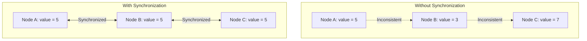
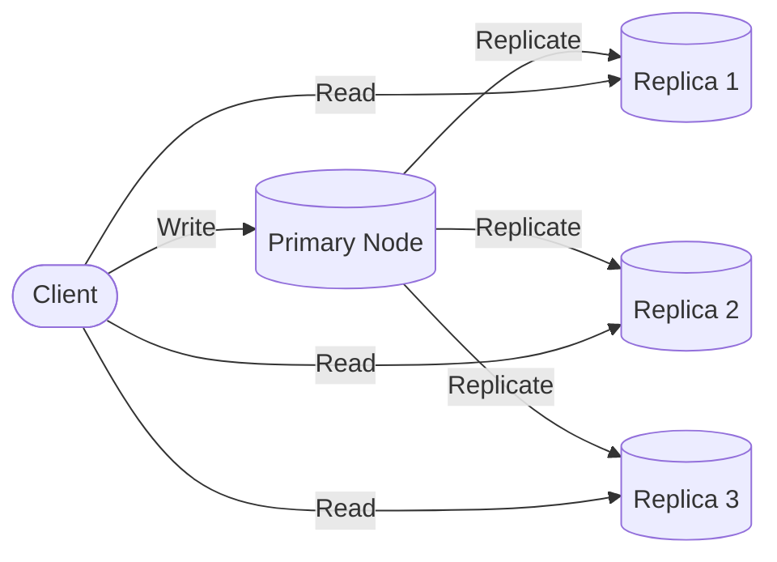
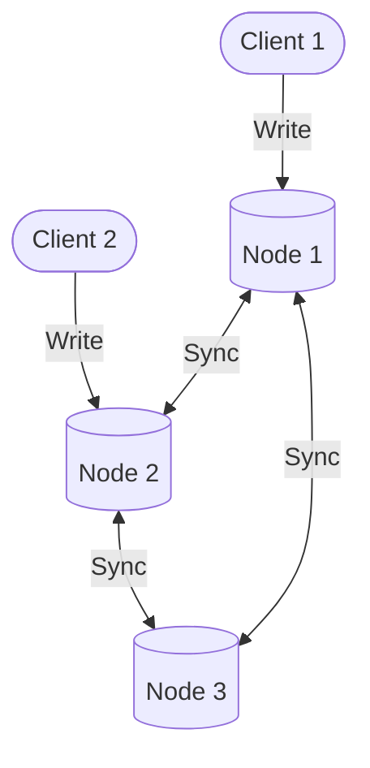
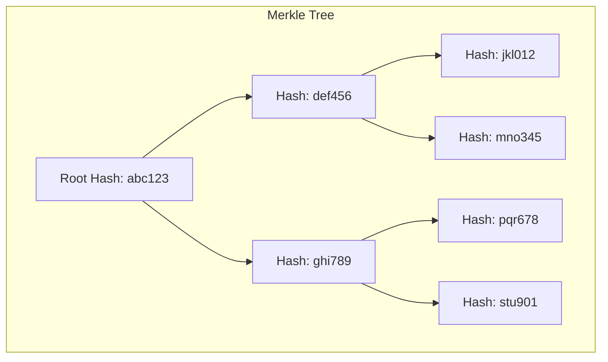
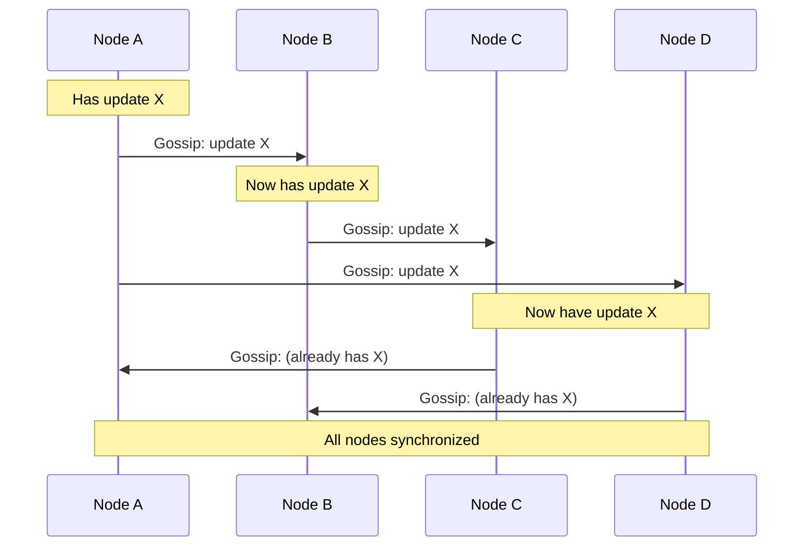
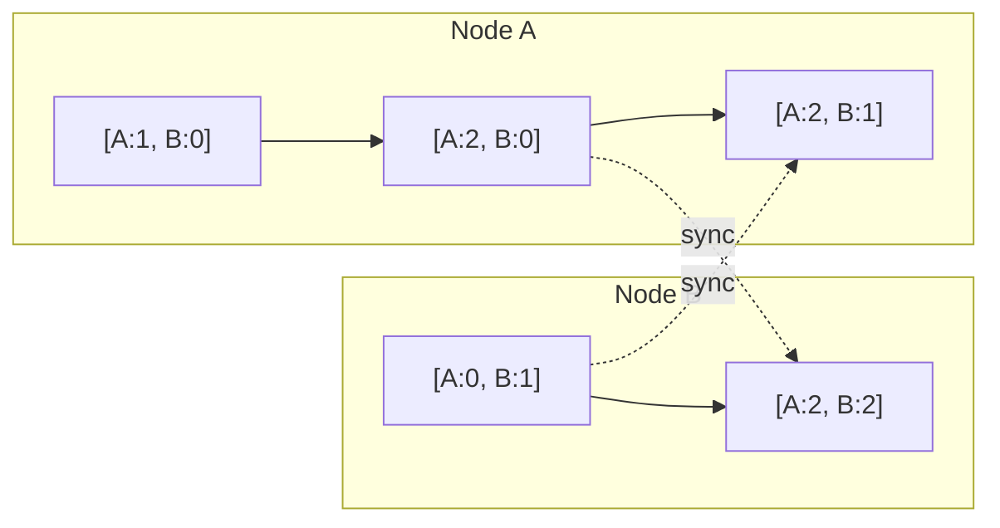
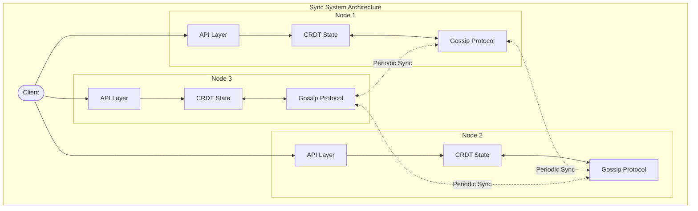

# How to Build State Synchronization

Author: [nawazdhandala](https://github.com/nawazdhandala)

Tags: Distributed Systems, State Management, Replication, Backend

Description: Learn how to synchronize state across distributed system nodes for consistency.

---

State synchronization is one of the most challenging problems in distributed systems. When you have multiple nodes that need to maintain a consistent view of shared data, you must carefully design mechanisms to replicate, propagate, and reconcile state changes. In this post, we will explore the fundamental concepts and practical implementations for building robust state synchronization.

## Why State Synchronization Matters

In a distributed system, multiple nodes often need to share and operate on the same data. Without proper synchronization:

- Nodes may have conflicting views of the data
- Updates may be lost or applied out of order
- The system may become inconsistent, leading to bugs and data corruption



## State Replication Strategies

There are several approaches to replicating state across nodes. The right choice depends on your consistency requirements, latency tolerance, and failure scenarios.

### 1. Primary-Replica Replication

In this model, one node acts as the primary (leader) and handles all writes. Changes are then replicated to replica nodes.



Here is a basic implementation of a primary-replica replication system:

```typescript
// Define the structure for state entries with version tracking
interface StateEntry<T> {
    value: T;
    version: number;      // Monotonically increasing version number
    timestamp: number;    // Unix timestamp for conflict resolution
}

// Define the interface for communication between nodes
interface ReplicationMessage<T> {
    key: string;
    entry: StateEntry<T>;
    sourceNodeId: string;
}

class PrimaryNode<T> {
    private state: Map<string, StateEntry<T>> = new Map();
    private replicas: ReplicaNode<T>[] = [];
    private currentVersion: number = 0;

    // Register a replica node to receive updates
    registerReplica(replica: ReplicaNode<T>): void {
        this.replicas.push(replica);

        // Send full state to new replica for initial sync
        this.sendFullState(replica);
    }

    // Handle write requests from clients
    write(key: string, value: T): void {
        // Increment version for each write operation
        this.currentVersion++;

        const entry: StateEntry<T> = {
            value,
            version: this.currentVersion,
            timestamp: Date.now()
        };

        // Update local state
        this.state.set(key, entry);

        // Replicate to all registered replicas
        this.replicateToAll(key, entry);
    }

    // Propagate the update to all replica nodes
    private replicateToAll(key: string, entry: StateEntry<T>): void {
        const message: ReplicationMessage<T> = {
            key,
            entry,
            sourceNodeId: 'primary'
        };

        // Send update to each replica
        // In production, this would be async with retry logic
        for (const replica of this.replicas) {
            replica.receiveUpdate(message);
        }
    }

    // Send complete state snapshot to a replica
    private sendFullState(replica: ReplicaNode<T>): void {
        for (const [key, entry] of this.state.entries()) {
            const message: ReplicationMessage<T> = {
                key,
                entry,
                sourceNodeId: 'primary'
            };
            replica.receiveUpdate(message);
        }
    }
}

class ReplicaNode<T> {
    private state: Map<string, StateEntry<T>> = new Map();
    private nodeId: string;

    constructor(nodeId: string) {
        this.nodeId = nodeId;
    }

    // Receive and apply updates from the primary
    receiveUpdate(message: ReplicationMessage<T>): void {
        const currentEntry = this.state.get(message.key);

        // Only apply if the incoming version is newer
        // This prevents out-of-order updates from causing issues
        if (!currentEntry || message.entry.version > currentEntry.version) {
            this.state.set(message.key, message.entry);
            console.log(`[${this.nodeId}] Updated ${message.key} to version ${message.entry.version}`);
        }
    }

    // Handle read requests from clients
    read(key: string): T | undefined {
        const entry = this.state.get(key);
        return entry?.value;
    }
}
```

### 2. Multi-Primary Replication

When you need writes to be accepted at any node, multi-primary replication allows concurrent updates. This requires conflict resolution mechanisms.



## Anti-Entropy Protocols

Anti-entropy protocols ensure that divergent replicas eventually converge to the same state. They work by comparing state between nodes and reconciling differences.

### Merkle Trees for Efficient Comparison

Merkle trees allow nodes to efficiently identify which portions of their state differ without comparing every single entry.



Here is an implementation of a Merkle tree for state comparison:

```typescript
import * as crypto from 'crypto';

// Represents a node in the Merkle tree
interface MerkleNode {
    hash: string;
    left?: MerkleNode;
    right?: MerkleNode;
    key?: string;        // Only leaf nodes have keys
    value?: string;      // Only leaf nodes have values
}

class MerkleTree {
    private root: MerkleNode | null = null;
    private leaves: Map<string, MerkleNode> = new Map();

    // Compute SHA-256 hash of input data
    private computeHash(data: string): string {
        return crypto.createHash('sha256').update(data).digest('hex');
    }

    // Build or rebuild the tree from current leaves
    buildTree(data: Map<string, string>): void {
        // Create leaf nodes from the data
        const leafNodes: MerkleNode[] = [];

        // Sort keys for deterministic tree structure
        const sortedKeys = Array.from(data.keys()).sort();

        for (const key of sortedKeys) {
            const value = data.get(key)!;
            const hash = this.computeHash(`${key}:${value}`);
            const leaf: MerkleNode = { hash, key, value };
            leafNodes.push(leaf);
            this.leaves.set(key, leaf);
        }

        // Build tree bottom-up
        this.root = this.buildLevel(leafNodes);
    }

    // Recursively build tree levels from bottom to top
    private buildLevel(nodes: MerkleNode[]): MerkleNode | null {
        if (nodes.length === 0) {
            return null;
        }

        if (nodes.length === 1) {
            return nodes[0];
        }

        const parentNodes: MerkleNode[] = [];

        // Pair up nodes and create parent nodes
        for (let i = 0; i < nodes.length; i += 2) {
            const left = nodes[i];
            const right = nodes[i + 1] || left; // Duplicate last node if odd number

            const combinedHash = this.computeHash(left.hash + right.hash);
            parentNodes.push({
                hash: combinedHash,
                left,
                right: nodes[i + 1] ? right : undefined
            });
        }

        // Recurse to build the next level
        return this.buildLevel(parentNodes);
    }

    // Get the root hash for quick comparison
    getRootHash(): string | null {
        return this.root?.hash || null;
    }

    // Find keys that differ between this tree and another
    findDifferences(otherTree: MerkleTree): string[] {
        const differences: string[] = [];
        this.compareNodes(this.root, otherTree.root, differences);
        return differences;
    }

    // Recursively compare nodes to find differences
    private compareNodes(
        node1: MerkleNode | null,
        node2: MerkleNode | null,
        differences: string[]
    ): void {
        // Handle null cases
        if (!node1 && !node2) {
            return;
        }

        // If one tree has a node the other does not
        if (!node1 || !node2) {
            this.collectAllKeys(node1 || node2, differences);
            return;
        }

        // If hashes match, subtrees are identical
        if (node1.hash === node2.hash) {
            return;
        }

        // If this is a leaf node, record the difference
        if (node1.key) {
            differences.push(node1.key);
            return;
        }

        // Recurse into children
        this.compareNodes(node1.left || null, node2.left || null, differences);
        this.compareNodes(node1.right || null, node2.right || null, differences);
    }

    // Collect all keys from a subtree
    private collectAllKeys(node: MerkleNode | null, keys: string[]): void {
        if (!node) {
            return;
        }

        if (node.key) {
            keys.push(node.key);
            return;
        }

        this.collectAllKeys(node.left || null, keys);
        this.collectAllKeys(node.right || null, keys);
    }
}

// Anti-entropy synchronization using Merkle trees
class AntiEntropySync<T> {
    private localState: Map<string, StateEntry<T>> = new Map();
    private merkleTree: MerkleTree = new MerkleTree();

    // Update local state and rebuild Merkle tree
    updateState(key: string, value: T, version: number): void {
        this.localState.set(key, {
            value,
            version,
            timestamp: Date.now()
        });
        this.rebuildMerkleTree();
    }

    // Rebuild Merkle tree from current state
    private rebuildMerkleTree(): void {
        const stringState = new Map<string, string>();

        for (const [key, entry] of this.localState.entries()) {
            // Include version in hash to detect version differences
            stringState.set(key, JSON.stringify(entry));
        }

        this.merkleTree.buildTree(stringState);
    }

    // Perform anti-entropy sync with another node
    synchronize(otherNode: AntiEntropySync<T>): void {
        // Quick check: if root hashes match, states are identical
        if (this.merkleTree.getRootHash() === otherNode.merkleTree.getRootHash()) {
            console.log('States are identical, no sync needed');
            return;
        }

        // Find differing keys using Merkle tree comparison
        const differences = this.merkleTree.findDifferences(otherNode.merkleTree);
        console.log(`Found ${differences.length} differences to reconcile`);

        // Reconcile each difference
        for (const key of differences) {
            this.reconcileKey(key, otherNode);
        }
    }

    // Reconcile a single key between two nodes
    private reconcileKey(key: string, otherNode: AntiEntropySync<T>): void {
        const localEntry = this.localState.get(key);
        const remoteEntry = otherNode.localState.get(key);

        // Use Last-Writer-Wins for conflict resolution
        // In production, you might use vector clocks or CRDTs
        if (!localEntry && remoteEntry) {
            // We are missing this key, copy from remote
            this.localState.set(key, { ...remoteEntry });
        } else if (localEntry && !remoteEntry) {
            // Remote is missing this key, send to remote
            otherNode.localState.set(key, { ...localEntry });
        } else if (localEntry && remoteEntry) {
            // Both have the key, use higher version or later timestamp
            if (remoteEntry.version > localEntry.version ||
                (remoteEntry.version === localEntry.version &&
                 remoteEntry.timestamp > localEntry.timestamp)) {
                this.localState.set(key, { ...remoteEntry });
            } else {
                otherNode.localState.set(key, { ...localEntry });
            }
        }
    }
}
```

## Gossip Protocols

Gossip protocols, also known as epidemic protocols, spread information through the system similarly to how rumors spread in social networks. Each node periodically selects random peers and exchanges state information.



### Implementing a Gossip Protocol

```typescript
// Gossip message types
type GossipMessageType = 'PUSH' | 'PULL' | 'PUSH_PULL';

interface GossipMessage<T> {
    type: GossipMessageType;
    senderId: string;
    state: Map<string, StateEntry<T>>;
    vectorClock: Map<string, number>;  // For tracking causality
}

class GossipNode<T> {
    private nodeId: string;
    private state: Map<string, StateEntry<T>> = new Map();
    private vectorClock: Map<string, number> = new Map();
    private peers: GossipNode<T>[] = [];
    private gossipInterval: number = 1000;  // Gossip every second

    constructor(nodeId: string) {
        this.nodeId = nodeId;
        this.vectorClock.set(nodeId, 0);
    }

    // Add a peer node for gossip communication
    addPeer(peer: GossipNode<T>): void {
        if (peer.nodeId !== this.nodeId) {
            this.peers.push(peer);
        }
    }

    // Start the gossip protocol
    startGossiping(): void {
        setInterval(() => {
            this.gossipRound();
        }, this.gossipInterval);
    }

    // Perform one round of gossip
    private gossipRound(): void {
        if (this.peers.length === 0) {
            return;
        }

        // Select a random peer
        const randomIndex = Math.floor(Math.random() * this.peers.length);
        const selectedPeer = this.peers[randomIndex];

        // Perform push-pull gossip for bidirectional sync
        this.pushPullGossip(selectedPeer);
    }

    // Push-pull gossip exchanges state in both directions
    private pushPullGossip(peer: GossipNode<T>): void {
        // Send our state to peer
        const message: GossipMessage<T> = {
            type: 'PUSH_PULL',
            senderId: this.nodeId,
            state: new Map(this.state),
            vectorClock: new Map(this.vectorClock)
        };

        // Receive peer's state in response
        const response = peer.receiveGossip(message);

        // Merge the response into our state
        if (response) {
            this.mergeState(response.state, response.vectorClock);
        }
    }

    // Handle incoming gossip message
    receiveGossip(message: GossipMessage<T>): GossipMessage<T> | null {
        console.log(`[${this.nodeId}] Received gossip from ${message.senderId}`);

        // Merge incoming state
        this.mergeState(message.state, message.vectorClock);

        // For push-pull, send back our state
        if (message.type === 'PUSH_PULL') {
            return {
                type: 'PUSH_PULL',
                senderId: this.nodeId,
                state: new Map(this.state),
                vectorClock: new Map(this.vectorClock)
            };
        }

        return null;
    }

    // Merge remote state into local state
    private mergeState(
        remoteState: Map<string, StateEntry<T>>,
        remoteClock: Map<string, number>
    ): void {
        for (const [key, remoteEntry] of remoteState.entries()) {
            const localEntry = this.state.get(key);

            // Determine if we should accept the remote entry
            if (this.shouldAcceptRemote(localEntry, remoteEntry)) {
                this.state.set(key, remoteEntry);
                console.log(`[${this.nodeId}] Merged key ${key} from remote`);
            }
        }

        // Update vector clock to be the max of both clocks
        for (const [nodeId, clock] of remoteClock.entries()) {
            const localClock = this.vectorClock.get(nodeId) || 0;
            this.vectorClock.set(nodeId, Math.max(localClock, clock));
        }
    }

    // Determine if remote entry should replace local entry
    private shouldAcceptRemote(
        local: StateEntry<T> | undefined,
        remote: StateEntry<T>
    ): boolean {
        // Accept if we do not have this key
        if (!local) {
            return true;
        }

        // Accept if remote version is higher
        if (remote.version > local.version) {
            return true;
        }

        // Tie-breaker: use timestamp (Last-Writer-Wins)
        if (remote.version === local.version && remote.timestamp > local.timestamp) {
            return true;
        }

        return false;
    }

    // Write a value locally (will be gossiped to peers)
    write(key: string, value: T): void {
        // Increment our position in the vector clock
        const currentClock = this.vectorClock.get(this.nodeId) || 0;
        this.vectorClock.set(this.nodeId, currentClock + 1);

        // Get current version for this key
        const currentEntry = this.state.get(key);
        const newVersion = (currentEntry?.version || 0) + 1;

        // Create new entry
        const entry: StateEntry<T> = {
            value,
            version: newVersion,
            timestamp: Date.now()
        };

        this.state.set(key, entry);
        console.log(`[${this.nodeId}] Wrote ${key}=${JSON.stringify(value)} (v${newVersion})`);
    }

    // Read a value from local state
    read(key: string): T | undefined {
        return this.state.get(key)?.value;
    }

    // Get all keys in local state
    getKeys(): string[] {
        return Array.from(this.state.keys());
    }
}
```

### Tunable Gossip Parameters

Gossip protocols have several parameters you can tune based on your requirements:

| Parameter | Description | Trade-off |
|-----------|-------------|-----------|
| Fanout | Number of peers to gossip with per round | Higher = faster propagation, more bandwidth |
| Interval | Time between gossip rounds | Lower = faster sync, more CPU and network |
| TTL | How many hops a message can travel | Higher = better reach, potential duplicates |

```typescript
interface GossipConfig {
    fanout: number;           // Number of random peers per round
    intervalMs: number;       // Milliseconds between gossip rounds
    maxMessageAge: number;    // Maximum age of messages to propagate
}

class ConfigurableGossipNode<T> extends GossipNode<T> {
    private config: GossipConfig;

    constructor(nodeId: string, config: GossipConfig) {
        super(nodeId);
        this.config = config;
    }

    // Override gossip round to respect fanout setting
    protected gossipRound(): void {
        const peers = this.getRandomPeers(this.config.fanout);

        for (const peer of peers) {
            this.pushPullGossip(peer);
        }
    }

    // Select random subset of peers
    private getRandomPeers(count: number): GossipNode<T>[] {
        const allPeers = this.getPeers();
        const shuffled = allPeers.sort(() => Math.random() - 0.5);
        return shuffled.slice(0, Math.min(count, shuffled.length));
    }

    // Abstract method to get peers list
    protected getPeers(): GossipNode<T>[] {
        // Implementation would return the peers array
        return [];
    }

    // Abstract method for push-pull gossip
    protected pushPullGossip(peer: GossipNode<T>): void {
        // Implementation would handle the gossip exchange
    }
}
```

## Conflict Resolution Strategies

When multiple nodes can write concurrently, conflicts are inevitable. Here are common strategies to handle them:

### 1. Last-Writer-Wins (LWW)

The simplest approach: the write with the latest timestamp wins.

```typescript
function resolveWithLWW<T>(
    entry1: StateEntry<T>,
    entry2: StateEntry<T>
): StateEntry<T> {
    // Compare timestamps, higher wins
    if (entry1.timestamp > entry2.timestamp) {
        return entry1;
    } else if (entry2.timestamp > entry1.timestamp) {
        return entry2;
    }

    // Tie-breaker: compare by some deterministic criteria
    // Using JSON string comparison as an example
    const str1 = JSON.stringify(entry1.value);
    const str2 = JSON.stringify(entry2.value);
    return str1 > str2 ? entry1 : entry2;
}
```

### 2. Vector Clocks

Vector clocks track causality, allowing you to determine if events are concurrent or one happened before another.



```typescript
class VectorClock {
    private clock: Map<string, number> = new Map();

    constructor(nodeId?: string) {
        if (nodeId) {
            this.clock.set(nodeId, 0);
        }
    }

    // Increment the clock for a specific node
    increment(nodeId: string): void {
        const current = this.clock.get(nodeId) || 0;
        this.clock.set(nodeId, current + 1);
    }

    // Merge with another vector clock (take max of each component)
    merge(other: VectorClock): void {
        for (const [nodeId, value] of other.clock.entries()) {
            const current = this.clock.get(nodeId) || 0;
            this.clock.set(nodeId, Math.max(current, value));
        }
    }

    // Compare two vector clocks
    // Returns: 'before' | 'after' | 'concurrent' | 'equal'
    compare(other: VectorClock): 'before' | 'after' | 'concurrent' | 'equal' {
        let dominated = false;   // This clock is dominated by other
        let dominates = false;   // This clock dominates other

        // Get all unique node IDs
        const allNodeIds = new Set([
            ...this.clock.keys(),
            ...other.clock.keys()
        ]);

        for (const nodeId of allNodeIds) {
            const thisValue = this.clock.get(nodeId) || 0;
            const otherValue = other.clock.get(nodeId) || 0;

            if (thisValue < otherValue) {
                dominated = true;
            } else if (thisValue > otherValue) {
                dominates = true;
            }
        }

        if (dominated && dominates) {
            return 'concurrent';  // Neither dominates, events are concurrent
        } else if (dominated) {
            return 'before';      // This happened before other
        } else if (dominates) {
            return 'after';       // This happened after other
        } else {
            return 'equal';       // Clocks are identical
        }
    }

    // Create a copy of this vector clock
    clone(): VectorClock {
        const copy = new VectorClock();
        for (const [nodeId, value] of this.clock.entries()) {
            copy.clock.set(nodeId, value);
        }
        return copy;
    }

    // Convert to string for debugging
    toString(): string {
        const entries = Array.from(this.clock.entries())
            .map(([k, v]) => `${k}:${v}`)
            .join(', ');
        return `[${entries}]`;
    }
}

// Entry with vector clock for causal tracking
interface CausalEntry<T> {
    value: T;
    vectorClock: VectorClock;
}

// Resolve conflicts using vector clocks
function resolveWithVectorClocks<T>(
    entry1: CausalEntry<T>,
    entry2: CausalEntry<T>
): CausalEntry<T> | CausalEntry<T>[] {
    const comparison = entry1.vectorClock.compare(entry2.vectorClock);

    switch (comparison) {
        case 'before':
            // entry1 happened before entry2, entry2 is newer
            return entry2;
        case 'after':
            // entry1 happened after entry2, entry1 is newer
            return entry1;
        case 'equal':
            // Same version
            return entry1;
        case 'concurrent':
            // Concurrent updates, return both (let application decide)
            return [entry1, entry2];
    }
}
```

### 3. CRDTs (Conflict-free Replicated Data Types)

CRDTs are data structures designed to be merged without conflicts. They guarantee eventual consistency without coordination.

```typescript
// G-Counter: A grow-only counter CRDT
class GCounter {
    private counts: Map<string, number> = new Map();
    private nodeId: string;

    constructor(nodeId: string) {
        this.nodeId = nodeId;
        this.counts.set(nodeId, 0);
    }

    // Increment the counter (only our node's count)
    increment(): void {
        const current = this.counts.get(this.nodeId) || 0;
        this.counts.set(this.nodeId, current + 1);
    }

    // Get the total count across all nodes
    value(): number {
        let total = 0;
        for (const count of this.counts.values()) {
            total += count;
        }
        return total;
    }

    // Merge with another G-Counter
    merge(other: GCounter): void {
        for (const [nodeId, count] of other.counts.entries()) {
            const current = this.counts.get(nodeId) || 0;
            // Take the maximum for each node
            this.counts.set(nodeId, Math.max(current, count));
        }
    }

    // Get state for replication
    getState(): Map<string, number> {
        return new Map(this.counts);
    }
}

// PN-Counter: Supports both increment and decrement
class PNCounter {
    private increments: GCounter;
    private decrements: GCounter;

    constructor(nodeId: string) {
        this.increments = new GCounter(nodeId);
        this.decrements = new GCounter(nodeId);
    }

    increment(): void {
        this.increments.increment();
    }

    decrement(): void {
        this.decrements.increment();
    }

    value(): number {
        return this.increments.value() - this.decrements.value();
    }

    merge(other: PNCounter): void {
        this.increments.merge(other.increments);
        this.decrements.merge(other.decrements);
    }
}

// LWW-Register: Last-Writer-Wins Register CRDT
class LWWRegister<T> {
    private value_: T | null = null;
    private timestamp_: number = 0;
    private nodeId: string;

    constructor(nodeId: string) {
        this.nodeId = nodeId;
    }

    // Set the value with current timestamp
    set(value: T): void {
        this.value_ = value;
        // Use high-resolution timestamp plus node ID for uniqueness
        this.timestamp_ = Date.now() * 1000 + this.nodeId.charCodeAt(0);
    }

    // Get the current value
    get(): T | null {
        return this.value_;
    }

    // Merge with another LWW-Register
    merge(other: LWWRegister<T>): void {
        // Higher timestamp wins
        if (other.timestamp_ > this.timestamp_) {
            this.value_ = other.value_;
            this.timestamp_ = other.timestamp_;
        }
    }

    // Get state for replication
    getState(): { value: T | null; timestamp: number } {
        return {
            value: this.value_,
            timestamp: this.timestamp_
        };
    }
}
```

## Putting It All Together: A Complete Sync System

Here is a complete example combining gossip protocol with CRDT-based state:



```typescript
// Complete distributed state synchronization system
interface SyncSystemConfig {
    nodeId: string;
    gossipIntervalMs: number;
    gossipFanout: number;
    antiEntropyIntervalMs: number;
}

class DistributedStateSync {
    private nodeId: string;
    private config: SyncSystemConfig;

    // CRDT-based state storage
    private counters: Map<string, PNCounter> = new Map();
    private registers: Map<string, LWWRegister<any>> = new Map();

    // Peer management
    private peers: DistributedStateSync[] = [];

    // Merkle tree for anti-entropy
    private merkleTree: MerkleTree = new MerkleTree();

    // Vector clock for causality tracking
    private vectorClock: VectorClock;

    constructor(config: SyncSystemConfig) {
        this.nodeId = config.nodeId;
        this.config = config;
        this.vectorClock = new VectorClock(config.nodeId);
    }

    // Start the synchronization background processes
    start(): void {
        // Start gossip protocol
        setInterval(() => {
            this.gossipRound();
        }, this.config.gossipIntervalMs);

        // Start anti-entropy process
        setInterval(() => {
            this.antiEntropyRound();
        }, this.config.antiEntropyIntervalMs);

        console.log(`[${this.nodeId}] Sync system started`);
    }

    // Register a peer for synchronization
    addPeer(peer: DistributedStateSync): void {
        if (peer.nodeId !== this.nodeId) {
            this.peers.push(peer);
            console.log(`[${this.nodeId}] Added peer: ${peer.nodeId}`);
        }
    }

    // Counter operations
    incrementCounter(name: string): void {
        let counter = this.counters.get(name);
        if (!counter) {
            counter = new PNCounter(this.nodeId);
            this.counters.set(name, counter);
        }
        counter.increment();
        this.vectorClock.increment(this.nodeId);
        this.updateMerkleTree();
    }

    decrementCounter(name: string): void {
        let counter = this.counters.get(name);
        if (!counter) {
            counter = new PNCounter(this.nodeId);
            this.counters.set(name, counter);
        }
        counter.decrement();
        this.vectorClock.increment(this.nodeId);
        this.updateMerkleTree();
    }

    getCounter(name: string): number {
        const counter = this.counters.get(name);
        return counter ? counter.value() : 0;
    }

    // Register operations
    setRegister<T>(name: string, value: T): void {
        let register = this.registers.get(name) as LWWRegister<T>;
        if (!register) {
            register = new LWWRegister<T>(this.nodeId);
            this.registers.set(name, register);
        }
        register.set(value);
        this.vectorClock.increment(this.nodeId);
        this.updateMerkleTree();
    }

    getRegister<T>(name: string): T | null {
        const register = this.registers.get(name) as LWWRegister<T>;
        return register ? register.get() : null;
    }

    // Gossip round: exchange state with random peers
    private gossipRound(): void {
        // Select random peers based on fanout
        const selectedPeers = this.selectRandomPeers(this.config.gossipFanout);

        for (const peer of selectedPeers) {
            this.exchangeState(peer);
        }
    }

    // Select random subset of peers
    private selectRandomPeers(count: number): DistributedStateSync[] {
        const shuffled = [...this.peers].sort(() => Math.random() - 0.5);
        return shuffled.slice(0, Math.min(count, shuffled.length));
    }

    // Exchange state with a peer
    private exchangeState(peer: DistributedStateSync): void {
        // Send our counters
        for (const [name, counter] of this.counters.entries()) {
            let peerCounter = peer.counters.get(name);
            if (!peerCounter) {
                peerCounter = new PNCounter(peer.nodeId);
                peer.counters.set(name, peerCounter);
            }
            peerCounter.merge(counter);
            counter.merge(peerCounter);
        }

        // Send our registers
        for (const [name, register] of this.registers.entries()) {
            let peerRegister = peer.registers.get(name);
            if (!peerRegister) {
                peerRegister = new LWWRegister(peer.nodeId);
                peer.registers.set(name, peerRegister);
            }
            peerRegister.merge(register);
            register.merge(peerRegister);
        }

        // Merge vector clocks
        this.vectorClock.merge(peer.vectorClock);
        peer.vectorClock.merge(this.vectorClock);
    }

    // Anti-entropy round: use Merkle trees to find and fix differences
    private antiEntropyRound(): void {
        for (const peer of this.peers) {
            // Compare Merkle tree roots for quick check
            if (this.merkleTree.getRootHash() !== peer.merkleTree.getRootHash()) {
                // Find specific differences
                const differences = this.merkleTree.findDifferences(peer.merkleTree);

                if (differences.length > 0) {
                    console.log(`[${this.nodeId}] Anti-entropy found ${differences.length} differences with ${peer.nodeId}`);

                    // Reconcile differences
                    for (const key of differences) {
                        this.reconcileKey(key, peer);
                    }
                }
            }
        }
    }

    // Reconcile a specific key with a peer
    private reconcileKey(key: string, peer: DistributedStateSync): void {
        // Check if it is a counter or register
        if (key.startsWith('counter:')) {
            const name = key.substring(8);
            const local = this.counters.get(name);
            const remote = peer.counters.get(name);

            if (local && remote) {
                local.merge(remote);
                remote.merge(local);
            } else if (remote && !local) {
                const newCounter = new PNCounter(this.nodeId);
                newCounter.merge(remote);
                this.counters.set(name, newCounter);
            }
        } else if (key.startsWith('register:')) {
            const name = key.substring(9);
            const local = this.registers.get(name);
            const remote = peer.registers.get(name);

            if (local && remote) {
                local.merge(remote);
                remote.merge(local);
            } else if (remote && !local) {
                const newRegister = new LWWRegister(this.nodeId);
                newRegister.merge(remote);
                this.registers.set(name, newRegister);
            }
        }
    }

    // Update Merkle tree after state changes
    private updateMerkleTree(): void {
        const stateMap = new Map<string, string>();

        // Add counters to state map
        for (const [name, counter] of this.counters.entries()) {
            stateMap.set(`counter:${name}`, String(counter.value()));
        }

        // Add registers to state map
        for (const [name, register] of this.registers.entries()) {
            const state = register.getState();
            stateMap.set(`register:${name}`, JSON.stringify(state));
        }

        this.merkleTree.buildTree(stateMap);
    }

    // Get current state summary for debugging
    getStateSummary(): object {
        const counters: Record<string, number> = {};
        const registers: Record<string, any> = {};

        for (const [name, counter] of this.counters.entries()) {
            counters[name] = counter.value();
        }

        for (const [name, register] of this.registers.entries()) {
            registers[name] = register.get();
        }

        return {
            nodeId: this.nodeId,
            vectorClock: this.vectorClock.toString(),
            counters,
            registers
        };
    }
}

// Example usage
function demonstrateSyncSystem(): void {
    // Create three nodes
    const node1 = new DistributedStateSync({
        nodeId: 'node-1',
        gossipIntervalMs: 1000,
        gossipFanout: 2,
        antiEntropyIntervalMs: 5000
    });

    const node2 = new DistributedStateSync({
        nodeId: 'node-2',
        gossipIntervalMs: 1000,
        gossipFanout: 2,
        antiEntropyIntervalMs: 5000
    });

    const node3 = new DistributedStateSync({
        nodeId: 'node-3',
        gossipIntervalMs: 1000,
        gossipFanout: 2,
        antiEntropyIntervalMs: 5000
    });

    // Connect peers
    node1.addPeer(node2);
    node1.addPeer(node3);
    node2.addPeer(node1);
    node2.addPeer(node3);
    node3.addPeer(node1);
    node3.addPeer(node2);

    // Start sync systems
    node1.start();
    node2.start();
    node3.start();

    // Perform operations on different nodes
    node1.incrementCounter('page-views');
    node1.incrementCounter('page-views');
    node2.incrementCounter('page-views');
    node3.setRegister('config', { theme: 'dark', language: 'en' });

    // After gossip rounds, all nodes will have consistent state
    setTimeout(() => {
        console.log('Node 1 state:', node1.getStateSummary());
        console.log('Node 2 state:', node2.getStateSummary());
        console.log('Node 3 state:', node3.getStateSummary());
    }, 3000);
}
```

## Best Practices for State Synchronization

1. **Choose the right consistency model**: Strong consistency (like Raft or Paxos) when correctness is critical; eventual consistency (like gossip) when availability and partition tolerance matter more.

2. **Use appropriate conflict resolution**: LWW is simple but can lose updates. CRDTs are more complex but guarantee no data loss. Vector clocks help detect conflicts but require application-level resolution.

3. **Implement idempotency**: Ensure that applying the same update multiple times has the same effect as applying it once.

4. **Monitor synchronization lag**: Track how long it takes for updates to propagate across nodes. Alert when lag exceeds acceptable thresholds.

5. **Handle network partitions gracefully**: Design your system to continue operating during partitions and reconcile when connectivity is restored.

6. **Test with chaos engineering**: Simulate network failures, node crashes, and message delays to verify your sync system handles edge cases correctly.

## Conclusion

Building state synchronization for distributed systems requires careful consideration of consistency requirements, failure modes, and performance trade-offs. By combining techniques like gossip protocols, anti-entropy mechanisms, and CRDTs, you can build robust systems that maintain consistency across nodes while tolerating failures and network partitions.

The key is to start with your requirements: How fresh does the data need to be? What happens when nodes disagree? How should the system behave during network partitions? Once you understand these requirements, you can select and combine the appropriate synchronization primitives to build a solution that meets your needs.

Remember that there is no one-size-fits-all solution. The best approach depends on your specific use case, and you may need to combine multiple techniques to achieve the right balance of consistency, availability, and partition tolerance for your system.
