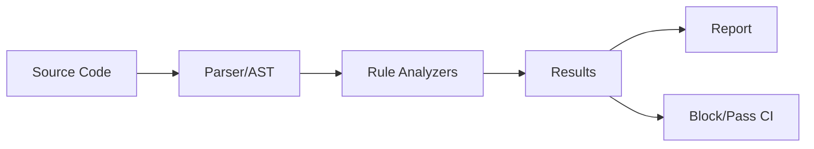
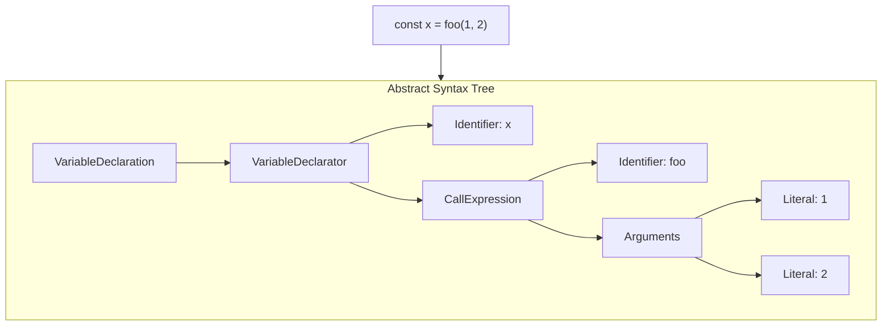
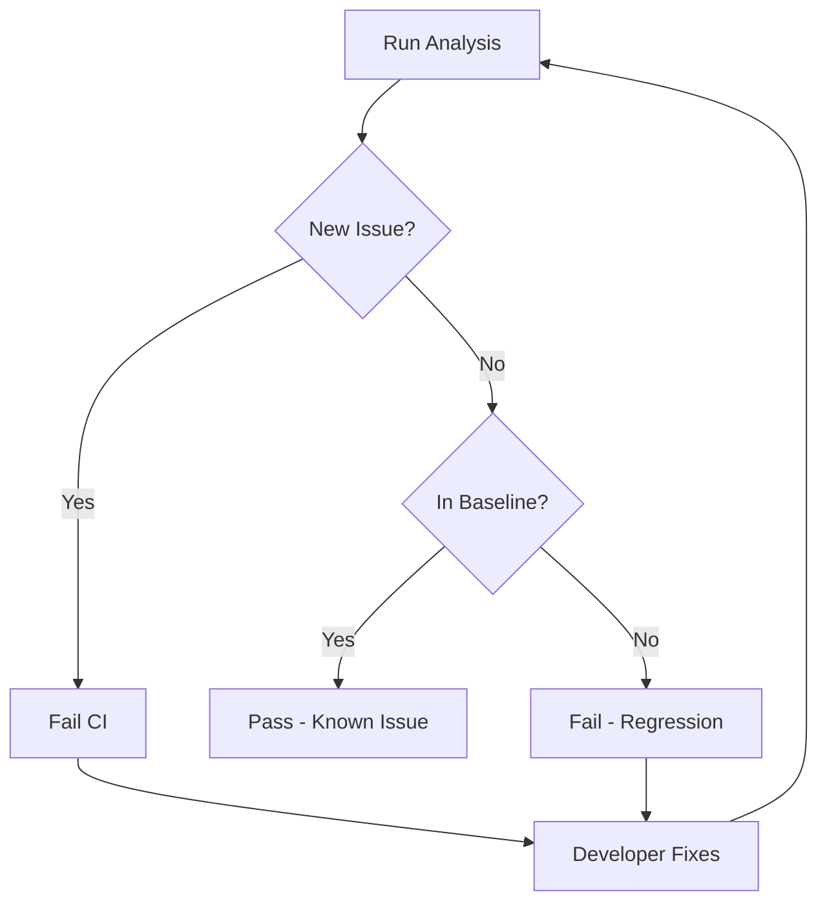
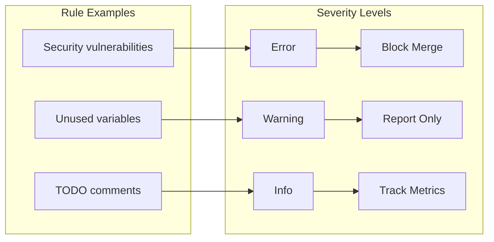

# How to Implement Static Analysis

Author: [nawazdhandala](https://github.com/nawazdhandala)

Tags: Developer Experience, Static Analysis, Code Quality, Security

Description: Learn to implement static analysis with tool configuration, custom rules, and CI/CD integration for automated code quality enforcement.

---

Static analysis examines your code without executing it. It catches bugs, security vulnerabilities, and style violations before they reach production. This guide covers practical implementation - from choosing tools to enforcing rules in CI/CD pipelines.

## What Static Analysis Does



Static analyzers perform several types of checks:

| Analysis Type | What It Catches | Example |
|---------------|-----------------|---------|
| Syntax | Invalid code structure | Missing semicolons, unmatched brackets |
| Type | Type mismatches | Passing string to number parameter |
| Style | Formatting violations | Inconsistent indentation, naming |
| Security | Vulnerabilities | SQL injection, XSS, hardcoded secrets |
| Complexity | Maintainability issues | Deeply nested code, long functions |
| Dead Code | Unused declarations | Unreachable branches, unused imports |

## Choosing the Right Tools

Different languages have different ecosystems. Here are battle-tested options:

### JavaScript/TypeScript

```bash
# ESLint - linting and style
npm install --save-dev eslint @typescript-eslint/parser @typescript-eslint/eslint-plugin

# TypeScript - type checking
npm install --save-dev typescript
```

### Python

```bash
# Ruff - fast linter (replaces flake8, isort, pyupgrade)
pip install ruff

# mypy - type checking
pip install mypy

# Bandit - security analysis
pip install bandit
```

### Go

```bash
# golangci-lint - aggregates multiple linters
go install github.com/golangci/golangci-lint/cmd/golangci-lint@latest

# staticcheck - advanced static analysis
go install honnef.co/go/tools/cmd/staticcheck@latest
```

### Multi-Language

```bash
# SonarQube - comprehensive analysis platform
# Semgrep - security-focused, custom rules
# CodeQL - deep semantic analysis (GitHub)
```

## Basic Configuration

### ESLint for TypeScript

Create `.eslintrc.js`:

```javascript
module.exports = {
  root: true,
  parser: '@typescript-eslint/parser',
  parserOptions: {
    project: './tsconfig.json',
    ecmaVersion: 2022,
    sourceType: 'module',
  },
  plugins: ['@typescript-eslint'],
  extends: [
    'eslint:recommended',
    'plugin:@typescript-eslint/recommended',
    'plugin:@typescript-eslint/recommended-requiring-type-checking',
  ],
  rules: {
    // Catch common bugs
    'no-console': 'warn',
    '@typescript-eslint/no-unused-vars': 'error',
    '@typescript-eslint/no-floating-promises': 'error',

    // Enforce consistency
    '@typescript-eslint/explicit-function-return-type': 'warn',
    '@typescript-eslint/naming-convention': [
      'error',
      { selector: 'interface', format: ['PascalCase'] },
      { selector: 'typeAlias', format: ['PascalCase'] },
    ],
  },
  ignorePatterns: ['dist/', 'node_modules/', '*.js'],
};
```

### Ruff for Python

Create `pyproject.toml`:

```toml
[tool.ruff]
target-version = "py311"
line-length = 100
select = [
    "E",   # pycodestyle errors
    "W",   # pycodestyle warnings
    "F",   # Pyflakes
    "I",   # isort
    "B",   # flake8-bugbear
    "C4",  # flake8-comprehensions
    "S",   # flake8-bandit (security)
    "UP",  # pyupgrade
]
ignore = [
    "E501",  # line too long (handled by formatter)
]

[tool.ruff.per-file-ignores]
"tests/*" = ["S101"]  # Allow assert in tests

[tool.ruff.isort]
known-first-party = ["myproject"]
```

### golangci-lint for Go

Create `.golangci.yml`:

```yaml
run:
  timeout: 5m
  tests: true

linters:
  enable:
    - errcheck      # Check error returns
    - gosimple      # Simplify code
    - govet         # Report suspicious constructs
    - ineffassign   # Detect ineffectual assignments
    - staticcheck   # Advanced static analysis
    - unused        # Check unused code
    - gosec         # Security checks
    - bodyclose     # HTTP body close check
    - contextcheck  # Context usage
    - nilerr        # nil error returns
    - exhaustive    # Exhaustive switch statements

linters-settings:
  govet:
    check-shadowing: true
  gosec:
    excludes:
      - G104  # Audit errors not checked
  errcheck:
    check-type-assertions: true

issues:
  exclude-rules:
    - path: _test\.go
      linters:
        - gosec
```

## Writing Custom Rules

Sometimes built-in rules are not enough. Here is how to write custom checks.

### ESLint Custom Rule

Create `eslint-rules/no-moment.js`:

```javascript
// Enforce using date-fns instead of moment.js
module.exports = {
  meta: {
    type: 'suggestion',
    docs: {
      description: 'Disallow moment.js imports (use date-fns instead)',
    },
    fixable: null,
    schema: [],
  },
  create(context) {
    return {
      ImportDeclaration(node) {
        if (node.source.value === 'moment') {
          context.report({
            node,
            message: 'Use date-fns instead of moment.js for smaller bundle size.',
          });
        }
      },
      CallExpression(node) {
        if (
          node.callee.name === 'require' &&
          node.arguments[0]?.value === 'moment'
        ) {
          context.report({
            node,
            message: 'Use date-fns instead of moment.js for smaller bundle size.',
          });
        }
      },
    };
  },
};
```

Register in `.eslintrc.js`:

```javascript
module.exports = {
  // ... other config
  plugins: ['@typescript-eslint', 'local-rules'],
  rules: {
    'local-rules/no-moment': 'error',
  },
};
```

### Semgrep Custom Rule

Create `rules/no-hardcoded-secrets.yaml`:

```yaml
rules:
  - id: hardcoded-api-key
    patterns:
      - pattern-either:
          - pattern: |
              $KEY = "...$SECRET..."
          - pattern: |
              api_key = "..."
          - pattern: |
              apiKey: "..."
    pattern-regex: '(api[_-]?key|secret|password|token)\s*[=:]\s*["\'][^"\']{8,}["\']'
    message: "Hardcoded secret detected. Use environment variables instead."
    languages: [python, javascript, typescript, go]
    severity: ERROR
    metadata:
      category: security
      cwe: "CWE-798: Use of Hard-coded Credentials"
```

Run with:

```bash
semgrep --config rules/ .
```

### AST-Based Analysis Pattern

Understanding AST (Abstract Syntax Tree) helps write better rules:



Use AST explorers to understand code structure:
- JavaScript/TypeScript: https://astexplorer.net
- Python: https://python-ast-explorer.com
- Go: https://goast.yuroyoro.net

## CI/CD Integration

### GitHub Actions

Create `.github/workflows/lint.yml`:

```yaml
name: Static Analysis

on:
  push:
    branches: [main]
  pull_request:
    branches: [main]

jobs:
  lint:
    runs-on: ubuntu-latest
    steps:
      - uses: actions/checkout@v4

      - name: Setup Node.js
        uses: actions/setup-node@v4
        with:
          node-version: '20'
          cache: 'npm'

      - name: Install dependencies
        run: npm ci

      - name: Run ESLint
        run: npm run lint -- --format=json --output-file=eslint-report.json
        continue-on-error: true

      - name: Upload ESLint report
        uses: actions/upload-artifact@v4
        with:
          name: eslint-report
          path: eslint-report.json

      - name: Annotate PR with lint errors
        uses: ataylorme/eslint-annotate-action@v3
        with:
          report-json: eslint-report.json

      - name: Fail if errors
        run: npm run lint

  security:
    runs-on: ubuntu-latest
    steps:
      - uses: actions/checkout@v4

      - name: Run Semgrep
        uses: returntocorp/semgrep-action@v1
        with:
          config: >-
            p/security-audit
            p/secrets
```

### GitLab CI

Create `.gitlab-ci.yml`:

```yaml
stages:
  - lint
  - security

lint:
  stage: lint
  image: node:20
  script:
    - npm ci
    - npm run lint
  rules:
    - if: $CI_PIPELINE_SOURCE == "merge_request_event"
    - if: $CI_COMMIT_BRANCH == $CI_DEFAULT_BRANCH

security-scan:
  stage: security
  image: returntocorp/semgrep
  script:
    - semgrep ci --config auto
  rules:
    - if: $CI_PIPELINE_SOURCE == "merge_request_event"
```

### Pre-commit Hooks

Create `.pre-commit-config.yaml`:

```yaml
repos:
  - repo: local
    hooks:
      - id: eslint
        name: ESLint
        entry: npm run lint --
        language: system
        files: \.(ts|tsx|js|jsx)$
        pass_filenames: true

  - repo: https://github.com/astral-sh/ruff-pre-commit
    rev: v0.1.9
    hooks:
      - id: ruff
        args: [--fix]
      - id: ruff-format

  - repo: https://github.com/pre-commit/pre-commit-hooks
    rev: v4.5.0
    hooks:
      - id: check-yaml
      - id: check-json
      - id: detect-private-key
      - id: trailing-whitespace
```

Install hooks:

```bash
pip install pre-commit
pre-commit install
```

## Handling Baseline and Legacy Code

Large codebases cannot fix all issues at once. Use baselines to track existing issues while preventing new ones.

### The Baseline Workflow



### ESLint Baseline Strategy

Option 1 - Disable rules per file:

```javascript
/* eslint-disable @typescript-eslint/no-explicit-any */
// Legacy code - TODO: refactor in Q2
export function oldFunction(data: any): any {
  // ...
}
/* eslint-enable @typescript-eslint/no-explicit-any */
```

Option 2 - Separate config for legacy:

```javascript
// .eslintrc.legacy.js
module.exports = {
  extends: './.eslintrc.js',
  rules: {
    '@typescript-eslint/no-explicit-any': 'warn',  // Warn instead of error
    '@typescript-eslint/no-unsafe-assignment': 'off',
  },
};
```

### Ruff Baseline

Use `--add-noqa` to add inline ignores for existing issues:

```bash
# Generate noqa comments for all existing issues
ruff check --add-noqa .

# Then enforce no new issues
ruff check .
```

### SonarQube New Code Period

Configure in `sonar-project.properties`:

```properties
sonar.projectKey=myproject
sonar.newCode.referenceBranch=main
```

This compares against the main branch, only failing on new issues.

### Semgrep Baseline

```bash
# Generate baseline
semgrep --config auto --baseline-commit HEAD~50 .
```

## Severity Levels and Enforcement

Configure different rules for different severities:



### Tiered Enforcement Example

```javascript
// .eslintrc.js
module.exports = {
  rules: {
    // ERRORS - Block merge
    'no-eval': 'error',
    '@typescript-eslint/no-floating-promises': 'error',
    'no-debugger': 'error',

    // WARNINGS - Track, fix when possible
    'no-console': 'warn',
    '@typescript-eslint/no-explicit-any': 'warn',
    'complexity': ['warn', 15],

    // OFF in CI, ON in IDE
    // (configured via --rule flag or separate config)
    'no-warning-comments': 'off',
  },
};
```

CI configuration to fail only on errors:

```bash
# Fail on errors, allow warnings
eslint . --max-warnings 100
```

## Measuring Code Quality Over Time

Track metrics to ensure quality improves:

```bash
# ESLint with JSON output for metrics
eslint . --format json > eslint-results.json

# Parse and track
node -e "
const results = require('./eslint-results.json');
const totals = results.reduce((acc, file) => ({
  errors: acc.errors + file.errorCount,
  warnings: acc.warnings + file.warningCount
}), { errors: 0, warnings: 0 });
console.log(JSON.stringify(totals));
"
```

Store and visualize trends:

| Week | Errors | Warnings | Files Analyzed |
|------|--------|----------|----------------|
| 1    | 247    | 892      | 156            |
| 2    | 198    | 845      | 162            |
| 3    | 142    | 801      | 168            |
| 4    | 89     | 756      | 175            |

## Common Pitfalls

### 1. Too Many Rules at Once

Bad approach:

```bash
# Enable everything, watch team revolt
eslint --rule "{ semi: error }" --rule "{ quotes: error }" ...
```

Better approach - start minimal:

```javascript
// Phase 1: Critical only
extends: ['eslint:recommended'],

// Phase 2: Add TypeScript (month 2)
extends: ['eslint:recommended', 'plugin:@typescript-eslint/recommended'],

// Phase 3: Strict mode (month 4)
extends: ['plugin:@typescript-eslint/strict'],
```

### 2. Ignoring False Positives

When a rule consistently produces false positives, tune it:

```javascript
// Instead of disabling entirely
'@typescript-eslint/no-unsafe-assignment': 'off',  // Bad

// Tune for your codebase
'@typescript-eslint/no-unsafe-assignment': ['error', {
  // Allow specific patterns
}],
```

### 3. No IDE Integration

Developers should see issues before commit:

```json
// .vscode/settings.json
{
  "editor.codeActionsOnSave": {
    "source.fixAll.eslint": true
  },
  "eslint.validate": [
    "javascript",
    "typescript",
    "typescriptreact"
  ]
}
```

### 4. Slow Analysis

Cache results to speed up local development:

```bash
# ESLint
eslint . --cache --cache-location .eslintcache

# Ruff (caching enabled by default)
ruff check . --cache-dir .ruff_cache

# golangci-lint
golangci-lint run --new-from-rev=HEAD~1
```

## Summary

Static analysis is most effective when:

1. **Start simple** - Begin with recommended configs, add rules gradually
2. **Integrate early** - Run in CI/CD and pre-commit hooks
3. **Baseline existing issues** - Do not block on legacy code
4. **Track metrics** - Monitor trends over time
5. **Tune continuously** - Adjust rules based on team feedback

The goal is not zero warnings. The goal is catching bugs before users do, enforcing consistency across the team, and making code reviews faster by automating the tedious parts.

---

**Related Reading:**
- [SRE Best Practices](https://oneuptime.com/blog/post/2025-11-28-sre-best-practices/view)
- [The Hidden Costs of Dependency Bloat](https://oneuptime.com/blog/post/2025-09-02-the-hidden-costs-of-dependency-bloat-in-software-development/view)
