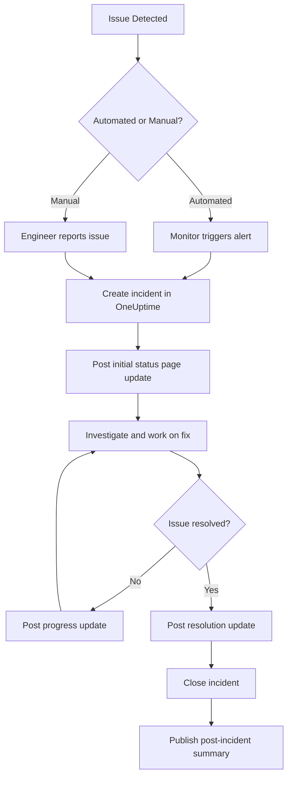
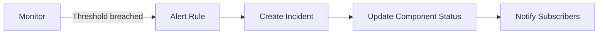
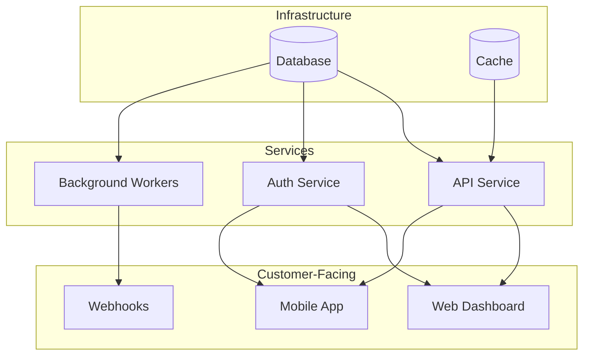

# How to Implement Status Page Updates

Author: [nawazdhandala](https://github.com/nawazdhandala)

Tags: Status Page, Communication, Incident Management, SRE

Description: A practical guide to implementing status page updates that keep customers informed during incidents, maintenance windows, and component state changes.

---

Your status page is only as useful as the updates you publish. A blank page during an outage is worse than no page at all. This guide covers the mechanics of status page updates: when to post, what to say, and how to automate the process so your team communicates clearly without adding cognitive load during stressful incidents.

---

## The anatomy of a status page update

Every status page update should answer three questions for the reader:

1. **What is happening?** A clear description of the issue or event.
2. **Who is affected?** Which services, regions, or customer segments are impacted.
3. **What happens next?** The expected timeline or next checkpoint for more information.

Keep updates short but specific. Customers want facts, not filler.

---

## Component status states

Most status pages organize services into components. Each component can have one of several states:

| State | When to use |
|-------|-------------|
| **Operational** | Everything works as expected |
| **Degraded Performance** | Slower response times or intermittent errors |
| **Partial Outage** | Some features or regions unavailable |
| **Major Outage** | Service is completely down |
| **Under Maintenance** | Planned work in progress |

Choosing the right state matters. Overstating severity erodes trust. Understating it frustrates customers who experience worse conditions than you admit.

---

## Status page update workflow

Here is how updates typically flow from detection to resolution:



The key is to post early, update regularly, and close cleanly. Silence during an incident makes customers assume the worst.

---

## Incident update templates

Standardized templates help responders post updates quickly without worrying about wording during high-pressure moments.

### Initial update template

```
We are investigating reports of [issue description] affecting [component/service].

Affected: [list of impacted services or regions]
Status: Investigating
Next update: Within [timeframe]
```

### Progress update template

```
Update: We have identified the root cause as [brief explanation].

Our team is [action being taken]. We expect [outcome or next milestone].

Affected: [list of impacted services]
Status: Identified / Monitoring
Next update: Within [timeframe]
```

### Resolution update template

```
Resolved: The issue affecting [component/service] has been fixed.

Root cause: [one-sentence explanation]
Duration: [start time] to [end time]

Services are now operating normally. We will publish a full incident summary within 24 hours.
```

---

## Automating status page updates

Manual updates work for small teams, but automation reduces response time and ensures consistency. Here are the common automation patterns:

### Monitor-triggered updates

Connect your monitors directly to your status page. When a monitor detects downtime:



In OneUptime, you can configure monitors to automatically change component status when they detect issues. This removes the delay between detection and communication.

### API-driven updates

For teams with custom tooling, use the status page API to post updates programmatically:

```bash
# Create an incident via API
curl -X POST https://oneuptime.com/api/status-page/incident \
  -H "Authorization: Bearer YOUR_API_KEY" \
  -H "Content-Type: application/json" \
  -d '{
    "title": "Database connectivity issues",
    "description": "We are investigating connection timeouts to the primary database cluster.",
    "components": ["api", "dashboard"],
    "status": "investigating"
  }'
```

### CI/CD pipeline integration

Trigger maintenance windows automatically from your deployment pipeline:

```yaml
# Example GitHub Actions step
- name: Create maintenance window
  run: |
    curl -X POST https://oneuptime.com/api/status-page/maintenance \
      -H "Authorization: Bearer ${{ secrets.ONEUPTIME_API_KEY }}" \
      -d '{
        "title": "Scheduled deployment - v2.4.0",
        "components": ["api"],
        "startsAt": "2026-01-30T02:00:00Z",
        "endsAt": "2026-01-30T03:00:00Z"
      }'
```

---

## Maintenance window best practices

Maintenance updates follow a different rhythm than incident updates. Customers expect advance notice and clear timelines.

### Notification timeline

| When | What to communicate |
|------|---------------------|
| 7 days before | Announce the maintenance window |
| 24 hours before | Send reminder with details |
| 15 minutes before | Final reminder |
| Start of window | Confirm maintenance has begun |
| End of window | Confirm completion and return to operational status |

### Maintenance announcement template

```
Scheduled Maintenance: [Component/Service]

We will perform maintenance on [component] on [date] from [start time] to [end time] ([timezone]).

What to expect:
- [Brief description of work]
- Expected impact: [None / Brief interruption / Service unavailable]
- Affected services: [list]

We will post updates when maintenance begins and when it completes.
```

---

## Handling component dependencies

When one component fails, dependent services often degrade too. Your status page should reflect these relationships clearly.



If the database goes down:
- Mark Database as Major Outage
- Mark API, Auth, and Workers as Partial Outage (they cannot function)
- Mark Web, Mobile, and Webhooks as Degraded or Partial Outage depending on customer experience

This cascading update pattern tells customers exactly where the problem originates and what depends on it.

---

## Subscriber notification channels

Different customers prefer different notification methods. A complete status page implementation supports multiple channels:

- **Email**: Best for detailed updates and non-urgent maintenance announcements
- **SMS**: Best for major outages when customers need immediate awareness
- **RSS/Atom feeds**: Best for customers who use feed readers or build integrations
- **Slack/Microsoft Teams**: Best for internal teams and technical customers
- **Webhooks**: Best for customers who want to trigger their own automation

Let subscribers choose their channels and the severity levels they care about. Some customers only want Major Outage alerts. Others want every update.

---

## Measuring status page effectiveness

Track these metrics to improve your status page communication:

| Metric | Target |
|--------|--------|
| Time from detection to first update | Under 15 minutes |
| Update frequency during incidents | Every 30 minutes minimum |
| Time from resolution to closure | Under 1 hour |
| Post-incident summary published | Within 24 hours |
| Subscriber notification delivery rate | Over 99% |

Review these metrics monthly. Long delays between detection and first update usually mean your automation is missing or your escalation process has gaps.

---

## Common mistakes to avoid

- **Posting vague updates**: "We are investigating an issue" without specifying what or where.
- **Forgetting to close incidents**: Leaving incidents open after resolution confuses subscribers and pollutes history.
- **Overusing "Degraded Performance"**: If customers cannot complete core workflows, that is an outage, not degradation.
- **Inconsistent timezone handling**: Always display times in a timezone your customers understand, and consider showing multiple zones.
- **Skipping post-incident summaries**: Customers want to know what happened. A brief summary builds trust.

---

## Putting it together

A well-implemented status page update process looks like this:

1. Monitors detect issues and create incidents automatically
2. Component status changes immediately based on monitor state
3. Subscribers receive notifications within minutes
4. Responders post human-written progress updates at regular intervals
5. Resolution updates include root cause and duration
6. Post-incident summaries publish within 24 hours
7. Maintenance windows are announced a week in advance with reminders

The goal is simple: customers should never wonder what is happening with your service. Your status page tells them before they have to ask.

---

## Next steps

If you are setting up status page updates in OneUptime:

1. Map your services to status page components
2. Connect monitors to components for automatic status changes
3. Create incident and maintenance templates for your team
4. Configure subscriber notification rules
5. Run a tabletop exercise to test the full workflow

The best status pages are the ones your team actually uses. Start with simple templates and automation, then refine based on what works during real incidents.
