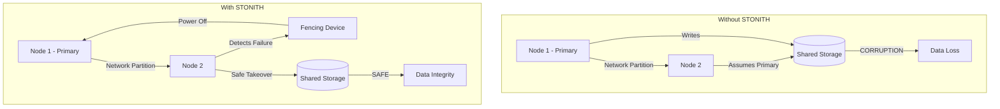
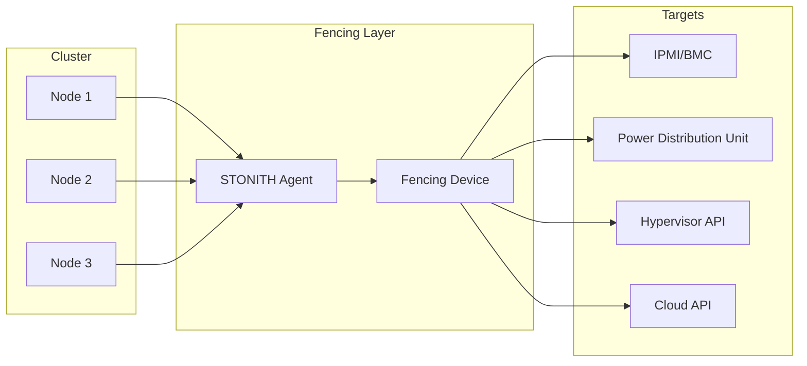
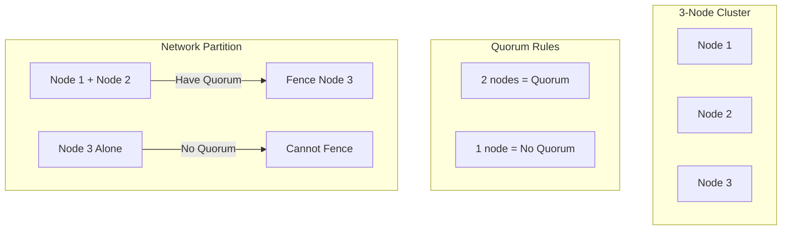
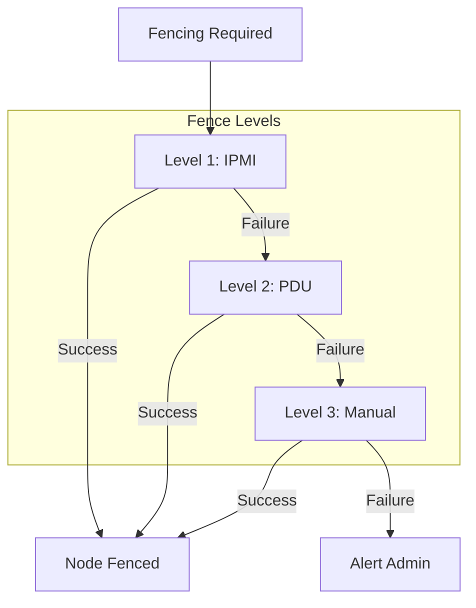

# How to Build STONITH Implementation

Author: [nawazdhandala](https://www.github.com/nawazdhandala)

Tags: High Availability, STONITH, Clustering, Fencing, Pacemaker, Corosync

Description: Learn how to implement STONITH (Shoot The Other Node In The Head) for cluster safety and data integrity in high availability environments.

---

When a cluster node becomes unresponsive, you face a critical question: Is it truly dead, or just temporarily unreachable? STONITH (Shoot The Other Node In The Head) eliminates this uncertainty by forcibly removing problematic nodes, preventing split-brain scenarios and data corruption.

## What is STONITH and Why Do You Need It?

STONITH is a fencing mechanism that ensures a failed or unresponsive node is completely isolated from the cluster before failover occurs. Without STONITH, you risk:

- **Split-brain scenarios**: Multiple nodes believing they are the primary
- **Data corruption**: Concurrent writes to shared storage
- **Resource conflicts**: Multiple nodes running the same service



## STONITH Architecture



### How STONITH Works

1. **Failure Detection**: Cluster detects a node is unresponsive
2. **Fencing Decision**: Quorum determines which nodes to fence
3. **STONITH Execution**: Fencing agent powers off/resets the failed node
4. **Confirmation**: Agent confirms the node is truly offline
5. **Resource Migration**: Cluster safely moves resources to surviving nodes

## Choosing a STONITH Agent

The right agent depends on your infrastructure:

| Environment | Agent | Method |
|-------------|-------|--------|
| Bare Metal | `fence_ipmilan` | IPMI/BMC |
| Bare Metal | `fence_apc` | APC PDU |
| VMware | `fence_vmware_soap` | vSphere API |
| KVM/libvirt | `fence_virsh` | Virsh commands |
| AWS | `fence_aws` | EC2 API |
| Azure | `fence_azure_arm` | Azure Resource Manager |
| GCP | `fence_gce` | Compute Engine API |
| Hetzner | `fence_hetzner` | Hetzner Robot API |

### List Available Agents

```bash
# List all available STONITH agents
pcs stonith list

# Get detailed info about a specific agent
pcs stonith describe fence_ipmilan
```

## IPMI-Based STONITH Configuration

IPMI (Intelligent Platform Management Interface) is the most common STONITH method for bare metal servers.

### Prerequisites

```bash
# Install fence agents
sudo dnf install -y fence-agents-all pacemaker pcs

# Or on Debian/Ubuntu
sudo apt install -y fence-agents pacemaker pcs

# Enable and start cluster services
sudo systemctl enable --now pcsd corosync pacemaker
```

### Configure IPMI Access

```bash
# Test IPMI connectivity first
ipmitool -I lanplus -H 192.168.1.10 -U admin -P password chassis status

# Should return:
# System Power         : on
# Power Overload       : false
# Power Interlock      : inactive
```

### Create STONITH Resources

```bash
# Create STONITH resource for each node
# Node 1 can fence Node 2 and Node 3
pcs stonith create fence-node1 fence_ipmilan \
    pcmk_host_list="node1" \
    ipaddr="192.168.1.10" \
    login="admin" \
    passwd="password" \
    lanplus=1 \
    power_timeout=20 \
    op monitor interval=60s

pcs stonith create fence-node2 fence_ipmilan \
    pcmk_host_list="node2" \
    ipaddr="192.168.1.11" \
    login="admin" \
    passwd="password" \
    lanplus=1 \
    power_timeout=20 \
    op monitor interval=60s

pcs stonith create fence-node3 fence_ipmilan \
    pcmk_host_list="node3" \
    ipaddr="192.168.1.12" \
    login="admin" \
    passwd="password" \
    lanplus=1 \
    power_timeout=20 \
    op monitor interval=60s
```

### Prevent Self-Fencing

A node should never fence itself. Configure location constraints:

```bash
# Node 1 cannot run the fence resource that fences Node 1
pcs constraint location fence-node1 avoids node1=INFINITY
pcs constraint location fence-node2 avoids node2=INFINITY
pcs constraint location fence-node3 avoids node3=INFINITY
```

## Cloud-Specific STONITH Agents

### AWS EC2 STONITH

```bash
# Install AWS fence agent
sudo dnf install -y fence-agents-aws

# Create IAM policy for fencing
cat > fence-policy.json << 'EOF'
{
    "Version": "2012-10-17",
    "Statement": [
        {
            "Effect": "Allow",
            "Action": [
                "ec2:DescribeInstances",
                "ec2:DescribeInstanceStatus",
                "ec2:StartInstances",
                "ec2:StopInstances",
                "ec2:RebootInstances"
            ],
            "Resource": "*"
        }
    ]
}
EOF

# Create STONITH resource
pcs stonith create fence-aws fence_aws \
    region="us-east-1" \
    pcmk_host_map="node1:i-0abc123;node2:i-0def456" \
    power_timeout=60 \
    op monitor interval=60s
```

**Using Instance Profiles (Recommended)**

```yaml
# Terraform for EC2 instance with fencing permissions
resource "aws_iam_role" "cluster_node" {
  name = "cluster-node-role"

  assume_role_policy = jsonencode({
    Version = "2012-10-17"
    Statement = [{
      Action = "sts:AssumeRole"
      Effect = "Allow"
      Principal = {
        Service = "ec2.amazonaws.com"
      }
    }]
  })
}

resource "aws_iam_role_policy" "fence_policy" {
  name = "fence-policy"
  role = aws_iam_role.cluster_node.id

  policy = jsonencode({
    Version = "2012-10-17"
    Statement = [{
      Effect = "Allow"
      Action = [
        "ec2:DescribeInstances",
        "ec2:DescribeInstanceStatus",
        "ec2:StopInstances",
        "ec2:StartInstances",
        "ec2:RebootInstances"
      ]
      Resource = "*"
    }]
  })
}

resource "aws_iam_instance_profile" "cluster_node" {
  name = "cluster-node-profile"
  role = aws_iam_role.cluster_node.name
}
```

### Azure STONITH

```bash
# Install Azure fence agent
sudo dnf install -y fence-agents-azure-arm

# Create service principal for fencing
az ad sp create-for-rbac --name "pacemaker-fence" \
    --role "Virtual Machine Contributor" \
    --scopes /subscriptions/<subscription-id>

# Create STONITH resource
pcs stonith create fence-azure fence_azure_arm \
    login="<app-id>" \
    passwd="<password>" \
    resourceGroup="my-cluster-rg" \
    tenantId="<tenant-id>" \
    subscriptionId="<subscription-id>" \
    pcmk_host_map="node1:vm-node1;node2:vm-node2" \
    power_timeout=240 \
    op monitor interval=60s
```

### GCP STONITH

```bash
# Install GCP fence agent
sudo dnf install -y fence-agents-gce

# Create service account with compute admin role
gcloud iam service-accounts create pacemaker-fence \
    --display-name="Pacemaker Fencing"

gcloud projects add-iam-policy-binding $PROJECT_ID \
    --member="serviceAccount:pacemaker-fence@$PROJECT_ID.iam.gserviceaccount.com" \
    --role="roles/compute.admin"

# Create STONITH resource
pcs stonith create fence-gce fence_gce \
    project="my-project" \
    zone="us-central1-a" \
    pcmk_host_map="node1:instance-1;node2:instance-2" \
    op monitor interval=60s
```

## VMware STONITH

```bash
# Install VMware fence agent
sudo dnf install -y fence-agents-vmware-soap

# Create STONITH resource
pcs stonith create fence-vmware fence_vmware_soap \
    ipaddr="vcenter.example.com" \
    login="administrator@vsphere.local" \
    passwd="password" \
    ssl=1 \
    ssl_insecure=1 \
    pcmk_host_map="node1:vm-node1;node2:vm-node2" \
    op monitor interval=60s
```

**Using VMware REST API (vSphere 7+)**

```bash
pcs stonith create fence-vmware-rest fence_vmware_rest \
    ipaddr="vcenter.example.com" \
    login="administrator@vsphere.local" \
    passwd="password" \
    ssl=1 \
    ssl_insecure=1 \
    pcmk_host_map="node1:vm-node1;node2:vm-node2" \
    op monitor interval=60s
```

## Testing STONITH Devices

Testing is critical - a STONITH device that fails during a real outage is worse than no STONITH at all.

### Test Without Actually Fencing

```bash
# Verify STONITH configuration
pcs stonith config

# Check STONITH status
pcs stonith status

# Test fence agent without executing (dry run)
fence_ipmilan -a 192.168.1.10 -l admin -p password -P -o status

# Validate all STONITH resources
pcs stonith verify --full
```

### Test Actual Fencing

```bash
# WARNING: This will actually power off the node!
# Only run on test systems or during maintenance windows

# Test fence operation on specific node
pcs stonith fence node2 --off

# Confirm node is fenced
pcs status nodes

# Power node back on
pcs stonith fence node2 --on
```

### Automated STONITH Testing Script

```bash
#!/bin/bash
# stonith-test.sh - Test STONITH configuration

set -e

NODES="node1 node2 node3"

echo "=== STONITH Configuration Test ==="

# Check STONITH is enabled
if pcs property show stonith-enabled | grep -q "false"; then
    echo "ERROR: STONITH is disabled!"
    exit 1
fi
echo "[OK] STONITH is enabled"

# Check all fence resources are running
for node in $NODES; do
    if ! pcs stonith status fence-$node 2>/dev/null | grep -q "Started"; then
        echo "WARNING: fence-$node is not running"
    else
        echo "[OK] fence-$node is running"
    fi
done

# Test fence agent status (without fencing)
for node in $NODES; do
    # Extract IPMI address from resource
    ipaddr=$(pcs stonith config fence-$node | grep ipaddr | awk '{print $2}')

    echo "Testing fence-$node (IPMI: $ipaddr)..."
    if fence_ipmilan -a $ipaddr -l admin -P -o status 2>/dev/null; then
        echo "[OK] fence-$node responds"
    else
        echo "ERROR: fence-$node failed status check"
    fi
done

echo "=== STONITH Test Complete ==="
```

## Failsafe Configuration

### Enable STONITH

```bash
# STONITH must be enabled for production clusters
pcs property set stonith-enabled=true

# Set timeout for fencing operations
pcs property set stonith-timeout=60s

# Configure behavior when STONITH fails
pcs property set stonith-action=reboot  # or 'off'
```

### Quorum and Fencing



```bash
# Configure quorum policy
pcs quorum update auto_tie_breaker=1

# For 2-node clusters, configure no-quorum policy
pcs property set no-quorum-policy=ignore  # or 'freeze', 'stop', 'suicide'
```

### Two-Node Cluster Configuration

Two-node clusters require special handling since losing one node loses quorum.

```bash
# Option 1: No quorum policy
pcs property set no-quorum-policy=ignore

# Option 2: Use quorum device (QDevice)
pcs quorum device add model net host=qdevice.example.com algorithm=ffsplit
```

### Fence Levels (Multiple Fencing Methods)

For critical systems, configure multiple fencing methods:

```bash
# Create primary fence device (IPMI)
pcs stonith create fence-node1-ipmi fence_ipmilan \
    pcmk_host_list="node1" \
    ipaddr="192.168.1.10" \
    login="admin" \
    passwd="password" \
    lanplus=1

# Create secondary fence device (PDU)
pcs stonith create fence-node1-pdu fence_apc \
    pcmk_host_list="node1" \
    ipaddr="192.168.1.100" \
    login="admin" \
    passwd="password" \
    plug=1

# Configure fence levels
# Try IPMI first, then PDU if IPMI fails
pcs stonith level add 1 node1 fence-node1-ipmi
pcs stonith level add 2 node1 fence-node1-pdu

# Verify fence levels
pcs stonith level
```

## STONITH Topology



## Monitoring and Alerting

### Configure Alerts

```bash
# Create alert recipient
pcs alert create id=smtp-alert path=/usr/share/pacemaker/alerts/alert_smtp.sh

# Configure alert for fencing events
pcs alert recipient add smtp-alert id=email-admin value=admin@example.com \
    options email_sender=pacemaker@example.com

# Alert on specific events
pcs alert update smtp-alert select fencing
```

### Custom Alert Script

```bash
#!/bin/bash
# /usr/share/pacemaker/alerts/stonith_alert.sh

# Alert environment variables provided by Pacemaker:
# CRM_alert_kind: node, fencing, resource, attribute
# CRM_alert_node: affected node name
# CRM_alert_desc: description
# CRM_alert_status: outcome (success/failed)

case "$CRM_alert_kind" in
    fencing)
        SUBJECT="STONITH Alert: $CRM_alert_node"
        MESSAGE="Fencing operation on $CRM_alert_node: $CRM_alert_status\n\nDetails: $CRM_alert_desc"

        # Send to Slack
        curl -X POST -H 'Content-type: application/json' \
            --data "{\"text\":\"$SUBJECT\n$MESSAGE\"}" \
            "$SLACK_WEBHOOK_URL"

        # Send to PagerDuty
        curl -X POST -H 'Content-type: application/json' \
            -H "Authorization: Token token=$PD_TOKEN" \
            --data "{
                \"routing_key\": \"$PD_ROUTING_KEY\",
                \"event_action\": \"trigger\",
                \"payload\": {
                    \"summary\": \"$SUBJECT\",
                    \"severity\": \"critical\",
                    \"source\": \"pacemaker\"
                }
            }" \
            "https://events.pagerduty.com/v2/enqueue"
        ;;
esac
```

### Prometheus Metrics

```yaml
# pacemaker-exporter configuration
# Export STONITH metrics to Prometheus

scrape_configs:
  - job_name: 'pacemaker'
    static_configs:
      - targets:
          - node1:9664
          - node2:9664
          - node3:9664
    metrics_path: /metrics

# Key metrics to monitor:
# pacemaker_stonith_enabled (gauge)
# pacemaker_stonith_pending (gauge)
# pacemaker_stonith_complete_total (counter)
# pacemaker_stonith_failed_total (counter)
```

### Grafana Dashboard Alert Rules

```yaml
# Grafana alert rule for STONITH failures
apiVersion: 1
groups:
  - name: stonith_alerts
    rules:
      - alert: STONITHFailed
        expr: increase(pacemaker_stonith_failed_total[5m]) > 0
        for: 0m
        labels:
          severity: critical
        annotations:
          summary: "STONITH operation failed"
          description: "A STONITH operation failed in the cluster"

      - alert: STONITHDisabled
        expr: pacemaker_stonith_enabled == 0
        for: 5m
        labels:
          severity: warning
        annotations:
          summary: "STONITH is disabled"
          description: "STONITH is disabled on the cluster - data integrity at risk"
```

## Troubleshooting STONITH

### Common Issues and Solutions

```bash
# View STONITH logs
journalctl -u pacemaker | grep -i stonith

# Check fence agent debug output
fence_ipmilan -a 192.168.1.10 -l admin -p password -P -o status -D /tmp/fence.log

# Verify IPMI network connectivity
ipmitool -I lanplus -H 192.168.1.10 -U admin -P password chassis status

# Check for pending fence operations
pcs stonith history

# Clear failed fence operations
pcs stonith cleanup fence-node1

# Force fence a node (emergency)
pcs stonith fence node2 --force
```

### Debug Mode

```bash
# Enable debug logging for fence agents
pcs stonith update fence-node1 debug=/var/log/fence_node1.log

# Or set cluster-wide debug
pcs property set debug=true

# Check pacemaker logs
tail -f /var/log/pacemaker/pacemaker.log
```

### STONITH Delays

Configure delays to prevent unnecessary fencing during brief network glitches:

```bash
# Set delay before fencing (seconds)
pcs stonith update fence-node1 delay=5

# Configure fencing topology with delays
pcs stonith update fence-node1 pcmk_delay_base=5
pcs stonith update fence-node1 pcmk_delay_max=30
```

## Complete Example: Three-Node HA Cluster

```bash
#!/bin/bash
# setup-ha-cluster.sh

set -e

NODES="node1 node2 node3"
CLUSTER_NAME="ha-cluster"

# 1. Install packages on all nodes
for node in $NODES; do
    ssh $node "dnf install -y pacemaker pcs fence-agents-all corosync"
done

# 2. Set hacluster password on all nodes
for node in $NODES; do
    ssh $node "echo 'hacluster:SecurePassword123!' | chpasswd"
done

# 3. Start pcsd on all nodes
for node in $NODES; do
    ssh $node "systemctl enable --now pcsd"
done

# 4. Authenticate nodes
pcs host auth node1 node2 node3 -u hacluster -p SecurePassword123!

# 5. Create cluster
pcs cluster setup $CLUSTER_NAME node1 node2 node3

# 6. Start cluster
pcs cluster start --all
pcs cluster enable --all

# 7. Configure STONITH
# Create fence devices
pcs stonith create fence-node1 fence_ipmilan \
    pcmk_host_list="node1" \
    ipaddr="10.0.0.101" \
    login="admin" \
    passwd="ipmipassword" \
    lanplus=1 \
    power_timeout=20

pcs stonith create fence-node2 fence_ipmilan \
    pcmk_host_list="node2" \
    ipaddr="10.0.0.102" \
    login="admin" \
    passwd="ipmipassword" \
    lanplus=1 \
    power_timeout=20

pcs stonith create fence-node3 fence_ipmilan \
    pcmk_host_list="node3" \
    ipaddr="10.0.0.103" \
    login="admin" \
    passwd="ipmipassword" \
    lanplus=1 \
    power_timeout=20

# Prevent self-fencing
pcs constraint location fence-node1 avoids node1=INFINITY
pcs constraint location fence-node2 avoids node2=INFINITY
pcs constraint location fence-node3 avoids node3=INFINITY

# 8. Enable STONITH
pcs property set stonith-enabled=true
pcs property set stonith-timeout=60s

# 9. Verify configuration
pcs status
pcs stonith status

echo "HA Cluster with STONITH configured successfully!"
```

## Best Practices

1. **Never disable STONITH in production** - The risks of split-brain far outweigh fencing delays
2. **Test STONITH regularly** - Run monthly fencing tests during maintenance windows
3. **Use multiple fencing methods** - Configure fence levels for redundancy
4. **Monitor STONITH operations** - Alert on failed fence attempts
5. **Document IPMI/BMC credentials** - Store securely but make accessible during emergencies
6. **Use out-of-band management networks** - Separate IPMI traffic from cluster traffic
7. **Set appropriate timeouts** - Too short causes false fencing, too long delays recovery
8. **Keep fence agents updated** - Security patches and bug fixes

---

STONITH is not optional for production high-availability clusters. Without it, your cluster cannot safely recover from node failures, and you risk data corruption during split-brain scenarios. Invest the time to properly configure and test your STONITH implementation - it will pay dividends when a real failure occurs.
