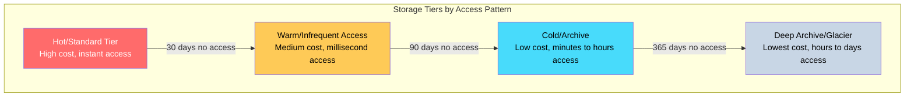
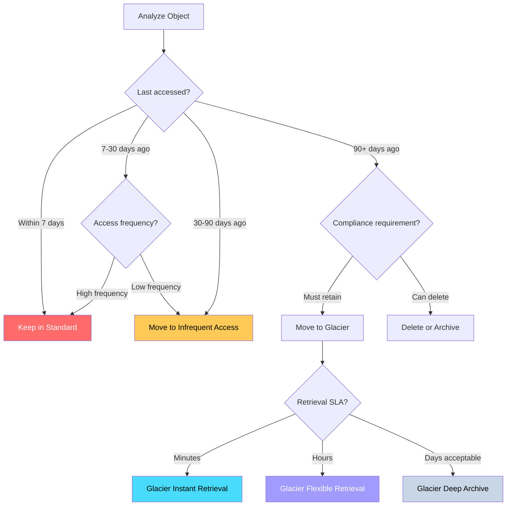
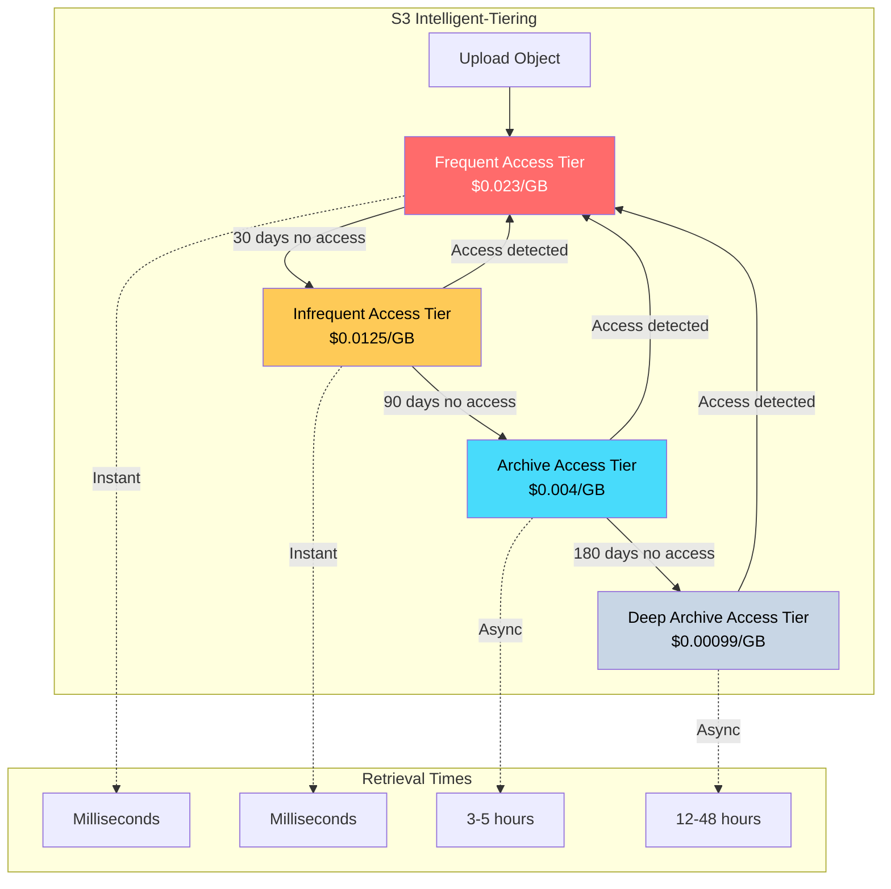
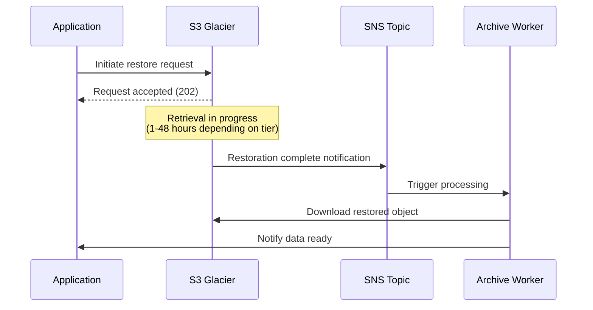
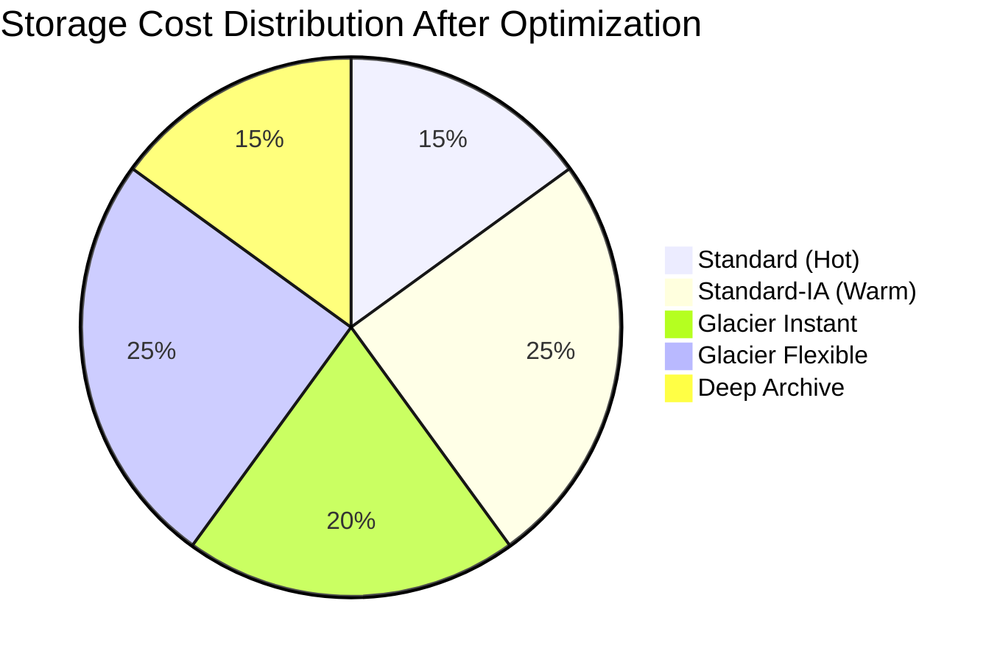

# How to Create Storage Tier Optimization

Author: [nawazdhandala](https://github.com/nawazdhandala)

Tags: Storage, Cost Optimization, Cloud, FinOps

Description: Learn how to optimize storage costs through intelligent tiering strategies.

---

Storage costs quietly become one of the largest line items in cloud bills. Data grows exponentially while access patterns shift - yesterday's hot data becomes tomorrow's archive. Storage tier optimization is the practice of automatically moving data to the most cost-effective storage class based on access patterns, compliance requirements, and retrieval needs.

## Storage Tier Characteristics

Every cloud provider offers multiple storage tiers with different cost and performance profiles:



### AWS S3 Storage Classes

| Storage Class | Use Case | Retrieval Time | Cost (per GB/month) |
|--------------|----------|----------------|---------------------|
| S3 Standard | Frequently accessed data | Milliseconds | $0.023 |
| S3 Intelligent-Tiering | Unknown access patterns | Milliseconds | $0.023 + monitoring fee |
| S3 Standard-IA | Infrequent access, rapid retrieval | Milliseconds | $0.0125 |
| S3 One Zone-IA | Infrequent, non-critical data | Milliseconds | $0.01 |
| S3 Glacier Instant | Archive with instant access | Milliseconds | $0.004 |
| S3 Glacier Flexible | Long-term archive | 1-12 hours | $0.0036 |
| S3 Glacier Deep Archive | Compliance archives | 12-48 hours | $0.00099 |

### Azure Blob Storage Tiers

| Access Tier | Use Case | Retrieval Cost | Storage Cost |
|------------|----------|----------------|--------------|
| Hot | Frequently accessed | Free | Higher |
| Cool | Infrequently accessed (30+ days) | Per-GB read fee | Lower |
| Cold | Rarely accessed (90+ days) | Higher read fee | Very low |
| Archive | Long-term (180+ days) | Highest read fee | Lowest |

### Google Cloud Storage Classes

| Storage Class | Use Case | Minimum Duration | Availability SLA |
|--------------|----------|-----------------|------------------|
| Standard | Hot data | None | 99.99% |
| Nearline | Monthly access | 30 days | 99.9% |
| Coldline | Quarterly access | 90 days | 99.9% |
| Archive | Yearly access | 365 days | 99.9% |

## Access Pattern Analysis

Before implementing tiering, analyze how your data is actually accessed:

### S3 Storage Class Analysis

```bash
#!/bin/bash
# Analyze S3 bucket access patterns using S3 Storage Lens or CloudWatch

BUCKET_NAME="my-application-bucket"
START_DATE=$(date -d "90 days ago" +%Y-%m-%d)
END_DATE=$(date +%Y-%m-%d)

# Get object count and size by storage class
aws s3api list-objects-v2 \
    --bucket $BUCKET_NAME \
    --query "Contents[].{Key: Key, Size: Size, StorageClass: StorageClass}" \
    --output json | jq -r '
    group_by(.StorageClass) |
    map({
        StorageClass: .[0].StorageClass,
        ObjectCount: length,
        TotalSizeGB: (map(.Size) | add / 1073741824)
    })'

# Enable S3 Storage Lens for detailed analysis
aws s3control put-storage-lens-configuration \
    --account-id $(aws sts get-caller-identity --query Account --output text) \
    --config-id storage-analysis \
    --storage-lens-configuration '{
        "Id": "storage-analysis",
        "AccountLevel": {
            "ActivityMetrics": {"IsEnabled": true},
            "BucketLevel": {
                "ActivityMetrics": {"IsEnabled": true}
            }
        },
        "IsEnabled": true
    }'
```

### Access Pattern Query with S3 Access Logs

```python
import boto3
import pandas as pd
from datetime import datetime, timedelta

def analyze_access_patterns(bucket_name: str, log_bucket: str, days: int = 90):
    """
    Analyze S3 access logs to determine object access patterns.
    """
    s3 = boto3.client('s3')

    # Parse access logs
    access_counts = {}
    end_date = datetime.now()
    start_date = end_date - timedelta(days=days)

    # List log files
    paginator = s3.get_paginator('list_objects_v2')

    for page in paginator.paginate(Bucket=log_bucket, Prefix='access-logs/'):
        for obj in page.get('Contents', []):
            log_key = obj['Key']

            # Download and parse log
            response = s3.get_object(Bucket=log_bucket, Key=log_key)
            log_content = response['Body'].read().decode('utf-8')

            for line in log_content.split('\n'):
                if not line:
                    continue

                parts = line.split(' ')
                if len(parts) > 7:
                    operation = parts[7]
                    object_key = parts[8]

                    if operation in ['REST.GET.OBJECT', 'REST.HEAD.OBJECT']:
                        access_counts[object_key] = access_counts.get(object_key, 0) + 1

    # Categorize by access frequency
    hot_objects = []      # Accessed 10+ times
    warm_objects = []     # Accessed 1-9 times
    cold_objects = []     # Never accessed

    # Get all objects in bucket
    for page in paginator.paginate(Bucket=bucket_name):
        for obj in page.get('Contents', []):
            key = obj['Key']
            count = access_counts.get(key, 0)
            size_gb = obj['Size'] / (1024**3)

            if count >= 10:
                hot_objects.append({'key': key, 'accesses': count, 'size_gb': size_gb})
            elif count > 0:
                warm_objects.append({'key': key, 'accesses': count, 'size_gb': size_gb})
            else:
                cold_objects.append({'key': key, 'accesses': count, 'size_gb': size_gb})

    return {
        'hot': {
            'count': len(hot_objects),
            'total_size_gb': sum(o['size_gb'] for o in hot_objects)
        },
        'warm': {
            'count': len(warm_objects),
            'total_size_gb': sum(o['size_gb'] for o in warm_objects)
        },
        'cold': {
            'count': len(cold_objects),
            'total_size_gb': sum(o['size_gb'] for o in cold_objects)
        }
    }

# Example usage
results = analyze_access_patterns('my-bucket', 'my-log-bucket')
print(f"Hot data: {results['hot']['total_size_gb']:.2f} GB")
print(f"Warm data: {results['warm']['total_size_gb']:.2f} GB")
print(f"Cold data: {results['cold']['total_size_gb']:.2f} GB")
```

### Access Pattern Decision Matrix



## Lifecycle Policies

Automate tier transitions with lifecycle policies:

### AWS S3 Lifecycle Policy

```json
{
    "Rules": [
        {
            "ID": "OptimizeStorageCosts",
            "Status": "Enabled",
            "Filter": {
                "Prefix": "data/"
            },
            "Transitions": [
                {
                    "Days": 30,
                    "StorageClass": "STANDARD_IA"
                },
                {
                    "Days": 90,
                    "StorageClass": "GLACIER_IR"
                },
                {
                    "Days": 365,
                    "StorageClass": "DEEP_ARCHIVE"
                }
            ],
            "NoncurrentVersionTransitions": [
                {
                    "NoncurrentDays": 7,
                    "StorageClass": "GLACIER"
                }
            ],
            "NoncurrentVersionExpiration": {
                "NoncurrentDays": 90
            },
            "AbortIncompleteMultipartUpload": {
                "DaysAfterInitiation": 7
            }
        },
        {
            "ID": "DeleteTempFiles",
            "Status": "Enabled",
            "Filter": {
                "Prefix": "tmp/"
            },
            "Expiration": {
                "Days": 1
            }
        },
        {
            "ID": "ArchiveLogs",
            "Status": "Enabled",
            "Filter": {
                "And": {
                    "Prefix": "logs/",
                    "Tags": [
                        {
                            "Key": "archive-eligible",
                            "Value": "true"
                        }
                    ]
                }
            },
            "Transitions": [
                {
                    "Days": 7,
                    "StorageClass": "GLACIER"
                }
            ],
            "Expiration": {
                "Days": 2555
            }
        }
    ]
}
```

Apply the lifecycle policy:

```bash
# Apply lifecycle policy
aws s3api put-bucket-lifecycle-configuration \
    --bucket my-application-bucket \
    --lifecycle-configuration file://lifecycle-policy.json

# Verify configuration
aws s3api get-bucket-lifecycle-configuration \
    --bucket my-application-bucket
```

### Azure Blob Lifecycle Management

```json
{
    "rules": [
        {
            "enabled": true,
            "name": "OptimizeStorageCosts",
            "type": "Lifecycle",
            "definition": {
                "actions": {
                    "baseBlob": {
                        "tierToCool": {
                            "daysAfterModificationGreaterThan": 30
                        },
                        "tierToCold": {
                            "daysAfterModificationGreaterThan": 90
                        },
                        "tierToArchive": {
                            "daysAfterModificationGreaterThan": 180
                        },
                        "delete": {
                            "daysAfterModificationGreaterThan": 2555
                        }
                    },
                    "snapshot": {
                        "tierToCool": {
                            "daysAfterCreationGreaterThan": 30
                        },
                        "delete": {
                            "daysAfterCreationGreaterThan": 90
                        }
                    }
                },
                "filters": {
                    "blobTypes": ["blockBlob"],
                    "prefixMatch": ["data/", "logs/"]
                }
            }
        },
        {
            "enabled": true,
            "name": "ArchiveOldVersions",
            "type": "Lifecycle",
            "definition": {
                "actions": {
                    "version": {
                        "tierToArchive": {
                            "daysAfterCreationGreaterThan": 90
                        },
                        "delete": {
                            "daysAfterCreationGreaterThan": 365
                        }
                    }
                },
                "filters": {
                    "blobTypes": ["blockBlob"]
                }
            }
        }
    ]
}
```

Apply Azure lifecycle policy:

```bash
# Apply lifecycle policy via Azure CLI
az storage account management-policy create \
    --account-name mystorageaccount \
    --resource-group myresourcegroup \
    --policy @lifecycle-policy.json
```

### Google Cloud Storage Lifecycle Policy

```json
{
    "lifecycle": {
        "rule": [
            {
                "action": {
                    "type": "SetStorageClass",
                    "storageClass": "NEARLINE"
                },
                "condition": {
                    "age": 30,
                    "matchesStorageClass": ["STANDARD"]
                }
            },
            {
                "action": {
                    "type": "SetStorageClass",
                    "storageClass": "COLDLINE"
                },
                "condition": {
                    "age": 90,
                    "matchesStorageClass": ["NEARLINE"]
                }
            },
            {
                "action": {
                    "type": "SetStorageClass",
                    "storageClass": "ARCHIVE"
                },
                "condition": {
                    "age": 365,
                    "matchesStorageClass": ["COLDLINE"]
                }
            },
            {
                "action": {
                    "type": "Delete"
                },
                "condition": {
                    "age": 2555,
                    "matchesStorageClass": ["ARCHIVE"]
                }
            },
            {
                "action": {
                    "type": "Delete"
                },
                "condition": {
                    "numNewerVersions": 3
                }
            }
        ]
    }
}
```

Apply GCS lifecycle policy:

```bash
# Apply lifecycle policy
gsutil lifecycle set lifecycle-policy.json gs://my-bucket

# Verify configuration
gsutil lifecycle get gs://my-bucket
```

## Intelligent Tiering Setup

For workloads with unpredictable access patterns, use intelligent tiering services:

### AWS S3 Intelligent-Tiering Configuration

```python
import boto3

def configure_intelligent_tiering(bucket_name: str):
    """
    Configure S3 Intelligent-Tiering with archive access tiers.
    """
    s3 = boto3.client('s3')

    # Create Intelligent-Tiering configuration
    config = {
        'Id': 'FullIntelligentTiering',
        'Status': 'Enabled',
        'Filter': {
            'Prefix': ''  # Apply to all objects
        },
        'Tierings': [
            {
                'Days': 90,
                'AccessTier': 'ARCHIVE_ACCESS'
            },
            {
                'Days': 180,
                'AccessTier': 'DEEP_ARCHIVE_ACCESS'
            }
        ]
    }

    s3.put_bucket_intelligent_tiering_configuration(
        Bucket=bucket_name,
        Id='FullIntelligentTiering',
        IntelligentTieringConfiguration=config
    )

    print(f"Intelligent-Tiering configured for {bucket_name}")

    # Also set default storage class for new uploads
    return config

def upload_with_intelligent_tiering(bucket_name: str, key: str, body: bytes):
    """
    Upload object directly to Intelligent-Tiering storage class.
    """
    s3 = boto3.client('s3')

    s3.put_object(
        Bucket=bucket_name,
        Key=key,
        Body=body,
        StorageClass='INTELLIGENT_TIERING'
    )

# Configure bucket
configure_intelligent_tiering('my-application-bucket')
```

### Intelligent-Tiering Architecture



### Azure Auto-Tiering with Access Tracking

```python
from azure.storage.blob import BlobServiceClient, BlobClient
from azure.identity import DefaultAzureCredential
from datetime import datetime, timedelta

def configure_auto_tiering(connection_string: str, container_name: str):
    """
    Set up blob access tracking and automatic tiering based on last access time.
    """
    blob_service = BlobServiceClient.from_connection_string(connection_string)
    container = blob_service.get_container_client(container_name)

    # Enable last access time tracking (requires storage account configuration)
    # This must be enabled at the storage account level via Azure portal or CLI

    # List blobs and check access times
    tiering_recommendations = []

    for blob in container.list_blobs(include=['metadata']):
        blob_client = container.get_blob_client(blob.name)
        properties = blob_client.get_blob_properties()

        last_accessed = properties.last_accessed_on
        current_tier = properties.blob_tier

        if last_accessed:
            days_since_access = (datetime.utcnow() - last_accessed.replace(tzinfo=None)).days

            recommended_tier = get_recommended_tier(days_since_access, current_tier)

            if recommended_tier != current_tier:
                tiering_recommendations.append({
                    'blob_name': blob.name,
                    'current_tier': current_tier,
                    'recommended_tier': recommended_tier,
                    'days_since_access': days_since_access,
                    'size_bytes': properties.size
                })

    return tiering_recommendations

def get_recommended_tier(days_since_access: int, current_tier: str) -> str:
    """
    Determine recommended tier based on access pattern.
    """
    if days_since_access <= 7:
        return 'Hot'
    elif days_since_access <= 30:
        return 'Cool'
    elif days_since_access <= 90:
        return 'Cold'
    else:
        return 'Archive'

def apply_tier_changes(connection_string: str, container_name: str, recommendations: list):
    """
    Apply tiering changes to blobs.
    """
    blob_service = BlobServiceClient.from_connection_string(connection_string)
    container = blob_service.get_container_client(container_name)

    for rec in recommendations:
        blob_client = container.get_blob_client(rec['blob_name'])
        blob_client.set_standard_blob_tier(rec['recommended_tier'])
        print(f"Moved {rec['blob_name']} from {rec['current_tier']} to {rec['recommended_tier']}")
```

## Archive Storage Strategies

### Designing for Archive Retrieval



### Archive Restoration Handler

```python
import boto3
import json
from typing import Optional
from datetime import datetime

class ArchiveManager:
    def __init__(self, bucket_name: str):
        self.s3 = boto3.client('s3')
        self.bucket_name = bucket_name

    def initiate_restore(
        self,
        key: str,
        days: int = 7,
        tier: str = 'Standard'
    ) -> dict:
        """
        Initiate restoration of an archived object.

        Tiers:
        - Expedited: 1-5 minutes (Glacier Instant/Flexible only)
        - Standard: 3-5 hours
        - Bulk: 5-12 hours
        """
        try:
            response = self.s3.restore_object(
                Bucket=self.bucket_name,
                Key=key,
                RestoreRequest={
                    'Days': days,
                    'GlacierJobParameters': {
                        'Tier': tier
                    }
                }
            )

            return {
                'status': 'initiated',
                'key': key,
                'restore_tier': tier,
                'available_days': days
            }

        except self.s3.exceptions.ObjectAlreadyInActiveTierError:
            return {
                'status': 'already_available',
                'key': key
            }

        except Exception as e:
            return {
                'status': 'error',
                'key': key,
                'error': str(e)
            }

    def check_restore_status(self, key: str) -> dict:
        """
        Check if an archived object has been restored.
        """
        response = self.s3.head_object(
            Bucket=self.bucket_name,
            Key=key
        )

        storage_class = response.get('StorageClass', 'STANDARD')
        restore_status = response.get('Restore', '')

        if 'ongoing-request="true"' in restore_status:
            return {
                'status': 'in_progress',
                'storage_class': storage_class
            }
        elif 'ongoing-request="false"' in restore_status:
            # Extract expiry date
            expiry_date = restore_status.split('expiry-date="')[1].split('"')[0]
            return {
                'status': 'available',
                'storage_class': storage_class,
                'expires': expiry_date
            }
        else:
            return {
                'status': 'archived',
                'storage_class': storage_class
            }

    def bulk_restore(self, prefix: str, tier: str = 'Bulk', days: int = 7) -> list:
        """
        Restore all objects under a prefix.
        """
        results = []
        paginator = self.s3.get_paginator('list_objects_v2')

        for page in paginator.paginate(Bucket=self.bucket_name, Prefix=prefix):
            for obj in page.get('Contents', []):
                if obj.get('StorageClass') in ['GLACIER', 'DEEP_ARCHIVE', 'GLACIER_IR']:
                    result = self.initiate_restore(obj['Key'], days, tier)
                    results.append(result)

        return results

# Example usage
archive_mgr = ArchiveManager('my-archive-bucket')

# Restore a single file with expedited retrieval
result = archive_mgr.initiate_restore(
    'archives/2023/financial-report.pdf',
    days=7,
    tier='Expedited'
)
print(f"Restore status: {result['status']}")

# Check restoration progress
status = archive_mgr.check_restore_status('archives/2023/financial-report.pdf')
print(f"Current status: {status['status']}")
```

### Archive with Retrieval SLA Management

```yaml
# Kubernetes CronJob for managing archive retrievals
apiVersion: batch/v1
kind: CronJob
metadata:
  name: archive-restore-manager
  namespace: data-ops
spec:
  schedule: "*/15 * * * *"  # Check every 15 minutes
  jobTemplate:
    spec:
      template:
        spec:
          containers:
            - name: restore-manager
              image: python:3.11-slim
              command:
                - python
                - /scripts/manage_restores.py
              env:
                - name: BUCKET_NAME
                  value: "my-archive-bucket"
                - name: SNS_TOPIC_ARN
                  value: "arn:aws:sns:us-east-1:123456789:restore-notifications"
                - name: AWS_REGION
                  value: "us-east-1"
              volumeMounts:
                - name: scripts
                  mountPath: /scripts
          volumes:
            - name: scripts
              configMap:
                name: archive-scripts
          restartPolicy: OnFailure
---
apiVersion: v1
kind: ConfigMap
metadata:
  name: archive-scripts
  namespace: data-ops
data:
  manage_restores.py: |
    import boto3
    import os
    import json

    def check_pending_restores():
        dynamodb = boto3.resource('dynamodb')
        table = dynamodb.Table('pending-restores')

        # Get all pending restore requests
        response = table.scan(
            FilterExpression='#status = :pending',
            ExpressionAttributeNames={'#status': 'status'},
            ExpressionAttributeValues={':pending': 'pending'}
        )

        s3 = boto3.client('s3')
        sns = boto3.client('sns')

        for item in response['Items']:
            bucket = item['bucket']
            key = item['key']
            request_id = item['request_id']

            # Check restore status
            head = s3.head_object(Bucket=bucket, Key=key)
            restore = head.get('Restore', '')

            if 'ongoing-request="false"' in restore:
                # Notify requestor
                sns.publish(
                    TopicArn=os.environ['SNS_TOPIC_ARN'],
                    Message=json.dumps({
                        'request_id': request_id,
                        'bucket': bucket,
                        'key': key,
                        'status': 'available'
                    }),
                    Subject='Archive Restoration Complete'
                )

                # Update status
                table.update_item(
                    Key={'request_id': request_id},
                    UpdateExpression='SET #status = :available',
                    ExpressionAttributeNames={'#status': 'status'},
                    ExpressionAttributeValues={':available': 'available'}
                )

    if __name__ == '__main__':
        check_pending_restores()
```

## Cost Savings Calculation

### Storage Cost Calculator

```python
from dataclasses import dataclass
from typing import Dict, List
import json

@dataclass
class StorageTier:
    name: str
    storage_cost_per_gb: float  # Monthly
    retrieval_cost_per_gb: float
    min_storage_days: int
    early_deletion_cost_per_gb: float

# AWS S3 pricing (us-east-1, as of 2024)
AWS_TIERS = {
    'STANDARD': StorageTier('Standard', 0.023, 0, 0, 0),
    'STANDARD_IA': StorageTier('Standard-IA', 0.0125, 0.01, 30, 0.0125),
    'ONEZONE_IA': StorageTier('One Zone-IA', 0.01, 0.01, 30, 0.01),
    'GLACIER_IR': StorageTier('Glacier Instant', 0.004, 0.03, 90, 0.004),
    'GLACIER': StorageTier('Glacier Flexible', 0.0036, 0.03, 90, 0.0036),
    'DEEP_ARCHIVE': StorageTier('Deep Archive', 0.00099, 0.02, 180, 0.00099),
}

def calculate_monthly_cost(
    data_gb: float,
    tier: str,
    monthly_retrievals_gb: float = 0
) -> float:
    """
    Calculate monthly storage cost for a given tier.
    """
    tier_config = AWS_TIERS[tier]
    storage_cost = data_gb * tier_config.storage_cost_per_gb
    retrieval_cost = monthly_retrievals_gb * tier_config.retrieval_cost_per_gb

    return storage_cost + retrieval_cost

def optimize_storage_costs(
    data_inventory: List[Dict],
    access_patterns: Dict[str, float]
) -> Dict:
    """
    Calculate optimal storage tier for each dataset.

    data_inventory: List of {'name': str, 'size_gb': float, 'current_tier': str}
    access_patterns: Dict of dataset name to monthly retrieval GB
    """
    recommendations = []
    current_total = 0
    optimized_total = 0

    for dataset in data_inventory:
        name = dataset['name']
        size_gb = dataset['size_gb']
        current_tier = dataset['current_tier']
        monthly_retrievals = access_patterns.get(name, 0)

        current_cost = calculate_monthly_cost(size_gb, current_tier, monthly_retrievals)
        current_total += current_cost

        # Find optimal tier
        best_tier = current_tier
        best_cost = current_cost

        for tier_name, tier_config in AWS_TIERS.items():
            # Skip if retrieval cost would be prohibitive
            if monthly_retrievals > 0 and tier_name in ['GLACIER', 'DEEP_ARCHIVE']:
                continue

            tier_cost = calculate_monthly_cost(size_gb, tier_name, monthly_retrievals)

            if tier_cost < best_cost:
                best_cost = tier_cost
                best_tier = tier_name

        optimized_total += best_cost

        if best_tier != current_tier:
            recommendations.append({
                'dataset': name,
                'size_gb': size_gb,
                'current_tier': current_tier,
                'recommended_tier': best_tier,
                'current_monthly_cost': round(current_cost, 2),
                'optimized_monthly_cost': round(best_cost, 2),
                'monthly_savings': round(current_cost - best_cost, 2)
            })

    return {
        'recommendations': recommendations,
        'current_monthly_total': round(current_total, 2),
        'optimized_monthly_total': round(optimized_total, 2),
        'monthly_savings': round(current_total - optimized_total, 2),
        'annual_savings': round((current_total - optimized_total) * 12, 2)
    }

# Example usage
inventory = [
    {'name': 'production-logs', 'size_gb': 5000, 'current_tier': 'STANDARD'},
    {'name': 'user-uploads', 'size_gb': 2000, 'current_tier': 'STANDARD'},
    {'name': 'backups', 'size_gb': 10000, 'current_tier': 'STANDARD'},
    {'name': 'ml-datasets', 'size_gb': 500, 'current_tier': 'STANDARD'},
    {'name': 'compliance-archives', 'size_gb': 8000, 'current_tier': 'STANDARD_IA'},
]

access_patterns = {
    'production-logs': 100,      # 100 GB retrieved monthly
    'user-uploads': 500,         # 500 GB retrieved monthly
    'backups': 10,               # 10 GB retrieved monthly
    'ml-datasets': 200,          # 200 GB retrieved monthly
    'compliance-archives': 0.5,  # 0.5 GB retrieved monthly
}

results = optimize_storage_costs(inventory, access_patterns)

print("=== Storage Optimization Report ===")
print(f"\nCurrent Monthly Cost: ${results['current_monthly_total']}")
print(f"Optimized Monthly Cost: ${results['optimized_monthly_total']}")
print(f"Monthly Savings: ${results['monthly_savings']}")
print(f"Annual Savings: ${results['annual_savings']}")

print("\n=== Recommendations ===")
for rec in results['recommendations']:
    print(f"\n{rec['dataset']}:")
    print(f"  Move from {rec['current_tier']} to {rec['recommended_tier']}")
    print(f"  Monthly savings: ${rec['monthly_savings']}")
```

### Cost Savings Dashboard Query

```sql
-- BigQuery/Athena query for storage cost analysis
WITH storage_metrics AS (
    SELECT
        bucket_name,
        storage_class,
        SUM(object_size) / POWER(1024, 3) as size_gb,
        COUNT(*) as object_count,
        AVG(TIMESTAMP_DIFF(CURRENT_TIMESTAMP(), last_modified, DAY)) as avg_age_days,
        MAX(TIMESTAMP_DIFF(CURRENT_TIMESTAMP(), last_accessed, DAY)) as days_since_access
    FROM storage_inventory
    WHERE date = CURRENT_DATE()
    GROUP BY bucket_name, storage_class
),
cost_projection AS (
    SELECT
        bucket_name,
        storage_class,
        size_gb,
        object_count,
        avg_age_days,
        days_since_access,
        CASE storage_class
            WHEN 'STANDARD' THEN size_gb * 0.023
            WHEN 'STANDARD_IA' THEN size_gb * 0.0125
            WHEN 'GLACIER' THEN size_gb * 0.0036
            WHEN 'DEEP_ARCHIVE' THEN size_gb * 0.00099
            ELSE size_gb * 0.023
        END as current_monthly_cost,
        CASE
            WHEN days_since_access > 180 THEN size_gb * 0.00099  -- Deep Archive
            WHEN days_since_access > 90 THEN size_gb * 0.0036   -- Glacier
            WHEN days_since_access > 30 THEN size_gb * 0.0125   -- Standard-IA
            ELSE size_gb * 0.023                                  -- Standard
        END as optimized_monthly_cost
    FROM storage_metrics
)
SELECT
    bucket_name,
    storage_class,
    ROUND(size_gb, 2) as size_gb,
    object_count,
    ROUND(avg_age_days, 0) as avg_age_days,
    days_since_access,
    ROUND(current_monthly_cost, 2) as current_monthly_cost,
    ROUND(optimized_monthly_cost, 2) as optimized_monthly_cost,
    ROUND(current_monthly_cost - optimized_monthly_cost, 2) as potential_savings,
    ROUND((current_monthly_cost - optimized_monthly_cost) / NULLIF(current_monthly_cost, 0) * 100, 1) as savings_percentage
FROM cost_projection
WHERE current_monthly_cost > optimized_monthly_cost
ORDER BY potential_savings DESC;
```

### Monthly Savings Visualization



## Implementation Checklist

1. **Audit current storage**
   - Inventory all buckets and storage accounts
   - Document current storage classes and costs
   - Enable access logging and metrics

2. **Analyze access patterns**
   - Enable S3 Storage Lens or equivalent
   - Query access logs for 90+ days
   - Categorize data into hot/warm/cold/archive

3. **Design lifecycle policies**
   - Define transition rules based on access patterns
   - Account for compliance and retention requirements
   - Plan for retrieval SLAs

4. **Implement intelligent tiering**
   - Enable auto-tiering for unpredictable workloads
   - Configure archive access tiers
   - Set up monitoring for tier transitions

5. **Monitor and optimize**
   - Track cost savings monthly
   - Alert on unexpected access patterns
   - Review and adjust policies quarterly

## Common Pitfalls

- **Ignoring retrieval costs**: Moving data to Glacier saves on storage but can be expensive if accessed frequently
- **Minimum storage durations**: Deleting objects before minimum duration incurs early deletion fees
- **Object size thresholds**: Small objects in IA/Glacier have minimum billable sizes (128KB for S3 IA)
- **Transition timing**: Objects must exist for 30+ days before transitioning to IA tiers

---

Storage tier optimization is not a one-time project but an ongoing practice. Access patterns change, new data categories emerge, and pricing evolves. Build automation, monitor continuously, and review quarterly. The goal is ensuring every byte lives in its most cost-effective home while meeting your retrieval SLAs.
