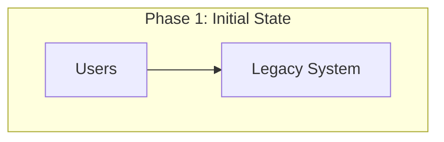
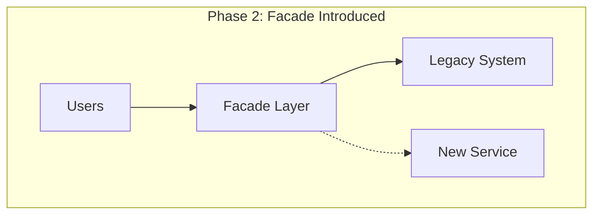
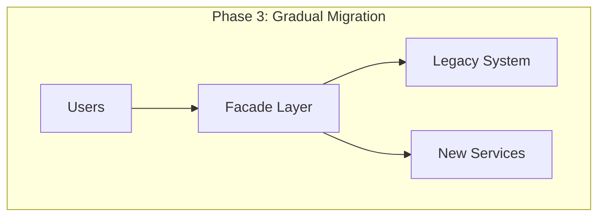
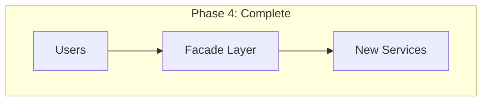
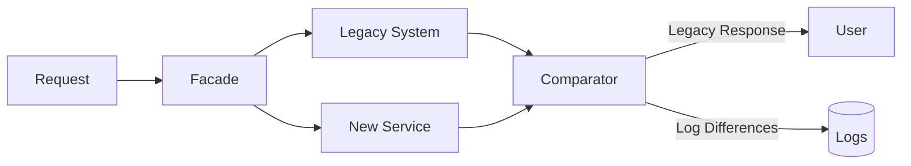
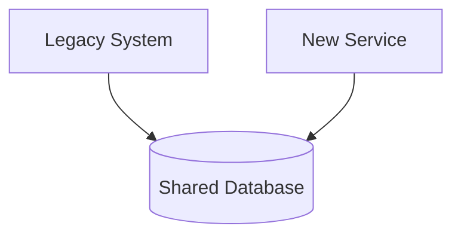
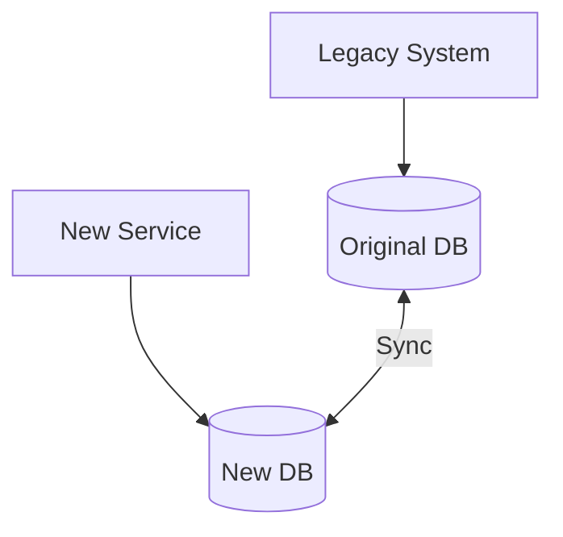

# How to Implement the Strangler Fig Pattern

Author: [nawazdhandala](https://github.com/nawazdhandala)

Tags: Microservices, Migration, Refactoring, Patterns

Description: A practical guide to incrementally migrating legacy systems using the Strangler Fig pattern with routing, facades, and parallel running strategies.

---

The Strangler Fig pattern takes its name from the strangler fig tree, which grows around a host tree, eventually replacing it entirely. In software, this pattern lets you incrementally replace a legacy system without the risk of a big-bang rewrite.

## Why Use the Strangler Fig Pattern?

Rewriting a monolith from scratch sounds appealing until you realize:

- The new system needs to match years of accumulated features
- Business requirements keep changing during the rewrite
- You cannot pause feature development for 18 months
- Big-bang migrations fail more often than they succeed

The Strangler Fig pattern solves these problems by letting you migrate piece by piece while the legacy system continues running.

## The Core Concept









## Building the Facade Layer

The facade layer is the key component. It intercepts all requests and decides whether to route them to the legacy system or the new services.

### Basic Facade with Express.js

```javascript
const express = require('express');
const httpProxy = require('http-proxy-middleware');

const app = express();

// Configuration for routing decisions
const routingConfig = {
  '/api/users': { target: 'http://new-user-service:3001', migrated: true },
  '/api/orders': { target: 'http://legacy-monolith:8080', migrated: false },
  '/api/products': { target: 'http://new-product-service:3002', migrated: true },
  '/api/payments': { target: 'http://legacy-monolith:8080', migrated: false },
};

// Dynamic routing middleware
app.use('/api/*', (req, res, next) => {
  const path = req.baseUrl;
  const route = Object.keys(routingConfig).find(key => path.startsWith(key));

  if (route) {
    const config = routingConfig[route];
    console.log(`Routing ${path} to ${config.target} (migrated: ${config.migrated})`);

    return httpProxy.createProxyMiddleware({
      target: config.target,
      changeOrigin: true,
      pathRewrite: config.migrated ? undefined : { '^/api': '/legacy-api' },
    })(req, res, next);
  }

  // Default to legacy system
  return httpProxy.createProxyMiddleware({
    target: 'http://legacy-monolith:8080',
    changeOrigin: true,
  })(req, res, next);
});

app.listen(3000, () => {
  console.log('Facade running on port 3000');
});
```

### Feature Flag Based Routing

For more control, use feature flags to toggle between systems:

```javascript
const LaunchDarkly = require('launchdarkly-node-server-sdk');

const ldClient = LaunchDarkly.init(process.env.LAUNCHDARKLY_SDK_KEY);

async function routeRequest(req, res, next) {
  const userId = req.headers['x-user-id'] || 'anonymous';
  const featureKey = `use-new-${req.path.split('/')[2]}-service`;

  const useNewService = await ldClient.variation(featureKey, { key: userId }, false);

  if (useNewService) {
    req.targetService = 'new';
  } else {
    req.targetService = 'legacy';
  }

  next();
}

app.use('/api/*', routeRequest, (req, res, next) => {
  const target = req.targetService === 'new'
    ? serviceRegistry[req.path]?.newService
    : 'http://legacy-monolith:8080';

  httpProxy.createProxyMiddleware({ target, changeOrigin: true })(req, res, next);
});
```

## Implementing with NGINX

For production deployments, NGINX provides efficient routing:

```nginx
upstream legacy_backend {
    server legacy-monolith:8080;
}

upstream new_user_service {
    server new-user-service:3001;
}

upstream new_product_service {
    server new-product-service:3002;
}

map $request_uri $backend {
    ~^/api/users       new_user_service;
    ~^/api/products    new_product_service;
    default            legacy_backend;
}

server {
    listen 80;

    location /api/ {
        proxy_pass http://$backend;
        proxy_set_header Host $host;
        proxy_set_header X-Real-IP $remote_addr;
        proxy_set_header X-Forwarded-For $proxy_add_x_forwarded_for;

        # Add header to track which backend handled the request
        add_header X-Served-By $backend;
    }
}
```

### Percentage-Based Traffic Splitting

Gradually shift traffic using NGINX split clients:

```nginx
split_clients "${request_uri}${remote_addr}" $user_service_backend {
    10%     new_user_service;
    *       legacy_backend;
}

location /api/users {
    proxy_pass http://$user_service_backend;
}
```

## Parallel Running Strategy

Before fully switching traffic, run both systems in parallel and compare results.



### Implementing Shadow Mode

```javascript
const axios = require('axios');

async function shadowRequest(req, res) {
  const legacyUrl = `http://legacy-monolith:8080${req.path}`;
  const newUrl = `http://new-service:3001${req.path}`;

  // Send to both systems
  const [legacyResponse, newResponse] = await Promise.allSettled([
    axios({
      method: req.method,
      url: legacyUrl,
      data: req.body,
      headers: req.headers,
    }),
    axios({
      method: req.method,
      url: newUrl,
      data: req.body,
      headers: req.headers,
    }),
  ]);

  // Always return legacy response to user
  if (legacyResponse.status === 'fulfilled') {
    res.status(legacyResponse.value.status).json(legacyResponse.value.data);
  } else {
    res.status(500).json({ error: 'Legacy system error' });
  }

  // Compare responses asynchronously
  compareResponses(req.path, legacyResponse, newResponse);
}

function compareResponses(path, legacy, newResp) {
  if (legacy.status !== 'fulfilled' || newResp.status !== 'fulfilled') {
    console.error(`Shadow comparison failed for ${path}`, {
      legacyStatus: legacy.status,
      newStatus: newResp.status,
    });
    return;
  }

  const legacyData = JSON.stringify(legacy.value.data);
  const newData = JSON.stringify(newResp.value.data);

  if (legacyData !== newData) {
    console.warn(`Response mismatch for ${path}`, {
      legacy: legacy.value.data,
      new: newResp.value.data,
    });

    // Send to monitoring system
    metrics.increment('strangler.response_mismatch', { path });
  } else {
    metrics.increment('strangler.response_match', { path });
  }
}
```

## Database Migration Strategies

### Shared Database Phase

Start with both systems reading from the same database:



### Database Per Service Transition



### Change Data Capture for Sync

Use Debezium to sync data between databases:

```yaml
# docker-compose.yml
services:
  debezium:
    image: debezium/connect:2.4
    environment:
      BOOTSTRAP_SERVERS: kafka:9092
      GROUP_ID: strangler-sync
      CONFIG_STORAGE_TOPIC: debezium_configs
      OFFSET_STORAGE_TOPIC: debezium_offsets
      STATUS_STORAGE_TOPIC: debezium_statuses
    depends_on:
      - kafka
      - legacy-postgres
```

```json
{
  "name": "legacy-connector",
  "config": {
    "connector.class": "io.debezium.connector.postgresql.PostgresConnector",
    "database.hostname": "legacy-postgres",
    "database.port": "5432",
    "database.user": "replicator",
    "database.password": "secret",
    "database.dbname": "legacy_db",
    "table.include.list": "public.users,public.products",
    "topic.prefix": "strangler",
    "plugin.name": "pgoutput"
  }
}
```

## Kubernetes Implementation

### Service Mesh Routing with Istio

```yaml
apiVersion: networking.istio.io/v1alpha3
kind: VirtualService
metadata:
  name: api-routing
spec:
  hosts:
    - api.example.com
  http:
    # Migrated: Users service
    - match:
        - uri:
            prefix: /api/users
      route:
        - destination:
            host: new-user-service
            port:
              number: 3001

    # In Progress: Products with canary
    - match:
        - uri:
            prefix: /api/products
      route:
        - destination:
            host: legacy-monolith
            port:
              number: 8080
          weight: 70
        - destination:
            host: new-product-service
            port:
              number: 3002
          weight: 30

    # Not Migrated: Everything else to legacy
    - route:
        - destination:
            host: legacy-monolith
            port:
              number: 8080
```

### Gradual Traffic Shift Script

```bash
#!/bin/bash
# gradual-shift.sh - Incrementally shift traffic to new service

SERVICE=$1
INCREMENTS=(10 25 50 75 90 100)
DELAY=300  # 5 minutes between increments

for weight in "${INCREMENTS[@]}"; do
    legacy_weight=$((100 - weight))

    echo "Shifting $SERVICE: legacy=$legacy_weight%, new=$weight%"

    kubectl patch virtualservice api-routing --type=json -p="[
      {
        \"op\": \"replace\",
        \"path\": \"/spec/http/1/route/0/weight\",
        \"value\": $legacy_weight
      },
      {
        \"op\": \"replace\",
        \"path\": \"/spec/http/1/route/1/weight\",
        \"value\": $weight
      }
    ]"

    echo "Waiting $DELAY seconds and monitoring error rates..."
    sleep $DELAY

    # Check error rate from Prometheus
    ERROR_RATE=$(curl -s "http://prometheus:9090/api/v1/query?query=rate(http_requests_total{service=\"$SERVICE\",status=~\"5..\"}[5m])" | jq -r '.data.result[0].value[1] // 0')

    if (( $(echo "$ERROR_RATE > 0.05" | bc -l) )); then
        echo "Error rate $ERROR_RATE exceeds threshold. Rolling back."
        kubectl patch virtualservice api-routing --type=json -p="[
          {\"op\": \"replace\", \"path\": \"/spec/http/1/route/0/weight\", \"value\": 100},
          {\"op\": \"replace\", \"path\": \"/spec/http/1/route/1/weight\", \"value\": 0}
        ]"
        exit 1
    fi

    echo "Error rate acceptable ($ERROR_RATE). Continuing..."
done

echo "Migration complete for $SERVICE"
```

## Anti-Corruption Layer

When the new service has a different domain model, use an anti-corruption layer to translate:

```javascript
// anti-corruption-layer.js
class UserAntiCorruptionLayer {
  // Transform legacy user format to new domain model
  translateFromLegacy(legacyUser) {
    return {
      id: legacyUser.USER_ID,
      email: legacyUser.EMAIL_ADDRESS.toLowerCase(),
      fullName: `${legacyUser.FIRST_NAME} ${legacyUser.LAST_NAME}`.trim(),
      createdAt: new Date(legacyUser.CREATED_DATE),
      status: this.mapStatus(legacyUser.STATUS_CODE),
      preferences: this.parsePreferences(legacyUser.PREFS_XML),
    };
  }

  // Transform new model back to legacy format for writes
  translateToLegacy(user) {
    const [firstName, ...lastNameParts] = user.fullName.split(' ');
    return {
      USER_ID: user.id,
      EMAIL_ADDRESS: user.email.toUpperCase(),
      FIRST_NAME: firstName,
      LAST_NAME: lastNameParts.join(' '),
      CREATED_DATE: user.createdAt.toISOString().split('T')[0],
      STATUS_CODE: this.reverseMapStatus(user.status),
      PREFS_XML: this.serializePreferences(user.preferences),
    };
  }

  mapStatus(legacyCode) {
    const statusMap = {
      'A': 'active',
      'I': 'inactive',
      'P': 'pending',
      'D': 'deleted',
    };
    return statusMap[legacyCode] || 'unknown';
  }

  reverseMapStatus(status) {
    const reverseMap = {
      'active': 'A',
      'inactive': 'I',
      'pending': 'P',
      'deleted': 'D',
    };
    return reverseMap[status] || 'I';
  }

  parsePreferences(xml) {
    // Parse legacy XML preferences to JSON
    // Implementation depends on your XML structure
  }

  serializePreferences(prefs) {
    // Convert JSON preferences back to XML
    // Implementation depends on your XML structure
  }
}

module.exports = new UserAntiCorruptionLayer();
```

## Monitoring the Migration

Track migration progress with custom metrics:

```javascript
const prometheus = require('prom-client');

// Counters for routing decisions
const routingCounter = new prometheus.Counter({
  name: 'strangler_routing_total',
  help: 'Total requests routed through strangler facade',
  labelNames: ['path', 'target', 'status'],
});

// Histogram for latency comparison
const latencyHistogram = new prometheus.Histogram({
  name: 'strangler_latency_seconds',
  help: 'Request latency by target system',
  labelNames: ['path', 'target'],
  buckets: [0.01, 0.05, 0.1, 0.25, 0.5, 1, 2.5, 5],
});

// Gauge for migration progress
const migrationProgress = new prometheus.Gauge({
  name: 'strangler_migration_progress',
  help: 'Percentage of endpoints migrated to new services',
});

// Update after each request
function recordMetrics(path, target, status, latency) {
  routingCounter.inc({ path, target, status });
  latencyHistogram.observe({ path, target }, latency);
}

// Calculate and expose migration progress
function updateMigrationProgress() {
  const total = Object.keys(routingConfig).length;
  const migrated = Object.values(routingConfig).filter(c => c.migrated).length;
  migrationProgress.set((migrated / total) * 100);
}
```

### Grafana Dashboard Query

```promql
# Migration progress over time
strangler_migration_progress

# Request distribution between systems
sum by (target) (rate(strangler_routing_total[5m]))

# Latency comparison
histogram_quantile(0.95, sum by (le, target) (rate(strangler_latency_seconds_bucket[5m])))

# Error rate by target
sum by (target) (rate(strangler_routing_total{status=~"5.."}[5m]))
/ sum by (target) (rate(strangler_routing_total[5m]))
```

## Step-by-Step Migration Checklist

1. **Identify boundaries** - Map your monolith's modules and their dependencies
2. **Start small** - Pick a low-risk, well-defined module for the first migration
3. **Build the facade** - Deploy a routing layer in front of your monolith
4. **Create the new service** - Build the replacement with proper tests
5. **Shadow test** - Run both systems in parallel, compare outputs
6. **Canary release** - Route 5-10% of traffic to the new service
7. **Monitor closely** - Watch error rates, latencies, and business metrics
8. **Increase traffic** - Gradually shift more traffic if metrics look good
9. **Complete migration** - Route 100% to the new service
10. **Remove legacy code** - Delete the old implementation once stable

## Common Pitfalls

**Pitfall 1: Migrating too much at once**

Start with one endpoint or module. Resist the temptation to migrate multiple things simultaneously.

**Pitfall 2: Ignoring data consistency**

Plan your data migration strategy before writing code. Dual writes, CDC, or shared databases each have tradeoffs.

**Pitfall 3: No rollback plan**

Always keep the legacy system running until you are confident the new service is stable. Make rollback a single config change.

**Pitfall 4: Skipping shadow mode**

Running both systems in parallel catches bugs that unit tests miss. Compare production traffic before switching.

**Pitfall 5: Not monitoring migration progress**

Track which endpoints are migrated, traffic distribution, and error rates. Make the migration status visible to the team.

## When to Avoid the Strangler Fig Pattern

This pattern works well for most legacy migrations, but consider alternatives when:

- The legacy system is small enough for a quick rewrite
- There is no clear API boundary to intercept
- The legacy system cannot run alongside new services
- You need to change the fundamental architecture (not just the implementation)

---

The Strangler Fig pattern turns a risky big-bang rewrite into a series of small, reversible changes. By introducing a facade layer and migrating incrementally, you reduce risk while delivering value continuously. Start with your simplest module, prove the pattern works, and expand from there.
