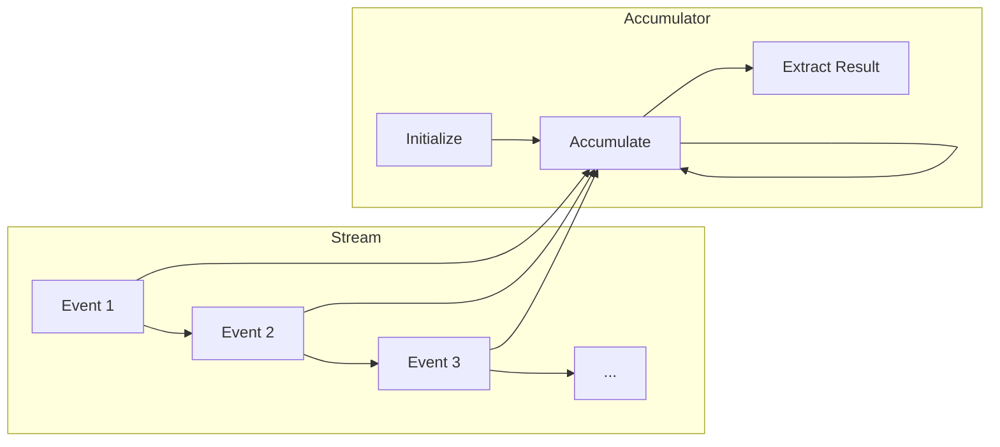
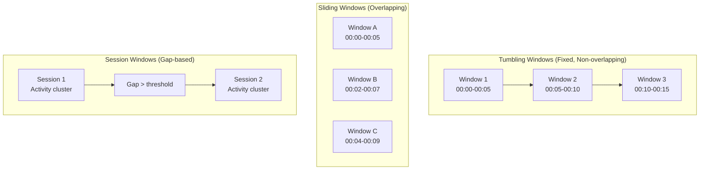
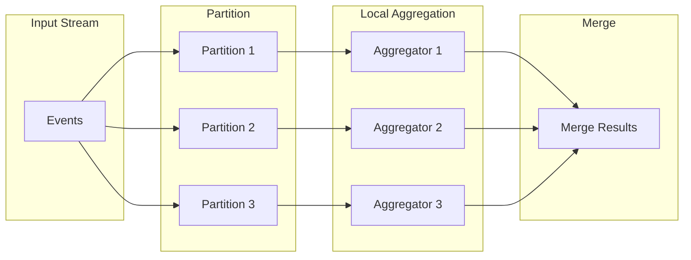
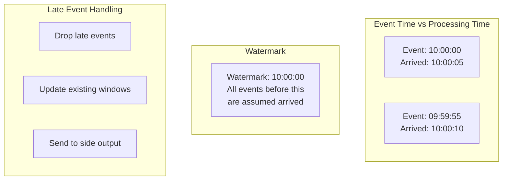

# How to Implement Aggregation Functions

Author: [nawazdhandala](https://github.com/nawazdhandala)

Tags: Stream Processing, Aggregation, Analytics, Real-Time

Description: Learn to implement aggregation functions in stream processing for computing running totals, averages, and statistics in real-time.

---

Stream processing systems handle data that flows continuously rather than data that sits in a database waiting to be queried. When you need to compute totals, averages, or other statistics over this flowing data, you need aggregation functions designed specifically for streams. Unlike batch processing where you can scan all data multiple times, stream aggregations must process each event once and maintain intermediate state that produces correct results at any point in time.

This guide covers how to implement aggregation functions that work correctly in streaming contexts, from simple counters to complex statistical measures.

## Why Stream Aggregations Differ from Batch

In batch processing, computing an average is straightforward: sum all values, divide by count. You have access to the complete dataset.

```python
# Batch processing - simple but requires all data in memory
def batch_average(values):
    return sum(values) / len(values)
```

In stream processing, events arrive one at a time. You cannot store all events (memory would explode), and you need results available at any moment. This requires a fundamentally different approach.

```python
# Stream processing - incremental, bounded memory
class StreamingAverage:
    def __init__(self):
        self.sum = 0.0
        self.count = 0

    def add(self, value):
        self.sum += value
        self.count += 1

    def get_average(self):
        if self.count == 0:
            return 0.0
        return self.sum / self.count
```

The key insight: stream aggregations maintain **accumulators** that can be updated incrementally and queried at any time.

## The Accumulator Pattern

Every stream aggregation follows the same pattern:

1. **Initialize** an accumulator with a starting state
2. **Accumulate** each incoming event into the state
3. **Extract** the result from the current state



This pattern enables bounded memory usage regardless of how many events flow through the system.

## Built-in Aggregation Functions

Most stream processing frameworks provide these common aggregations out of the box.

### Count

The simplest aggregation. Increment a counter for each event.

```typescript
// TypeScript implementation of a streaming counter
class CountAggregator {
    private count: number = 0;

    // Called for each incoming event
    accumulate(event: unknown): void {
        this.count += 1;
    }

    // Return current count at any time
    getResult(): number {
        return this.count;
    }

    // Reset for new window (if using windowed aggregation)
    reset(): void {
        this.count = 0;
    }
}
```

### Sum

Accumulate a running total of numeric values.

```typescript
class SumAggregator {
    private sum: number = 0;

    // Extract the numeric field and add to running total
    accumulate(event: { value: number }): void {
        this.sum += event.value;
    }

    getResult(): number {
        return this.sum;
    }

    reset(): void {
        this.sum = 0;
    }
}
```

### Min and Max

Track extreme values seen so far.

```typescript
class MinMaxAggregator {
    private min: number = Infinity;
    private max: number = -Infinity;

    accumulate(event: { value: number }): void {
        // Update min if this value is smaller
        if (event.value < this.min) {
            this.min = event.value;
        }
        // Update max if this value is larger
        if (event.value > this.max) {
            this.max = event.value;
        }
    }

    getResult(): { min: number; max: number } {
        return { min: this.min, max: this.max };
    }

    reset(): void {
        this.min = Infinity;
        this.max = -Infinity;
    }
}
```

### Average

Requires tracking both sum and count to compute the mean.

```typescript
class AverageAggregator {
    private sum: number = 0;
    private count: number = 0;

    accumulate(event: { value: number }): void {
        this.sum += event.value;
        this.count += 1;
    }

    // Compute average from accumulated state
    getResult(): number {
        if (this.count === 0) {
            return 0;
        }
        return this.sum / this.count;
    }

    reset(): void {
        this.sum = 0;
        this.count = 0;
    }
}
```

## Implementing Custom Aggregations

When built-in aggregations do not meet your needs, you can build custom ones following the accumulator pattern.

### Variance and Standard Deviation

Computing variance in a stream requires Welford's online algorithm to maintain numerical stability and avoid storing all values.

```typescript
// Welford's algorithm for computing variance in a single pass
// This avoids the numerical instability of computing sum of squares
class VarianceAggregator {
    private count: number = 0;
    private mean: number = 0;
    private m2: number = 0;  // Sum of squared differences from mean

    accumulate(event: { value: number }): void {
        this.count += 1;

        // Delta between new value and current mean
        const delta = event.value - this.mean;

        // Update mean incrementally
        this.mean += delta / this.count;

        // Delta between new value and updated mean
        const delta2 = event.value - this.mean;

        // Update sum of squared differences
        this.m2 += delta * delta2;
    }

    getResult(): { variance: number; stddev: number; mean: number } {
        if (this.count < 2) {
            return { variance: 0, stddev: 0, mean: this.mean };
        }

        // Sample variance (divide by n-1)
        const variance = this.m2 / (this.count - 1);

        return {
            variance,
            stddev: Math.sqrt(variance),
            mean: this.mean
        };
    }

    reset(): void {
        this.count = 0;
        this.mean = 0;
        this.m2 = 0;
    }
}
```

### Percentiles with T-Digest

Exact percentiles require storing all values, which is not practical for streams. The T-Digest algorithm provides accurate percentile estimates using bounded memory.

```typescript
// Simplified T-Digest centroid for percentile estimation
// A centroid represents a cluster of values with a mean and count
interface Centroid {
    mean: number;
    count: number;
}

class TDigestAggregator {
    private centroids: Centroid[] = [];
    private compression: number;
    private maxCentroids: number;

    constructor(compression: number = 100) {
        // Higher compression = more accuracy but more memory
        this.compression = compression;
        this.maxCentroids = Math.ceil(compression * Math.PI / 2);
    }

    accumulate(event: { value: number }): void {
        // Add new value as a centroid with count 1
        this.centroids.push({ mean: event.value, count: 1 });

        // Compress if we exceed max centroids
        if (this.centroids.length > this.maxCentroids) {
            this.compress();
        }
    }

    // Merge nearby centroids to reduce memory usage
    private compress(): void {
        // Sort centroids by mean
        this.centroids.sort((a, b) => a.mean - b.mean);

        const compressed: Centroid[] = [];
        let current: Centroid | null = null;

        for (const centroid of this.centroids) {
            if (current === null) {
                current = { ...centroid };
            } else {
                // Merge if combined weight is below threshold
                const newCount = current.count + centroid.count;
                if (newCount <= this.compression) {
                    // Weighted mean of merged centroids
                    current.mean = (current.mean * current.count +
                                   centroid.mean * centroid.count) / newCount;
                    current.count = newCount;
                } else {
                    compressed.push(current);
                    current = { ...centroid };
                }
            }
        }

        if (current !== null) {
            compressed.push(current);
        }

        this.centroids = compressed;
    }

    // Estimate percentile (0-100) from digest
    getPercentile(p: number): number {
        if (this.centroids.length === 0) {
            return 0;
        }

        // Sort by mean
        const sorted = [...this.centroids].sort((a, b) => a.mean - b.mean);

        // Calculate total count
        const totalCount = sorted.reduce((sum, c) => sum + c.count, 0);

        // Target rank for this percentile
        const targetRank = (p / 100) * totalCount;

        // Find centroid containing target rank
        let cumulativeCount = 0;
        for (const centroid of sorted) {
            cumulativeCount += centroid.count;
            if (cumulativeCount >= targetRank) {
                return centroid.mean;
            }
        }

        return sorted[sorted.length - 1].mean;
    }

    getResult(): { p50: number; p95: number; p99: number } {
        return {
            p50: this.getPercentile(50),
            p95: this.getPercentile(95),
            p99: this.getPercentile(99)
        };
    }

    reset(): void {
        this.centroids = [];
    }
}
```

### Distinct Count with HyperLogLog

Counting distinct values exactly requires storing all seen values. HyperLogLog estimates cardinality with roughly 2% error using only a few kilobytes of memory.

```typescript
// HyperLogLog for approximate distinct count
// Uses probabilistic counting based on leading zeros in hashed values
class HyperLogLogAggregator {
    private registers: Uint8Array;
    private numRegisters: number;
    private alphaMM: number;

    constructor(precision: number = 14) {
        // Precision determines accuracy vs memory tradeoff
        // 14 bits = 16384 registers = ~16KB memory, ~0.8% error
        this.numRegisters = 1 << precision;
        this.registers = new Uint8Array(this.numRegisters);

        // Bias correction constant
        this.alphaMM = 0.7213 / (1 + 1.079 / this.numRegisters) *
                       this.numRegisters * this.numRegisters;
    }

    // Simple hash function (use a proper one in production)
    private hash(value: string): number {
        let hash = 0;
        for (let i = 0; i < value.length; i++) {
            const char = value.charCodeAt(i);
            hash = ((hash << 5) - hash) + char;
            hash = hash & hash;  // Convert to 32bit integer
        }
        return hash >>> 0;  // Ensure unsigned
    }

    // Count leading zeros in a 32-bit integer
    private countLeadingZeros(n: number): number {
        if (n === 0) return 32;
        let count = 0;
        while ((n & 0x80000000) === 0) {
            count++;
            n <<= 1;
        }
        return count;
    }

    accumulate(event: { id: string }): void {
        const hashValue = this.hash(event.id);

        // Use first bits to determine register
        const registerIndex = hashValue & (this.numRegisters - 1);

        // Count leading zeros in remaining bits
        const leadingZeros = this.countLeadingZeros(hashValue >>>
            Math.log2(this.numRegisters)) + 1;

        // Keep maximum leading zeros seen for this register
        if (leadingZeros > this.registers[registerIndex]) {
            this.registers[registerIndex] = leadingZeros;
        }
    }

    getResult(): number {
        // Harmonic mean of 2^register values
        let sum = 0;
        let zeros = 0;

        for (const register of this.registers) {
            sum += Math.pow(2, -register);
            if (register === 0) zeros++;
        }

        let estimate = this.alphaMM / sum;

        // Small range correction
        if (estimate <= 2.5 * this.numRegisters && zeros > 0) {
            estimate = this.numRegisters *
                       Math.log(this.numRegisters / zeros);
        }

        return Math.round(estimate);
    }

    reset(): void {
        this.registers.fill(0);
    }
}
```

## Windowed Aggregations

Real streams need aggregations over time windows, not unbounded totals. Windows define which events contribute to each result.



### Tumbling Window Implementation

Tumbling windows are fixed-size, non-overlapping. Each event belongs to exactly one window.

```typescript
interface WindowedEvent {
    timestamp: number;  // Unix timestamp in milliseconds
    value: number;
}

interface WindowResult {
    windowStart: number;
    windowEnd: number;
    result: number;
}

class TumblingWindowSum {
    private windowSizeMs: number;
    private windows: Map<number, number> = new Map();

    constructor(windowSizeMs: number) {
        this.windowSizeMs = windowSizeMs;
    }

    // Determine which window an event belongs to
    private getWindowStart(timestamp: number): number {
        return Math.floor(timestamp / this.windowSizeMs) * this.windowSizeMs;
    }

    accumulate(event: WindowedEvent): void {
        const windowStart = this.getWindowStart(event.timestamp);

        // Get current sum for this window, defaulting to 0
        const currentSum = this.windows.get(windowStart) || 0;

        // Update the window sum
        this.windows.set(windowStart, currentSum + event.value);
    }

    // Get results for all completed windows
    getCompletedWindows(currentTime: number): WindowResult[] {
        const results: WindowResult[] = [];
        const currentWindowStart = this.getWindowStart(currentTime);

        for (const [windowStart, sum] of this.windows.entries()) {
            // Window is complete if its end time has passed
            if (windowStart + this.windowSizeMs <= currentWindowStart) {
                results.push({
                    windowStart,
                    windowEnd: windowStart + this.windowSizeMs,
                    result: sum
                });
            }
        }

        return results;
    }

    // Remove old windows to prevent memory growth
    evictOldWindows(cutoffTime: number): void {
        for (const windowStart of this.windows.keys()) {
            if (windowStart + this.windowSizeMs < cutoffTime) {
                this.windows.delete(windowStart);
            }
        }
    }
}
```

### Sliding Window with Efficient Updates

Sliding windows overlap, so events may contribute to multiple windows. A naive implementation recomputes aggregations from scratch for each window. An efficient implementation maintains state that can be updated incrementally.

```typescript
// Sliding window using a ring buffer for O(1) updates
class SlidingWindowAverage {
    private windowSizeMs: number;
    private slideIntervalMs: number;
    private events: { timestamp: number; value: number }[] = [];
    private sum: number = 0;

    constructor(windowSizeMs: number, slideIntervalMs: number) {
        this.windowSizeMs = windowSizeMs;
        this.slideIntervalMs = slideIntervalMs;
    }

    accumulate(event: { timestamp: number; value: number }): void {
        // Add new event
        this.events.push(event);
        this.sum += event.value;

        // Remove events outside the window
        this.evictExpired(event.timestamp);
    }

    private evictExpired(currentTime: number): void {
        const cutoff = currentTime - this.windowSizeMs;

        // Remove old events from the front
        while (this.events.length > 0 && this.events[0].timestamp < cutoff) {
            const removed = this.events.shift()!;
            this.sum -= removed.value;
        }
    }

    getResult(currentTime: number): number {
        this.evictExpired(currentTime);

        if (this.events.length === 0) {
            return 0;
        }

        return this.sum / this.events.length;
    }
}

// For invertible aggregations (sum, count), use subtract-on-expire
// For non-invertible (min, max), use a different data structure
class SlidingWindowMinMax {
    private windowSizeMs: number;
    private events: { timestamp: number; value: number }[] = [];
    // Monotonic deques maintain min/max candidates efficiently
    private minDeque: { timestamp: number; value: number }[] = [];
    private maxDeque: { timestamp: number; value: number }[] = [];

    constructor(windowSizeMs: number) {
        this.windowSizeMs = windowSizeMs;
    }

    accumulate(event: { timestamp: number; value: number }): void {
        const cutoff = event.timestamp - this.windowSizeMs;

        // Remove expired entries from deques
        while (this.minDeque.length > 0 &&
               this.minDeque[0].timestamp < cutoff) {
            this.minDeque.shift();
        }
        while (this.maxDeque.length > 0 &&
               this.maxDeque[0].timestamp < cutoff) {
            this.maxDeque.shift();
        }

        // Maintain monotonically increasing deque for min
        // Remove elements larger than new value (they can never be min)
        while (this.minDeque.length > 0 &&
               this.minDeque[this.minDeque.length - 1].value >= event.value) {
            this.minDeque.pop();
        }
        this.minDeque.push(event);

        // Maintain monotonically decreasing deque for max
        // Remove elements smaller than new value (they can never be max)
        while (this.maxDeque.length > 0 &&
               this.maxDeque[this.maxDeque.length - 1].value <= event.value) {
            this.maxDeque.pop();
        }
        this.maxDeque.push(event);
    }

    getResult(): { min: number; max: number } {
        return {
            min: this.minDeque.length > 0 ? this.minDeque[0].value : 0,
            max: this.maxDeque.length > 0 ? this.maxDeque[0].value : 0
        };
    }
}
```

## Combining Aggregations

Complex metrics often require combining multiple aggregations. Design aggregators to be composable.

```typescript
// Generic aggregator interface for composition
interface Aggregator<TEvent, TResult> {
    accumulate(event: TEvent): void;
    getResult(): TResult;
    reset(): void;
}

// Combine multiple aggregators into one
class CompositeAggregator<TEvent> {
    private aggregators: Map<string, Aggregator<TEvent, unknown>> = new Map();

    add<TResult>(name: string, aggregator: Aggregator<TEvent, TResult>): void {
        this.aggregators.set(name, aggregator);
    }

    accumulate(event: TEvent): void {
        // Fan out event to all child aggregators
        for (const aggregator of this.aggregators.values()) {
            aggregator.accumulate(event);
        }
    }

    getResult(): Record<string, unknown> {
        const results: Record<string, unknown> = {};

        for (const [name, aggregator] of this.aggregators.entries()) {
            results[name] = aggregator.getResult();
        }

        return results;
    }

    reset(): void {
        for (const aggregator of this.aggregators.values()) {
            aggregator.reset();
        }
    }
}

// Usage: Create a metrics dashboard aggregator
const metricsAggregator = new CompositeAggregator<{ value: number }>();

metricsAggregator.add('count', new CountAggregator());
metricsAggregator.add('sum', new SumAggregator());
metricsAggregator.add('average', new AverageAggregator());
metricsAggregator.add('variance', new VarianceAggregator());
metricsAggregator.add('minMax', new MinMaxAggregator());

// All aggregations computed in a single pass
metricsAggregator.accumulate({ value: 10 });
metricsAggregator.accumulate({ value: 20 });
metricsAggregator.accumulate({ value: 15 });

console.log(metricsAggregator.getResult());
// {
//   count: 3,
//   sum: 45,
//   average: 15,
//   variance: { variance: 25, stddev: 5, mean: 15 },
//   minMax: { min: 10, max: 20 }
// }
```

## Performance Optimization

### Pre-aggregation

When events arrive at high volume, pre-aggregate before storing or transmitting.

```typescript
// Pre-aggregate events before sending to storage
class PreAggregator {
    private buffer: Map<string, { sum: number; count: number }> = new Map();
    private flushIntervalMs: number;
    private lastFlush: number = Date.now();

    constructor(flushIntervalMs: number = 1000) {
        this.flushIntervalMs = flushIntervalMs;
    }

    // Group by key and aggregate locally
    accumulate(event: { key: string; value: number }): void {
        const current = this.buffer.get(event.key) || { sum: 0, count: 0 };
        current.sum += event.value;
        current.count += 1;
        this.buffer.set(event.key, current);

        // Flush periodically
        if (Date.now() - this.lastFlush > this.flushIntervalMs) {
            this.flush();
        }
    }

    // Send aggregated results downstream
    flush(): { key: string; sum: number; count: number }[] {
        const results = Array.from(this.buffer.entries()).map(
            ([key, agg]) => ({ key, ...agg })
        );

        this.buffer.clear();
        this.lastFlush = Date.now();

        return results;
    }
}
```

### Parallel Aggregation

For high-throughput streams, partition data and aggregate in parallel, then merge results.



```typescript
// Mergeable aggregator interface
interface MergeableAggregator<TEvent, TState, TResult> {
    accumulate(event: TEvent): void;
    getState(): TState;
    merge(other: TState): void;
    getResult(): TResult;
}

// Sum aggregator that supports merging partial results
class MergeableSumAggregator implements MergeableAggregator<
    { value: number },
    { sum: number },
    number
> {
    private sum: number = 0;

    accumulate(event: { value: number }): void {
        this.sum += event.value;
    }

    getState(): { sum: number } {
        return { sum: this.sum };
    }

    // Merge another aggregator's state into this one
    merge(other: { sum: number }): void {
        this.sum += other.sum;
    }

    getResult(): number {
        return this.sum;
    }
}

// Parallel aggregation coordinator
class ParallelAggregator {
    private partitions: MergeableSumAggregator[];
    private numPartitions: number;

    constructor(numPartitions: number) {
        this.numPartitions = numPartitions;
        this.partitions = Array.from(
            { length: numPartitions },
            () => new MergeableSumAggregator()
        );
    }

    // Hash-based partitioning
    private getPartition(key: string): number {
        let hash = 0;
        for (let i = 0; i < key.length; i++) {
            hash = ((hash << 5) - hash) + key.charCodeAt(i);
        }
        return Math.abs(hash) % this.numPartitions;
    }

    accumulate(event: { key: string; value: number }): void {
        const partition = this.getPartition(event.key);
        this.partitions[partition].accumulate(event);
    }

    // Merge all partitions to get final result
    getResult(): number {
        const merged = new MergeableSumAggregator();

        for (const partition of this.partitions) {
            merged.merge(partition.getState());
        }

        return merged.getResult();
    }
}
```

### Memory Management

Stream aggregations must not grow unbounded. Implement eviction policies.

```typescript
// LRU eviction for keyed aggregations
class BoundedKeyedAggregator {
    private maxKeys: number;
    private aggregators: Map<string, AverageAggregator> = new Map();
    private accessOrder: string[] = [];

    constructor(maxKeys: number) {
        this.maxKeys = maxKeys;
    }

    accumulate(event: { key: string; value: number }): void {
        // Get or create aggregator for this key
        let aggregator = this.aggregators.get(event.key);

        if (!aggregator) {
            // Evict least recently used if at capacity
            if (this.aggregators.size >= this.maxKeys) {
                const lruKey = this.accessOrder.shift()!;
                this.aggregators.delete(lruKey);
            }

            aggregator = new AverageAggregator();
            this.aggregators.set(event.key, aggregator);
        }

        // Update access order (move to end)
        const index = this.accessOrder.indexOf(event.key);
        if (index !== -1) {
            this.accessOrder.splice(index, 1);
        }
        this.accessOrder.push(event.key);

        aggregator.accumulate(event);
    }

    getResult(key: string): number | null {
        const aggregator = this.aggregators.get(key);
        return aggregator ? aggregator.getResult() : null;
    }
}
```

## Handling Late Data

In distributed systems, events can arrive out of order or late. Watermarks track event time progress.



```typescript
interface TimestampedEvent {
    eventTime: number;  // When event actually occurred
    value: number;
}

class WatermarkedAggregator {
    private watermark: number = 0;
    private allowedLateness: number;
    private windows: Map<number, { sum: number; count: number }> = new Map();
    private windowSizeMs: number;

    constructor(windowSizeMs: number, allowedLatenessMs: number) {
        this.windowSizeMs = windowSizeMs;
        this.allowedLateness = allowedLatenessMs;
    }

    // Advance watermark based on observed event times
    advanceWatermark(timestamp: number): void {
        // Watermark is typically max event time minus some slack
        const newWatermark = timestamp - this.allowedLateness;
        if (newWatermark > this.watermark) {
            this.watermark = newWatermark;
        }
    }

    accumulate(event: TimestampedEvent): 'accepted' | 'late_accepted' | 'dropped' {
        const windowStart = Math.floor(event.eventTime / this.windowSizeMs) *
                           this.windowSizeMs;
        const windowEnd = windowStart + this.windowSizeMs;

        // Check if event is too late
        if (windowEnd + this.allowedLateness < this.watermark) {
            return 'dropped';  // Too late, window already finalized
        }

        // Get or create window
        let window = this.windows.get(windowStart);
        if (!window) {
            window = { sum: 0, count: 0 };
            this.windows.set(windowStart, window);
        }

        window.sum += event.value;
        window.count += 1;

        // Advance watermark
        this.advanceWatermark(event.eventTime);

        // Return whether this was a late but accepted event
        return windowEnd < this.watermark ? 'late_accepted' : 'accepted';
    }

    // Get windows that are ready to emit (watermark has passed their end)
    getCompletedWindows(): { windowStart: number; average: number }[] {
        const results: { windowStart: number; average: number }[] = [];

        for (const [windowStart, window] of this.windows.entries()) {
            const windowEnd = windowStart + this.windowSizeMs;

            // Window is complete when watermark passes its end
            if (windowEnd <= this.watermark) {
                results.push({
                    windowStart,
                    average: window.sum / window.count
                });
            }
        }

        return results;
    }

    // Clean up old windows beyond allowed lateness
    evictExpiredWindows(): void {
        const cutoff = this.watermark - this.allowedLateness;

        for (const windowStart of this.windows.keys()) {
            const windowEnd = windowStart + this.windowSizeMs;
            if (windowEnd < cutoff) {
                this.windows.delete(windowStart);
            }
        }
    }
}
```

## Testing Stream Aggregations

Stream aggregations require careful testing due to their stateful nature.

```typescript
// Test utilities for stream aggregations
describe('StreamingAverage', () => {
    it('computes correct average incrementally', () => {
        const avg = new AverageAggregator();

        avg.accumulate({ value: 10 });
        expect(avg.getResult()).toBe(10);

        avg.accumulate({ value: 20 });
        expect(avg.getResult()).toBe(15);

        avg.accumulate({ value: 30 });
        expect(avg.getResult()).toBe(20);
    });

    it('handles empty state', () => {
        const avg = new AverageAggregator();
        expect(avg.getResult()).toBe(0);
    });

    it('resets correctly', () => {
        const avg = new AverageAggregator();

        avg.accumulate({ value: 100 });
        avg.reset();

        expect(avg.getResult()).toBe(0);

        avg.accumulate({ value: 50 });
        expect(avg.getResult()).toBe(50);
    });
});

describe('TumblingWindowSum', () => {
    it('assigns events to correct windows', () => {
        const windowSize = 60000;  // 1 minute
        const agg = new TumblingWindowSum(windowSize);

        // Events at different times
        agg.accumulate({ timestamp: 0, value: 10 });        // Window 0
        agg.accumulate({ timestamp: 30000, value: 20 });    // Window 0
        agg.accumulate({ timestamp: 60000, value: 30 });    // Window 1
        agg.accumulate({ timestamp: 90000, value: 40 });    // Window 1

        const results = agg.getCompletedWindows(120000);

        expect(results).toContainEqual({
            windowStart: 0,
            windowEnd: 60000,
            result: 30  // 10 + 20
        });
    });

    it('handles late events within allowed lateness', () => {
        const agg = new WatermarkedAggregator(60000, 10000);

        // Normal event
        expect(agg.accumulate({ eventTime: 50000, value: 10 }))
            .toBe('accepted');

        // Late but within allowed lateness
        expect(agg.accumulate({ eventTime: 45000, value: 20 }))
            .toBe('late_accepted');
    });
});
```

## Summary

| Aggregation Type | Memory | Use Case |
|-----------------|--------|----------|
| Count/Sum/Average | O(1) | Basic metrics |
| Min/Max | O(1) | Extreme values |
| Variance (Welford) | O(1) | Statistical analysis |
| Percentiles (T-Digest) | O(compression) | Latency analysis |
| Distinct Count (HLL) | O(2^precision) | Cardinality estimation |
| Sliding Window | O(window size) | Recent trends |
| Tumbling Window | O(active windows) | Time-bucketed metrics |

Key principles for stream aggregations:

1. **Use accumulators**: Process each event once, maintain bounded state
2. **Choose the right algorithm**: Welford for variance, T-Digest for percentiles, HyperLogLog for distinct counts
3. **Window appropriately**: Tumbling for non-overlapping periods, sliding for continuous trends
4. **Handle late data**: Use watermarks and allowed lateness policies
5. **Optimize for throughput**: Pre-aggregate, partition, and merge when needed
6. **Test thoroughly**: Verify incremental correctness, edge cases, and reset behavior

Stream aggregations form the foundation of real-time analytics. By understanding the accumulator pattern and choosing appropriate algorithms, you can compute accurate statistics over unbounded data streams while maintaining predictable memory usage and latency.
