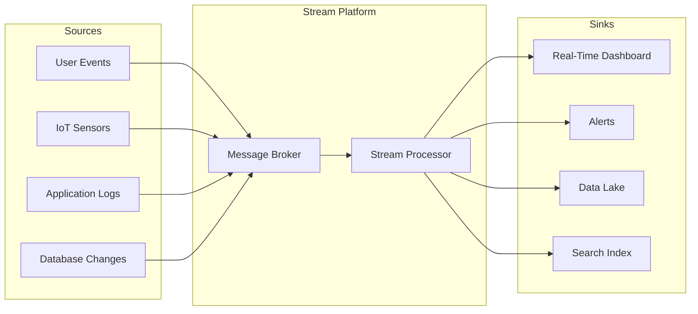
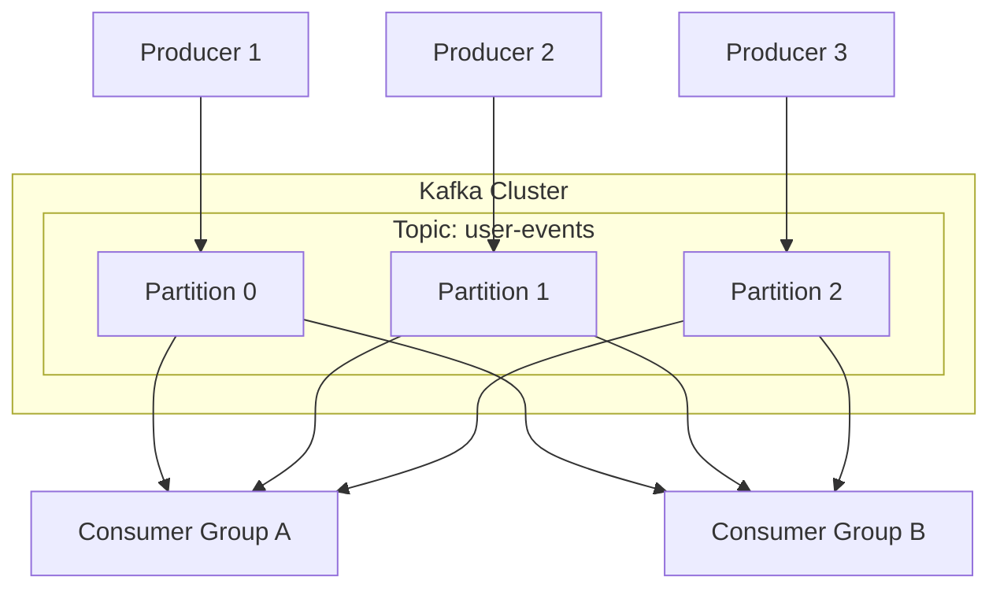
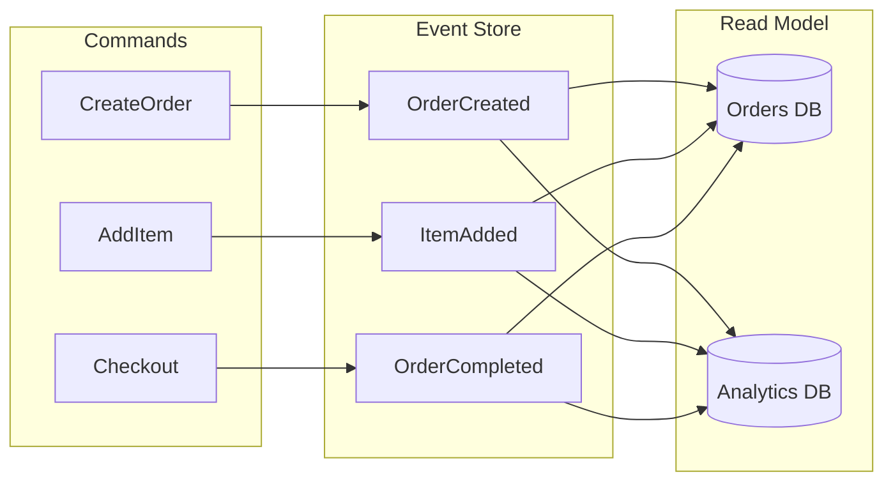
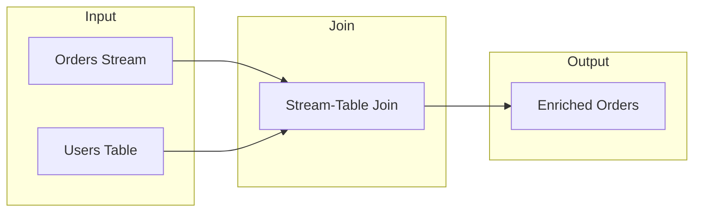
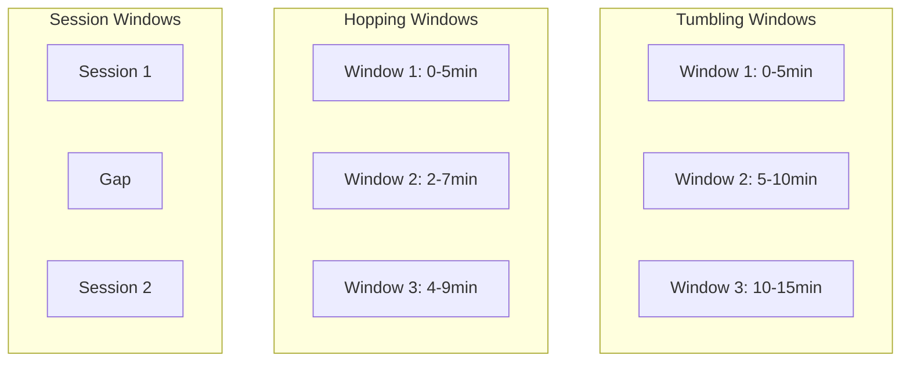
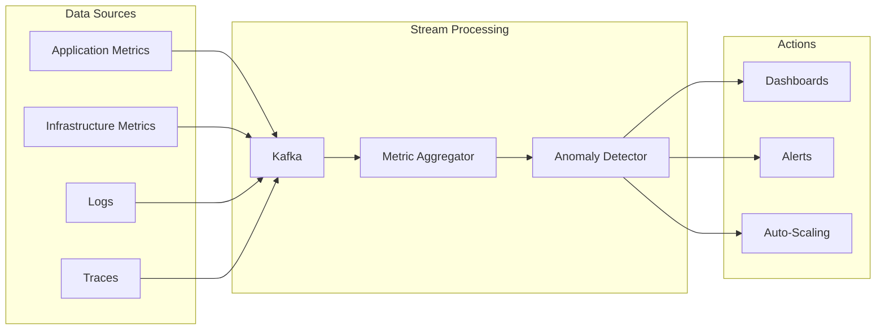
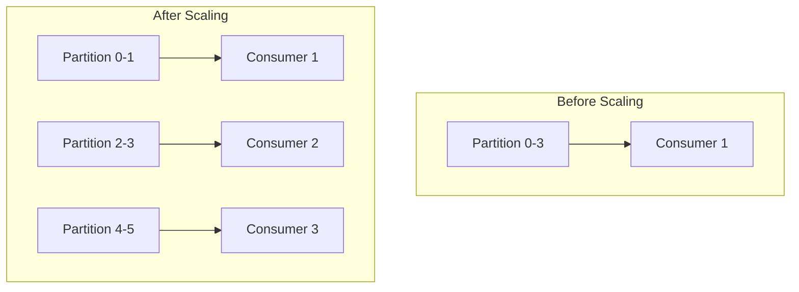

# How to Build Stream Processing Architecture

Author: [nawazdhandala](https://github.com/nawazdhandala)

Tags: Stream Processing, Kafka, Architecture, DevOps, Real-Time Data

Description: A practical guide to building scalable stream processing systems with Apache Kafka, including architecture patterns, code examples, and real-world use cases for handling millions of events per second.

---

You have data flowing in. Lots of it. User clicks, sensor readings, transaction logs, application metrics. The traditional approach of batch processing every few hours is no longer enough. Your users expect real-time dashboards, instant fraud detection, and live recommendations. This is where stream processing comes in.

Stream processing lets you react to data as it arrives, not hours later. But building a reliable stream processing architecture requires understanding the fundamental patterns, choosing the right tools, and avoiding common pitfalls that can bring your pipeline to its knees.

## What Is Stream Processing?

Stream processing is the continuous processing of data records as they arrive, rather than waiting to collect batches of data first.



Key characteristics:
- **Low latency** - Process events within milliseconds to seconds
- **Continuous** - Always running, always processing
- **Stateful** - Can maintain state across events (aggregations, joins)
- **Scalable** - Handles throughput spikes by adding more workers

## Core Components of a Stream Architecture

### 1. Message Broker (The Backbone)

The message broker is the central nervous system of your stream architecture. Apache Kafka has become the de facto standard.



Why Kafka?
- **Durability** - Messages persisted to disk with replication
- **Ordering** - Guaranteed order within partitions
- **Replay** - Consumers can re-read historical data
- **Throughput** - Millions of messages per second

### 2. Stream Processor (The Brain)

The stream processor transforms, aggregates, and routes your data. Popular choices include Apache Flink, Kafka Streams, and Apache Spark Streaming.

### 3. State Store (The Memory)

Stream processors often need to remember things: running counts, session windows, or lookup tables. State stores provide this capability with fault tolerance.

## Setting Up Kafka

Let's start with a production-ready Kafka setup using Docker Compose.

This configuration creates a three-node Kafka cluster with KRaft mode (no ZooKeeper needed). Each broker is configured for production use with replication and proper listener setup.

```yaml
# docker-compose.yml
version: '3.8'
services:
  kafka-1:
    image: confluentinc/cp-kafka:7.5.0
    hostname: kafka-1
    container_name: kafka-1
    ports:
      - "9092:9092"
    environment:
      KAFKA_NODE_ID: 1
      KAFKA_LISTENER_SECURITY_PROTOCOL_MAP: CONTROLLER:PLAINTEXT,PLAINTEXT:PLAINTEXT,PLAINTEXT_HOST:PLAINTEXT
      KAFKA_ADVERTISED_LISTENERS: PLAINTEXT://kafka-1:29092,PLAINTEXT_HOST://localhost:9092
      KAFKA_PROCESS_ROLES: broker,controller
      KAFKA_CONTROLLER_QUORUM_VOTERS: 1@kafka-1:29093,2@kafka-2:29093,3@kafka-3:29093
      KAFKA_LISTENERS: PLAINTEXT://kafka-1:29092,CONTROLLER://kafka-1:29093,PLAINTEXT_HOST://0.0.0.0:9092
      KAFKA_INTER_BROKER_LISTENER_NAME: PLAINTEXT
      KAFKA_CONTROLLER_LISTENER_NAMES: CONTROLLER
      KAFKA_OFFSETS_TOPIC_REPLICATION_FACTOR: 3
      KAFKA_TRANSACTION_STATE_LOG_REPLICATION_FACTOR: 3
      KAFKA_TRANSACTION_STATE_LOG_MIN_ISR: 2
      CLUSTER_ID: MkU3OEVBNTcwNTJENDM2Qk
    volumes:
      - kafka-1-data:/var/lib/kafka/data

  kafka-2:
    image: confluentinc/cp-kafka:7.5.0
    hostname: kafka-2
    container_name: kafka-2
    ports:
      - "9093:9093"
    environment:
      KAFKA_NODE_ID: 2
      KAFKA_LISTENER_SECURITY_PROTOCOL_MAP: CONTROLLER:PLAINTEXT,PLAINTEXT:PLAINTEXT,PLAINTEXT_HOST:PLAINTEXT
      KAFKA_ADVERTISED_LISTENERS: PLAINTEXT://kafka-2:29092,PLAINTEXT_HOST://localhost:9093
      KAFKA_PROCESS_ROLES: broker,controller
      KAFKA_CONTROLLER_QUORUM_VOTERS: 1@kafka-1:29093,2@kafka-2:29093,3@kafka-3:29093
      KAFKA_LISTENERS: PLAINTEXT://kafka-2:29092,CONTROLLER://kafka-2:29093,PLAINTEXT_HOST://0.0.0.0:9093
      KAFKA_INTER_BROKER_LISTENER_NAME: PLAINTEXT
      KAFKA_CONTROLLER_LISTENER_NAMES: CONTROLLER
      KAFKA_OFFSETS_TOPIC_REPLICATION_FACTOR: 3
      KAFKA_TRANSACTION_STATE_LOG_REPLICATION_FACTOR: 3
      KAFKA_TRANSACTION_STATE_LOG_MIN_ISR: 2
      CLUSTER_ID: MkU3OEVBNTcwNTJENDM2Qk
    volumes:
      - kafka-2-data:/var/lib/kafka/data

  kafka-3:
    image: confluentinc/cp-kafka:7.5.0
    hostname: kafka-3
    container_name: kafka-3
    ports:
      - "9094:9094"
    environment:
      KAFKA_NODE_ID: 3
      KAFKA_LISTENER_SECURITY_PROTOCOL_MAP: CONTROLLER:PLAINTEXT,PLAINTEXT:PLAINTEXT,PLAINTEXT_HOST:PLAINTEXT
      KAFKA_ADVERTISED_LISTENERS: PLAINTEXT://kafka-3:29092,PLAINTEXT_HOST://localhost:9094
      KAFKA_PROCESS_ROLES: broker,controller
      KAFKA_CONTROLLER_QUORUM_VOTERS: 1@kafka-1:29093,2@kafka-2:29093,3@kafka-3:29093
      KAFKA_LISTENERS: PLAINTEXT://kafka-3:29092,CONTROLLER://kafka-3:29093,PLAINTEXT_HOST://0.0.0.0:9094
      KAFKA_INTER_BROKER_LISTENER_NAME: PLAINTEXT
      KAFKA_CONTROLLER_LISTENER_NAMES: CONTROLLER
      KAFKA_OFFSETS_TOPIC_REPLICATION_FACTOR: 3
      KAFKA_TRANSACTION_STATE_LOG_REPLICATION_FACTOR: 3
      KAFKA_TRANSACTION_STATE_LOG_MIN_ISR: 2
      CLUSTER_ID: MkU3OEVBNTcwNTJENDM2Qk
    volumes:
      - kafka-3-data:/var/lib/kafka/data

volumes:
  kafka-1-data:
  kafka-2-data:
  kafka-3-data:
```

Create topics with proper partitioning. The partition count should match your expected parallelism. More partitions allow more parallel consumers, but too many partitions add overhead.

```bash
# Create a topic with 12 partitions and replication factor of 3
kafka-topics.sh --create \
  --bootstrap-server localhost:9092 \
  --topic user-events \
  --partitions 12 \
  --replication-factor 3 \
  --config retention.ms=604800000 \
  --config cleanup.policy=delete
```

## Building a Producer

Here is a Node.js producer that sends events to Kafka with proper error handling and batching. The producer uses the kafkajs library and implements idempotent writes for exactly-once semantics.

```javascript
// producer.js
const { Kafka, CompressionTypes } = require('kafkajs');

// Initialize the Kafka client with multiple brokers for redundancy
const kafka = new Kafka({
  clientId: 'event-producer',
  brokers: ['localhost:9092', 'localhost:9093', 'localhost:9094'],
  // Retry configuration for transient failures
  retry: {
    initialRetryTime: 100,
    retries: 8
  }
});

const producer = kafka.producer({
  // Enable idempotent producer for exactly-once semantics
  idempotent: true,
  // Maximum time to wait for acknowledgments
  maxInFlightRequests: 5,
  // Require all replicas to acknowledge
  acks: -1
});

// Connect once at startup, not per message
async function initProducer() {
  await producer.connect();
  console.log('Producer connected to Kafka');
}

// Send a single event with proper partitioning
async function sendEvent(topic, event) {
  const message = {
    // Use a consistent key for ordering (same key = same partition)
    key: event.userId,
    // Always include a timestamp for time-based processing
    timestamp: Date.now().toString(),
    // Serialize the event payload
    value: JSON.stringify({
      ...event,
      producedAt: new Date().toISOString()
    }),
    // Optional headers for metadata without parsing the body
    headers: {
      'event-type': event.type,
      'schema-version': '1.0'
    }
  };

  try {
    const result = await producer.send({
      topic,
      // Use compression for better throughput
      compression: CompressionTypes.LZ4,
      messages: [message]
    });
    return result;
  } catch (error) {
    console.error('Failed to send message:', error);
    throw error;
  }
}

// Batch send for high throughput scenarios
async function sendEventBatch(topic, events) {
  const messages = events.map(event => ({
    key: event.userId,
    timestamp: Date.now().toString(),
    value: JSON.stringify(event),
    headers: {
      'event-type': event.type,
      'schema-version': '1.0'
    }
  }));

  return producer.send({
    topic,
    compression: CompressionTypes.LZ4,
    messages
  });
}

// Graceful shutdown
async function shutdown() {
  await producer.disconnect();
  console.log('Producer disconnected');
}

module.exports = { initProducer, sendEvent, sendEventBatch, shutdown };
```

## Building a Consumer

The consumer processes events from Kafka. This implementation uses consumer groups for parallel processing and handles offset commits properly.

```javascript
// consumer.js
const { Kafka } = require('kafkajs');

const kafka = new Kafka({
  clientId: 'event-consumer',
  brokers: ['localhost:9092', 'localhost:9093', 'localhost:9094']
});

// Create a consumer in a consumer group
// All consumers in the same group share the workload
const consumer = kafka.consumer({
  groupId: 'event-processor-group',
  // Start from the earliest message if no offset is stored
  sessionTimeout: 30000,
  // Heartbeat interval should be 1/3 of session timeout
  heartbeatInterval: 10000,
  // Maximum bytes to fetch per partition
  maxBytesPerPartition: 1048576
});

async function startConsumer(topic, processEvent) {
  await consumer.connect();

  // Subscribe to the topic
  await consumer.subscribe({
    topic,
    // Start from the beginning if this is a new consumer group
    fromBeginning: false
  });

  // Process messages
  await consumer.run({
    // Process messages one at a time for simplicity
    // Set to higher number for batching
    eachBatchAutoResolve: true,

    eachMessage: async ({ topic, partition, message }) => {
      const event = {
        key: message.key?.toString(),
        value: JSON.parse(message.value.toString()),
        headers: Object.fromEntries(
          Object.entries(message.headers || {}).map(
            ([k, v]) => [k, v.toString()]
          )
        ),
        partition,
        offset: message.offset,
        timestamp: message.timestamp
      };

      try {
        // Process the event (your business logic here)
        await processEvent(event);

        // Offset is committed automatically after successful processing
        // For manual commits, set autoCommit: false and call commitOffsets()
      } catch (error) {
        console.error(`Error processing message at offset ${message.offset}:`, error);
        // Decide: skip, retry, or dead-letter queue
        throw error; // This will trigger a retry
      }
    }
  });
}

// Example event processor
async function processUserEvent(event) {
  console.log(`Processing event from partition ${event.partition}:`, event.value);

  // Simulate some processing work
  switch (event.value.type) {
    case 'page_view':
      await trackPageView(event.value);
      break;
    case 'purchase':
      await processPurchase(event.value);
      break;
    case 'signup':
      await handleSignup(event.value);
      break;
    default:
      console.log('Unknown event type:', event.value.type);
  }
}

// Graceful shutdown
process.on('SIGTERM', async () => {
  console.log('Shutting down consumer...');
  await consumer.disconnect();
  process.exit(0);
});

// Start the consumer
startConsumer('user-events', processUserEvent);
```

## Stream Processing with Kafka Streams

For more complex processing like aggregations, joins, and windowing, use a stream processing framework. Here is an example using the Java-based Kafka Streams library.

This topology reads user events, filters for purchases, and maintains a real-time count of purchases per user in a tumbling window.

```java
// StreamProcessor.java
import org.apache.kafka.common.serialization.Serdes;
import org.apache.kafka.streams.*;
import org.apache.kafka.streams.kstream.*;
import java.time.Duration;
import java.util.Properties;

public class StreamProcessor {
    public static void main(String[] args) {
        // Configure the stream processor
        Properties props = new Properties();
        props.put(StreamsConfig.APPLICATION_ID_CONFIG, "purchase-counter");
        props.put(StreamsConfig.BOOTSTRAP_SERVERS_CONFIG, "localhost:9092");
        props.put(StreamsConfig.DEFAULT_KEY_SERDE_CLASS_CONFIG, Serdes.String().getClass());
        props.put(StreamsConfig.DEFAULT_VALUE_SERDE_CLASS_CONFIG, Serdes.String().getClass());
        // Enable exactly-once processing
        props.put(StreamsConfig.PROCESSING_GUARANTEE_CONFIG, StreamsConfig.EXACTLY_ONCE_V2);

        // Build the topology
        StreamsBuilder builder = new StreamsBuilder();

        // Read from the input topic
        KStream<String, String> events = builder.stream("user-events");

        // Filter for purchase events only
        KStream<String, String> purchases = events
            .filter((key, value) -> {
                // Parse JSON and check event type
                // In production, use a proper JSON library
                return value.contains("\"type\":\"purchase\"");
            });

        // Count purchases per user in 5-minute windows
        KTable<Windowed<String>, Long> purchaseCounts = purchases
            .groupByKey()
            .windowedBy(TimeWindows.ofSizeWithNoGrace(Duration.ofMinutes(5)))
            .count(Materialized.as("purchase-counts-store"));

        // Write the counts to an output topic
        purchaseCounts
            .toStream()
            .map((windowedKey, count) -> {
                String key = windowedKey.key();
                String value = String.format(
                    "{\"userId\":\"%s\",\"count\":%d,\"windowStart\":\"%s\",\"windowEnd\":\"%s\"}",
                    key, count,
                    windowedKey.window().startTime(),
                    windowedKey.window().endTime()
                );
                return KeyValue.pair(key, value);
            })
            .to("purchase-counts");

        // Build and start the topology
        KafkaStreams streams = new KafkaStreams(builder.build(), props);

        // Graceful shutdown
        Runtime.getRuntime().addShutdownHook(new Thread(streams::close));

        streams.start();
    }
}
```

## Common Stream Processing Patterns

### Pattern 1: Event Sourcing

Store all state changes as a sequence of events. The current state can be reconstructed by replaying events.



### Pattern 2: CQRS (Command Query Responsibility Segregation)

Separate read and write paths for different optimization strategies.

The write path handles commands and produces events. This example shows how to implement the command handler.

```javascript
// command-handler.js
const { sendEvent } = require('./producer');

// Command handlers validate and produce events
async function handleCreateOrder(command) {
  // Validate the command
  if (!command.userId || !command.items?.length) {
    throw new Error('Invalid order command');
  }

  // Generate event
  const event = {
    type: 'ORDER_CREATED',
    aggregateId: generateOrderId(),
    userId: command.userId,
    items: command.items,
    timestamp: new Date().toISOString(),
    version: 1
  };

  // Persist to event store (Kafka topic)
  await sendEvent('order-events', event);

  return { orderId: event.aggregateId };
}

// The read side consumes events and builds query-optimized views
async function projectOrderEvent(event) {
  switch (event.type) {
    case 'ORDER_CREATED':
      // Insert into orders table
      await db.orders.insert({
        id: event.aggregateId,
        userId: event.userId,
        items: event.items,
        status: 'created',
        createdAt: event.timestamp
      });
      break;

    case 'ORDER_SHIPPED':
      // Update order status
      await db.orders.update(
        { id: event.aggregateId },
        { status: 'shipped', shippedAt: event.timestamp }
      );
      break;
  }
}
```

### Pattern 3: Stream-Table Join (Enrichment)

Enrich stream events with data from a table (compacted topic or external database).



This Kafka Streams example joins incoming orders with user profile data to create enriched order events.

```java
// Enrichment join example
StreamsBuilder builder = new StreamsBuilder();

// Stream of orders
KStream<String, Order> orders = builder.stream("orders");

// Table of user profiles (compacted topic)
KTable<String, UserProfile> users = builder.table("users");

// Join orders with user profiles
KStream<String, EnrichedOrder> enrichedOrders = orders
    .selectKey((k, v) -> v.getUserId()) // Re-key by userId
    .join(
        users,
        (order, user) -> new EnrichedOrder(
            order,
            user.getName(),
            user.getEmail(),
            user.getTier()
        )
    );

enrichedOrders.to("enriched-orders");
```

### Pattern 4: Windowed Aggregations

Compute aggregates over time windows for real-time analytics.

| Window Type | Description | Use Case |
|-------------|-------------|----------|
| Tumbling | Fixed-size, non-overlapping | Hourly reports |
| Hopping | Fixed-size, overlapping | Moving averages |
| Sliding | Based on event time | Recent activity |
| Session | Based on activity gaps | User sessions |



## Real-World Use Cases

### Use Case 1: Real-Time Fraud Detection

Detect fraudulent transactions as they happen by analyzing patterns across multiple dimensions.

```javascript
// fraud-detector.js
const FRAUD_RULES = {
  // More than 5 transactions in 1 minute from same user
  rapidTransactions: { count: 5, windowMs: 60000 },
  // Transaction amount > 10x average
  unusualAmount: { multiplier: 10 },
  // Transactions from 3+ countries in 1 hour
  geoVelocity: { countries: 3, windowMs: 3600000 }
};

class FraudDetector {
  constructor() {
    // In-memory state (use Redis in production)
    this.userTransactions = new Map();
    this.userAverages = new Map();
    this.userCountries = new Map();
  }

  async analyze(transaction) {
    const { userId, amount, country, timestamp } = transaction;
    const signals = [];

    // Check rapid transactions
    const recentTxns = this.getRecentTransactions(userId, timestamp);
    if (recentTxns.length >= FRAUD_RULES.rapidTransactions.count) {
      signals.push({
        rule: 'rapid_transactions',
        severity: 'high',
        details: `${recentTxns.length} transactions in last minute`
      });
    }

    // Check unusual amount
    const avgAmount = this.userAverages.get(userId) || amount;
    if (amount > avgAmount * FRAUD_RULES.unusualAmount.multiplier) {
      signals.push({
        rule: 'unusual_amount',
        severity: 'medium',
        details: `Amount ${amount} is ${(amount/avgAmount).toFixed(1)}x average`
      });
    }

    // Check geo velocity
    const recentCountries = this.getRecentCountries(userId, timestamp);
    if (recentCountries.size >= FRAUD_RULES.geoVelocity.countries) {
      signals.push({
        rule: 'geo_velocity',
        severity: 'high',
        details: `Transactions from ${recentCountries.size} countries in last hour`
      });
    }

    // Update state
    this.recordTransaction(userId, transaction);

    // Return fraud score
    return {
      transactionId: transaction.id,
      userId,
      fraudScore: this.calculateScore(signals),
      signals,
      action: signals.length > 0 ? 'REVIEW' : 'APPROVE'
    };
  }

  calculateScore(signals) {
    const weights = { high: 40, medium: 20, low: 10 };
    return Math.min(100, signals.reduce(
      (score, s) => score + weights[s.severity], 0
    ));
  }
}
```

### Use Case 2: Real-Time Monitoring and Alerting

Stream processing is perfect for observability. Process metrics, detect anomalies, and trigger alerts in real time.



This processor aggregates metrics and detects anomalies using statistical methods.

```javascript
// metrics-processor.js
class MetricsAggregator {
  constructor() {
    // Rolling windows for different time periods
    this.windows = {
      '1m': new Map(),
      '5m': new Map(),
      '1h': new Map()
    };
    this.baselines = new Map();
  }

  // Process incoming metric
  async processMetric(metric) {
    const { name, value, timestamp, tags } = metric;
    const key = this.buildKey(name, tags);

    // Update windows
    this.updateWindow('1m', key, value, timestamp);
    this.updateWindow('5m', key, value, timestamp);
    this.updateWindow('1h', key, value, timestamp);

    // Check for anomalies
    const anomaly = this.detectAnomaly(key, value);
    if (anomaly) {
      await this.triggerAlert(anomaly, metric);
    }

    // Emit aggregated metrics periodically
    return this.getAggregates(key);
  }

  detectAnomaly(key, value) {
    const baseline = this.baselines.get(key);
    if (!baseline) return null;

    const { mean, stdDev } = baseline;
    const zScore = Math.abs((value - mean) / stdDev);

    // Alert if value is more than 3 standard deviations from mean
    if (zScore > 3) {
      return {
        type: 'statistical_anomaly',
        key,
        value,
        expected: mean,
        deviation: zScore,
        severity: zScore > 5 ? 'critical' : 'warning'
      };
    }

    return null;
  }

  async triggerAlert(anomaly, metric) {
    console.log('ALERT:', anomaly);
    // Send to alerting system (PagerDuty, Slack, etc.)
    // Or produce to an alerts topic for further processing
  }
}
```

### Use Case 3: Clickstream Analytics

Track user behavior in real time for personalization and analytics.

```javascript
// clickstream-processor.js
class ClickstreamProcessor {
  constructor() {
    this.sessions = new Map();
    this.SESSION_TIMEOUT_MS = 30 * 60 * 1000; // 30 minutes
  }

  async processClick(event) {
    const { userId, sessionId, page, timestamp, referrer } = event;

    // Get or create session
    let session = this.sessions.get(sessionId);
    if (!session || this.isSessionExpired(session, timestamp)) {
      session = this.createSession(userId, sessionId, timestamp, referrer);
    }

    // Add page view to session
    session.pageViews.push({
      page,
      timestamp,
      duration: this.calculateDuration(session, timestamp)
    });

    // Update session metrics
    session.lastActivity = timestamp;
    session.pageCount++;

    // Emit real-time session update
    return {
      type: 'session_update',
      sessionId,
      userId,
      currentPage: page,
      pageCount: session.pageCount,
      duration: timestamp - session.startTime,
      referrer: session.referrer
    };
  }

  createSession(userId, sessionId, timestamp, referrer) {
    const session = {
      userId,
      sessionId,
      startTime: timestamp,
      lastActivity: timestamp,
      referrer,
      pageViews: [],
      pageCount: 0
    };
    this.sessions.set(sessionId, session);
    return session;
  }

  // Emit session summary when session ends
  finalizeSession(sessionId) {
    const session = this.sessions.get(sessionId);
    if (!session) return null;

    const summary = {
      type: 'session_complete',
      sessionId: session.sessionId,
      userId: session.userId,
      duration: session.lastActivity - session.startTime,
      pageCount: session.pageCount,
      pages: session.pageViews,
      bounced: session.pageCount === 1,
      referrer: session.referrer
    };

    this.sessions.delete(sessionId);
    return summary;
  }
}
```

## Scaling Your Stream Architecture

### Horizontal Scaling

Add more partitions and consumers to handle increased load.



Key scaling considerations:

| Factor | Recommendation |
|--------|----------------|
| Partitions | Start with 2-3x expected consumer count |
| Replication | Minimum 3 for production |
| Consumers | 1 consumer per partition max |
| Message Size | Keep under 1MB, ideally under 100KB |
| Retention | Based on replay needs (7 days typical) |

### Backpressure Handling

When consumers fall behind, implement backpressure to prevent system collapse.

```javascript
// backpressure-consumer.js
class BackpressureConsumer {
  constructor(maxQueueSize = 1000) {
    this.queue = [];
    this.maxQueueSize = maxQueueSize;
    this.paused = false;
  }

  async onMessage(message) {
    // Check queue size
    if (this.queue.length >= this.maxQueueSize) {
      if (!this.paused) {
        console.log('Pausing consumer due to backpressure');
        await this.consumer.pause([{ topic: this.topic }]);
        this.paused = true;
      }
    }

    this.queue.push(message);
    this.processQueue();
  }

  async processQueue() {
    while (this.queue.length > 0) {
      const message = this.queue.shift();
      await this.processMessage(message);

      // Resume if queue is draining
      if (this.paused && this.queue.length < this.maxQueueSize / 2) {
        console.log('Resuming consumer');
        await this.consumer.resume([{ topic: this.topic }]);
        this.paused = false;
      }
    }
  }
}
```

## Monitoring Your Stream Pipeline

Track these metrics for a healthy stream processing system:

| Metric | Target | Alert Threshold |
|--------|--------|-----------------|
| Consumer Lag | Near 0 | > 10,000 messages |
| Processing Latency | < 100ms | > 1 second |
| Throughput | Stable | > 20% variance |
| Error Rate | < 0.1% | > 1% |
| Rebalance Frequency | Rare | > 1 per hour |

Use OneUptime to monitor your Kafka cluster and stream processors. Set up alerts on consumer lag to catch processing bottlenecks before they impact users.

```yaml
# Example monitoring config
monitors:
  - name: kafka-consumer-lag
    type: metric
    query: kafka_consumer_group_lag
    threshold: 10000
    severity: warning

  - name: stream-processor-latency
    type: metric
    query: stream_processing_latency_p99
    threshold: 1000
    severity: critical

  - name: kafka-broker-health
    type: health_check
    endpoints:
      - kafka-1:9092
      - kafka-2:9093
      - kafka-3:9094
```

## Common Pitfalls and Solutions

| Problem | Symptom | Solution |
|---------|---------|----------|
| Hot partitions | Uneven consumer load | Better partition key distribution |
| Poison pills | Consumer stuck on one message | Dead letter queue + skip logic |
| Rebalance storms | Frequent consumer restarts | Increase session timeout, use static membership |
| Out of order events | Incorrect aggregations | Use event time, not processing time |
| Data loss | Messages disappearing | Enable acks=all, min.insync.replicas=2 |
| Memory pressure | OOM errors | Limit batch sizes, add backpressure |

### Handling Poison Pills

Messages that always fail processing can block your entire pipeline. Implement a dead letter queue.

```javascript
// dead-letter-handler.js
const MAX_RETRIES = 3;

async function processWithDLQ(message, processor) {
  const retryCount = parseInt(message.headers['retry-count'] || '0');

  try {
    await processor(message);
  } catch (error) {
    if (retryCount >= MAX_RETRIES) {
      // Send to dead letter queue
      await sendToDLQ(message, error);
      console.log(`Message sent to DLQ after ${retryCount} retries`);
    } else {
      // Retry with incremented count
      await retryMessage(message, retryCount + 1);
    }
  }
}

async function sendToDLQ(message, error) {
  await producer.send({
    topic: `${message.topic}.dlq`,
    messages: [{
      key: message.key,
      value: message.value,
      headers: {
        ...message.headers,
        'original-topic': message.topic,
        'error-message': error.message,
        'failed-at': new Date().toISOString()
      }
    }]
  });
}
```

## Getting Started Checklist

Here is your action plan for building a stream processing architecture:

- [ ] Define your events and schema (use Avro or JSON Schema)
- [ ] Set up Kafka cluster (start with 3 brokers minimum)
- [ ] Create topics with appropriate partitioning
- [ ] Implement producers with proper error handling
- [ ] Build consumers with offset management
- [ ] Add monitoring and alerting (OneUptime)
- [ ] Implement dead letter queues for failed messages
- [ ] Set up schema registry for evolution
- [ ] Document your event catalog
- [ ] Load test before production

## Conclusion

Stream processing is not just about handling more data faster. It is about building systems that react to the world in real time. The architecture patterns we covered, from simple pub/sub to complex event sourcing and CQRS, give you the tools to build responsive, scalable systems.

Start simple. A Kafka cluster, some producers and consumers, and basic monitoring will get you far. Add complexity like windowed aggregations and stream-table joins only when your use case demands it.

The most important thing is to invest in observability from day one. When that 3 AM alert fires because consumer lag is spiking, you will want to know exactly where in your pipeline the bottleneck lives.

**Related Reading:**

- [Logs, Metrics & Traces: The Three Pillars of Observability](https://oneuptime.com/blog/post/2025-08-20-three-pillars-of-observability-logs-metrics-traces/view)
- [What Is Site Reliability Engineering](https://oneuptime.com/blog/post/2025-11-28-what-is-site-reliability-engineering/view)
- [SRE Metrics to Track](https://oneuptime.com/blog/post/2025-11-28-sre-metrics-to-track/view)
