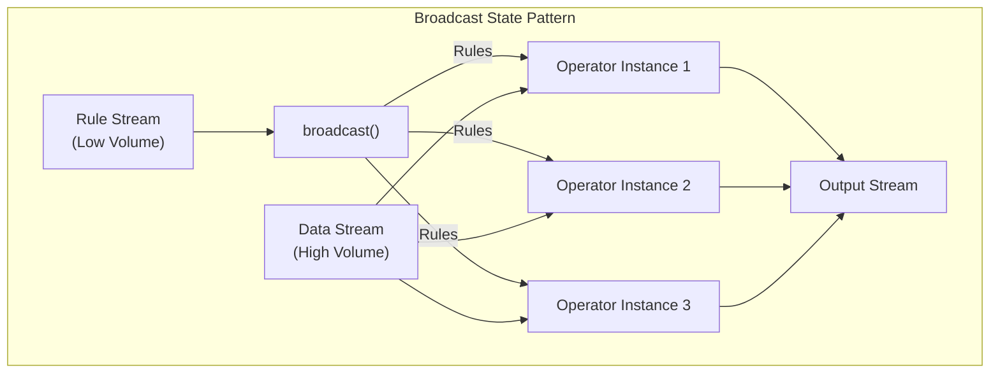
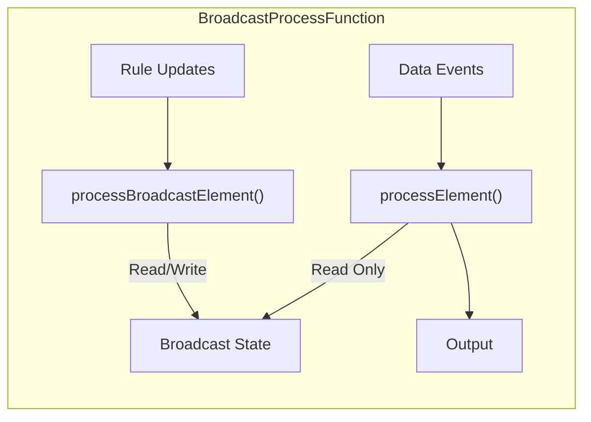
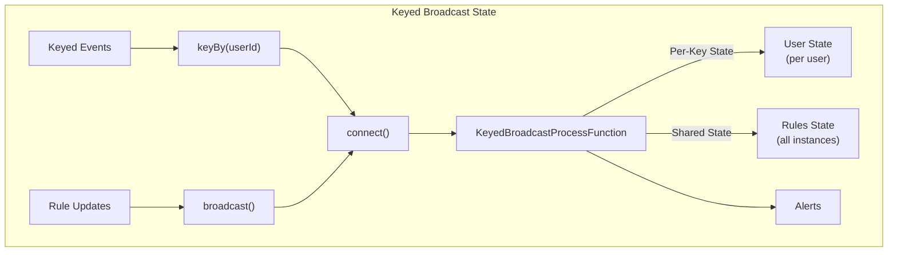
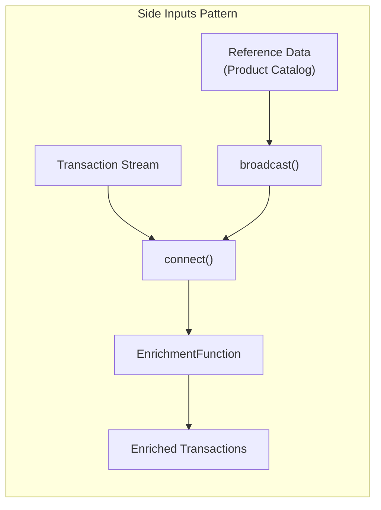

# How to Implement Broadcast State

Author: [nawazdhandala](https://github.com/nawazdhandala)

Tags: Stream Processing, Broadcast State, Apache Flink, Dynamic Rules

Description: Learn to implement broadcast state in stream processing for sharing configuration or rules across all parallel instances.

---

> Broadcast state lets you share dynamic configuration, rules, or reference data across all parallel instances of your stream processing operators. This pattern enables real-time updates without restarting your pipeline.

Stream processing pipelines often need access to slowly changing data like configuration, business rules, or feature flags. Broadcast state solves this by distributing updates to all parallel operator instances.

---

## Overview

Broadcast state is a special type of operator state that is replicated across all parallel instances of a function. When you update the broadcast state, the change is automatically propagated to every parallel subtask.



---

## Key Concepts

### When to Use Broadcast State

Broadcast state is ideal for scenarios where:

- **Dynamic rule evaluation** - Apply business rules that change at runtime
- **Feature flags** - Toggle features without redeploying
- **Configuration updates** - Change thresholds, timeouts, or parameters
- **Reference data joins** - Enrich events with lookup data
- **ML model updates** - Hot-swap prediction models

### Broadcast State vs Regular State

| Aspect | Broadcast State | Regular State |
|--------|-----------------|---------------|
| Distribution | All parallel instances | Partitioned by key |
| Update source | Broadcast stream | Data stream |
| Write access | Only in processBroadcastElement | Any process method |
| Read access | Both process methods | Only keyed process |
| Consistency | Eventually consistent | Strongly consistent per key |

---

## Basic Implementation

### Define State Descriptors

First, define the state descriptor for your broadcast state:

```java
// BroadcastStateExample.java
import org.apache.flink.api.common.state.MapStateDescriptor;
import org.apache.flink.api.common.typeinfo.Types;

public class BroadcastStateExample {

    // Define a MapStateDescriptor for broadcast state
    // The key is the rule ID, the value is the Rule object
    // This descriptor must be used consistently across all operators
    public static final MapStateDescriptor<String, Rule> RULES_STATE_DESCRIPTOR =
        new MapStateDescriptor<>(
            "rules",                    // State name for identification
            Types.STRING,               // Key type: rule identifier
            Types.POJO(Rule.class)      // Value type: the rule definition
        );
}
```

### Create the Rule POJO

Define a simple rule class that will be broadcast to all operators:

```java
// Rule.java
import java.io.Serializable;

/**
 * Represents a business rule for event evaluation.
 * Rules are broadcast to all operator instances for consistent evaluation.
 */
public class Rule implements Serializable {

    private String ruleId;          // Unique identifier for the rule
    private String field;           // Event field to evaluate
    private String operator;        // Comparison operator (GT, LT, EQ, etc.)
    private double threshold;       // Threshold value for comparison
    private String action;          // Action to take when rule matches

    // Default constructor required for serialization
    public Rule() {}

    public Rule(String ruleId, String field, String operator,
                double threshold, String action) {
        this.ruleId = ruleId;
        this.field = field;
        this.operator = operator;
        this.threshold = threshold;
        this.action = action;
    }

    // Evaluate this rule against an event value
    public boolean evaluate(double value) {
        switch (operator) {
            case "GT": return value > threshold;
            case "LT": return value < threshold;
            case "GTE": return value >= threshold;
            case "LTE": return value <= threshold;
            case "EQ": return Math.abs(value - threshold) < 0.0001;
            default: return false;
        }
    }

    // Getters and setters omitted for brevity
    public String getRuleId() { return ruleId; }
    public String getField() { return field; }
    public String getAction() { return action; }
}
```

---

## Implementing BroadcastProcessFunction

The `BroadcastProcessFunction` is the core abstraction for processing broadcast state. It has two methods:

- `processElement()` - Process elements from the non-broadcast (data) stream
- `processBroadcastElement()` - Process elements from the broadcast stream



### Basic BroadcastProcessFunction

```java
// RuleEvaluationFunction.java
import org.apache.flink.streaming.api.functions.co.BroadcastProcessFunction;
import org.apache.flink.util.Collector;
import org.apache.flink.api.common.state.BroadcastState;
import org.apache.flink.api.common.state.ReadOnlyBroadcastState;

/**
 * Evaluates incoming events against dynamically updated rules.
 * Rules are received via broadcast state and applied to all events.
 */
public class RuleEvaluationFunction
    extends BroadcastProcessFunction<Event, Rule, Alert> {

    // Reference to the state descriptor for accessing broadcast state
    private final MapStateDescriptor<String, Rule> rulesDescriptor;

    public RuleEvaluationFunction(MapStateDescriptor<String, Rule> descriptor) {
        this.rulesDescriptor = descriptor;
    }

    /**
     * Process incoming data events.
     * This method can only READ from broadcast state, never write.
     */
    @Override
    public void processElement(
            Event event,
            ReadOnlyContext ctx,
            Collector<Alert> out) throws Exception {

        // Get read-only access to the broadcast state
        // This contains all rules that have been broadcast so far
        ReadOnlyBroadcastState<String, Rule> rulesState =
            ctx.getBroadcastState(rulesDescriptor);

        // Iterate through all rules and evaluate against this event
        for (Map.Entry<String, Rule> entry : rulesState.immutableEntries()) {
            Rule rule = entry.getValue();

            // Extract the field value from the event based on rule configuration
            double value = event.getFieldValue(rule.getField());

            // Evaluate the rule against the event
            if (rule.evaluate(value)) {
                // Rule matched - emit an alert
                out.collect(new Alert(
                    event.getEventId(),
                    rule.getRuleId(),
                    rule.getAction(),
                    event.getTimestamp()
                ));
            }
        }
    }

    /**
     * Process incoming rule updates from the broadcast stream.
     * This method can READ and WRITE to broadcast state.
     */
    @Override
    public void processBroadcastElement(
            Rule rule,
            Context ctx,
            Collector<Alert> out) throws Exception {

        // Get read-write access to broadcast state
        BroadcastState<String, Rule> rulesState =
            ctx.getBroadcastState(rulesDescriptor);

        // Store the rule in broadcast state
        // This update will be visible to all parallel instances
        rulesState.put(rule.getRuleId(), rule);

        // Log the rule update for debugging
        System.out.println("Rule updated: " + rule.getRuleId());
    }
}
```

---

## Complete Pipeline Setup

### Connecting Streams

Here is how to wire up a complete Flink job with broadcast state:

```java
// BroadcastStateJob.java
import org.apache.flink.streaming.api.datastream.BroadcastStream;
import org.apache.flink.streaming.api.datastream.DataStream;
import org.apache.flink.streaming.api.environment.StreamExecutionEnvironment;

public class BroadcastStateJob {

    public static void main(String[] args) throws Exception {

        // Create the execution environment
        StreamExecutionEnvironment env =
            StreamExecutionEnvironment.getExecutionEnvironment();

        // Configure checkpointing for fault tolerance
        // Broadcast state is included in checkpoints automatically
        env.enableCheckpointing(60000);  // Checkpoint every 60 seconds

        // Define the broadcast state descriptor
        MapStateDescriptor<String, Rule> rulesDescriptor =
            new MapStateDescriptor<>(
                "rules",
                Types.STRING,
                Types.POJO(Rule.class)
            );

        // Source 1: High-volume event stream from Kafka
        DataStream<Event> eventStream = env
            .addSource(new FlinkKafkaConsumer<>(
                "events",
                new EventDeserializer(),
                kafkaProperties
            ))
            .name("Event Source");

        // Source 2: Low-volume rules stream from Kafka
        // Rules are published when administrators update configurations
        DataStream<Rule> ruleStream = env
            .addSource(new FlinkKafkaConsumer<>(
                "rules",
                new RuleDeserializer(),
                kafkaProperties
            ))
            .name("Rule Source");

        // Convert the rule stream to a broadcast stream
        // This replicates each rule to all parallel operator instances
        BroadcastStream<Rule> broadcastRules =
            ruleStream.broadcast(rulesDescriptor);

        // Connect the event stream with the broadcast rules
        // and apply the evaluation function
        DataStream<Alert> alerts = eventStream
            .connect(broadcastRules)
            .process(new RuleEvaluationFunction(rulesDescriptor))
            .name("Rule Evaluation");

        // Write alerts to output sink
        alerts.addSink(new AlertSink())
            .name("Alert Sink");

        // Execute the job
        env.execute("Dynamic Rule Evaluation");
    }
}
```

---

## Keyed Broadcast State

When you need to maintain per-key state alongside broadcast state, use `KeyedBroadcastProcessFunction`:



### KeyedBroadcastProcessFunction Implementation

```java
// UserRuleEvaluationFunction.java
import org.apache.flink.streaming.api.functions.co.KeyedBroadcastProcessFunction;
import org.apache.flink.api.common.state.ValueState;
import org.apache.flink.api.common.state.ValueStateDescriptor;
import org.apache.flink.configuration.Configuration;

/**
 * Evaluates rules against user events while maintaining per-user state.
 * Combines keyed state (per user) with broadcast state (shared rules).
 */
public class UserRuleEvaluationFunction
    extends KeyedBroadcastProcessFunction<String, UserEvent, Rule, Alert> {

    // Keyed state: tracks the last event time per user
    private ValueState<Long> lastEventTimeState;

    // Keyed state: tracks event count per user for rate limiting
    private ValueState<Integer> eventCountState;

    private final MapStateDescriptor<String, Rule> rulesDescriptor;

    public UserRuleEvaluationFunction(
            MapStateDescriptor<String, Rule> rulesDescriptor) {
        this.rulesDescriptor = rulesDescriptor;
    }

    @Override
    public void open(Configuration parameters) {
        // Initialize keyed state descriptors
        // These states are partitioned by the key (userId)
        lastEventTimeState = getRuntimeContext().getState(
            new ValueStateDescriptor<>("lastEventTime", Long.class)
        );

        eventCountState = getRuntimeContext().getState(
            new ValueStateDescriptor<>("eventCount", Integer.class)
        );
    }

    /**
     * Process user events with access to both keyed and broadcast state.
     */
    @Override
    public void processElement(
            UserEvent event,
            ReadOnlyContext ctx,
            Collector<Alert> out) throws Exception {

        // Access and update per-user keyed state
        Long lastTime = lastEventTimeState.value();
        Integer count = eventCountState.value();

        if (count == null) count = 0;
        count++;
        eventCountState.update(count);
        lastEventTimeState.update(event.getTimestamp());

        // Calculate time since last event for this user
        long timeSinceLastEvent = (lastTime != null)
            ? event.getTimestamp() - lastTime
            : Long.MAX_VALUE;

        // Access read-only broadcast state containing rules
        ReadOnlyBroadcastState<String, Rule> rulesState =
            ctx.getBroadcastState(rulesDescriptor);

        // Evaluate all rules with access to per-user context
        for (Map.Entry<String, Rule> entry : rulesState.immutableEntries()) {
            Rule rule = entry.getValue();

            // Rules can reference per-user metrics
            boolean matches = evaluateWithContext(
                rule,
                event,
                count,
                timeSinceLastEvent
            );

            if (matches) {
                out.collect(new Alert(
                    event.getUserId(),
                    rule.getRuleId(),
                    rule.getAction(),
                    event.getTimestamp()
                ));
            }
        }
    }

    /**
     * Process rule updates - same as non-keyed version.
     */
    @Override
    public void processBroadcastElement(
            Rule rule,
            Context ctx,
            Collector<Alert> out) throws Exception {

        // Update broadcast state with new rule
        BroadcastState<String, Rule> rulesState =
            ctx.getBroadcastState(rulesDescriptor);
        rulesState.put(rule.getRuleId(), rule);
    }

    private boolean evaluateWithContext(
            Rule rule,
            UserEvent event,
            int eventCount,
            long timeSinceLastEvent) {
        // Custom evaluation logic using per-user context
        // Example: rate limiting rules
        if (rule.getField().equals("eventRate")) {
            return eventCount > rule.getThreshold();
        }
        // Standard field evaluation
        return rule.evaluate(event.getFieldValue(rule.getField()));
    }
}
```

---

## Dynamic Rule Updates Pattern

### Rule Management Service

Create a service that publishes rule updates to Kafka:

```java
// RulePublisher.java
import org.apache.kafka.clients.producer.KafkaProducer;
import org.apache.kafka.clients.producer.ProducerRecord;

/**
 * Publishes rule updates to Kafka for broadcast to stream processors.
 * Used by admin APIs or configuration management systems.
 */
public class RulePublisher {

    private final KafkaProducer<String, Rule> producer;
    private final String rulesTopic;

    public RulePublisher(Properties kafkaProps, String topic) {
        this.producer = new KafkaProducer<>(kafkaProps);
        this.rulesTopic = topic;
    }

    /**
     * Publish a new or updated rule.
     * The rule will be broadcast to all Flink operator instances.
     */
    public void publishRule(Rule rule) {
        // Use ruleId as the key for log compaction
        // Kafka will retain only the latest value for each key
        ProducerRecord<String, Rule> record = new ProducerRecord<>(
            rulesTopic,
            rule.getRuleId(),
            rule
        );

        producer.send(record, (metadata, exception) -> {
            if (exception != null) {
                System.err.println("Failed to publish rule: " + exception);
            } else {
                System.out.println("Rule published to partition " +
                    metadata.partition() + " offset " + metadata.offset());
            }
        });
    }

    /**
     * Delete a rule by publishing a tombstone (null value).
     */
    public void deleteRule(String ruleId) {
        ProducerRecord<String, Rule> tombstone = new ProducerRecord<>(
            rulesTopic,
            ruleId,
            null  // Null value signals deletion
        );
        producer.send(tombstone);
    }

    public void close() {
        producer.close();
    }
}
```

### Handling Rule Deletion

Update the process function to handle rule deletions:

```java
// RuleEvaluationWithDeletion.java

@Override
public void processBroadcastElement(
        Rule rule,
        Context ctx,
        Collector<Alert> out) throws Exception {

    BroadcastState<String, Rule> rulesState =
        ctx.getBroadcastState(rulesDescriptor);

    if (rule == null || rule.isDeleted()) {
        // Handle rule deletion
        // Remove from state so it no longer applies to events
        rulesState.remove(rule.getRuleId());
        System.out.println("Rule deleted: " + rule.getRuleId());
    } else {
        // Add or update the rule
        rulesState.put(rule.getRuleId(), rule);
        System.out.println("Rule updated: " + rule.getRuleId());
    }
}
```

---

## Side Inputs Pattern

Broadcast state can implement the side inputs pattern for enriching streams with reference data:



### Reference Data Enrichment

```java
// TransactionEnrichmentFunction.java
import org.apache.flink.streaming.api.functions.co.BroadcastProcessFunction;

/**
 * Enriches transactions with product information from broadcast reference data.
 * Product catalog updates are received via broadcast state.
 */
public class TransactionEnrichmentFunction
    extends BroadcastProcessFunction<Transaction, Product, EnrichedTransaction> {

    // State descriptor for product catalog
    private final MapStateDescriptor<String, Product> productDescriptor =
        new MapStateDescriptor<>(
            "products",
            Types.STRING,              // Product ID
            Types.POJO(Product.class)  // Product details
        );

    /**
     * Enrich transactions with product details from broadcast state.
     */
    @Override
    public void processElement(
            Transaction txn,
            ReadOnlyContext ctx,
            Collector<EnrichedTransaction> out) throws Exception {

        ReadOnlyBroadcastState<String, Product> productState =
            ctx.getBroadcastState(productDescriptor);

        // Look up product details from broadcast state
        Product product = productState.get(txn.getProductId());

        if (product != null) {
            // Enrich transaction with product information
            out.collect(new EnrichedTransaction(
                txn.getTransactionId(),
                txn.getUserId(),
                txn.getProductId(),
                product.getName(),
                product.getCategory(),
                txn.getAmount(),
                product.getPrice(),
                txn.getTimestamp()
            ));
        } else {
            // Product not found - emit with default values
            // This can happen if product data has not yet been loaded
            out.collect(new EnrichedTransaction(
                txn.getTransactionId(),
                txn.getUserId(),
                txn.getProductId(),
                "Unknown",
                "Unknown",
                txn.getAmount(),
                0.0,
                txn.getTimestamp()
            ));
        }
    }

    /**
     * Update product catalog from broadcast stream.
     */
    @Override
    public void processBroadcastElement(
            Product product,
            Context ctx,
            Collector<EnrichedTransaction> out) throws Exception {

        BroadcastState<String, Product> productState =
            ctx.getBroadcastState(productDescriptor);

        productState.put(product.getProductId(), product);
    }
}
```

### Loading Initial Reference Data

Load reference data at startup before processing begins:

```java
// InitialDataLoader.java
import org.apache.flink.streaming.api.datastream.DataStream;
import org.apache.flink.streaming.api.datastream.SingleOutputStreamOperator;

public class InitialDataLoader {

    /**
     * Creates a stream that first emits all existing products,
     * then switches to the CDC (Change Data Capture) stream for updates.
     */
    public static DataStream<Product> createProductStream(
            StreamExecutionEnvironment env,
            Properties kafkaProps) {

        // Stream 1: Initial snapshot of all products from database
        DataStream<Product> initialProducts = env
            .addSource(new JdbcSource<>(
                "SELECT * FROM products",
                new ProductRowMapper()
            ))
            .name("Initial Product Load");

        // Stream 2: Ongoing updates from Kafka CDC topic
        DataStream<Product> productUpdates = env
            .addSource(new FlinkKafkaConsumer<>(
                "product-updates",
                new ProductDeserializer(),
                kafkaProps
            ))
            .name("Product Updates");

        // Union both streams - initial data followed by updates
        return initialProducts.union(productUpdates);
    }
}
```

---

## Handling Late Broadcast Elements

A common challenge is ensuring broadcast state is populated before processing data events:

```java
// BufferingRuleFunction.java
import org.apache.flink.api.common.state.ListState;
import org.apache.flink.api.common.state.ListStateDescriptor;

/**
 * Buffers data events until rules are loaded.
 * Prevents events from being processed with empty rule state.
 */
public class BufferingRuleFunction
    extends BroadcastProcessFunction<Event, Rule, Alert> {

    // Buffer for events that arrive before rules
    private ListState<Event> bufferedEvents;

    // Flag to track if initial rules have been loaded
    private boolean rulesLoaded = false;

    private final MapStateDescriptor<String, Rule> rulesDescriptor;

    @Override
    public void open(Configuration parameters) {
        // Initialize the event buffer as operator state
        ListStateDescriptor<Event> bufferDescriptor =
            new ListStateDescriptor<>("bufferedEvents", Event.class);
        bufferedEvents = getRuntimeContext()
            .getListState(bufferDescriptor);
    }

    @Override
    public void processElement(
            Event event,
            ReadOnlyContext ctx,
            Collector<Alert> out) throws Exception {

        if (!rulesLoaded) {
            // Rules not yet loaded - buffer the event
            bufferedEvents.add(event);
            return;
        }

        // Process the event normally
        evaluateRules(event, ctx, out);
    }

    @Override
    public void processBroadcastElement(
            Rule rule,
            Context ctx,
            Collector<Alert> out) throws Exception {

        BroadcastState<String, Rule> rulesState =
            ctx.getBroadcastState(rulesDescriptor);
        rulesState.put(rule.getRuleId(), rule);

        // Check if this is the initial rules load signal
        if (rule.getRuleId().equals("__RULES_LOADED__")) {
            rulesLoaded = true;

            // Process all buffered events
            for (Event bufferedEvent : bufferedEvents.get()) {
                evaluateRules(bufferedEvent, ctx, out);
            }

            // Clear the buffer
            bufferedEvents.clear();
        }
    }

    private void evaluateRules(
            Event event,
            ReadOnlyContext ctx,
            Collector<Alert> out) throws Exception {
        // Standard rule evaluation logic
        ReadOnlyBroadcastState<String, Rule> rulesState =
            ctx.getBroadcastState(rulesDescriptor);

        for (Map.Entry<String, Rule> entry : rulesState.immutableEntries()) {
            if (entry.getValue().evaluate(event.getValue())) {
                out.collect(new Alert(event, entry.getValue()));
            }
        }
    }
}
```

---

## Testing Broadcast State

### Unit Testing with Harnesses

```java
// BroadcastFunctionTest.java
import org.apache.flink.streaming.util.BroadcastOperatorTestHarness;
import org.apache.flink.streaming.util.TwoInputStreamOperatorTestHarness;
import org.junit.Test;
import static org.junit.Assert.*;

public class BroadcastFunctionTest {

    @Test
    public void testRuleEvaluation() throws Exception {
        // Create the function under test
        RuleEvaluationFunction function = new RuleEvaluationFunction(
            BroadcastStateExample.RULES_STATE_DESCRIPTOR
        );

        // Create a test harness for the broadcast function
        TwoInputStreamOperatorTestHarness<Event, Rule, Alert> harness =
            BroadcastOperatorTestHarness.getInitializedTestHarness(
                function,
                BroadcastStateExample.RULES_STATE_DESCRIPTOR
            );

        // First, broadcast a rule
        Rule highValueRule = new Rule(
            "rule-1", "amount", "GT", 1000.0, "FLAG_HIGH_VALUE"
        );
        harness.processBroadcastElement(highValueRule, 1L);

        // Then, process an event that matches the rule
        Event highValueEvent = new Event("evt-1", 1500.0, System.currentTimeMillis());
        harness.processElement1(highValueEvent, 2L);

        // Verify an alert was emitted
        List<Alert> output = harness.extractOutputValues();
        assertEquals(1, output.size());
        assertEquals("rule-1", output.get(0).getRuleId());
        assertEquals("FLAG_HIGH_VALUE", output.get(0).getAction());

        // Process an event that does not match
        Event lowValueEvent = new Event("evt-2", 500.0, System.currentTimeMillis());
        harness.processElement1(lowValueEvent, 3L);

        // Verify no additional alerts
        output = harness.extractOutputValues();
        assertEquals(1, output.size());

        harness.close();
    }

    @Test
    public void testRuleUpdate() throws Exception {
        RuleEvaluationFunction function = new RuleEvaluationFunction(
            BroadcastStateExample.RULES_STATE_DESCRIPTOR
        );

        TwoInputStreamOperatorTestHarness<Event, Rule, Alert> harness =
            BroadcastOperatorTestHarness.getInitializedTestHarness(
                function,
                BroadcastStateExample.RULES_STATE_DESCRIPTOR
            );

        // Broadcast initial rule with threshold 1000
        Rule initialRule = new Rule("rule-1", "amount", "GT", 1000.0, "ALERT");
        harness.processBroadcastElement(initialRule, 1L);

        // Event with value 800 should not match
        Event event1 = new Event("evt-1", 800.0, System.currentTimeMillis());
        harness.processElement1(event1, 2L);
        assertEquals(0, harness.extractOutputValues().size());

        // Update rule to lower threshold to 500
        Rule updatedRule = new Rule("rule-1", "amount", "GT", 500.0, "ALERT");
        harness.processBroadcastElement(updatedRule, 3L);

        // Same event value should now match
        Event event2 = new Event("evt-2", 800.0, System.currentTimeMillis());
        harness.processElement1(event2, 4L);
        assertEquals(1, harness.extractOutputValues().size());

        harness.close();
    }
}
```

---

## Production Considerations

### State Size Management

Monitor and limit broadcast state size to prevent memory issues:

```java
// StateSizeMonitoringFunction.java

@Override
public void processBroadcastElement(
        Rule rule,
        Context ctx,
        Collector<Alert> out) throws Exception {

    BroadcastState<String, Rule> rulesState =
        ctx.getBroadcastState(rulesDescriptor);

    // Count current rules before adding
    int ruleCount = 0;
    for (Map.Entry<String, Rule> entry : rulesState.entries()) {
        ruleCount++;
    }

    // Enforce a maximum rule count to prevent unbounded state growth
    if (ruleCount >= MAX_RULES && !rulesState.contains(rule.getRuleId())) {
        System.err.println("Maximum rule count reached: " + MAX_RULES);
        // Optionally emit to a side output for alerting
        return;
    }

    rulesState.put(rule.getRuleId(), rule);

    // Emit metrics for monitoring
    getRuntimeContext()
        .getMetricGroup()
        .gauge("broadcastStateRuleCount", () -> ruleCount + 1);
}
```

### Checkpoint and Recovery

Broadcast state is automatically included in Flink checkpoints:

```java
// CheckpointConfiguration.java
import org.apache.flink.streaming.api.CheckpointingMode;
import org.apache.flink.streaming.api.environment.CheckpointConfig;

public class CheckpointConfiguration {

    public static void configureCheckpointing(StreamExecutionEnvironment env) {
        // Enable checkpointing every 60 seconds
        env.enableCheckpointing(60000);

        CheckpointConfig config = env.getCheckpointConfig();

        // Use exactly-once semantics for consistency
        config.setCheckpointingMode(CheckpointingMode.EXACTLY_ONCE);

        // Minimum time between checkpoints
        config.setMinPauseBetweenCheckpoints(30000);

        // Checkpoint timeout
        config.setCheckpointTimeout(120000);

        // Allow only one checkpoint at a time
        config.setMaxConcurrentCheckpoints(1);

        // Retain checkpoints on cancellation for recovery
        config.setExternalizedCheckpointCleanup(
            CheckpointConfig.ExternalizedCheckpointCleanup.RETAIN_ON_CANCELLATION
        );
    }
}
```

---

## Common Pitfalls and Solutions

### Pitfall 1: Modifying Broadcast State in processElement

```java
// WRONG: Cannot write to broadcast state in processElement
@Override
public void processElement(Event event, ReadOnlyContext ctx, Collector<Alert> out) {
    // This will throw an UnsupportedOperationException
    BroadcastState<String, Rule> state = ctx.getBroadcastState(descriptor);
    state.put("key", rule);  // ERROR!
}

// CORRECT: Only read from broadcast state in processElement
@Override
public void processElement(Event event, ReadOnlyContext ctx, Collector<Alert> out) {
    ReadOnlyBroadcastState<String, Rule> state = ctx.getBroadcastState(descriptor);
    Rule rule = state.get("key");  // OK - read only
}
```

### Pitfall 2: Assuming Immediate Consistency

```java
// WRONG: Assuming broadcast state is immediately consistent
@Override
public void processBroadcastElement(Rule rule, Context ctx, Collector<Alert> out) {
    ctx.getBroadcastState(descriptor).put(rule.getRuleId(), rule);

    // Do not assume all parallel instances have received this update
    // Broadcast state is eventually consistent across instances
}

// CORRECT: Design for eventual consistency
// Process data events based on whatever rules are currently in state
// Accept that different instances may have slightly different state briefly
```

### Pitfall 3: Forgetting State Descriptor Consistency

```java
// WRONG: Using different descriptors in different places
MapStateDescriptor<String, Rule> desc1 = new MapStateDescriptor<>("rules", ...);
MapStateDescriptor<String, Rule> desc2 = new MapStateDescriptor<>("rules", ...);

ruleStream.broadcast(desc1);  // Using desc1
eventStream.connect(broadcastRules)
    .process(new MyFunction(desc2));  // Using desc2 - may cause issues

// CORRECT: Use a single shared descriptor instance
public static final MapStateDescriptor<String, Rule> RULES_DESCRIPTOR =
    new MapStateDescriptor<>("rules", Types.STRING, Types.POJO(Rule.class));

ruleStream.broadcast(RULES_DESCRIPTOR);
eventStream.connect(broadcastRules)
    .process(new MyFunction(RULES_DESCRIPTOR));
```

---

## Performance Optimization

### Batch Rule Updates

Reduce processing overhead by batching rule updates:

```java
// BatchedRuleUpdateFunction.java

/**
 * Processes batched rule updates more efficiently.
 * Reduces the overhead of individual state updates.
 */
public class BatchedRuleUpdateFunction
    extends BroadcastProcessFunction<Event, List<Rule>, Alert> {

    @Override
    public void processBroadcastElement(
            List<Rule> rules,
            Context ctx,
            Collector<Alert> out) throws Exception {

        BroadcastState<String, Rule> rulesState =
            ctx.getBroadcastState(rulesDescriptor);

        // Process all rules in the batch
        for (Rule rule : rules) {
            if (rule.isDeleted()) {
                rulesState.remove(rule.getRuleId());
            } else {
                rulesState.put(rule.getRuleId(), rule);
            }
        }

        System.out.println("Processed batch of " + rules.size() + " rules");
    }
}
```

### Efficient Rule Indexing

Index rules by field for faster evaluation:

```java
// IndexedRuleEvaluationFunction.java

/**
 * Indexes rules by field name for O(1) lookup during evaluation.
 * More efficient than iterating all rules for each event.
 */
public class IndexedRuleEvaluationFunction
    extends BroadcastProcessFunction<Event, Rule, Alert> {

    // Secondary index: field name to list of rule IDs
    private final MapStateDescriptor<String, List<String>> fieldIndexDescriptor =
        new MapStateDescriptor<>(
            "fieldIndex",
            Types.STRING,
            Types.LIST(Types.STRING)
        );

    @Override
    public void processElement(
            Event event,
            ReadOnlyContext ctx,
            Collector<Alert> out) throws Exception {

        ReadOnlyBroadcastState<String, Rule> rulesState =
            ctx.getBroadcastState(rulesDescriptor);
        ReadOnlyBroadcastState<String, List<String>> fieldIndex =
            ctx.getBroadcastState(fieldIndexDescriptor);

        // Get only the rules that apply to fields in this event
        for (String field : event.getFields()) {
            List<String> ruleIds = fieldIndex.get(field);
            if (ruleIds == null) continue;

            for (String ruleId : ruleIds) {
                Rule rule = rulesState.get(ruleId);
                if (rule != null && rule.evaluate(event.getFieldValue(field))) {
                    out.collect(new Alert(event, rule));
                }
            }
        }
    }

    @Override
    public void processBroadcastElement(
            Rule rule,
            Context ctx,
            Collector<Alert> out) throws Exception {

        // Update main rule state
        BroadcastState<String, Rule> rulesState =
            ctx.getBroadcastState(rulesDescriptor);
        rulesState.put(rule.getRuleId(), rule);

        // Update field index
        BroadcastState<String, List<String>> fieldIndex =
            ctx.getBroadcastState(fieldIndexDescriptor);

        List<String> ruleIds = fieldIndex.get(rule.getField());
        if (ruleIds == null) {
            ruleIds = new ArrayList<>();
        }
        if (!ruleIds.contains(rule.getRuleId())) {
            ruleIds.add(rule.getRuleId());
        }
        fieldIndex.put(rule.getField(), ruleIds);
    }
}
```

---

## Conclusion

Broadcast state is a powerful pattern for implementing dynamic configuration in stream processing. Key takeaways:

- **Use broadcast state** for configuration, rules, or reference data that must be shared across all parallel instances
- **BroadcastProcessFunction** provides separate methods for processing data and broadcast elements
- **KeyedBroadcastProcessFunction** combines broadcast state with per-key state for complex use cases
- **Design for eventual consistency** since broadcast updates propagate asynchronously
- **Monitor state size** to prevent unbounded growth
- **Test thoroughly** using Flink test harnesses

Broadcast state enables building flexible, dynamic stream processing applications that can adapt to changing business requirements without redeployment.

---

*Building real-time stream processing pipelines? [OneUptime](https://oneuptime.com) provides comprehensive monitoring for Apache Flink and other stream processing frameworks with alerting on processing lag, checkpoint failures, and throughput anomalies.*
