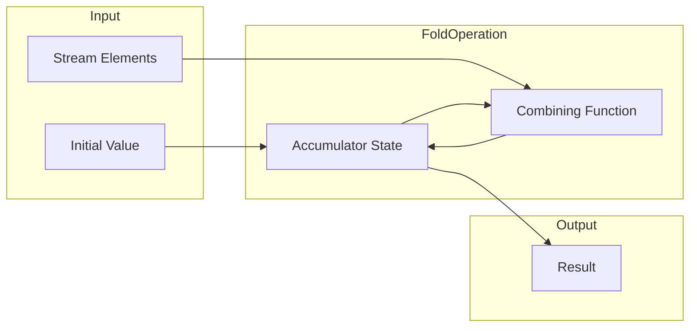
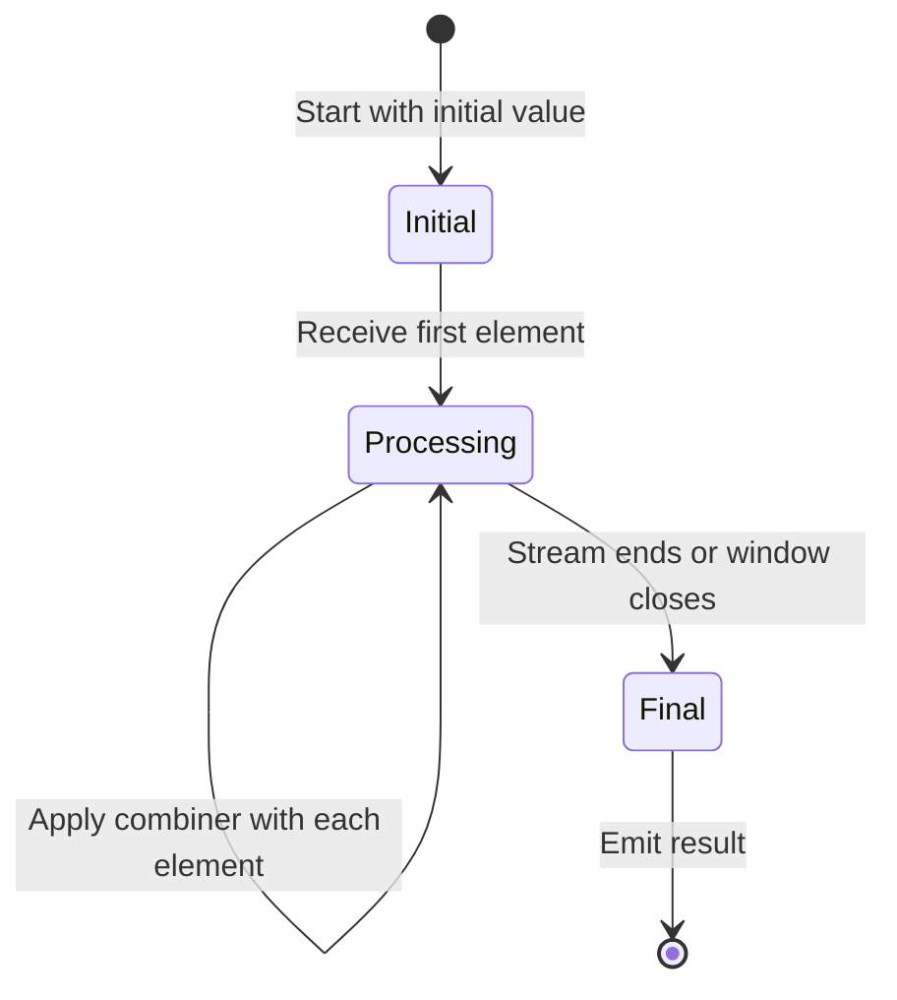
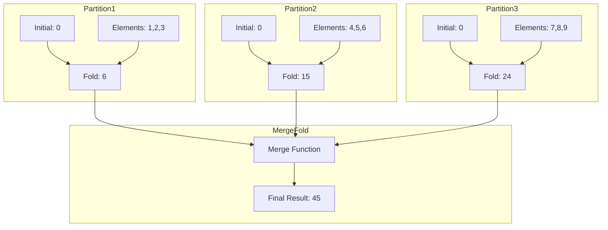
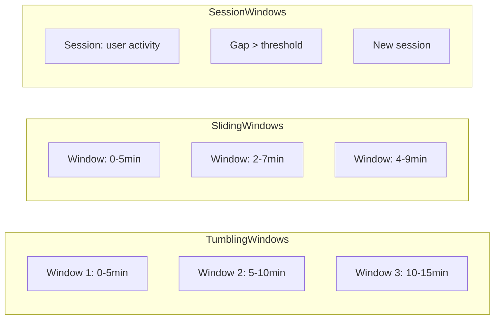
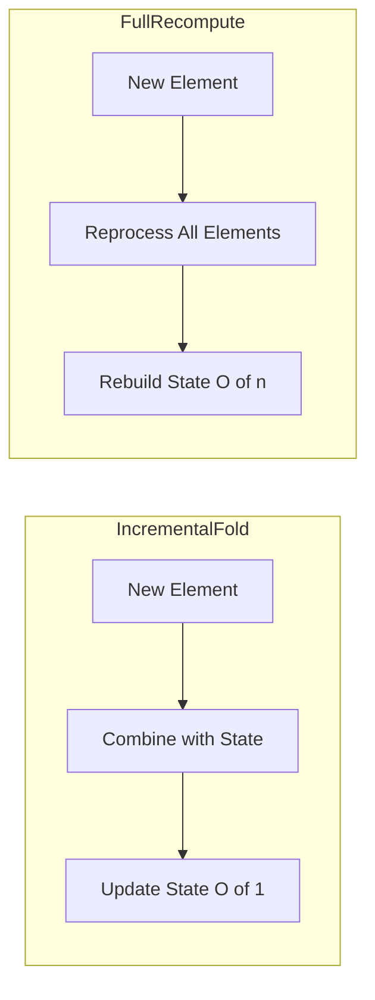

# How to Build Fold Functions

Author: [nawazdhandala](https://github.com/nawazdhandala)

Tags: Stream Processing, Fold, Functional Programming, Apache Flink

Description: Learn to build fold functions in stream processing for accumulating values with an initial value and combining function.

---

> Fold is the fundamental building block of stream aggregation. It takes an initial value, a stream of elements, and a combining function to produce a single accumulated result.

In stream processing, fold functions are essential for computing aggregations like sums, averages, running totals, and complex state transformations. Unlike batch processing where you have all data available at once, stream processing requires incremental accumulation as data arrives.

This guide covers how fold functions work, when to use them, and how to implement them effectively in stream processing frameworks like Apache Flink, Kafka Streams, and vanilla functional programming.

---

## Table of Contents

1. What is a Fold Function?
2. Fold vs Reduce: Key Differences
3. Anatomy of a Fold Operation
4. Visual Mental Model
5. Initial Value Handling
6. Type Transformation Patterns
7. Implementing Fold in Apache Flink
8. Implementing Fold in Kafka Streams
9. Implementing Fold in Pure TypeScript
10. Windowed Fold Operations
11. Stateful Fold Patterns
12. Error Handling in Fold Functions
13. Performance Considerations
14. Common Anti-Patterns
15. Real-World Use Cases

---

## 1. What is a Fold Function?

A fold function (also called `foldLeft` or `aggregate`) processes a sequence of elements by:

1. Starting with an **initial value** (also called the accumulator seed or zero value)
2. Applying a **combining function** that takes the current accumulator and the next element
3. Returning the **updated accumulator** after each step
4. Producing a **final result** when the stream completes (or on demand for infinite streams)

The signature in TypeScript looks like this:

```typescript
// Generic fold function signature
// A = Accumulator type (the state we build up)
// T = Input element type (what we receive from the stream)
function fold<A, T>(
    initialValue: A,           // Starting state
    combiner: (acc: A, elem: T) => A,  // How to combine state with new element
    elements: T[]              // The stream of inputs
): A                          // Final accumulated result
```

Key properties:

| Property | Description |
|----------|-------------|
| Initial Value | The starting point for accumulation; defines the "empty" state |
| Combining Function | Pure function that merges current state with new element |
| Type Flexibility | Input type (T) and accumulator type (A) can differ |
| Order Dependent | foldLeft processes left-to-right; order matters for non-commutative operations |
| Incremental | Each element updates state without needing previous elements |

---

## 2. Fold vs Reduce: Key Differences

Many developers confuse fold and reduce. Here is the critical distinction:

| Aspect | Fold | Reduce |
|--------|------|--------|
| Initial Value | Required; explicitly provided | Optional; uses first element as initial |
| Empty Input | Returns initial value | Throws error or returns undefined |
| Type Transformation | Accumulator can differ from element type | Accumulator must match element type |
| Use Case | Aggregation with type change | Same-type combination |

### Reduce Example (Same Type)

```typescript
// Reduce: combines numbers into a number
// The accumulator type MUST match the element type
const numbers = [1, 2, 3, 4, 5];

const sum = numbers.reduce(
    (acc, num) => acc + num  // number + number = number
);
// Result: 15

// Problem: Empty array throws error!
const empty: number[] = [];
// empty.reduce((acc, num) => acc + num);  // TypeError: Reduce of empty array with no initial value
```

### Fold Example (Type Transformation)

```typescript
// Fold: transforms numbers into a summary object
// The accumulator type CAN differ from element type
interface Summary {
    count: number;
    sum: number;
    min: number;
    max: number;
}

const numbers = [1, 2, 3, 4, 5];

// Initial value defines the starting state AND the return type
const initialSummary: Summary = {
    count: 0,
    sum: 0,
    min: Infinity,
    max: -Infinity
};

const summary = numbers.reduce<Summary>(
    (acc, num) => ({
        count: acc.count + 1,
        sum: acc.sum + num,
        min: Math.min(acc.min, num),
        max: Math.max(acc.max, num)
    }),
    initialSummary  // This makes it a fold!
);

// Result: { count: 5, sum: 15, min: 1, max: 5 }

// Empty array is safe with fold
const emptySummary = [].reduce<Summary>(
    (acc, num) => ({ ...acc, sum: acc.sum + num }),
    initialSummary
);
// Result: { count: 0, sum: 0, min: Infinity, max: -Infinity }
```

### Visual Comparison

```
REDUCE (no initial value):
[1, 2, 3, 4]
 |
 1 + 2 = 3
     |
     3 + 3 = 6
         |
         6 + 4 = 10
                  |
                 10 (final)

FOLD (with initial value):
initialValue = { sum: 0 }
        |
        v
[1, 2, 3, 4]
 |
{sum:0} + 1 = {sum:1}
              |
        {sum:1} + 2 = {sum:3}
                      |
                {sum:3} + 3 = {sum:6}
                              |
                        {sum:6} + 4 = {sum:10}
                                      |
                                    {sum:10} (final)
```

---

## 3. Anatomy of a Fold Operation

Every fold consists of three essential components:



### Component Breakdown

**1. Initial Value (Zero/Identity)**

```typescript
// The initial value serves two purposes:
// 1. Provides the starting state
// 2. Defines the return type

// For sum: start at 0
const sumInitial = 0;

// For product: start at 1 (identity for multiplication)
const productInitial = 1;

// For concatenation: start with empty string
const concatInitial = "";

// For collection: start with empty array
const collectInitial: number[] = [];

// For complex aggregation: start with structured state
interface MetricsState {
    totalLatency: number;
    requestCount: number;
    errorCount: number;
    statusCodes: Map<number, number>;
}

const metricsInitial: MetricsState = {
    totalLatency: 0,
    requestCount: 0,
    errorCount: 0,
    statusCodes: new Map()
};
```

**2. Combining Function (Aggregator)**

```typescript
// The combiner must be a pure function:
// - Takes current accumulator and new element
// - Returns updated accumulator
// - No side effects
// - Deterministic (same inputs = same output)

// Simple combiner: addition
const addCombiner = (acc: number, elem: number): number => acc + elem;

// Complex combiner: metrics aggregation
const metricsCombiner = (
    acc: MetricsState,
    request: { latency: number; status: number; error?: boolean }
): MetricsState => {
    // Create new state (immutability)
    const newStatusCodes = new Map(acc.statusCodes);
    const currentCount = newStatusCodes.get(request.status) || 0;
    newStatusCodes.set(request.status, currentCount + 1);

    return {
        totalLatency: acc.totalLatency + request.latency,
        requestCount: acc.requestCount + 1,
        errorCount: acc.errorCount + (request.error ? 1 : 0),
        statusCodes: newStatusCodes
    };
};
```

**3. Stream Elements**

```typescript
// Elements can come from various sources:

// Array (batch)
const batchElements = [1, 2, 3, 4, 5];

// Generator (lazy evaluation)
function* streamGenerator(): Generator<number> {
    let i = 0;
    while (true) {
        yield i++;
    }
}

// Async iterator (real-time stream)
async function* asyncStream(): AsyncGenerator<number> {
    while (true) {
        const value = await fetchNextValue();
        yield value;
    }
}
```

---

## 4. Visual Mental Model

### Fold as State Machine



### Step-by-Step Fold Execution

```
Computing running average of [10, 20, 30, 40]:

Initial State: { sum: 0, count: 0 }

Step 1: Element = 10
  combiner({ sum: 0, count: 0 }, 10)
  Result: { sum: 10, count: 1 }  // avg = 10

Step 2: Element = 20
  combiner({ sum: 10, count: 1 }, 20)
  Result: { sum: 30, count: 2 }  // avg = 15

Step 3: Element = 30
  combiner({ sum: 30, count: 2 }, 30)
  Result: { sum: 60, count: 3 }  // avg = 20

Step 4: Element = 40
  combiner({ sum: 60, count: 3 }, 40)
  Result: { sum: 100, count: 4 } // avg = 25

Final: { sum: 100, count: 4 }
Average: 100 / 4 = 25
```

### Fold in Parallel Streams



---

## 5. Initial Value Handling

The initial value is critical for correctness. Choosing the wrong initial value leads to bugs.

### Identity Elements

For operations with mathematical identity elements, use them as initial values:

```typescript
// Addition: identity is 0
// 0 + x = x for any x
const sumFold = (elements: number[]) =>
    elements.reduce((acc, x) => acc + x, 0);

// Multiplication: identity is 1
// 1 * x = x for any x
const productFold = (elements: number[]) =>
    elements.reduce((acc, x) => acc * x, 1);

// String concatenation: identity is ""
// "" + s = s for any string s
const concatFold = (elements: string[]) =>
    elements.reduce((acc, s) => acc + s, "");

// Array concatenation: identity is []
// [] ++ arr = arr for any array arr
const flattenFold = <T>(elements: T[][]) =>
    elements.reduce((acc, arr) => [...acc, ...arr], [] as T[]);

// Boolean AND: identity is true
// true && x = x for any boolean x
const allTrueFold = (elements: boolean[]) =>
    elements.reduce((acc, b) => acc && b, true);

// Boolean OR: identity is false
// false || x = x for any boolean x
const anyTrueFold = (elements: boolean[]) =>
    elements.reduce((acc, b) => acc || b, false);
```

### Non-Identity Initial Values

Sometimes you need domain-specific initial values:

```typescript
// Finding minimum: start with Infinity
const minFold = (elements: number[]) =>
    elements.reduce((acc, x) => Math.min(acc, x), Infinity);

// Finding maximum: start with -Infinity
const maxFold = (elements: number[]) =>
    elements.reduce((acc, x) => Math.max(acc, x), -Infinity);

// Counting with offset
const countFromTen = (elements: unknown[]) =>
    elements.reduce((acc, _) => acc + 1, 10);

// Building state with defaults
interface UserSession {
    loginTime: Date;
    pageViews: number;
    lastActivity: Date;
    actions: string[];
}

const sessionInitial: UserSession = {
    loginTime: new Date(),
    pageViews: 0,
    lastActivity: new Date(),
    actions: []
};
```

### Handling Empty Streams

```typescript
// Fold gracefully handles empty streams
const emptySum = [].reduce((acc, x) => acc + x, 0);
// Result: 0 (the initial value)

// This is why fold is preferred for stream processing:
// Streams may have windows with no events

interface WindowedMetrics {
    windowStart: Date;
    windowEnd: Date;
    eventCount: number;
    totalValue: number;
}

function createEmptyWindow(start: Date, end: Date): WindowedMetrics {
    return {
        windowStart: start,
        windowEnd: end,
        eventCount: 0,
        totalValue: 0
    };
}

// Even with no events, we get a valid result
const emptyWindowMetrics = createEmptyWindow(
    new Date('2024-01-01T00:00:00Z'),
    new Date('2024-01-01T01:00:00Z')
);
```

---

## 6. Type Transformation Patterns

One of fold's superpowers is transforming input types into different output types.

### Pattern 1: Elements to Summary Statistics

```typescript
// Input: array of numbers
// Output: statistical summary

interface Stats {
    count: number;
    sum: number;
    mean: number;
    min: number;
    max: number;
    variance: number;
}

// Using Welford's online algorithm for numerically stable variance
interface StatsAccumulator {
    count: number;
    sum: number;
    min: number;
    max: number;
    m2: number;  // Sum of squared differences from mean
    mean: number;
}

const statsInitial: StatsAccumulator = {
    count: 0,
    sum: 0,
    min: Infinity,
    max: -Infinity,
    m2: 0,
    mean: 0
};

const statsCombiner = (acc: StatsAccumulator, value: number): StatsAccumulator => {
    const newCount = acc.count + 1;
    const delta = value - acc.mean;
    const newMean = acc.mean + delta / newCount;
    const delta2 = value - newMean;
    const newM2 = acc.m2 + delta * delta2;

    return {
        count: newCount,
        sum: acc.sum + value,
        min: Math.min(acc.min, value),
        max: Math.max(acc.max, value),
        m2: newM2,
        mean: newMean
    };
};

// Finalize: convert accumulator to final stats
const finalizeStats = (acc: StatsAccumulator): Stats => ({
    count: acc.count,
    sum: acc.sum,
    mean: acc.mean,
    min: acc.count > 0 ? acc.min : 0,
    max: acc.count > 0 ? acc.max : 0,
    variance: acc.count > 1 ? acc.m2 / (acc.count - 1) : 0
});

// Usage
const numbers = [10, 20, 30, 40, 50];
const accumulated = numbers.reduce(statsCombiner, statsInitial);
const stats = finalizeStats(accumulated);
// Result: { count: 5, sum: 150, mean: 30, min: 10, max: 50, variance: 250 }
```

### Pattern 2: Events to State Machine

```typescript
// Input: stream of events
// Output: current state of an order

type OrderEvent =
    | { type: 'CREATED'; orderId: string; items: string[]; timestamp: Date }
    | { type: 'PAID'; amount: number; timestamp: Date }
    | { type: 'SHIPPED'; trackingNumber: string; timestamp: Date }
    | { type: 'DELIVERED'; timestamp: Date }
    | { type: 'CANCELLED'; reason: string; timestamp: Date };

type OrderStatus = 'pending' | 'paid' | 'shipped' | 'delivered' | 'cancelled';

interface OrderState {
    orderId: string | null;
    status: OrderStatus;
    items: string[];
    amount: number | null;
    trackingNumber: string | null;
    events: OrderEvent[];
    lastUpdated: Date | null;
}

const orderInitial: OrderState = {
    orderId: null,
    status: 'pending',
    items: [],
    amount: null,
    trackingNumber: null,
    events: [],
    lastUpdated: null
};

const orderCombiner = (state: OrderState, event: OrderEvent): OrderState => {
    // Append event to history
    const newEvents = [...state.events, event];

    switch (event.type) {
        case 'CREATED':
            return {
                ...state,
                orderId: event.orderId,
                items: event.items,
                status: 'pending',
                events: newEvents,
                lastUpdated: event.timestamp
            };

        case 'PAID':
            // Can only pay pending orders
            if (state.status !== 'pending') return state;
            return {
                ...state,
                amount: event.amount,
                status: 'paid',
                events: newEvents,
                lastUpdated: event.timestamp
            };

        case 'SHIPPED':
            // Can only ship paid orders
            if (state.status !== 'paid') return state;
            return {
                ...state,
                trackingNumber: event.trackingNumber,
                status: 'shipped',
                events: newEvents,
                lastUpdated: event.timestamp
            };

        case 'DELIVERED':
            // Can only deliver shipped orders
            if (state.status !== 'shipped') return state;
            return {
                ...state,
                status: 'delivered',
                events: newEvents,
                lastUpdated: event.timestamp
            };

        case 'CANCELLED':
            // Can cancel pending or paid orders
            if (state.status === 'shipped' || state.status === 'delivered') {
                return state;
            }
            return {
                ...state,
                status: 'cancelled',
                events: newEvents,
                lastUpdated: event.timestamp
            };

        default:
            return state;
    }
};
```

### Pattern 3: Log Lines to Structured Report

```typescript
// Input: raw log lines
// Output: structured analysis report

interface LogLine {
    timestamp: Date;
    level: 'DEBUG' | 'INFO' | 'WARN' | 'ERROR';
    service: string;
    message: string;
    traceId?: string;
}

interface LogReport {
    totalLines: number;
    byLevel: Record<string, number>;
    byService: Record<string, number>;
    errors: LogLine[];
    timeRange: { start: Date | null; end: Date | null };
    uniqueTraceIds: Set<string>;
}

const reportInitial: LogReport = {
    totalLines: 0,
    byLevel: {},
    byService: {},
    errors: [],
    timeRange: { start: null, end: null },
    uniqueTraceIds: new Set()
};

const reportCombiner = (report: LogReport, line: LogLine): LogReport => {
    // Update level counts
    const byLevel = { ...report.byLevel };
    byLevel[line.level] = (byLevel[line.level] || 0) + 1;

    // Update service counts
    const byService = { ...report.byService };
    byService[line.service] = (byService[line.service] || 0) + 1;

    // Collect errors (limit to last 100)
    const errors = line.level === 'ERROR'
        ? [...report.errors.slice(-99), line]
        : report.errors;

    // Update time range
    const start = report.timeRange.start === null || line.timestamp < report.timeRange.start
        ? line.timestamp
        : report.timeRange.start;
    const end = report.timeRange.end === null || line.timestamp > report.timeRange.end
        ? line.timestamp
        : report.timeRange.end;

    // Track trace IDs
    const uniqueTraceIds = new Set(report.uniqueTraceIds);
    if (line.traceId) {
        uniqueTraceIds.add(line.traceId);
    }

    return {
        totalLines: report.totalLines + 1,
        byLevel,
        byService,
        errors,
        timeRange: { start, end },
        uniqueTraceIds
    };
};
```

---

## 7. Implementing Fold in Apache Flink

Apache Flink provides powerful fold operations through its `AggregateFunction` interface.

### Basic AggregateFunction

```java
// Java implementation of fold in Flink
import org.apache.flink.api.common.functions.AggregateFunction;

// AggregateFunction<IN, ACC, OUT>
// IN  = Input element type
// ACC = Accumulator type (internal state)
// OUT = Output type (final result)

public class AverageAggregate implements AggregateFunction<Double, AverageAccumulator, Double> {

    // Create initial accumulator (the "initial value")
    @Override
    public AverageAccumulator createAccumulator() {
        return new AverageAccumulator(0.0, 0L);
    }

    // Combine accumulator with new element (the "combining function")
    @Override
    public AverageAccumulator add(Double value, AverageAccumulator acc) {
        return new AverageAccumulator(
            acc.sum + value,
            acc.count + 1
        );
    }

    // Extract final result from accumulator
    @Override
    public Double getResult(AverageAccumulator acc) {
        return acc.count > 0 ? acc.sum / acc.count : 0.0;
    }

    // Merge two accumulators (for parallel processing)
    @Override
    public AverageAccumulator merge(AverageAccumulator a, AverageAccumulator b) {
        return new AverageAccumulator(
            a.sum + b.sum,
            a.count + b.count
        );
    }
}

// Accumulator class
public class AverageAccumulator {
    public double sum;
    public long count;

    public AverageAccumulator(double sum, long count) {
        this.sum = sum;
        this.count = count;
    }
}
```

### Using Fold in Flink DataStream

```java
import org.apache.flink.streaming.api.datastream.DataStream;
import org.apache.flink.streaming.api.windowing.time.Time;

// Apply fold over a windowed stream
DataStream<SensorReading> readings = env.addSource(new SensorSource());

DataStream<Double> averages = readings
    .keyBy(reading -> reading.sensorId)           // Group by sensor
    .window(TumblingProcessingTimeWindows.of(Time.minutes(1)))  // 1-minute windows
    .aggregate(new AverageAggregate());           // Apply fold

// The aggregate function is called for each window:
// 1. createAccumulator() - once per window
// 2. add() - for each element in the window
// 3. getResult() - when window closes
// 4. merge() - when parallel partitions are combined
```

### Flink Fold with Process Function (Advanced)

```java
import org.apache.flink.streaming.api.functions.KeyedProcessFunction;
import org.apache.flink.api.common.state.ValueState;
import org.apache.flink.api.common.state.ValueStateDescriptor;
import org.apache.flink.util.Collector;

// Manual fold with state management
public class MetricsFoldFunction
    extends KeyedProcessFunction<String, MetricEvent, MetricsSummary> {

    // Flink managed state - persisted and restored automatically
    private transient ValueState<MetricsAccumulator> accumulatorState;

    @Override
    public void open(Configuration parameters) {
        // Initialize state descriptor
        ValueStateDescriptor<MetricsAccumulator> descriptor =
            new ValueStateDescriptor<>(
                "metrics-accumulator",
                MetricsAccumulator.class
            );
        accumulatorState = getRuntimeContext().getState(descriptor);
    }

    @Override
    public void processElement(
        MetricEvent event,
        Context ctx,
        Collector<MetricsSummary> out
    ) throws Exception {
        // Get current accumulator or create initial value
        MetricsAccumulator acc = accumulatorState.value();
        if (acc == null) {
            acc = new MetricsAccumulator();  // Initial value
        }

        // Apply combining function
        acc = combine(acc, event);

        // Store updated accumulator
        accumulatorState.update(acc);

        // Optionally emit intermediate results
        if (acc.count % 100 == 0) {
            out.collect(acc.toSummary());
        }
    }

    private MetricsAccumulator combine(MetricsAccumulator acc, MetricEvent event) {
        acc.count++;
        acc.totalValue += event.value;
        acc.minValue = Math.min(acc.minValue, event.value);
        acc.maxValue = Math.max(acc.maxValue, event.value);
        return acc;
    }
}
```

---

## 8. Implementing Fold in Kafka Streams

Kafka Streams provides fold through its `aggregate` operation.

### Basic Aggregation

```java
import org.apache.kafka.streams.StreamsBuilder;
import org.apache.kafka.streams.kstream.KStream;
import org.apache.kafka.streams.kstream.KTable;
import org.apache.kafka.streams.kstream.Materialized;

StreamsBuilder builder = new StreamsBuilder();

// Input stream of page views
KStream<String, PageView> pageViews = builder.stream("page-views");

// Fold page views into view counts per page
KTable<String, ViewCount> viewCounts = pageViews
    .groupBy((key, value) -> value.pageUrl)  // Key by page URL
    .aggregate(
        // Initial value (Initializer)
        () -> new ViewCount(0, 0L, null, null),

        // Combining function (Aggregator)
        (pageUrl, view, aggregate) -> new ViewCount(
            aggregate.count + 1,
            aggregate.totalDuration + view.duration,
            aggregate.firstView == null ? view.timestamp : aggregate.firstView,
            view.timestamp
        ),

        // State store configuration
        Materialized.as("view-counts-store")
    );

// ViewCount class
public class ViewCount {
    public int count;
    public long totalDuration;
    public Instant firstView;
    public Instant lastView;

    public ViewCount(int count, long totalDuration, Instant firstView, Instant lastView) {
        this.count = count;
        this.totalDuration = totalDuration;
        this.firstView = firstView;
        this.lastView = lastView;
    }
}
```

### Windowed Aggregation in Kafka Streams

```java
import org.apache.kafka.streams.kstream.TimeWindows;
import org.apache.kafka.streams.kstream.Windowed;

// Fold with time windows
KTable<Windowed<String>, MetricsAggregate> windowedMetrics = events
    .groupByKey()
    .windowedBy(TimeWindows.ofSizeWithNoGrace(Duration.ofMinutes(5)))
    .aggregate(
        // Initial value
        MetricsAggregate::new,

        // Combiner
        (key, event, agg) -> {
            agg.count++;
            agg.sum += event.value;
            agg.min = Math.min(agg.min, event.value);
            agg.max = Math.max(agg.max, event.value);
            return agg;
        },

        // Materialized store
        Materialized.<String, MetricsAggregate, WindowStore<Bytes, byte[]>>as("metrics-store")
            .withKeySerde(Serdes.String())
            .withValueSerde(new MetricsAggregateSerde())
    );
```

### Kafka Streams with Custom Serde

```java
import org.apache.kafka.common.serialization.Serde;
import org.apache.kafka.common.serialization.Serdes;
import com.fasterxml.jackson.databind.ObjectMapper;

// Custom accumulator with JSON serialization
public class SessionAggregate {
    public String userId;
    public int eventCount;
    public long totalDuration;
    public List<String> pages;
    public Instant sessionStart;
    public Instant lastActivity;

    // JSON serde for state storage
    public static Serde<SessionAggregate> serde() {
        ObjectMapper mapper = new ObjectMapper();
        return Serdes.serdeFrom(
            (topic, data) -> {
                try {
                    return mapper.writeValueAsBytes(data);
                } catch (Exception e) {
                    throw new RuntimeException(e);
                }
            },
            (topic, bytes) -> {
                try {
                    return mapper.readValue(bytes, SessionAggregate.class);
                } catch (Exception e) {
                    throw new RuntimeException(e);
                }
            }
        );
    }
}
```

---

## 9. Implementing Fold in Pure TypeScript

Here is a complete TypeScript implementation for educational purposes and use in Node.js streaming applications.

### Basic Fold Implementation

```typescript
// Generic fold function for arrays
function fold<A, T>(
    initialValue: A,
    combiner: (accumulator: A, element: T) => A,
    elements: T[]
): A {
    let accumulator = initialValue;

    for (const element of elements) {
        accumulator = combiner(accumulator, element);
    }

    return accumulator;
}

// Usage examples
const sum = fold(0, (acc, n) => acc + n, [1, 2, 3, 4, 5]);
// Result: 15

const product = fold(1, (acc, n) => acc * n, [1, 2, 3, 4, 5]);
// Result: 120

const concatenated = fold("", (acc, s) => acc + s, ["a", "b", "c"]);
// Result: "abc"
```

### Async Fold for Streams

```typescript
// Fold over async iterables (real streams)
async function asyncFold<A, T>(
    initialValue: A,
    combiner: (accumulator: A, element: T) => A | Promise<A>,
    stream: AsyncIterable<T>
): Promise<A> {
    let accumulator = initialValue;

    for await (const element of stream) {
        accumulator = await combiner(accumulator, element);
    }

    return accumulator;
}

// Create an async generator for demonstration
async function* generateNumbers(count: number): AsyncGenerator<number> {
    for (let i = 1; i <= count; i++) {
        // Simulate async data arrival
        await new Promise(resolve => setTimeout(resolve, 100));
        yield i;
    }
}

// Usage
async function example() {
    const stream = generateNumbers(5);
    const result = await asyncFold(
        { sum: 0, count: 0 },
        (acc, n) => ({ sum: acc.sum + n, count: acc.count + 1 }),
        stream
    );
    console.log(result);  // { sum: 15, count: 5 }
}
```

### Fold with Intermediate Emissions

```typescript
// Fold that emits intermediate results (useful for real-time updates)
async function* foldWithEmit<A, T>(
    initialValue: A,
    combiner: (accumulator: A, element: T) => A,
    stream: AsyncIterable<T>,
    emitEvery: number = 1
): AsyncGenerator<A> {
    let accumulator = initialValue;
    let count = 0;

    for await (const element of stream) {
        accumulator = combiner(accumulator, element);
        count++;

        // Emit intermediate result
        if (count % emitEvery === 0) {
            yield accumulator;
        }
    }

    // Emit final result
    yield accumulator;
}

// Usage: get running totals
async function streamingExample() {
    const numbers = generateNumbers(10);

    for await (const intermediate of foldWithEmit(
        0,
        (acc, n) => acc + n,
        numbers,
        3  // Emit every 3 elements
    )) {
        console.log('Running total:', intermediate);
    }
}
// Output:
// Running total: 6   (1+2+3)
// Running total: 15  (1+2+3+4+5+6)
// Running total: 24  (1+2+3+4+5+6+7+8+9)
// Running total: 55  (final)
```

### Parallel Fold with Merge

```typescript
// Fold that can be parallelized and merged
interface ParallelFold<A, T> {
    initial: () => A;
    combine: (acc: A, elem: T) => A;
    merge: (left: A, right: A) => A;
}

// Example: Parallelizable statistics
const parallelStats: ParallelFold<StatsAccumulator, number> = {
    initial: () => ({
        count: 0,
        sum: 0,
        min: Infinity,
        max: -Infinity,
        m2: 0,
        mean: 0
    }),

    combine: (acc, value) => {
        const newCount = acc.count + 1;
        const delta = value - acc.mean;
        const newMean = acc.mean + delta / newCount;
        const delta2 = value - newMean;

        return {
            count: newCount,
            sum: acc.sum + value,
            min: Math.min(acc.min, value),
            max: Math.max(acc.max, value),
            m2: acc.m2 + delta * delta2,
            mean: newMean
        };
    },

    // Merge two accumulators (from parallel partitions)
    merge: (left, right) => {
        if (left.count === 0) return right;
        if (right.count === 0) return left;

        const totalCount = left.count + right.count;
        const delta = right.mean - left.mean;
        const newMean = left.mean + delta * right.count / totalCount;

        // Parallel variance merging formula
        const newM2 = left.m2 + right.m2 +
            delta * delta * left.count * right.count / totalCount;

        return {
            count: totalCount,
            sum: left.sum + right.sum,
            min: Math.min(left.min, right.min),
            max: Math.max(left.max, right.max),
            m2: newM2,
            mean: newMean
        };
    }
};

// Parallel fold execution
async function parallelFold<A, T>(
    foldDef: ParallelFold<A, T>,
    partitions: T[][]
): Promise<A> {
    // Fold each partition in parallel
    const partialResults = await Promise.all(
        partitions.map(partition =>
            Promise.resolve(
                partition.reduce(foldDef.combine, foldDef.initial())
            )
        )
    );

    // Merge all partial results
    return partialResults.reduce(foldDef.merge, foldDef.initial());
}

// Usage
async function parallelExample() {
    const data = [1, 2, 3, 4, 5, 6, 7, 8, 9, 10];

    // Split into partitions
    const partitions = [
        data.slice(0, 3),   // [1, 2, 3]
        data.slice(3, 7),   // [4, 5, 6, 7]
        data.slice(7)       // [8, 9, 10]
    ];

    const result = await parallelFold(parallelStats, partitions);
    console.log(result);
    // Same result as sequential fold
}
```

---

## 10. Windowed Fold Operations

In stream processing, windows group elements for aggregation.

### Window Types



### Tumbling Window Fold

```typescript
// Elements grouped into fixed, non-overlapping windows
interface TumblingWindow<T> {
    windowStart: number;
    windowEnd: number;
    elements: T[];
}

function tumblingWindowFold<A, T>(
    windowSize: number,  // milliseconds
    initial: A,
    combiner: (acc: A, elem: T) => A,
    elements: Array<{ timestamp: number; value: T }>
): Map<number, A> {
    // Group elements by window
    const windows = new Map<number, T[]>();

    for (const { timestamp, value } of elements) {
        // Calculate window start time
        const windowStart = Math.floor(timestamp / windowSize) * windowSize;

        if (!windows.has(windowStart)) {
            windows.set(windowStart, []);
        }
        windows.get(windowStart)!.push(value);
    }

    // Fold each window
    const results = new Map<number, A>();

    for (const [windowStart, windowElements] of windows) {
        const windowResult = windowElements.reduce(combiner, initial);
        results.set(windowStart, windowResult);
    }

    return results;
}

// Usage
const events = [
    { timestamp: 1000, value: 10 },
    { timestamp: 2000, value: 20 },
    { timestamp: 3000, value: 30 },
    { timestamp: 6000, value: 40 },
    { timestamp: 7000, value: 50 },
];

const windowedSums = tumblingWindowFold(
    5000,  // 5-second windows
    0,
    (acc, n) => acc + n,
    events
);
// Result: Map { 0 => 60, 5000 => 90 }
// Window 0-5s: 10+20+30 = 60
// Window 5-10s: 40+50 = 90
```

### Sliding Window Fold

```typescript
// Overlapping windows for smooth aggregations
function slidingWindowFold<A, T>(
    windowSize: number,
    slideInterval: number,
    initial: A,
    combiner: (acc: A, elem: T) => A,
    elements: Array<{ timestamp: number; value: T }>
): Map<number, A> {
    const results = new Map<number, A>();

    if (elements.length === 0) return results;

    // Find time range
    const minTime = Math.min(...elements.map(e => e.timestamp));
    const maxTime = Math.max(...elements.map(e => e.timestamp));

    // Generate windows
    for (let windowStart = minTime; windowStart <= maxTime; windowStart += slideInterval) {
        const windowEnd = windowStart + windowSize;

        // Filter elements in this window
        const windowElements = elements
            .filter(e => e.timestamp >= windowStart && e.timestamp < windowEnd)
            .map(e => e.value);

        // Fold window elements
        const windowResult = windowElements.reduce(combiner, initial);
        results.set(windowStart, windowResult);
    }

    return results;
}

// Usage: 5-second windows, sliding every 2 seconds
const slidingSums = slidingWindowFold(
    5000,   // window size
    2000,   // slide interval
    0,
    (acc, n) => acc + n,
    events
);
// More windows, with overlap
```

### Session Window Fold

```typescript
// Windows based on activity gaps
interface Session<T> {
    start: number;
    end: number;
    elements: T[];
}

function sessionWindowFold<A, T>(
    gapThreshold: number,  // Max gap between events in same session
    initial: A,
    combiner: (acc: A, elem: T) => A,
    elements: Array<{ timestamp: number; value: T }>
): Session<A>[] {
    if (elements.length === 0) return [];

    // Sort by timestamp
    const sorted = [...elements].sort((a, b) => a.timestamp - b.timestamp);

    const sessions: Session<T[]>[] = [];
    let currentSession: Session<T[]> = {
        start: sorted[0].timestamp,
        end: sorted[0].timestamp,
        elements: [sorted[0].value]
    };

    for (let i = 1; i < sorted.length; i++) {
        const gap = sorted[i].timestamp - currentSession.end;

        if (gap > gapThreshold) {
            // Gap too large: start new session
            sessions.push(currentSession);
            currentSession = {
                start: sorted[i].timestamp,
                end: sorted[i].timestamp,
                elements: [sorted[i].value]
            };
        } else {
            // Continue current session
            currentSession.end = sorted[i].timestamp;
            currentSession.elements.push(sorted[i].value);
        }
    }
    sessions.push(currentSession);

    // Fold each session
    return sessions.map(session => ({
        start: session.start,
        end: session.end,
        elements: session.elements.reduce(combiner, initial) as unknown as A
    })) as Session<A>[];
}
```

---

## 11. Stateful Fold Patterns

Real-world folds often need to maintain complex state.

### Pattern: Rolling Percentiles

```typescript
// Maintain approximate percentiles using a digest
interface PercentileDigest {
    sortedSamples: number[];
    maxSamples: number;
}

const percentileDigestFold = {
    initial: (maxSamples: number): PercentileDigest => ({
        sortedSamples: [],
        maxSamples
    }),

    combine: (digest: PercentileDigest, value: number): PercentileDigest => {
        // Binary search insert to maintain sorted order
        const samples = [...digest.sortedSamples];
        let left = 0;
        let right = samples.length;

        while (left < right) {
            const mid = Math.floor((left + right) / 2);
            if (samples[mid] < value) {
                left = mid + 1;
            } else {
                right = mid;
            }
        }

        samples.splice(left, 0, value);

        // Reservoir sampling to bound memory
        if (samples.length > digest.maxSamples) {
            // Remove random element (simplified; production would use proper reservoir sampling)
            const removeIdx = Math.floor(Math.random() * samples.length);
            samples.splice(removeIdx, 1);
        }

        return { ...digest, sortedSamples: samples };
    },

    // Extract percentile from digest
    getPercentile: (digest: PercentileDigest, p: number): number => {
        if (digest.sortedSamples.length === 0) return 0;

        const index = Math.floor(p * (digest.sortedSamples.length - 1));
        return digest.sortedSamples[index];
    }
};
```

### Pattern: Time-Decayed Aggregation

```typescript
// Recent values weighted more heavily
interface DecayedSum {
    value: number;
    lastUpdate: number;
    halfLife: number;  // Time for value to decay by half
}

const decayedSumFold = {
    initial: (halfLife: number): DecayedSum => ({
        value: 0,
        lastUpdate: Date.now(),
        halfLife
    }),

    combine: (state: DecayedSum, element: { timestamp: number; value: number }): DecayedSum => {
        // Calculate decay factor
        const elapsed = element.timestamp - state.lastUpdate;
        const decayFactor = Math.pow(0.5, elapsed / state.halfLife);

        // Decay existing value and add new value
        const decayedValue = state.value * decayFactor + element.value;

        return {
            ...state,
            value: decayedValue,
            lastUpdate: element.timestamp
        };
    },

    // Get current decayed value
    getCurrentValue: (state: DecayedSum): number => {
        const elapsed = Date.now() - state.lastUpdate;
        const decayFactor = Math.pow(0.5, elapsed / state.halfLife);
        return state.value * decayFactor;
    }
};
```

### Pattern: Distinct Count (HyperLogLog-style)

```typescript
// Approximate distinct count with bounded memory
interface DistinctCounter {
    registers: Uint8Array;
    numRegisters: number;
}

function hashToRegister(value: string, numRegisters: number): { register: number; zeros: number } {
    // Simplified hash - production would use MurmurHash or similar
    let hash = 0;
    for (let i = 0; i < value.length; i++) {
        hash = ((hash << 5) - hash) + value.charCodeAt(i);
        hash = hash & hash;
    }

    const register = Math.abs(hash) % numRegisters;

    // Count leading zeros
    let zeros = 1;
    let temp = Math.abs(hash >> Math.log2(numRegisters));
    while ((temp & 1) === 0 && zeros < 32) {
        zeros++;
        temp >>= 1;
    }

    return { register, zeros };
}

const distinctCountFold = {
    initial: (precision: number = 10): DistinctCounter => ({
        registers: new Uint8Array(Math.pow(2, precision)),
        numRegisters: Math.pow(2, precision)
    }),

    combine: (counter: DistinctCounter, value: string): DistinctCounter => {
        const { register, zeros } = hashToRegister(value, counter.numRegisters);

        // Update register with max zeros seen
        const newRegisters = new Uint8Array(counter.registers);
        newRegisters[register] = Math.max(newRegisters[register], zeros);

        return { ...counter, registers: newRegisters };
    },

    // Estimate cardinality
    estimate: (counter: DistinctCounter): number => {
        const m = counter.numRegisters;

        // Harmonic mean of 2^register values
        let sum = 0;
        for (let i = 0; i < m; i++) {
            sum += Math.pow(2, -counter.registers[i]);
        }

        // Apply bias correction
        const alpha = 0.7213 / (1 + 1.079 / m);
        const estimate = alpha * m * m / sum;

        return Math.round(estimate);
    }
};
```

---

## 12. Error Handling in Fold Functions

Robust fold functions must handle errors gracefully.

### Error Accumulation Pattern

```typescript
// Collect errors instead of failing on first error
interface FoldResult<A, E> {
    value: A;
    errors: E[];
    processedCount: number;
    errorCount: number;
}

function foldWithErrors<A, T, E>(
    initial: A,
    combiner: (acc: A, elem: T) => A,
    errorHandler: (elem: T, error: Error) => E,
    elements: T[]
): FoldResult<A, E> {
    let accumulator = initial;
    const errors: E[] = [];
    let processedCount = 0;
    let errorCount = 0;

    for (const element of elements) {
        try {
            accumulator = combiner(accumulator, element);
            processedCount++;
        } catch (error) {
            errors.push(errorHandler(element, error as Error));
            errorCount++;
        }
    }

    return {
        value: accumulator,
        errors,
        processedCount,
        errorCount
    };
}

// Usage
interface ParsedEvent {
    id: string;
    value: number;
}

const rawEvents = ['{"id":"1","value":10}', 'invalid json', '{"id":"2","value":20}'];

const result = foldWithErrors<number, string, { raw: string; error: string }>(
    0,
    (sum, raw) => {
        const parsed: ParsedEvent = JSON.parse(raw);
        return sum + parsed.value;
    },
    (raw, error) => ({ raw, error: error.message }),
    rawEvents
);

console.log(result);
// {
//   value: 30,
//   errors: [{ raw: 'invalid json', error: 'Unexpected token...' }],
//   processedCount: 2,
//   errorCount: 1
// }
```

### Retry Pattern

```typescript
// Retry failed elements with backoff
async function foldWithRetry<A, T>(
    initial: A,
    combiner: (acc: A, elem: T) => Promise<A>,
    elements: AsyncIterable<T>,
    maxRetries: number = 3,
    baseDelayMs: number = 100
): Promise<A> {
    let accumulator = initial;

    for await (const element of elements) {
        let lastError: Error | null = null;

        for (let attempt = 0; attempt <= maxRetries; attempt++) {
            try {
                accumulator = await combiner(accumulator, element);
                lastError = null;
                break;
            } catch (error) {
                lastError = error as Error;

                if (attempt < maxRetries) {
                    // Exponential backoff
                    const delay = baseDelayMs * Math.pow(2, attempt);
                    await new Promise(resolve => setTimeout(resolve, delay));
                }
            }
        }

        if (lastError) {
            throw new Error(
                `Failed to process element after ${maxRetries} retries: ${lastError.message}`
            );
        }
    }

    return accumulator;
}
```

### Dead Letter Queue Pattern

```typescript
// Route failed elements to a dead letter queue
interface DeadLetter<T> {
    element: T;
    error: Error;
    timestamp: Date;
    attempts: number;
}

async function foldWithDLQ<A, T>(
    initial: A,
    combiner: (acc: A, elem: T) => Promise<A>,
    elements: AsyncIterable<T>,
    onDeadLetter: (letter: DeadLetter<T>) => Promise<void>
): Promise<A> {
    let accumulator = initial;

    for await (const element of elements) {
        try {
            accumulator = await combiner(accumulator, element);
        } catch (error) {
            // Send to dead letter queue
            await onDeadLetter({
                element,
                error: error as Error,
                timestamp: new Date(),
                attempts: 1
            });
            // Continue processing other elements
        }
    }

    return accumulator;
}
```

---

## 13. Performance Considerations

### Memory Management

```typescript
// Bad: Creating new objects on every fold iteration
const badCombiner = (acc: { items: string[] }, elem: string) => ({
    items: [...acc.items, elem]  // Creates new array every time - O(n^2) total
});

// Good: Mutate accumulator when safe (local to fold)
const goodCombiner = (acc: { items: string[] }, elem: string) => {
    acc.items.push(elem);  // O(1) amortized
    return acc;
};

// Best: Use immutable data structures for safety with efficient updates
// import { List } from 'immutable';
// const bestCombiner = (acc: List<string>, elem: string) => acc.push(elem);  // O(1)
```

### Incremental vs Full Recomputation



### Batch Processing

```typescript
// Process elements in batches for better throughput
async function batchedFold<A, T>(
    initial: A,
    combiner: (acc: A, elem: T) => A,
    batchCombiner: (acc: A, batch: T[]) => A,  // Optional optimized batch version
    stream: AsyncIterable<T>,
    batchSize: number = 100
): Promise<A> {
    let accumulator = initial;
    let batch: T[] = [];

    for await (const element of stream) {
        batch.push(element);

        if (batch.length >= batchSize) {
            // Process batch
            if (batchCombiner) {
                accumulator = batchCombiner(accumulator, batch);
            } else {
                for (const elem of batch) {
                    accumulator = combiner(accumulator, elem);
                }
            }
            batch = [];
        }
    }

    // Process remaining elements
    for (const elem of batch) {
        accumulator = combiner(accumulator, elem);
    }

    return accumulator;
}
```

---

## 14. Common Anti-Patterns

### Anti-Pattern 1: Side Effects in Combiner

```typescript
// BAD: Side effects make fold unpredictable and non-parallelizable
let externalCounter = 0;  // Shared mutable state

const badCombiner = (acc: number, elem: number) => {
    externalCounter++;  // Side effect!
    console.log('Processing:', elem);  // Side effect!
    return acc + elem;
};

// GOOD: Pure combiner with all state in accumulator
interface GoodAccumulator {
    sum: number;
    processedCount: number;
}

const goodCombiner = (acc: GoodAccumulator, elem: number): GoodAccumulator => ({
    sum: acc.sum + elem,
    processedCount: acc.processedCount + 1
});
```

### Anti-Pattern 2: Unbounded State Growth

```typescript
// BAD: Accumulator grows unboundedly
const badCollector = (acc: number[], elem: number) => [...acc, elem];
// After 1 million elements: 1 million items in memory

// GOOD: Bounded state with aggregation
interface BoundedStats {
    count: number;
    sum: number;
    // Optionally keep last N elements
    recentElements: number[];
    maxRecent: number;
}

const boundedCombiner = (acc: BoundedStats, elem: number): BoundedStats => ({
    count: acc.count + 1,
    sum: acc.sum + elem,
    recentElements: [...acc.recentElements.slice(-(acc.maxRecent - 1)), elem],
    maxRecent: acc.maxRecent
});
```

### Anti-Pattern 3: Non-Associative Merge

```typescript
// BAD: Merge function that is not associative (parallel fold will give wrong results)
const badMerge = (a: number[], b: number[]) => {
    // Order matters: merge(merge(A, B), C) != merge(A, merge(B, C))
    return a.length > b.length ? a : b;
};

// GOOD: Associative merge
const goodMerge = (a: { count: number; sum: number }, b: { count: number; sum: number }) => ({
    count: a.count + b.count,  // Addition is associative
    sum: a.sum + b.sum         // Addition is associative
});
```

### Anti-Pattern 4: Ignoring Empty Streams

```typescript
// BAD: Assumes at least one element
const badAverage = (elements: number[]) => {
    const sum = elements.reduce((a, b) => a + b);
    return sum / elements.length;  // NaN or error for empty input
};

// GOOD: Handle empty case with fold
const goodAverage = (elements: number[]) => {
    const result = elements.reduce(
        (acc, elem) => ({ sum: acc.sum + elem, count: acc.count + 1 }),
        { sum: 0, count: 0 }
    );
    return result.count > 0 ? result.sum / result.count : 0;
};
```

---

## 15. Real-World Use Cases

### Use Case 1: Real-Time Dashboard Metrics

```typescript
// Aggregate request metrics for a live dashboard
interface DashboardMetrics {
    requestCount: number;
    errorCount: number;
    totalLatencyMs: number;
    p50LatencyMs: number;
    p99LatencyMs: number;
    statusCodeCounts: Record<number, number>;
    topEndpoints: Array<{ path: string; count: number }>;
}

interface RequestEvent {
    timestamp: Date;
    path: string;
    statusCode: number;
    latencyMs: number;
    error?: string;
}

const dashboardFold = {
    initial: (): DashboardMetrics & { latencies: number[]; endpointCounts: Map<string, number> } => ({
        requestCount: 0,
        errorCount: 0,
        totalLatencyMs: 0,
        p50LatencyMs: 0,
        p99LatencyMs: 0,
        statusCodeCounts: {},
        topEndpoints: [],
        latencies: [],
        endpointCounts: new Map()
    }),

    combine: (acc: ReturnType<typeof dashboardFold.initial>, event: RequestEvent) => {
        // Update counts
        acc.requestCount++;
        if (event.error || event.statusCode >= 500) {
            acc.errorCount++;
        }
        acc.totalLatencyMs += event.latencyMs;

        // Track latencies for percentiles
        acc.latencies.push(event.latencyMs);
        acc.latencies.sort((a, b) => a - b);

        // Update status code counts
        acc.statusCodeCounts[event.statusCode] =
            (acc.statusCodeCounts[event.statusCode] || 0) + 1;

        // Update endpoint counts
        acc.endpointCounts.set(
            event.path,
            (acc.endpointCounts.get(event.path) || 0) + 1
        );

        return acc;
    },

    finalize: (acc: ReturnType<typeof dashboardFold.initial>): DashboardMetrics => {
        // Calculate percentiles
        const p50Index = Math.floor(acc.latencies.length * 0.5);
        const p99Index = Math.floor(acc.latencies.length * 0.99);

        // Get top 10 endpoints
        const topEndpoints = Array.from(acc.endpointCounts.entries())
            .sort((a, b) => b[1] - a[1])
            .slice(0, 10)
            .map(([path, count]) => ({ path, count }));

        return {
            requestCount: acc.requestCount,
            errorCount: acc.errorCount,
            totalLatencyMs: acc.totalLatencyMs,
            p50LatencyMs: acc.latencies[p50Index] || 0,
            p99LatencyMs: acc.latencies[p99Index] || 0,
            statusCodeCounts: acc.statusCodeCounts,
            topEndpoints
        };
    }
};
```

### Use Case 2: Event Sourcing Projection

```typescript
// Build current state from event history
type AccountEvent =
    | { type: 'OPENED'; accountId: string; owner: string; timestamp: Date }
    | { type: 'DEPOSITED'; amount: number; timestamp: Date }
    | { type: 'WITHDRAWN'; amount: number; timestamp: Date }
    | { type: 'CLOSED'; reason: string; timestamp: Date };

interface AccountState {
    accountId: string | null;
    owner: string | null;
    balance: number;
    status: 'active' | 'closed' | 'unknown';
    transactionCount: number;
    openedAt: Date | null;
    closedAt: Date | null;
}

const accountProjection = {
    initial: (): AccountState => ({
        accountId: null,
        owner: null,
        balance: 0,
        status: 'unknown',
        transactionCount: 0,
        openedAt: null,
        closedAt: null
    }),

    combine: (state: AccountState, event: AccountEvent): AccountState => {
        switch (event.type) {
            case 'OPENED':
                return {
                    ...state,
                    accountId: event.accountId,
                    owner: event.owner,
                    status: 'active',
                    openedAt: event.timestamp
                };

            case 'DEPOSITED':
                if (state.status !== 'active') return state;
                return {
                    ...state,
                    balance: state.balance + event.amount,
                    transactionCount: state.transactionCount + 1
                };

            case 'WITHDRAWN':
                if (state.status !== 'active') return state;
                if (state.balance < event.amount) return state;  // Insufficient funds
                return {
                    ...state,
                    balance: state.balance - event.amount,
                    transactionCount: state.transactionCount + 1
                };

            case 'CLOSED':
                if (state.status !== 'active') return state;
                return {
                    ...state,
                    status: 'closed',
                    closedAt: event.timestamp
                };

            default:
                return state;
        }
    }
};
```

### Use Case 3: Log Analysis Pipeline

```typescript
// Analyze log patterns in real-time
interface LogAnalysis {
    totalLogs: number;
    byLevel: Record<string, number>;
    byService: Record<string, number>;
    errorPatterns: Map<string, { count: number; lastSeen: Date; examples: string[] }>;
    timeSeriesMinute: Map<string, number>;  // ISO minute -> count
}

interface LogEntry {
    timestamp: Date;
    level: string;
    service: string;
    message: string;
}

const logAnalysisFold = {
    initial: (): LogAnalysis => ({
        totalLogs: 0,
        byLevel: {},
        byService: {},
        errorPatterns: new Map(),
        timeSeriesMinute: new Map()
    }),

    combine: (analysis: LogAnalysis, log: LogEntry): LogAnalysis => {
        analysis.totalLogs++;

        // Count by level
        analysis.byLevel[log.level] = (analysis.byLevel[log.level] || 0) + 1;

        // Count by service
        analysis.byService[log.service] = (analysis.byService[log.service] || 0) + 1;

        // Track error patterns
        if (log.level === 'ERROR') {
            // Extract error pattern (simplified: first 50 chars)
            const pattern = log.message.substring(0, 50);
            const existing = analysis.errorPatterns.get(pattern) || {
                count: 0,
                lastSeen: log.timestamp,
                examples: []
            };

            analysis.errorPatterns.set(pattern, {
                count: existing.count + 1,
                lastSeen: log.timestamp,
                examples: existing.examples.length < 3
                    ? [...existing.examples, log.message]
                    : existing.examples
            });
        }

        // Time series (per minute)
        const minuteKey = log.timestamp.toISOString().substring(0, 16);
        analysis.timeSeriesMinute.set(
            minuteKey,
            (analysis.timeSeriesMinute.get(minuteKey) || 0) + 1
        );

        return analysis;
    }
};
```

---

## Summary

| Concept | Key Point |
|---------|-----------|
| Fold vs Reduce | Fold requires initial value; supports type transformation |
| Initial Value | Use identity elements; handle empty streams gracefully |
| Combining Function | Must be pure and deterministic |
| Merge Function | Must be associative for parallel processing |
| Windowing | Tumbling, sliding, and session windows group elements |
| Error Handling | Accumulate errors; use DLQ pattern; implement retries |
| Performance | Avoid unbounded state; batch when possible; prefer mutation in local scope |

Fold is the foundation of stream aggregation. Master it, and you can build any real-time analytics, event sourcing projection, or stateful stream processor.

---

*Need to monitor your stream processing pipelines? [OneUptime](https://oneuptime.com) provides real-time observability for your data infrastructure with metrics, logs, and traces in one platform.*

---

### Related Reading

- [Traces and Spans in OpenTelemetry](/blog/post/2025-08-27-traces-and-spans-in-opentelemetry/)
- [How to Structure Logs Properly](/blog/post/2025-08-28-how-to-structure-logs-properly-in-opentelemetry/)
- [What is OpenTelemetry Collector](/blog/post/2025-09-18-what-is-opentelemetry-collector-and-why-use-one/)
