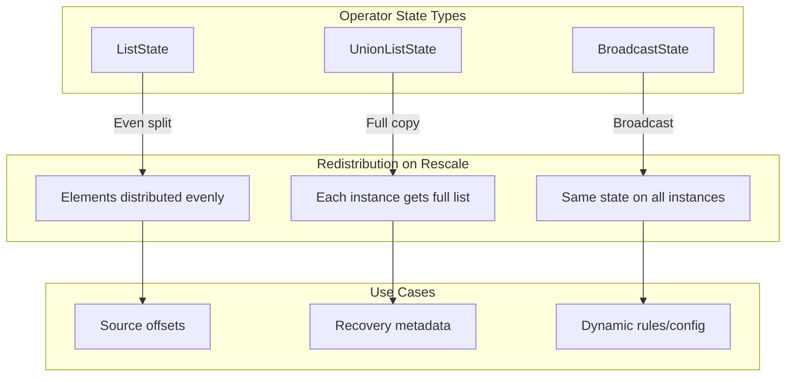
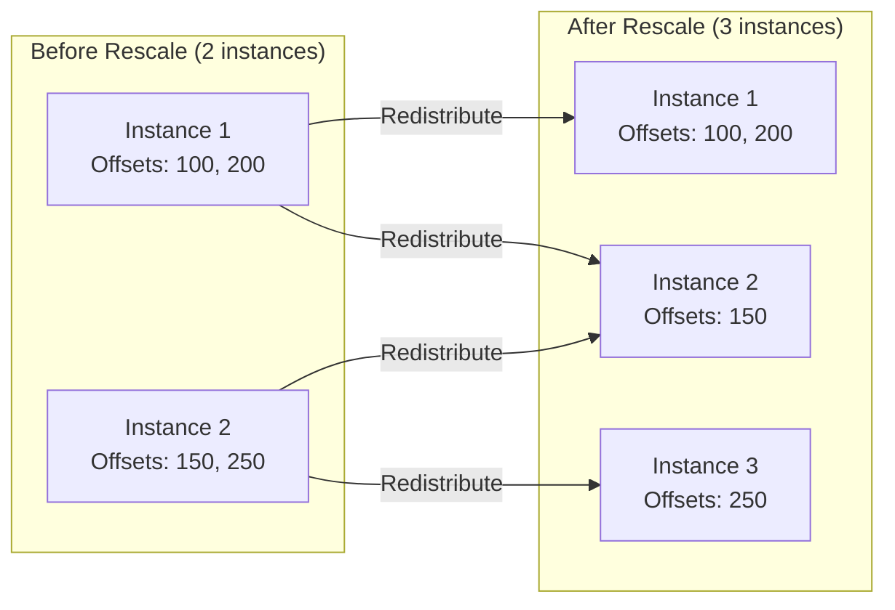
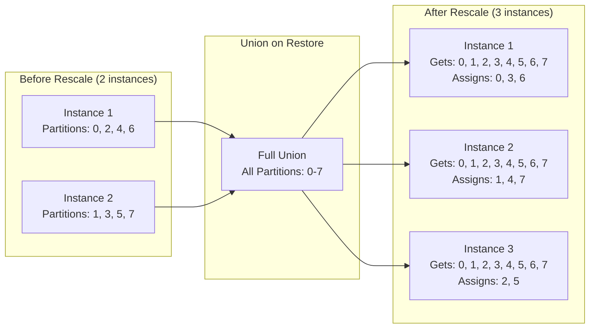
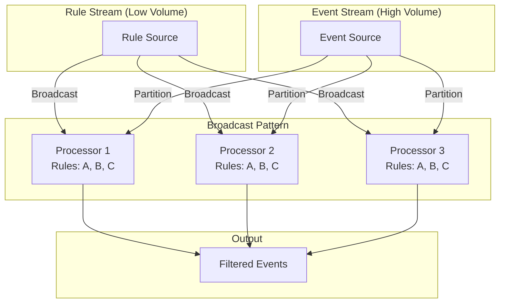
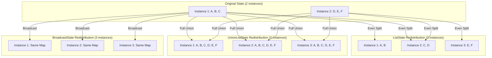
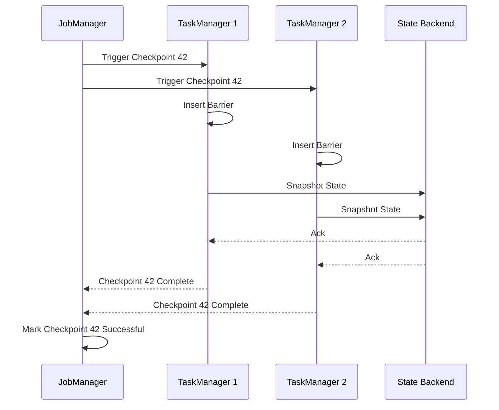
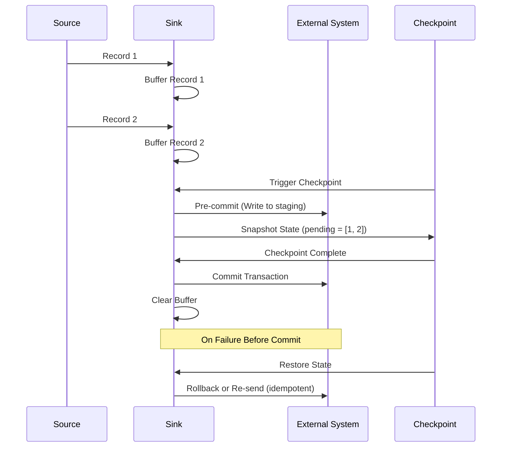
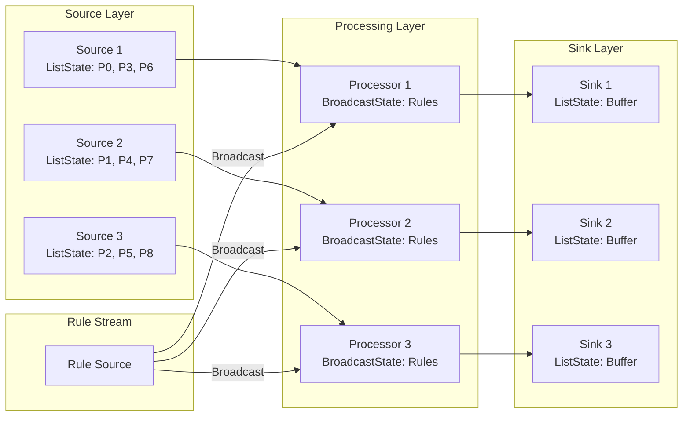

# How to Build Operator State

Author: [nawazdhandala](https://github.com/nawazdhandala)

Tags: Stream Processing, State Management, Apache Flink, Fault Tolerance

Description: Learn to build operator state in stream processing for non-keyed stateful operations and source/sink connectors.

---

> In stream processing, state is what separates a stateless transformation from a powerful, fault-tolerant computation that can remember context across millions of events.

Operator state is a fundamental concept in distributed stream processing frameworks like Apache Flink. Unlike keyed state (which is partitioned by key), operator state is bound to a single parallel operator instance. This makes it essential for building source connectors, sink connectors, and any operation that needs to maintain state without key-based partitioning.

This guide walks through the different types of operator state, how to implement them, redistribution strategies during rescaling, and how checkpointing ensures fault tolerance.

---

## Table of Contents

1. Understanding Operator State vs Keyed State
2. Types of Operator State
3. ListState Implementation
4. UnionListState for Broadcast-Style Recovery
5. BroadcastState for Dynamic Configuration
6. Redistribution Strategies During Rescaling
7. Checkpointing and Fault Tolerance
8. Building a Custom Source with Operator State
9. Building a Custom Sink with Operator State
10. Best Practices and Common Pitfalls
11. Putting It All Together

---

## 1. Understanding Operator State vs Keyed State

Before diving into operator state, it is important to understand how it differs from keyed state.

| Aspect | Keyed State | Operator State |
|--------|-------------|----------------|
| Partitioning | Partitioned by key | Bound to operator instance |
| Access Scope | Per-key access | Per-operator instance access |
| Use Cases | Aggregations, joins, windows by key | Sources, sinks, non-keyed operations |
| Redistribution | Automatically handled by key groups | Requires explicit redistribution logic |
| State Backends | RocksDB, HashMapStateBackend | Same backends, different access patterns |

### When to Use Operator State

- **Source Connectors**: Track offsets, partition assignments, file positions
- **Sink Connectors**: Buffer records before flushing, track acknowledgments
- **Non-Keyed Operations**: Operations that need state but do not have a natural key
- **Broadcast Patterns**: Distribute configuration or rules to all parallel instances

---

## 2. Types of Operator State

Apache Flink provides three main types of operator state, each with different redistribution semantics.



### Quick Reference

| State Type | Redistribution | Best For |
|------------|---------------|----------|
| ListState | Even split across instances | Partitioned source offsets |
| UnionListState | Full union to all instances | Recovery metadata needing full view |
| BroadcastState | Same copy everywhere | Dynamic configuration, rules |

---

## 3. ListState Implementation

ListState is the most common operator state type. Elements are evenly redistributed when the job is rescaled.

### Basic ListState Example

```java
import org.apache.flink.api.common.state.ListState;
import org.apache.flink.api.common.state.ListStateDescriptor;
import org.apache.flink.runtime.state.FunctionInitializationContext;
import org.apache.flink.runtime.state.FunctionSnapshotContext;
import org.apache.flink.streaming.api.checkpoint.CheckpointedFunction;
import org.apache.flink.streaming.api.functions.source.RichSourceFunction;

import java.util.ArrayList;
import java.util.List;

/**
 * A source function that tracks partition offsets using ListState.
 * On checkpoint, offsets are persisted. On recovery or rescale,
 * offsets are redistributed evenly across the new set of instances.
 */
public class PartitionedSourceWithListState
        extends RichSourceFunction<String>
        implements CheckpointedFunction {

    // Transient state handle, populated during initialization
    private transient ListState<Long> offsetState;

    // In-memory offset tracking (restored from state on recovery)
    private List<Long> currentOffsets;

    // Control flag for the source loop
    private volatile boolean isRunning = true;

    public PartitionedSourceWithListState() {
        this.currentOffsets = new ArrayList<>();
    }

    /**
     * Called when a checkpoint is triggered.
     * Snapshot current offsets into the ListState.
     */
    @Override
    public void snapshotState(FunctionSnapshotContext context) throws Exception {
        // Clear previous state and write current offsets
        offsetState.clear();
        for (Long offset : currentOffsets) {
            offsetState.add(offset);
        }

        System.out.printf(
            "Checkpoint %d: Snapshotted %d offsets%n",
            context.getCheckpointId(),
            currentOffsets.size()
        );
    }

    /**
     * Called during operator initialization (startup or recovery).
     * Restore offsets from the ListState if available.
     */
    @Override
    public void initializeState(FunctionInitializationContext context) throws Exception {
        // Define the state descriptor with a name and type
        ListStateDescriptor<Long> descriptor = new ListStateDescriptor<>(
            "partition-offsets",  // State name (used for state migration)
            Long.class            // State element type
        );

        // Get or create the operator state
        offsetState = context.getOperatorStateStore().getListState(descriptor);

        // Restore offsets if recovering from a checkpoint
        if (context.isRestored()) {
            currentOffsets.clear();
            for (Long offset : offsetState.get()) {
                currentOffsets.add(offset);
            }
            System.out.printf(
                "Restored %d offsets from checkpoint%n",
                currentOffsets.size()
            );
        } else {
            // Fresh start: initialize with default offsets
            // In a real source, you would discover partitions here
            int parallelism = getRuntimeContext().getNumberOfParallelSubtasks();
            int subtaskIndex = getRuntimeContext().getIndexOfThisSubtask();

            // Each subtask handles a subset of partitions
            currentOffsets.add(0L);  // Starting offset
            System.out.printf(
                "Subtask %d/%d: Initialized with fresh state%n",
                subtaskIndex,
                parallelism
            );
        }
    }

    @Override
    public void run(SourceContext<String> ctx) throws Exception {
        int subtaskIndex = getRuntimeContext().getIndexOfThisSubtask();

        while (isRunning) {
            // Synchronize on checkpoint lock for consistent snapshots
            synchronized (ctx.getCheckpointLock()) {
                for (int i = 0; i < currentOffsets.size(); i++) {
                    Long currentOffset = currentOffsets.get(i);

                    // Emit a record (simulated)
                    String record = String.format(
                        "subtask-%d-partition-%d-offset-%d",
                        subtaskIndex, i, currentOffset
                    );
                    ctx.collect(record);

                    // Update offset
                    currentOffsets.set(i, currentOffset + 1);
                }
            }

            Thread.sleep(100);  // Simulate processing delay
        }
    }

    @Override
    public void cancel() {
        isRunning = false;
    }
}
```

### ListState Redistribution Visualization



---

## 4. UnionListState for Broadcast-Style Recovery

UnionListState provides each parallel instance with the complete union of all state elements after recovery or rescaling. This is useful when each instance needs full visibility of all metadata.

### UnionListState Example

```java
import org.apache.flink.api.common.state.ListState;
import org.apache.flink.api.common.state.ListStateDescriptor;
import org.apache.flink.runtime.state.FunctionInitializationContext;
import org.apache.flink.runtime.state.FunctionSnapshotContext;
import org.apache.flink.streaming.api.checkpoint.CheckpointedFunction;
import org.apache.flink.streaming.api.functions.source.RichSourceFunction;

import java.util.HashSet;
import java.util.Set;

/**
 * A source that uses UnionListState to track all discovered partitions.
 * On recovery, every instance receives the full set of partitions,
 * allowing any instance to rebalance the partition assignment.
 */
public class UnionStateSource
        extends RichSourceFunction<String>
        implements CheckpointedFunction {

    // UnionListState: every instance gets the full union on restore
    private transient ListState<PartitionInfo> unionState;

    // Local set of all known partitions (union of all instances)
    private Set<PartitionInfo> allPartitions;

    // Partitions assigned to this specific subtask
    private Set<PartitionInfo> myPartitions;

    private volatile boolean isRunning = true;

    public UnionStateSource() {
        this.allPartitions = new HashSet<>();
        this.myPartitions = new HashSet<>();
    }

    @Override
    public void snapshotState(FunctionSnapshotContext context) throws Exception {
        unionState.clear();

        // Each instance only snapshots its own partitions
        // The "union" happens during restore
        for (PartitionInfo partition : myPartitions) {
            unionState.add(partition);
        }

        System.out.printf(
            "Checkpoint %d: Snapshotted %d partitions (local)%n",
            context.getCheckpointId(),
            myPartitions.size()
        );
    }

    @Override
    public void initializeState(FunctionInitializationContext context) throws Exception {
        ListStateDescriptor<PartitionInfo> descriptor = new ListStateDescriptor<>(
            "partition-union-state",
            PartitionInfo.class
        );

        // Use getUnionListState instead of getListState
        // This ensures all elements from all instances are merged on restore
        unionState = context.getOperatorStateStore().getUnionListState(descriptor);

        if (context.isRestored()) {
            // Receive the FULL UNION of all partitions from all instances
            allPartitions.clear();
            for (PartitionInfo partition : unionState.get()) {
                allPartitions.add(partition);
            }

            System.out.printf(
                "Restored union state with %d total partitions%n",
                allPartitions.size()
            );

            // Reassign partitions based on new parallelism
            reassignPartitions();
        } else {
            // Fresh start: discover partitions
            discoverPartitions();
        }
    }

    /**
     * Assign partitions to this subtask based on round-robin distribution.
     */
    private void reassignPartitions() {
        int parallelism = getRuntimeContext().getNumberOfParallelSubtasks();
        int subtaskIndex = getRuntimeContext().getIndexOfThisSubtask();

        myPartitions.clear();
        int partitionIndex = 0;

        for (PartitionInfo partition : allPartitions) {
            // Round-robin assignment
            if (partitionIndex % parallelism == subtaskIndex) {
                myPartitions.add(partition);
            }
            partitionIndex++;
        }

        System.out.printf(
            "Subtask %d: Assigned %d of %d partitions%n",
            subtaskIndex,
            myPartitions.size(),
            allPartitions.size()
        );
    }

    /**
     * Discover partitions (called on fresh start).
     */
    private void discoverPartitions() {
        int parallelism = getRuntimeContext().getNumberOfParallelSubtasks();
        int subtaskIndex = getRuntimeContext().getIndexOfThisSubtask();

        // Simulate partition discovery (in reality, query Kafka, etc.)
        int totalPartitions = 8;
        for (int i = 0; i < totalPartitions; i++) {
            PartitionInfo partition = new PartitionInfo("topic-A", i, 0L);
            allPartitions.add(partition);

            // Assign based on round-robin
            if (i % parallelism == subtaskIndex) {
                myPartitions.add(partition);
            }
        }

        System.out.printf(
            "Subtask %d: Discovered %d partitions, assigned %d%n",
            subtaskIndex,
            totalPartitions,
            myPartitions.size()
        );
    }

    @Override
    public void run(SourceContext<String> ctx) throws Exception {
        while (isRunning) {
            synchronized (ctx.getCheckpointLock()) {
                for (PartitionInfo partition : myPartitions) {
                    String record = String.format(
                        "%s-partition-%d-offset-%d",
                        partition.topic,
                        partition.partitionId,
                        partition.offset
                    );
                    ctx.collect(record);
                    partition.offset++;
                }
            }
            Thread.sleep(100);
        }
    }

    @Override
    public void cancel() {
        isRunning = false;
    }

    /**
     * Partition metadata class (must be serializable).
     */
    public static class PartitionInfo implements java.io.Serializable {
        public String topic;
        public int partitionId;
        public long offset;

        public PartitionInfo() {}

        public PartitionInfo(String topic, int partitionId, long offset) {
            this.topic = topic;
            this.partitionId = partitionId;
            this.offset = offset;
        }

        @Override
        public int hashCode() {
            return topic.hashCode() * 31 + partitionId;
        }

        @Override
        public boolean equals(Object obj) {
            if (!(obj instanceof PartitionInfo)) return false;
            PartitionInfo other = (PartitionInfo) obj;
            return topic.equals(other.topic) && partitionId == other.partitionId;
        }
    }
}
```

### UnionListState Redistribution Visualization



---

## 5. BroadcastState for Dynamic Configuration

BroadcastState allows you to broadcast configuration, rules, or patterns to all parallel instances of an operator. The state is identical across all instances.

### BroadcastState Example

```java
import org.apache.flink.api.common.state.BroadcastState;
import org.apache.flink.api.common.state.MapStateDescriptor;
import org.apache.flink.api.common.state.ReadOnlyBroadcastState;
import org.apache.flink.api.common.typeinfo.BasicTypeInfo;
import org.apache.flink.api.common.typeinfo.TypeHint;
import org.apache.flink.api.common.typeinfo.TypeInformation;
import org.apache.flink.streaming.api.datastream.BroadcastStream;
import org.apache.flink.streaming.api.datastream.DataStream;
import org.apache.flink.streaming.api.environment.StreamExecutionEnvironment;
import org.apache.flink.streaming.api.functions.co.BroadcastProcessFunction;
import org.apache.flink.util.Collector;

import java.util.Map;
import java.util.HashMap;

/**
 * Example of using BroadcastState for dynamic rule-based filtering.
 * Rules are broadcast to all instances and applied to incoming events.
 */
public class BroadcastStateExample {

    // State descriptor for broadcast state (must be MapStateDescriptor)
    public static final MapStateDescriptor<String, FilterRule> RULE_STATE_DESC =
        new MapStateDescriptor<>(
            "filter-rules",
            BasicTypeInfo.STRING_TYPE_INFO,
            TypeInformation.of(new TypeHint<FilterRule>() {})
        );

    public static void main(String[] args) throws Exception {
        StreamExecutionEnvironment env =
            StreamExecutionEnvironment.getExecutionEnvironment();

        // Main event stream (high volume)
        DataStream<Event> eventStream = env
            .addSource(new EventSource())
            .name("Event Source");

        // Rule stream (low volume, broadcast to all instances)
        DataStream<FilterRule> ruleStream = env
            .addSource(new RuleSource())
            .name("Rule Source");

        // Create broadcast stream from rules
        BroadcastStream<FilterRule> broadcastRules =
            ruleStream.broadcast(RULE_STATE_DESC);

        // Connect event stream with broadcast rules
        DataStream<Event> filteredEvents = eventStream
            .connect(broadcastRules)
            .process(new DynamicFilterFunction())
            .name("Dynamic Filter");

        filteredEvents.print();

        env.execute("Broadcast State Example");
    }

    /**
     * Process function that applies broadcast rules to filter events.
     */
    public static class DynamicFilterFunction
            extends BroadcastProcessFunction<Event, FilterRule, Event> {

        /**
         * Process regular events using the current broadcast state.
         */
        @Override
        public void processElement(
                Event event,
                ReadOnlyContext ctx,
                Collector<Event> out) throws Exception {

            // Access broadcast state (read-only in processElement)
            ReadOnlyBroadcastState<String, FilterRule> ruleState =
                ctx.getBroadcastState(RULE_STATE_DESC);

            // Check if event matches any filter rule
            boolean shouldFilter = false;

            for (Map.Entry<String, FilterRule> entry : ruleState.immutableEntries()) {
                FilterRule rule = entry.getValue();
                if (rule.matches(event)) {
                    shouldFilter = rule.action.equals("FILTER");
                    break;
                }
            }

            // Emit event if not filtered
            if (!shouldFilter) {
                out.collect(event);
            }
        }

        /**
         * Process broadcast elements (rules).
         * This is where we update the broadcast state.
         */
        @Override
        public void processBroadcastElement(
                FilterRule rule,
                Context ctx,
                Collector<Event> out) throws Exception {

            // Access broadcast state (read-write in processBroadcastElement)
            BroadcastState<String, FilterRule> ruleState =
                ctx.getBroadcastState(RULE_STATE_DESC);

            // Update the rule in state
            if (rule.action.equals("DELETE")) {
                ruleState.remove(rule.ruleId);
                System.out.printf("Removed rule: %s%n", rule.ruleId);
            } else {
                ruleState.put(rule.ruleId, rule);
                System.out.printf("Added/Updated rule: %s%n", rule.ruleId);
            }
        }
    }

    /**
     * Event class representing incoming data.
     */
    public static class Event implements java.io.Serializable {
        public String eventType;
        public String userId;
        public long timestamp;
        public Map<String, String> attributes;

        public Event() {
            this.attributes = new HashMap<>();
        }

        public Event(String eventType, String userId, long timestamp) {
            this();
            this.eventType = eventType;
            this.userId = userId;
            this.timestamp = timestamp;
        }
    }

    /**
     * Filter rule class representing dynamic configuration.
     */
    public static class FilterRule implements java.io.Serializable {
        public String ruleId;
        public String eventTypePattern;  // Regex pattern
        public String action;            // FILTER or PASS or DELETE

        public FilterRule() {}

        public FilterRule(String ruleId, String eventTypePattern, String action) {
            this.ruleId = ruleId;
            this.eventTypePattern = eventTypePattern;
            this.action = action;
        }

        public boolean matches(Event event) {
            return event.eventType.matches(eventTypePattern);
        }
    }
}
```

### BroadcastState Architecture



---

## 6. Redistribution Strategies During Rescaling

Understanding how state is redistributed during rescaling is crucial for building robust stateful applications.

### Redistribution Strategy Comparison



### Choosing the Right Strategy

| Scenario | Recommended State Type | Reason |
|----------|----------------------|--------|
| Source partition offsets | ListState | Each offset maps to one partition |
| Discovered partition metadata | UnionListState | Need full view for rebalancing |
| Configuration/rules | BroadcastState | Same config needed everywhere |
| File reader positions | ListState | Each file assigned to one instance |
| Schema registry cache | BroadcastState | All instances need same schemas |

---

## 7. Checkpointing and Fault Tolerance

Checkpointing is the mechanism that enables fault tolerance for stateful stream processing. Operator state is persisted during checkpoints and restored on failure.

### Checkpoint Flow



### Enabling Checkpointing

```java
import org.apache.flink.streaming.api.environment.StreamExecutionEnvironment;
import org.apache.flink.streaming.api.CheckpointingMode;
import org.apache.flink.streaming.api.environment.CheckpointConfig;

public class CheckpointingConfiguration {

    public static void configureCheckpointing(StreamExecutionEnvironment env) {
        // Enable checkpointing every 30 seconds
        env.enableCheckpointing(30000);

        // Configure checkpoint settings
        CheckpointConfig config = env.getCheckpointConfig();

        // Use exactly-once semantics
        config.setCheckpointingMode(CheckpointingMode.EXACTLY_ONCE);

        // Minimum time between checkpoints (prevents back-to-back checkpoints)
        config.setMinPauseBetweenCheckpoints(10000);

        // Checkpoint timeout (fail if not completed in time)
        config.setCheckpointTimeout(60000);

        // Maximum concurrent checkpoints
        config.setMaxConcurrentCheckpoints(1);

        // Enable externalized checkpoints (retained on cancellation)
        config.setExternalizedCheckpointCleanup(
            CheckpointConfig.ExternalizedCheckpointCleanup.RETAIN_ON_CANCELLATION
        );

        // Enable unaligned checkpoints for better latency under backpressure
        config.enableUnalignedCheckpoints();

        // Configure state backend
        // env.setStateBackend(new HashMapStateBackend());
        // env.setStateBackend(new EmbeddedRocksDBStateBackend());

        System.out.println("Checkpointing configured with exactly-once semantics");
    }
}
```

### Checkpoint Lifecycle in Operator State

```java
import org.apache.flink.runtime.state.FunctionInitializationContext;
import org.apache.flink.runtime.state.FunctionSnapshotContext;
import org.apache.flink.streaming.api.checkpoint.CheckpointedFunction;

/**
 * Demonstrates the checkpoint lifecycle for operator state.
 */
public class CheckpointLifecycleExample implements CheckpointedFunction {

    /**
     * PHASE 1: Initialization
     * Called once when the operator starts (fresh or from recovery).
     *
     * Timeline: Job Start -> initializeState() -> open() -> run()
     */
    @Override
    public void initializeState(FunctionInitializationContext context) throws Exception {
        // 1. Create state descriptors
        // 2. Get state handles from context
        // 3. Restore state if context.isRestored() is true
        // 4. Initialize default state if fresh start

        boolean isRecovery = context.isRestored();
        System.out.printf("initializeState called, recovery=%b%n", isRecovery);
    }

    /**
     * PHASE 2: Snapshot
     * Called when a checkpoint is triggered.
     * Must complete within checkpoint timeout.
     *
     * Timeline: Checkpoint Trigger -> Barrier Received -> snapshotState()
     */
    @Override
    public void snapshotState(FunctionSnapshotContext context) throws Exception {
        // 1. Clear previous state
        // 2. Write current in-memory state to state handle
        // 3. State is asynchronously persisted to backend

        long checkpointId = context.getCheckpointId();
        long timestamp = context.getCheckpointTimestamp();
        System.out.printf(
            "snapshotState called, checkpoint=%d, timestamp=%d%n",
            checkpointId, timestamp
        );
    }

    /**
     * PHASE 3: Recovery (on failure)
     * If failure occurs, job restarts and initializeState is called again.
     *
     * Timeline: Failure -> Job Restart -> initializeState(restored=true)
     */
    // Recovery happens through initializeState with context.isRestored() = true
}
```

---

## 8. Building a Custom Source with Operator State

Here is a complete example of a file-based source that uses operator state to track file positions.

```java
import org.apache.flink.api.common.state.ListState;
import org.apache.flink.api.common.state.ListStateDescriptor;
import org.apache.flink.api.common.typeutils.base.LongSerializer;
import org.apache.flink.api.common.typeutils.base.StringSerializer;
import org.apache.flink.api.java.tuple.Tuple2;
import org.apache.flink.runtime.state.FunctionInitializationContext;
import org.apache.flink.runtime.state.FunctionSnapshotContext;
import org.apache.flink.streaming.api.checkpoint.CheckpointedFunction;
import org.apache.flink.streaming.api.functions.source.RichParallelSourceFunction;

import java.io.BufferedReader;
import java.io.FileReader;
import java.util.ArrayList;
import java.util.List;

/**
 * A file source that tracks positions using operator state.
 * Supports exactly-once semantics through checkpointing.
 */
public class FileSourceWithOperatorState
        extends RichParallelSourceFunction<String>
        implements CheckpointedFunction {

    // Configuration
    private final List<String> filePaths;

    // Operator state for file positions
    private transient ListState<Tuple2<String, Long>> positionState;

    // In-memory tracking
    private List<Tuple2<String, Long>> currentPositions;

    private volatile boolean isRunning = true;

    public FileSourceWithOperatorState(List<String> filePaths) {
        this.filePaths = filePaths;
        this.currentPositions = new ArrayList<>();
    }

    @Override
    public void initializeState(FunctionInitializationContext context) throws Exception {
        // Define state descriptor for (filename, position) tuples
        ListStateDescriptor<Tuple2<String, Long>> descriptor =
            new ListStateDescriptor<>(
                "file-positions",
                org.apache.flink.api.common.typeinfo.TypeInformation.of(
                    new org.apache.flink.api.common.typeinfo.TypeHint<Tuple2<String, Long>>() {}
                )
            );

        positionState = context.getOperatorStateStore().getListState(descriptor);

        if (context.isRestored()) {
            // Restore positions from checkpoint
            currentPositions.clear();
            for (Tuple2<String, Long> position : positionState.get()) {
                currentPositions.add(position);
                System.out.printf(
                    "Restored file position: %s at byte %d%n",
                    position.f0, position.f1
                );
            }
        } else {
            // Fresh start: assign files to this subtask
            assignFiles();
        }
    }

    /**
     * Assign files to this subtask based on parallelism.
     */
    private void assignFiles() {
        int parallelism = getRuntimeContext().getNumberOfParallelSubtasks();
        int subtaskIndex = getRuntimeContext().getIndexOfThisSubtask();

        currentPositions.clear();
        for (int i = 0; i < filePaths.size(); i++) {
            if (i % parallelism == subtaskIndex) {
                // Initialize position at 0 (start of file)
                currentPositions.add(Tuple2.of(filePaths.get(i), 0L));
                System.out.printf(
                    "Subtask %d assigned file: %s%n",
                    subtaskIndex, filePaths.get(i)
                );
            }
        }
    }

    @Override
    public void snapshotState(FunctionSnapshotContext context) throws Exception {
        positionState.clear();

        for (Tuple2<String, Long> position : currentPositions) {
            positionState.add(position);
        }

        System.out.printf(
            "Checkpoint %d: Saved %d file positions%n",
            context.getCheckpointId(),
            currentPositions.size()
        );
    }

    @Override
    public void run(SourceContext<String> ctx) throws Exception {
        // Process each assigned file
        for (int fileIndex = 0; fileIndex < currentPositions.size(); fileIndex++) {
            if (!isRunning) break;

            Tuple2<String, Long> filePosition = currentPositions.get(fileIndex);
            String filePath = filePosition.f0;
            long startPosition = filePosition.f1;

            try (BufferedReader reader = new BufferedReader(new FileReader(filePath))) {
                // Skip to the saved position
                long skipped = reader.skip(startPosition);
                long currentPosition = startPosition;

                String line;
                while (isRunning && (line = reader.readLine()) != null) {
                    // Synchronize on checkpoint lock for consistency
                    synchronized (ctx.getCheckpointLock()) {
                        ctx.collect(line);

                        // Update position (line length + newline character)
                        currentPosition += line.length() + 1;
                        currentPositions.set(
                            fileIndex,
                            Tuple2.of(filePath, currentPosition)
                        );
                    }
                }

                System.out.printf(
                    "Finished reading file: %s%n",
                    filePath
                );
            }
        }
    }

    @Override
    public void cancel() {
        isRunning = false;
    }
}
```

---

## 9. Building a Custom Sink with Operator State

Sinks often need operator state to buffer records before flushing to external systems.

```java
import org.apache.flink.api.common.state.ListState;
import org.apache.flink.api.common.state.ListStateDescriptor;
import org.apache.flink.configuration.Configuration;
import org.apache.flink.runtime.state.FunctionInitializationContext;
import org.apache.flink.runtime.state.FunctionSnapshotContext;
import org.apache.flink.streaming.api.checkpoint.CheckpointedFunction;
import org.apache.flink.streaming.api.functions.sink.RichSinkFunction;

import java.util.ArrayList;
import java.util.List;

/**
 * A buffered sink that uses operator state for exactly-once semantics.
 * Records are buffered and flushed on checkpoint completion.
 */
public class BufferedSinkWithOperatorState
        extends RichSinkFunction<String>
        implements CheckpointedFunction {

    // Configuration
    private final int bufferSize;
    private final String targetSystem;

    // Operator state for pending records
    private transient ListState<String> pendingState;

    // In-memory buffer
    private List<String> pendingRecords;

    // Track checkpoint IDs for exactly-once
    private long lastCompletedCheckpointId = -1;

    public BufferedSinkWithOperatorState(int bufferSize, String targetSystem) {
        this.bufferSize = bufferSize;
        this.targetSystem = targetSystem;
        this.pendingRecords = new ArrayList<>();
    }

    @Override
    public void open(Configuration parameters) throws Exception {
        super.open(parameters);
        // Initialize connection to target system
        System.out.printf(
            "Sink opened, connecting to: %s%n",
            targetSystem
        );
    }

    @Override
    public void initializeState(FunctionInitializationContext context) throws Exception {
        ListStateDescriptor<String> descriptor = new ListStateDescriptor<>(
            "pending-records",
            String.class
        );

        pendingState = context.getOperatorStateStore().getListState(descriptor);

        if (context.isRestored()) {
            // Restore pending records from checkpoint
            pendingRecords.clear();
            for (String record : pendingState.get()) {
                pendingRecords.add(record);
            }

            System.out.printf(
                "Restored %d pending records from checkpoint%n",
                pendingRecords.size()
            );

            // Re-send pending records (idempotent write required)
            if (!pendingRecords.isEmpty()) {
                flushToTarget();
            }
        }
    }

    @Override
    public void snapshotState(FunctionSnapshotContext context) throws Exception {
        // Clear and save current pending records
        pendingState.clear();

        for (String record : pendingRecords) {
            pendingState.add(record);
        }

        System.out.printf(
            "Checkpoint %d: Saved %d pending records%n",
            context.getCheckpointId(),
            pendingRecords.size()
        );
    }

    @Override
    public void invoke(String value, Context context) throws Exception {
        pendingRecords.add(value);

        // Flush when buffer is full
        if (pendingRecords.size() >= bufferSize) {
            flushToTarget();
        }
    }

    /**
     * Flush buffered records to target system.
     * Must be idempotent for exactly-once semantics.
     */
    private void flushToTarget() throws Exception {
        if (pendingRecords.isEmpty()) {
            return;
        }

        // Simulate writing to external system
        System.out.printf(
            "Flushing %d records to %s%n",
            pendingRecords.size(),
            targetSystem
        );

        // In a real implementation:
        // 1. Begin transaction (if supported)
        // 2. Write records with unique IDs (for idempotence)
        // 3. Commit transaction

        for (String record : pendingRecords) {
            // Simulate write
            Thread.sleep(1);
        }

        pendingRecords.clear();
    }

    /**
     * Called when checkpoint is completed successfully.
     * Safe to acknowledge records to upstream systems.
     */
    public void notifyCheckpointComplete(long checkpointId) throws Exception {
        if (checkpointId > lastCompletedCheckpointId) {
            lastCompletedCheckpointId = checkpointId;

            // Flush any remaining records
            flushToTarget();

            System.out.printf(
                "Checkpoint %d completed, records committed%n",
                checkpointId
            );
        }
    }

    @Override
    public void close() throws Exception {
        // Final flush on close
        flushToTarget();

        System.out.println("Sink closed");
        super.close();
    }
}
```

### Sink with Two-Phase Commit



---

## 10. Best Practices and Common Pitfalls

### Best Practices

```java
/**
 * Best practices for operator state implementation.
 */
public class OperatorStateBestPractices {

    // 1. Always use the checkpoint lock for state modifications
    public void correctStateModification(SourceContext<String> ctx) {
        synchronized (ctx.getCheckpointLock()) {
            // Modify state here
            // This ensures consistency during snapshots
        }
    }

    // 2. Make state elements serializable
    public static class SerializableState implements java.io.Serializable {
        private static final long serialVersionUID = 1L;
        public String data;
        public long timestamp;
    }

    // 3. Use appropriate state types
    // ListState: when each element is independent
    // UnionListState: when you need full visibility on restore
    // BroadcastState: when all instances need identical state

    // 4. Handle state migration with versioned serialization
    public static class VersionedState implements java.io.Serializable {
        private static final long serialVersionUID = 2L;  // Increment on changes
        public int version = 2;
        public String newField;  // Added in version 2
    }

    // 5. Keep state size manageable
    // Large state = slow checkpoints and recovery
    // Consider incremental checkpointing for RocksDB
}
```

### Common Pitfalls

| Pitfall | Problem | Solution |
|---------|---------|----------|
| Not using checkpoint lock | Race conditions during snapshot | Always synchronize on `ctx.getCheckpointLock()` |
| Large state objects | Slow checkpoints, OOM | Use incremental checkpointing, compress state |
| Non-serializable state | Checkpoint failures | Ensure all state classes implement Serializable |
| Ignoring `isRestored()` | State corruption on recovery | Check context.isRestored() in initializeState |
| State name conflicts | State cannot be restored | Use unique, descriptive state names |
| Modifying state outside lock | Inconsistent snapshots | Only modify state within synchronized block |

### State Size Monitoring

```java
import org.apache.flink.metrics.Gauge;
import org.apache.flink.metrics.MetricGroup;

/**
 * Monitor operator state size using Flink metrics.
 */
public class StateMetricsExample {

    private List<String> bufferedRecords;

    public void registerMetrics(MetricGroup metricGroup) {
        // Register a gauge for buffer size
        metricGroup.gauge("bufferSize", new Gauge<Integer>() {
            @Override
            public Integer getValue() {
                return bufferedRecords.size();
            }
        });

        // Register a gauge for estimated memory usage
        metricGroup.gauge("estimatedMemoryBytes", new Gauge<Long>() {
            @Override
            public Long getValue() {
                long size = 0;
                for (String record : bufferedRecords) {
                    size += record.length() * 2;  // Rough estimate for String
                }
                return size;
            }
        });
    }
}
```

---

## 11. Putting It All Together

Here is a complete example that demonstrates all operator state types working together.

```java
import org.apache.flink.api.common.state.BroadcastState;
import org.apache.flink.api.common.state.ListState;
import org.apache.flink.api.common.state.ListStateDescriptor;
import org.apache.flink.api.common.state.MapStateDescriptor;
import org.apache.flink.api.common.state.ReadOnlyBroadcastState;
import org.apache.flink.api.common.typeinfo.BasicTypeInfo;
import org.apache.flink.runtime.state.FunctionInitializationContext;
import org.apache.flink.runtime.state.FunctionSnapshotContext;
import org.apache.flink.streaming.api.checkpoint.CheckpointedFunction;
import org.apache.flink.streaming.api.datastream.BroadcastStream;
import org.apache.flink.streaming.api.datastream.DataStream;
import org.apache.flink.streaming.api.environment.StreamExecutionEnvironment;
import org.apache.flink.streaming.api.functions.co.BroadcastProcessFunction;
import org.apache.flink.streaming.api.functions.source.RichParallelSourceFunction;
import org.apache.flink.util.Collector;

import java.util.ArrayList;
import java.util.HashMap;
import java.util.List;
import java.util.Map;

/**
 * Complete example demonstrating operator state in a stream processing pipeline.
 *
 * Pipeline:
 * 1. Source with ListState (partition offsets)
 * 2. Processor with BroadcastState (dynamic filtering rules)
 * 3. Sink with ListState (buffered output)
 */
public class CompleteOperatorStateExample {

    public static void main(String[] args) throws Exception {
        StreamExecutionEnvironment env =
            StreamExecutionEnvironment.getExecutionEnvironment();

        // Enable checkpointing
        env.enableCheckpointing(10000);

        // Create source with operator state
        DataStream<Event> events = env
            .addSource(new StatefulSource())
            .name("Stateful Source");

        // Create rule stream
        DataStream<Rule> rules = env
            .addSource(new RuleSource())
            .name("Rule Source");

        // Broadcast rules
        MapStateDescriptor<String, Rule> ruleDescriptor =
            new MapStateDescriptor<>(
                "rules",
                BasicTypeInfo.STRING_TYPE_INFO,
                org.apache.flink.api.common.typeinfo.TypeInformation.of(Rule.class)
            );

        BroadcastStream<Rule> broadcastRules = rules.broadcast(ruleDescriptor);

        // Process with broadcast state
        DataStream<Event> processed = events
            .connect(broadcastRules)
            .process(new RuleBasedProcessor(ruleDescriptor))
            .name("Rule Processor");

        // Sink with operator state
        processed.addSink(new StatefulSink()).name("Stateful Sink");

        env.execute("Complete Operator State Example");
    }

    /**
     * Source with ListState for tracking partitions.
     */
    public static class StatefulSource
            extends RichParallelSourceFunction<Event>
            implements CheckpointedFunction {

        private transient ListState<PartitionState> partitionState;
        private List<PartitionState> partitions;
        private volatile boolean isRunning = true;

        public StatefulSource() {
            this.partitions = new ArrayList<>();
        }

        @Override
        public void initializeState(FunctionInitializationContext ctx) throws Exception {
            ListStateDescriptor<PartitionState> descriptor =
                new ListStateDescriptor<>("partitions", PartitionState.class);

            partitionState = ctx.getOperatorStateStore().getListState(descriptor);

            if (ctx.isRestored()) {
                partitions.clear();
                for (PartitionState p : partitionState.get()) {
                    partitions.add(p);
                }
            } else {
                // Initialize partitions for this subtask
                int parallelism = getRuntimeContext().getNumberOfParallelSubtasks();
                int subtask = getRuntimeContext().getIndexOfThisSubtask();

                for (int i = subtask; i < 10; i += parallelism) {
                    partitions.add(new PartitionState(i, 0));
                }
            }
        }

        @Override
        public void snapshotState(FunctionSnapshotContext ctx) throws Exception {
            partitionState.clear();
            for (PartitionState p : partitions) {
                partitionState.add(p);
            }
        }

        @Override
        public void run(SourceContext<Event> ctx) throws Exception {
            while (isRunning) {
                synchronized (ctx.getCheckpointLock()) {
                    for (PartitionState p : partitions) {
                        Event event = new Event(
                            "partition-" + p.partitionId,
                            p.offset,
                            System.currentTimeMillis()
                        );
                        ctx.collect(event);
                        p.offset++;
                    }
                }
                Thread.sleep(100);
            }
        }

        @Override
        public void cancel() {
            isRunning = false;
        }
    }

    /**
     * Processor with BroadcastState for dynamic rules.
     */
    public static class RuleBasedProcessor
            extends BroadcastProcessFunction<Event, Rule, Event> {

        private final MapStateDescriptor<String, Rule> ruleDescriptor;

        public RuleBasedProcessor(MapStateDescriptor<String, Rule> ruleDescriptor) {
            this.ruleDescriptor = ruleDescriptor;
        }

        @Override
        public void processElement(Event event, ReadOnlyContext ctx,
                Collector<Event> out) throws Exception {
            ReadOnlyBroadcastState<String, Rule> rules =
                ctx.getBroadcastState(ruleDescriptor);

            boolean allowed = true;
            for (Map.Entry<String, Rule> entry : rules.immutableEntries()) {
                if (entry.getValue().shouldBlock(event)) {
                    allowed = false;
                    break;
                }
            }

            if (allowed) {
                out.collect(event);
            }
        }

        @Override
        public void processBroadcastElement(Rule rule, Context ctx,
                Collector<Event> out) throws Exception {
            BroadcastState<String, Rule> rules =
                ctx.getBroadcastState(ruleDescriptor);
            rules.put(rule.id, rule);
        }
    }

    /**
     * Sink with ListState for buffering.
     */
    public static class StatefulSink
            extends org.apache.flink.streaming.api.functions.sink.RichSinkFunction<Event>
            implements CheckpointedFunction {

        private transient ListState<Event> bufferState;
        private List<Event> buffer;

        public StatefulSink() {
            this.buffer = new ArrayList<>();
        }

        @Override
        public void initializeState(FunctionInitializationContext ctx) throws Exception {
            ListStateDescriptor<Event> descriptor =
                new ListStateDescriptor<>("buffer", Event.class);

            bufferState = ctx.getOperatorStateStore().getListState(descriptor);

            if (ctx.isRestored()) {
                buffer.clear();
                for (Event e : bufferState.get()) {
                    buffer.add(e);
                }
                // Flush restored buffer
                flush();
            }
        }

        @Override
        public void snapshotState(FunctionSnapshotContext ctx) throws Exception {
            bufferState.clear();
            for (Event e : buffer) {
                bufferState.add(e);
            }
        }

        @Override
        public void invoke(Event event, Context ctx) throws Exception {
            buffer.add(event);
            if (buffer.size() >= 100) {
                flush();
            }
        }

        private void flush() {
            System.out.printf("Flushing %d events%n", buffer.size());
            buffer.clear();
        }

        @Override
        public void close() throws Exception {
            flush();
        }
    }

    // Supporting classes

    public static class Event implements java.io.Serializable {
        public String source;
        public long offset;
        public long timestamp;

        public Event() {}

        public Event(String source, long offset, long timestamp) {
            this.source = source;
            this.offset = offset;
            this.timestamp = timestamp;
        }
    }

    public static class Rule implements java.io.Serializable {
        public String id;
        public String pattern;

        public Rule() {}

        public Rule(String id, String pattern) {
            this.id = id;
            this.pattern = pattern;
        }

        public boolean shouldBlock(Event event) {
            return event.source.matches(pattern);
        }
    }

    public static class PartitionState implements java.io.Serializable {
        public int partitionId;
        public long offset;

        public PartitionState() {}

        public PartitionState(int partitionId, long offset) {
            this.partitionId = partitionId;
            this.offset = offset;
        }
    }

    public static class RuleSource
            extends org.apache.flink.streaming.api.functions.source.SourceFunction<Rule> {

        private volatile boolean isRunning = true;

        @Override
        public void run(SourceContext<Rule> ctx) throws Exception {
            // Emit initial rules
            ctx.collect(new Rule("rule-1", "partition-[0-2]"));

            // Keep running (rules could be updated dynamically)
            while (isRunning) {
                Thread.sleep(1000);
            }
        }

        @Override
        public void cancel() {
            isRunning = false;
        }
    }
}
```

### Pipeline Architecture



---

## Summary

| Topic | Key Takeaway |
|-------|--------------|
| Operator State | Bound to operator instance, not key |
| ListState | Even redistribution on rescale |
| UnionListState | Full state to all instances on rescale |
| BroadcastState | Identical state across all instances |
| Checkpointing | Enables fault tolerance and exactly-once |
| Sources | Use operator state for partition offsets |
| Sinks | Use operator state for buffering and transactions |

Operator state is essential for building robust, fault-tolerant stream processing applications. By understanding the different state types and their redistribution semantics, you can design systems that scale seamlessly and recover gracefully from failures.

---

### See Also

- [Apache Flink Documentation: Working with State](https://nightlies.apache.org/flink/flink-docs-stable/docs/dev/datastream/fault-tolerance/state/)
- [Checkpointing and Savepoints](https://nightlies.apache.org/flink/flink-docs-stable/docs/ops/state/checkpoints/)
- [State Backends](https://nightlies.apache.org/flink/flink-docs-stable/docs/ops/state/state_backends/)
