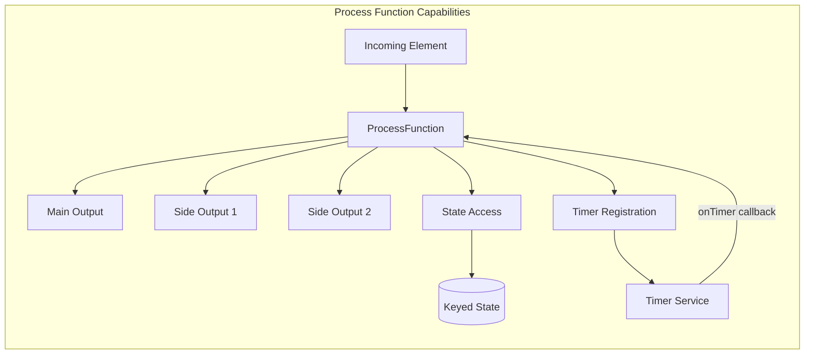
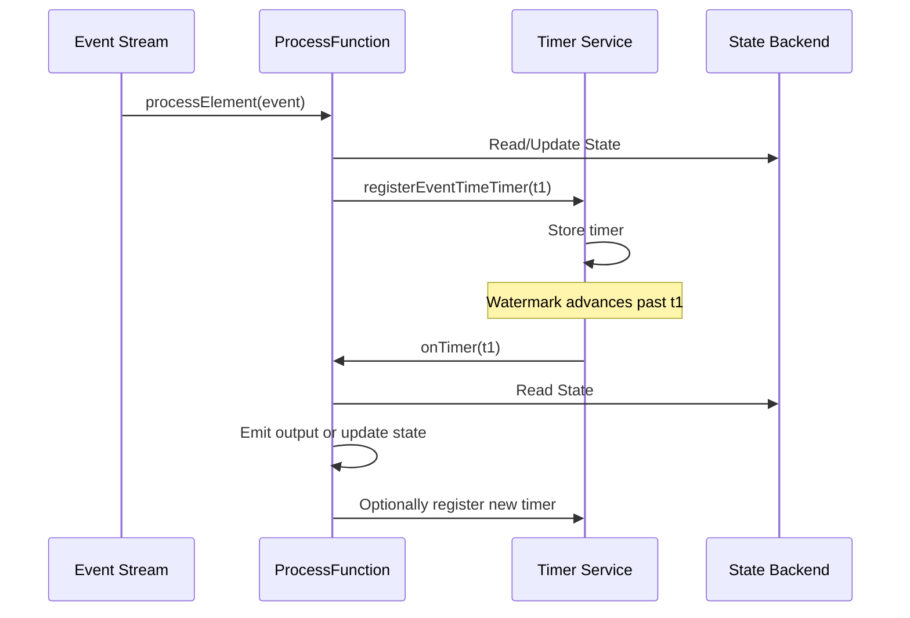
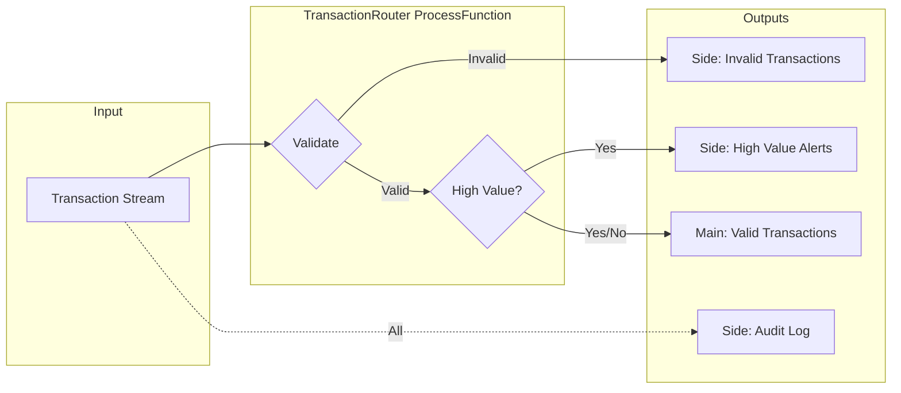
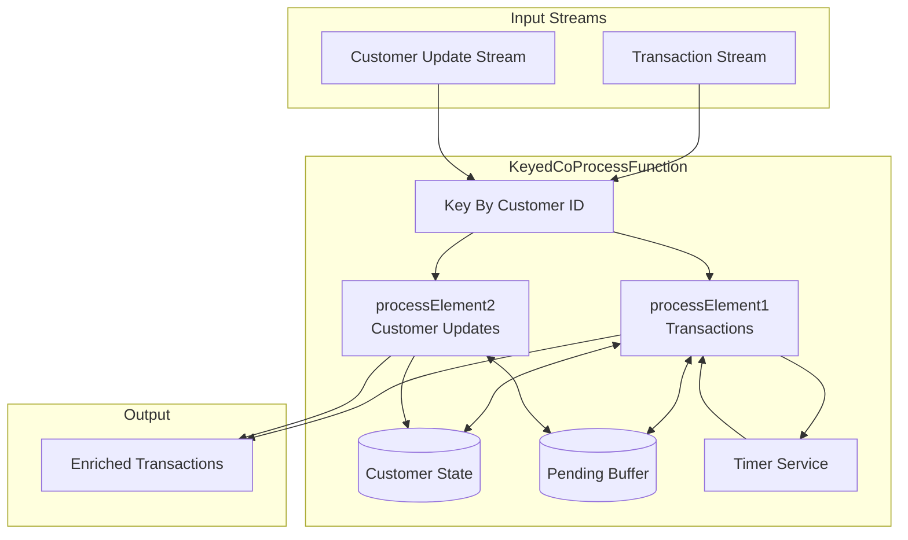

# How to Implement Process Functions

Author: [nawazdhandala](https://github.com/nawazdhandala)

Tags: Stream Processing, ProcessFunction, Apache Flink, State Management

Description: Learn to implement process functions in stream processing for low-level access to elements, state, and timers.

---

> Process functions are the Swiss Army knife of stream processing. They give you direct access to elements, state, timers, and side outputs, enabling complex event processing patterns that higher-level APIs cannot express.

Stream processing frameworks like Apache Flink provide high-level abstractions such as `map`, `filter`, and `window` for common transformations. However, when you need fine-grained control over timing, state management, or output routing, **process functions** become essential. They sit at the lowest level of the API hierarchy, offering maximum flexibility.

---

## 1. What Are Process Functions?

Process functions are low-level stream processing operations that provide access to:

- **Elements**: Each incoming record with its timestamp
- **State**: Keyed state for maintaining information across events
- **Timers**: Event-time and processing-time timers for delayed actions
- **Side Outputs**: Multiple output streams from a single operator
- **Context**: Runtime information like current key and timestamp

Think of process functions as the "assembly language" of stream processing. While higher-level APIs handle common patterns elegantly, process functions let you implement custom logic that those APIs cannot express.



---

## 2. The Process Function Hierarchy

Apache Flink provides several process function variants, each designed for specific use cases:

| Function Type | Use Case | Has Key Access | Has Window Access |
|---------------|----------|----------------|-------------------|
| `ProcessFunction` | Basic element processing | No | No |
| `KeyedProcessFunction` | Keyed stream operations with timers | Yes | No |
| `ProcessWindowFunction` | Window computations with context | Yes | Yes |
| `ProcessAllWindowFunction` | Non-keyed window operations | No | Yes |
| `CoProcessFunction` | Connected streams processing | No | No |
| `KeyedCoProcessFunction` | Keyed connected streams | Yes | No |

**When to use which:**
- Use `ProcessFunction` for simple transformations with side outputs
- Use `KeyedProcessFunction` when you need state and timers per key
- Use `ProcessWindowFunction` when you need full window context beyond just aggregation

---

## 3. KeyedProcessFunction: The Workhorse

`KeyedProcessFunction` is the most commonly used process function. It operates on keyed streams and provides access to keyed state and timers.

### Basic Structure

```java
/**
 * KeyedProcessFunction for detecting user session timeouts.
 *
 * Type parameters:
 * - KEY: The key type (String for userId)
 * - IN: Input element type (UserEvent)
 * - OUT: Output element type (SessionAlert)
 */
public class SessionTimeoutDetector
    extends KeyedProcessFunction<String, UserEvent, SessionAlert> {

    // State to track last activity timestamp per user
    private ValueState<Long> lastActivityState;

    // Session timeout threshold (30 minutes)
    private static final long SESSION_TIMEOUT_MS = 30 * 60 * 1000;

    @Override
    public void open(Configuration parameters) throws Exception {
        // Initialize state descriptor with name and type
        ValueStateDescriptor<Long> descriptor =
            new ValueStateDescriptor<>(
                "lastActivity",  // State name for checkpointing
                Types.LONG       // State type
            );

        // Get state handle from runtime context
        lastActivityState = getRuntimeContext().getState(descriptor);
    }

    @Override
    public void processElement(
            UserEvent event,
            Context ctx,
            Collector<SessionAlert> out) throws Exception {

        // Get current event timestamp
        long currentTime = ctx.timestamp();

        // Retrieve previous activity time (null if first event)
        Long lastActivity = lastActivityState.value();

        if (lastActivity != null) {
            // Check if session has timed out
            if (currentTime - lastActivity > SESSION_TIMEOUT_MS) {
                out.collect(new SessionAlert(
                    ctx.getCurrentKey(),  // Get the current key (userId)
                    "Session resumed after timeout",
                    lastActivity,
                    currentTime
                ));
            }
        }

        // Update last activity time
        lastActivityState.update(currentTime);

        // Register a timer to fire if no new events arrive
        // Timer will trigger onTimer() after SESSION_TIMEOUT_MS
        ctx.timerService().registerEventTimeTimer(
            currentTime + SESSION_TIMEOUT_MS
        );
    }

    @Override
    public void onTimer(
            long timestamp,
            OnTimerContext ctx,
            Collector<SessionAlert> out) throws Exception {

        // This fires when the timer matures
        Long lastActivity = lastActivityState.value();

        // Check if this timer is still relevant
        // (no new events have pushed the timeout forward)
        if (lastActivity != null &&
            timestamp == lastActivity + SESSION_TIMEOUT_MS) {

            out.collect(new SessionAlert(
                ctx.getCurrentKey(),
                "Session timed out due to inactivity",
                lastActivity,
                timestamp
            ));

            // Clear state for this key
            lastActivityState.clear();
        }
    }
}
```

### Using the KeyedProcessFunction

```java
// Create the data stream from a Kafka source
DataStream<UserEvent> events = env
    .fromSource(kafkaSource, WatermarkStrategy
        .forBoundedOutOfOrderness(Duration.ofSeconds(10))
        .withTimestampAssigner((event, ts) -> event.getTimestamp()),
        "Kafka Source");

// Apply the keyed process function
DataStream<SessionAlert> alerts = events
    .keyBy(event -> event.getUserId())  // Key by user ID
    .process(new SessionTimeoutDetector())
    .name("Session Timeout Detector");

// Output alerts to a sink
alerts.addSink(alertSink);
```

---

## 4. Timer Patterns and Best Practices

Timers are powerful but require careful management. Here are common patterns:

### Event Time vs Processing Time Timers

```java
/**
 * Demonstrates both timer types and their use cases.
 */
public class DualTimerExample
    extends KeyedProcessFunction<String, SensorReading, Alert> {

    private ValueState<Double> lastTemperature;
    private ValueState<Long> eventTimeTimerState;
    private ValueState<Long> processingTimeTimerState;

    @Override
    public void processElement(
            SensorReading reading,
            Context ctx,
            Collector<Alert> out) throws Exception {

        // EVENT TIME TIMER: Based on event timestamps
        // Use for: business logic that depends on when events occurred
        // Example: Alert if temperature exceeds threshold for 5 minutes
        long eventTimeTimer = ctx.timestamp() + Duration.ofMinutes(5).toMillis();

        // Delete old timer before registering new one
        Long oldEventTimer = eventTimeTimerState.value();
        if (oldEventTimer != null) {
            ctx.timerService().deleteEventTimeTimer(oldEventTimer);
        }
        ctx.timerService().registerEventTimeTimer(eventTimeTimer);
        eventTimeTimerState.update(eventTimeTimer);

        // PROCESSING TIME TIMER: Based on wall clock
        // Use for: periodic actions regardless of event flow
        // Example: Flush aggregates every 30 seconds of real time
        long processingTimeTimer =
            ctx.timerService().currentProcessingTime() +
            Duration.ofSeconds(30).toMillis();

        Long oldProcessingTimer = processingTimeTimerState.value();
        if (oldProcessingTimer != null) {
            ctx.timerService().deleteProcessingTimeTimer(oldProcessingTimer);
        }
        ctx.timerService().registerProcessingTimeTimer(processingTimeTimer);
        processingTimeTimerState.update(processingTimeTimer);

        lastTemperature.update(reading.getTemperature());
    }

    @Override
    public void onTimer(
            long timestamp,
            OnTimerContext ctx,
            Collector<Alert> out) throws Exception {

        // Determine which timer type fired
        if (ctx.timeDomain() == TimeDomain.EVENT_TIME) {
            // Handle event time timer
            Double temp = lastTemperature.value();
            if (temp != null && temp > 100.0) {
                out.collect(new Alert(
                    ctx.getCurrentKey(),
                    "Temperature exceeded 100 for 5+ minutes",
                    temp
                ));
            }
        } else if (ctx.timeDomain() == TimeDomain.PROCESSING_TIME) {
            // Handle processing time timer
            // Periodic flush or heartbeat logic
            out.collect(new Alert(
                ctx.getCurrentKey(),
                "Periodic status update",
                lastTemperature.value()
            ));

            // Re-register for next interval
            long nextTimer = timestamp + Duration.ofSeconds(30).toMillis();
            ctx.timerService().registerProcessingTimeTimer(nextTimer);
            processingTimeTimerState.update(nextTimer);
        }
    }
}
```

### Timer Management Flow



---

## 5. Side Outputs: Multiple Output Streams

Side outputs allow a single process function to produce multiple streams, useful for splitting data or routing errors.

```java
/**
 * Transaction processor that routes transactions to different outputs
 * based on validation results and transaction type.
 */
public class TransactionRouter
    extends KeyedProcessFunction<String, Transaction, ValidTransaction> {

    // Define output tags for side outputs
    // Each tag represents a separate output stream
    public static final OutputTag<InvalidTransaction> INVALID_TAG =
        new OutputTag<InvalidTransaction>("invalid-transactions") {};

    public static final OutputTag<HighValueTransaction> HIGH_VALUE_TAG =
        new OutputTag<HighValueTransaction>("high-value-transactions") {};

    public static final OutputTag<String> AUDIT_LOG_TAG =
        new OutputTag<String>("audit-log") {};

    private static final double HIGH_VALUE_THRESHOLD = 10000.0;

    @Override
    public void processElement(
            Transaction tx,
            Context ctx,
            Collector<ValidTransaction> out) throws Exception {

        // Always emit to audit log side output
        ctx.output(AUDIT_LOG_TAG, String.format(
            "Processing transaction %s for account %s at %d",
            tx.getId(),
            ctx.getCurrentKey(),
            ctx.timestamp()
        ));

        // Validate the transaction
        ValidationResult validation = validateTransaction(tx);

        if (!validation.isValid()) {
            // Route invalid transactions to side output
            ctx.output(INVALID_TAG, new InvalidTransaction(
                tx,
                validation.getErrors(),
                ctx.timestamp()
            ));
            return;  // Do not emit to main output
        }

        // Check for high-value transactions
        if (tx.getAmount() > HIGH_VALUE_THRESHOLD) {
            // Emit to high-value side output for special handling
            ctx.output(HIGH_VALUE_TAG, new HighValueTransaction(
                tx,
                "Requires additional verification",
                ctx.timestamp()
            ));
        }

        // Emit valid transaction to main output
        out.collect(new ValidTransaction(tx, ctx.timestamp()));
    }

    private ValidationResult validateTransaction(Transaction tx) {
        List<String> errors = new ArrayList<>();

        if (tx.getAmount() <= 0) {
            errors.add("Amount must be positive");
        }
        if (tx.getRecipient() == null || tx.getRecipient().isEmpty()) {
            errors.add("Recipient is required");
        }
        if (tx.getTimestamp() > System.currentTimeMillis()) {
            errors.add("Transaction timestamp cannot be in the future");
        }

        return new ValidationResult(errors.isEmpty(), errors);
    }
}
```

### Consuming Side Outputs

```java
// Apply the process function
SingleOutputStreamOperator<ValidTransaction> mainOutput = transactions
    .keyBy(Transaction::getAccountId)
    .process(new TransactionRouter())
    .name("Transaction Router");

// Get side outputs using their tags
DataStream<InvalidTransaction> invalidStream =
    mainOutput.getSideOutput(TransactionRouter.INVALID_TAG);

DataStream<HighValueTransaction> highValueStream =
    mainOutput.getSideOutput(TransactionRouter.HIGH_VALUE_TAG);

DataStream<String> auditLogStream =
    mainOutput.getSideOutput(TransactionRouter.AUDIT_LOG_TAG);

// Route each stream to appropriate sinks
mainOutput.addSink(validTransactionSink);
invalidStream.addSink(invalidTransactionSink);
highValueStream.addSink(highValueAlertSink);
auditLogStream.addSink(auditLogSink);
```

### Side Output Architecture



---

## 6. State Access Patterns

Process functions support various state types. Choosing the right one impacts performance and correctness.

### State Types Comparison

| State Type | Use Case | Access Pattern | Memory Impact |
|------------|----------|----------------|---------------|
| `ValueState<T>` | Single value per key | Get/Set | Low |
| `ListState<T>` | Ordered collection | Add/Iterate | Medium-High |
| `MapState<K,V>` | Key-value lookups | Get/Put/Remove | Medium |
| `ReducingState<T>` | Incremental aggregation | Add (auto-reduces) | Low |
| `AggregatingState<IN,OUT>` | Complex aggregations | Add (auto-aggregates) | Low |

### Comprehensive State Example

```java
/**
 * Fraud detection using multiple state types to track user behavior patterns.
 */
public class FraudDetector
    extends KeyedProcessFunction<String, Transaction, FraudAlert> {

    // Single value: track total spending in current window
    private ValueState<Double> totalSpendingState;

    // List: keep recent transactions for pattern analysis
    private ListState<Transaction> recentTransactionsState;

    // Map: track spending by merchant category
    private MapState<String, Double> categorySpendingState;

    // Reducing: count transactions with automatic reduction
    private ReducingState<Long> transactionCountState;

    private static final int MAX_RECENT_TRANSACTIONS = 100;
    private static final double SPENDING_THRESHOLD = 5000.0;

    @Override
    public void open(Configuration parameters) throws Exception {
        // Initialize ValueState
        totalSpendingState = getRuntimeContext().getState(
            new ValueStateDescriptor<>("totalSpending", Types.DOUBLE)
        );

        // Initialize ListState with explicit type info
        ListStateDescriptor<Transaction> listDescriptor =
            new ListStateDescriptor<>(
                "recentTransactions",
                TypeInformation.of(Transaction.class)
            );
        recentTransactionsState = getRuntimeContext().getListState(listDescriptor);

        // Initialize MapState
        MapStateDescriptor<String, Double> mapDescriptor =
            new MapStateDescriptor<>(
                "categorySpending",
                Types.STRING,
                Types.DOUBLE
            );
        categorySpendingState = getRuntimeContext().getMapState(mapDescriptor);

        // Initialize ReducingState with a sum reducer
        ReducingStateDescriptor<Long> reducingDescriptor =
            new ReducingStateDescriptor<>(
                "transactionCount",
                Long::sum,  // Reducer function
                Types.LONG
            );
        transactionCountState = getRuntimeContext().getReducingState(reducingDescriptor);
    }

    @Override
    public void processElement(
            Transaction tx,
            Context ctx,
            Collector<FraudAlert> out) throws Exception {

        // Update transaction count (automatically reduced)
        transactionCountState.add(1L);

        // Update total spending
        Double currentTotal = totalSpendingState.value();
        double newTotal = (currentTotal != null ? currentTotal : 0.0) + tx.getAmount();
        totalSpendingState.update(newTotal);

        // Update category spending
        String category = tx.getMerchantCategory();
        Double categoryTotal = categorySpendingState.get(category);
        categorySpendingState.put(
            category,
            (categoryTotal != null ? categoryTotal : 0.0) + tx.getAmount()
        );

        // Add to recent transactions list
        recentTransactionsState.add(tx);

        // Prune old transactions if list grows too large
        pruneRecentTransactions();

        // Check for fraud patterns
        List<String> alerts = detectFraudPatterns(tx, ctx);

        if (!alerts.isEmpty()) {
            out.collect(new FraudAlert(
                ctx.getCurrentKey(),
                tx,
                alerts,
                ctx.timestamp()
            ));
        }

        // Register cleanup timer (daily reset)
        long endOfDay = getEndOfDay(ctx.timestamp());
        ctx.timerService().registerEventTimeTimer(endOfDay);
    }

    private void pruneRecentTransactions() throws Exception {
        // Convert to list, prune, and re-add
        List<Transaction> transactions = new ArrayList<>();
        for (Transaction t : recentTransactionsState.get()) {
            transactions.add(t);
        }

        if (transactions.size() > MAX_RECENT_TRANSACTIONS) {
            // Keep only the most recent transactions
            transactions = transactions.subList(
                transactions.size() - MAX_RECENT_TRANSACTIONS,
                transactions.size()
            );

            recentTransactionsState.clear();
            for (Transaction t : transactions) {
                recentTransactionsState.add(t);
            }
        }
    }

    private List<String> detectFraudPatterns(
            Transaction tx,
            Context ctx) throws Exception {

        List<String> alerts = new ArrayList<>();

        // Pattern 1: Spending threshold exceeded
        Double total = totalSpendingState.value();
        if (total != null && total > SPENDING_THRESHOLD) {
            alerts.add("Daily spending threshold exceeded: " + total);
        }

        // Pattern 2: Rapid transactions (velocity check)
        long recentCount = 0;
        long fiveMinutesAgo = ctx.timestamp() - Duration.ofMinutes(5).toMillis();

        for (Transaction t : recentTransactionsState.get()) {
            if (t.getTimestamp() > fiveMinutesAgo) {
                recentCount++;
            }
        }

        if (recentCount > 10) {
            alerts.add("High velocity: " + recentCount + " transactions in 5 minutes");
        }

        // Pattern 3: Unusual category spending
        String category = tx.getMerchantCategory();
        Double categoryTotal = categorySpendingState.get(category);
        if (categoryTotal != null && categoryTotal > 1000.0) {
            alerts.add("High spending in category " + category + ": " + categoryTotal);
        }

        return alerts;
    }

    @Override
    public void onTimer(
            long timestamp,
            OnTimerContext ctx,
            Collector<FraudAlert> out) throws Exception {

        // Daily reset of spending counters
        totalSpendingState.clear();
        categorySpendingState.clear();
        // Note: We keep recentTransactions and transactionCount for trend analysis
    }

    private long getEndOfDay(long timestamp) {
        // Calculate end of current day in milliseconds
        return ((timestamp / 86400000L) + 1) * 86400000L;
    }
}
```

---

## 7. ProcessWindowFunction: Window Context Access

When you need more than just aggregated values from windows, use `ProcessWindowFunction`.

```java
/**
 * Analyzes page views per URL with full window context.
 * Provides access to window metadata, all elements, and keyed state.
 */
public class PageViewAnalyzer
    extends ProcessWindowFunction<PageView, PageViewStats, String, TimeWindow> {

    @Override
    public void process(
            String url,                           // The key
            Context context,                      // Window context
            Iterable<PageView> elements,          // All elements in window
            Collector<PageViewStats> out) throws Exception {

        // Access window metadata
        TimeWindow window = context.window();
        long windowStart = window.getStart();
        long windowEnd = window.getEnd();

        // Collect statistics from all elements
        long totalViews = 0;
        long uniqueUsers = 0;
        Set<String> userIds = new HashSet<>();
        Map<String, Long> viewsByCountry = new HashMap<>();
        long totalDuration = 0;

        for (PageView view : elements) {
            totalViews++;
            userIds.add(view.getUserId());

            // Aggregate by country
            String country = view.getCountry();
            viewsByCountry.merge(country, 1L, Long::sum);

            // Sum page view durations
            totalDuration += view.getDurationMs();
        }

        uniqueUsers = userIds.size();
        double avgDuration = totalViews > 0 ? (double) totalDuration / totalViews : 0;

        // Find top country
        String topCountry = viewsByCountry.entrySet().stream()
            .max(Map.Entry.comparingByValue())
            .map(Map.Entry::getKey)
            .orElse("Unknown");

        // Access global state if needed (via context)
        // context.globalState() provides access to global window state

        // Emit comprehensive statistics
        out.collect(new PageViewStats(
            url,
            windowStart,
            windowEnd,
            totalViews,
            uniqueUsers,
            avgDuration,
            topCountry,
            viewsByCountry
        ));
    }
}
```

### Combining with Incremental Aggregation

For better performance, combine `ProcessWindowFunction` with incremental aggregation:

```java
/**
 * Incremental aggregator that runs as elements arrive.
 * Reduces memory usage by not storing all elements.
 */
public class PageViewAggregator
    implements AggregateFunction<PageView, PageViewAccumulator, PageViewPartialResult> {

    @Override
    public PageViewAccumulator createAccumulator() {
        return new PageViewAccumulator();
    }

    @Override
    public PageViewAccumulator add(PageView view, PageViewAccumulator acc) {
        acc.count++;
        acc.userIds.add(view.getUserId());
        acc.totalDuration += view.getDurationMs();
        acc.countryViews.merge(view.getCountry(), 1L, Long::sum);
        return acc;
    }

    @Override
    public PageViewPartialResult getResult(PageViewAccumulator acc) {
        return new PageViewPartialResult(
            acc.count,
            acc.userIds.size(),
            acc.totalDuration,
            acc.countryViews
        );
    }

    @Override
    public PageViewAccumulator merge(PageViewAccumulator a, PageViewAccumulator b) {
        a.count += b.count;
        a.userIds.addAll(b.userIds);
        a.totalDuration += b.totalDuration;
        b.countryViews.forEach((k, v) -> a.countryViews.merge(k, v, Long::sum));
        return a;
    }
}

/**
 * ProcessWindowFunction that receives pre-aggregated results.
 * Only adds window metadata to the aggregated data.
 */
public class PageViewWindowEnricher
    extends ProcessWindowFunction<PageViewPartialResult, PageViewStats, String, TimeWindow> {

    @Override
    public void process(
            String url,
            Context context,
            Iterable<PageViewPartialResult> elements,
            Collector<PageViewStats> out) throws Exception {

        // With aggregate + process, there is exactly one element
        PageViewPartialResult result = elements.iterator().next();
        TimeWindow window = context.window();

        String topCountry = result.getCountryViews().entrySet().stream()
            .max(Map.Entry.comparingByValue())
            .map(Map.Entry::getKey)
            .orElse("Unknown");

        double avgDuration = result.getCount() > 0
            ? (double) result.getTotalDuration() / result.getCount()
            : 0;

        out.collect(new PageViewStats(
            url,
            window.getStart(),
            window.getEnd(),
            result.getCount(),
            result.getUniqueUsers(),
            avgDuration,
            topCountry,
            result.getCountryViews()
        ));
    }
}

// Usage: Combine aggregate and process for efficiency
DataStream<PageViewStats> stats = pageViews
    .keyBy(PageView::getUrl)
    .window(TumblingEventTimeWindows.of(Time.minutes(5)))
    .aggregate(
        new PageViewAggregator(),      // Incremental aggregation
        new PageViewWindowEnricher()   // Add window context
    )
    .name("Page View Statistics");
```

---

## 8. Connected Streams with CoProcessFunction

Process two streams together while maintaining separate or shared state:

```java
/**
 * Enriches transactions with customer data from a control stream.
 * Pattern: Main stream enriched by a slowly-changing dimension stream.
 */
public class TransactionEnricher
    extends KeyedCoProcessFunction<String, Transaction, CustomerUpdate, EnrichedTransaction> {

    // State to store latest customer data
    private ValueState<CustomerData> customerDataState;

    // Buffer transactions that arrive before customer data
    private ListState<Transaction> pendingTransactionsState;

    @Override
    public void open(Configuration parameters) throws Exception {
        customerDataState = getRuntimeContext().getState(
            new ValueStateDescriptor<>("customerData", CustomerData.class)
        );

        pendingTransactionsState = getRuntimeContext().getListState(
            new ListStateDescriptor<>("pendingTransactions", Transaction.class)
        );
    }

    /**
     * Process transactions (main stream).
     * Enriches with customer data if available, otherwise buffers.
     */
    @Override
    public void processElement1(
            Transaction tx,
            Context ctx,
            Collector<EnrichedTransaction> out) throws Exception {

        CustomerData customer = customerDataState.value();

        if (customer != null) {
            // Customer data available, enrich and emit
            out.collect(new EnrichedTransaction(
                tx,
                customer.getName(),
                customer.getTier(),
                customer.getRiskScore(),
                ctx.timestamp()
            ));
        } else {
            // Buffer transaction until customer data arrives
            pendingTransactionsState.add(tx);

            // Register timer to emit with default values if customer data
            // does not arrive within timeout
            ctx.timerService().registerEventTimeTimer(
                ctx.timestamp() + Duration.ofMinutes(5).toMillis()
            );
        }
    }

    /**
     * Process customer updates (control stream).
     * Updates state and processes any buffered transactions.
     */
    @Override
    public void processElement2(
            CustomerUpdate update,
            Context ctx,
            Collector<EnrichedTransaction> out) throws Exception {

        // Update customer data state
        CustomerData customer = new CustomerData(
            update.getCustomerId(),
            update.getName(),
            update.getTier(),
            update.getRiskScore()
        );
        customerDataState.update(customer);

        // Process any pending transactions
        for (Transaction tx : pendingTransactionsState.get()) {
            out.collect(new EnrichedTransaction(
                tx,
                customer.getName(),
                customer.getTier(),
                customer.getRiskScore(),
                ctx.timestamp()
            ));
        }

        // Clear pending transactions
        pendingTransactionsState.clear();
    }

    @Override
    public void onTimer(
            long timestamp,
            OnTimerContext ctx,
            Collector<EnrichedTransaction> out) throws Exception {

        // Timeout: emit pending transactions with default enrichment
        CustomerData customer = customerDataState.value();

        for (Transaction tx : pendingTransactionsState.get()) {
            if (customer != null) {
                out.collect(new EnrichedTransaction(
                    tx,
                    customer.getName(),
                    customer.getTier(),
                    customer.getRiskScore(),
                    timestamp
                ));
            } else {
                // Emit with unknown customer data
                out.collect(new EnrichedTransaction(
                    tx,
                    "Unknown",
                    "STANDARD",
                    0.5,  // Default risk score
                    timestamp
                ));
            }
        }

        pendingTransactionsState.clear();
    }
}
```

### Connected Streams Flow



---

## 9. Error Handling and Best Practices

### Robust Process Function Template

```java
/**
 * Template demonstrating best practices for production process functions.
 */
public class RobustProcessFunction
    extends KeyedProcessFunction<String, InputEvent, OutputEvent> {

    private static final Logger LOG = LoggerFactory.getLogger(RobustProcessFunction.class);

    // Metrics for monitoring
    private transient Counter processedCounter;
    private transient Counter errorCounter;
    private transient Histogram processingLatency;

    private ValueState<ProcessingState> state;

    @Override
    public void open(Configuration parameters) throws Exception {
        // Initialize state with TTL for automatic cleanup
        StateTtlConfig ttlConfig = StateTtlConfig
            .newBuilder(Time.hours(24))
            .setUpdateType(StateTtlConfig.UpdateType.OnReadAndWrite)
            .setStateVisibility(StateTtlConfig.StateVisibility.NeverReturnExpired)
            .cleanupFullSnapshot()  // Clean during checkpoints
            .build();

        ValueStateDescriptor<ProcessingState> descriptor =
            new ValueStateDescriptor<>("processingState", ProcessingState.class);
        descriptor.enableTimeToLive(ttlConfig);

        state = getRuntimeContext().getState(descriptor);

        // Initialize metrics
        processedCounter = getRuntimeContext()
            .getMetricGroup()
            .counter("processed_events");

        errorCounter = getRuntimeContext()
            .getMetricGroup()
            .counter("processing_errors");

        processingLatency = getRuntimeContext()
            .getMetricGroup()
            .histogram("processing_latency_ms", new DescriptiveStatisticsHistogram(1000));
    }

    @Override
    public void processElement(
            InputEvent event,
            Context ctx,
            Collector<OutputEvent> out) throws Exception {

        long startTime = System.currentTimeMillis();

        try {
            // Validate input
            if (event == null || !isValid(event)) {
                LOG.warn("Invalid event received for key {}: {}",
                    ctx.getCurrentKey(), event);
                errorCounter.inc();
                return;
            }

            // Process the event
            ProcessingState currentState = state.value();
            if (currentState == null) {
                currentState = new ProcessingState();
            }

            OutputEvent result = processWithState(event, currentState, ctx);

            // Update state
            state.update(currentState);

            // Emit result
            if (result != null) {
                out.collect(result);
            }

            processedCounter.inc();

        } catch (Exception e) {
            // Log error with context
            LOG.error("Error processing event {} for key {}: {}",
                event.getId(),
                ctx.getCurrentKey(),
                e.getMessage(),
                e);

            errorCounter.inc();

            // Optionally emit to dead letter queue via side output
            // ctx.output(DEAD_LETTER_TAG, new DeadLetter(event, e.getMessage()));

            // Decide whether to rethrow based on error type
            if (isFatalError(e)) {
                throw e;  // Will trigger job restart
            }
            // For non-fatal errors, continue processing other events

        } finally {
            long latency = System.currentTimeMillis() - startTime;
            processingLatency.update(latency);
        }
    }

    private boolean isValid(InputEvent event) {
        return event.getId() != null &&
               event.getTimestamp() > 0 &&
               event.getPayload() != null;
    }

    private OutputEvent processWithState(
            InputEvent event,
            ProcessingState state,
            Context ctx) {
        // Business logic here
        state.incrementCount();
        state.setLastProcessedTime(ctx.timestamp());

        return new OutputEvent(
            event.getId(),
            ctx.getCurrentKey(),
            state.getCount(),
            ctx.timestamp()
        );
    }

    private boolean isFatalError(Exception e) {
        // Define what errors should cause job restart
        return e instanceof OutOfMemoryError ||
               e instanceof IllegalStateException;
    }
}
```

---

## 10. Common Pitfalls and Solutions

| Pitfall | Problem | Solution |
|---------|---------|----------|
| Timer leaks | Timers accumulate without cleanup | Always delete old timers before registering new ones |
| State bloat | Unbounded state growth | Use State TTL or manual cleanup in timers |
| Late data loss | Events after watermark dropped | Use side outputs for late data |
| Checkpoint size | Large state slows checkpoints | Use incremental checkpoints, prune state regularly |
| Timer storms | Many timers fire simultaneously | Spread timers using jitter or coalescing |
| Serialization issues | Non-serializable state objects | Use Flink's type system or Kryo registration |

### Timer Cleanup Pattern

```java
/**
 * Pattern for preventing timer leaks by tracking and cleaning up timers.
 */
public class TimerCleanupExample
    extends KeyedProcessFunction<String, Event, Result> {

    // Track registered timers to enable cleanup
    private ValueState<Long> registeredTimerState;

    @Override
    public void processElement(Event event, Context ctx, Collector<Result> out)
            throws Exception {

        // Delete previous timer if exists
        Long previousTimer = registeredTimerState.value();
        if (previousTimer != null) {
            ctx.timerService().deleteEventTimeTimer(previousTimer);
        }

        // Register new timer
        long newTimer = ctx.timestamp() + TIMEOUT_MS;
        ctx.timerService().registerEventTimeTimer(newTimer);
        registeredTimerState.update(newTimer);
    }

    @Override
    public void onTimer(long timestamp, OnTimerContext ctx, Collector<Result> out)
            throws Exception {

        // Clear timer state when timer fires
        registeredTimerState.clear();

        // Process timer logic...
    }
}
```

---

## Summary

Process functions provide the ultimate flexibility in stream processing:

- **KeyedProcessFunction**: Use for stateful processing with timers on keyed streams
- **ProcessWindowFunction**: Use when you need full window context beyond aggregation
- **CoProcessFunction**: Use for joining or enriching connected streams
- **Side Outputs**: Use for routing data to multiple destinations or handling errors

**Key takeaways:**

1. Start with higher-level APIs (map, filter, window). Drop to process functions only when needed.
2. Always manage timer lifecycle to prevent leaks.
3. Use State TTL for automatic state cleanup.
4. Combine incremental aggregation with ProcessWindowFunction for efficiency.
5. Implement proper error handling and metrics for production readiness.
6. Test with out-of-order events and late data scenarios.

Process functions are powerful but come with responsibility. Use them wisely, and they will enable sophisticated streaming applications that simpler APIs cannot express.

---

**Related Reading:**
- [Apache Flink Documentation: Process Functions](https://nightlies.apache.org/flink/flink-docs-stable/docs/dev/datastream/operators/process_function/)
- [State Management in Flink](https://nightlies.apache.org/flink/flink-docs-stable/docs/dev/datastream/fault-tolerance/state/)
- [Event Time and Watermarks](https://nightlies.apache.org/flink/flink-docs-stable/docs/concepts/time/)

---

*Building real-time data pipelines? Monitor your stream processing applications with OneUptime to track throughput, latency, checkpoint durations, and backpressure in one unified dashboard.*
