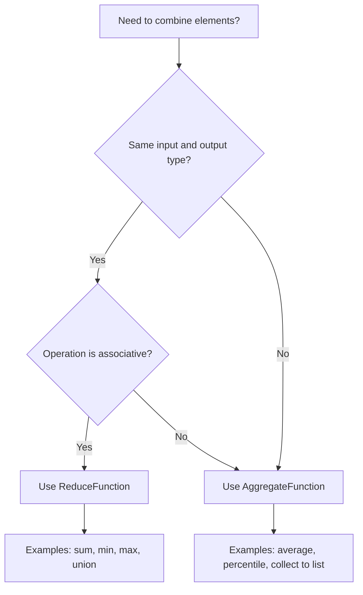
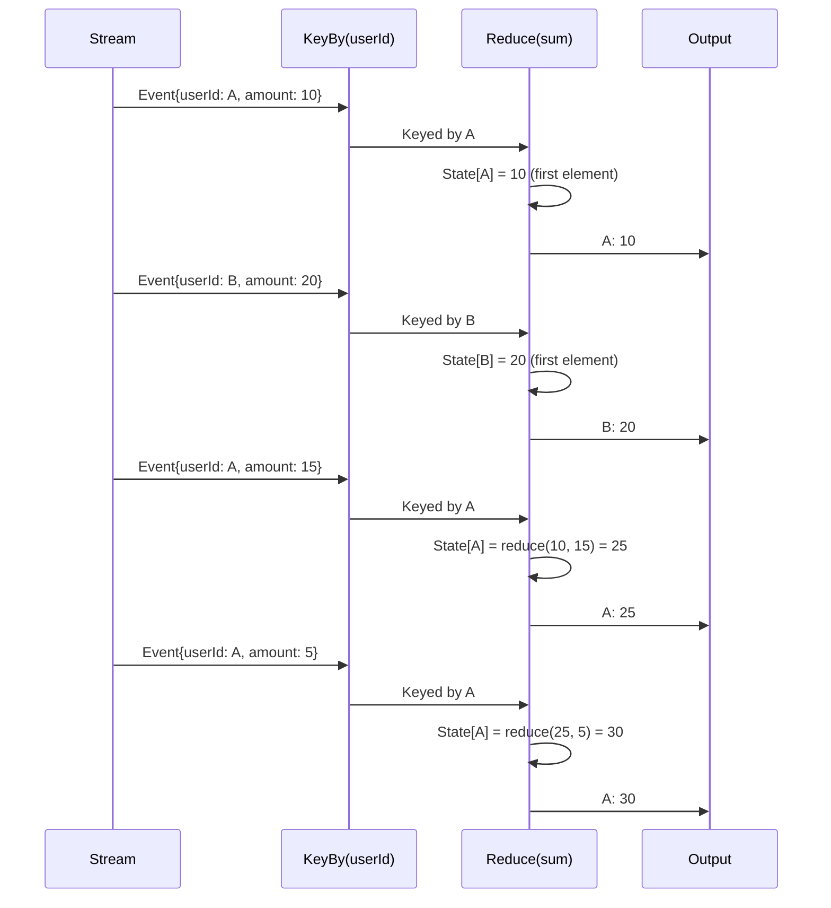
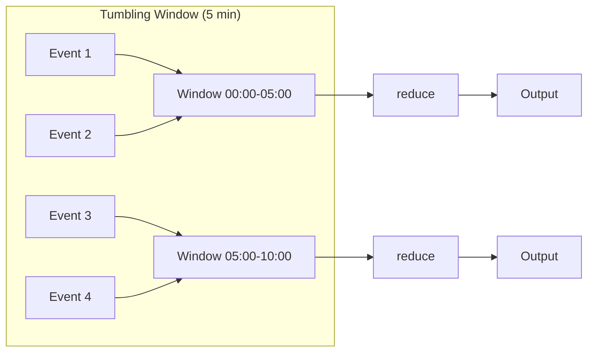
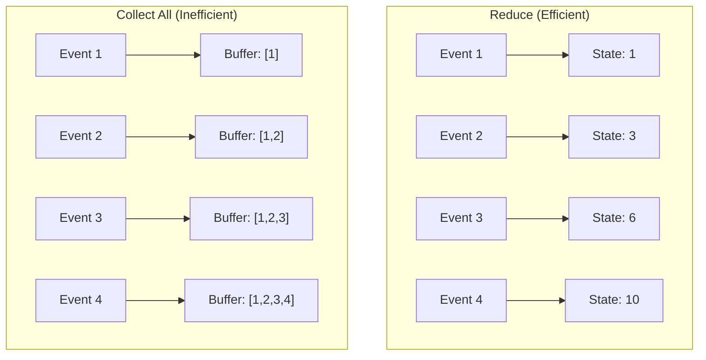

# How to Create Reduce Functions

Author: [nawazdhandala](https://github.com/nawazdhandala)

Tags: Stream Processing, Reduce, Functional Programming, Apache Flink

Description: Learn to create reduce functions in stream processing for incrementally combining elements with the same key.

---

> Reduce functions are the workhorses of stream processing. They let you compress unbounded data streams into meaningful aggregates by incrementally combining elements with the same key.

In stream processing systems like Apache Flink, Apache Kafka Streams, or Apache Spark Streaming, reduce functions play a critical role in transforming continuous data flows into actionable insights. Unlike batch processing where you have access to all data at once, stream processing requires you to think incrementally. Every new event must be combined with what you already know.

This guide walks you through the fundamentals of reduce functions, their mathematical requirements, practical implementation patterns, and how they compare to more general aggregate functions.

---

## Table of Contents

1. What is a Reduce Function?
2. Mathematical Requirements: Associativity and Commutativity
3. Reduce vs Aggregate Functions
4. Visual Model: How Reduce Works
5. Implementing Reduce Functions in Apache Flink
6. Common Reduce Patterns
7. Windowed Reduce Operations
8. Performance Considerations
9. Testing Reduce Functions
10. Anti-Patterns to Avoid
11. Summary

---

## 1. What is a Reduce Function?

A reduce function combines two elements of the same type to produce a single element of that same type. The key constraint is that the input and output types must be identical.

| Property | Description |
|----------|-------------|
| Input Type | Two elements of type T |
| Output Type | One element of type T |
| Signature | `reduce(T, T) -> T` |
| Invocation | Called incrementally as new elements arrive |
| State | Maintains a running aggregate per key |

The reduce operation is inherently incremental. When a new element arrives for a given key, the system retrieves the current accumulated value, applies the reduce function with the new element, and stores the result as the new accumulated value.

Simple example: summing integers

```java
// A reduce function that sums two integers
// This combines the accumulated sum with each new value
public class SumReduce implements ReduceFunction<Integer> {
    @Override
    public Integer reduce(Integer accumulated, Integer newValue) {
        // Simply add the two values together
        // accumulated: the running total so far
        // newValue: the incoming element to add
        return accumulated + newValue;
    }
}
```

---

## 2. Mathematical Requirements: Associativity and Commutativity

For a reduce function to work correctly in a distributed stream processing environment, it should satisfy specific mathematical properties.

### Associativity (Required)

Associativity means the grouping of operations does not affect the result:

```
(a + b) + c = a + (b + c)
```

This property is essential because stream processors may combine elements in different orders depending on parallelism and partitioning. Without associativity, results become non-deterministic.

```java
// Associative: Sum
// (1 + 2) + 3 = 1 + (2 + 3) = 6

// Associative: Max
// max(max(1, 3), 2) = max(1, max(3, 2)) = 3

// NOT Associative: Subtraction
// (10 - 5) - 2 = 3
// 10 - (5 - 2) = 7  <- Different result!
```

### Commutativity (Recommended)

Commutativity means the order of operands does not affect the result:

```
a + b = b + a
```

While not strictly required, commutativity makes your reduce function more robust to reordering that can occur in distributed systems.

```java
// Commutative: Sum
// 3 + 5 = 5 + 3 = 8

// Commutative: Max
// max(3, 5) = max(5, 3) = 5

// NOT Commutative: String concatenation
// "hello" + "world" != "world" + "hello"
```

### Decision Matrix

| Operation | Associative | Commutative | Safe for Reduce? |
|-----------|-------------|-------------|------------------|
| Sum | Yes | Yes | Yes |
| Product | Yes | Yes | Yes |
| Min/Max | Yes | Yes | Yes |
| Average | No | Yes | No (use aggregate) |
| Concatenation | Yes | No | Caution needed |
| Subtraction | No | No | No |
| Division | No | No | No |

---

## 3. Reduce vs Aggregate Functions

While reduce functions are powerful, they have a significant limitation: input and output types must be the same. Aggregate functions remove this constraint.

### Reduce Function

```java
// Reduce: Input and output types must match
// T x T -> T
public interface ReduceFunction<T> {
    T reduce(T value1, T value2);
}
```

### Aggregate Function

```java
// Aggregate: Separate types for input, accumulator, and output
// IN -> ACC -> OUT
public interface AggregateFunction<IN, ACC, OUT> {
    // Create initial accumulator
    ACC createAccumulator();

    // Add input element to accumulator
    ACC add(IN value, ACC accumulator);

    // Combine two accumulators (for parallel processing)
    ACC merge(ACC a, ACC b);

    // Extract final result from accumulator
    OUT getResult(ACC accumulator);
}
```

### When to Use Each



### Calculating Average: Why Reduce Fails

You cannot calculate an average with a simple reduce because averaging is not associative:

```java
// WRONG: This does not compute a correct average
public class BrokenAverageReduce implements ReduceFunction<Double> {
    @Override
    public Double reduce(Double v1, Double v2) {
        // This computes the average of two values, not a running average
        // avg(avg(1, 2), 3) = avg(1.5, 3) = 2.25
        // But actual average of [1, 2, 3] = 2.0
        return (v1 + v2) / 2;
    }
}

// CORRECT: Use aggregate function with sum and count
public class AverageAggregate implements AggregateFunction<Double, Tuple2<Double, Long>, Double> {

    @Override
    public Tuple2<Double, Long> createAccumulator() {
        // Initialize with sum = 0.0 and count = 0
        return Tuple2.of(0.0, 0L);
    }

    @Override
    public Tuple2<Double, Long> add(Double value, Tuple2<Double, Long> acc) {
        // Add value to sum and increment count
        return Tuple2.of(acc.f0 + value, acc.f1 + 1);
    }

    @Override
    public Tuple2<Double, Long> merge(Tuple2<Double, Long> a, Tuple2<Double, Long> b) {
        // Merge two accumulators by adding sums and counts
        return Tuple2.of(a.f0 + b.f0, a.f1 + b.f1);
    }

    @Override
    public Double getResult(Tuple2<Double, Long> acc) {
        // Compute final average from sum and count
        return acc.f1 == 0 ? 0.0 : acc.f0 / acc.f1;
    }
}
```

---

## 4. Visual Model: How Reduce Works

### Stream Processing with Reduce



### Reduce in Parallel Execution

When processing is distributed across multiple partitions, reduce combines partial results:

```
Partition 1: [1, 2, 3] -> reduce(reduce(1, 2), 3) = 6
Partition 2: [4, 5]    -> reduce(4, 5) = 9
                           |
                           v
Final Merge: reduce(6, 9) = 15
```

Because sum is associative and commutative, this works correctly regardless of partitioning.

---

## 5. Implementing Reduce Functions in Apache Flink

### Basic Reduce on Keyed Stream

```java
import org.apache.flink.api.common.functions.ReduceFunction;
import org.apache.flink.streaming.api.datastream.DataStream;
import org.apache.flink.streaming.api.environment.StreamExecutionEnvironment;

public class ReduceExample {

    public static void main(String[] args) throws Exception {
        // Set up the execution environment
        StreamExecutionEnvironment env = StreamExecutionEnvironment.getExecutionEnvironment();

        // Create a stream of transactions
        DataStream<Transaction> transactions = env.fromElements(
            new Transaction("user1", 100.0),
            new Transaction("user2", 50.0),
            new Transaction("user1", 75.0),
            new Transaction("user1", 25.0),
            new Transaction("user2", 100.0)
        );

        // Apply keyBy to group by user, then reduce to sum amounts
        DataStream<Transaction> totalPerUser = transactions
            .keyBy(Transaction::getUserId)  // Group by user ID
            .reduce(new TransactionSumReduce());  // Sum amounts per user

        // Print results: user1 -> 200.0, user2 -> 150.0
        totalPerUser.print();

        env.execute("Transaction Sum Example");
    }
}

// Transaction POJO representing a single transaction
class Transaction {
    private String userId;
    private double amount;

    public Transaction() {}

    public Transaction(String userId, double amount) {
        this.userId = userId;
        this.amount = amount;
    }

    // Getters and setters
    public String getUserId() { return userId; }
    public void setUserId(String userId) { this.userId = userId; }
    public double getAmount() { return amount; }
    public void setAmount(double amount) { this.amount = amount; }
}

// Reduce function that sums transaction amounts for the same user
class TransactionSumReduce implements ReduceFunction<Transaction> {
    @Override
    public Transaction reduce(Transaction accumulated, Transaction newTransaction) {
        // Create a new Transaction with the combined amount
        // We keep the userId from either (they are the same due to keyBy)
        return new Transaction(
            accumulated.getUserId(),
            accumulated.getAmount() + newTransaction.getAmount()
        );
    }
}
```

### Using Lambda Expressions

```java
// Concise lambda syntax for simple reduce operations
DataStream<Transaction> totalPerUser = transactions
    .keyBy(Transaction::getUserId)
    .reduce((acc, next) -> new Transaction(acc.getUserId(), acc.getAmount() + next.getAmount()));
```

### Reduce with Rich Function

When you need access to runtime context or state management:

```java
import org.apache.flink.api.common.functions.RichReduceFunction;
import org.apache.flink.configuration.Configuration;
import org.apache.flink.metrics.Counter;

public class MonitoredSumReduce extends RichReduceFunction<Transaction> {

    // Metric counter to track number of reduce operations
    private transient Counter reduceCounter;

    @Override
    public void open(Configuration parameters) {
        // Initialize metrics when the function starts
        this.reduceCounter = getRuntimeContext()
            .getMetricGroup()
            .counter("reduce-operations");
    }

    @Override
    public Transaction reduce(Transaction acc, Transaction next) {
        // Increment metric counter for observability
        reduceCounter.inc();

        // Perform the actual reduction
        return new Transaction(
            acc.getUserId(),
            acc.getAmount() + next.getAmount()
        );
    }
}
```

---

## 6. Common Reduce Patterns

### Pattern 1: Finding Maximum

```java
// Find the transaction with the highest amount per user
public class MaxTransactionReduce implements ReduceFunction<Transaction> {
    @Override
    public Transaction reduce(Transaction current, Transaction candidate) {
        // Return the transaction with the higher amount
        // Ties favor the current accumulated value
        return current.getAmount() >= candidate.getAmount() ? current : candidate;
    }
}

// Usage
DataStream<Transaction> maxPerUser = transactions
    .keyBy(Transaction::getUserId)
    .reduce(new MaxTransactionReduce());
```

### Pattern 2: Finding Minimum

```java
// Find the transaction with the lowest amount per user
public class MinTransactionReduce implements ReduceFunction<Transaction> {
    @Override
    public Transaction reduce(Transaction current, Transaction candidate) {
        // Return the transaction with the lower amount
        return current.getAmount() <= candidate.getAmount() ? current : candidate;
    }
}
```

### Pattern 3: Keeping Latest Value

```java
// Keep only the most recent transaction per user
// Assumes events arrive in timestamp order
public class LatestTransactionReduce implements ReduceFunction<TimestampedTransaction> {
    @Override
    public TimestampedTransaction reduce(TimestampedTransaction older, TimestampedTransaction newer) {
        // Always return the newer transaction
        // The second argument is the incoming element
        return newer;
    }
}
```

### Pattern 4: Merging Sets

```java
// Accumulate unique items into a set
public class UniqueCategoriesReduce implements ReduceFunction<UserCategories> {
    @Override
    public UserCategories reduce(UserCategories acc, UserCategories next) {
        // Merge the category sets from both records
        Set<String> merged = new HashSet<>(acc.getCategories());
        merged.addAll(next.getCategories());

        return new UserCategories(acc.getUserId(), merged);
    }
}

// Supporting class
class UserCategories {
    private String userId;
    private Set<String> categories;

    public UserCategories(String userId, Set<String> categories) {
        this.userId = userId;
        this.categories = categories;
    }

    // Getters
    public String getUserId() { return userId; }
    public Set<String> getCategories() { return categories; }
}
```

### Pattern 5: Combining Statistics

```java
// Maintain running statistics that can be merged
public class StatsReduce implements ReduceFunction<Stats> {
    @Override
    public Stats reduce(Stats a, Stats b) {
        // Combine statistics in a way that is both
        // associative and commutative
        return new Stats(
            a.getCount() + b.getCount(),        // Sum counts
            a.getSum() + b.getSum(),            // Sum totals
            Math.min(a.getMin(), b.getMin()),   // Minimum of mins
            Math.max(a.getMax(), b.getMax())    // Maximum of maxes
        );
    }
}

// Supporting class
class Stats {
    private long count;
    private double sum;
    private double min;
    private double max;

    public Stats(long count, double sum, double min, double max) {
        this.count = count;
        this.sum = sum;
        this.min = min;
        this.max = max;
    }

    // Factory method to create stats from a single value
    public static Stats fromValue(double value) {
        return new Stats(1, value, value, value);
    }

    // Getters
    public long getCount() { return count; }
    public double getSum() { return sum; }
    public double getMin() { return min; }
    public double getMax() { return max; }
    public double getAverage() { return count > 0 ? sum / count : 0; }
}
```

---

## 7. Windowed Reduce Operations

Windowed reduces limit the scope of aggregation to specific time or count boundaries.

### Tumbling Window Reduce

```java
import org.apache.flink.streaming.api.windowing.assigners.TumblingEventTimeWindows;
import org.apache.flink.streaming.api.windowing.time.Time;

// Sum transactions per user within 1-minute tumbling windows
DataStream<Transaction> windowedSums = transactions
    .keyBy(Transaction::getUserId)
    .window(TumblingEventTimeWindows.of(Time.minutes(1)))
    .reduce(new TransactionSumReduce());
```

### Sliding Window Reduce

```java
import org.apache.flink.streaming.api.windowing.assigners.SlidingEventTimeWindows;

// Sum transactions in 5-minute windows that slide every 1 minute
DataStream<Transaction> slidingSums = transactions
    .keyBy(Transaction::getUserId)
    .window(SlidingEventTimeWindows.of(Time.minutes(5), Time.minutes(1)))
    .reduce(new TransactionSumReduce());
```

### Session Window Reduce

```java
import org.apache.flink.streaming.api.windowing.assigners.EventTimeSessionWindows;

// Sum transactions within sessions (gap of 30 minutes triggers new session)
DataStream<Transaction> sessionSums = transactions
    .keyBy(Transaction::getUserId)
    .window(EventTimeSessionWindows.withGap(Time.minutes(30)))
    .reduce(new TransactionSumReduce());
```

### Window Flow Diagram



---

## 8. Performance Considerations

### Memory Efficiency

Reduce functions maintain only a single accumulated value per key, making them very memory efficient compared to operations that buffer all elements.

| Operation | Memory per Key | Use Case |
|-----------|----------------|----------|
| reduce() | O(1) | Sum, max, min |
| aggregate() | O(1) | Average, custom accumulators |
| process() | O(n) | Full access to all elements |

### Incremental Processing



### Best Practices for Performance

```java
// 1. Avoid creating new objects when possible
public class EfficientMaxReduce implements ReduceFunction<Measurement> {
    @Override
    public Measurement reduce(Measurement a, Measurement b) {
        // Return existing object instead of creating new one
        return a.getValue() >= b.getValue() ? a : b;
    }
}

// 2. Use primitive wrappers efficiently
public class EfficientSumReduce implements ReduceFunction<LongValue> {
    @Override
    public LongValue reduce(LongValue acc, LongValue next) {
        // Mutate in place rather than creating new objects
        // Note: Only safe because Flink manages state copies
        acc.setValue(acc.getValue() + next.getValue());
        return acc;
    }
}

// 3. Pre-aggregate before shuffle when possible
DataStream<Transaction> optimized = transactions
    // Pre-aggregate locally before keyBy (if using process function)
    .keyBy(Transaction::getUserId)
    .reduce(new TransactionSumReduce());
```

---

## 9. Testing Reduce Functions

### Unit Testing Reduce Functions

```java
import org.junit.jupiter.api.Test;
import static org.junit.jupiter.api.Assertions.*;

class TransactionSumReduceTest {

    private final TransactionSumReduce reducer = new TransactionSumReduce();

    @Test
    void shouldSumTwoTransactions() {
        // Arrange
        Transaction t1 = new Transaction("user1", 100.0);
        Transaction t2 = new Transaction("user1", 50.0);

        // Act
        Transaction result = reducer.reduce(t1, t2);

        // Assert
        assertEquals(150.0, result.getAmount(), 0.001);
        assertEquals("user1", result.getUserId());
    }

    @Test
    void shouldBeAssociative() {
        // Arrange
        Transaction t1 = new Transaction("user1", 10.0);
        Transaction t2 = new Transaction("user1", 20.0);
        Transaction t3 = new Transaction("user1", 30.0);

        // Act: (t1 + t2) + t3
        Transaction leftAssoc = reducer.reduce(reducer.reduce(t1, t2), t3);

        // Act: t1 + (t2 + t3)
        Transaction rightAssoc = reducer.reduce(t1, reducer.reduce(t2, t3));

        // Assert
        assertEquals(leftAssoc.getAmount(), rightAssoc.getAmount(), 0.001);
    }

    @Test
    void shouldBeCommutative() {
        // Arrange
        Transaction t1 = new Transaction("user1", 100.0);
        Transaction t2 = new Transaction("user1", 50.0);

        // Act
        Transaction result1 = reducer.reduce(t1, t2);
        Transaction result2 = reducer.reduce(t2, t1);

        // Assert
        assertEquals(result1.getAmount(), result2.getAmount(), 0.001);
    }

    @Test
    void shouldHandleZeroAmount() {
        // Arrange
        Transaction t1 = new Transaction("user1", 100.0);
        Transaction t2 = new Transaction("user1", 0.0);

        // Act
        Transaction result = reducer.reduce(t1, t2);

        // Assert: Zero is the identity element for addition
        assertEquals(100.0, result.getAmount(), 0.001);
    }
}
```

### Integration Testing with Flink Test Harness

```java
import org.apache.flink.streaming.api.operators.StreamReduce;
import org.apache.flink.streaming.util.KeyedOneInputStreamOperatorTestHarness;
import org.junit.jupiter.api.Test;

class ReduceIntegrationTest {

    @Test
    void shouldReduceKeyedStream() throws Exception {
        // Create test harness
        KeyedOneInputStreamOperatorTestHarness<String, Transaction, Transaction> harness =
            new KeyedOneInputStreamOperatorTestHarness<>(
                new StreamReduce<>(new TransactionSumReduce()),
                Transaction::getUserId,
                Types.STRING
            );

        harness.open();

        // Process elements
        harness.processElement(new Transaction("user1", 100.0), 1L);
        harness.processElement(new Transaction("user1", 50.0), 2L);
        harness.processElement(new Transaction("user2", 75.0), 3L);

        // Verify output
        List<Transaction> output = harness.extractOutputValues();

        // First element for user1
        assertEquals(100.0, output.get(0).getAmount());
        // After second element for user1
        assertEquals(150.0, output.get(1).getAmount());
        // First element for user2
        assertEquals(75.0, output.get(2).getAmount());

        harness.close();
    }
}
```

---

## 10. Anti-Patterns to Avoid

### Anti-Pattern 1: Non-Associative Operations

```java
// WRONG: Division is not associative
public class BrokenDivideReduce implements ReduceFunction<Double> {
    @Override
    public Double reduce(Double a, Double b) {
        // (10 / 2) / 5 = 1
        // 10 / (2 / 5) = 25
        // Results differ based on grouping!
        return a / b;
    }
}
```

### Anti-Pattern 2: State Mutation

```java
// WRONG: Mutating shared state outside the reduce function
public class StatefulBrokenReduce implements ReduceFunction<Integer> {
    private int externalCounter = 0;  // Shared mutable state is dangerous

    @Override
    public Integer reduce(Integer a, Integer b) {
        externalCounter++;  // This will behave unpredictably in parallel
        return a + b;
    }
}
```

### Anti-Pattern 3: Side Effects

```java
// WRONG: Performing I/O in reduce function
public class SideEffectReduce implements ReduceFunction<Order> {
    @Override
    public Order reduce(Order a, Order b) {
        // Side effects in reduce can cause duplicate writes
        // and inconsistent behavior during retries
        database.write(a);  // DO NOT DO THIS
        return new Order(a.getId(), a.getAmount() + b.getAmount());
    }
}

// CORRECT: Emit results and handle side effects in a sink
DataStream<Order> results = orders
    .keyBy(Order::getCustomerId)
    .reduce(new OrderSumReduce());

results.addSink(new DatabaseSink());  // Handle I/O in dedicated sink
```

### Anti-Pattern 4: Unbounded Growth

```java
// WRONG: Accumulating all elements in a list
public class UnboundedListReduce implements ReduceFunction<ListWrapper<Event>> {
    @Override
    public ListWrapper<Event> reduce(ListWrapper<Event> a, ListWrapper<Event> b) {
        // This will grow without bound and cause OOM
        List<Event> merged = new ArrayList<>(a.getItems());
        merged.addAll(b.getItems());
        return new ListWrapper<>(merged);
    }
}

// CORRECT: Use windowed operations or limit collection size
// Or use aggregate function with bounded accumulator
```

### Anti-Pattern 5: Null Handling Issues

```java
// WRONG: Not handling potential nulls
public class NullUnsafeReduce implements ReduceFunction<Measurement> {
    @Override
    public Measurement reduce(Measurement a, Measurement b) {
        // Will throw NPE if either is null
        return new Measurement(a.getValue() + b.getValue());
    }
}

// CORRECT: Validate inputs or filter nulls before reduce
DataStream<Measurement> safeStream = measurements
    .filter(m -> m != null && m.getValue() != null)
    .keyBy(Measurement::getSensorId)
    .reduce(new MeasurementSumReduce());
```

---

## 11. Summary

| Concept | Key Points |
|---------|------------|
| Reduce Function | Combines two elements of the same type into one |
| Associativity | Required for correct parallel execution |
| Commutativity | Recommended for robustness to reordering |
| Memory | O(1) per key since only one accumulated value is stored |
| Use Cases | Sum, min, max, union, keeping latest value |
| Limitations | Cannot change output type, use aggregate for complex cases |

### Decision Guide

```mermaid
flowchart TD
    A[Need to aggregate stream data?] --> B{Same input/output type?}
    B -->|Yes| C{Operation associative?}
    B -->|No| D[Use AggregateFunction]
    C -->|Yes| E{Need all elements in window?}
    C -->|No| D
    E -->|No| F[Use reduce]
    E -->|Yes| G[Use ProcessWindowFunction]

    F --> H[Efficient O(1) memory]
    D --> I[Flexible accumulator]
    G --> J[Full control, O(n) memory]
```

### Quick Reference

```java
// Sum
.reduce((a, b) -> a + b)

// Max
.reduce((a, b) -> a > b ? a : b)

// Min
.reduce((a, b) -> a < b ? a : b)

// Keep latest
.reduce((old, latest) -> latest)

// Merge sets
.reduce((a, b) -> { a.addAll(b); return a; })
```

Reduce functions are fundamental building blocks in stream processing. They provide efficient, incremental aggregation with predictable memory usage. Understanding their mathematical requirements ensures correct behavior in distributed, parallel environments. When reduce functions cannot express your aggregation logic, aggregate functions offer the flexibility of separate accumulator types.

---

*Want to monitor your stream processing pipelines? [OneUptime](https://oneuptime.com) provides comprehensive observability for Apache Flink, Kafka Streams, and other streaming systems. Track throughput, latency, and backpressure in real-time.*

---

### See Also

- [Apache Flink Documentation: Reduce](https://flink.apache.org/)
- [Stream Processing Fundamentals](/blog/post/stream-processing-fundamentals/)
- [Windowing in Stream Processing](/blog/post/windowing-stream-processing/)

