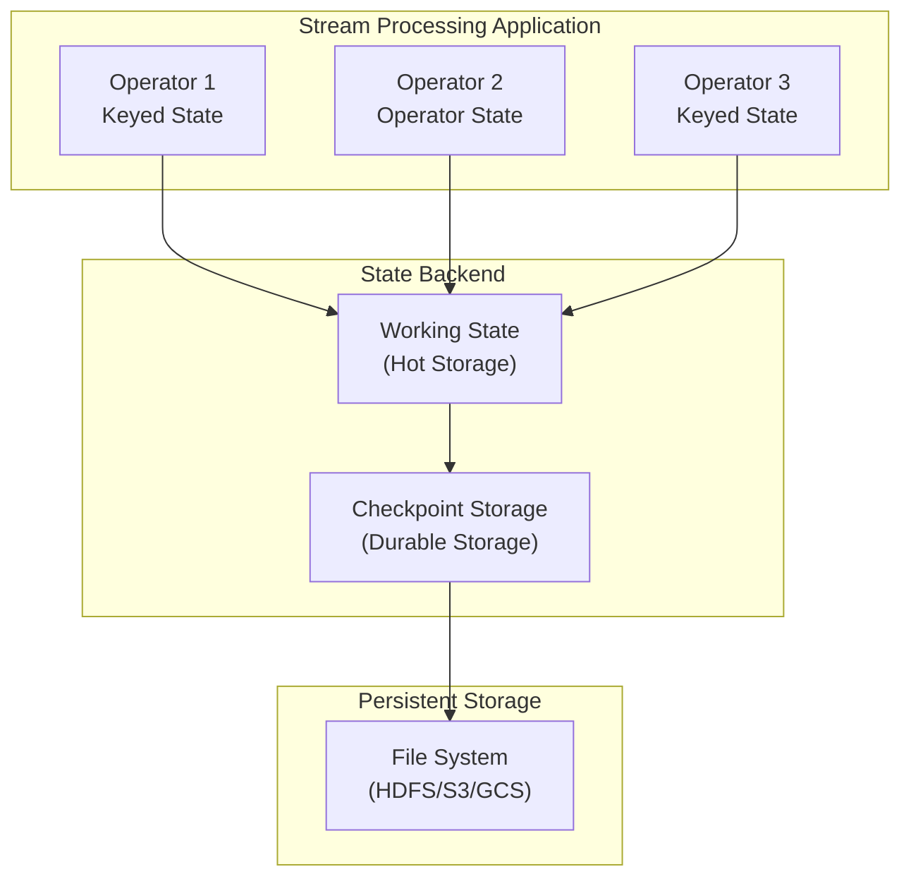
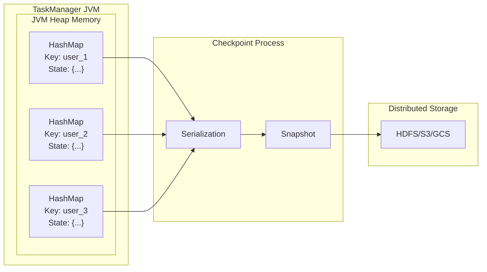
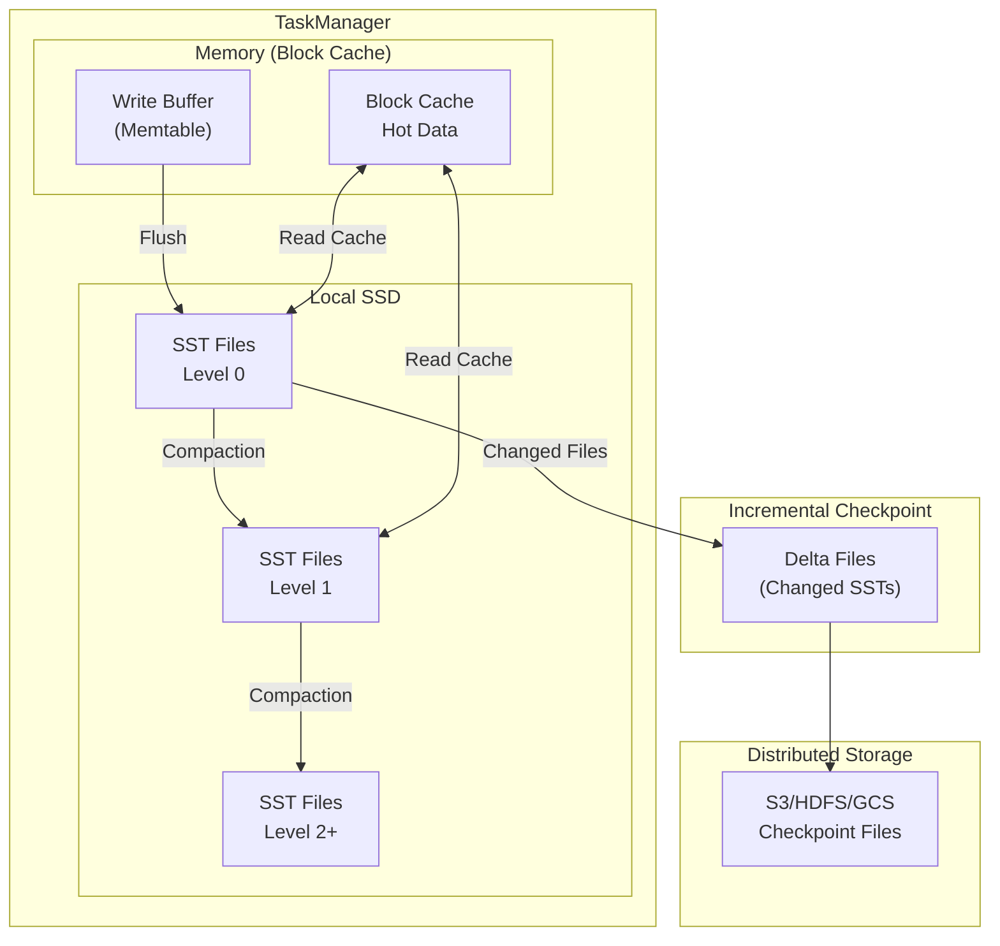
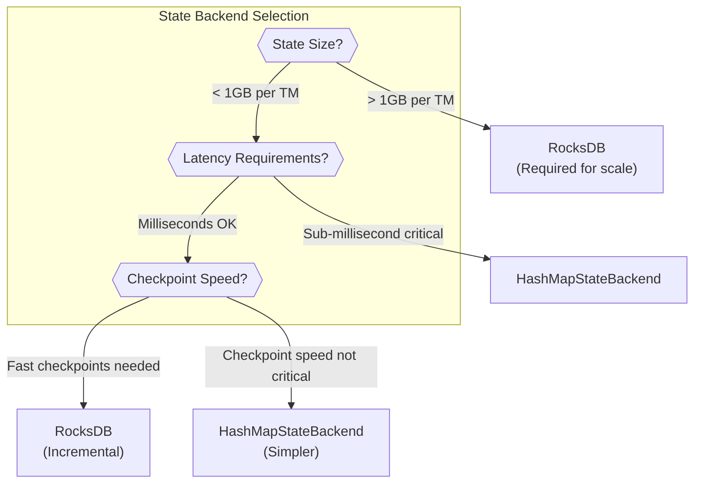
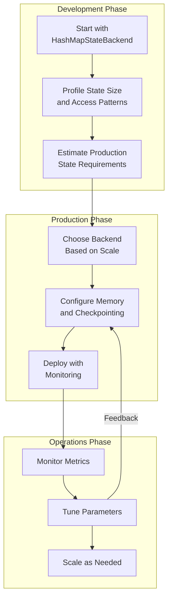

# How to Create State Backends

Author: [nawazdhandala](https://github.com/nawazdhandala)

Tags: Stream Processing, State Backend, Apache Flink, RocksDB

Description: Learn to create and configure state backends in stream processing for efficient state storage and recovery.

---

State management is the backbone of any reliable stream processing application. When processing unbounded data streams, your application needs to remember things: running counts, aggregations, windows of data, and session information. State backends are the storage layer that makes this possible. In this guide, we will explore how to create and configure state backends, compare different implementations, and optimize them for production workloads.

## Understanding State Backends

A state backend determines how state is stored, accessed, and checkpointed in your stream processing application. It handles two critical responsibilities:

1. **Working State Storage**: Where your application reads and writes state during normal processing
2. **Checkpoint Storage**: How state is persisted for fault tolerance and recovery



## Types of State in Stream Processing

Before diving into backends, let us understand the types of state your application might use:

### Keyed State

Keyed state is partitioned by key and is the most common type. Each key maintains its own state instance.

```java
// Example: Counting events per user using keyed state
// ValueState stores a single value per key (user in this case)
public class UserEventCounter extends KeyedProcessFunction<String, Event, EventCount> {

    // Declare state handle - this will be initialized per key
    private ValueState<Long> countState;

    @Override
    public void open(Configuration parameters) {
        // Create state descriptor with name and type information
        // The name "user-event-count" is used for checkpointing and state migration
        ValueStateDescriptor<Long> descriptor = new ValueStateDescriptor<>(
            "user-event-count",  // State name for identification
            Long.class           // Type class for serialization
        );

        // Get the actual state handle from the runtime context
        // This binds the state to the current keyed context
        countState = getRuntimeContext().getState(descriptor);
    }

    @Override
    public void processElement(Event event, Context ctx, Collector<EventCount> out)
            throws Exception {
        // Retrieve current count for this key (user)
        // Returns null if no state exists yet for this key
        Long currentCount = countState.value();

        // Initialize to 0 if this is the first event for this user
        if (currentCount == null) {
            currentCount = 0L;
        }

        // Increment and update the state
        // This write goes to the state backend
        Long newCount = currentCount + 1;
        countState.update(newCount);

        // Emit the updated count downstream
        out.collect(new EventCount(event.getUserId(), newCount));
    }
}
```

### Operator State

Operator state is not partitioned by key and is shared across all records processed by a single operator instance.

```java
// Example: Buffered sink with operator state for exactly-once delivery
// ListState stores a list of elements that survives failures
public class BufferedSink extends RichSinkFunction<Record>
        implements CheckpointedFunction {

    // Transient because we restore from checkpoint, not serialization
    private transient ListState<Record> bufferedRecords;

    // Local buffer for batching writes
    private List<Record> localBuffer = new ArrayList<>();

    // Configuration: flush every 100 records
    private static final int BATCH_SIZE = 100;

    @Override
    public void snapshotState(FunctionSnapshotContext context) throws Exception {
        // Called when a checkpoint is triggered
        // Clear the checkpoint state and add current buffer contents
        bufferedRecords.clear();

        // Persist all buffered records to the checkpoint
        // This ensures we can recover unflushed data after failure
        for (Record record : localBuffer) {
            bufferedRecords.add(record);
        }
    }

    @Override
    public void initializeState(FunctionInitializationContext context) throws Exception {
        // Create a list state descriptor for the buffer
        ListStateDescriptor<Record> descriptor = new ListStateDescriptor<>(
            "buffered-records",  // State name
            Record.class         // Element type
        );

        // Get or create the list state
        // On recovery, this will contain the checkpointed records
        bufferedRecords = context.getOperatorStateStore()
            .getListState(descriptor);

        // Restore buffered records on recovery
        // isRestored() returns true if recovering from a failure
        if (context.isRestored()) {
            for (Record record : bufferedRecords.get()) {
                localBuffer.add(record);
            }
        }
    }

    @Override
    public void invoke(Record record, Context context) throws Exception {
        // Add record to local buffer
        localBuffer.add(record);

        // Flush when batch size is reached
        if (localBuffer.size() >= BATCH_SIZE) {
            flushToExternalSystem();
            localBuffer.clear();
        }
    }

    private void flushToExternalSystem() {
        // Write buffered records to external storage
        // Implementation depends on target system
    }
}
```

## HashMapStateBackend: In-Memory State Storage

The HashMapStateBackend stores all state in memory using Java's HashMap data structures. It provides the fastest read and write performance but is limited by available JVM heap space.

### When to Use HashMapStateBackend

- Small to medium state sizes (fits comfortably in JVM heap)
- Low-latency requirements where every millisecond matters
- Development and testing environments
- State that consists of small objects with fast serialization

### Configuration

```java
// Configure HashMapStateBackend programmatically
// This backend keeps all state on the JVM heap
StreamExecutionEnvironment env = StreamExecutionEnvironment.getExecutionEnvironment();

// Create the state backend with checkpoint storage configuration
// HashMapStateBackend stores working state in memory
// Checkpoints are written to the specified filesystem path
HashMapStateBackend hashMapBackend = new HashMapStateBackend();

// Set the state backend on the environment
env.setStateBackend(hashMapBackend);

// Configure checkpoint storage separately (Flink 1.13+)
// This determines where checkpoint data is persisted
env.getCheckpointConfig().setCheckpointStorage(
    new FileSystemCheckpointStorage("hdfs://namenode:8020/flink/checkpoints")
);

// Enable checkpointing with a 60-second interval
// This triggers a checkpoint every minute
env.enableCheckpointing(60000);

// Set checkpoint mode to exactly-once for strong consistency
env.getCheckpointConfig().setCheckpointingMode(CheckpointingMode.EXACTLY_ONCE);
```

### YAML Configuration (flink-conf.yaml)

```yaml
# State backend configuration for HashMapStateBackend
# All working state is kept in the TaskManager JVM heap

# Specify the state backend type
state.backend: hashmap

# Checkpoint storage location
# Supports: hdfs://, s3://, gs://, file:// (for local testing)
state.checkpoints.dir: hdfs://namenode:8020/flink/checkpoints

# Savepoint storage location (for manual snapshots)
state.savepoints.dir: hdfs://namenode:8020/flink/savepoints

# Checkpointing configuration
execution.checkpointing.interval: 60s
execution.checkpointing.mode: EXACTLY_ONCE

# Minimum pause between checkpoints to prevent overlapping
execution.checkpointing.min-pause: 30s

# Maximum concurrent checkpoints (1 = no overlap)
execution.checkpointing.max-concurrent-checkpoints: 1

# Tolerate checkpoint failures before job fails
execution.checkpointing.tolerable-failed-checkpoints: 3
```



## RocksDBStateBackend: Scalable State Storage

RocksDBStateBackend uses RocksDB, an embedded key-value store, to manage state. It stores state on local disk with configurable caching, allowing it to handle state much larger than available memory.

### When to Use RocksDBStateBackend

- Large state sizes that exceed available memory
- Production workloads requiring scalability
- Applications with many keys or large values
- When incremental checkpointing is needed

### Basic Configuration

```java
// Configure RocksDBStateBackend for large-scale state management
// RocksDB stores state on local disk with memory caching
StreamExecutionEnvironment env = StreamExecutionEnvironment.getExecutionEnvironment();

// Create RocksDB state backend
// This stores working state in RocksDB (local disk + cache)
EmbeddedRocksDBStateBackend rocksDBBackend = new EmbeddedRocksDBStateBackend();

// Enable incremental checkpoints for efficiency
// Only changed state is written during checkpoint (much faster for large state)
rocksDBBackend.enableIncrementalCheckpointing(true);

// Set the state backend
env.setStateBackend(rocksDBBackend);

// Configure checkpoint storage
env.getCheckpointConfig().setCheckpointStorage(
    new FileSystemCheckpointStorage("s3://my-bucket/flink/checkpoints")
);

// Enable checkpointing
env.enableCheckpointing(60000);
```

### Advanced RocksDB Configuration

```java
// Advanced RocksDB configuration for production workloads
// Fine-tune RocksDB behavior for your specific use case
public class RocksDBConfigurationExample {

    public static void configureRocksDB(StreamExecutionEnvironment env) {
        // Create RocksDB backend with incremental checkpointing
        EmbeddedRocksDBStateBackend rocksDBBackend = new EmbeddedRocksDBStateBackend(true);

        // Configure RocksDB options using a custom factory
        // This gives fine-grained control over RocksDB behavior
        rocksDBBackend.setRocksDBOptions(new ConfigurableOptionsFactory());

        env.setStateBackend(rocksDBBackend);
    }
}

// Custom RocksDB options factory for fine-tuning performance
// Implement RocksDBOptionsFactory to customize RocksDB settings
public class ConfigurableOptionsFactory implements ConfigurableRocksDBOptionsFactory {

    // Memory allocated for write buffer (memtable)
    // Larger values improve write performance but use more memory
    private static final long WRITE_BUFFER_SIZE = 64 * 1024 * 1024; // 64 MB

    // Number of write buffers before flushing to disk
    // More buffers allow more concurrent writes
    private static final int MAX_WRITE_BUFFER_NUMBER = 4;

    // Size of block cache for reads
    // This cache stores frequently accessed data blocks
    private static final long BLOCK_CACHE_SIZE = 256 * 1024 * 1024; // 256 MB

    @Override
    public DBOptions createDBOptions(
            DBOptions currentOptions,
            Collection<AutoCloseable> handlesToClose) {

        return currentOptions
            // Number of background threads for compaction
            // More threads = faster compaction but more CPU usage
            .setIncreaseParallelism(4)

            // Maximum number of concurrent background jobs
            .setMaxBackgroundJobs(4)

            // Enable statistics for monitoring (slight overhead)
            .setStatistics(new Statistics())

            // Maximum total size of WAL files before forcing flush
            // Prevents excessive WAL accumulation
            .setMaxTotalWalSize(512 * 1024 * 1024); // 512 MB
    }

    @Override
    public ColumnFamilyOptions createColumnFamilyOptions(
            ColumnFamilyOptions currentOptions,
            Collection<AutoCloseable> handlesToClose) {

        // Create block-based table options for read optimization
        BlockBasedTableConfig tableConfig = new BlockBasedTableConfig()
            // Block cache size for storing frequently accessed blocks
            .setBlockCache(new LRUCache(BLOCK_CACHE_SIZE))

            // Block size for data compression and caching
            // Smaller blocks = more granular caching but more overhead
            .setBlockSize(16 * 1024) // 16 KB

            // Enable bloom filters for faster key lookups
            // Reduces disk reads for non-existent keys
            .setFilterPolicy(new BloomFilter(10, false))

            // Cache index and filter blocks for faster access
            .setCacheIndexAndFilterBlocks(true)

            // Pin L0 filter and index blocks in cache
            .setPinL0FilterAndIndexBlocksInCache(true);

        return currentOptions
            // Set the table format configuration
            .setTableFormatConfig(tableConfig)

            // Compression type for SST files
            // LZ4 offers good balance of speed and compression
            .setCompressionType(CompressionType.LZ4_COMPRESSION)

            // Write buffer (memtable) size
            .setWriteBufferSize(WRITE_BUFFER_SIZE)

            // Maximum number of write buffers
            .setMaxWriteBufferNumber(MAX_WRITE_BUFFER_NUMBER)

            // Minimum buffers to merge before flushing
            .setMinWriteBufferNumberToMerge(2)

            // Level0 file number trigger for compaction
            // When this many L0 files exist, compaction starts
            .setLevel0FileNumCompactionTrigger(4);
    }

    @Override
    public RocksDBOptionsFactory configure(ReadableConfig configuration) {
        // Called during initialization with Flink configuration
        // You can read custom config options here
        return this;
    }
}
```

### YAML Configuration for RocksDB

```yaml
# RocksDB State Backend Configuration
# Suitable for large-scale production deployments

# Use RocksDB for state storage
state.backend: rocksdb

# Enable incremental checkpoints
# Only writes changed state during checkpoint (much faster)
state.backend.incremental: true

# Local directories for RocksDB data files
# Use fast local SSDs for best performance
# Multiple directories enable parallel I/O
state.backend.rocksdb.localdir: /mnt/ssd1/rocksdb,/mnt/ssd2/rocksdb

# Checkpoint and savepoint storage
state.checkpoints.dir: s3://my-bucket/flink/checkpoints
state.savepoints.dir: s3://my-bucket/flink/savepoints

# RocksDB memory management
# Total managed memory for RocksDB per TaskManager
state.backend.rocksdb.memory.managed: true

# Write buffer ratio (portion of memory for write buffers)
state.backend.rocksdb.memory.write-buffer-ratio: 0.5

# High priority pool ratio (for index and filter blocks)
state.backend.rocksdb.memory.high-prio-pool-ratio: 0.1

# Timer service configuration
# Store timers in RocksDB (required for large timer counts)
state.backend.rocksdb.timer-service.factory: rocksdb

# Compaction settings
state.backend.rocksdb.compaction.level.use-dynamic-size: true
state.backend.rocksdb.compaction.style: level

# Thread configuration
state.backend.rocksdb.thread.num: 4
```



## Comparison: HashMapStateBackend vs RocksDBStateBackend

Understanding the tradeoffs helps you choose the right backend for your use case:

| Aspect | HashMapStateBackend | RocksDBStateBackend |
|--------|--------------------|--------------------|
| State Location | JVM Heap | Local Disk + Cache |
| Maximum State Size | Limited by heap | Limited by disk |
| Read Latency | Nanoseconds | Microseconds |
| Write Latency | Nanoseconds | Microseconds |
| Serialization | On checkpoint only | On every access |
| Incremental Checkpoints | No | Yes |
| Memory Overhead | Higher (Java objects) | Lower (serialized) |
| Best For | Small state, low latency | Large state, scalability |



## Building a Custom State Backend

For specialized requirements, you can create a custom state backend. Here is a reference implementation that demonstrates the key concepts:

```java
// Custom state backend implementation
// Extend AbstractStateBackend to create your own storage mechanism
public class CustomStateBackend extends AbstractStateBackend {

    private static final long serialVersionUID = 1L;

    // Configuration for your custom backend
    private final String storageUri;
    private final int cacheSize;

    public CustomStateBackend(String storageUri, int cacheSize) {
        this.storageUri = storageUri;
        this.cacheSize = cacheSize;
    }

    @Override
    public <K> AbstractKeyedStateBackend<K> createKeyedStateBackend(
            Environment env,
            JobID jobID,
            String operatorIdentifier,
            TypeSerializer<K> keySerializer,
            int numberOfKeyGroups,
            KeyGroupRange keyGroupRange,
            TaskKvStateRegistry kvStateRegistry,
            TtlTimeProvider ttlTimeProvider,
            MetricGroup metricGroup,
            Collection<KeyedStateHandle> stateHandles,
            CloseableRegistry cancelStreamRegistry) throws Exception {

        // Create and return your custom keyed state backend
        // This handles all keyed state operations
        return new CustomKeyedStateBackend<>(
            env,
            jobID,
            operatorIdentifier,
            keySerializer,
            numberOfKeyGroups,
            keyGroupRange,
            kvStateRegistry,
            ttlTimeProvider,
            metricGroup,
            stateHandles,
            cancelStreamRegistry,
            storageUri,
            cacheSize
        );
    }

    @Override
    public OperatorStateBackend createOperatorStateBackend(
            Environment env,
            String operatorIdentifier,
            Collection<OperatorStateHandle> stateHandles,
            CloseableRegistry cancelStreamRegistry) throws Exception {

        // For operator state, you can typically delegate to the default implementation
        // or create a custom one if needed
        return new DefaultOperatorStateBackendBuilder(
            env.getUserCodeClassLoader().asClassLoader(),
            env.getExecutionConfig(),
            false,
            stateHandles,
            cancelStreamRegistry
        ).build();
    }
}

// Custom keyed state backend implementation
// This is where the actual state storage logic lives
public class CustomKeyedStateBackend<K> extends AbstractKeyedStateBackend<K> {

    // Your custom storage mechanism (e.g., Redis, custom file format)
    private final ConcurrentHashMap<String, byte[]> stateStore;
    private final Cache<String, Object> stateCache;
    private final String storageUri;

    public CustomKeyedStateBackend(
            Environment env,
            JobID jobID,
            String operatorIdentifier,
            TypeSerializer<K> keySerializer,
            int numberOfKeyGroups,
            KeyGroupRange keyGroupRange,
            TaskKvStateRegistry kvStateRegistry,
            TtlTimeProvider ttlTimeProvider,
            MetricGroup metricGroup,
            Collection<KeyedStateHandle> stateHandles,
            CloseableRegistry cancelStreamRegistry,
            String storageUri,
            int cacheSize) {

        super(
            kvStateRegistry,
            keySerializer,
            env.getUserCodeClassLoader().asClassLoader(),
            env.getExecutionConfig(),
            ttlTimeProvider,
            new LocalRecoveryConfig(false, null),
            cancelStreamRegistry
        );

        this.storageUri = storageUri;
        this.stateStore = new ConcurrentHashMap<>();

        // Initialize cache for frequently accessed state
        this.stateCache = Caffeine.newBuilder()
            .maximumSize(cacheSize)
            .build();
    }

    @Override
    @SuppressWarnings("unchecked")
    public <N, S extends State, T> S getOrCreateKeyedState(
            TypeSerializer<N> namespaceSerializer,
            StateDescriptor<S, T> stateDescriptor) throws Exception {

        // Create appropriate state implementation based on descriptor type
        // Each state type (Value, List, Map, etc.) needs its own implementation

        String stateName = stateDescriptor.getName();

        if (stateDescriptor instanceof ValueStateDescriptor) {
            return (S) new CustomValueState<>(
                this,
                namespaceSerializer,
                (ValueStateDescriptor<T>) stateDescriptor,
                stateStore,
                stateCache
            );
        } else if (stateDescriptor instanceof ListStateDescriptor) {
            return (S) new CustomListState<>(
                this,
                namespaceSerializer,
                (ListStateDescriptor<T>) stateDescriptor,
                stateStore,
                stateCache
            );
        } else if (stateDescriptor instanceof MapStateDescriptor) {
            // Handle map state
            throw new UnsupportedOperationException(
                "MapState not yet implemented in custom backend"
            );
        }

        throw new UnsupportedOperationException(
            "State type not supported: " + stateDescriptor.getClass().getName()
        );
    }

    @Override
    public RunnableFuture<SnapshotResult<KeyedStateHandle>> snapshot(
            long checkpointId,
            long timestamp,
            CheckpointStreamFactory streamFactory,
            CheckpointOptions checkpointOptions) throws Exception {

        // Create a snapshot of all state for checkpointing
        // This should be done asynchronously if possible

        return new FutureTask<>(() -> {
            // Serialize all state to checkpoint storage
            try (CheckpointStreamFactory.CheckpointStateOutputStream stream =
                    streamFactory.createCheckpointStateOutputStream(
                        CheckpointedStateScope.EXCLUSIVE)) {

                DataOutputViewStreamWrapper output =
                    new DataOutputViewStreamWrapper(stream);

                // Write number of state entries
                output.writeInt(stateStore.size());

                // Write each state entry
                for (Map.Entry<String, byte[]> entry : stateStore.entrySet()) {
                    output.writeUTF(entry.getKey());
                    output.writeInt(entry.getValue().length);
                    output.write(entry.getValue());
                }

                // Finalize the stream and get the handle
                StreamStateHandle stateHandle = stream.closeAndGetHandle();

                if (stateHandle != null) {
                    // Return the state handle wrapped in appropriate result type
                    return SnapshotResult.of(
                        new CustomKeyedStateHandle(stateHandle, keyGroupRange)
                    );
                }
            }

            return SnapshotResult.empty();
        });
    }

    @Override
    public void dispose() {
        // Clean up resources when the backend is disposed
        stateStore.clear();
        stateCache.invalidateAll();
    }

    @Override
    public int numKeyValueStateEntries() {
        return stateStore.size();
    }
}

// Custom ValueState implementation
// Provides the actual get/set operations for value state
public class CustomValueState<K, N, T> implements InternalValueState<K, N, T> {

    private final CustomKeyedStateBackend<K> backend;
    private final TypeSerializer<N> namespaceSerializer;
    private final ValueStateDescriptor<T> stateDescriptor;
    private final ConcurrentHashMap<String, byte[]> stateStore;
    private final Cache<String, Object> stateCache;
    private final TypeSerializer<T> valueSerializer;

    // Current key and namespace for state access
    private K currentKey;
    private N currentNamespace;

    public CustomValueState(
            CustomKeyedStateBackend<K> backend,
            TypeSerializer<N> namespaceSerializer,
            ValueStateDescriptor<T> stateDescriptor,
            ConcurrentHashMap<String, byte[]> stateStore,
            Cache<String, Object> stateCache) {

        this.backend = backend;
        this.namespaceSerializer = namespaceSerializer;
        this.stateDescriptor = stateDescriptor;
        this.stateStore = stateStore;
        this.stateCache = stateCache;
        this.valueSerializer = stateDescriptor.getSerializer();
    }

    @Override
    @SuppressWarnings("unchecked")
    public T value() throws IOException {
        // Generate storage key from current key and namespace
        String storageKey = generateStorageKey();

        // Check cache first for performance
        Object cached = stateCache.getIfPresent(storageKey);
        if (cached != null) {
            return (T) cached;
        }

        // Read from persistent storage
        byte[] serialized = stateStore.get(storageKey);
        if (serialized == null) {
            // Return default value if no state exists
            return stateDescriptor.getDefaultValue();
        }

        // Deserialize the value
        T value = deserialize(serialized);

        // Update cache
        stateCache.put(storageKey, value);

        return value;
    }

    @Override
    public void update(T value) throws IOException {
        String storageKey = generateStorageKey();

        if (value == null) {
            // Null means clear the state
            clear();
            return;
        }

        // Serialize and store
        byte[] serialized = serialize(value);
        stateStore.put(storageKey, serialized);

        // Update cache
        stateCache.put(storageKey, value);
    }

    @Override
    public void clear() {
        String storageKey = generateStorageKey();
        stateStore.remove(storageKey);
        stateCache.invalidate(storageKey);
    }

    private String generateStorageKey() {
        // Create a unique key combining state name, key, and namespace
        return String.format("%s:%s:%s",
            stateDescriptor.getName(),
            currentKey.toString(),
            currentNamespace.toString()
        );
    }

    private byte[] serialize(T value) throws IOException {
        // Use Flink's serialization framework
        DataOutputSerializer output = new DataOutputSerializer(128);
        valueSerializer.serialize(value, output);
        return output.getCopyOfBuffer();
    }

    private T deserialize(byte[] data) throws IOException {
        DataInputDeserializer input = new DataInputDeserializer(data);
        return valueSerializer.deserialize(input);
    }

    @Override
    public void setCurrentNamespace(N namespace) {
        this.currentNamespace = namespace;
    }

    // Additional interface methods would be implemented here
}
```

## Performance Tuning Guidelines

### Memory Configuration

Proper memory configuration is crucial for state backend performance:

```yaml
# TaskManager memory configuration for state backends
# Flink 1.10+ uses a unified memory model

# Total process memory for the TaskManager
taskmanager.memory.process.size: 8g

# Framework heap (Flink internal)
taskmanager.memory.framework.heap.size: 128m

# Task heap for user code (used by HashMapStateBackend)
taskmanager.memory.task.heap.size: 2g

# Managed memory (used by RocksDB)
# RocksDB uses this for block cache and write buffers
taskmanager.memory.managed.size: 4g

# Or specify as a fraction of total memory
# taskmanager.memory.managed.fraction: 0.4

# Network memory for shuffle operations
taskmanager.memory.network.min: 256m
taskmanager.memory.network.max: 1g

# JVM metaspace for class metadata
taskmanager.memory.jvm-metaspace.size: 256m

# JVM overhead (native memory, thread stacks, etc.)
taskmanager.memory.jvm-overhead.min: 256m
taskmanager.memory.jvm-overhead.max: 1g
```

### Checkpoint Tuning

Optimize checkpointing for minimal impact on processing:

```java
// Comprehensive checkpoint configuration
// Balance between recovery time and processing overhead
StreamExecutionEnvironment env = StreamExecutionEnvironment.getExecutionEnvironment();

// Enable checkpointing with appropriate interval
// Shorter intervals = faster recovery but more overhead
env.enableCheckpointing(60000); // 60 seconds

CheckpointConfig config = env.getCheckpointConfig();

// Exactly-once for strong consistency guarantees
// Use AT_LEAST_ONCE if duplicates are acceptable for lower latency
config.setCheckpointingMode(CheckpointingMode.EXACTLY_ONCE);

// Minimum time between checkpoint completions
// Prevents checkpoint pileup under high load
config.setMinPauseBetweenCheckpoints(30000); // 30 seconds

// Maximum time for checkpoint to complete
// Fails the checkpoint (not the job) if exceeded
config.setCheckpointTimeout(600000); // 10 minutes

// Number of concurrent checkpoints
// Set to 1 to avoid overlapping checkpoints
config.setMaxConcurrentCheckpoints(1);

// Allow checkpoints to complete even under backpressure
// Unaligned checkpoints reduce checkpoint duration
config.enableUnalignedCheckpoints();

// Tolerate checkpoint failures before job fails
// Useful for transient storage issues
config.setTolerableCheckpointFailureNumber(3);

// Keep checkpoints on job cancellation for recovery
config.setExternalizedCheckpointCleanup(
    CheckpointConfig.ExternalizedCheckpointCleanup.RETAIN_ON_CANCELLATION
);

// Force checkpointing in iterative jobs
// Required for jobs with feedback loops
config.setForceCheckpointing(true);
```

### State TTL Configuration

Configure state time-to-live to prevent unbounded state growth:

```java
// State TTL configuration for automatic state cleanup
// Prevents memory issues from accumulating stale state
public class StateTTLExample {

    public static void configureStateTTL() {
        // Configure TTL with various options
        StateTtlConfig ttlConfig = StateTtlConfig
            // State expires 1 hour after last update
            .newBuilder(Time.hours(1))

            // When to update the timestamp
            // OnCreateAndWrite: Update on creation and every write
            // OnReadAndWrite: Also update on reads (keeps active state longer)
            .setUpdateType(StateTtlConfig.UpdateType.OnCreateAndWrite)

            // Visibility of expired state
            // NeverReturnExpired: Never return expired values
            // ReturnExpiredIfNotCleanedUp: May return if not yet cleaned
            .setStateVisibility(
                StateTtlConfig.StateVisibility.NeverReturnExpired
            )

            // Cleanup strategy
            .cleanupIncrementally(
                100,    // Number of entries to check per access
                true    // Run cleanup on every state access
            )

            // Alternative: Full snapshot cleanup (simpler but less granular)
            // .cleanupFullSnapshot()

            // For RocksDB: Use compaction filter for efficient cleanup
            .cleanupInRocksdbCompactFilter(1000) // Check every 1000 entries

            .build();

        // Apply TTL to state descriptor
        ValueStateDescriptor<UserSession> sessionDescriptor =
            new ValueStateDescriptor<>("user-session", UserSession.class);
        sessionDescriptor.enableTimeToLive(ttlConfig);
    }
}
```

## Monitoring State Backend Performance

Implement comprehensive monitoring for your state backends:

```java
// Custom metrics for state backend monitoring
// Track state size, access patterns, and checkpoint performance
public class StateBackendMetrics extends RichMapFunction<Event, Result> {

    // Metric counters and gauges
    private transient Counter stateReads;
    private transient Counter stateWrites;
    private transient Histogram stateAccessLatency;
    private transient Gauge<Long> stateSize;

    // State being monitored
    private ValueState<AggregatedData> aggregatedState;
    private long currentStateSize = 0;

    @Override
    public void open(Configuration parameters) {
        // Initialize state
        ValueStateDescriptor<AggregatedData> descriptor =
            new ValueStateDescriptor<>("aggregated-data", AggregatedData.class);
        aggregatedState = getRuntimeContext().getState(descriptor);

        // Register metrics with Flink's metric system
        MetricGroup metricGroup = getRuntimeContext().getMetricGroup()
            .addGroup("state_backend");

        // Counter for read operations
        stateReads = metricGroup.counter("state_reads");

        // Counter for write operations
        stateWrites = metricGroup.counter("state_writes");

        // Histogram for access latency distribution
        stateAccessLatency = metricGroup.histogram(
            "state_access_latency_ms",
            new DescriptiveStatisticsHistogram(1000)
        );

        // Gauge for current state size
        stateSize = metricGroup.gauge("state_size_bytes", () -> currentStateSize);
    }

    @Override
    public Result map(Event event) throws Exception {
        // Measure state read latency
        long startTime = System.nanoTime();
        AggregatedData currentData = aggregatedState.value();
        long readLatency = (System.nanoTime() - startTime) / 1_000_000; // Convert to ms

        stateReads.inc();
        stateAccessLatency.update(readLatency);

        // Process and update state
        AggregatedData newData = processEvent(currentData, event);

        // Measure state write latency
        startTime = System.nanoTime();
        aggregatedState.update(newData);
        long writeLatency = (System.nanoTime() - startTime) / 1_000_000;

        stateWrites.inc();
        stateAccessLatency.update(writeLatency);

        // Update size estimate (simplified)
        currentStateSize = estimateStateSize(newData);

        return new Result(event.getKey(), newData);
    }

    private AggregatedData processEvent(AggregatedData current, Event event) {
        // Aggregation logic
        if (current == null) {
            return new AggregatedData(event);
        }
        return current.merge(event);
    }

    private long estimateStateSize(AggregatedData data) {
        // Estimate serialized size of state
        // In production, use more accurate measurement
        return data.getEstimatedSizeBytes();
    }
}
```

## Best Practices Summary

Follow these guidelines for optimal state backend configuration:

### Choose the Right Backend

1. **Start with HashMapStateBackend** for development and small state
2. **Use RocksDBStateBackend** for production and large state
3. **Enable incremental checkpoints** with RocksDB for faster checkpoints
4. **Consider custom backends** only for specialized requirements

### Optimize Memory Usage

1. **Size JVM heap appropriately** for HashMapStateBackend
2. **Configure managed memory** for RocksDB block cache and write buffers
3. **Use state TTL** to prevent unbounded state growth
4. **Monitor state size** to catch growth issues early

### Tune Checkpointing

1. **Balance checkpoint interval** between recovery time and overhead
2. **Use unaligned checkpoints** if experiencing backpressure
3. **Configure checkpoint timeout** appropriately for your state size
4. **Enable externalized checkpoints** for operational flexibility

### Monitor and Iterate

1. **Track checkpoint duration** and state size metrics
2. **Monitor RocksDB compaction** for performance issues
3. **Test recovery scenarios** regularly
4. **Profile state access patterns** to identify bottlenecks



## Conclusion

State backends are fundamental to building reliable stream processing applications. By understanding the tradeoffs between HashMapStateBackend and RocksDBStateBackend, properly configuring memory and checkpointing, and implementing comprehensive monitoring, you can build systems that handle massive state while maintaining low latency and strong consistency guarantees.

The key is to start simple, measure thoroughly, and iterate based on real production data. State management requirements evolve as your application scales, so design for flexibility and make it easy to tune parameters without code changes.

**Related Reading:**

- [Apache Flink State Backends Documentation](https://nightlies.apache.org/flink/flink-docs-stable/docs/ops/state/state_backends/)
- [RocksDB Tuning Guide](https://github.com/facebook/rocksdb/wiki/RocksDB-Tuning-Guide)
- [Stream Processing with Apache Flink](https://www.oreilly.com/library/view/stream-processing-with/9781491974285/)
