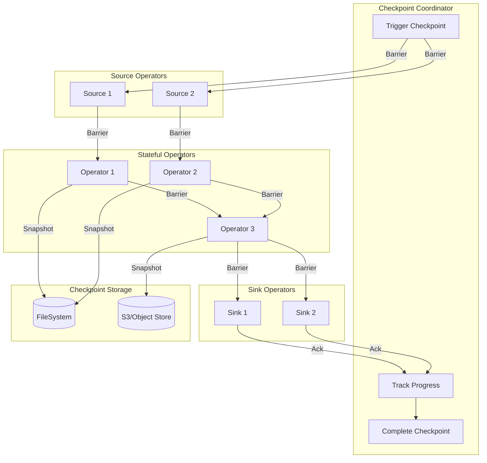
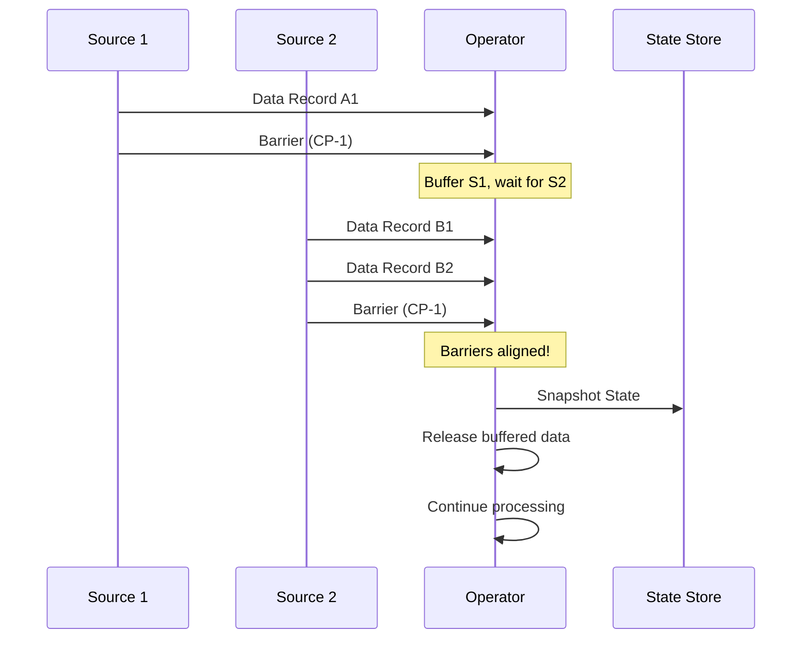
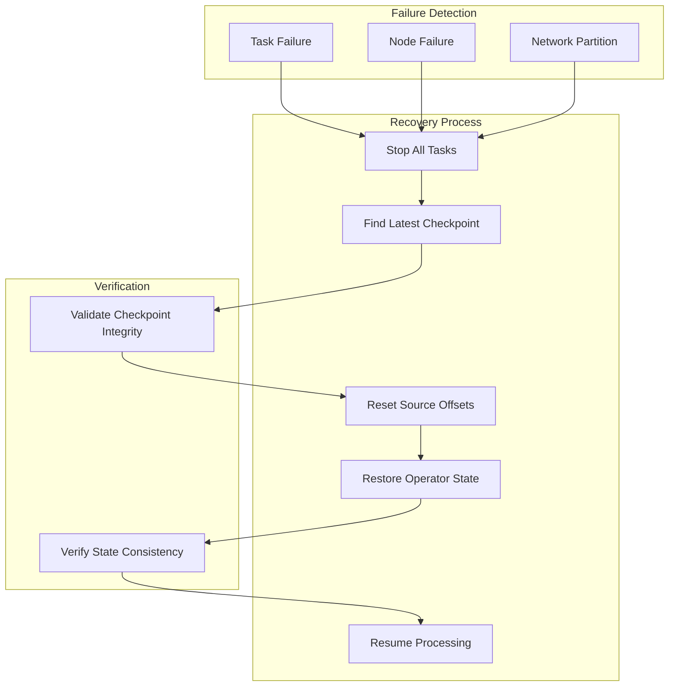
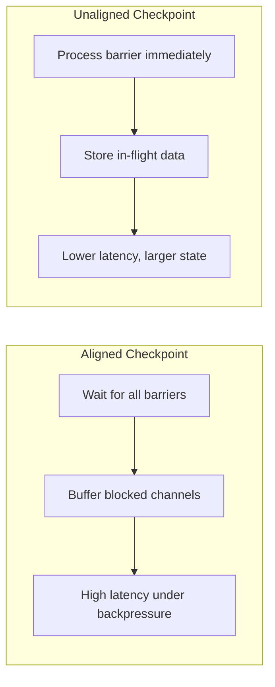

# How to Build State Checkpointing

Author: [nawazdhandala](https://github.com/nawazdhandala)

Tags: Stream Processing, Checkpointing, Fault Tolerance, Apache Flink

Description: Learn to build state checkpointing in stream processing for fault tolerance and exactly-once processing guarantees.

---

State checkpointing is a fundamental mechanism in stream processing systems that enables fault tolerance and exactly-once processing semantics. This guide walks through the concepts, architecture, and implementation details of building robust state checkpointing for your stream processing applications.

## What is State Checkpointing?

State checkpointing is the process of periodically capturing a consistent snapshot of the entire distributed state of a stream processing application. When a failure occurs, the system can restore from the latest checkpoint and resume processing without data loss or duplication.

### Why Checkpointing Matters

Stream processing applications maintain state across events. Without checkpointing:

- **Data loss**: Failures would lose all accumulated state
- **Inconsistent results**: Reprocessing without proper state recovery leads to incorrect aggregations
- **No exactly-once guarantees**: Duplicate processing becomes unavoidable

## Checkpoint Architecture Overview



## Core Checkpointing Components

### 1. Checkpoint Coordinator

The coordinator orchestrates the entire checkpointing process. Here is a basic implementation:

```java
/**
 * Checkpoint Coordinator
 *
 * Responsible for triggering checkpoints, tracking progress,
 * and managing checkpoint lifecycle across all operators.
 */
public class CheckpointCoordinator {

    // Configuration for checkpoint intervals and timeouts
    private final long checkpointInterval;
    private final long checkpointTimeout;

    // Track pending checkpoints and their state
    private final Map<Long, PendingCheckpoint> pendingCheckpoints;

    // Registry of all operators that need to participate
    private final List<OperatorState> registeredOperators;

    // Storage backend for persisting checkpoint data
    private final CheckpointStorage storage;

    // Monotonically increasing checkpoint ID
    private AtomicLong checkpointIdCounter;

    public CheckpointCoordinator(
            long checkpointInterval,
            long checkpointTimeout,
            CheckpointStorage storage) {
        this.checkpointInterval = checkpointInterval;
        this.checkpointTimeout = checkpointTimeout;
        this.storage = storage;
        this.pendingCheckpoints = new ConcurrentHashMap<>();
        this.registeredOperators = new CopyOnWriteArrayList<>();
        this.checkpointIdCounter = new AtomicLong(0);
    }

    /**
     * Triggers a new checkpoint across all registered operators.
     *
     * This method:
     * 1. Generates a unique checkpoint ID
     * 2. Creates a pending checkpoint record
     * 3. Sends checkpoint barriers to all source operators
     */
    public CompletableFuture<CompletedCheckpoint> triggerCheckpoint() {
        long checkpointId = checkpointIdCounter.incrementAndGet();
        long timestamp = System.currentTimeMillis();

        // Create pending checkpoint to track progress
        PendingCheckpoint pending = new PendingCheckpoint(
            checkpointId,
            timestamp,
            registeredOperators.size()
        );

        pendingCheckpoints.put(checkpointId, pending);

        // Inject barriers into all source operators
        for (OperatorState operator : registeredOperators) {
            if (operator.isSource()) {
                operator.triggerCheckpoint(checkpointId, timestamp);
            }
        }

        // Schedule timeout handler
        scheduleCheckpointTimeout(checkpointId);

        return pending.getCompletionFuture();
    }

    /**
     * Called when an operator completes its checkpoint.
     * When all operators have acknowledged, the checkpoint is complete.
     */
    public void acknowledgeCheckpoint(
            long checkpointId,
            String operatorId,
            OperatorStateHandle stateHandle) {

        PendingCheckpoint pending = pendingCheckpoints.get(checkpointId);

        if (pending == null) {
            // Checkpoint was already completed or aborted
            return;
        }

        // Store the operator's state handle
        pending.acknowledgeOperator(operatorId, stateHandle);

        // Check if all operators have acknowledged
        if (pending.isFullyAcknowledged()) {
            completeCheckpoint(pending);
        }
    }

    /**
     * Finalizes a checkpoint once all operators have acknowledged.
     */
    private void completeCheckpoint(PendingCheckpoint pending) {
        long checkpointId = pending.getCheckpointId();

        // Persist checkpoint metadata
        CheckpointMetadata metadata = new CheckpointMetadata(
            checkpointId,
            pending.getTimestamp(),
            pending.getOperatorStates()
        );

        storage.persistMetadata(metadata);

        // Remove from pending and notify completion
        pendingCheckpoints.remove(checkpointId);
        pending.complete(new CompletedCheckpoint(metadata));

        // Clean up old checkpoints based on retention policy
        cleanupOldCheckpoints();
    }
}
```

### 2. Checkpoint Barriers

Barriers are special markers injected into the data stream that separate records belonging to different checkpoints:

```java
/**
 * Checkpoint Barrier
 *
 * A marker that flows through the stream to signal checkpoint boundaries.
 * Barriers ensure consistent snapshots without stopping data processing.
 */
public class CheckpointBarrier implements Serializable {

    // Unique identifier for this checkpoint
    private final long checkpointId;

    // Timestamp when checkpoint was triggered
    private final long timestamp;

    // Options for this checkpoint (alignment, timeout, etc.)
    private final CheckpointOptions options;

    public CheckpointBarrier(
            long checkpointId,
            long timestamp,
            CheckpointOptions options) {
        this.checkpointId = checkpointId;
        this.timestamp = timestamp;
        this.options = options;
    }

    public long getCheckpointId() {
        return checkpointId;
    }

    public long getTimestamp() {
        return timestamp;
    }

    public CheckpointOptions getOptions() {
        return options;
    }

    public boolean requiresAlignment() {
        return options.isAligned();
    }
}
```

### 3. Barrier Alignment

For exactly-once semantics, operators with multiple inputs must align barriers:



```java
/**
 * Barrier Aligner
 *
 * Handles barrier alignment for operators with multiple input channels.
 * Ensures exactly-once semantics by buffering data until all barriers arrive.
 */
public class BarrierAligner {

    // Number of input channels to this operator
    private final int numInputChannels;

    // Track which channels have received barriers for current checkpoint
    private final Set<Integer> blockedChannels;

    // Buffer for records arriving on blocked channels
    private final Map<Integer, Queue<Object>> bufferedRecords;

    // Current checkpoint being aligned
    private long currentCheckpointId;

    // Callback for when alignment completes
    private final Consumer<Long> onAlignmentComplete;

    public BarrierAligner(
            int numInputChannels,
            Consumer<Long> onAlignmentComplete) {
        this.numInputChannels = numInputChannels;
        this.onAlignmentComplete = onAlignmentComplete;
        this.blockedChannels = new HashSet<>();
        this.bufferedRecords = new HashMap<>();
        this.currentCheckpointId = -1;
    }

    /**
     * Process an incoming barrier from a specific channel.
     *
     * @param channelIndex The input channel the barrier arrived on
     * @param barrier The checkpoint barrier
     * @return true if alignment is complete, false otherwise
     */
    public boolean processBarrier(int channelIndex, CheckpointBarrier barrier) {
        long barrierId = barrier.getCheckpointId();

        // Handle barrier for new checkpoint
        if (currentCheckpointId < barrierId) {
            // Start new alignment
            currentCheckpointId = barrierId;
            blockedChannels.clear();
            bufferedRecords.clear();
        }

        // Mark this channel as blocked
        blockedChannels.add(channelIndex);
        bufferedRecords.putIfAbsent(channelIndex, new LinkedList<>());

        // Check if all channels have received the barrier
        if (blockedChannels.size() == numInputChannels) {
            // Alignment complete, trigger checkpoint
            onAlignmentComplete.accept(currentCheckpointId);
            return true;
        }

        return false;
    }

    /**
     * Buffer a record that arrived on a blocked channel.
     * These records belong to the next checkpoint epoch.
     */
    public void bufferRecord(int channelIndex, Object record) {
        if (blockedChannels.contains(channelIndex)) {
            bufferedRecords.get(channelIndex).add(record);
        }
    }

    /**
     * Release all buffered records after checkpoint completes.
     * Records are released in channel order to maintain consistency.
     */
    public List<Object> releaseBufferedRecords() {
        List<Object> released = new ArrayList<>();

        for (int i = 0; i < numInputChannels; i++) {
            Queue<Object> channelBuffer = bufferedRecords.get(i);
            if (channelBuffer != null) {
                released.addAll(channelBuffer);
            }
        }

        // Reset alignment state
        blockedChannels.clear();
        bufferedRecords.clear();
        currentCheckpointId = -1;

        return released;
    }
}
```

## Checkpoint Storage Backends

### File System Storage

```java
/**
 * FileSystem Checkpoint Storage
 *
 * Stores checkpoint data on a distributed file system like HDFS or S3.
 * Suitable for large state sizes and production deployments.
 */
public class FileSystemCheckpointStorage implements CheckpointStorage {

    // Base path for all checkpoint data
    private final Path checkpointBasePath;

    // File system implementation (HDFS, S3, local, etc.)
    private final FileSystem fileSystem;

    // Write buffer size for optimal throughput
    private final int writeBufferSize;

    public FileSystemCheckpointStorage(
            String basePath,
            FileSystem fileSystem,
            int writeBufferSize) {
        this.checkpointBasePath = new Path(basePath);
        this.fileSystem = fileSystem;
        this.writeBufferSize = writeBufferSize;
    }

    /**
     * Create a checkpoint output stream for an operator.
     *
     * @param checkpointId The checkpoint being created
     * @param operatorId The operator writing state
     * @return An output stream for writing state data
     */
    @Override
    public CheckpointOutputStream createCheckpointOutputStream(
            long checkpointId,
            String operatorId) throws IOException {

        // Build path: /base/checkpoint-{id}/operator-{operatorId}/state
        Path operatorPath = new Path(
            checkpointBasePath,
            String.format("checkpoint-%d/operator-%s/state",
                checkpointId, operatorId)
        );

        // Ensure parent directories exist
        fileSystem.mkdirs(operatorPath.getParent());

        // Create output stream with buffer
        FSDataOutputStream outputStream = fileSystem.create(
            operatorPath,
            true,  // overwrite
            writeBufferSize
        );

        return new FileSystemCheckpointOutputStream(
            outputStream,
            operatorPath
        );
    }

    /**
     * Persist checkpoint metadata after all operators complete.
     */
    @Override
    public void persistMetadata(CheckpointMetadata metadata) throws IOException {
        Path metadataPath = new Path(
            checkpointBasePath,
            String.format("checkpoint-%d/_metadata", metadata.getCheckpointId())
        );

        try (FSDataOutputStream out = fileSystem.create(metadataPath)) {
            // Write metadata as serialized object
            ObjectOutputStream oos = new ObjectOutputStream(out);
            oos.writeObject(metadata);
            oos.flush();
        }
    }

    /**
     * Load checkpoint metadata for recovery.
     */
    @Override
    public CheckpointMetadata loadMetadata(long checkpointId) throws IOException {
        Path metadataPath = new Path(
            checkpointBasePath,
            String.format("checkpoint-%d/_metadata", checkpointId)
        );

        try (FSDataInputStream in = fileSystem.open(metadataPath)) {
            ObjectInputStream ois = new ObjectInputStream(in);
            return (CheckpointMetadata) ois.readObject();
        } catch (ClassNotFoundException e) {
            throw new IOException("Failed to deserialize metadata", e);
        }
    }

    /**
     * Clean up old checkpoint data.
     */
    @Override
    public void deleteCheckpoint(long checkpointId) throws IOException {
        Path checkpointPath = new Path(
            checkpointBasePath,
            String.format("checkpoint-%d", checkpointId)
        );

        fileSystem.delete(checkpointPath, true);  // recursive delete
    }
}
```

### RocksDB State Backend

For large state, RocksDB provides efficient incremental checkpointing:

```java
/**
 * RocksDB State Backend
 *
 * Uses RocksDB for local state storage with support for
 * incremental checkpointing and efficient state access.
 */
public class RocksDBStateBackend implements StateBackend {

    // RocksDB database instance
    private RocksDB db;

    // Column families for different state types
    private final Map<String, ColumnFamilyHandle> columnFamilies;

    // Path for local RocksDB data
    private final String localPath;

    // Remote storage for checkpoint uploads
    private final CheckpointStorage remoteStorage;

    // Track SST files for incremental checkpoints
    private final Set<String> previousCheckpointFiles;

    public RocksDBStateBackend(
            String localPath,
            CheckpointStorage remoteStorage) {
        this.localPath = localPath;
        this.remoteStorage = remoteStorage;
        this.columnFamilies = new HashMap<>();
        this.previousCheckpointFiles = new HashSet<>();
    }

    /**
     * Initialize RocksDB with optimized settings.
     */
    public void initialize() throws RocksDBException {
        // Configure RocksDB options for streaming workloads
        DBOptions dbOptions = new DBOptions()
            .setCreateIfMissing(true)
            .setCreateMissingColumnFamilies(true)
            .setMaxBackgroundJobs(4)
            .setMaxOpenFiles(-1);  // Keep all files open

        // Column family options with bloom filters
        ColumnFamilyOptions cfOptions = new ColumnFamilyOptions()
            .setTableFormatConfig(
                new BlockBasedTableConfig()
                    .setFilterPolicy(new BloomFilter(10))
                    .setBlockCache(new LRUCache(256 * 1024 * 1024))
            )
            .setWriteBufferSize(64 * 1024 * 1024)
            .setMaxWriteBufferNumber(3);

        // Open database
        List<ColumnFamilyDescriptor> cfDescriptors = Arrays.asList(
            new ColumnFamilyDescriptor(RocksDB.DEFAULT_COLUMN_FAMILY, cfOptions)
        );

        List<ColumnFamilyHandle> cfHandles = new ArrayList<>();
        db = RocksDB.open(dbOptions, localPath, cfDescriptors, cfHandles);

        columnFamilies.put("default", cfHandles.get(0));
    }

    /**
     * Create an incremental checkpoint.
     * Only uploads SST files that are new since the last checkpoint.
     */
    public StateHandle createIncrementalSnapshot(
            long checkpointId,
            String operatorId) throws Exception {

        // Flush memtables to SST files
        db.flush(new FlushOptions().setWaitForFlush(true));

        // Get current SST files
        Set<String> currentFiles = getCurrentSstFiles();

        // Find new files since last checkpoint
        Set<String> newFiles = new HashSet<>(currentFiles);
        newFiles.removeAll(previousCheckpointFiles);

        // Upload only new SST files
        Map<String, String> uploadedFiles = new HashMap<>();
        for (String sstFile : newFiles) {
            String remotePath = uploadSstFile(checkpointId, operatorId, sstFile);
            uploadedFiles.put(sstFile, remotePath);
        }

        // Create state handle referencing all files
        IncrementalStateHandle handle = new IncrementalStateHandle(
            checkpointId,
            currentFiles,
            uploadedFiles,
            previousCheckpointFiles
        );

        // Update tracking for next checkpoint
        previousCheckpointFiles.clear();
        previousCheckpointFiles.addAll(currentFiles);

        return handle;
    }

    /**
     * Get list of current SST files in RocksDB.
     */
    private Set<String> getCurrentSstFiles() {
        Set<String> files = new HashSet<>();
        File dbDir = new File(localPath);

        for (File file : dbDir.listFiles()) {
            if (file.getName().endsWith(".sst")) {
                files.add(file.getName());
            }
        }

        return files;
    }

    /**
     * Upload an SST file to remote storage.
     */
    private String uploadSstFile(
            long checkpointId,
            String operatorId,
            String sstFileName) throws IOException {

        Path localFile = Paths.get(localPath, sstFileName);
        String remotePath = String.format(
            "checkpoint-%d/%s/shared/%s",
            checkpointId, operatorId, sstFileName
        );

        // Stream file to remote storage
        try (InputStream in = Files.newInputStream(localFile);
             CheckpointOutputStream out = remoteStorage.createCheckpointOutputStream(
                 checkpointId, operatorId)) {

            byte[] buffer = new byte[8192];
            int bytesRead;
            while ((bytesRead = in.read(buffer)) != -1) {
                out.write(buffer, 0, bytesRead);
            }
        }

        return remotePath;
    }
}
```

## Checkpoint Configuration

### Basic Configuration

```java
/**
 * Checkpoint Configuration
 *
 * Comprehensive settings for checkpoint behavior.
 */
public class CheckpointConfig {

    // How often to trigger checkpoints (in milliseconds)
    private long checkpointInterval = 60_000;  // 1 minute default

    // Maximum time for a checkpoint to complete
    private long checkpointTimeout = 600_000;  // 10 minutes default

    // Minimum pause between checkpoints
    private long minPauseBetweenCheckpoints = 0;

    // Maximum concurrent checkpoints
    private int maxConcurrentCheckpoints = 1;

    // Checkpointing mode (exactly-once or at-least-once)
    private CheckpointingMode checkpointingMode = CheckpointingMode.EXACTLY_ONCE;

    // Enable unaligned checkpoints for faster completion
    private boolean unalignedCheckpointsEnabled = false;

    // Aligned checkpoint timeout before switching to unaligned
    private long alignedCheckpointTimeout = 0;

    // Number of checkpoints to retain
    private int numRetainedCheckpoints = 1;

    // External checkpoint retention policy
    private ExternalizedCheckpointRetention externalizedRetention =
        ExternalizedCheckpointRetention.RETAIN_ON_CANCELLATION;

    // Builder pattern for fluent configuration
    public static class Builder {
        private final CheckpointConfig config = new CheckpointConfig();

        public Builder checkpointInterval(long interval) {
            config.checkpointInterval = interval;
            return this;
        }

        public Builder checkpointTimeout(long timeout) {
            config.checkpointTimeout = timeout;
            return this;
        }

        public Builder minPauseBetweenCheckpoints(long pause) {
            config.minPauseBetweenCheckpoints = pause;
            return this;
        }

        public Builder maxConcurrentCheckpoints(int max) {
            config.maxConcurrentCheckpoints = max;
            return this;
        }

        public Builder exactlyOnce() {
            config.checkpointingMode = CheckpointingMode.EXACTLY_ONCE;
            return this;
        }

        public Builder atLeastOnce() {
            config.checkpointingMode = CheckpointingMode.AT_LEAST_ONCE;
            return this;
        }

        public Builder enableUnalignedCheckpoints() {
            config.unalignedCheckpointsEnabled = true;
            return this;
        }

        public Builder alignedCheckpointTimeout(long timeout) {
            config.alignedCheckpointTimeout = timeout;
            return this;
        }

        public Builder retainCheckpoints(int count) {
            config.numRetainedCheckpoints = count;
            return this;
        }

        public CheckpointConfig build() {
            validate();
            return config;
        }

        private void validate() {
            if (config.checkpointInterval <= 0) {
                throw new IllegalArgumentException(
                    "Checkpoint interval must be positive");
            }
            if (config.checkpointTimeout < config.checkpointInterval) {
                throw new IllegalArgumentException(
                    "Checkpoint timeout should be >= checkpoint interval");
            }
        }
    }
}
```

### Apache Flink Configuration Example

```java
/**
 * Example: Configuring checkpointing in Apache Flink
 */
public class FlinkCheckpointingExample {

    public static void main(String[] args) throws Exception {
        // Create execution environment
        StreamExecutionEnvironment env =
            StreamExecutionEnvironment.getExecutionEnvironment();

        // Enable checkpointing with 30 second interval
        env.enableCheckpointing(30_000);

        // Configure checkpoint settings
        CheckpointConfig checkpointConfig = env.getCheckpointConfig();

        // Set exactly-once mode for consistency guarantees
        checkpointConfig.setCheckpointingMode(CheckpointingMode.EXACTLY_ONCE);

        // Allow 10 minutes for checkpoint completion
        checkpointConfig.setCheckpointTimeout(600_000);

        // Ensure minimum 10 second gap between checkpoints
        checkpointConfig.setMinPauseBetweenCheckpoints(10_000);

        // Allow only one checkpoint at a time
        checkpointConfig.setMaxConcurrentCheckpoints(1);

        // Keep checkpoint on job cancellation for recovery
        checkpointConfig.setExternalizedCheckpointCleanup(
            ExternalizedCheckpointCleanup.RETAIN_ON_CANCELLATION);

        // Enable unaligned checkpoints for back-pressure scenarios
        checkpointConfig.enableUnalignedCheckpoints();

        // Configure state backend
        env.setStateBackend(new EmbeddedRocksDBStateBackend());

        // Set checkpoint storage location
        env.getCheckpointConfig().setCheckpointStorage(
            "s3://my-bucket/flink-checkpoints/");

        // Build and execute the job
        DataStream<Event> events = env
            .addSource(new KafkaSource<>())
            .keyBy(Event::getKey)
            .process(new StatefulProcessor());

        events.addSink(new KafkaSink<>());

        env.execute("Checkpointed Stream Job");
    }
}
```

## Recovery Process



### Recovery Implementation

```java
/**
 * Checkpoint Recovery Manager
 *
 * Handles the recovery process after a failure.
 */
public class CheckpointRecoveryManager {

    private final CheckpointStorage storage;
    private final OperatorRegistry operatorRegistry;

    public CheckpointRecoveryManager(
            CheckpointStorage storage,
            OperatorRegistry operatorRegistry) {
        this.storage = storage;
        this.operatorRegistry = operatorRegistry;
    }

    /**
     * Recover from the latest available checkpoint.
     *
     * @return The checkpoint ID that was restored
     */
    public long recoverFromLatestCheckpoint() throws Exception {
        // Find the latest valid checkpoint
        CheckpointMetadata latestCheckpoint = findLatestValidCheckpoint();

        if (latestCheckpoint == null) {
            throw new IllegalStateException(
                "No valid checkpoint found for recovery");
        }

        return restoreFromCheckpoint(latestCheckpoint);
    }

    /**
     * Restore all operators from a specific checkpoint.
     */
    public long restoreFromCheckpoint(CheckpointMetadata checkpoint)
            throws Exception {

        long checkpointId = checkpoint.getCheckpointId();

        // Verify checkpoint integrity before restoration
        verifyCheckpointIntegrity(checkpoint);

        // Restore each operator's state
        for (OperatorStateEntry entry : checkpoint.getOperatorStates()) {
            String operatorId = entry.getOperatorId();
            OperatorStateHandle stateHandle = entry.getStateHandle();

            // Get the operator instance
            StatefulOperator operator = operatorRegistry.getOperator(operatorId);

            if (operator == null) {
                throw new IllegalStateException(
                    "Operator not found: " + operatorId);
            }

            // Restore operator state
            restoreOperatorState(operator, stateHandle);
        }

        // Reset source positions to checkpoint offsets
        resetSourcePositions(checkpoint);

        return checkpointId;
    }

    /**
     * Find the latest checkpoint that passes validation.
     */
    private CheckpointMetadata findLatestValidCheckpoint() throws IOException {
        // List all checkpoint directories
        List<Long> checkpointIds = storage.listCheckpoints();

        // Sort descending to try latest first
        checkpointIds.sort(Collections.reverseOrder());

        for (Long checkpointId : checkpointIds) {
            try {
                CheckpointMetadata metadata = storage.loadMetadata(checkpointId);

                if (isCheckpointValid(metadata)) {
                    return metadata;
                }
            } catch (Exception e) {
                // Log and try next checkpoint
                System.err.println("Checkpoint " + checkpointId +
                    " is invalid: " + e.getMessage());
            }
        }

        return null;
    }

    /**
     * Verify that a checkpoint is complete and consistent.
     */
    private void verifyCheckpointIntegrity(CheckpointMetadata checkpoint)
            throws IOException {

        // Check all state files exist
        for (OperatorStateEntry entry : checkpoint.getOperatorStates()) {
            OperatorStateHandle handle = entry.getStateHandle();

            if (!storage.stateFileExists(handle.getPath())) {
                throw new IOException(
                    "Missing state file: " + handle.getPath());
            }

            // Verify checksum if available
            if (handle.hasChecksum()) {
                String actualChecksum = storage.computeChecksum(handle.getPath());
                if (!actualChecksum.equals(handle.getChecksum())) {
                    throw new IOException(
                        "Checksum mismatch for: " + handle.getPath());
                }
            }
        }
    }

    /**
     * Restore state for a single operator.
     */
    private void restoreOperatorState(
            StatefulOperator operator,
            OperatorStateHandle stateHandle) throws Exception {

        // Read state data from storage
        try (InputStream stateStream = storage.openStateFile(stateHandle.getPath())) {

            // Deserialize and restore state
            operator.restoreState(stateStream);
        }
    }

    /**
     * Reset source operators to checkpoint positions.
     */
    private void resetSourcePositions(CheckpointMetadata checkpoint) {
        for (SourcePosition position : checkpoint.getSourcePositions()) {
            SourceOperator source = operatorRegistry.getSource(
                position.getSourceId());

            source.seekToPosition(position.getOffset());
        }
    }
}
```

## Unaligned Checkpoints

Unaligned checkpoints reduce checkpoint latency under back-pressure by including in-flight data:



```java
/**
 * Unaligned Checkpoint Handler
 *
 * Implements unaligned checkpointing for reduced latency under back-pressure.
 */
public class UnalignedCheckpointHandler {

    // In-flight records that need to be persisted
    private final Map<Integer, List<Object>> inflightRecords;

    // Output buffers containing records to downstream operators
    private final Map<Integer, OutputBuffer> outputBuffers;

    public UnalignedCheckpointHandler() {
        this.inflightRecords = new HashMap<>();
        this.outputBuffers = new HashMap<>();
    }

    /**
     * Process a checkpoint barrier in unaligned mode.
     *
     * Unlike aligned checkpoints, we immediately trigger the snapshot
     * and store any in-flight records as part of the checkpoint.
     */
    public void processBarrierUnaligned(
            int channelIndex,
            CheckpointBarrier barrier,
            StatefulOperator operator,
            CheckpointOutputStream outputStream) throws Exception {

        // Immediately snapshot operator state
        operator.snapshotState(outputStream);

        // Capture in-flight records from input channels
        captureInflightInputRecords(channelIndex, outputStream);

        // Capture buffered output records
        captureInflightOutputRecords(outputStream);

        // Forward barrier to downstream immediately
        forwardBarrier(barrier);
    }

    /**
     * Capture records that are in-flight on input channels.
     * These records arrived after the barrier on their channel
     * but before barriers on other channels.
     */
    private void captureInflightInputRecords(
            int barrierChannel,
            CheckpointOutputStream outputStream) throws IOException {

        for (Map.Entry<Integer, List<Object>> entry : inflightRecords.entrySet()) {
            int channel = entry.getKey();

            // Skip the channel that just received the barrier
            if (channel == barrierChannel) {
                continue;
            }

            // Serialize in-flight records
            List<Object> records = entry.getValue();
            outputStream.writeInt(channel);
            outputStream.writeInt(records.size());

            for (Object record : records) {
                outputStream.writeObject(record);
            }
        }
    }

    /**
     * Capture records buffered in output channels.
     */
    private void captureInflightOutputRecords(
            CheckpointOutputStream outputStream) throws IOException {

        for (Map.Entry<Integer, OutputBuffer> entry : outputBuffers.entrySet()) {
            int channel = entry.getKey();
            OutputBuffer buffer = entry.getValue();

            // Drain buffer contents
            List<Object> bufferedRecords = buffer.drain();

            outputStream.writeInt(channel);
            outputStream.writeInt(bufferedRecords.size());

            for (Object record : bufferedRecords) {
                outputStream.writeObject(record);
            }
        }
    }

    /**
     * Restore in-flight records during recovery.
     */
    public void restoreInflightRecords(
            CheckpointInputStream inputStream) throws Exception {

        // Read and re-inject input channel records
        int numInputChannels = inputStream.readInt();
        for (int i = 0; i < numInputChannels; i++) {
            int channel = inputStream.readInt();
            int numRecords = inputStream.readInt();

            List<Object> records = new ArrayList<>(numRecords);
            for (int j = 0; j < numRecords; j++) {
                records.add(inputStream.readObject());
            }

            inflightRecords.put(channel, records);
        }

        // Restore output buffer contents
        int numOutputChannels = inputStream.readInt();
        for (int i = 0; i < numOutputChannels; i++) {
            int channel = inputStream.readInt();
            int numRecords = inputStream.readInt();

            OutputBuffer buffer = outputBuffers.get(channel);
            for (int j = 0; j < numRecords; j++) {
                buffer.add(inputStream.readObject());
            }
        }
    }
}
```

## Best Practices

### 1. Checkpoint Interval Tuning

```java
/**
 * Guidelines for checkpoint interval configuration:
 *
 * - Too frequent: High overhead, reduced throughput
 * - Too infrequent: Long recovery time, more data to reprocess
 *
 * Start with these recommendations:
 */
public class CheckpointIntervalGuidelines {

    // Low latency requirements, small state
    public static final long LOW_LATENCY_INTERVAL = 10_000;  // 10 seconds

    // Balanced throughput and recovery
    public static final long BALANCED_INTERVAL = 60_000;  // 1 minute

    // High throughput, large state
    public static final long HIGH_THROUGHPUT_INTERVAL = 180_000;  // 3 minutes

    /**
     * Calculate recommended interval based on state size and recovery SLA.
     */
    public static long calculateInterval(
            long stateSizeBytes,
            long recoverySlaSecs,
            long writeSpeedBytesPerSec) {

        // Time to write full checkpoint
        long checkpointWriteTime = stateSizeBytes / writeSpeedBytesPerSec;

        // Recovery time includes reading checkpoint plus reprocessing
        // Ensure checkpoint frequency allows meeting recovery SLA
        long maxInterval = recoverySlaSecs * 1000 - checkpointWriteTime * 1000;

        // Apply reasonable bounds
        return Math.max(10_000, Math.min(maxInterval, 300_000));
    }
}
```

### 2. State Size Management

```java
/**
 * Techniques for managing checkpoint state size.
 */
public class StateSizeOptimization {

    /**
     * Use TTL to automatically expire old state entries.
     */
    public static <K, V> MapState<K, V> createStateWithTTL(
            RuntimeContext ctx,
            String name,
            Duration ttl) {

        StateTtlConfig ttlConfig = StateTtlConfig.newBuilder(
                Time.milliseconds(ttl.toMillis()))
            .setUpdateType(StateTtlConfig.UpdateType.OnReadAndWrite)
            .setStateVisibility(
                StateTtlConfig.StateVisibility.NeverReturnExpired)
            .cleanupFullSnapshot()
            .build();

        MapStateDescriptor<K, V> descriptor = new MapStateDescriptor<>(
            name,
            TypeInformation.of(new TypeHint<K>() {}),
            TypeInformation.of(new TypeHint<V>() {})
        );

        descriptor.enableTimeToLive(ttlConfig);

        return ctx.getMapState(descriptor);
    }

    /**
     * Implement custom serialization for compact state representation.
     */
    public static class CompactStateSerializer<T> implements TypeSerializer<T> {

        private final Encoder<T> encoder;
        private final Decoder<T> decoder;

        public CompactStateSerializer(Encoder<T> encoder, Decoder<T> decoder) {
            this.encoder = encoder;
            this.decoder = decoder;
        }

        @Override
        public void serialize(T value, DataOutputView target) throws IOException {
            byte[] encoded = encoder.encode(value);

            // Use variable-length encoding for size
            writeVarInt(target, encoded.length);
            target.write(encoded);
        }

        @Override
        public T deserialize(DataInputView source) throws IOException {
            int length = readVarInt(source);
            byte[] data = new byte[length];
            source.readFully(data);

            return decoder.decode(data);
        }

        private void writeVarInt(DataOutputView out, int value) throws IOException {
            while ((value & ~0x7F) != 0) {
                out.writeByte((value & 0x7F) | 0x80);
                value >>>= 7;
            }
            out.writeByte(value);
        }

        private int readVarInt(DataInputView in) throws IOException {
            int value = 0;
            int shift = 0;
            byte b;
            do {
                b = in.readByte();
                value |= (b & 0x7F) << shift;
                shift += 7;
            } while ((b & 0x80) != 0);
            return value;
        }
    }
}
```

### 3. Monitoring Checkpoints

```java
/**
 * Checkpoint metrics for monitoring and alerting.
 */
public class CheckpointMetrics {

    // Histogram of checkpoint durations
    private final Histogram checkpointDuration;

    // Counter for successful checkpoints
    private final Counter successfulCheckpoints;

    // Counter for failed checkpoints
    private final Counter failedCheckpoints;

    // Gauge for checkpoint size
    private final Gauge<Long> checkpointSize;

    // Gauge for alignment duration (time waiting for barriers)
    private final Histogram alignmentDuration;

    public void recordCheckpointComplete(
            long checkpointId,
            long durationMs,
            long sizeBytes) {

        checkpointDuration.record(durationMs);
        successfulCheckpoints.increment();
        checkpointSize.set(sizeBytes);

        // Log for debugging
        System.out.println(String.format(
            "Checkpoint %d completed: duration=%dms, size=%d bytes",
            checkpointId, durationMs, sizeBytes));
    }

    public void recordCheckpointFailed(long checkpointId, String reason) {
        failedCheckpoints.increment();

        // Log failure details
        System.err.println(String.format(
            "Checkpoint %d failed: %s", checkpointId, reason));
    }

    public void recordAlignmentDuration(long durationMs) {
        alignmentDuration.record(durationMs);

        // Alert if alignment takes too long
        if (durationMs > 60_000) {
            System.err.println("WARNING: Checkpoint alignment took " +
                durationMs + "ms, consider enabling unaligned checkpoints");
        }
    }
}
```

## Summary

Building robust state checkpointing requires careful consideration of:

1. **Checkpoint Coordination**: Orchestrating consistent snapshots across distributed operators
2. **Barrier Alignment**: Ensuring exactly-once semantics through proper barrier handling
3. **Storage Backend Selection**: Choosing between file systems and embedded databases based on state size
4. **Incremental Checkpointing**: Reducing checkpoint overhead for large state
5. **Recovery Procedures**: Implementing reliable restoration from checkpoints
6. **Configuration Tuning**: Balancing checkpoint frequency with performance impact

By implementing these patterns, your stream processing application will be resilient to failures while maintaining exactly-once processing guarantees. Remember to monitor checkpoint metrics and adjust configurations based on your specific workload characteristics.
