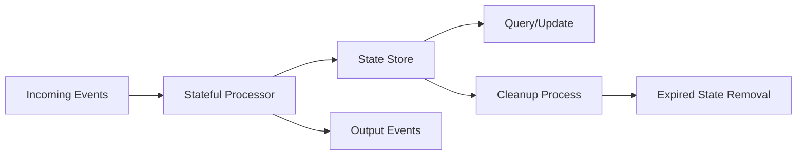
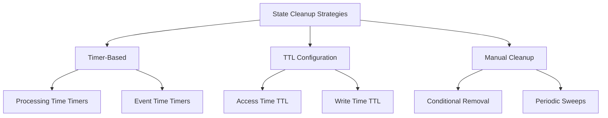
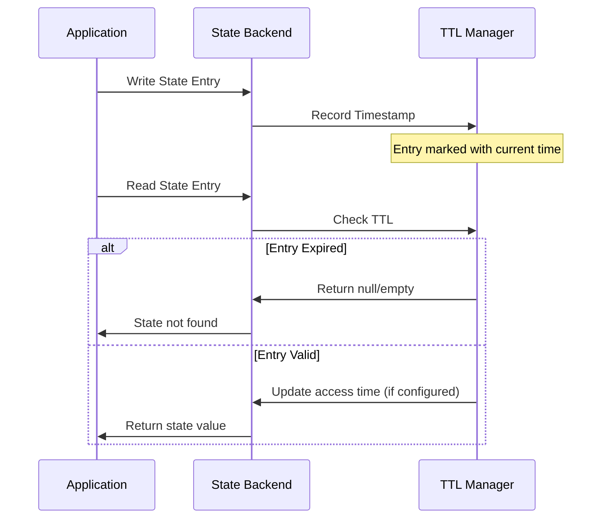
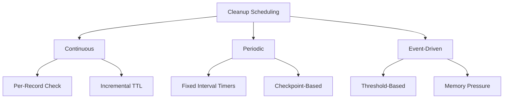
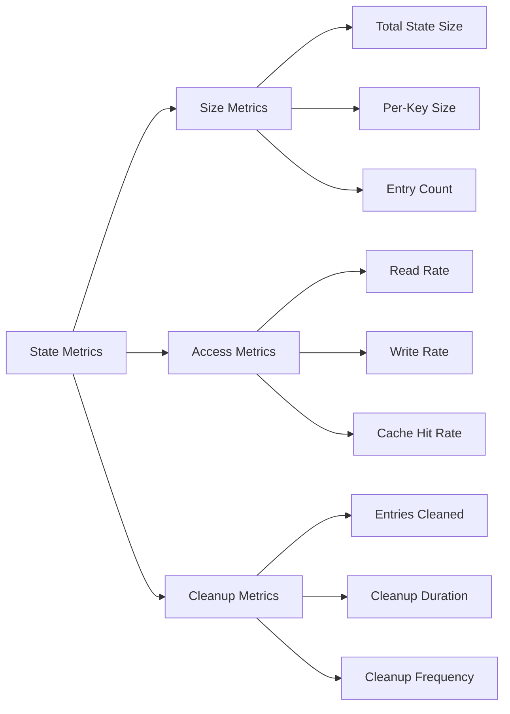

# How to Create State Cleanup

Author: [nawazdhandala](https://github.com/nawazdhandala)

Tags: Stream Processing, State Cleanup, Memory Management, Apache Flink

Description: Learn to create state cleanup strategies in stream processing for managing memory and preventing unbounded state growth.

---

State management is one of the most critical aspects of stream processing systems. Without proper cleanup strategies, stateful applications can suffer from unbounded memory growth, degraded performance, and eventual system failures. This guide explores comprehensive approaches to implementing effective state cleanup in stream processing applications.

## Understanding State in Stream Processing

Stream processing applications maintain state for various purposes: aggregations, joins, pattern detection, and sessionization. Unlike batch processing, streams are potentially infinite, meaning state can grow indefinitely without proper management.



### Why State Cleanup Matters

- **Memory Constraints**: Unbounded state leads to out-of-memory errors
- **Performance Degradation**: Large state sizes increase checkpoint times
- **Cost Implications**: Cloud deployments charge for memory usage
- **Recovery Time**: Larger states mean longer recovery from failures

## State Cleanup Approaches

There are three primary approaches to state cleanup in stream processing systems:

1. **Timer-based Cleanup**: Using processing or event time timers
2. **TTL (Time-to-Live) Configuration**: Automatic expiration based on access patterns
3. **Manual Cleanup**: Explicit state management within application logic



## Timer-Based State Cleanup

Timers provide fine-grained control over when state should be cleaned up. Apache Flink supports both processing time and event time timers.

### Processing Time Timer Implementation

```java
import org.apache.flink.api.common.state.ValueState;
import org.apache.flink.api.common.state.ValueStateDescriptor;
import org.apache.flink.configuration.Configuration;
import org.apache.flink.streaming.api.functions.KeyedProcessFunction;
import org.apache.flink.util.Collector;

/**
 * A KeyedProcessFunction that maintains user session state with
 * automatic cleanup after a configurable timeout period.
 *
 * This implementation uses processing time timers to track inactivity
 * and clean up state when sessions expire.
 */
public class SessionStateWithCleanup
    extends KeyedProcessFunction<String, UserEvent, SessionResult> {

    // Session timeout in milliseconds (30 minutes)
    private static final long SESSION_TIMEOUT = 30 * 60 * 1000L;

    // State for storing session data
    private ValueState<SessionData> sessionState;

    // State for tracking the cleanup timer timestamp
    private ValueState<Long> timerState;

    @Override
    public void open(Configuration parameters) throws Exception {
        // Initialize session state descriptor
        ValueStateDescriptor<SessionData> sessionDescriptor =
            new ValueStateDescriptor<>(
                "session-state",
                SessionData.class
            );
        sessionState = getRuntimeContext().getState(sessionDescriptor);

        // Initialize timer state descriptor to track active timers
        ValueStateDescriptor<Long> timerDescriptor =
            new ValueStateDescriptor<>(
                "timer-state",
                Long.class
            );
        timerState = getRuntimeContext().getState(timerDescriptor);
    }

    @Override
    public void processElement(
            UserEvent event,
            Context ctx,
            Collector<SessionResult> out) throws Exception {

        // Retrieve current session or create new one
        SessionData currentSession = sessionState.value();
        if (currentSession == null) {
            currentSession = new SessionData(event.getUserId());
        }

        // Update session with new event data
        currentSession.addEvent(event);
        sessionState.update(currentSession);

        // Cancel any existing cleanup timer
        Long existingTimer = timerState.value();
        if (existingTimer != null) {
            ctx.timerService().deleteProcessingTimeTimer(existingTimer);
        }

        // Register new cleanup timer for session timeout
        long cleanupTime = ctx.timerService().currentProcessingTime()
            + SESSION_TIMEOUT;
        ctx.timerService().registerProcessingTimeTimer(cleanupTime);
        timerState.update(cleanupTime);
    }

    @Override
    public void onTimer(
            long timestamp,
            OnTimerContext ctx,
            Collector<SessionResult> out) throws Exception {

        // Timer fired means session has been inactive
        SessionData session = sessionState.value();

        if (session != null) {
            // Emit final session result before cleanup
            out.collect(new SessionResult(
                session.getUserId(),
                session.getEventCount(),
                session.getStartTime(),
                timestamp
            ));

            // Clear all state for this key
            sessionState.clear();
            timerState.clear();
        }
    }
}
```

### Event Time Timer Implementation

Event time timers are useful when cleanup should be based on the logical time of events rather than wall-clock time.

```java
import org.apache.flink.api.common.state.MapState;
import org.apache.flink.api.common.state.MapStateDescriptor;
import org.apache.flink.streaming.api.functions.KeyedProcessFunction;
import org.apache.flink.util.Collector;

/**
 * Implements event time based state cleanup for windowed aggregations.
 * State is cleaned up when the watermark advances past the window end time.
 */
public class EventTimeCleanupProcessor
    extends KeyedProcessFunction<String, SensorReading, AggregatedReading> {

    // Window duration in milliseconds
    private static final long WINDOW_SIZE = 60_000L;

    // Additional time to wait before cleanup (for late data)
    private static final long ALLOWED_LATENESS = 10_000L;

    // State storing readings per window
    private MapState<Long, WindowAccumulator> windowState;

    @Override
    public void open(Configuration parameters) throws Exception {
        MapStateDescriptor<Long, WindowAccumulator> descriptor =
            new MapStateDescriptor<>(
                "window-state",
                Long.class,
                WindowAccumulator.class
            );
        windowState = getRuntimeContext().getMapState(descriptor);
    }

    @Override
    public void processElement(
            SensorReading reading,
            Context ctx,
            Collector<AggregatedReading> out) throws Exception {

        // Calculate which window this reading belongs to
        long windowStart = reading.getTimestamp()
            - (reading.getTimestamp() % WINDOW_SIZE);
        long windowEnd = windowStart + WINDOW_SIZE;

        // Get or create accumulator for this window
        WindowAccumulator accumulator = windowState.get(windowStart);
        if (accumulator == null) {
            accumulator = new WindowAccumulator();

            // Register cleanup timer for this window
            // Cleanup happens after window end plus allowed lateness
            long cleanupTime = windowEnd + ALLOWED_LATENESS;
            ctx.timerService().registerEventTimeTimer(cleanupTime);
        }

        // Add reading to the accumulator
        accumulator.add(reading);
        windowState.put(windowStart, accumulator);
    }

    @Override
    public void onTimer(
            long timestamp,
            OnTimerContext ctx,
            Collector<AggregatedReading> out) throws Exception {

        // Calculate which window should be cleaned up
        long windowStart = timestamp - ALLOWED_LATENESS - WINDOW_SIZE;

        // Emit result and clean up window state
        WindowAccumulator accumulator = windowState.get(windowStart);
        if (accumulator != null) {
            out.collect(new AggregatedReading(
                ctx.getCurrentKey(),
                windowStart,
                accumulator.getAverage(),
                accumulator.getCount()
            ));

            // Remove the window state
            windowState.remove(windowStart);
        }
    }
}
```

## TTL (Time-to-Live) Configuration

TTL provides a declarative way to automatically expire state without explicit timer management. This is often the simplest approach for many use cases.



### Configuring State TTL in Apache Flink

```java
import org.apache.flink.api.common.state.StateTtlConfig;
import org.apache.flink.api.common.state.ValueState;
import org.apache.flink.api.common.state.ValueStateDescriptor;
import org.apache.flink.api.common.time.Time;

/**
 * Demonstrates TTL configuration for automatic state expiration.
 * This approach requires minimal code changes and handles cleanup automatically.
 */
public class TTLStateExample
    extends KeyedProcessFunction<String, Event, Result> {

    private ValueState<AggregatedData> aggregateState;

    @Override
    public void open(Configuration parameters) throws Exception {
        // Configure TTL settings
        StateTtlConfig ttlConfig = StateTtlConfig
            .newBuilder(Time.hours(24))  // State expires after 24 hours
            .setUpdateType(StateTtlConfig.UpdateType.OnReadAndWrite)
            .setStateVisibility(
                StateTtlConfig.StateVisibility.NeverReturnExpired
            )
            .cleanupFullSnapshot()  // Clean during checkpoints
            .cleanupIncrementally(100, true)  // Incremental cleanup
            .build();

        // Create state descriptor with TTL
        ValueStateDescriptor<AggregatedData> descriptor =
            new ValueStateDescriptor<>(
                "aggregate-state",
                AggregatedData.class
            );

        // Enable TTL on the state descriptor
        descriptor.enableTimeToLive(ttlConfig);

        aggregateState = getRuntimeContext().getState(descriptor);
    }

    @Override
    public void processElement(
            Event event,
            Context ctx,
            Collector<Result> out) throws Exception {

        // State access automatically updates TTL timestamp
        AggregatedData current = aggregateState.value();

        if (current == null) {
            current = new AggregatedData();
        }

        current.aggregate(event);
        aggregateState.update(current);

        // Emit result if threshold reached
        if (current.shouldEmit()) {
            out.collect(current.toResult());
        }
    }
}
```

### TTL Configuration Options

| Option | Description | Use Case |
|--------|-------------|----------|
| `OnCreateAndWrite` | TTL resets only on state creation or update | Inactivity detection |
| `OnReadAndWrite` | TTL resets on any state access | Session tracking |
| `NeverReturnExpired` | Expired state is invisible | Strict consistency |
| `ReturnExpiredIfNotCleanedUp` | May return stale data | Performance optimization |

### Advanced TTL Cleanup Strategies

```java
import org.apache.flink.api.common.state.StateTtlConfig;
import org.apache.flink.api.common.time.Time;

/**
 * Advanced TTL configuration with multiple cleanup strategies.
 * Combines different approaches for optimal memory management.
 */
public class AdvancedTTLConfig {

    /**
     * Creates a TTL configuration optimized for RocksDB state backend.
     * Uses compaction filter for efficient cleanup of expired entries.
     */
    public static StateTtlConfig createRocksDBOptimizedConfig() {
        return StateTtlConfig
            .newBuilder(Time.hours(12))
            .setUpdateType(StateTtlConfig.UpdateType.OnCreateAndWrite)
            .setStateVisibility(
                StateTtlConfig.StateVisibility.NeverReturnExpired
            )
            // Cleanup during RocksDB compaction (most efficient for RocksDB)
            .cleanupInRocksdbCompactFilter(1000)
            .build();
    }

    /**
     * Creates a TTL configuration for heap state backend.
     * Uses incremental cleanup to avoid long pauses.
     */
    public static StateTtlConfig createHeapOptimizedConfig() {
        return StateTtlConfig
            .newBuilder(Time.minutes(30))
            .setUpdateType(StateTtlConfig.UpdateType.OnReadAndWrite)
            .setStateVisibility(
                StateTtlConfig.StateVisibility.NeverReturnExpired
            )
            // Check 10 entries per state access, run always
            .cleanupIncrementally(10, true)
            // Also clean during snapshots
            .cleanupFullSnapshot()
            .build();
    }

    /**
     * Creates a TTL configuration for low-latency requirements.
     * Trades memory for reduced cleanup overhead.
     */
    public static StateTtlConfig createLowLatencyConfig() {
        return StateTtlConfig
            .newBuilder(Time.hours(1))
            .setUpdateType(StateTtlConfig.UpdateType.OnCreateAndWrite)
            // Allow expired data to avoid synchronous cleanup
            .setStateVisibility(
                StateTtlConfig.StateVisibility.ReturnExpiredIfNotCleanedUp
            )
            // Only clean during snapshots to minimize latency impact
            .cleanupFullSnapshot()
            .build();
    }
}
```

## Manual State Cleanup

For complex cleanup logic that cannot be expressed through timers or TTL, manual cleanup provides full control.

```java
import org.apache.flink.api.common.state.ListState;
import org.apache.flink.api.common.state.ListStateDescriptor;
import org.apache.flink.api.common.state.ValueState;
import org.apache.flink.api.common.state.ValueStateDescriptor;
import org.apache.flink.streaming.api.functions.KeyedProcessFunction;
import org.apache.flink.util.Collector;

import java.util.ArrayList;
import java.util.Iterator;
import java.util.List;

/**
 * Implements manual state cleanup with custom business logic.
 * Useful when cleanup depends on complex conditions beyond simple time-based rules.
 */
public class ManualCleanupProcessor
    extends KeyedProcessFunction<String, Transaction, Alert> {

    // Maximum number of transactions to keep per user
    private static final int MAX_TRANSACTIONS = 100;

    // Cleanup interval in milliseconds
    private static final long CLEANUP_INTERVAL = 60_000L;

    // State holding recent transactions
    private ListState<Transaction> transactionHistory;

    // State tracking last cleanup time
    private ValueState<Long> lastCleanupTime;

    @Override
    public void open(Configuration parameters) throws Exception {
        ListStateDescriptor<Transaction> listDescriptor =
            new ListStateDescriptor<>(
                "transaction-history",
                Transaction.class
            );
        transactionHistory = getRuntimeContext().getListState(listDescriptor);

        ValueStateDescriptor<Long> timeDescriptor =
            new ValueStateDescriptor<>(
                "last-cleanup-time",
                Long.class
            );
        lastCleanupTime = getRuntimeContext().getState(timeDescriptor);
    }

    @Override
    public void processElement(
            Transaction transaction,
            Context ctx,
            Collector<Alert> out) throws Exception {

        // Add new transaction to history
        transactionHistory.add(transaction);

        // Check if cleanup is needed
        long currentTime = ctx.timerService().currentProcessingTime();
        Long lastCleanup = lastCleanupTime.value();

        if (lastCleanup == null ||
            currentTime - lastCleanup > CLEANUP_INTERVAL) {

            performCleanup(currentTime, out);
            lastCleanupTime.update(currentTime);
        }

        // Perform fraud detection on recent transactions
        detectFraud(transaction, out);
    }

    /**
     * Performs manual cleanup of transaction history.
     * Removes old and irrelevant transactions based on business rules.
     */
    private void performCleanup(
            long currentTime,
            Collector<Alert> out) throws Exception {

        List<Transaction> retained = new ArrayList<>();
        int removedCount = 0;

        // Iterate through all transactions
        for (Transaction tx : transactionHistory.get()) {
            boolean shouldRetain = evaluateRetention(tx, currentTime);

            if (shouldRetain && retained.size() < MAX_TRANSACTIONS) {
                retained.add(tx);
            } else {
                removedCount++;
            }
        }

        // Replace state with cleaned list
        transactionHistory.update(retained);

        // Emit cleanup metrics if significant cleanup occurred
        if (removedCount > 10) {
            out.collect(new Alert(
                "STATE_CLEANUP",
                "Removed " + removedCount + " transactions from history"
            ));
        }
    }

    /**
     * Evaluates whether a transaction should be retained in state.
     * Implements business-specific retention rules.
     */
    private boolean evaluateRetention(
            Transaction tx,
            long currentTime) {

        // Keep transactions from the last 24 hours
        long ageMs = currentTime - tx.getTimestamp();
        if (ageMs < 24 * 60 * 60 * 1000L) {
            return true;
        }

        // Keep high-value transactions for longer (7 days)
        if (tx.getAmount() > 10000 && ageMs < 7 * 24 * 60 * 60 * 1000L) {
            return true;
        }

        // Keep flagged transactions indefinitely (until manual review)
        if (tx.isFlagged()) {
            return true;
        }

        return false;
    }

    private void detectFraud(
            Transaction transaction,
            Collector<Alert> out) throws Exception {
        // Fraud detection logic using transaction history
        // Implementation details omitted for brevity
    }
}
```

## Cleanup Scheduling Patterns

Effective cleanup scheduling balances memory efficiency with processing performance.



### Periodic Cleanup with Timers

```java
import org.apache.flink.streaming.api.functions.KeyedProcessFunction;
import org.apache.flink.api.common.state.MapState;
import org.apache.flink.api.common.state.MapStateDescriptor;
import org.apache.flink.api.common.state.ValueState;
import org.apache.flink.api.common.state.ValueStateDescriptor;

/**
 * Implements periodic cleanup using processing time timers.
 * Cleanup runs at fixed intervals regardless of data flow.
 */
public class PeriodicCleanupProcessor
    extends KeyedProcessFunction<String, Event, Output> {

    // Cleanup interval: 5 minutes
    private static final long CLEANUP_INTERVAL = 5 * 60 * 1000L;

    // State expiration: 1 hour
    private static final long STATE_TTL = 60 * 60 * 1000L;

    // Map state with timestamp tracking
    private MapState<String, TimestampedValue> dataState;

    // Timer tracking state
    private ValueState<Long> nextCleanupTimer;

    @Override
    public void open(Configuration parameters) throws Exception {
        MapStateDescriptor<String, TimestampedValue> mapDescriptor =
            new MapStateDescriptor<>(
                "data-state",
                String.class,
                TimestampedValue.class
            );
        dataState = getRuntimeContext().getMapState(mapDescriptor);

        ValueStateDescriptor<Long> timerDescriptor =
            new ValueStateDescriptor<>(
                "cleanup-timer",
                Long.class
            );
        nextCleanupTimer = getRuntimeContext().getState(timerDescriptor);
    }

    @Override
    public void processElement(
            Event event,
            Context ctx,
            Collector<Output> out) throws Exception {

        long currentTime = ctx.timerService().currentProcessingTime();

        // Store data with timestamp
        dataState.put(
            event.getKey(),
            new TimestampedValue(event.getValue(), currentTime)
        );

        // Ensure cleanup timer is registered
        ensureCleanupTimer(ctx, currentTime);

        // Process event
        processEventLogic(event, out);
    }

    /**
     * Ensures a cleanup timer is registered for this key.
     * Only one timer per key is maintained to avoid timer explosion.
     */
    private void ensureCleanupTimer(
            Context ctx,
            long currentTime) throws Exception {

        Long existingTimer = nextCleanupTimer.value();

        // Only register if no timer exists or existing timer has passed
        if (existingTimer == null || existingTimer <= currentTime) {
            long nextCleanup = currentTime + CLEANUP_INTERVAL;
            ctx.timerService().registerProcessingTimeTimer(nextCleanup);
            nextCleanupTimer.update(nextCleanup);
        }
    }

    @Override
    public void onTimer(
            long timestamp,
            OnTimerContext ctx,
            Collector<Output> out) throws Exception {

        long currentTime = ctx.timerService().currentProcessingTime();
        long expirationThreshold = currentTime - STATE_TTL;

        // Collect keys to remove (avoid modification during iteration)
        List<String> keysToRemove = new ArrayList<>();

        for (Map.Entry<String, TimestampedValue> entry : dataState.entries()) {
            if (entry.getValue().getTimestamp() < expirationThreshold) {
                keysToRemove.add(entry.getKey());
            }
        }

        // Remove expired entries
        for (String key : keysToRemove) {
            dataState.remove(key);
        }

        // Schedule next cleanup if state is not empty
        if (dataState.iterator().hasNext()) {
            long nextCleanup = currentTime + CLEANUP_INTERVAL;
            ctx.timerService().registerProcessingTimeTimer(nextCleanup);
            nextCleanupTimer.update(nextCleanup);
        } else {
            nextCleanupTimer.clear();
        }
    }

    private void processEventLogic(Event event, Collector<Output> out) {
        // Business logic implementation
    }
}
```

## State Size Monitoring

Monitoring state size is essential for understanding cleanup effectiveness and preventing issues before they impact production.



### Implementing State Metrics

```java
import org.apache.flink.api.common.functions.RichFlatMapFunction;
import org.apache.flink.api.common.state.MapState;
import org.apache.flink.api.common.state.MapStateDescriptor;
import org.apache.flink.configuration.Configuration;
import org.apache.flink.metrics.Counter;
import org.apache.flink.metrics.Gauge;
import org.apache.flink.util.Collector;

import java.util.concurrent.atomic.AtomicLong;

/**
 * Demonstrates state size monitoring with custom metrics.
 * Tracks state growth and cleanup effectiveness.
 */
public class MonitoredStateProcessor
    extends RichFlatMapFunction<Event, Result> {

    // State being monitored
    private MapState<String, StateEntry> monitoredState;

    // Metrics
    private Counter stateWriteCounter;
    private Counter stateReadCounter;
    private Counter cleanupCounter;
    private AtomicLong stateEntryCount;

    @Override
    public void open(Configuration parameters) throws Exception {
        // Initialize state
        MapStateDescriptor<String, StateEntry> descriptor =
            new MapStateDescriptor<>(
                "monitored-state",
                String.class,
                StateEntry.class
            );
        monitoredState = getRuntimeContext().getMapState(descriptor);

        // Initialize counters
        stateWriteCounter = getRuntimeContext()
            .getMetricGroup()
            .counter("state_writes_total");

        stateReadCounter = getRuntimeContext()
            .getMetricGroup()
            .counter("state_reads_total");

        cleanupCounter = getRuntimeContext()
            .getMetricGroup()
            .counter("state_cleanups_total");

        // Initialize gauge for entry count
        stateEntryCount = new AtomicLong(0);
        getRuntimeContext()
            .getMetricGroup()
            .gauge("state_entry_count", () -> stateEntryCount.get());
    }

    @Override
    public void flatMap(Event event, Collector<Result> out) throws Exception {
        String key = event.getKey();

        // Read state with metrics
        StateEntry existing = monitoredState.get(key);
        stateReadCounter.inc();

        if (existing == null) {
            // New entry
            existing = new StateEntry();
            stateEntryCount.incrementAndGet();
        }

        // Update state
        existing.update(event);
        monitoredState.put(key, existing);
        stateWriteCounter.inc();

        // Check for cleanup condition
        if (existing.shouldExpire()) {
            monitoredState.remove(key);
            stateEntryCount.decrementAndGet();
            cleanupCounter.inc();
        }

        // Emit result
        out.collect(existing.toResult());
    }
}
```

### Prometheus Metrics Export

```java
import org.apache.flink.metrics.reporter.MetricReporter;

/**
 * Configuration for exporting state metrics to Prometheus.
 * Include in flink-conf.yaml for production monitoring.
 */
public class MetricsConfiguration {

    /**
     * Sample flink-conf.yaml configuration:
     *
     * metrics.reporter.prometheus.class:
     *   org.apache.flink.metrics.prometheus.PrometheusReporter
     * metrics.reporter.prometheus.port: 9249
     *
     * # Useful state-related metrics to monitor:
     * # - flink_taskmanager_job_task_operator_state_writes_total
     * # - flink_taskmanager_job_task_operator_state_reads_total
     * # - flink_taskmanager_job_task_operator_state_entry_count
     * # - flink_taskmanager_job_task_operator_state_cleanups_total
     * # - flink_taskmanager_Status_JVM_Memory_Heap_Used
     * # - flink_jobmanager_job_lastCheckpointSize
     */

    public static final String PROMETHEUS_CONFIG = """
        metrics.reporter.prometheus.factory.class: \\
          org.apache.flink.metrics.prometheus.PrometheusReporterFactory
        metrics.reporter.prometheus.port: 9249-9260
        """;
}
```

### Grafana Dashboard Query Examples

```sql
-- State size over time
SELECT
  time_bucket('1 minute', time) AS bucket,
  avg(state_entry_count) AS avg_entries,
  max(state_entry_count) AS max_entries
FROM flink_metrics
WHERE metric_name = 'state_entry_count'
GROUP BY bucket
ORDER BY bucket;

-- Cleanup effectiveness
SELECT
  sum(state_cleanups_total) / sum(state_writes_total) AS cleanup_ratio
FROM flink_metrics
WHERE time > now() - interval '1 hour';

-- Memory pressure correlation
SELECT
  corr(heap_used, checkpoint_size) AS memory_checkpoint_correlation
FROM flink_metrics
WHERE time > now() - interval '24 hours';
```

## Best Practices Summary

### Choosing the Right Cleanup Strategy

| Scenario | Recommended Approach | Rationale |
|----------|---------------------|-----------|
| Simple expiration | TTL Configuration | Minimal code, automatic handling |
| Session management | Processing time timers | Fine-grained control, activity tracking |
| Windowed aggregation | Event time timers | Aligns with data semantics |
| Complex business rules | Manual cleanup | Full flexibility |
| High throughput | Incremental TTL | Low latency impact |

### Common Pitfalls to Avoid

1. **Timer explosion**: Register one timer per key, not per event
2. **Synchronous cleanup**: Use incremental cleanup to avoid processing spikes
3. **Missing cleanup on key inactivity**: Use timers, not just event-driven cleanup
4. **Ignoring checkpoint impact**: Large state increases checkpoint duration
5. **Not monitoring state growth**: Implement metrics before problems occur

### Checklist for Production Deployment

```text
[ ] State TTL or timers configured for all stateful operators
[ ] Cleanup metrics implemented and monitored
[ ] Alerting configured for state size thresholds
[ ] Checkpoint size monitored and bounded
[ ] Load testing performed with realistic key cardinality
[ ] Recovery time validated with full state
[ ] Memory limits set appropriately for state backend
```

## Conclusion

Effective state cleanup is essential for building robust stream processing applications. By combining the right cleanup strategy with proper monitoring, you can ensure your applications remain performant and reliable over extended periods.

Key takeaways:
- Use TTL for simple time-based expiration
- Use timers for complex cleanup logic tied to processing semantics
- Monitor state size proactively
- Test cleanup behavior under realistic conditions
- Plan for state growth in capacity planning

With these strategies in place, your stream processing applications will maintain consistent performance regardless of how long they run or how much data they process.
