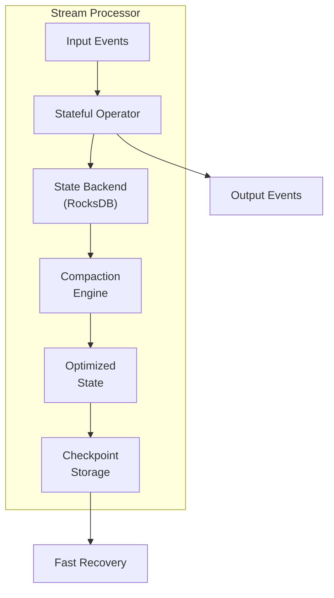
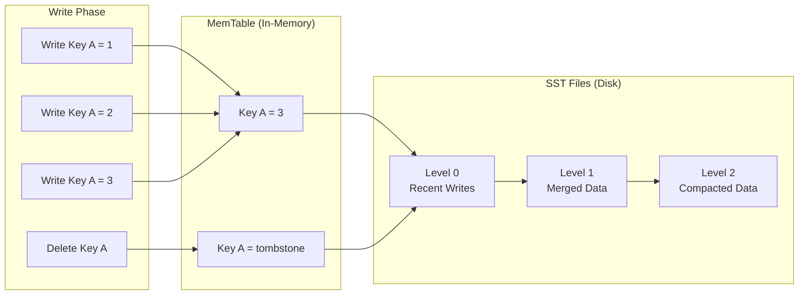
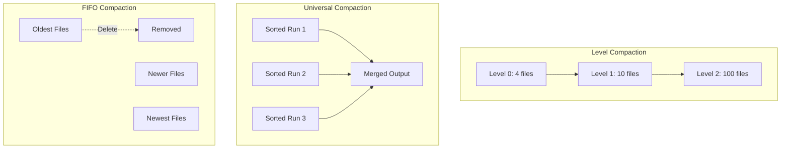
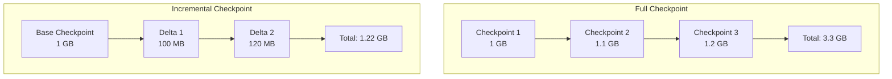
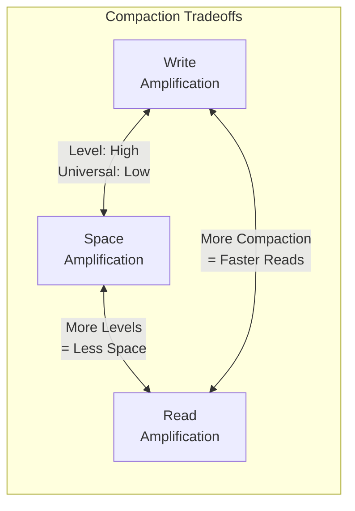

# How to Build State Compaction

Author: [nawazdhandala](https://github.com/nawazdhandala)

Tags: Stream Processing, State Compaction, RocksDB, Performance

Description: Learn to build state compaction strategies in stream processing for optimizing state storage and reducing checkpoint sizes.

---

> State management is the backbone of stateful stream processing. As your application processes millions of events, state grows unbounded without proper compaction. This guide shows you how to implement efficient state compaction strategies using RocksDB to keep your stream processing applications performant and reliable.

State compaction removes obsolete entries, merges updates, and reclaims storage. Without it, checkpoints grow indefinitely and recovery times become unacceptable.

---

## Overview

State compaction in stream processing involves periodically cleaning and optimizing the state storage to remove outdated or redundant data. The following diagram illustrates how state compaction fits into a stream processing architecture:



---

## Why State Compaction Matters

Stream processing applications maintain state for operations like aggregations, joins, and windowed computations. Over time, this state accumulates:

1. **Outdated entries** - Keys that are no longer relevant
2. **Tombstones** - Deletion markers that need cleanup
3. **Multiple versions** - Superseded values for the same key
4. **Expired windows** - Time windows that have closed

Without compaction, these issues lead to:

- Growing checkpoint sizes
- Longer recovery times
- Increased storage costs
- Degraded query performance

---

## State Compaction Architecture

The following diagram shows the lifecycle of state entries through the compaction process:



---

## RocksDB State Backend Configuration

RocksDB is the most common state backend for production stream processing. Here is a comprehensive configuration class for setting up RocksDB with optimized compaction settings:

```java
// RocksDBStateBackendConfig.java
// Configuration class for RocksDB state backend with compaction optimization

import org.apache.flink.contrib.streaming.state.RocksDBStateBackend;
import org.apache.flink.contrib.streaming.state.PredefinedOptions;
import org.rocksdb.CompactionStyle;
import org.rocksdb.CompressionType;
import org.rocksdb.Options;
import org.rocksdb.BlockBasedTableConfig;

public class RocksDBStateBackendConfig {

    // Default checkpoint interval in milliseconds (10 seconds)
    private static final long CHECKPOINT_INTERVAL_MS = 10_000;

    // Memory budget for RocksDB per slot (256 MB)
    private static final long MEMORY_BUDGET_PER_SLOT = 256 * 1024 * 1024;

    /**
     * Creates a RocksDB state backend with optimized compaction settings.
     * This configuration balances write performance with compaction efficiency.
     *
     * @param checkpointPath Path for storing checkpoints (e.g., hdfs:// or s3://)
     * @param enableIncrementalCheckpoints Whether to enable incremental checkpointing
     * @return Configured RocksDB state backend
     */
    public static RocksDBStateBackend createOptimizedBackend(
            String checkpointPath,
            boolean enableIncrementalCheckpoints) throws Exception {

        // Create state backend with checkpoint location
        // Incremental checkpoints only store changes since last checkpoint
        RocksDBStateBackend backend = new RocksDBStateBackend(
            checkpointPath,
            enableIncrementalCheckpoints
        );

        // Use spinning disk optimized settings as base
        // These settings reduce write amplification on HDDs
        backend.setPredefinedOptions(PredefinedOptions.SPINNING_DISK_OPTIMIZED_HIGH_MEM);

        // Configure RocksDB options factory for fine-grained control
        backend.setRocksDBOptions(new CustomRocksDBOptionsFactory());

        return backend;
    }

    /**
     * Custom RocksDB options factory that configures compaction behavior.
     * These settings are applied when RocksDB instances are created.
     */
    public static class CustomRocksDBOptionsFactory implements RocksDBOptionsFactory {

        @Override
        public Options createDBOptions(Options currentOptions) {
            // Set maximum number of background compaction threads
            // More threads = faster compaction but higher CPU usage
            currentOptions.setMaxBackgroundCompactions(4);

            // Set background flush threads for MemTable to SST conversion
            currentOptions.setMaxBackgroundFlushes(2);

            // Enable parallel compaction across column families
            // Useful when state has multiple namespaces
            currentOptions.setMaxSubcompactions(4);

            return currentOptions;
        }

        @Override
        public ColumnFamilyOptions createColumnFamilyOptions(
                ColumnFamilyOptions currentOptions) {

            // Configure Level-based compaction (default and most tested)
            // Provides good balance between read/write amplification
            currentOptions.setCompactionStyle(CompactionStyle.LEVEL);

            // MemTable size before flushing to disk (64 MB)
            // Larger = better write performance, higher memory usage
            currentOptions.setWriteBufferSize(64 * 1024 * 1024);

            // Number of MemTables to keep in memory
            // Allows writes while previous MemTable is flushing
            currentOptions.setMaxWriteBufferNumber(4);

            // Minimum MemTables to merge during flush
            currentOptions.setMinWriteBufferNumberToMerge(2);

            // Level 0 file limit before triggering compaction
            // Lower value = more frequent compaction, faster reads
            currentOptions.setLevel0FileNumCompactionTrigger(4);

            // Enable compression for space efficiency
            // LZ4 provides good compression with fast decompression
            currentOptions.setCompressionType(CompressionType.LZ4_COMPRESSION);

            // Configure bloom filters for faster key lookups
            BlockBasedTableConfig tableConfig = new BlockBasedTableConfig();
            tableConfig.setFilterPolicy(new BloomFilter(10, false));
            tableConfig.setBlockSize(16 * 1024);  // 16 KB blocks
            tableConfig.setBlockCache(new LRUCache(128 * 1024 * 1024));  // 128 MB cache
            currentOptions.setTableFormatConfig(tableConfig);

            return currentOptions;
        }
    }
}
```

---

## Compaction Strategies

Different use cases require different compaction strategies. The following diagram compares the three main approaches:



### Level Compaction

Level compaction organizes data into levels with increasing size. This is the default and works well for most workloads:

```java
// LevelCompactionConfig.java
// Configuration for level-based compaction strategy

import org.rocksdb.ColumnFamilyOptions;
import org.rocksdb.CompactionStyle;

public class LevelCompactionConfig {

    /**
     * Configures level compaction for general purpose workloads.
     *
     * Level compaction maintains multiple levels of SST files:
     * - Level 0: Direct flush from MemTable (overlapping keys allowed)
     * - Level 1+: Non-overlapping key ranges within each level
     *
     * Benefits:
     * - Bounded space amplification (typically 1.1x)
     * - Good read performance due to sorted structure
     * - Predictable compaction behavior
     *
     * @param options RocksDB column family options to configure
     */
    public static void configureLevelCompaction(ColumnFamilyOptions options) {
        // Use level-based compaction style
        options.setCompactionStyle(CompactionStyle.LEVEL);

        // Target size for Level 1 (256 MB)
        // Each subsequent level is 10x larger by default
        options.setMaxBytesForLevelBase(256 * 1024 * 1024);

        // Multiplier for level sizes (Level N+1 = Level N * multiplier)
        // Higher multiplier = fewer levels, more write amplification
        options.setMaxBytesForLevelMultiplier(10);

        // Target file size at base level (64 MB)
        // Files at higher levels are larger by the multiplier
        options.setTargetFileSizeBase(64 * 1024 * 1024);

        // Maximum number of levels (default is 7)
        // More levels = better space efficiency, slightly slower reads
        options.setNumLevels(7);

        // Number of Level 0 files to trigger compaction
        // Lower = more frequent compaction, faster reads
        options.setLevel0FileNumCompactionTrigger(4);

        // Level 0 files to slow down writes (back pressure)
        options.setLevel0SlowdownWritesTrigger(20);

        // Level 0 files to stop writes completely
        options.setLevel0StopWritesTrigger(36);
    }
}
```

### Universal Compaction

Universal compaction is optimized for write-heavy workloads with lower write amplification:

```java
// UniversalCompactionConfig.java
// Configuration for universal compaction strategy

import org.rocksdb.ColumnFamilyOptions;
import org.rocksdb.CompactionStyle;
import org.rocksdb.CompactionOptionsUniversal;

public class UniversalCompactionConfig {

    /**
     * Configures universal compaction for write-intensive workloads.
     *
     * Universal compaction maintains sorted runs that are periodically merged.
     * Unlike level compaction, it does not have a fixed level structure.
     *
     * Benefits:
     * - Lower write amplification (2-3x vs 10-30x for level)
     * - Better for append-heavy workloads
     * - Simpler compaction logic
     *
     * Drawbacks:
     * - Higher space amplification (up to 2x)
     * - Less predictable read performance
     *
     * @param options RocksDB column family options to configure
     */
    public static void configureUniversalCompaction(ColumnFamilyOptions options) {
        // Use universal compaction style
        options.setCompactionStyle(CompactionStyle.UNIVERSAL);

        // Configure universal compaction specific options
        CompactionOptionsUniversal universalOptions = new CompactionOptionsUniversal();

        // Size ratio threshold for compaction
        // Lower ratio = more aggressive compaction
        // Files are merged when smallest/largest > ratio
        universalOptions.setSizeRatio(1);

        // Minimum number of files to trigger compaction
        // Prevents compaction with too few files
        universalOptions.setMinMergeWidth(2);

        // Maximum number of files to merge at once
        // Higher = better space efficiency, higher latency
        universalOptions.setMaxMergeWidth(Integer.MAX_VALUE);

        // Maximum size amplification (percentage)
        // Triggers compaction when DB size exceeds live data * (100 + percent) / 100
        universalOptions.setMaxSizeAmplificationPercent(200);

        // Enable compaction of all files when space amplification is high
        universalOptions.setCompressionSizePercent(-1);

        options.setCompactionOptionsUniversal(universalOptions);

        // Larger write buffer for batching writes
        options.setWriteBufferSize(128 * 1024 * 1024);
        options.setMaxWriteBufferNumber(6);
    }
}
```

### FIFO Compaction

FIFO compaction is designed for time-series data with TTL (time to live):

```java
// FIFOCompactionConfig.java
// Configuration for FIFO compaction strategy with TTL

import org.rocksdb.ColumnFamilyOptions;
import org.rocksdb.CompactionStyle;
import org.rocksdb.CompactionOptionsFIFO;

public class FIFOCompactionConfig {

    // Default TTL of 24 hours in seconds
    private static final long DEFAULT_TTL_SECONDS = 24 * 60 * 60;

    // Maximum database size (10 GB)
    private static final long MAX_DB_SIZE = 10L * 1024 * 1024 * 1024;

    /**
     * Configures FIFO compaction for time-series data with automatic expiration.
     *
     * FIFO compaction is the simplest strategy:
     * - Files are never merged
     * - Oldest files are deleted when size limit is reached
     * - Perfect for time-series data where old data can be discarded
     *
     * Benefits:
     * - Zero write amplification
     * - Extremely fast writes
     * - Predictable space usage
     *
     * Drawbacks:
     * - Cannot update existing keys efficiently
     * - Deletes based on file age, not key age
     *
     * @param options RocksDB column family options to configure
     * @param ttlSeconds Time to live for data in seconds
     */
    public static void configureFIFOCompaction(
            ColumnFamilyOptions options,
            long ttlSeconds) {

        // Use FIFO compaction style
        options.setCompactionStyle(CompactionStyle.FIFO);

        // Configure FIFO specific options
        CompactionOptionsFIFO fifoOptions = new CompactionOptionsFIFO();

        // Maximum database size before oldest files are deleted
        fifoOptions.setMaxTableFilesSize(MAX_DB_SIZE);

        options.setCompactionOptionsFIFO(fifoOptions);

        // Set TTL for automatic expiration
        // Files older than TTL are deleted during compaction
        options.setTtl(ttlSeconds);

        // Disable compression for fastest writes
        // Time-series data often compresses poorly anyway
        options.setCompressionType(CompressionType.NO_COMPRESSION);

        // Large write buffer to batch time-series points
        options.setWriteBufferSize(256 * 1024 * 1024);
    }

    /**
     * Creates FIFO configuration with default 24-hour TTL.
     */
    public static void configureFIFOCompaction(ColumnFamilyOptions options) {
        configureFIFOCompaction(options, DEFAULT_TTL_SECONDS);
    }
}
```

---

## Custom State Compaction Filter

Implement custom logic to filter out obsolete state entries during compaction:

```java
// StateCompactionFilter.java
// Custom compaction filter for stream processing state

import org.rocksdb.AbstractCompactionFilter;
import org.rocksdb.AbstractCompactionFilterFactory;

import java.nio.ByteBuffer;
import java.time.Instant;

public class StateCompactionFilter extends AbstractCompactionFilter<Void> {

    // Current watermark for determining expired windows
    private final long currentWatermark;

    // Grace period after window close before deletion (milliseconds)
    private final long allowedLateness;

    /**
     * Creates a compaction filter that removes expired window state.
     *
     * @param currentWatermark Current event-time watermark in milliseconds
     * @param allowedLateness Grace period for late events in milliseconds
     */
    public StateCompactionFilter(long currentWatermark, long allowedLateness) {
        this.currentWatermark = currentWatermark;
        this.allowedLateness = allowedLateness;
    }

    /**
     * Determines whether a key-value pair should be filtered during compaction.
     *
     * This method is called for every key-value pair during compaction.
     * Returning true removes the entry, false keeps it.
     *
     * @param level The compaction level
     * @param key The key bytes
     * @param existingValue The value bytes
     * @return Decision to filter or keep the entry
     */
    @Override
    public Decision filter(int level, byte[] key, byte[] existingValue) {
        // Parse the key to extract window end time
        // Key format: [namespace][key_bytes][window_end_timestamp]
        long windowEnd = extractWindowEndTime(key);

        // Check if the window has expired (watermark has passed window end + lateness)
        boolean isExpired = windowEnd + allowedLateness < currentWatermark;

        if (isExpired) {
            // Remove expired window state
            // This reclaims storage and speeds up future reads
            return Decision.kRemove;
        }

        // Keep active window state
        return Decision.kKeep;
    }

    /**
     * Extracts the window end timestamp from a state key.
     *
     * @param key The serialized state key
     * @return Window end timestamp in milliseconds
     */
    private long extractWindowEndTime(byte[] key) {
        // Window timestamp is stored in the last 8 bytes of the key
        // This follows the Flink key serialization format
        if (key.length < 8) {
            // Key does not contain window timestamp, keep it
            return Long.MAX_VALUE;
        }

        // Read the timestamp from the end of the key
        ByteBuffer buffer = ByteBuffer.wrap(key, key.length - 8, 8);
        return buffer.getLong();
    }

    @Override
    public String name() {
        return "WindowStateCompactionFilter";
    }
}

/**
 * Factory for creating compaction filters with current watermark.
 * The factory is called during compaction to get fresh filter instances.
 */
public class StateCompactionFilterFactory
        extends AbstractCompactionFilterFactory<StateCompactionFilter> {

    // Supplier for current watermark value
    private final WatermarkProvider watermarkProvider;
    private final long allowedLateness;

    public StateCompactionFilterFactory(
            WatermarkProvider watermarkProvider,
            long allowedLateness) {
        this.watermarkProvider = watermarkProvider;
        this.allowedLateness = allowedLateness;
    }

    @Override
    public StateCompactionFilter createCompactionFilter(Context context) {
        // Create filter with current watermark
        // Watermark is fetched fresh for each compaction
        long currentWatermark = watermarkProvider.getCurrentWatermark();
        return new StateCompactionFilter(currentWatermark, allowedLateness);
    }

    @Override
    public String name() {
        return "WindowStateCompactionFilterFactory";
    }
}

/**
 * Interface for providing current watermark value.
 */
public interface WatermarkProvider {
    long getCurrentWatermark();
}
```

---

## Incremental Checkpoint Optimization

Incremental checkpoints work hand-in-hand with compaction to reduce checkpoint sizes:



### Configuring Incremental Checkpoints

```java
// IncrementalCheckpointConfig.java
// Configuration for incremental checkpointing with RocksDB

import org.apache.flink.streaming.api.environment.StreamExecutionEnvironment;
import org.apache.flink.streaming.api.CheckpointingMode;
import org.apache.flink.contrib.streaming.state.RocksDBStateBackend;

public class IncrementalCheckpointConfig {

    // Checkpoint interval (10 seconds)
    private static final long CHECKPOINT_INTERVAL_MS = 10_000;

    // Minimum pause between checkpoints (5 seconds)
    private static final long MIN_PAUSE_BETWEEN_CHECKPOINTS_MS = 5_000;

    // Checkpoint timeout (10 minutes)
    private static final long CHECKPOINT_TIMEOUT_MS = 10 * 60 * 1000;

    /**
     * Configures the Flink environment for incremental checkpointing.
     *
     * Incremental checkpoints only upload SST files that changed since
     * the last checkpoint. This dramatically reduces:
     * - Checkpoint duration
     * - Network bandwidth usage
     * - Storage costs
     *
     * @param env Flink streaming execution environment
     * @param checkpointPath Path for checkpoint storage
     */
    public static void configureIncrementalCheckpoints(
            StreamExecutionEnvironment env,
            String checkpointPath) throws Exception {

        // Enable checkpointing with exactly-once semantics
        // Exactly-once ensures no duplicate processing on recovery
        env.enableCheckpointing(CHECKPOINT_INTERVAL_MS, CheckpointingMode.EXACTLY_ONCE);

        // Configure checkpoint behavior
        env.getCheckpointConfig().setMinPauseBetweenCheckpoints(MIN_PAUSE_BETWEEN_CHECKPOINTS_MS);
        env.getCheckpointConfig().setCheckpointTimeout(CHECKPOINT_TIMEOUT_MS);

        // Allow only one checkpoint at a time
        // Prevents overlapping checkpoints from competing for resources
        env.getCheckpointConfig().setMaxConcurrentCheckpoints(1);

        // Enable unaligned checkpoints for faster completion
        // Unaligned checkpoints include in-flight data in barriers
        env.getCheckpointConfig().enableUnalignedCheckpoints();

        // Create RocksDB backend with incremental checkpoints enabled
        // The second parameter (true) enables incremental mode
        RocksDBStateBackend stateBackend = new RocksDBStateBackend(checkpointPath, true);

        // Configure RocksDB for optimal incremental checkpoint performance
        stateBackend.setRocksDBOptions(new IncrementalOptimizedOptionsFactory());

        env.setStateBackend(stateBackend);
    }

    /**
     * RocksDB options optimized for incremental checkpointing.
     */
    public static class IncrementalOptimizedOptionsFactory implements RocksDBOptionsFactory {

        @Override
        public ColumnFamilyOptions createColumnFamilyOptions(
                ColumnFamilyOptions currentOptions) {

            // Larger SST files reduce the number of files to track
            // This improves incremental checkpoint metadata efficiency
            currentOptions.setTargetFileSizeBase(128 * 1024 * 1024);

            // Use level compaction for predictable file management
            currentOptions.setCompactionStyle(CompactionStyle.LEVEL);

            // Lower L0 compaction trigger for faster reads
            // More compaction = fewer files = faster checkpoint metadata
            currentOptions.setLevel0FileNumCompactionTrigger(2);

            // Enable bloom filters for faster lookups during state access
            BlockBasedTableConfig tableConfig = new BlockBasedTableConfig();
            tableConfig.setFilterPolicy(new BloomFilter(10, false));
            currentOptions.setTableFormatConfig(tableConfig);

            return currentOptions;
        }
    }
}
```

---

## State TTL Configuration

Time-to-live (TTL) enables automatic cleanup of stale state entries:

```java
// StateTTLConfig.java
// Configuration for state TTL in Flink

import org.apache.flink.api.common.state.StateTtlConfig;
import org.apache.flink.api.common.state.ValueStateDescriptor;
import org.apache.flink.api.common.time.Time;

public class StateTTLConfig {

    /**
     * Creates a TTL configuration for state cleanup.
     *
     * State TTL automatically removes entries that have not been accessed
     * or updated within the specified duration. This is essential for:
     * - Preventing unbounded state growth
     * - Cleaning up user sessions
     * - Removing inactive aggregations
     *
     * @param ttlDuration Duration after which state expires
     * @param updateType When to reset the TTL timer
     * @param cleanupIncrementally Whether to clean during reads
     * @return Configured StateTtlConfig
     */
    public static StateTtlConfig createTTLConfig(
            Time ttlDuration,
            StateTtlConfig.UpdateType updateType,
            boolean cleanupIncrementally) {

        StateTtlConfig.Builder builder = StateTtlConfig.newBuilder(ttlDuration)
            // Define when the TTL timer is reset
            // OnCreateAndWrite: Reset on create and update
            // OnReadAndWrite: Reset on any access
            .setUpdateType(updateType)

            // Define visibility of expired state
            // NeverReturnExpired: Expired entries are never returned
            // ReturnExpiredIfNotCleanedUp: May return if not yet cleaned
            .setStateVisibility(StateTtlConfig.StateVisibility.NeverReturnExpired);

        if (cleanupIncrementally) {
            // Enable incremental cleanup during state access
            // Removes expired entries when processing records
            builder.cleanupIncrementally(100, true);
        }

        // Enable full state scan cleanup during compaction
        // This is the most thorough cleanup but adds overhead
        builder.cleanupFullSnapshot();

        // Enable RocksDB-native compaction filter cleanup
        // Most efficient for RocksDB backend
        builder.cleanupInRocksdbCompactFilter(1000);

        return builder.build();
    }

    /**
     * Example: Creating a state descriptor with TTL.
     */
    public static ValueStateDescriptor<UserSession> createSessionStateDescriptor() {
        // Create state descriptor for user session data
        ValueStateDescriptor<UserSession> descriptor =
            new ValueStateDescriptor<>("user-session", UserSession.class);

        // Configure 30-minute TTL with reset on access
        // Sessions expire 30 minutes after last activity
        StateTtlConfig ttlConfig = createTTLConfig(
            Time.minutes(30),
            StateTtlConfig.UpdateType.OnReadAndWrite,
            true
        );

        descriptor.enableTimeToLive(ttlConfig);

        return descriptor;
    }
}

/**
 * Example user session class for TTL demonstration.
 */
class UserSession {
    private String userId;
    private long loginTime;
    private long lastActivityTime;
    private int pageViews;

    // Getters and setters omitted for brevity
}
```

---

## Compaction Monitoring

Monitor compaction metrics to ensure optimal performance:

```java
// CompactionMonitor.java
// Monitoring and metrics for RocksDB compaction

import org.rocksdb.RocksDB;
import org.rocksdb.Statistics;
import org.rocksdb.TickerType;
import org.rocksdb.HistogramType;
import io.prometheus.client.Gauge;
import io.prometheus.client.Counter;
import io.prometheus.client.Histogram;

public class CompactionMonitor {

    // Prometheus metrics for compaction monitoring
    private static final Gauge pendingCompactionBytes = Gauge.build()
        .name("rocksdb_pending_compaction_bytes")
        .help("Estimated bytes pending compaction")
        .labelNames("state_name")
        .register();

    private static final Counter compactionWriteBytes = Counter.build()
        .name("rocksdb_compaction_write_bytes_total")
        .help("Total bytes written during compaction")
        .labelNames("state_name")
        .register();

    private static final Counter compactionReadBytes = Counter.build()
        .name("rocksdb_compaction_read_bytes_total")
        .help("Total bytes read during compaction")
        .labelNames("state_name")
        .register();

    private static final Gauge numLiveSSTFiles = Gauge.build()
        .name("rocksdb_num_live_sst_files")
        .help("Number of live SST files")
        .labelNames("state_name", "level")
        .register();

    private static final Histogram compactionDuration = Histogram.build()
        .name("rocksdb_compaction_duration_seconds")
        .help("Duration of compaction operations")
        .labelNames("state_name")
        .buckets(0.1, 0.5, 1.0, 5.0, 10.0, 30.0, 60.0)
        .register();

    private final RocksDB db;
    private final Statistics stats;
    private final String stateName;

    /**
     * Creates a compaction monitor for a RocksDB instance.
     *
     * @param db RocksDB database instance
     * @param stats RocksDB statistics object
     * @param stateName Name of the state for metric labels
     */
    public CompactionMonitor(RocksDB db, Statistics stats, String stateName) {
        this.db = db;
        this.stats = stats;
        this.stateName = stateName;
    }

    /**
     * Collects and exports current compaction metrics.
     * Call this periodically (e.g., every 10 seconds) to update metrics.
     */
    public void collectMetrics() {
        // Get pending compaction bytes from RocksDB properties
        try {
            long pendingBytes = db.getLongProperty("rocksdb.estimate-pending-compaction-bytes");
            pendingCompactionBytes.labels(stateName).set(pendingBytes);
        } catch (Exception e) {
            // Property not available, skip
        }

        // Get compaction I/O statistics
        if (stats != null) {
            long writeBytes = stats.getTickerCount(TickerType.COMPACT_WRITE_BYTES);
            long readBytes = stats.getTickerCount(TickerType.COMPACT_READ_BYTES);

            compactionWriteBytes.labels(stateName).inc(writeBytes);
            compactionReadBytes.labels(stateName).inc(readBytes);
        }

        // Get SST file counts per level
        try {
            for (int level = 0; level < 7; level++) {
                String property = String.format("rocksdb.num-files-at-level%d", level);
                long numFiles = db.getLongProperty(property);
                numLiveSSTFiles.labels(stateName, String.valueOf(level)).set(numFiles);
            }
        } catch (Exception e) {
            // Property not available, skip
        }
    }

    /**
     * Records the duration of a compaction operation.
     *
     * @param durationSeconds Duration of the compaction in seconds
     */
    public void recordCompactionDuration(double durationSeconds) {
        compactionDuration.labels(stateName).observe(durationSeconds);
    }

    /**
     * Gets a summary of current compaction state for logging.
     *
     * @return Human-readable compaction status string
     */
    public String getCompactionStatus() {
        StringBuilder status = new StringBuilder();

        try {
            status.append("Compaction Status for ").append(stateName).append(":\n");
            status.append("  Pending bytes: ")
                  .append(db.getLongProperty("rocksdb.estimate-pending-compaction-bytes"))
                  .append("\n");
            status.append("  Live SST files: ")
                  .append(db.getLongProperty("rocksdb.num-live-versions"))
                  .append("\n");
            status.append("  Background errors: ")
                  .append(db.getLongProperty("rocksdb.background-errors"))
                  .append("\n");
        } catch (Exception e) {
            status.append("  Error fetching status: ").append(e.getMessage());
        }

        return status.toString();
    }
}
```

---

## Performance Tuning

The following diagram shows the tradeoffs between different compaction configurations:



### Tuning for Different Workloads

```java
// WorkloadTuning.java
// Compaction tuning for different workload patterns

import org.rocksdb.ColumnFamilyOptions;
import org.rocksdb.CompactionStyle;
import org.rocksdb.CompressionType;

public class WorkloadTuning {

    /**
     * Configures RocksDB for write-heavy workloads.
     *
     * Characteristics:
     * - High ingestion rate
     * - Infrequent reads
     * - Tolerable space overhead
     *
     * Examples: Event logging, metrics ingestion, audit trails
     */
    public static void configureForWriteHeavy(ColumnFamilyOptions options) {
        // Use universal compaction for lower write amplification
        options.setCompactionStyle(CompactionStyle.UNIVERSAL);

        // Large write buffers to batch writes
        // Reduces flush frequency and improves throughput
        options.setWriteBufferSize(256 * 1024 * 1024);  // 256 MB
        options.setMaxWriteBufferNumber(6);

        // Delay compaction to prioritize writes
        options.setLevel0FileNumCompactionTrigger(10);
        options.setLevel0SlowdownWritesTrigger(30);
        options.setLevel0StopWritesTrigger(50);

        // Use fast compression with moderate ratio
        options.setCompressionType(CompressionType.LZ4_COMPRESSION);

        // Increase background threads for faster flush/compaction
        options.setMaxBackgroundJobs(8);
    }

    /**
     * Configures RocksDB for read-heavy workloads.
     *
     * Characteristics:
     * - Frequent point lookups
     * - Range scans
     * - Lower write rate
     *
     * Examples: User sessions, feature flags, real-time dashboards
     */
    public static void configureForReadHeavy(ColumnFamilyOptions options) {
        // Use level compaction for better read performance
        options.setCompactionStyle(CompactionStyle.LEVEL);

        // Aggressive compaction to minimize read amplification
        options.setLevel0FileNumCompactionTrigger(2);

        // Smaller target file sizes for faster point lookups
        options.setTargetFileSizeBase(32 * 1024 * 1024);  // 32 MB

        // Configure bloom filters for fast key lookups
        BlockBasedTableConfig tableConfig = new BlockBasedTableConfig();

        // 10 bits per key bloom filter
        // False positive rate approximately 1%
        tableConfig.setFilterPolicy(new BloomFilter(10, false));

        // Large block cache for hot data
        tableConfig.setBlockCache(new LRUCache(512 * 1024 * 1024));  // 512 MB

        // Pin L0 and L1 filter/index blocks in cache
        tableConfig.setPinL0FilterAndIndexBlocksInCache(true);

        options.setTableFormatConfig(tableConfig);
    }

    /**
     * Configures RocksDB for balanced workloads.
     *
     * Characteristics:
     * - Moderate read and write rates
     * - Predictable performance required
     * - Space efficiency important
     *
     * Examples: Order processing, inventory management, general OLTP
     */
    public static void configureForBalanced(ColumnFamilyOptions options) {
        // Use level compaction for predictability
        options.setCompactionStyle(CompactionStyle.LEVEL);

        // Moderate write buffer size
        options.setWriteBufferSize(64 * 1024 * 1024);  // 64 MB
        options.setMaxWriteBufferNumber(4);

        // Balanced compaction trigger
        options.setLevel0FileNumCompactionTrigger(4);

        // Standard level sizing
        options.setMaxBytesForLevelBase(256 * 1024 * 1024);
        options.setMaxBytesForLevelMultiplier(10);

        // Good compression ratio with acceptable speed
        options.setCompressionType(CompressionType.ZSTD);

        // Moderate bloom filter and cache
        BlockBasedTableConfig tableConfig = new BlockBasedTableConfig();
        tableConfig.setFilterPolicy(new BloomFilter(10, false));
        tableConfig.setBlockCache(new LRUCache(256 * 1024 * 1024));  // 256 MB
        options.setTableFormatConfig(tableConfig);
    }

    /**
     * Configures RocksDB for memory-constrained environments.
     *
     * Characteristics:
     * - Limited memory budget
     * - Acceptable performance tradeoffs
     * - Must avoid OOM conditions
     *
     * Examples: Edge deployments, small containers, development
     */
    public static void configureForLowMemory(ColumnFamilyOptions options) {
        // Smaller write buffers to reduce memory usage
        options.setWriteBufferSize(16 * 1024 * 1024);  // 16 MB
        options.setMaxWriteBufferNumber(2);

        // More aggressive compaction to reduce memory pressure
        options.setLevel0FileNumCompactionTrigger(2);

        // Enable compression to reduce cache pressure
        options.setCompressionType(CompressionType.ZSTD);

        // Small block cache
        BlockBasedTableConfig tableConfig = new BlockBasedTableConfig();
        tableConfig.setBlockCache(new LRUCache(32 * 1024 * 1024));  // 32 MB

        // Smaller bloom filters to save memory
        tableConfig.setFilterPolicy(new BloomFilter(8, false));

        // Smaller block size to reduce memory fragmentation
        tableConfig.setBlockSize(4 * 1024);  // 4 KB

        options.setTableFormatConfig(tableConfig);
    }
}
```

---

## Complete Example: Windowed Aggregation with Compaction

Here is a complete example combining all concepts for a windowed aggregation use case:

```java
// WindowedAggregationJob.java
// Complete stream processing job with optimized state compaction

import org.apache.flink.api.common.eventtime.WatermarkStrategy;
import org.apache.flink.api.common.state.ValueState;
import org.apache.flink.api.common.state.ValueStateDescriptor;
import org.apache.flink.api.common.state.StateTtlConfig;
import org.apache.flink.api.common.time.Time;
import org.apache.flink.configuration.Configuration;
import org.apache.flink.streaming.api.datastream.DataStream;
import org.apache.flink.streaming.api.environment.StreamExecutionEnvironment;
import org.apache.flink.streaming.api.functions.KeyedProcessFunction;
import org.apache.flink.streaming.api.windowing.assigners.TumblingEventTimeWindows;
import org.apache.flink.util.Collector;

import java.time.Duration;

public class WindowedAggregationJob {

    public static void main(String[] args) throws Exception {
        // Create execution environment
        StreamExecutionEnvironment env = StreamExecutionEnvironment.getExecutionEnvironment();

        // Configure RocksDB with optimized compaction
        configureStateBackend(env);

        // Configure checkpointing
        configureCheckpointing(env);

        // Build processing pipeline
        DataStream<SensorReading> readings = env
            .addSource(new SensorSource())
            .assignTimestampsAndWatermarks(
                WatermarkStrategy
                    .<SensorReading>forBoundedOutOfOrderness(Duration.ofSeconds(10))
                    .withTimestampAssigner((reading, ts) -> reading.getTimestamp())
            );

        // Process with stateful aggregation
        DataStream<SensorAggregate> aggregates = readings
            .keyBy(SensorReading::getSensorId)
            .process(new StatefulAggregator());

        aggregates.addSink(new AggregateSink());

        env.execute("Windowed Aggregation with State Compaction");
    }

    /**
     * Configures RocksDB state backend with optimized compaction settings.
     */
    private static void configureStateBackend(StreamExecutionEnvironment env)
            throws Exception {

        String checkpointPath = "s3://bucket/checkpoints/windowed-aggregation";

        // Create RocksDB backend with incremental checkpoints
        RocksDBStateBackend stateBackend = new RocksDBStateBackend(checkpointPath, true);

        // Apply custom RocksDB options for compaction optimization
        stateBackend.setRocksDBOptions((managedMemory, numSlots) -> {
            Options options = PredefinedOptions.SPINNING_DISK_OPTIMIZED_HIGH_MEM
                .createDBOptions();

            // Increase background threads for compaction
            options.setMaxBackgroundCompactions(4);
            options.setMaxBackgroundFlushes(2);

            return options;
        });

        env.setStateBackend(stateBackend);
    }

    /**
     * Configures checkpointing with settings optimized for compaction.
     */
    private static void configureCheckpointing(StreamExecutionEnvironment env) {
        // Enable exactly-once checkpointing every 30 seconds
        env.enableCheckpointing(30_000);

        // Configure checkpoint behavior
        env.getCheckpointConfig().setMinPauseBetweenCheckpoints(10_000);
        env.getCheckpointConfig().setCheckpointTimeout(600_000);
        env.getCheckpointConfig().setMaxConcurrentCheckpoints(1);

        // Enable unaligned checkpoints for lower latency
        env.getCheckpointConfig().enableUnalignedCheckpoints();
    }

    /**
     * Stateful aggregator with TTL-enabled state for automatic cleanup.
     */
    public static class StatefulAggregator
            extends KeyedProcessFunction<String, SensorReading, SensorAggregate> {

        // State for running aggregation with TTL
        private ValueState<RunningAggregate> aggregateState;

        @Override
        public void open(Configuration parameters) {
            // Configure state TTL for automatic cleanup
            // State expires 1 hour after last update
            StateTtlConfig ttlConfig = StateTtlConfig
                .newBuilder(Time.hours(1))
                .setUpdateType(StateTtlConfig.UpdateType.OnCreateAndWrite)
                .setStateVisibility(StateTtlConfig.StateVisibility.NeverReturnExpired)
                // Clean up during RocksDB compaction (most efficient)
                .cleanupInRocksdbCompactFilter(1000)
                // Also clean incrementally during state access
                .cleanupIncrementally(100, true)
                .build();

            // Create state descriptor with TTL
            ValueStateDescriptor<RunningAggregate> descriptor =
                new ValueStateDescriptor<>("running-aggregate", RunningAggregate.class);
            descriptor.enableTimeToLive(ttlConfig);

            aggregateState = getRuntimeContext().getState(descriptor);
        }

        @Override
        public void processElement(
                SensorReading reading,
                Context ctx,
                Collector<SensorAggregate> out) throws Exception {

            // Get current aggregate or initialize
            RunningAggregate current = aggregateState.value();
            if (current == null) {
                current = new RunningAggregate(reading.getSensorId());
            }

            // Update aggregate
            current.add(reading.getValue());

            // Store updated state (resets TTL timer)
            aggregateState.update(current);

            // Emit aggregate every 100 readings
            if (current.getCount() % 100 == 0) {
                out.collect(current.toAggregate());
            }
        }
    }

    /**
     * Running aggregate for sensor readings.
     */
    public static class RunningAggregate {
        private String sensorId;
        private double sum;
        private double min;
        private double max;
        private long count;

        public RunningAggregate(String sensorId) {
            this.sensorId = sensorId;
            this.sum = 0;
            this.min = Double.MAX_VALUE;
            this.max = Double.MIN_VALUE;
            this.count = 0;
        }

        public void add(double value) {
            sum += value;
            min = Math.min(min, value);
            max = Math.max(max, value);
            count++;
        }

        public SensorAggregate toAggregate() {
            return new SensorAggregate(
                sensorId,
                sum / count,  // average
                min,
                max,
                count
            );
        }

        public long getCount() {
            return count;
        }
    }
}
```

---

## Best Practices Summary

1. **Choose the right compaction strategy**
   - Level compaction for general workloads
   - Universal compaction for write-heavy ingestion
   - FIFO compaction for time-series with TTL

2. **Enable incremental checkpoints**
   - Reduces checkpoint size by 90%+
   - Faster recovery times
   - Lower storage costs

3. **Configure state TTL**
   - Prevents unbounded state growth
   - Automatic cleanup of stale entries
   - Use RocksDB compaction filter for efficiency

4. **Monitor compaction metrics**
   - Track pending compaction bytes
   - Monitor write amplification
   - Alert on compaction falling behind

5. **Tune for your workload**
   - Profile read/write patterns
   - Adjust buffer sizes accordingly
   - Balance memory vs performance

---

## Conclusion

State compaction is essential for maintaining healthy stream processing applications at scale. Key takeaways:

- **RocksDB configuration** determines compaction behavior and efficiency
- **Compaction strategies** should match your workload characteristics
- **TTL and filters** enable automatic cleanup of obsolete state
- **Incremental checkpoints** work with compaction to minimize recovery time
- **Monitoring** ensures compaction keeps pace with ingestion

Proper state compaction keeps your stream processing applications performant, your checkpoints small, and your recovery times fast.

---

*Building stream processing applications? [OneUptime](https://oneuptime.com) provides comprehensive monitoring for your streaming infrastructure with state size tracking and checkpoint performance metrics.*
