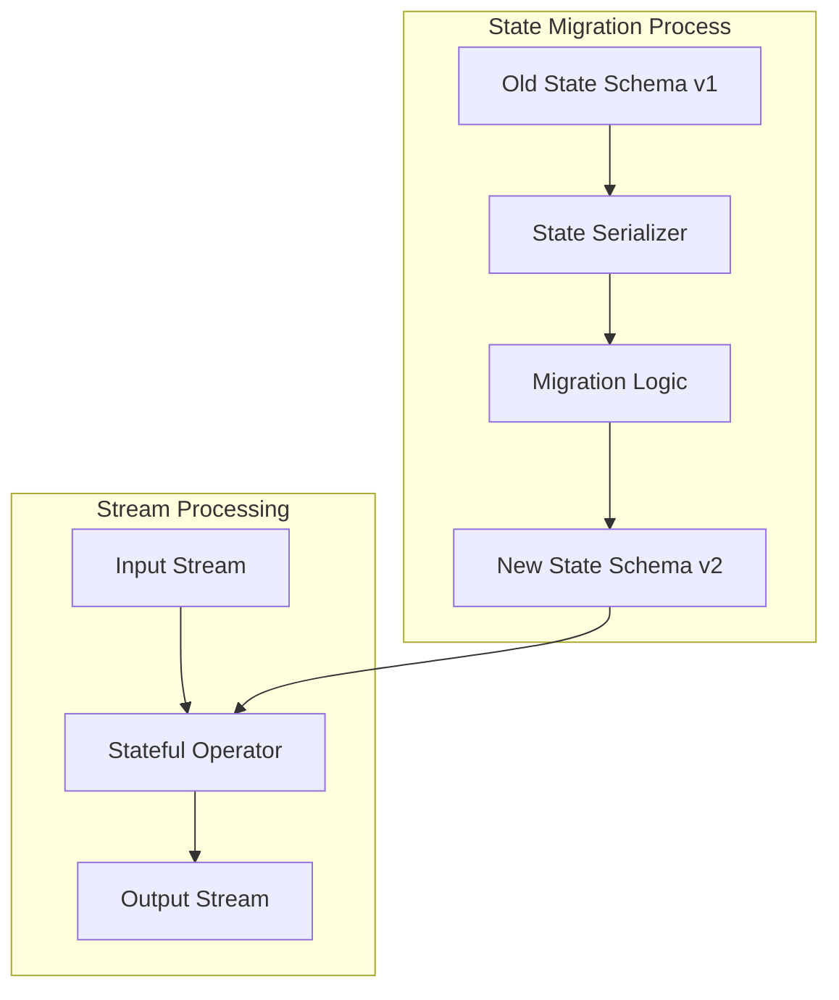
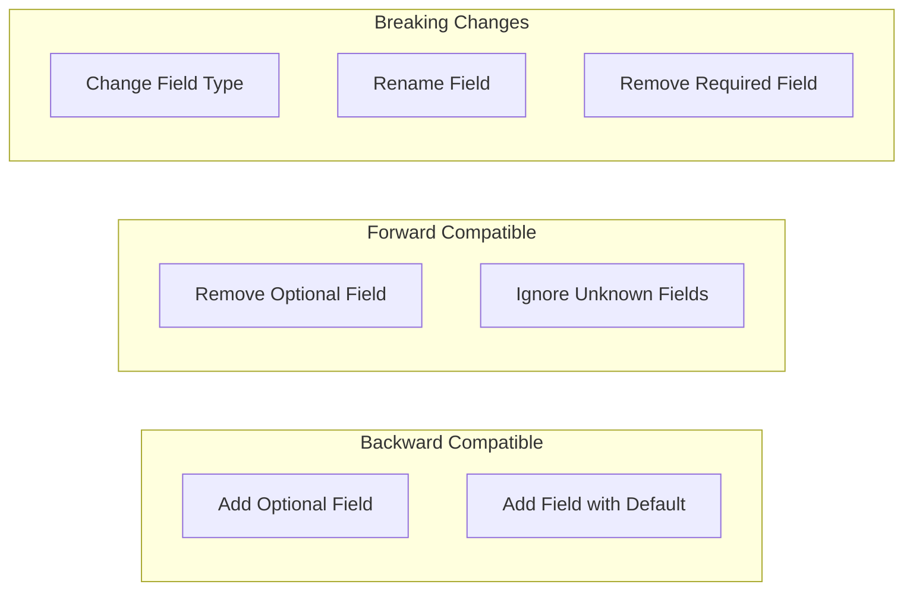
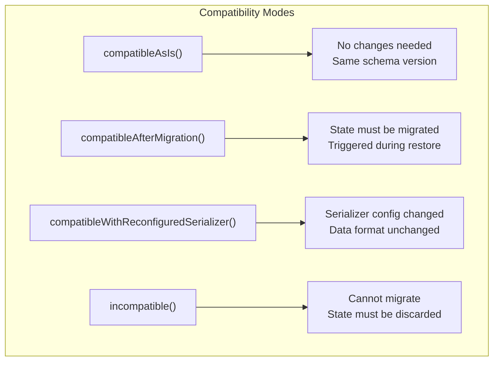
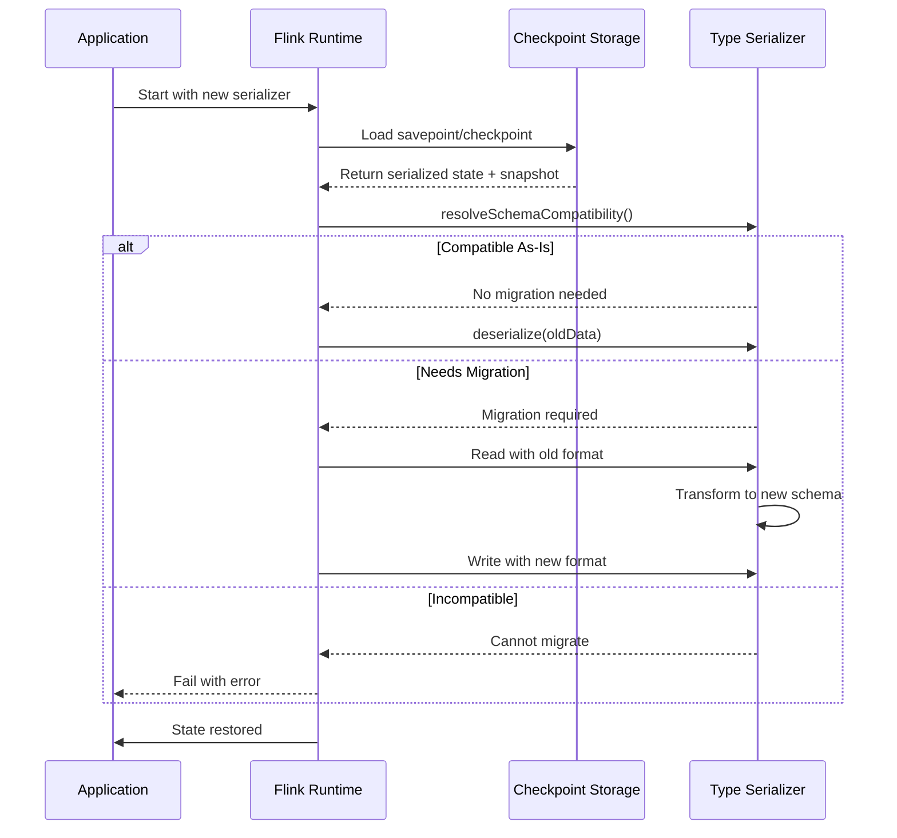
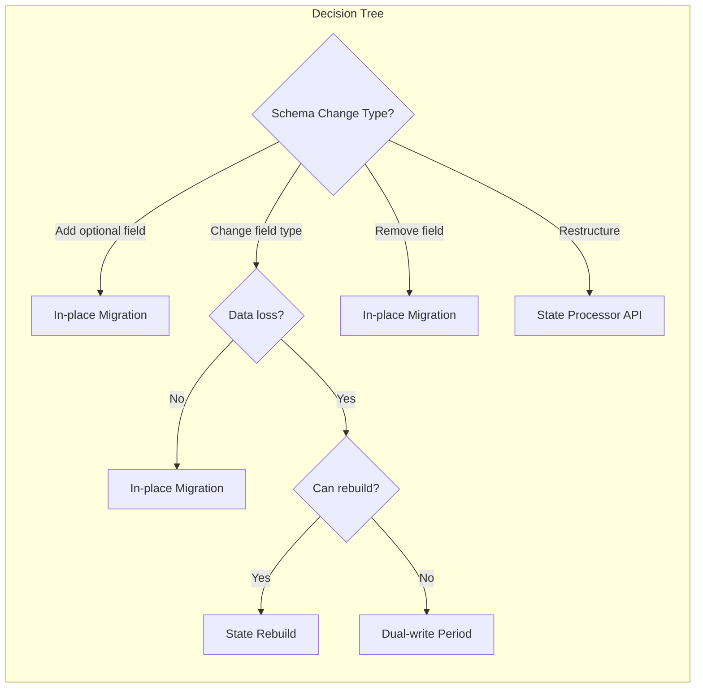

# How to Create State Migration

Author: [nawazdhandala](https://github.com/nawazdhandala)

Tags: Stream Processing, State Migration, Schema Evolution, Apache Flink

Description: Learn to create state migration strategies in stream processing for evolving state schemas without data loss.

---

> State migration is essential for evolving stream processing applications without losing accumulated state. Whether you are adding new fields, changing data types, or restructuring your state schema, proper migration strategies ensure zero data loss and minimal downtime.

Stream processing applications maintain state across events. When your state schema changes, you need a migration path.

---

## Overview

State migration in stream processing involves transforming existing state data to match new schema requirements while the application continues processing events.



---

## Why State Migration Matters

Stream processing applications accumulate state over time:

- **Aggregations**: Running counts, sums, averages
- **Windows**: Time-based or count-based groupings
- **Session data**: User sessions spanning multiple events
- **ML models**: Online learning model parameters

Without proper migration, schema changes force you to discard this valuable state.

---

## State Schema Evolution Types

Understanding the types of schema changes helps you choose the right migration strategy:



---

## Basic State Definition

Start with a simple state class that will evolve over time:

```java
// UserSessionState.java - Version 1
// Initial state schema for tracking user sessions

import org.apache.flink.api.common.state.ValueState;
import org.apache.flink.api.common.state.ValueStateDescriptor;
import org.apache.flink.api.common.typeinfo.TypeInformation;

public class UserSessionState {

    // Unique identifier for the user session
    private String sessionId;

    // Timestamp when the session started (epoch milliseconds)
    private long startTime;

    // Number of events in this session
    private int eventCount;

    // Default constructor required for serialization
    public UserSessionState() {}

    public UserSessionState(String sessionId, long startTime) {
        this.sessionId = sessionId;
        this.startTime = startTime;
        this.eventCount = 0;
    }

    // Increment event counter when new event arrives
    public void recordEvent() {
        this.eventCount++;
    }

    // Getters and setters omitted for brevity
    public String getSessionId() { return sessionId; }
    public long getStartTime() { return startTime; }
    public int getEventCount() { return eventCount; }
}
```

---

## Creating a Custom Type Serializer

Type serializers control how state is written to and read from storage. Creating a versioned serializer enables future migrations:

```java
// UserSessionStateSerializer.java
// Custom serializer with version support for state migration

import org.apache.flink.api.common.typeutils.TypeSerializer;
import org.apache.flink.api.common.typeutils.TypeSerializerSnapshot;
import org.apache.flink.core.memory.DataInputView;
import org.apache.flink.core.memory.DataOutputView;

public class UserSessionStateSerializer
        extends TypeSerializer<UserSessionState> {

    // Version identifier for this serializer format
    // Increment this when the serialization format changes
    private static final int CURRENT_VERSION = 1;

    @Override
    public void serialize(UserSessionState state, DataOutputView target)
            throws IOException {
        // Write version first to enable future migrations
        target.writeInt(CURRENT_VERSION);

        // Write each field in a consistent order
        target.writeUTF(state.getSessionId());
        target.writeLong(state.getStartTime());
        target.writeInt(state.getEventCount());
    }

    @Override
    public UserSessionState deserialize(DataInputView source)
            throws IOException {
        // Read version to determine deserialization logic
        int version = source.readInt();

        // Delegate to version-specific deserialization
        return deserializeVersion(version, source);
    }

    private UserSessionState deserializeVersion(int version,
            DataInputView source) throws IOException {

        switch (version) {
            case 1:
                return deserializeV1(source);
            default:
                throw new IOException(
                    "Unknown serializer version: " + version);
        }
    }

    private UserSessionState deserializeV1(DataInputView source)
            throws IOException {
        // Read fields in the same order they were written
        String sessionId = source.readUTF();
        long startTime = source.readLong();
        int eventCount = source.readInt();

        UserSessionState state = new UserSessionState(sessionId, startTime);
        // Restore the event count using reflection or a setter
        setEventCount(state, eventCount);

        return state;
    }

    @Override
    public TypeSerializerSnapshot<UserSessionState> snapshotConfiguration() {
        // Return a snapshot that captures the current serializer configuration
        return new UserSessionStateSerializerSnapshot();
    }

    // Other required methods (copy, createInstance, etc.) omitted for brevity
}
```

---

## Evolving the State Schema

Now let us add new fields to our state schema. This is a common scenario when adding features:

```java
// UserSessionState.java - Version 2
// Extended state schema with additional tracking fields

public class UserSessionState {

    // Original fields from version 1
    private String sessionId;
    private long startTime;
    private int eventCount;

    // NEW: Track the timestamp of the last event
    // This enables session timeout detection
    private long lastEventTime;

    // NEW: Store the user's device type for analytics
    // Defaults to "unknown" for migrated records
    private String deviceType;

    // NEW: Track total bytes processed in this session
    private long totalBytes;

    public UserSessionState() {
        // Initialize new fields with sensible defaults
        this.lastEventTime = 0L;
        this.deviceType = "unknown";
        this.totalBytes = 0L;
    }

    public UserSessionState(String sessionId, long startTime) {
        this.sessionId = sessionId;
        this.startTime = startTime;
        this.eventCount = 0;
        this.lastEventTime = startTime; // Initialize to start time
        this.deviceType = "unknown";
        this.totalBytes = 0L;
    }

    // Updated method to record events with additional data
    public void recordEvent(long timestamp, String device, long bytes) {
        this.eventCount++;
        this.lastEventTime = timestamp;

        // Only update device if provided and not already set
        if (device != null && "unknown".equals(this.deviceType)) {
            this.deviceType = device;
        }

        this.totalBytes += bytes;
    }

    // Getters for new fields
    public long getLastEventTime() { return lastEventTime; }
    public String getDeviceType() { return deviceType; }
    public long getTotalBytes() { return totalBytes; }
}
```

---

## Implementing the Migration Serializer

Update the serializer to handle both old and new state formats:

```java
// UserSessionStateSerializer.java - Version 2
// Serializer with migration support for schema evolution

public class UserSessionStateSerializer
        extends TypeSerializer<UserSessionState> {

    // Increment version when serialization format changes
    private static final int CURRENT_VERSION = 2;

    @Override
    public void serialize(UserSessionState state, DataOutputView target)
            throws IOException {
        // Always write using the latest version format
        target.writeInt(CURRENT_VERSION);

        // Write all fields including new ones
        target.writeUTF(state.getSessionId());
        target.writeLong(state.getStartTime());
        target.writeInt(state.getEventCount());
        target.writeLong(state.getLastEventTime());  // New in v2
        target.writeUTF(state.getDeviceType());      // New in v2
        target.writeLong(state.getTotalBytes());     // New in v2
    }

    @Override
    public UserSessionState deserialize(DataInputView source)
            throws IOException {
        int version = source.readInt();
        return deserializeVersion(version, source);
    }

    private UserSessionState deserializeVersion(int version,
            DataInputView source) throws IOException {

        switch (version) {
            case 1:
                // Migrate from v1 to current format
                return migrateFromV1(source);
            case 2:
                return deserializeV2(source);
            default:
                throw new IOException(
                    "Unknown serializer version: " + version);
        }
    }

    // Migration logic: read v1 format and create v2 state
    private UserSessionState migrateFromV1(DataInputView source)
            throws IOException {
        // Read v1 fields
        String sessionId = source.readUTF();
        long startTime = source.readLong();
        int eventCount = source.readInt();

        // Create new state with defaults for new fields
        UserSessionState state = new UserSessionState(sessionId, startTime);

        // Restore the event count
        setEventCount(state, eventCount);

        // New fields get default values since they did not exist in v1
        // lastEventTime: use startTime as best approximation
        state.setLastEventTime(startTime);

        // deviceType: default to "unknown" - we cannot know the device
        state.setDeviceType("unknown");

        // totalBytes: default to 0 - we cannot reconstruct this
        state.setTotalBytes(0L);

        return state;
    }

    // Deserialize current version format
    private UserSessionState deserializeV2(DataInputView source)
            throws IOException {
        String sessionId = source.readUTF();
        long startTime = source.readLong();
        int eventCount = source.readInt();
        long lastEventTime = source.readLong();
        String deviceType = source.readUTF();
        long totalBytes = source.readLong();

        UserSessionState state = new UserSessionState(sessionId, startTime);
        setEventCount(state, eventCount);
        state.setLastEventTime(lastEventTime);
        state.setDeviceType(deviceType);
        state.setTotalBytes(totalBytes);

        return state;
    }
}
```

---

## Type Serializer Snapshot for Compatibility

The TypeSerializerSnapshot captures serializer configuration and determines compatibility:

```java
// UserSessionStateSerializerSnapshot.java
// Manages serializer versioning and compatibility checks

import org.apache.flink.api.common.typeutils.TypeSerializerSnapshot;
import org.apache.flink.api.common.typeutils.TypeSerializerSchemaCompatibility;
import org.apache.flink.core.memory.DataInputView;
import org.apache.flink.core.memory.DataOutputView;

public class UserSessionStateSerializerSnapshot
        implements TypeSerializerSnapshot<UserSessionState> {

    // Snapshot version for this snapshot format itself
    private static final int SNAPSHOT_VERSION = 1;

    // The serializer version that created this snapshot
    private int serializerVersion;

    // Default constructor for deserialization
    public UserSessionStateSerializerSnapshot() {}

    public UserSessionStateSerializerSnapshot(int serializerVersion) {
        this.serializerVersion = serializerVersion;
    }

    @Override
    public int getCurrentVersion() {
        return SNAPSHOT_VERSION;
    }

    @Override
    public void writeSnapshot(DataOutputView out) throws IOException {
        // Write the serializer version that created this snapshot
        out.writeInt(serializerVersion);
    }

    @Override
    public void readSnapshot(int readVersion, DataInputView in,
            ClassLoader classLoader) throws IOException {
        // Read the serializer version from the snapshot
        this.serializerVersion = in.readInt();
    }

    @Override
    public TypeSerializerSchemaCompatibility<UserSessionState>
            resolveSchemaCompatibility(
                TypeSerializer<UserSessionState> newSerializer) {

        if (!(newSerializer instanceof UserSessionStateSerializer)) {
            // Different serializer type - incompatible
            return TypeSerializerSchemaCompatibility.incompatible();
        }

        UserSessionStateSerializer typedSerializer =
            (UserSessionStateSerializer) newSerializer;

        int newVersion = typedSerializer.getVersion();

        if (newVersion == serializerVersion) {
            // Same version - fully compatible, no migration needed
            return TypeSerializerSchemaCompatibility.compatibleAsIs();
        }

        if (newVersion > serializerVersion) {
            // Newer serializer can read older format with migration
            // Return the serializer that can perform the migration
            return TypeSerializerSchemaCompatibility
                .compatibleAfterMigration(typedSerializer);
        }

        // Older serializer cannot read newer format
        return TypeSerializerSchemaCompatibility.incompatible();
    }

    @Override
    public TypeSerializer<UserSessionState> restoreSerializer() {
        // Create a serializer that can read the snapshot version
        return new UserSessionStateSerializer(serializerVersion);
    }
}
```

---

## Compatibility Modes Explained

Flink provides four compatibility modes for state migration:



### Compatibility Mode Reference

```java
// CompatibilityModes.java
// Reference implementation showing when to use each mode

public class CompatibilityModeExamples {

    // COMPATIBLE_AS_IS: No migration needed
    // Use when: Schema and serialization format are identical
    public TypeSerializerSchemaCompatibility<MyState> sameVersion() {
        return TypeSerializerSchemaCompatibility.compatibleAsIs();
    }

    // COMPATIBLE_AFTER_MIGRATION: State needs transformation
    // Use when: Schema changed but migration path exists
    public TypeSerializerSchemaCompatibility<MyState>
            schemaEvolved(TypeSerializer<MyState> migrator) {
        // Pass the serializer that can read old format and write new
        return TypeSerializerSchemaCompatibility
            .compatibleAfterMigration(migrator);
    }

    // COMPATIBLE_WITH_RECONFIGURED_SERIALIZER: Config changed
    // Use when: Serializer settings changed but data format did not
    // Example: compression enabled, buffer size changed
    public TypeSerializerSchemaCompatibility<MyState>
            configChanged(TypeSerializer<MyState> reconfigured) {
        return TypeSerializerSchemaCompatibility
            .compatibleWithReconfiguredSerializer(reconfigured);
    }

    // INCOMPATIBLE: Cannot migrate
    // Use when: Breaking change with no migration path
    // Example: Fundamental type change, encrypted to unencrypted
    public TypeSerializerSchemaCompatibility<MyState> breakingChange() {
        return TypeSerializerSchemaCompatibility.incompatible();
    }
}
```

---

## Handling Complex Type Changes

Sometimes you need to change field types, not just add fields:

```java
// MigratingFieldTypes.java
// Example: migrating eventCount from int to long

public class MigratingFieldTypes {

    // Version 1: eventCount is int (max 2.1 billion)
    private int eventCountV1;

    // Version 2: eventCount is long (for high-volume sessions)
    private long eventCountV2;

    // Migration logic in serializer
    public UserSessionState migrateIntToLong(DataInputView source)
            throws IOException {

        String sessionId = source.readUTF();
        long startTime = source.readLong();

        // Read the old int value
        int oldEventCount = source.readInt();

        // Create new state with widened type
        UserSessionState state = new UserSessionState(sessionId, startTime);

        // Safely widen int to long (no data loss)
        state.setEventCount((long) oldEventCount);

        return state;
    }

    // Migration with potential data loss requires validation
    public UserSessionState migrateLongToInt(DataInputView source)
            throws IOException {

        String sessionId = source.readUTF();
        long startTime = source.readLong();

        // Read the long value
        long oldEventCount = source.readLong();

        // Validate: check for overflow before narrowing
        if (oldEventCount > Integer.MAX_VALUE) {
            // Option 1: Cap at max value
            oldEventCount = Integer.MAX_VALUE;

            // Option 2: Throw exception
            // throw new IOException("Event count overflow: " + oldEventCount);
        }

        UserSessionState state = new UserSessionState(sessionId, startTime);
        state.setEventCount((int) oldEventCount);

        return state;
    }
}
```

---

## Nested State Migration

When state contains nested objects, migrations become more complex:

```java
// NestedStateMigration.java
// Handling migration of complex nested state structures

public class OrderState {
    private String orderId;
    private CustomerInfo customer;  // Nested object
    private List<LineItem> items;   // Collection of nested objects

    // Nested class that may also evolve
    public static class CustomerInfo {
        private String customerId;
        private String email;
        private Address address;  // Another nested object
    }
}

// Serializer for nested state
public class OrderStateSerializer extends TypeSerializer<OrderState> {

    // Use separate serializers for nested types
    // This enables independent versioning of nested schemas
    private final CustomerInfoSerializer customerSerializer;
    private final LineItemSerializer lineItemSerializer;

    public OrderStateSerializer() {
        this.customerSerializer = new CustomerInfoSerializer();
        this.lineItemSerializer = new LineItemSerializer();
    }

    @Override
    public void serialize(OrderState state, DataOutputView target)
            throws IOException {
        target.writeInt(CURRENT_VERSION);

        // Serialize primitive fields
        target.writeUTF(state.getOrderId());

        // Delegate nested object serialization
        // Each nested serializer manages its own versioning
        customerSerializer.serialize(state.getCustomer(), target);

        // Serialize collection with length prefix
        List<LineItem> items = state.getItems();
        target.writeInt(items.size());
        for (LineItem item : items) {
            lineItemSerializer.serialize(item, target);
        }
    }

    @Override
    public OrderState deserialize(DataInputView source) throws IOException {
        int version = source.readInt();

        OrderState state = new OrderState();
        state.setOrderId(source.readUTF());

        // Nested serializers handle their own version migration
        state.setCustomer(customerSerializer.deserialize(source));

        int itemCount = source.readInt();
        List<LineItem> items = new ArrayList<>(itemCount);
        for (int i = 0; i < itemCount; i++) {
            items.add(lineItemSerializer.deserialize(source));
        }
        state.setItems(items);

        return state;
    }
}
```

---

## State Migration Flow

The complete flow of state migration during application restart:



---

## Using Avro for Schema Evolution

Apache Avro provides built-in schema evolution support:

```java
// AvroStateMigration.java
// Using Avro schemas for automatic schema evolution

import org.apache.avro.Schema;
import org.apache.avro.SchemaCompatibility;
import org.apache.avro.generic.GenericRecord;

public class AvroStateMigration {

    // Version 1 schema
    private static final String SCHEMA_V1 = """
        {
            "type": "record",
            "name": "UserSession",
            "namespace": "com.example.state",
            "fields": [
                {"name": "sessionId", "type": "string"},
                {"name": "startTime", "type": "long"},
                {"name": "eventCount", "type": "int"}
            ]
        }
        """;

    // Version 2 schema with new fields and defaults
    private static final String SCHEMA_V2 = """
        {
            "type": "record",
            "name": "UserSession",
            "namespace": "com.example.state",
            "fields": [
                {"name": "sessionId", "type": "string"},
                {"name": "startTime", "type": "long"},
                {"name": "eventCount", "type": "int"},
                {"name": "lastEventTime", "type": "long", "default": 0},
                {"name": "deviceType", "type": "string", "default": "unknown"},
                {"name": "totalBytes", "type": "long", "default": 0}
            ]
        }
        """;

    public boolean checkCompatibility() {
        Schema oldSchema = new Schema.Parser().parse(SCHEMA_V1);
        Schema newSchema = new Schema.Parser().parse(SCHEMA_V2);

        // Check if new schema can read data written with old schema
        SchemaCompatibility.SchemaPairCompatibility compatibility =
            SchemaCompatibility.checkReaderWriterCompatibility(
                newSchema,  // reader (new)
                oldSchema   // writer (old)
            );

        return compatibility.getType() ==
            SchemaCompatibility.SchemaCompatibilityType.COMPATIBLE;
    }

    public GenericRecord migrateRecord(GenericRecord oldRecord,
            Schema newSchema) {
        // Avro handles migration automatically when schemas are compatible
        // New fields get their default values
        // Removed fields are ignored

        GenericRecord newRecord = new GenericData.Record(newSchema);

        // Copy existing fields
        for (Schema.Field field : oldRecord.getSchema().getFields()) {
            if (newSchema.getField(field.name()) != null) {
                newRecord.put(field.name(), oldRecord.get(field.name()));
            }
        }

        // New fields already have defaults from schema definition
        return newRecord;
    }
}
```

---

## Flink State Processor API

The State Processor API enables offline state migration and inspection:

```java
// StateProcessorMigration.java
// Using Flink State Processor API for batch state migration

import org.apache.flink.state.api.Savepoint;
import org.apache.flink.state.api.OperatorTransformation;
import org.apache.flink.state.api.functions.KeyedStateReaderFunction;
import org.apache.flink.state.api.functions.KeyedStateBootstrapFunction;

public class StateProcessorMigration {

    public void migrateState(String oldSavepointPath,
            String newSavepointPath) throws Exception {

        // Create execution environment for batch processing
        ExecutionEnvironment env = ExecutionEnvironment
            .getExecutionEnvironment();

        // Load the existing savepoint
        ExistingSavepoint savepoint = Savepoint
            .load(env, oldSavepointPath, new MemoryStateBackend());

        // Read state from the old operator
        DataSet<UserSessionState> oldState = savepoint
            .readKeyedState(
                "session-operator",     // Operator UID
                new SessionStateReader() // Custom reader function
            );

        // Transform the state to new schema
        DataSet<UserSessionStateV2> newState = oldState
            .map(old -> migrateToV2(old));

        // Create new savepoint with migrated state
        Savepoint
            .create(new MemoryStateBackend(), 128)
            .withOperator(
                "session-operator",
                OperatorTransformation
                    .bootstrapWith(newState)
                    .keyBy(state -> state.getSessionId())
                    .transform(new SessionStateWriter())
            )
            .write(newSavepointPath);

        env.execute("State Migration Job");
    }

    // Reader function to extract state from savepoint
    public static class SessionStateReader
            extends KeyedStateReaderFunction<String, UserSessionState> {

        private ValueState<UserSessionState> sessionState;

        @Override
        public void open(Configuration parameters) {
            // Describe the state to read using the OLD descriptor
            ValueStateDescriptor<UserSessionState> descriptor =
                new ValueStateDescriptor<>(
                    "session",
                    TypeInformation.of(UserSessionState.class)
                );
            sessionState = getRuntimeContext().getState(descriptor);
        }

        @Override
        public void readKey(String key, Context ctx,
                Collector<UserSessionState> out) throws Exception {
            // Emit the state value for this key
            UserSessionState state = sessionState.value();
            if (state != null) {
                out.collect(state);
            }
        }
    }

    // Bootstrap function to write migrated state
    public static class SessionStateWriter
            extends KeyedStateBootstrapFunction<String, UserSessionStateV2> {

        private ValueState<UserSessionStateV2> sessionState;

        @Override
        public void open(Configuration parameters) {
            // Describe the state using the NEW descriptor
            ValueStateDescriptor<UserSessionStateV2> descriptor =
                new ValueStateDescriptor<>(
                    "session",
                    TypeInformation.of(UserSessionStateV2.class)
                );
            sessionState = getRuntimeContext().getState(descriptor);
        }

        @Override
        public void processElement(UserSessionStateV2 state, Context ctx)
                throws Exception {
            // Write the migrated state
            sessionState.update(state);
        }
    }

    // Migration logic
    private UserSessionStateV2 migrateToV2(UserSessionState old) {
        UserSessionStateV2 newState = new UserSessionStateV2();

        // Copy existing fields
        newState.setSessionId(old.getSessionId());
        newState.setStartTime(old.getStartTime());
        newState.setEventCount(old.getEventCount());

        // Set defaults for new fields
        newState.setLastEventTime(old.getStartTime());
        newState.setDeviceType("unknown");
        newState.setTotalBytes(0L);

        return newState;
    }
}
```

---

## Testing State Migration

Always test migrations before deploying to production:

```java
// StateMigrationTest.java
// Comprehensive tests for state migration logic

import org.junit.jupiter.api.Test;
import static org.junit.jupiter.api.Assertions.*;

public class StateMigrationTest {

    @Test
    public void testV1ToV2Migration() throws Exception {
        // Create v1 state
        UserSessionState v1State = new UserSessionState(
            "session-123",
            1704067200000L  // 2024-01-01 00:00:00 UTC
        );
        v1State.setEventCount(42);

        // Serialize with v1 serializer
        UserSessionStateSerializerV1 v1Serializer =
            new UserSessionStateSerializerV1();
        byte[] serialized = serializeToBytes(v1State, v1Serializer);

        // Deserialize with v2 serializer (triggers migration)
        UserSessionStateSerializerV2 v2Serializer =
            new UserSessionStateSerializerV2();
        UserSessionStateV2 migrated =
            deserializeFromBytes(serialized, v2Serializer);

        // Verify original fields preserved
        assertEquals("session-123", migrated.getSessionId());
        assertEquals(1704067200000L, migrated.getStartTime());
        assertEquals(42, migrated.getEventCount());

        // Verify new fields have expected defaults
        assertEquals(1704067200000L, migrated.getLastEventTime());
        assertEquals("unknown", migrated.getDeviceType());
        assertEquals(0L, migrated.getTotalBytes());
    }

    @Test
    public void testRoundTripSerialization() throws Exception {
        // Create fully populated v2 state
        UserSessionStateV2 original = new UserSessionStateV2(
            "session-456",
            1704153600000L
        );
        original.setEventCount(100);
        original.setLastEventTime(1704157200000L);
        original.setDeviceType("mobile");
        original.setTotalBytes(1024 * 1024);

        // Serialize and deserialize
        UserSessionStateSerializerV2 serializer =
            new UserSessionStateSerializerV2();
        byte[] serialized = serializeToBytes(original, serializer);
        UserSessionStateV2 restored =
            deserializeFromBytes(serialized, serializer);

        // Verify all fields match
        assertEquals(original.getSessionId(), restored.getSessionId());
        assertEquals(original.getStartTime(), restored.getStartTime());
        assertEquals(original.getEventCount(), restored.getEventCount());
        assertEquals(original.getLastEventTime(), restored.getLastEventTime());
        assertEquals(original.getDeviceType(), restored.getDeviceType());
        assertEquals(original.getTotalBytes(), restored.getTotalBytes());
    }

    @Test
    public void testCompatibilityCheck() {
        // Create snapshot from v1 serializer
        UserSessionStateSerializerSnapshot v1Snapshot =
            new UserSessionStateSerializerSnapshot(1);

        // Check compatibility with v2 serializer
        UserSessionStateSerializerV2 v2Serializer =
            new UserSessionStateSerializerV2();

        TypeSerializerSchemaCompatibility<UserSessionStateV2> compatibility =
            v1Snapshot.resolveSchemaCompatibility(v2Serializer);

        // Should require migration, not be incompatible
        assertTrue(compatibility.isCompatibleAfterMigration());
        assertFalse(compatibility.isIncompatible());
    }

    @Test
    public void testIncompatibleVersionFails() {
        // Create snapshot from future version (v99)
        UserSessionStateSerializerSnapshot futureSnapshot =
            new UserSessionStateSerializerSnapshot(99);

        // Current serializer cannot read future format
        UserSessionStateSerializerV2 currentSerializer =
            new UserSessionStateSerializerV2();

        TypeSerializerSchemaCompatibility<UserSessionStateV2> compatibility =
            futureSnapshot.resolveSchemaCompatibility(currentSerializer);

        // Should be incompatible
        assertTrue(compatibility.isIncompatible());
    }

    // Helper methods for serialization
    private <T> byte[] serializeToBytes(T state, TypeSerializer<T> serializer)
            throws Exception {
        ByteArrayOutputStream baos = new ByteArrayOutputStream();
        DataOutputViewStreamWrapper out =
            new DataOutputViewStreamWrapper(baos);
        serializer.serialize(state, out);
        return baos.toByteArray();
    }

    private <T> T deserializeFromBytes(byte[] data, TypeSerializer<T> serializer)
            throws Exception {
        ByteArrayInputStream bais = new ByteArrayInputStream(data);
        DataInputViewStreamWrapper in =
            new DataInputViewStreamWrapper(bais);
        return serializer.deserialize(in);
    }
}
```

---

## Migration Strategies Comparison

Choose the right strategy based on your requirements:

| Strategy | Downtime | Complexity | Use Case |
|----------|----------|------------|----------|
| In-place migration | Minimal | Low | Adding optional fields |
| State Processor API | Job restart | Medium | Complex transformations |
| Dual-write period | Zero | High | Breaking changes |
| State rebuild | Extended | Low | When history is replayable |



---

## Best Practices

1. **Always version your serializers** - Include version numbers in serialized data
2. **Provide sensible defaults** - New fields should have meaningful default values
3. **Test migrations thoroughly** - Test with real production data snapshots
4. **Keep old serializer code** - Maintain ability to read all historical versions
5. **Document schema changes** - Track what changed between versions
6. **Use savepoints for upgrades** - Take savepoints before deploying schema changes
7. **Plan for rollback** - Ensure you can revert if migration fails
8. **Monitor migration progress** - Track migration metrics during deployment

---

## Common Pitfalls to Avoid

```java
// CommonPitfalls.java
// Examples of what NOT to do in state migration

public class CommonPitfalls {

    // PITFALL 1: Forgetting to handle old versions
    // BAD: Only handles current version
    public UserSessionState badDeserialize(DataInputView source)
            throws IOException {
        // This will fail when reading old state!
        return deserializeV2(source);
    }

    // GOOD: Check version and handle all known versions
    public UserSessionState goodDeserialize(DataInputView source)
            throws IOException {
        int version = source.readInt();
        switch (version) {
            case 1: return migrateFromV1(source);
            case 2: return deserializeV2(source);
            default: throw new IOException("Unknown version: " + version);
        }
    }

    // PITFALL 2: Deleting old serializer code
    // Once deployed, you must keep code to read all historical versions
    // Even if you think all state has been migrated

    // PITFALL 3: Changing field order without version bump
    // BAD: Reordering fields breaks deserialization
    public void badSerialize(UserSessionState state, DataOutputView out) {
        out.writeInt(state.getEventCount());  // Was second, now first
        out.writeLong(state.getStartTime());  // Was third, now second
        out.writeUTF(state.getSessionId());   // Was first, now third
    }

    // PITFALL 4: Using Java serialization
    // BAD: Java serialization is fragile and not portable
    public void badJavaSerialization(UserSessionState state,
            ObjectOutputStream out) {
        out.writeObject(state);  // Breaks easily with class changes
    }

    // PITFALL 5: Not testing with production data
    // Always test migrations with realistic data volumes and edge cases
}
```

---

## Conclusion

State migration is a critical capability for evolving stream processing applications. Key takeaways:

- **Version your serializers** from day one to enable future migrations
- **Choose compatibility modes** based on the type of schema change
- **Test migrations extensively** before deploying to production
- **Use the State Processor API** for complex offline migrations
- **Consider Avro or Protobuf** for built-in schema evolution support

Proper state migration strategies ensure your stream processing applications can evolve without losing valuable accumulated state.

---

*Need to monitor your stream processing applications? [OneUptime](https://oneuptime.com) provides comprehensive monitoring for Apache Flink and other stream processing frameworks with state size tracking and checkpoint alerting.*
