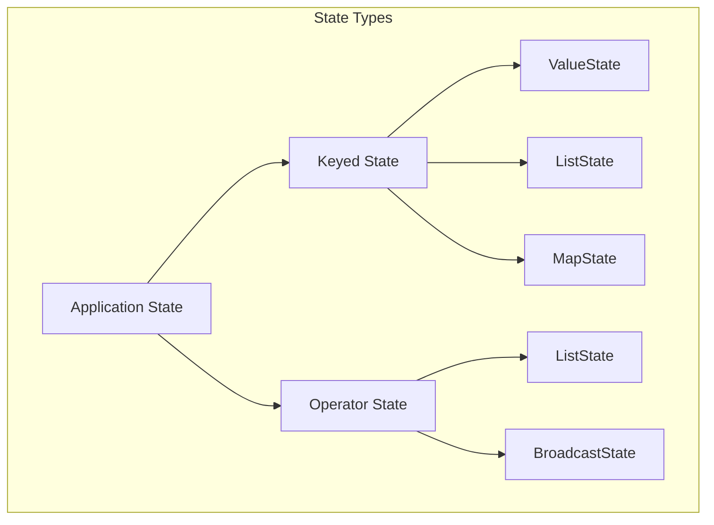
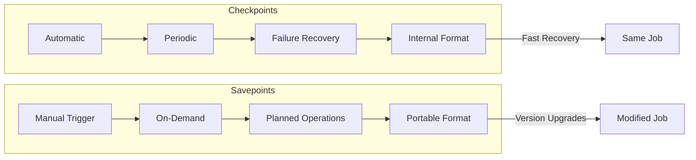
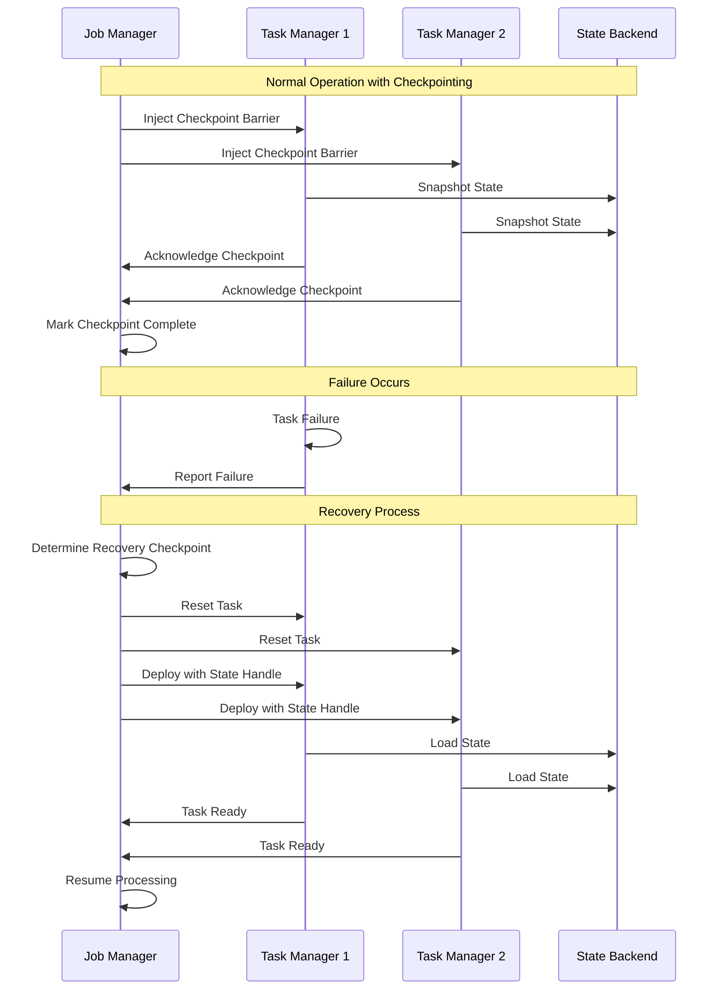
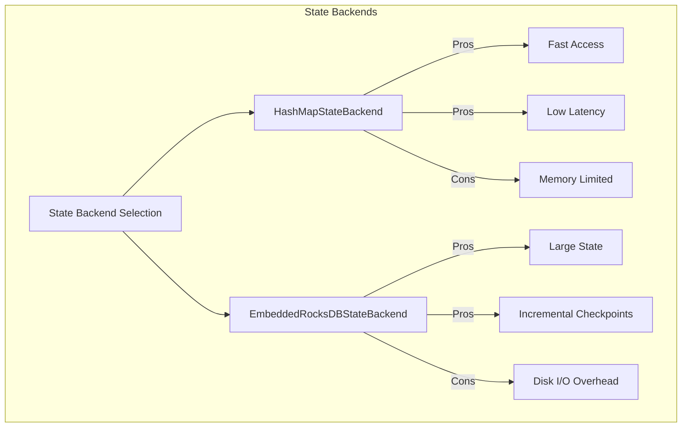
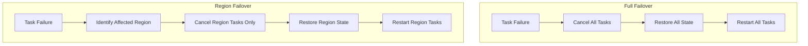
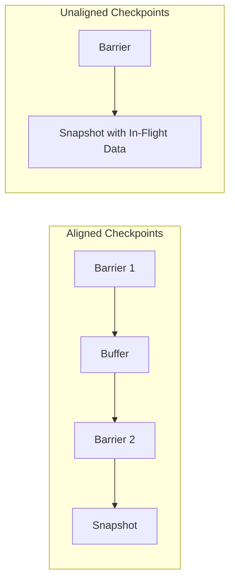

# How to Implement State Recovery

Author: [nawazdhandala](https://github.com/nawazdhandala)

Tags: Stream Processing, State Recovery, Fault Tolerance, Apache Flink

Description: Learn to implement state recovery in stream processing for restoring application state after failures.

---

> State recovery is the backbone of fault tolerance in stream processing systems. When a processing node fails, the ability to restore application state and continue from where processing left off determines whether your system delivers exactly-once semantics or loses data.

Stream processing applications maintain state across events, whether counting occurrences, computing aggregations, or joining streams. Without proper state recovery mechanisms, a failure could mean losing hours of accumulated computation or worse, producing incorrect results.

---

## Understanding State in Stream Processing

Before diving into recovery mechanisms, let's understand what state means in stream processing contexts.

### Types of State



**Keyed State**: Partitioned by key and accessed within keyed operations. Each key has its own isolated state.

**Operator State**: Shared across all records processed by an operator instance. Used for source connectors and non-keyed operations.

### State Example in Apache Flink

Here is a basic example showing both keyed and operator state:

```java
// WordCountState.java
// This class demonstrates keyed state for counting word occurrences
// Keyed state is partitioned by the incoming key (word in this case)

import org.apache.flink.api.common.state.ValueState;
import org.apache.flink.api.common.state.ValueStateDescriptor;
import org.apache.flink.api.common.typeinfo.Types;
import org.apache.flink.configuration.Configuration;
import org.apache.flink.streaming.api.functions.KeyedProcessFunction;
import org.apache.flink.util.Collector;

public class WordCountWithState extends KeyedProcessFunction<String, String, String> {

    // ValueState holds a single value per key
    // This state is automatically partitioned by the key (word)
    private transient ValueState<Long> countState;

    @Override
    public void open(Configuration parameters) throws Exception {
        // Initialize state descriptor with name and type
        // The name is used to identify the state during recovery
        ValueStateDescriptor<Long> descriptor = new ValueStateDescriptor<>(
            "word-count",    // State name used for checkpointing
            Types.LONG       // Type of the state value
        );

        // Obtain the state handle from the runtime context
        // This state is automatically managed and checkpointed
        countState = getRuntimeContext().getState(descriptor);
    }

    @Override
    public void processElement(String word, Context ctx, Collector<String> out)
            throws Exception {
        // Retrieve current count for this key
        // Returns null if no value has been set yet
        Long currentCount = countState.value();

        // Initialize to 0 if this is the first occurrence
        if (currentCount == null) {
            currentCount = 0L;
        }

        // Increment and update the state
        currentCount++;
        countState.update(currentCount);

        // Emit the current count
        out.collect(word + ": " + currentCount);
    }
}
```

---

## Checkpoints vs Savepoints

Understanding the difference between checkpoints and savepoints is crucial for implementing proper state recovery.



### Checkpoint Characteristics

| Aspect | Checkpoint | Savepoint |
|--------|------------|-----------|
| Trigger | Automatic/Periodic | Manual |
| Purpose | Failure Recovery | Planned Operations |
| Format | Internal/Optimized | Portable |
| Lifecycle | Auto-managed | User-managed |
| Use Case | Crash Recovery | Upgrades, Migration |

### Configuring Checkpoints in Flink

```java
// CheckpointConfiguration.java
// This configuration enables checkpointing with specific guarantees
// Checkpoints create consistent snapshots of distributed state

import org.apache.flink.streaming.api.environment.StreamExecutionEnvironment;
import org.apache.flink.streaming.api.CheckpointingMode;
import org.apache.flink.streaming.api.environment.CheckpointConfig;

public class CheckpointConfiguration {

    public static StreamExecutionEnvironment configureCheckpointing(
            StreamExecutionEnvironment env) {

        // Enable checkpointing every 60 seconds
        // This interval balances recovery time vs checkpoint overhead
        env.enableCheckpointing(60000);

        // Get checkpoint config for detailed settings
        CheckpointConfig config = env.getCheckpointConfig();

        // EXACTLY_ONCE ensures each record affects state exactly once
        // AT_LEAST_ONCE provides lower latency but may reprocess records
        config.setCheckpointingMode(CheckpointingMode.EXACTLY_ONCE);

        // Minimum time between checkpoints prevents overlap
        // Useful when checkpoints take longer than the interval
        config.setMinPauseBetweenCheckpoints(30000);

        // Timeout for checkpoint completion
        // Checkpoint fails if not completed within this time
        config.setCheckpointTimeout(120000);

        // Number of concurrent checkpoints allowed
        // Usually 1 to prevent resource contention
        config.setMaxConcurrentCheckpoints(1);

        // Retain checkpoints on job cancellation
        // RETAIN_ON_CANCELLATION keeps checkpoints for manual recovery
        // DELETE_ON_CANCELLATION removes them to save storage
        config.setExternalizedCheckpointCleanup(
            CheckpointConfig.ExternalizedCheckpointCleanup.RETAIN_ON_CANCELLATION
        );

        // Enable unaligned checkpoints for better performance
        // Reduces checkpoint duration under backpressure
        config.enableUnalignedCheckpoints();

        // Tolerate a number of consecutive checkpoint failures
        // Prevents job failure from transient checkpoint issues
        config.setTolerableCheckpointFailureNumber(3);

        return env;
    }
}
```

### Creating and Managing Savepoints

```bash
# Trigger a savepoint manually using the Flink CLI
# The savepoint is stored in the specified directory
flink savepoint <job-id> /path/to/savepoints

# Stop a job with a savepoint (graceful shutdown)
# This ensures no data loss during planned maintenance
flink stop --savepointPath /path/to/savepoints <job-id>

# Cancel a job with a savepoint (immediate stop)
# Use when you need to stop quickly but preserve state
flink cancel -s /path/to/savepoints <job-id>

# Resume a job from a savepoint
# The job restarts with restored state from the savepoint
flink run -s /path/to/savepoints/savepoint-xyz \
    --class com.example.MyStreamJob \
    my-job.jar
```

---

## State Recovery Architecture

The following diagram illustrates how state recovery works in a distributed stream processing system:



---

## State Backend Selection

The state backend determines how state is stored and accessed. Choosing the right backend affects recovery time and performance.

### State Backend Comparison



### Configuring State Backends

```java
// StateBackendConfiguration.java
// Configure the appropriate state backend based on your state size
// and performance requirements

import org.apache.flink.contrib.streaming.state.EmbeddedRocksDBStateBackend;
import org.apache.flink.runtime.state.hashmap.HashMapStateBackend;
import org.apache.flink.streaming.api.environment.StreamExecutionEnvironment;

public class StateBackendConfiguration {

    public static void configureHashMapBackend(StreamExecutionEnvironment env) {
        // HashMapStateBackend stores state in Java heap memory
        // Best for: Small state, low latency requirements
        // Limitation: State must fit in memory

        HashMapStateBackend hashMapBackend = new HashMapStateBackend();
        env.setStateBackend(hashMapBackend);

        // Configure checkpoint storage location
        // This is where snapshots are written during checkpointing
        env.getCheckpointConfig().setCheckpointStorage(
            "hdfs://namenode:8020/flink/checkpoints"
        );
    }

    public static void configureRocksDBBackend(StreamExecutionEnvironment env) {
        // EmbeddedRocksDBStateBackend stores state in RocksDB on local disk
        // Best for: Large state, incremental checkpoints
        // Benefit: State can exceed available memory

        EmbeddedRocksDBStateBackend rocksDBBackend = new EmbeddedRocksDBStateBackend();

        // Enable incremental checkpoints for faster checkpoint creation
        // Only changed data is written to checkpoint storage
        rocksDBBackend.setIncrementalCheckpointsEnabled(true);

        env.setStateBackend(rocksDBBackend);

        // Configure checkpoint storage
        env.getCheckpointConfig().setCheckpointStorage(
            "s3://bucket/flink/checkpoints"
        );
    }
}
```

### RocksDB Tuning for Recovery Performance

```java
// RocksDBTuning.java
// Fine-tune RocksDB for optimal state access and checkpoint performance

import org.apache.flink.contrib.streaming.state.EmbeddedRocksDBStateBackend;
import org.apache.flink.contrib.streaming.state.PredefinedOptions;
import org.apache.flink.configuration.Configuration;

public class RocksDBTuning {

    public static EmbeddedRocksDBStateBackend createOptimizedBackend() {
        EmbeddedRocksDBStateBackend backend = new EmbeddedRocksDBStateBackend();

        // Use predefined options optimized for spinning disks or flash storage
        // SPINNING_DISK_OPTIMIZED: Reduces write amplification
        // FLASH_SSD_OPTIMIZED: Optimizes for SSD characteristics
        backend.setPredefinedOptions(PredefinedOptions.FLASH_SSD_OPTIMIZED);

        // Enable incremental checkpoints
        // Significantly reduces checkpoint time for large state
        backend.setIncrementalCheckpointsEnabled(true);

        return backend;
    }

    public static Configuration getRocksDBConfig() {
        Configuration config = new Configuration();

        // Number of background threads for compaction and flush
        // Higher values improve write throughput but use more CPU
        config.setString("state.backend.rocksdb.thread.num", "4");

        // Write buffer size affects memory usage and write performance
        // Larger buffers reduce write amplification
        config.setString("state.backend.rocksdb.writebuffer.size", "128mb");

        // Number of write buffers before forcing flush
        // More buffers allow more write batching
        config.setString("state.backend.rocksdb.writebuffer.count", "4");

        // Block cache size for read performance
        // Larger cache improves read performance for hot data
        config.setString("state.backend.rocksdb.block.cache-size", "256mb");

        return config;
    }
}
```

---

## Recovery Modes and Strategies

Different failure scenarios require different recovery strategies.

### Recovery Mode Configuration

```java
// RecoveryModeConfiguration.java
// Configure how the job recovers from different types of failures

import org.apache.flink.api.common.restartstrategy.RestartStrategies;
import org.apache.flink.api.common.time.Time;
import org.apache.flink.streaming.api.environment.StreamExecutionEnvironment;
import org.apache.flink.configuration.Configuration;
import org.apache.flink.configuration.RestartStrategyOptions;

public class RecoveryModeConfiguration {

    public static void configureFixedDelayRestart(StreamExecutionEnvironment env) {
        // Fixed delay strategy: Restart a fixed number of times with delay
        // Use when: Failures are transient and limited restarts should succeed

        env.setRestartStrategy(RestartStrategies.fixedDelayRestart(
            3,                      // Maximum restart attempts
            Time.seconds(30)        // Delay between restarts
        ));
    }

    public static void configureExponentialDelayRestart(StreamExecutionEnvironment env) {
        // Exponential delay strategy: Increases delay between restarts
        // Use when: Need to handle cascading failures gracefully

        env.setRestartStrategy(RestartStrategies.exponentialDelayRestart(
            Time.milliseconds(500),  // Initial delay
            Time.minutes(5),         // Maximum delay
            2.0,                     // Backoff multiplier
            Time.hours(1),           // Reset backoff after this idle time
            0.1                      // Jitter factor to prevent thundering herd
        ));
    }

    public static void configureFailureRateRestart(StreamExecutionEnvironment env) {
        // Failure rate strategy: Allows failures within a time window
        // Use when: Some failures are acceptable but too many indicate a problem

        env.setRestartStrategy(RestartStrategies.failureRateRestart(
            5,                       // Maximum failures within interval
            Time.minutes(10),        // Time interval for counting failures
            Time.seconds(30)         // Delay between restarts
        ));
    }

    public static Configuration getClusterRecoveryConfig() {
        Configuration config = new Configuration();

        // Region failover: Only restart affected tasks
        // Full failover: Restart all tasks
        config.setString("jobmanager.execution.failover-strategy", "region");

        // Maximum number of checkpoints to retain
        // More checkpoints provide more recovery points
        config.setInteger("state.checkpoints.num-retained", 3);

        // Enable local recovery for faster restart
        // Tasks restore from local state copy before downloading from storage
        config.setBoolean("state.backend.local-recovery", true);

        return config;
    }
}
```

### Region vs Full Failover



---

## Implementing State Restoration

### Custom Stateful Operator with Recovery

```java
// StatefulOperatorWithRecovery.java
// Demonstrates proper state initialization and restoration patterns

import org.apache.flink.api.common.state.ListState;
import org.apache.flink.api.common.state.ListStateDescriptor;
import org.apache.flink.api.common.state.ValueState;
import org.apache.flink.api.common.state.ValueStateDescriptor;
import org.apache.flink.api.common.typeinfo.Types;
import org.apache.flink.runtime.state.FunctionInitializationContext;
import org.apache.flink.runtime.state.FunctionSnapshotContext;
import org.apache.flink.streaming.api.checkpoint.CheckpointedFunction;
import org.apache.flink.streaming.api.functions.KeyedProcessFunction;
import org.apache.flink.util.Collector;

public class StatefulAggregator
        extends KeyedProcessFunction<String, Event, AggregateResult>
        implements CheckpointedFunction {

    // Keyed state for per-key aggregation
    private transient ValueState<Long> sumState;
    private transient ValueState<Long> countState;

    // Operator state for tracking global metadata
    private transient ListState<Long> processedEventsState;
    private long totalProcessedEvents = 0;

    @Override
    public void initializeState(FunctionInitializationContext context) throws Exception {
        // This method is called during operator initialization
        // It handles both fresh start and recovery from checkpoint

        // Initialize operator state (non-keyed, shared across all keys)
        ListStateDescriptor<Long> processedDescriptor = new ListStateDescriptor<>(
            "processed-events",
            Types.LONG
        );

        processedEventsState = context.getOperatorStateStore()
            .getListState(processedDescriptor);

        // Check if we are restoring from a checkpoint
        if (context.isRestored()) {
            // Restore operator state from checkpoint
            // ListState may contain multiple values across partitions
            for (Long count : processedEventsState.get()) {
                totalProcessedEvents += count;
            }

            // Log restoration for debugging
            System.out.println("Restored state: processed " + totalProcessedEvents + " events");
        }
    }

    @Override
    public void open(org.apache.flink.configuration.Configuration parameters) throws Exception {
        // Initialize keyed state descriptors
        // Keyed state is automatically partitioned and restored per key

        ValueStateDescriptor<Long> sumDescriptor = new ValueStateDescriptor<>(
            "sum",
            Types.LONG
        );

        ValueStateDescriptor<Long> countDescriptor = new ValueStateDescriptor<>(
            "count",
            Types.LONG
        );

        // Get state handles from runtime context
        sumState = getRuntimeContext().getState(sumDescriptor);
        countState = getRuntimeContext().getState(countDescriptor);
    }

    @Override
    public void processElement(Event event, Context ctx, Collector<AggregateResult> out)
            throws Exception {
        // Get current state values (null if first time)
        Long currentSum = sumState.value();
        Long currentCount = countState.value();

        // Initialize state if needed
        if (currentSum == null) {
            currentSum = 0L;
        }
        if (currentCount == null) {
            currentCount = 0L;
        }

        // Update aggregations
        currentSum += event.getValue();
        currentCount++;
        totalProcessedEvents++;

        // Persist updated state
        sumState.update(currentSum);
        countState.update(currentCount);

        // Emit aggregation result
        double average = currentSum.doubleValue() / currentCount;
        out.collect(new AggregateResult(
            event.getKey(),
            currentSum,
            currentCount,
            average
        ));
    }

    @Override
    public void snapshotState(FunctionSnapshotContext context) throws Exception {
        // This method is called when a checkpoint is triggered
        // Persist any state not automatically managed by Flink

        // Clear and update operator state
        processedEventsState.clear();
        processedEventsState.add(totalProcessedEvents);

        // Log checkpoint for debugging
        System.out.println("Checkpoint " + context.getCheckpointId() +
            ": snapshotted " + totalProcessedEvents + " processed events");
    }
}

// Supporting classes
class Event {
    private String key;
    private long value;

    public String getKey() { return key; }
    public long getValue() { return value; }
}

class AggregateResult {
    private String key;
    private long sum;
    private long count;
    private double average;

    public AggregateResult(String key, long sum, long count, double average) {
        this.key = key;
        this.sum = sum;
        this.count = count;
        this.average = average;
    }
}
```

### Source Connector with State Recovery

```java
// RecoverableSource.java
// Implements a source that can recover its position after failure

import org.apache.flink.api.common.state.ListState;
import org.apache.flink.api.common.state.ListStateDescriptor;
import org.apache.flink.api.common.typeinfo.Types;
import org.apache.flink.runtime.state.FunctionInitializationContext;
import org.apache.flink.runtime.state.FunctionSnapshotContext;
import org.apache.flink.streaming.api.checkpoint.CheckpointedFunction;
import org.apache.flink.streaming.api.functions.source.RichParallelSourceFunction;

import java.util.ArrayList;
import java.util.List;

public class RecoverableFileSource
        extends RichParallelSourceFunction<String>
        implements CheckpointedFunction {

    private volatile boolean isRunning = true;

    // Track processed file positions for recovery
    // Each position represents bytes read from the source file
    private List<Long> currentPositions = new ArrayList<>();

    // Checkpointed state for file positions
    private transient ListState<Long> positionState;

    // Configuration
    private final String filePath;
    private final int numPartitions;

    public RecoverableFileSource(String filePath, int numPartitions) {
        this.filePath = filePath;
        this.numPartitions = numPartitions;
    }

    @Override
    public void initializeState(FunctionInitializationContext context) throws Exception {
        // Define state descriptor for position tracking
        ListStateDescriptor<Long> descriptor = new ListStateDescriptor<>(
            "file-positions",
            Types.LONG
        );

        // Get state handle from operator state store
        // Union state redistribution: all positions go to all parallel instances
        positionState = context.getOperatorStateStore().getUnionListState(descriptor);

        if (context.isRestored()) {
            // Recover positions from checkpoint
            // Filter positions relevant to this parallel instance
            int subtaskIndex = getRuntimeContext().getIndexOfThisSubtask();
            int parallelism = getRuntimeContext().getNumberOfParallelSubtasks();

            currentPositions.clear();
            int positionIndex = 0;

            for (Long position : positionState.get()) {
                // Distribute positions round-robin to parallel instances
                if (positionIndex % parallelism == subtaskIndex) {
                    currentPositions.add(position);
                }
                positionIndex++;
            }

            System.out.println("Subtask " + subtaskIndex +
                " restored " + currentPositions.size() + " positions");
        } else {
            // Fresh start: initialize positions to 0
            int subtaskIndex = getRuntimeContext().getIndexOfThisSubtask();
            int parallelism = getRuntimeContext().getNumberOfParallelSubtasks();

            for (int i = subtaskIndex; i < numPartitions; i += parallelism) {
                currentPositions.add(0L);
            }
        }
    }

    @Override
    public void run(SourceContext<String> ctx) throws Exception {
        int subtaskIndex = getRuntimeContext().getIndexOfThisSubtask();

        while (isRunning) {
            // Process each assigned partition
            for (int i = 0; i < currentPositions.size(); i++) {
                long currentPosition = currentPositions.get(i);

                // Read data from current position
                // In real implementation, this would read from file/Kafka/etc.
                String record = readRecordAtPosition(currentPosition);

                if (record != null) {
                    // Synchronize for checkpoint consistency
                    // Lock ensures position update is atomic with record emission
                    synchronized (ctx.getCheckpointLock()) {
                        ctx.collect(record);
                        currentPositions.set(i, currentPosition + record.length());
                    }
                }
            }

            // Small delay to prevent tight loop
            Thread.sleep(10);
        }
    }

    @Override
    public void snapshotState(FunctionSnapshotContext context) throws Exception {
        // Clear previous state and save current positions
        positionState.clear();

        for (Long position : currentPositions) {
            positionState.add(position);
        }

        System.out.println("Checkpoint " + context.getCheckpointId() +
            ": saved positions " + currentPositions);
    }

    @Override
    public void cancel() {
        isRunning = false;
    }

    private String readRecordAtPosition(long position) {
        // Placeholder for actual file reading logic
        // Returns null when no more data available
        return null;
    }
}
```

---

## Handling State Schema Evolution

When upgrading your application, state schema may change. Proper handling ensures seamless recovery.

```java
// StateSchemaEvolution.java
// Demonstrates handling state schema changes during upgrades

import org.apache.flink.api.common.state.ValueState;
import org.apache.flink.api.common.state.ValueStateDescriptor;
import org.apache.flink.api.common.typeinfo.TypeInformation;
import org.apache.flink.streaming.api.functions.KeyedProcessFunction;
import org.apache.flink.util.Collector;

// Version 1 of the state POJO
// Original state structure
class UserStatsV1 {
    public String userId;
    public long loginCount;
    public long lastLoginTimestamp;

    public UserStatsV1() {}

    public UserStatsV1(String userId, long loginCount, long lastLoginTimestamp) {
        this.userId = userId;
        this.loginCount = loginCount;
        this.lastLoginTimestamp = lastLoginTimestamp;
    }
}

// Version 2 of the state POJO with new field
// Flink can automatically migrate if using POJO serializer
class UserStatsV2 {
    public String userId;
    public long loginCount;
    public long lastLoginTimestamp;

    // New field added in V2
    // Must have a default value for migration from V1
    public String lastLoginLocation = "unknown";

    public UserStatsV2() {}

    public UserStatsV2(String userId, long loginCount, long lastLoginTimestamp,
                       String lastLoginLocation) {
        this.userId = userId;
        this.loginCount = loginCount;
        this.lastLoginTimestamp = lastLoginTimestamp;
        this.lastLoginLocation = lastLoginLocation;
    }
}

public class UserStatsProcessor extends KeyedProcessFunction<String, LoginEvent, UserStats> {

    private transient ValueState<UserStatsV2> statsState;

    @Override
    public void open(org.apache.flink.configuration.Configuration parameters) throws Exception {
        // Use TypeInformation for proper serialization
        // POJO serializer handles schema evolution automatically
        ValueStateDescriptor<UserStatsV2> descriptor = new ValueStateDescriptor<>(
            "user-stats",
            TypeInformation.of(UserStatsV2.class)
        );

        statsState = getRuntimeContext().getState(descriptor);
    }

    @Override
    public void processElement(LoginEvent event, Context ctx, Collector<UserStats> out)
            throws Exception {
        // Retrieve existing state (may be migrated from V1)
        UserStatsV2 stats = statsState.value();

        if (stats == null) {
            // Initialize new state
            stats = new UserStatsV2(
                event.getUserId(),
                1L,
                event.getTimestamp(),
                event.getLocation()
            );
        } else {
            // Update existing state
            // If migrated from V1, lastLoginLocation will be "unknown"
            stats.loginCount++;
            stats.lastLoginTimestamp = event.getTimestamp();
            stats.lastLoginLocation = event.getLocation();
        }

        statsState.update(stats);

        // Emit result
        out.collect(new UserStats(
            stats.userId,
            stats.loginCount,
            stats.lastLoginTimestamp,
            stats.lastLoginLocation
        ));
    }
}

// Supporting classes
class LoginEvent {
    private String userId;
    private long timestamp;
    private String location;

    public String getUserId() { return userId; }
    public long getTimestamp() { return timestamp; }
    public String getLocation() { return location; }
}

class UserStats {
    private String userId;
    private long loginCount;
    private long lastLoginTimestamp;
    private String lastLoginLocation;

    public UserStats(String userId, long loginCount, long timestamp, String location) {
        this.userId = userId;
        this.loginCount = loginCount;
        this.lastLoginTimestamp = timestamp;
        this.lastLoginLocation = location;
    }
}
```

---

## Recovery Testing and Validation

Proper testing ensures your state recovery works correctly.

```java
// StateRecoveryTest.java
// Integration test for validating state recovery behavior

import org.apache.flink.api.common.JobID;
import org.apache.flink.runtime.testutils.MiniClusterResourceConfiguration;
import org.apache.flink.streaming.api.environment.StreamExecutionEnvironment;
import org.apache.flink.streaming.api.functions.sink.SinkFunction;
import org.apache.flink.test.util.MiniClusterWithClientResource;
import org.junit.ClassRule;
import org.junit.Test;

import java.util.ArrayList;
import java.util.Collections;
import java.util.List;
import java.util.concurrent.CompletableFuture;

import static org.junit.Assert.assertEquals;
import static org.junit.Assert.assertTrue;

public class StateRecoveryIntegrationTest {

    // Set up mini cluster for testing
    @ClassRule
    public static MiniClusterWithClientResource flinkCluster =
        new MiniClusterWithClientResource(
            new MiniClusterResourceConfiguration.Builder()
                .setNumberSlotsPerTaskManager(2)
                .setNumberTaskManagers(2)
                .build()
        );

    // Collect sink results for validation
    private static class CollectSink implements SinkFunction<String> {
        public static final List<String> values =
            Collections.synchronizedList(new ArrayList<>());

        @Override
        public void invoke(String value, Context context) {
            values.add(value);
        }
    }

    @Test
    public void testStateRecoveryAfterFailure() throws Exception {
        // Clear previous results
        CollectSink.values.clear();

        StreamExecutionEnvironment env = StreamExecutionEnvironment.getExecutionEnvironment();

        // Configure checkpointing for the test
        env.enableCheckpointing(100);  // Frequent checkpoints for testing
        env.setParallelism(2);

        // Configure checkpoint storage
        env.getCheckpointConfig().setCheckpointStorage("file:///tmp/flink-checkpoints");

        // Create a stream that will fail and recover
        env.addSource(new FailingSourceWithState())
            .keyBy(event -> event.getKey())
            .process(new StatefulAggregator())
            .map(result -> result.toString())
            .addSink(new CollectSink());

        // Execute and wait for completion
        env.execute("State Recovery Test");

        // Validate results
        // After recovery, state should be restored and continue correctly
        assertTrue("Should have processed records", CollectSink.values.size() > 0);

        // Verify no duplicate processing (exactly-once semantics)
        // This depends on your specific business logic validation
    }

    @Test
    public void testSavepointRecovery() throws Exception {
        StreamExecutionEnvironment env = StreamExecutionEnvironment.getExecutionEnvironment();
        env.enableCheckpointing(100);

        // First job run: process some data and create savepoint
        // In a real test, you would trigger savepoint via REST API

        // Second job run: restore from savepoint and verify state
        // State values should continue from where savepoint was taken
    }
}

// Test source that simulates failure
class FailingSourceWithState
        extends org.apache.flink.streaming.api.functions.source.RichParallelSourceFunction<Event>
        implements org.apache.flink.streaming.api.checkpoint.CheckpointedFunction {

    private volatile boolean isRunning = true;
    private int emittedCount = 0;
    private boolean hasFailed = false;

    private transient org.apache.flink.api.common.state.ListState<Integer> countState;

    @Override
    public void initializeState(org.apache.flink.runtime.state.FunctionInitializationContext context)
            throws Exception {
        countState = context.getOperatorStateStore().getListState(
            new org.apache.flink.api.common.state.ListStateDescriptor<>("count", Integer.class)
        );

        if (context.isRestored()) {
            for (Integer count : countState.get()) {
                emittedCount = count;
            }
            hasFailed = true;  // Mark that we recovered from failure
        }
    }

    @Override
    public void run(SourceContext<Event> ctx) throws Exception {
        while (isRunning && emittedCount < 100) {
            synchronized (ctx.getCheckpointLock()) {
                ctx.collect(new Event("key-" + (emittedCount % 10), emittedCount));
                emittedCount++;
            }

            // Simulate failure at record 50 (only on first run)
            if (emittedCount == 50 && !hasFailed) {
                throw new RuntimeException("Simulated failure for testing");
            }

            Thread.sleep(10);
        }
    }

    @Override
    public void snapshotState(org.apache.flink.runtime.state.FunctionSnapshotContext context)
            throws Exception {
        countState.clear();
        countState.add(emittedCount);
    }

    @Override
    public void cancel() {
        isRunning = false;
    }
}
```

---

## Monitoring State Recovery

Effective monitoring helps detect and diagnose recovery issues.

```java
// StateRecoveryMetrics.java
// Custom metrics for monitoring state recovery performance

import org.apache.flink.api.common.functions.RichMapFunction;
import org.apache.flink.configuration.Configuration;
import org.apache.flink.metrics.Counter;
import org.apache.flink.metrics.Gauge;
import org.apache.flink.metrics.Histogram;

public class MetricsEnabledProcessor extends RichMapFunction<Event, ProcessedEvent> {

    // Counters for tracking recovery events
    private transient Counter recoveryCounter;
    private transient Counter checkpointCounter;

    // Gauge for current state size
    private transient long currentStateSize = 0;

    // Histogram for recovery duration
    private transient Histogram recoveryDurationHistogram;

    // Track recovery timing
    private transient long recoveryStartTime = 0;

    @Override
    public void open(Configuration parameters) throws Exception {
        // Register recovery counter
        // Tracks how many times this operator has recovered
        recoveryCounter = getRuntimeContext()
            .getMetricGroup()
            .counter("stateRecoveries");

        // Register checkpoint counter
        checkpointCounter = getRuntimeContext()
            .getMetricGroup()
            .counter("checkpointsCompleted");

        // Register state size gauge
        // Reports current state size for monitoring
        getRuntimeContext()
            .getMetricGroup()
            .gauge("stateSize", () -> currentStateSize);

        // Register recovery duration histogram
        recoveryDurationHistogram = getRuntimeContext()
            .getMetricGroup()
            .histogram("recoveryDuration", new DescriptiveStatisticsHistogram(100));
    }

    public void onRecoveryStart() {
        recoveryStartTime = System.currentTimeMillis();
    }

    public void onRecoveryComplete() {
        long recoveryDuration = System.currentTimeMillis() - recoveryStartTime;
        recoveryDurationHistogram.update(recoveryDuration);
        recoveryCounter.inc();
    }

    public void onCheckpointComplete() {
        checkpointCounter.inc();
    }

    public void updateStateSize(long size) {
        currentStateSize = size;
    }

    @Override
    public ProcessedEvent map(Event event) throws Exception {
        // Processing logic here
        return new ProcessedEvent(event);
    }
}

// Supporting classes
class ProcessedEvent {
    private Event event;

    public ProcessedEvent(Event event) {
        this.event = event;
    }
}

// Simple histogram implementation for metrics
class DescriptiveStatisticsHistogram implements org.apache.flink.metrics.Histogram {
    private final int maxSize;
    private final java.util.LinkedList<Long> values = new java.util.LinkedList<>();

    public DescriptiveStatisticsHistogram(int maxSize) {
        this.maxSize = maxSize;
    }

    @Override
    public void update(long value) {
        synchronized (values) {
            values.add(value);
            if (values.size() > maxSize) {
                values.removeFirst();
            }
        }
    }

    @Override
    public long getCount() {
        return values.size();
    }

    @Override
    public org.apache.flink.metrics.HistogramStatistics getStatistics() {
        return new org.apache.flink.metrics.HistogramStatistics() {
            @Override
            public double getQuantile(double quantile) {
                synchronized (values) {
                    if (values.isEmpty()) return 0;
                    java.util.List<Long> sorted = new java.util.ArrayList<>(values);
                    java.util.Collections.sort(sorted);
                    int index = (int) (quantile * sorted.size());
                    return sorted.get(Math.min(index, sorted.size() - 1));
                }
            }

            @Override
            public long[] getValues() {
                synchronized (values) {
                    return values.stream().mapToLong(Long::longValue).toArray();
                }
            }

            @Override
            public int size() {
                return values.size();
            }

            @Override
            public double getMean() {
                synchronized (values) {
                    return values.stream().mapToLong(Long::longValue).average().orElse(0);
                }
            }

            @Override
            public double getStdDev() {
                return 0;  // Simplified implementation
            }

            @Override
            public long getMax() {
                synchronized (values) {
                    return values.stream().mapToLong(Long::longValue).max().orElse(0);
                }
            }

            @Override
            public long getMin() {
                synchronized (values) {
                    return values.stream().mapToLong(Long::longValue).min().orElse(0);
                }
            }
        };
    }
}
```

---

## Best Practices for State Recovery

### 1. Choose Appropriate Checkpoint Intervals

```java
// Balance between recovery time and overhead
// Shorter intervals: Faster recovery, more overhead
// Longer intervals: More data to reprocess, less overhead

// High-throughput jobs: 1-5 minutes
env.enableCheckpointing(60000);  // 1 minute

// Low-latency jobs: 10-30 seconds
env.enableCheckpointing(10000);  // 10 seconds

// Large state jobs: 5-15 minutes with incremental checkpoints
env.enableCheckpointing(300000);  // 5 minutes
```

### 2. Use Incremental Checkpoints for Large State

```java
// Incremental checkpoints only write changed data
// Dramatically reduces checkpoint time for large state

EmbeddedRocksDBStateBackend backend = new EmbeddedRocksDBStateBackend();
backend.setIncrementalCheckpointsEnabled(true);
env.setStateBackend(backend);
```

### 3. Enable Local Recovery

```java
// Local recovery restores from local state before downloading
// Significantly speeds up recovery when task restarts on same machine

Configuration config = new Configuration();
config.setBoolean("state.backend.local-recovery", true);
config.setString("state.checkpoints.dir", "hdfs:///checkpoints");
config.setString("state.backend.rocksdb.localdir", "/local/state");
```

### 4. Implement Proper Checkpoint Alignment



```java
// Unaligned checkpoints include in-flight data
// Reduces checkpoint duration under backpressure
env.getCheckpointConfig().enableUnalignedCheckpoints();
```

### 5. Monitor Checkpoint Health

Key metrics to monitor:

| Metric | Description | Target |
|--------|-------------|--------|
| Checkpoint Duration | Time to complete checkpoint | < 50% of interval |
| Checkpoint Size | Data written per checkpoint | Stable trend |
| Failed Checkpoints | Checkpoint failures | 0 |
| End-to-End Duration | Full checkpoint cycle | < Checkpoint interval |

---

## Conclusion

State recovery is essential for building reliable stream processing applications. Key takeaways:

1. **Understand your state types**: Keyed state for per-key data, operator state for global data
2. **Choose the right state backend**: HashMapStateBackend for small state, RocksDBStateBackend for large state
3. **Configure appropriate checkpointing**: Balance recovery time against checkpoint overhead
4. **Use savepoints for planned operations**: Version upgrades, topology changes, migrations
5. **Test recovery thoroughly**: Validate exactly-once semantics and state consistency
6. **Monitor checkpoint health**: Track duration, size, and failures

Implementing proper state recovery ensures your stream processing applications can handle failures gracefully while maintaining data consistency and processing guarantees.

---

*Building stream processing applications requires robust monitoring and observability. [OneUptime](https://oneuptime.com) provides comprehensive monitoring for your streaming infrastructure, including metrics, logs, and traces. Get started today to ensure your applications are always running smoothly.*

**Related Reading:**
- [Understanding Fault Tolerance in Distributed Systems](https://oneuptime.com/blog)
- [Stream Processing Architecture Patterns](https://oneuptime.com/blog)
- [Monitoring Apache Flink Applications](https://oneuptime.com/blog)
