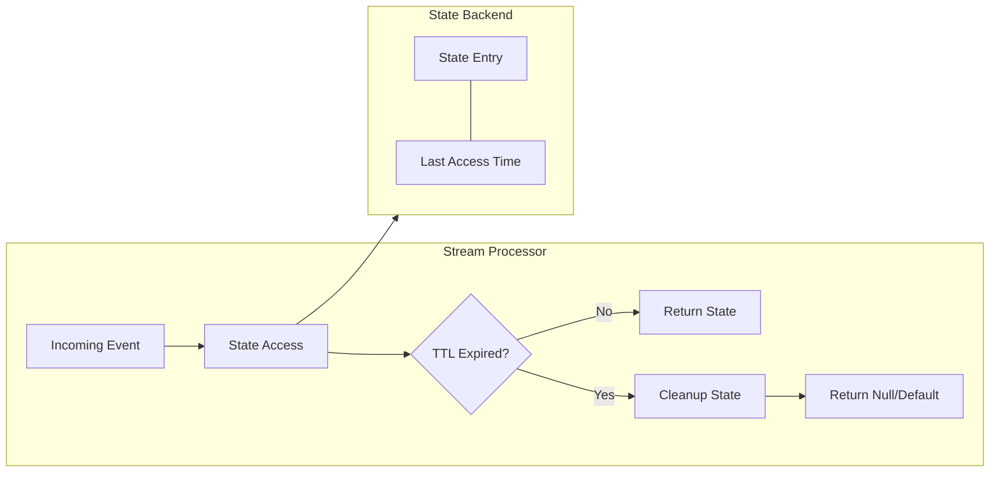
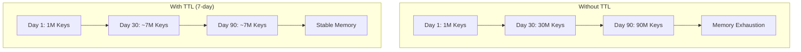
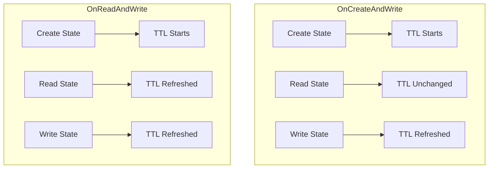
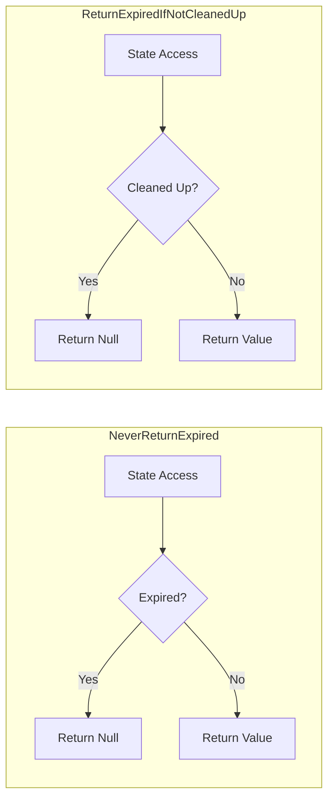
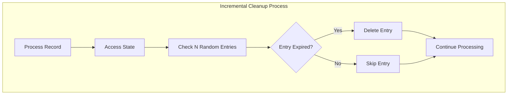
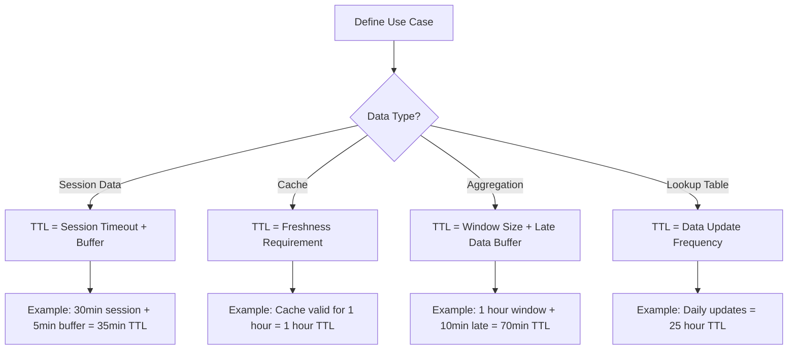

# How to Implement State TTL

Author: [nawazdhandala](https://github.com/nawazdhandala)

Tags: Stream Processing, State TTL, State Management, Apache Flink

Description: Learn to implement state TTL (Time-To-Live) in stream processing for automatic state expiration and cleanup.

---

> State in stream processing grows unbounded without proper management. TTL (Time-To-Live) provides automatic state expiration, preventing memory exhaustion and keeping your streaming applications healthy. This guide covers TTL implementation patterns in Apache Flink.

Unbounded state is a silent killer of streaming applications. TTL keeps state under control automatically.

---

## Overview

State TTL allows you to define how long state entries should be retained before automatic cleanup. When state entries expire, they are removed during cleanup cycles or when accessed.



---

## Why State TTL Matters

Stream processing applications often maintain state per key, such as user sessions, aggregation windows, or entity metadata. Without proper cleanup:

- **Memory grows indefinitely** as new keys appear
- **State backends fill up** causing checkpoint failures
- **Query performance degrades** with larger state sizes
- **Recovery time increases** with more state to restore

State TTL solves these problems by automatically expiring old entries.



---

## Basic TTL Configuration

### Enabling State TTL in Apache Flink

Configure TTL when creating state descriptors. The TTL configuration defines expiration time and behavior:

```java
// StateTtlConfig.java
import org.apache.flink.api.common.state.StateTtlConfig;
import org.apache.flink.api.common.state.ValueStateDescriptor;
import org.apache.flink.api.common.time.Time;

public class UserSessionProcessor extends KeyedProcessFunction<String, UserEvent, SessionOutput> {

    // Declare transient state - will be initialized in open()
    private transient ValueState<UserSession> sessionState;

    @Override
    public void open(Configuration parameters) {
        // Configure TTL with 1-hour expiration
        // State entries not accessed for 1 hour will be eligible for cleanup
        StateTtlConfig ttlConfig = StateTtlConfig
            .newBuilder(Time.hours(1))  // TTL duration
            .setUpdateType(StateTtlConfig.UpdateType.OnCreateAndWrite)  // When to refresh TTL
            .setStateVisibility(StateTtlConfig.StateVisibility.NeverReturnExpired)  // Visibility of expired state
            .build();

        // Create state descriptor with TTL enabled
        ValueStateDescriptor<UserSession> descriptor = new ValueStateDescriptor<>(
            "user-session",  // State name for debugging and metrics
            UserSession.class  // State type
        );

        // Enable TTL on the descriptor
        descriptor.enableTimeToLive(ttlConfig);

        // Get state handle from runtime context
        sessionState = getRuntimeContext().getState(descriptor);
    }

    @Override
    public void processElement(UserEvent event, Context ctx, Collector<SessionOutput> out) throws Exception {
        // Get current session or null if expired/missing
        UserSession session = sessionState.value();

        if (session == null) {
            // Create new session for new user or expired session
            session = new UserSession(event.getUserId(), event.getTimestamp());
        }

        // Update session with new event
        session.addEvent(event);

        // Save session - this also refreshes the TTL timestamp
        sessionState.update(session);

        // Emit session summary if needed
        if (session.isComplete()) {
            out.collect(session.toOutput());
        }
    }
}
```

---

## TTL Update Types

The update type determines when the TTL timestamp is refreshed. Choose based on your access patterns:



### OnCreateAndWrite (Default)

TTL is refreshed only when state is created or modified. Reading state does not extend its lifetime:

```java
// OnCreateAndWrite - state expires based on last write time
// Use when: reads should not keep state alive
// Example: cache entries that should expire even if frequently read
StateTtlConfig ttlConfig = StateTtlConfig
    .newBuilder(Time.minutes(30))
    .setUpdateType(StateTtlConfig.UpdateType.OnCreateAndWrite)
    .build();
```

### OnReadAndWrite

TTL is refreshed on any state access, including reads. Active keys stay alive longer:

```java
// OnReadAndWrite - any access refreshes the TTL
// Use when: active usage should keep state alive
// Example: user sessions where viewing data indicates activity
StateTtlConfig ttlConfig = StateTtlConfig
    .newBuilder(Time.minutes(30))
    .setUpdateType(StateTtlConfig.UpdateType.OnReadAndWrite)
    .build();
```

---

## State Visibility Options

Visibility controls whether expired but not yet cleaned state can be returned:



### NeverReturnExpired (Recommended)

Expired state is never returned, even if not yet physically cleaned:

```java
// Strict TTL enforcement - expired state is always treated as null
// Pros: Consistent behavior, predictable expiration
// Cons: Small overhead for checking timestamps on every access
StateTtlConfig ttlConfig = StateTtlConfig
    .newBuilder(Time.hours(1))
    .setStateVisibility(StateTtlConfig.StateVisibility.NeverReturnExpired)
    .build();
```

### ReturnExpiredIfNotCleanedUp

Expired state may be returned if cleanup has not run yet:

```java
// Relaxed TTL enforcement - may return stale data
// Pros: Slightly better read performance (no timestamp check)
// Cons: Inconsistent behavior depending on cleanup timing
// Use only when eventual expiration is acceptable
StateTtlConfig ttlConfig = StateTtlConfig
    .newBuilder(Time.hours(1))
    .setStateVisibility(StateTtlConfig.StateVisibility.ReturnExpiredIfNotCleanedUp)
    .build();
```

---

## Cleanup Strategies

### Full Snapshot Cleanup

Expired entries are removed during snapshot (checkpoint) operations:

```java
// Full snapshot cleanup - cleans expired state during checkpoints
// Pros: No additional background overhead
// Cons: State size not reduced between checkpoints
StateTtlConfig ttlConfig = StateTtlConfig
    .newBuilder(Time.hours(1))
    .cleanupFullSnapshot()  // Enable cleanup during snapshots
    .build();
```

### Incremental Cleanup

Expired entries are cleaned incrementally during state access:

```java
// Incremental cleanup - cleans expired entries on each state access
// cleanupSize: number of entries to check per access (default: 5)
// runCleanupForEveryRecord: whether to run on every record (default: false)
StateTtlConfig ttlConfig = StateTtlConfig
    .newBuilder(Time.hours(1))
    .cleanupIncrementally(
        10,    // Check 10 entries per cleanup cycle
        true   // Run cleanup on every record processed
    )
    .build();
```



### RocksDB Compaction Filter (Recommended for RocksDB Backend)

For RocksDB state backend, enable compaction filter for efficient cleanup:

```java
// RocksDB compaction filter - cleans expired entries during RocksDB compaction
// Most efficient for RocksDB backend - cleanup happens during native compaction
// queryTimeAfterNumEntries: check expiration after processing N entries (performance tuning)
StateTtlConfig ttlConfig = StateTtlConfig
    .newBuilder(Time.hours(1))
    .cleanupInRocksdbCompactFilter(
        1000  // Query current time after every 1000 entries (reduces system calls)
    )
    .build();
```

---

## Complete Configuration Example

Here is a production-ready TTL configuration with all options:

```java
// ProductionTtlConfig.java
import org.apache.flink.api.common.state.StateTtlConfig;
import org.apache.flink.api.common.state.MapStateDescriptor;
import org.apache.flink.api.common.time.Time;

public class ProductionStateProcessor extends KeyedProcessFunction<String, Event, Result> {

    private transient MapState<String, EntityData> entityCache;

    @Override
    public void open(Configuration parameters) {
        // Production TTL configuration with all recommended settings
        StateTtlConfig ttlConfig = StateTtlConfig
            // Set TTL duration - entries expire after 24 hours of inactivity
            .newBuilder(Time.hours(24))

            // Refresh TTL on both read and write operations
            // Active entities stay alive, inactive ones expire
            .setUpdateType(StateTtlConfig.UpdateType.OnReadAndWrite)

            // Never return expired state - strict consistency
            .setStateVisibility(StateTtlConfig.StateVisibility.NeverReturnExpired)

            // Use incremental cleanup for heap state backend
            // Checks 5 entries per record, runs on every record
            .cleanupIncrementally(5, true)

            // Also enable snapshot cleanup as a fallback
            .cleanupFullSnapshot()

            // Build the configuration
            .build();

        // Create MapState descriptor for caching entity data by ID
        MapStateDescriptor<String, EntityData> descriptor = new MapStateDescriptor<>(
            "entity-cache",
            String.class,      // Key type: entity ID
            EntityData.class   // Value type: cached entity data
        );

        descriptor.enableTimeToLive(ttlConfig);

        entityCache = getRuntimeContext().getMapState(descriptor);
    }

    @Override
    public void processElement(Event event, Context ctx, Collector<Result> out) throws Exception {
        String entityId = event.getEntityId();

        // Get cached entity or null if not present/expired
        EntityData entity = entityCache.get(entityId);

        if (entity == null) {
            // Fetch from external source on cache miss
            entity = fetchEntityFromDatabase(entityId);

            // Cache for future lookups - TTL starts now
            entityCache.put(entityId, entity);
        }

        // Process event with entity context
        Result result = processWithEntity(event, entity);
        out.collect(result);
    }
}
```

---

## TTL for Different State Types

### ValueState with TTL

Single value per key with automatic expiration:

```java
// ValueState - stores single value per key
// Use for: user preferences, session data, latest state
ValueStateDescriptor<UserPreferences> descriptor = new ValueStateDescriptor<>(
    "user-preferences",
    UserPreferences.class
);

StateTtlConfig ttlConfig = StateTtlConfig
    .newBuilder(Time.days(30))  // Preferences expire after 30 days of inactivity
    .setUpdateType(StateTtlConfig.UpdateType.OnReadAndWrite)
    .build();

descriptor.enableTimeToLive(ttlConfig);
ValueState<UserPreferences> preferences = getRuntimeContext().getState(descriptor);
```

### ListState with TTL

List of values per key with TTL on the entire list:

```java
// ListState - stores list of values per key
// Note: TTL applies to entire list, not individual elements
// Use for: event history, recent actions, audit logs
ListStateDescriptor<AuditEvent> descriptor = new ListStateDescriptor<>(
    "audit-events",
    AuditEvent.class
);

StateTtlConfig ttlConfig = StateTtlConfig
    .newBuilder(Time.days(7))  // Audit log expires after 7 days
    .setUpdateType(StateTtlConfig.UpdateType.OnCreateAndWrite)
    .build();

descriptor.enableTimeToLive(ttlConfig);
ListState<AuditEvent> auditLog = getRuntimeContext().getListState(descriptor);
```

### MapState with TTL

Map entries with individual TTL per entry:

```java
// MapState - stores key-value pairs per keyed stream key
// TTL applies to individual map entries independently
// Use for: multi-attribute caches, feature stores, lookup tables
MapStateDescriptor<String, FeatureVector> descriptor = new MapStateDescriptor<>(
    "feature-store",
    String.class,       // Feature name
    FeatureVector.class // Feature value
);

StateTtlConfig ttlConfig = StateTtlConfig
    .newBuilder(Time.hours(6))  // Features expire after 6 hours
    .setUpdateType(StateTtlConfig.UpdateType.OnReadAndWrite)
    .build();

descriptor.enableTimeToLive(ttlConfig);
MapState<String, FeatureVector> featureStore = getRuntimeContext().getMapState(descriptor);
```

---

## Monitoring State TTL

### Custom Metrics for TTL Monitoring

Track TTL effectiveness with custom metrics:

```java
// TtlMetricsProcessor.java
import org.apache.flink.metrics.Counter;
import org.apache.flink.metrics.Gauge;

public class TtlMetricsProcessor extends KeyedProcessFunction<String, Event, Result> {

    private transient ValueState<CachedData> cache;

    // Metrics to track TTL behavior
    private transient Counter cacheHits;
    private transient Counter cacheMisses;
    private transient Counter ttlExpirations;

    @Override
    public void open(Configuration parameters) {
        // Initialize TTL-enabled state
        StateTtlConfig ttlConfig = StateTtlConfig
            .newBuilder(Time.hours(1))
            .setUpdateType(StateTtlConfig.UpdateType.OnReadAndWrite)
            .setStateVisibility(StateTtlConfig.StateVisibility.NeverReturnExpired)
            .build();

        ValueStateDescriptor<CachedData> descriptor = new ValueStateDescriptor<>(
            "cache",
            CachedData.class
        );
        descriptor.enableTimeToLive(ttlConfig);
        cache = getRuntimeContext().getState(descriptor);

        // Register metrics for monitoring TTL effectiveness
        // These metrics help tune TTL duration and identify cache efficiency
        cacheHits = getRuntimeContext()
            .getMetricGroup()
            .counter("cache_hits");

        cacheMisses = getRuntimeContext()
            .getMetricGroup()
            .counter("cache_misses");

        ttlExpirations = getRuntimeContext()
            .getMetricGroup()
            .counter("ttl_expirations");
    }

    @Override
    public void processElement(Event event, Context ctx, Collector<Result> out) throws Exception {
        CachedData data = cache.value();

        if (data != null) {
            // Cache hit - data was present and not expired
            cacheHits.inc();
        } else {
            // Cache miss - data was either never stored or expired
            cacheMisses.inc();

            // Determine if this was a TTL expiration (key existed before)
            // In practice, track this with a separate lightweight state or external counter

            // Fetch and cache new data
            data = fetchData(event.getKey());
            cache.update(data);
        }

        out.collect(processData(event, data));
    }
}
```

---

## Best Practices

### Choosing TTL Duration



### Configuration Recommendations

1. **Start Conservative**: Begin with longer TTL and reduce based on monitoring
2. **Monitor State Size**: Track state size metrics to validate TTL effectiveness
3. **Use NeverReturnExpired**: Ensures consistent behavior across cleanup cycles
4. **Enable Incremental Cleanup**: Prevents state size spikes between checkpoints
5. **Tune Cleanup Parameters**: Balance cleanup overhead with state size reduction

```java
// Recommended production configuration template
public static StateTtlConfig createProductionTtlConfig(Time ttlDuration) {
    return StateTtlConfig
        .newBuilder(ttlDuration)
        // Refresh on all access for user-facing state
        .setUpdateType(StateTtlConfig.UpdateType.OnReadAndWrite)
        // Strict expiration semantics
        .setStateVisibility(StateTtlConfig.StateVisibility.NeverReturnExpired)
        // Incremental cleanup for steady state size
        .cleanupIncrementally(10, true)
        // Snapshot cleanup as fallback
        .cleanupFullSnapshot()
        .build();
}
```

---

## Common Patterns

### Session State with TTL

Maintain user sessions that automatically expire:

```java
// SessionProcessor.java
public class SessionProcessor extends KeyedProcessFunction<String, ClickEvent, Session> {

    // Session state with 30-minute TTL
    private transient ValueState<Session> sessionState;

    // Track session timeout with timer
    private transient ValueState<Long> timerState;

    private static final long SESSION_TIMEOUT = 30 * 60 * 1000L; // 30 minutes

    @Override
    public void open(Configuration parameters) {
        // Configure session state with TTL matching session timeout
        // Add buffer to TTL to allow for timer-based session completion
        StateTtlConfig ttlConfig = StateTtlConfig
            .newBuilder(Time.minutes(35))  // 30min timeout + 5min buffer
            .setUpdateType(StateTtlConfig.UpdateType.OnReadAndWrite)
            .setStateVisibility(StateTtlConfig.StateVisibility.NeverReturnExpired)
            .cleanupIncrementally(5, true)
            .build();

        ValueStateDescriptor<Session> sessionDescriptor = new ValueStateDescriptor<>(
            "session",
            Session.class
        );
        sessionDescriptor.enableTimeToLive(ttlConfig);
        sessionState = getRuntimeContext().getState(sessionDescriptor);

        // Timer state also needs TTL to prevent accumulation
        ValueStateDescriptor<Long> timerDescriptor = new ValueStateDescriptor<>(
            "timer",
            Long.class
        );
        timerDescriptor.enableTimeToLive(ttlConfig);
        timerState = getRuntimeContext().getState(timerDescriptor);
    }

    @Override
    public void processElement(ClickEvent event, Context ctx, Collector<Session> out) throws Exception {
        Session session = sessionState.value();

        // Cancel existing timer if present
        Long existingTimer = timerState.value();
        if (existingTimer != null) {
            ctx.timerService().deleteProcessingTimeTimer(existingTimer);
        }

        if (session == null) {
            // Start new session
            session = new Session(event.getUserId(), event.getTimestamp());
        }

        // Add event to session
        session.addClick(event);
        sessionState.update(session);

        // Set new timeout timer
        long timerTime = ctx.timerService().currentProcessingTime() + SESSION_TIMEOUT;
        ctx.timerService().registerProcessingTimeTimer(timerTime);
        timerState.update(timerTime);
    }

    @Override
    public void onTimer(long timestamp, OnTimerContext ctx, Collector<Session> out) throws Exception {
        // Timer fired - session timed out
        Session session = sessionState.value();

        if (session != null) {
            // Emit completed session
            session.setEndTime(timestamp);
            out.collect(session);

            // Clear state (will be cleaned by TTL anyway, but explicit is clearer)
            sessionState.clear();
            timerState.clear();
        }
    }
}
```

### Deduplication with TTL

Deduplicate events within a time window using TTL:

```java
// DeduplicationProcessor.java
public class DeduplicationProcessor extends KeyedProcessFunction<String, Event, Event> {

    // Track seen event IDs with TTL for automatic cleanup
    private transient ValueState<Boolean> seenState;

    @Override
    public void open(Configuration parameters) {
        // Deduplicate within 1-hour window
        // After 1 hour, same event ID can appear again (considered new)
        StateTtlConfig ttlConfig = StateTtlConfig
            .newBuilder(Time.hours(1))
            .setUpdateType(StateTtlConfig.UpdateType.OnCreateAndWrite)  // Write-only refresh
            .setStateVisibility(StateTtlConfig.StateVisibility.NeverReturnExpired)
            .cleanupIncrementally(10, true)
            .build();

        ValueStateDescriptor<Boolean> descriptor = new ValueStateDescriptor<>(
            "seen",
            Boolean.class
        );
        descriptor.enableTimeToLive(ttlConfig);
        seenState = getRuntimeContext().getState(descriptor);
    }

    @Override
    public void processElement(Event event, Context ctx, Collector<Event> out) throws Exception {
        Boolean seen = seenState.value();

        if (seen == null) {
            // First time seeing this event ID within TTL window
            seenState.update(true);
            out.collect(event);
        }
        // else: duplicate within TTL window, drop the event
    }
}
```

---

## Troubleshooting

### State Not Expiring

If state is not expiring as expected:

1. **Check update type**: OnReadAndWrite refreshes TTL on reads
2. **Verify cleanup is enabled**: At least one cleanup strategy must be active
3. **Monitor checkpoint intervals**: Full snapshot cleanup only runs during checkpoints
4. **Check clock skew**: TTL uses processing time, ensure consistent time across workers

### Memory Still Growing

If memory grows despite TTL:

1. **TTL too long**: Reduce TTL duration based on actual data lifetime needs
2. **High cardinality keys**: Many unique keys with long TTL accumulate quickly
3. **Cleanup not keeping up**: Increase incremental cleanup rate
4. **State serialization overhead**: Large state objects consume more memory per entry

### Performance Impact

To minimize TTL overhead:

```java
// Optimized cleanup configuration for high-throughput applications
StateTtlConfig ttlConfig = StateTtlConfig
    .newBuilder(Time.hours(1))
    .setUpdateType(StateTtlConfig.UpdateType.OnCreateAndWrite)  // Lower overhead than OnReadAndWrite
    .setStateVisibility(StateTtlConfig.StateVisibility.ReturnExpiredIfNotCleanedUp)  // No timestamp check on read
    .cleanupIncrementally(5, false)  // Run cleanup occasionally, not every record
    .cleanupInRocksdbCompactFilter(10000)  // For RocksDB: batch time queries
    .build();
```

---

## Conclusion

State TTL is essential for production stream processing applications. Key takeaways:

- **Configure TTL on all state** that can grow unbounded
- **Choose update type** based on whether reads should extend lifetime
- **Use NeverReturnExpired** for consistent behavior
- **Enable cleanup strategies** appropriate for your state backend
- **Monitor state size** to validate TTL effectiveness

Proper TTL configuration keeps your streaming applications healthy and prevents the silent accumulation of state that leads to production incidents.

---

*Building stream processing applications? [OneUptime](https://oneuptime.com) provides comprehensive monitoring for Apache Flink and other streaming platforms, helping you track state size, checkpoint duration, and processing latency.*
