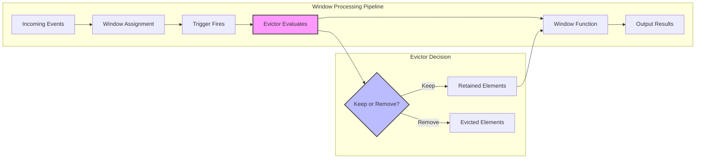
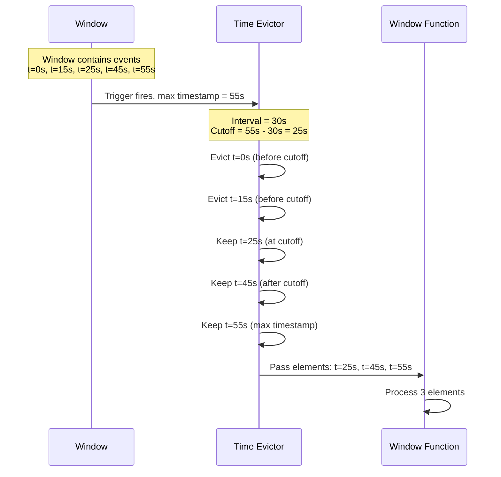
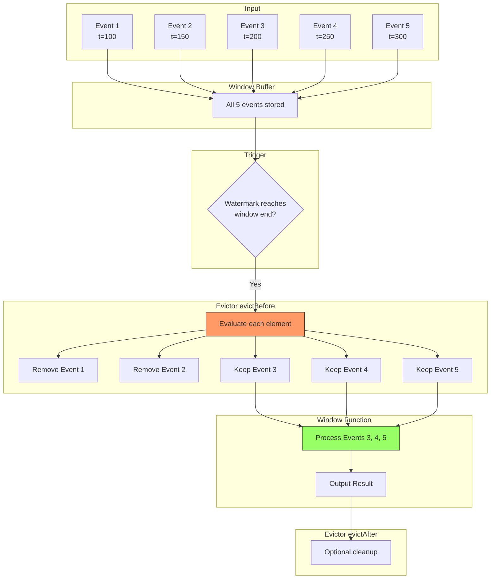

# How to Create Window Evictors

Author: [nawazdhandala](https://github.com/nawazdhandala)

Tags: Stream Processing, Windowing, Apache Flink, Data Management

Description: Learn to create window evictors in stream processing to control element removal from windows before processing.

---

Window evictors give you fine-grained control over which elements remain in a window before the window function processes them. While triggers determine when a window fires, evictors determine what data stays or gets removed. This separation of concerns enables sophisticated data management strategies in stream processing applications.

## Understanding Window Evictors

An evictor sits between the trigger and the window function in the processing pipeline. When a window fires, the evictor examines all elements and decides which ones should be removed before the actual computation happens.



### Why Use Evictors?

| Use Case | Description |
|----------|-------------|
| Data Freshness | Remove stale elements that arrived early in the window |
| Memory Management | Limit window size to prevent memory issues |
| Outlier Removal | Filter elements that deviate significantly from expected values |
| Sampling | Keep only a representative subset of elements |
| Deduplication | Remove duplicate elements before processing |

## Built-in Evictor Types

Apache Flink provides three built-in evictor types that handle common scenarios. Understanding these helps you decide when to use them versus building custom solutions.

### Count Evictor

The count evictor maintains a maximum number of elements in the window. When the element count exceeds the specified limit, older elements get removed first.

The following example demonstrates a count evictor that keeps only the 100 most recent elements in each window.

```java
import org.apache.flink.streaming.api.datastream.DataStream;
import org.apache.flink.streaming.api.windowing.assigners.TumblingEventTimeWindows;
import org.apache.flink.streaming.api.windowing.evictors.CountEvictor;
import org.apache.flink.streaming.api.windowing.time.Time;

public class CountEvictorExample {

    public static void main(String[] args) throws Exception {
        // Create the streaming environment
        StreamExecutionEnvironment env = StreamExecutionEnvironment.getExecutionEnvironment();

        // Source stream of sensor readings
        DataStream<SensorReading> sensorStream = env
            .addSource(new SensorSource());

        // Apply windowing with count evictor
        // This keeps only the last 100 elements per window
        DataStream<AggregatedReading> result = sensorStream
            .keyBy(reading -> reading.getSensorId())
            .window(TumblingEventTimeWindows.of(Time.minutes(5)))
            // CountEvictor.of(maxCount) removes elements when count exceeds maxCount
            // Elements are removed from the beginning (oldest first)
            .evictor(CountEvictor.of(100))
            .process(new SensorAggregator());

        result.print();
        env.execute("Count Evictor Example");
    }
}
```

### Time Evictor

The time evictor removes elements based on their timestamp relative to the maximum timestamp seen in the window. Elements older than a specified interval before the maximum timestamp get evicted.

This example shows how to retain only elements from the last 30 seconds of event time within each window.

```java
import org.apache.flink.streaming.api.windowing.evictors.TimeEvictor;
import org.apache.flink.streaming.api.windowing.time.Time;

public class TimeEvictorExample {

    public static DataStream<Result> processWithTimeEvictor(
            DataStream<Event> events) {

        return events
            .keyBy(Event::getKey)
            // Using sliding windows with 1 hour size and 5 minute slide
            .window(SlidingEventTimeWindows.of(Time.hours(1), Time.minutes(5)))
            // TimeEvictor keeps only elements within the specified interval
            // from the maximum timestamp in the window
            // Here we keep elements from the last 30 seconds before max timestamp
            .evictor(TimeEvictor.of(Time.seconds(30)))
            .reduce(new EventReducer());
    }
}
```



### Delta Evictor

The delta evictor removes elements based on a threshold comparison with the last element in the window. You provide a delta function that computes the difference between elements.

This example demonstrates using a delta evictor to remove readings that differ significantly from the most recent value.

```java
import org.apache.flink.streaming.api.windowing.evictors.DeltaEvictor;
import org.apache.flink.streaming.api.functions.windowing.delta.DeltaFunction;

public class DeltaEvictorExample {

    public static void main(String[] args) throws Exception {
        StreamExecutionEnvironment env = StreamExecutionEnvironment.getExecutionEnvironment();

        DataStream<StockPrice> prices = env.addSource(new StockPriceSource());

        // Define a delta function that calculates price difference
        // This function determines how to compute the "distance" between elements
        DeltaFunction<StockPrice> deltaFunction = new DeltaFunction<StockPrice>() {
            @Override
            public double getDelta(StockPrice oldPrice, StockPrice newPrice) {
                // Calculate absolute percentage difference
                return Math.abs(newPrice.getPrice() - oldPrice.getPrice())
                       / oldPrice.getPrice() * 100;
            }
        };

        // Threshold of 5% means elements differing by more than 5%
        // from the last element will be evicted
        double threshold = 5.0;

        DataStream<StockAnalysis> analysis = prices
            .keyBy(StockPrice::getSymbol)
            .window(TumblingEventTimeWindows.of(Time.minutes(1)))
            // DeltaEvictor removes elements where delta exceeds threshold
            .evictor(DeltaEvictor.of(threshold, deltaFunction))
            .process(new StockAnalyzer());

        analysis.print();
        env.execute("Delta Evictor Example");
    }
}
```

## Creating Custom Evictors

When built-in evictors do not meet your requirements, you can implement custom eviction logic. The Evictor interface provides two methods that execute at different points in the processing pipeline.

### Evictor Interface

The evictor interface defines two key methods for controlling element removal.

```java
public interface Evictor<T, W extends Window> extends Serializable {

    /**
     * Called before the window function is applied.
     * This is where most eviction logic runs.
     *
     * @param elements All elements currently in the window
     * @param size Current number of elements
     * @param window The window being processed
     * @param evictorContext Context with timing information
     */
    void evictBefore(
        Iterable<TimestampedValue<T>> elements,
        int size,
        W window,
        EvictorContext evictorContext);

    /**
     * Called after the window function is applied.
     * Useful for cleanup or maintaining state for incremental computation.
     *
     * @param elements All elements currently in the window
     * @param size Current number of elements
     * @param window The window being processed
     * @param evictorContext Context with timing information
     */
    void evictAfter(
        Iterable<TimestampedValue<T>> elements,
        int size,
        W window,
        EvictorContext evictorContext);
}
```

### Custom Evictor Implementation

Here is a complete example of a custom evictor that removes outliers based on statistical analysis of the window contents.

```java
import org.apache.flink.streaming.api.windowing.evictors.Evictor;
import org.apache.flink.streaming.api.windowing.windows.TimeWindow;
import org.apache.flink.streaming.runtime.operators.windowing.TimestampedValue;

import java.util.ArrayList;
import java.util.Iterator;
import java.util.List;

/**
 * Custom evictor that removes statistical outliers from the window.
 * Elements beyond a specified number of standard deviations from the mean
 * are evicted before the window function processes the data.
 */
public class OutlierEvictor<T extends NumericValue>
        implements Evictor<T, TimeWindow> {

    // Number of standard deviations to use as threshold
    private final double stdDevThreshold;

    // Function to extract numeric value from element
    private final ValueExtractor<T> valueExtractor;

    public OutlierEvictor(double stdDevThreshold, ValueExtractor<T> extractor) {
        this.stdDevThreshold = stdDevThreshold;
        this.valueExtractor = extractor;
    }

    /**
     * Factory method for creating the evictor with default 3 sigma threshold.
     */
    public static <T extends NumericValue> OutlierEvictor<T> of(
            ValueExtractor<T> extractor) {
        return new OutlierEvictor<>(3.0, extractor);
    }

    /**
     * Factory method with custom threshold.
     */
    public static <T extends NumericValue> OutlierEvictor<T> of(
            double threshold, ValueExtractor<T> extractor) {
        return new OutlierEvictor<>(threshold, extractor);
    }

    @Override
    public void evictBefore(
            Iterable<TimestampedValue<T>> elements,
            int size,
            TimeWindow window,
            EvictorContext ctx) {

        // Cannot compute statistics with fewer than 3 elements
        if (size < 3) {
            return;
        }

        // Collect all values for statistical analysis
        List<Double> values = new ArrayList<>();
        for (TimestampedValue<T> element : elements) {
            values.add(valueExtractor.extract(element.getValue()));
        }

        // Calculate mean
        double sum = 0;
        for (double value : values) {
            sum += value;
        }
        double mean = sum / values.size();

        // Calculate standard deviation
        double squaredDiffSum = 0;
        for (double value : values) {
            squaredDiffSum += Math.pow(value - mean, 2);
        }
        double stdDev = Math.sqrt(squaredDiffSum / values.size());

        // Define bounds for acceptable values
        double lowerBound = mean - (stdDevThreshold * stdDev);
        double upperBound = mean + (stdDevThreshold * stdDev);

        // Remove outliers using iterator
        Iterator<TimestampedValue<T>> iterator = elements.iterator();
        while (iterator.hasNext()) {
            TimestampedValue<T> element = iterator.next();
            double value = valueExtractor.extract(element.getValue());

            // Evict if outside acceptable range
            if (value < lowerBound || value > upperBound) {
                iterator.remove();
            }
        }
    }

    @Override
    public void evictAfter(
            Iterable<TimestampedValue<T>> elements,
            int size,
            TimeWindow window,
            EvictorContext ctx) {
        // No post-processing eviction needed for this use case
    }

    /**
     * Functional interface for extracting numeric values from elements.
     */
    @FunctionalInterface
    public interface ValueExtractor<T> extends Serializable {
        double extract(T element);
    }
}
```

### Using the Custom Evictor

Here is how to integrate the custom outlier evictor into a streaming pipeline.

```java
public class OutlierEvictorUsage {

    public static void main(String[] args) throws Exception {
        StreamExecutionEnvironment env = StreamExecutionEnvironment.getExecutionEnvironment();

        // Stream of temperature readings
        DataStream<TemperatureReading> readings = env
            .addSource(new TemperatureSensorSource())
            .assignTimestampsAndWatermarks(
                WatermarkStrategy
                    .<TemperatureReading>forBoundedOutOfOrderness(Duration.ofSeconds(5))
                    .withTimestampAssigner((reading, ts) -> reading.getTimestamp())
            );

        // Process with outlier removal
        // This removes temperature spikes that are likely sensor errors
        DataStream<TemperatureStats> cleanStats = readings
            .keyBy(TemperatureReading::getSensorId)
            .window(TumblingEventTimeWindows.of(Time.minutes(5)))
            // Use our custom evictor with 2 sigma threshold
            // Values more than 2 standard deviations from mean are removed
            .evictor(OutlierEvictor.of(2.0, TemperatureReading::getTemperature))
            .process(new TemperatureStatsCalculator());

        cleanStats.print();
        env.execute("Outlier Removal Pipeline");
    }
}
```

## Advanced Evictor Patterns

### Composite Evictor

Sometimes you need to combine multiple eviction strategies. This pattern chains multiple evictors together.

```java
import java.util.Arrays;
import java.util.List;

/**
 * Composite evictor that applies multiple eviction strategies in sequence.
 * Each evictor processes the elements remaining after the previous one.
 */
public class CompositeEvictor<T, W extends Window> implements Evictor<T, W> {

    private final List<Evictor<T, W>> evictors;

    @SafeVarargs
    public CompositeEvictor(Evictor<T, W>... evictors) {
        this.evictors = Arrays.asList(evictors);
    }

    @SafeVarargs
    public static <T, W extends Window> CompositeEvictor<T, W> of(
            Evictor<T, W>... evictors) {
        return new CompositeEvictor<>(evictors);
    }

    @Override
    public void evictBefore(
            Iterable<TimestampedValue<T>> elements,
            int size,
            W window,
            EvictorContext ctx) {

        // Apply each evictor in sequence
        // Note: size parameter may become stale after first evictor
        int currentSize = size;
        for (Evictor<T, W> evictor : evictors) {
            evictor.evictBefore(elements, currentSize, window, ctx);
            // Recalculate size after eviction
            currentSize = countElements(elements);
        }
    }

    @Override
    public void evictAfter(
            Iterable<TimestampedValue<T>> elements,
            int size,
            W window,
            EvictorContext ctx) {

        int currentSize = size;
        for (Evictor<T, W> evictor : evictors) {
            evictor.evictAfter(elements, currentSize, window, ctx);
            currentSize = countElements(elements);
        }
    }

    private int countElements(Iterable<TimestampedValue<T>> elements) {
        int count = 0;
        for (TimestampedValue<T> ignored : elements) {
            count++;
        }
        return count;
    }
}
```

Using the composite evictor to combine time-based and count-based eviction strategies.

```java
// First remove old elements, then limit to max 50
DataStream<Result> result = events
    .keyBy(Event::getKey)
    .window(TumblingEventTimeWindows.of(Time.minutes(10)))
    .evictor(CompositeEvictor.of(
        TimeEvictor.of(Time.minutes(5)),  // Keep only last 5 minutes
        CountEvictor.of(50)                // Then limit to 50 elements
    ))
    .process(new EventProcessor());
```

### Stateful Evictor with External Lookup

This pattern demonstrates an evictor that makes decisions based on external state or configuration.

```java
import org.apache.flink.api.common.state.MapStateDescriptor;
import org.apache.flink.api.common.typeinfo.Types;
import org.apache.flink.streaming.api.datastream.BroadcastStream;

/**
 * Evictor that removes elements based on a dynamically updated blocklist.
 * The blocklist can be updated at runtime through a broadcast stream.
 */
public class BlocklistEvictor<T> implements Evictor<T, TimeWindow> {

    // Function to extract the key to check against blocklist
    private final KeyExtractor<T> keyExtractor;

    // In-memory blocklist (updated via broadcast state in production)
    private final Set<String> blocklist;

    public BlocklistEvictor(KeyExtractor<T> keyExtractor, Set<String> blocklist) {
        this.keyExtractor = keyExtractor;
        this.blocklist = blocklist;
    }

    @Override
    public void evictBefore(
            Iterable<TimestampedValue<T>> elements,
            int size,
            TimeWindow window,
            EvictorContext ctx) {

        Iterator<TimestampedValue<T>> iterator = elements.iterator();
        while (iterator.hasNext()) {
            TimestampedValue<T> element = iterator.next();
            String key = keyExtractor.extractKey(element.getValue());

            // Remove if key is in blocklist
            if (blocklist.contains(key)) {
                iterator.remove();
            }
        }
    }

    @Override
    public void evictAfter(
            Iterable<TimestampedValue<T>> elements,
            int size,
            TimeWindow window,
            EvictorContext ctx) {
        // Not used
    }

    @FunctionalInterface
    public interface KeyExtractor<T> extends Serializable {
        String extractKey(T element);
    }
}
```

## Evictor Processing Flow

Understanding the complete flow helps you design evictors that integrate smoothly with your pipeline.



## Performance Considerations

### Memory Impact

Evictors can significantly affect memory usage. Consider these patterns.

```java
/**
 * Memory-efficient evictor that removes elements incrementally
 * rather than accumulating all elements before eviction.
 */
public class IncrementalCountEvictor<T> implements Evictor<T, TimeWindow> {

    private final long maxCount;

    public IncrementalCountEvictor(long maxCount) {
        this.maxCount = maxCount;
    }

    @Override
    public void evictBefore(
            Iterable<TimestampedValue<T>> elements,
            int size,
            TimeWindow window,
            EvictorContext ctx) {

        // Calculate how many elements to remove
        long toRemove = Math.max(0, size - maxCount);

        if (toRemove == 0) {
            return;
        }

        // Remove from beginning (oldest elements)
        Iterator<TimestampedValue<T>> iterator = elements.iterator();
        long removed = 0;
        while (iterator.hasNext() && removed < toRemove) {
            iterator.next();
            iterator.remove();
            removed++;
        }
    }

    @Override
    public void evictAfter(
            Iterable<TimestampedValue<T>> elements,
            int size,
            TimeWindow window,
            EvictorContext ctx) {
        // Not needed
    }
}
```

### Evictor vs Pre-Filter Trade-offs

| Approach | Pros | Cons |
|----------|------|------|
| Evictor | Access to all window elements, can make global decisions | Higher memory usage, runs on every trigger |
| Pre-Filter | Lower memory, filters before window | Cannot see window context, no cross-element logic |
| Combined | Best of both worlds | More complex implementation |

When to use each approach.

```java
// Pre-filter approach: filter before windowing
// Use when you can make filtering decisions per-element
DataStream<Event> filtered = events
    .filter(e -> e.getValue() > 0)  // Simple per-element filter
    .keyBy(Event::getKey)
    .window(TumblingEventTimeWindows.of(Time.minutes(5)))
    .reduce(new EventReducer());

// Evictor approach: filter within window context
// Use when you need to see all elements to make decisions
DataStream<Event> evicted = events
    .keyBy(Event::getKey)
    .window(TumblingEventTimeWindows.of(Time.minutes(5)))
    .evictor(OutlierEvictor.of(3.0, Event::getValue))  // Needs window context
    .reduce(new EventReducer());
```

## Testing Evictors

Proper testing ensures your evictor behaves correctly under various conditions.

```java
import org.apache.flink.streaming.api.windowing.windows.TimeWindow;
import org.apache.flink.streaming.runtime.operators.windowing.TimestampedValue;
import org.junit.jupiter.api.Test;

import java.util.ArrayList;
import java.util.List;

import static org.junit.jupiter.api.Assertions.*;

class OutlierEvictorTest {

    @Test
    void shouldRemoveOutliers() {
        // Arrange: create test data with outliers
        List<TimestampedValue<TestValue>> elements = new ArrayList<>();
        // Normal values around 100
        elements.add(new TimestampedValue<>(new TestValue(98), 1000L));
        elements.add(new TimestampedValue<>(new TestValue(102), 2000L));
        elements.add(new TimestampedValue<>(new TestValue(100), 3000L));
        elements.add(new TimestampedValue<>(new TestValue(99), 4000L));
        elements.add(new TimestampedValue<>(new TestValue(101), 5000L));
        // Outlier: way outside normal range
        elements.add(new TimestampedValue<>(new TestValue(500), 6000L));

        // Create evictor with 2 sigma threshold
        OutlierEvictor<TestValue> evictor = OutlierEvictor.of(
            2.0,
            TestValue::getValue
        );

        // Create mock window and context
        TimeWindow window = new TimeWindow(0, 10000);
        MockEvictorContext ctx = new MockEvictorContext();

        // Act: run eviction
        evictor.evictBefore(elements, elements.size(), window, ctx);

        // Assert: outlier should be removed
        assertEquals(5, elements.size());
        for (TimestampedValue<TestValue> element : elements) {
            assertTrue(element.getValue().getValue() < 200);
        }
    }

    @Test
    void shouldKeepAllElementsWhenNoOutliers() {
        // Arrange: all values are similar
        List<TimestampedValue<TestValue>> elements = new ArrayList<>();
        elements.add(new TimestampedValue<>(new TestValue(100), 1000L));
        elements.add(new TimestampedValue<>(new TestValue(101), 2000L));
        elements.add(new TimestampedValue<>(new TestValue(99), 3000L));
        elements.add(new TimestampedValue<>(new TestValue(100), 4000L));

        OutlierEvictor<TestValue> evictor = OutlierEvictor.of(
            3.0,
            TestValue::getValue
        );

        TimeWindow window = new TimeWindow(0, 10000);
        MockEvictorContext ctx = new MockEvictorContext();

        // Act
        int originalSize = elements.size();
        evictor.evictBefore(elements, elements.size(), window, ctx);

        // Assert: all elements retained
        assertEquals(originalSize, elements.size());
    }

    @Test
    void shouldHandleSmallWindows() {
        // Arrange: only 2 elements (below minimum for statistics)
        List<TimestampedValue<TestValue>> elements = new ArrayList<>();
        elements.add(new TimestampedValue<>(new TestValue(100), 1000L));
        elements.add(new TimestampedValue<>(new TestValue(500), 2000L));

        OutlierEvictor<TestValue> evictor = OutlierEvictor.of(
            2.0,
            TestValue::getValue
        );

        TimeWindow window = new TimeWindow(0, 10000);
        MockEvictorContext ctx = new MockEvictorContext();

        // Act
        evictor.evictBefore(elements, elements.size(), window, ctx);

        // Assert: both elements kept (cannot compute stats)
        assertEquals(2, elements.size());
    }
}

// Helper classes for testing
class TestValue implements NumericValue {
    private final double value;

    TestValue(double value) {
        this.value = value;
    }

    public double getValue() {
        return value;
    }
}

class MockEvictorContext implements Evictor.EvictorContext {
    @Override
    public long getCurrentProcessingTime() {
        return System.currentTimeMillis();
    }

    @Override
    public MetricGroup getMetricGroup() {
        return null;
    }

    @Override
    public long getCurrentWatermark() {
        return Long.MAX_VALUE;
    }
}
```

## Common Mistakes and Solutions

### Mistake 1: Modifying Elements Instead of Removing

```java
// WRONG: Modifying element values
@Override
public void evictBefore(Iterable<TimestampedValue<T>> elements, ...) {
    for (TimestampedValue<T> element : elements) {
        // This does not work as expected
        element.getValue().setValue(0);  // Wrong approach
    }
}

// CORRECT: Remove unwanted elements
@Override
public void evictBefore(Iterable<TimestampedValue<T>> elements, ...) {
    Iterator<TimestampedValue<T>> iterator = elements.iterator();
    while (iterator.hasNext()) {
        if (shouldEvict(iterator.next())) {
            iterator.remove();  // Correct approach
        }
    }
}
```

### Mistake 2: Not Handling Empty Windows

```java
// WRONG: Assumes window has elements
@Override
public void evictBefore(Iterable<TimestampedValue<T>> elements, ...) {
    double first = elements.iterator().next().getValue();  // May throw
}

// CORRECT: Check for empty window
@Override
public void evictBefore(Iterable<TimestampedValue<T>> elements, ...) {
    Iterator<TimestampedValue<T>> iterator = elements.iterator();
    if (!iterator.hasNext()) {
        return;  // Handle empty case
    }
    double first = iterator.next().getValue();
}
```

### Mistake 3: Incorrect Size Assumption

```java
// WRONG: Using size parameter after modifications
@Override
public void evictBefore(Iterable<TimestampedValue<T>> elements, int size, ...) {
    // Remove some elements
    Iterator<TimestampedValue<T>> it = elements.iterator();
    while (it.hasNext()) {
        it.next();
        it.remove();
        break;
    }

    // size is now stale - do not use it
    System.out.println("Elements: " + size);  // Wrong!
}

// CORRECT: Recalculate if needed
@Override
public void evictBefore(Iterable<TimestampedValue<T>> elements, int size, ...) {
    // Remove some elements
    Iterator<TimestampedValue<T>> it = elements.iterator();
    while (it.hasNext()) {
        it.next();
        it.remove();
        break;
    }

    // Count remaining elements
    int remaining = 0;
    for (TimestampedValue<T> e : elements) {
        remaining++;
    }
    System.out.println("Elements: " + remaining);  // Correct
}
```

## When to Use Evictors

Use evictors when:

- You need to remove stale data from windows before processing
- Memory constraints require limiting window size
- Statistical analysis needs clean data without outliers
- Business logic requires filtering based on window context
- You want to implement sampling strategies within windows

Avoid evictors when:

- Simple per-element filtering suffices (use filter operator instead)
- Processing needs all historical data
- Eviction logic does not depend on other elements in the window
- Performance is critical and pre-filtering is an option

---

Window evictors provide powerful control over data retention in stream processing windows. Start with built-in evictors for common scenarios, and implement custom evictors when your use case requires specialized logic. Always test your evictors thoroughly, especially edge cases like empty windows and single-element windows. Remember that evictors add processing overhead, so evaluate whether pre-filtering might achieve the same result with better performance.
