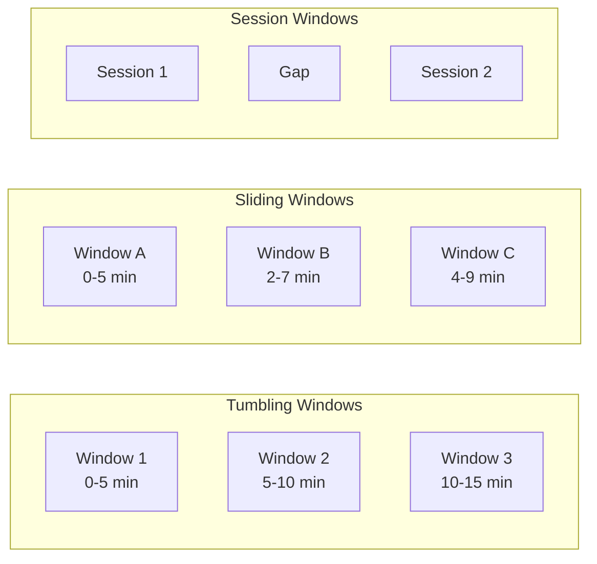
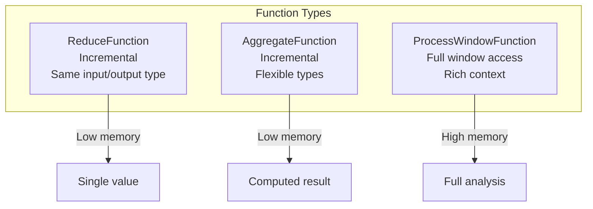
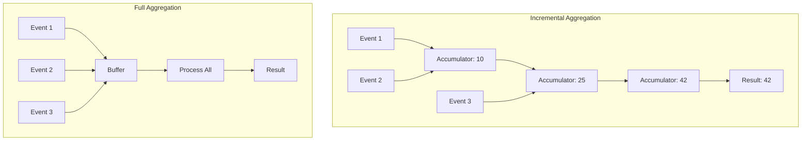
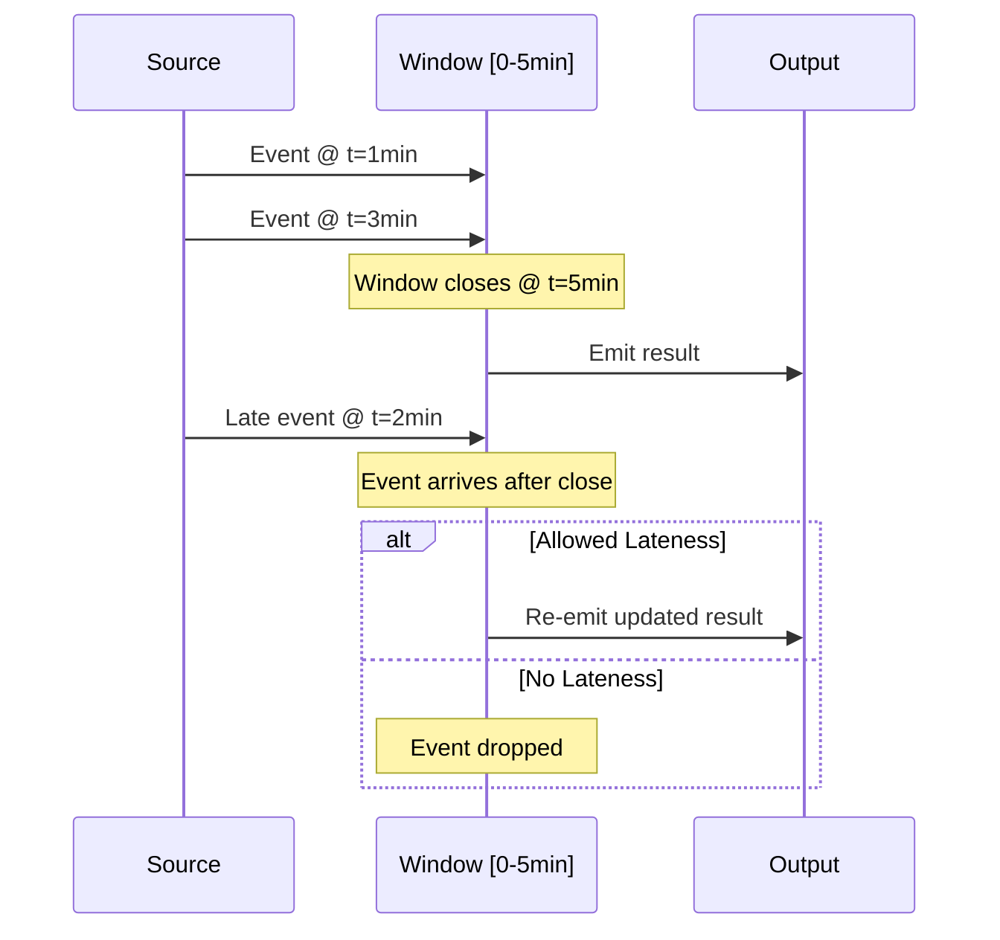

# How to Build Window Functions

Author: [nawazdhandala](https://github.com/nawazdhandala)

Tags: Stream Processing, Windowing, Analytics, Apache Flink

Description: Learn to build window functions for stream processing including reduce, aggregate, and process functions for real-time analytics.

---

Stream processing systems analyze data continuously as it arrives. Unlike batch processing where you have all data upfront, streams are unbounded. You need a way to group infinite data into finite chunks for analysis. This is where window functions come in.

Windows partition a continuous stream into discrete, time-bounded segments. You can then compute aggregations like sums, averages, or custom metrics over each window. The window "closes" after a certain time or element count, triggers computation, and emits results downstream.

## Why Windows Matter in Streaming

Consider monitoring application response times. Without windows, you would need to store every measurement forever or lose historical context. Windows let you ask questions like:

- What was the average latency in the last 5 minutes?
- How many errors occurred in each 1-hour period?
- What is the 99th percentile response time per minute?

Windows convert unbounded streams into bounded datasets that can be aggregated, compared, and analyzed.

## Types of Windows

Stream processing frameworks support several window types, each suited for different use cases.



### Tumbling Windows

Tumbling windows are fixed-size, non-overlapping windows. Each event belongs to exactly one window. When the window duration elapses, the window closes and computation triggers.

```java
// Tumbling window of 5 minutes
// Events are grouped into non-overlapping 5-minute buckets
// Example: [0-5min], [5-10min], [10-15min], ...
DataStream<Tuple2<String, Long>> stream = source
    .keyBy(event -> event.getKey())
    .window(TumblingEventTimeWindows.of(Time.minutes(5)))
    .reduce((a, b) -> new Tuple2<>(a.f0, a.f1 + b.f1));
```

**Use cases:**
- Hourly reports
- Daily aggregations
- Fixed-interval metrics dashboards

### Sliding Windows

Sliding windows have a fixed size but overlap. A window of size 10 minutes with slide of 5 minutes means windows overlap by 5 minutes. Each event can belong to multiple windows.

```java
// Sliding window: 10-minute windows that slide every 5 minutes
// Creates overlapping windows for smoother trend analysis
// Windows: [0-10min], [5-15min], [10-20min], ...
DataStream<Tuple2<String, Double>> stream = source
    .keyBy(event -> event.getKey())
    .window(SlidingEventTimeWindows.of(
        Time.minutes(10),  // Window size
        Time.minutes(5)    // Slide interval
    ))
    .aggregate(new AverageAggregator());
```

**Use cases:**
- Moving averages
- Trend detection
- Smooth real-time dashboards

### Session Windows

Session windows group events by activity periods. A gap of inactivity longer than a specified timeout closes the window. Window sizes vary based on actual user or system activity patterns.

```java
// Session windows with 30-minute inactivity gap
// Window closes when no events arrive for 30 minutes
// Useful for user sessions, transaction flows, or bursty workloads
DataStream<UserActivity> stream = source
    .keyBy(event -> event.getUserId())
    .window(EventTimeSessionWindows.withGap(Time.minutes(30)))
    .process(new SessionAnalyzer());
```

**Use cases:**
- User session analysis
- Clickstream processing
- Network connection monitoring

### Global Windows

Global windows place all elements with the same key into a single window. You must define custom triggers to emit results, as the window never closes automatically.

```java
// Global window with custom trigger
// All events for a key go into one window
// Trigger controls when results are emitted
DataStream<Alert> stream = source
    .keyBy(event -> event.getSensorId())
    .window(GlobalWindows.create())
    .trigger(new ThresholdTrigger(100))  // Emit when count reaches 100
    .process(new AlertGenerator());
```

**Use cases:**
- Count-based aggregations
- Custom windowing logic
- Event-driven computations

## Window Function Types

Once you define a window, you need a function to process elements within it. Stream processing frameworks provide three main function types with different trade-offs between simplicity, performance, and capability.



### ReduceFunction: Simple Incremental Aggregation

ReduceFunction combines two elements of the same type into one. The framework calls it incrementally as elements arrive, maintaining only a single accumulated value in memory.

```java
/**
 * ReduceFunction for summing metrics
 *
 * Key characteristics:
 * - Input and output types must be the same
 * - Called incrementally as each element arrives
 * - Only stores one accumulated value in memory
 * - Cannot access window metadata
 */
public class MetricSumReducer implements ReduceFunction<Metric> {

    @Override
    public Metric reduce(Metric accumulated, Metric newValue) {
        // Combine the accumulated value with the new incoming value
        // This is called for each element after the first
        return new Metric(
            accumulated.getName(),
            accumulated.getValue() + newValue.getValue(),  // Sum values
            Math.max(accumulated.getTimestamp(), newValue.getTimestamp())  // Keep latest timestamp
        );
    }
}

// Usage: Sum all metric values within each 1-minute window
DataStream<Metric> summedMetrics = metricsStream
    .keyBy(Metric::getName)
    .window(TumblingEventTimeWindows.of(Time.minutes(1)))
    .reduce(new MetricSumReducer());
```

**Pros:**
- Minimal memory footprint (stores single value)
- Fast incremental computation
- Simple to implement

**Cons:**
- Input and output types must match
- No access to window metadata
- Limited to associative operations

### AggregateFunction: Flexible Incremental Aggregation

AggregateFunction provides more flexibility than ReduceFunction. It separates the accumulator type from input and output types, allowing complex aggregations while still being incremental.

```java
/**
 * AggregateFunction for computing running averages
 *
 * Generic parameters:
 * - IN: Input type (Metric)
 * - ACC: Accumulator type (AverageAccumulator) - internal state
 * - OUT: Output type (Double) - final result
 *
 * Called incrementally, maintaining only the accumulator in memory
 */
public class AverageAggregator
    implements AggregateFunction<Metric, AverageAccumulator, Double> {

    /**
     * Create initial accumulator for a new window
     * Called once when the first element arrives
     */
    @Override
    public AverageAccumulator createAccumulator() {
        return new AverageAccumulator(0L, 0.0);
    }

    /**
     * Add an element to the accumulator
     * Called for each incoming element
     */
    @Override
    public AverageAccumulator add(Metric metric, AverageAccumulator acc) {
        return new AverageAccumulator(
            acc.count + 1,              // Increment count
            acc.sum + metric.getValue() // Add to running sum
        );
    }

    /**
     * Compute final result from accumulator
     * Called when window closes
     */
    @Override
    public Double getResult(AverageAccumulator acc) {
        // Guard against division by zero
        return acc.count == 0 ? 0.0 : acc.sum / acc.count;
    }

    /**
     * Merge two accumulators (for session windows or checkpointing)
     * Must be associative: merge(a, merge(b, c)) == merge(merge(a, b), c)
     */
    @Override
    public AverageAccumulator merge(AverageAccumulator a, AverageAccumulator b) {
        return new AverageAccumulator(
            a.count + b.count,
            a.sum + b.sum
        );
    }
}

/**
 * Accumulator class holding intermediate state
 * Stores only what is needed to compute the final result
 */
public class AverageAccumulator {
    public long count;   // Number of elements seen
    public double sum;   // Running sum of values

    public AverageAccumulator(long count, double sum) {
        this.count = count;
        this.sum = sum;
    }
}

// Usage: Compute average metric value per 5-minute window
DataStream<Double> averages = metricsStream
    .keyBy(Metric::getName)
    .window(TumblingEventTimeWindows.of(Time.minutes(5)))
    .aggregate(new AverageAggregator());
```

**Pros:**
- Different input, accumulator, and output types
- Still incremental and memory-efficient
- Supports complex aggregations (percentiles, histograms)

**Cons:**
- More complex to implement than ReduceFunction
- No access to window metadata
- Requires careful merge() implementation

### ProcessWindowFunction: Full Window Access

ProcessWindowFunction receives all elements in the window at once, plus rich context including window metadata. It can emit multiple results but requires buffering all elements in memory.

```java
/**
 * ProcessWindowFunction for comprehensive window analysis
 *
 * Generic parameters:
 * - IN: Input type (Metric)
 * - OUT: Output type (WindowStats)
 * - KEY: Key type (String)
 * - W: Window type (TimeWindow)
 *
 * Called once when the window closes with ALL elements
 */
public class WindowStatsProcessor
    extends ProcessWindowFunction<Metric, WindowStats, String, TimeWindow> {

    /**
     * Process all elements in the window
     *
     * @param key      The key for this window
     * @param context  Rich context with window metadata, state, timers
     * @param elements All elements in the window (iterable)
     * @param out      Collector to emit results
     */
    @Override
    public void process(
            String key,
            Context context,
            Iterable<Metric> elements,
            Collector<WindowStats> out) {

        // Collect all values for full statistical analysis
        List<Double> values = new ArrayList<>();
        long count = 0;
        double sum = 0.0;
        double min = Double.MAX_VALUE;
        double max = Double.MIN_VALUE;

        // Single pass through all elements
        for (Metric metric : elements) {
            double value = metric.getValue();
            values.add(value);
            count++;
            sum += value;
            min = Math.min(min, value);
            max = Math.max(max, value);
        }

        // Compute derived statistics
        double avg = count > 0 ? sum / count : 0.0;
        double p99 = computePercentile(values, 0.99);

        // Access window metadata for time boundaries
        TimeWindow window = context.window();

        // Emit comprehensive statistics
        out.collect(new WindowStats(
            key,
            window.getStart(),    // Window start timestamp
            window.getEnd(),      // Window end timestamp
            count,
            min,
            max,
            avg,
            p99
        ));
    }

    /**
     * Compute percentile from sorted values
     */
    private double computePercentile(List<Double> values, double percentile) {
        if (values.isEmpty()) return 0.0;

        Collections.sort(values);
        int index = (int) Math.ceil(percentile * values.size()) - 1;
        return values.get(Math.max(0, index));
    }
}

// Usage: Compute comprehensive stats per window
DataStream<WindowStats> stats = metricsStream
    .keyBy(Metric::getName)
    .window(TumblingEventTimeWindows.of(Time.minutes(1)))
    .process(new WindowStatsProcessor());
```

**Pros:**
- Access to all elements at once
- Rich context (window boundaries, keyed state, timers)
- Can emit multiple or zero results
- Full flexibility for complex analysis

**Cons:**
- Buffers all elements in memory
- Higher memory usage and latency
- Not suitable for high-cardinality windows

## Incremental vs Full Aggregation

The choice between incremental aggregation (ReduceFunction, AggregateFunction) and full aggregation (ProcessWindowFunction) significantly impacts performance and memory usage.



### Memory Comparison

| Approach | Memory per Window | When to Use |
|----------|-------------------|-------------|
| ReduceFunction | O(1) | Simple sums, counts, min/max |
| AggregateFunction | O(accumulator size) | Averages, complex aggregations |
| ProcessWindowFunction | O(n) elements | Full analysis, percentiles, outlier detection |

### Combining Incremental and Full: Best of Both Worlds

You can combine AggregateFunction with ProcessWindowFunction. The aggregate runs incrementally, then the process function adds window metadata without storing all elements.

```java
/**
 * Incremental aggregator that computes statistics efficiently
 * Runs as elements arrive, maintaining only the accumulator
 */
public class StatsAggregator
    implements AggregateFunction<Metric, StatsAccumulator, PartialStats> {

    @Override
    public StatsAccumulator createAccumulator() {
        return new StatsAccumulator();
    }

    @Override
    public StatsAccumulator add(Metric metric, StatsAccumulator acc) {
        // Incremental min/max/sum/count update
        acc.count++;
        acc.sum += metric.getValue();
        acc.min = Math.min(acc.min, metric.getValue());
        acc.max = Math.max(acc.max, metric.getValue());
        return acc;
    }

    @Override
    public PartialStats getResult(StatsAccumulator acc) {
        // Convert accumulator to partial result
        return new PartialStats(acc.count, acc.sum, acc.min, acc.max);
    }

    @Override
    public StatsAccumulator merge(StatsAccumulator a, StatsAccumulator b) {
        // Merge two accumulators (for session windows)
        return new StatsAccumulator(
            a.count + b.count,
            a.sum + b.sum,
            Math.min(a.min, b.min),
            Math.max(a.max, b.max)
        );
    }
}

/**
 * Process function that adds window metadata to the aggregated result
 * Receives only the single aggregated value, not all elements
 */
public class EnrichWithWindowMetadata
    extends ProcessWindowFunction<PartialStats, WindowStats, String, TimeWindow> {

    @Override
    public void process(
            String key,
            Context context,
            Iterable<PartialStats> aggregatedResults,  // Single element from aggregator
            Collector<WindowStats> out) {

        // Get the pre-aggregated result (only one element)
        PartialStats stats = aggregatedResults.iterator().next();

        // Enrich with window metadata
        TimeWindow window = context.window();

        out.collect(new WindowStats(
            key,
            window.getStart(),
            window.getEnd(),
            stats.count,
            stats.min,
            stats.max,
            stats.sum / stats.count  // Compute average from pre-aggregated values
        ));
    }
}

// Usage: Combine incremental aggregation with window metadata
DataStream<WindowStats> enrichedStats = metricsStream
    .keyBy(Metric::getName)
    .window(TumblingEventTimeWindows.of(Time.minutes(1)))
    .aggregate(
        new StatsAggregator(),           // Runs incrementally
        new EnrichWithWindowMetadata()   // Adds window info without buffering
    );
```

This pattern gives you:
- O(1) memory usage from incremental aggregation
- Window metadata access from ProcessWindowFunction
- Best performance for most real-world use cases

## Handling Late Data

In real systems, events arrive late due to network delays, system backlogs, or clock skew. Windows must handle late arrivals appropriately.



### Allowed Lateness

Configure how long windows stay open for late arrivals.

```java
/**
 * Configure window to accept late data up to 5 minutes after window close
 *
 * Example: For window [0-5min]:
 * - Window closes at t=5min and emits first result
 * - Late events with t < 5min arriving before t=10min trigger re-emission
 * - Events arriving after t=10min are dropped (or sent to side output)
 */
DataStream<WindowStats> withLateness = metricsStream
    .keyBy(Metric::getName)
    .window(TumblingEventTimeWindows.of(Time.minutes(5)))
    .allowedLateness(Time.minutes(5))  // Accept late data for 5 extra minutes
    .sideOutputLateData(lateDataTag)   // Capture extremely late data
    .aggregate(new StatsAggregator());

// Process extremely late data separately
DataStream<Metric> lateData = withLateness.getSideOutput(lateDataTag);
lateData.addSink(new LateDataHandler());  // Log, store, or alert
```

### Watermarks and Event Time

Watermarks track progress in event time, telling the system that no events with timestamp less than the watermark should arrive. They trigger window evaluation.

```java
/**
 * Custom watermark strategy for handling out-of-order events
 *
 * Watermark = max event time seen - max allowed delay
 * Events with timestamp < watermark are considered late
 */
public class BoundedOutOfOrdernessWatermarkStrategy
    implements WatermarkStrategy<Metric> {

    private final Duration maxOutOfOrderness;

    public BoundedOutOfOrdernessWatermarkStrategy(Duration maxOutOfOrderness) {
        this.maxOutOfOrderness = maxOutOfOrderness;
    }

    @Override
    public WatermarkGenerator<Metric> createWatermarkGenerator(
            WatermarkGeneratorSupplier.Context context) {

        return new WatermarkGenerator<Metric>() {
            private long maxTimestamp = Long.MIN_VALUE;

            /**
             * Called for each event to track maximum timestamp
             */
            @Override
            public void onEvent(Metric metric, long eventTimestamp, WatermarkOutput output) {
                // Track the maximum event time seen so far
                maxTimestamp = Math.max(maxTimestamp, metric.getTimestamp());
            }

            /**
             * Called periodically to emit watermarks
             * Watermark = max timestamp - allowed lateness
             */
            @Override
            public void onPeriodicEmit(WatermarkOutput output) {
                // Subtract lateness tolerance to allow for out-of-order events
                long watermark = maxTimestamp - maxOutOfOrderness.toMillis();
                output.emitWatermark(new Watermark(watermark));
            }
        };
    }

    @Override
    public TimestampAssigner<Metric> createTimestampAssigner(
            TimestampAssignerSupplier.Context context) {
        // Extract event time from the metric itself
        return (metric, recordTimestamp) -> metric.getTimestamp();
    }
}

// Usage: Allow up to 10 seconds of out-of-orderness
DataStream<Metric> withWatermarks = metricsStream
    .assignTimestampsAndWatermarks(
        new BoundedOutOfOrdernessWatermarkStrategy(Duration.ofSeconds(10))
    );
```

## Triggers: Controlling Window Emission

Triggers determine when a window's contents are processed and results emitted. The default trigger fires once when the watermark passes the window end time. Custom triggers enable more sophisticated patterns.

```java
/**
 * Custom trigger that fires every N elements AND at window end
 *
 * Useful for providing early results while still emitting
 * complete window results
 */
public class CountAndTimeTrigger extends Trigger<Metric, TimeWindow> {

    private final int maxCount;

    // State descriptor for per-window element count
    private final ReducingStateDescriptor<Long> countState =
        new ReducingStateDescriptor<>("count", Long::sum, Long.class);

    public CountAndTimeTrigger(int maxCount) {
        this.maxCount = maxCount;
    }

    /**
     * Called for each element added to the window
     *
     * @return CONTINUE to do nothing
     *         FIRE to emit current results
     *         FIRE_AND_PURGE to emit and clear window
     */
    @Override
    public TriggerResult onElement(
            Metric element,
            long timestamp,
            TimeWindow window,
            TriggerContext ctx) throws Exception {

        // Get or initialize per-window count
        ReducingState<Long> count = ctx.getPartitionedState(countState);
        count.add(1L);

        // Fire early if count threshold reached
        if (count.get() >= maxCount) {
            count.clear();  // Reset count for next batch
            return TriggerResult.FIRE;  // Emit current results
        }

        // Register timer for window end (default behavior)
        ctx.registerEventTimeTimer(window.maxTimestamp());
        return TriggerResult.CONTINUE;
    }

    /**
     * Called when event-time timer fires (at window end)
     */
    @Override
    public TriggerResult onEventTime(
            long time,
            TimeWindow window,
            TriggerContext ctx) {
        // Final emission at window end, then purge
        return TriggerResult.FIRE_AND_PURGE;
    }

    /**
     * Called when processing-time timer fires
     */
    @Override
    public TriggerResult onProcessingTime(
            long time,
            TimeWindow window,
            TriggerContext ctx) {
        return TriggerResult.CONTINUE;
    }

    /**
     * Cleanup when window is purged
     */
    @Override
    public void clear(TimeWindow window, TriggerContext ctx) throws Exception {
        ctx.getPartitionedState(countState).clear();
        ctx.deleteEventTimeTimer(window.maxTimestamp());
    }
}

// Usage: Emit every 1000 elements OR at window end
DataStream<WindowStats> withCustomTrigger = metricsStream
    .keyBy(Metric::getName)
    .window(TumblingEventTimeWindows.of(Time.minutes(10)))
    .trigger(new CountAndTimeTrigger(1000))
    .aggregate(new StatsAggregator());
```

### Common Trigger Patterns

| Trigger | Use Case |
|---------|----------|
| EventTimeTrigger | Default, fires at watermark |
| ProcessingTimeTrigger | Fires based on wall clock |
| CountTrigger | Fires every N elements |
| PurgingTrigger | Wraps another trigger, clears window after fire |
| ContinuousEventTimeTrigger | Fires at regular event-time intervals |

## Performance Considerations

### 1. Choose the Right Function Type

| Scenario | Recommended Function | Reason |
|----------|---------------------|--------|
| Simple sum/count | ReduceFunction | O(1) memory, simplest |
| Average, variance | AggregateFunction | O(1) memory, flexible types |
| Percentiles (approximate) | AggregateFunction + t-digest | O(log n) memory |
| Percentiles (exact) | ProcessWindowFunction | Requires all data |
| Need window metadata | Aggregate + Process combo | Best of both |

### 2. Optimize State Backend

For production deployments, configure appropriate state backends.

```java
/**
 * Configure RocksDB state backend for large windows
 *
 * RocksDB stores state on disk, enabling windows larger than memory
 * Trade-off: Slower access but unlimited state size
 */
StreamExecutionEnvironment env = StreamExecutionEnvironment.getExecutionEnvironment();

// RocksDB for large state, incremental checkpoints
env.setStateBackend(new EmbeddedRocksDBStateBackend());

// Enable incremental checkpoints (only write changes)
env.getCheckpointConfig().setCheckpointStorage("hdfs:///checkpoints");

// Tune RocksDB memory
Configuration config = new Configuration();
config.set(RocksDBOptions.MANAGED_MEMORY_SIZE, MemorySize.ofMebiBytes(256));
```

### 3. Manage Window State Size

Large windows with high-cardinality keys can exhaust memory.

```java
/**
 * Pre-aggregate before windowing to reduce state size
 *
 * Instead of storing all raw events, aggregate locally first
 */
DataStream<WindowStats> optimized = metricsStream
    // Pre-aggregate within each parallel subtask
    .keyBy(Metric::getName)
    .process(new LocalPreAggregator())  // Emit partial aggregates
    // Then apply windowed aggregation on pre-aggregated data
    .keyBy(PartialAggregate::getKey)
    .window(TumblingEventTimeWindows.of(Time.minutes(5)))
    .reduce(new MergePartialAggregates());  // Merge partial results
```

### 4. Monitor Window Metrics

Track these metrics to identify performance issues.

```java
/**
 * ProcessWindowFunction with custom metrics
 *
 * Monitor window processing to identify bottlenecks
 */
public class MonitoredWindowProcessor
    extends ProcessWindowFunction<Metric, WindowStats, String, TimeWindow> {

    // Custom counter for window emissions
    private transient Counter windowCounter;
    // Histogram for window sizes
    private transient Histogram windowSizeHistogram;

    @Override
    public void open(Configuration parameters) {
        // Register metrics with Flink's metric system
        windowCounter = getRuntimeContext()
            .getMetricGroup()
            .counter("windowsProcessed");

        windowSizeHistogram = getRuntimeContext()
            .getMetricGroup()
            .histogram("windowSize", new DescriptiveStatisticsHistogram(1000));
    }

    @Override
    public void process(
            String key,
            Context context,
            Iterable<Metric> elements,
            Collector<WindowStats> out) {

        // Track window size for monitoring
        long count = 0;
        for (Metric m : elements) {
            count++;
        }

        windowSizeHistogram.update(count);
        windowCounter.inc();

        // Process window...
    }
}
```

## Complete Example: Real-Time Metrics Dashboard

Here is a complete example that computes rolling statistics for a metrics dashboard.

```java
/**
 * Complete streaming pipeline for real-time metrics aggregation
 *
 * Features:
 * - Sliding windows for smooth trends
 * - Combined incremental + full aggregation
 * - Late data handling
 * - Comprehensive statistics
 */
public class MetricsDashboardPipeline {

    public static void main(String[] args) throws Exception {
        // Set up execution environment
        StreamExecutionEnvironment env =
            StreamExecutionEnvironment.getExecutionEnvironment();

        // Configure checkpointing for fault tolerance
        env.enableCheckpointing(60000);  // Checkpoint every minute
        env.getCheckpointConfig().setMinPauseBetweenCheckpoints(30000);

        // Define late data side output
        OutputTag<Metric> lateDataTag = new OutputTag<Metric>("late-data") {};

        // Build the pipeline
        DataStream<Metric> metricsStream = env
            // Kafka source with event time
            .addSource(new FlinkKafkaConsumer<>(
                "metrics-topic",
                new MetricDeserializer(),
                kafkaProperties()))
            // Assign timestamps and watermarks
            .assignTimestampsAndWatermarks(
                WatermarkStrategy
                    .<Metric>forBoundedOutOfOrderness(Duration.ofSeconds(30))
                    .withTimestampAssigner((metric, ts) -> metric.getTimestamp())
            );

        // Compute 5-minute rolling averages with 1-minute slide
        SingleOutputStreamOperator<DashboardMetric> dashboardMetrics = metricsStream
            .keyBy(Metric::getName)
            .window(SlidingEventTimeWindows.of(
                Time.minutes(5),   // Window size
                Time.minutes(1)    // Slide interval
            ))
            .allowedLateness(Time.minutes(2))
            .sideOutputLateData(lateDataTag)
            .aggregate(
                new DashboardAggregator(),
                new DashboardEnricher()
            );

        // Sink to dashboard backend
        dashboardMetrics.addSink(new DashboardSink());

        // Handle late data separately
        dashboardMetrics
            .getSideOutput(lateDataTag)
            .addSink(new LateDataLogger());

        env.execute("Metrics Dashboard Pipeline");
    }
}

/**
 * Accumulator for dashboard statistics
 */
public class DashboardAccumulator {
    public long count = 0;
    public double sum = 0.0;
    public double sumOfSquares = 0.0;  // For variance calculation
    public double min = Double.MAX_VALUE;
    public double max = Double.MIN_VALUE;
}

/**
 * Incremental aggregator for dashboard metrics
 *
 * Computes count, sum, sum of squares, min, max incrementally
 * Variance and stddev computed from these in getResult()
 */
public class DashboardAggregator
    implements AggregateFunction<Metric, DashboardAccumulator, DashboardStats> {

    @Override
    public DashboardAccumulator createAccumulator() {
        return new DashboardAccumulator();
    }

    @Override
    public DashboardAccumulator add(Metric metric, DashboardAccumulator acc) {
        double value = metric.getValue();
        acc.count++;
        acc.sum += value;
        acc.sumOfSquares += value * value;  // For variance
        acc.min = Math.min(acc.min, value);
        acc.max = Math.max(acc.max, value);
        return acc;
    }

    @Override
    public DashboardStats getResult(DashboardAccumulator acc) {
        double avg = acc.count > 0 ? acc.sum / acc.count : 0.0;
        // Variance = E[X^2] - E[X]^2
        double variance = acc.count > 0
            ? (acc.sumOfSquares / acc.count) - (avg * avg)
            : 0.0;
        double stddev = Math.sqrt(Math.max(0, variance));

        return new DashboardStats(
            acc.count,
            acc.min,
            acc.max,
            avg,
            stddev
        );
    }

    @Override
    public DashboardAccumulator merge(DashboardAccumulator a, DashboardAccumulator b) {
        DashboardAccumulator merged = new DashboardAccumulator();
        merged.count = a.count + b.count;
        merged.sum = a.sum + b.sum;
        merged.sumOfSquares = a.sumOfSquares + b.sumOfSquares;
        merged.min = Math.min(a.min, b.min);
        merged.max = Math.max(a.max, b.max);
        return merged;
    }
}

/**
 * Process function to enrich aggregated stats with window metadata
 */
public class DashboardEnricher
    extends ProcessWindowFunction<DashboardStats, DashboardMetric, String, TimeWindow> {

    @Override
    public void process(
            String metricName,
            Context context,
            Iterable<DashboardStats> stats,
            Collector<DashboardMetric> out) {

        DashboardStats s = stats.iterator().next();
        TimeWindow window = context.window();

        out.collect(new DashboardMetric(
            metricName,
            window.getStart(),
            window.getEnd(),
            s.count,
            s.min,
            s.max,
            s.avg,
            s.stddev,
            System.currentTimeMillis()  // Processing timestamp
        ));
    }
}
```

## Summary

| Concept | Key Points |
|---------|------------|
| **Window Types** | Tumbling (non-overlapping), Sliding (overlapping), Session (activity-based), Global (custom) |
| **Function Types** | ReduceFunction (simple), AggregateFunction (flexible), ProcessWindowFunction (full access) |
| **Aggregation Strategy** | Incremental for O(1) memory, Full for complex analysis, Combined for best of both |
| **Late Data** | Configure allowedLateness, use side outputs, implement proper watermark strategies |
| **Triggers** | Control when windows emit: by time, count, or custom logic |
| **Performance** | Right-size windows, use incremental aggregation, monitor state size, configure checkpointing |

Window functions are the foundation of stream processing analytics. By understanding the trade-offs between different window types and function types, you can build efficient, scalable pipelines that deliver real-time insights from continuous data streams.
