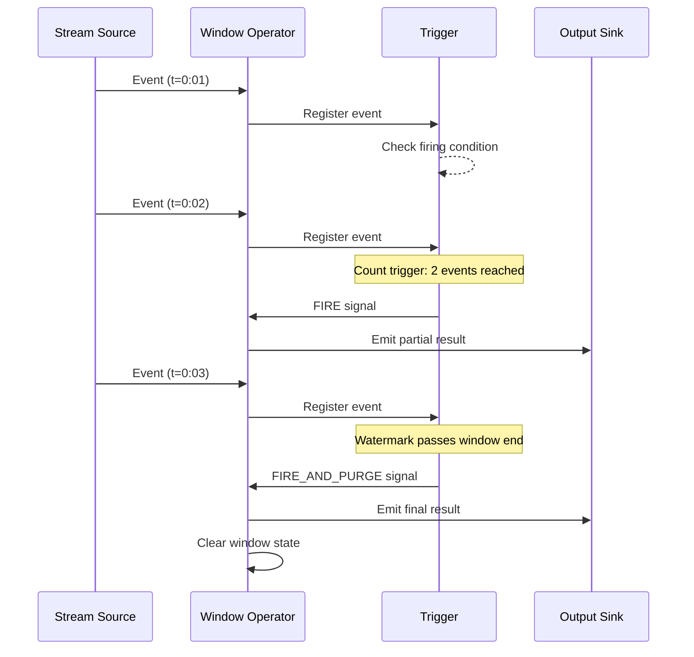
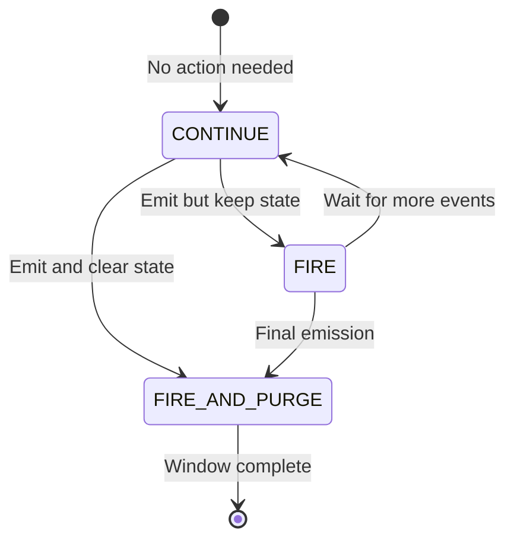
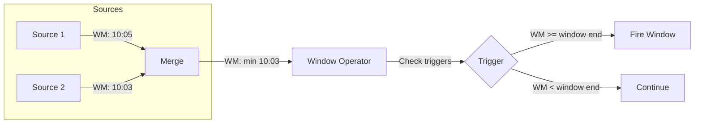
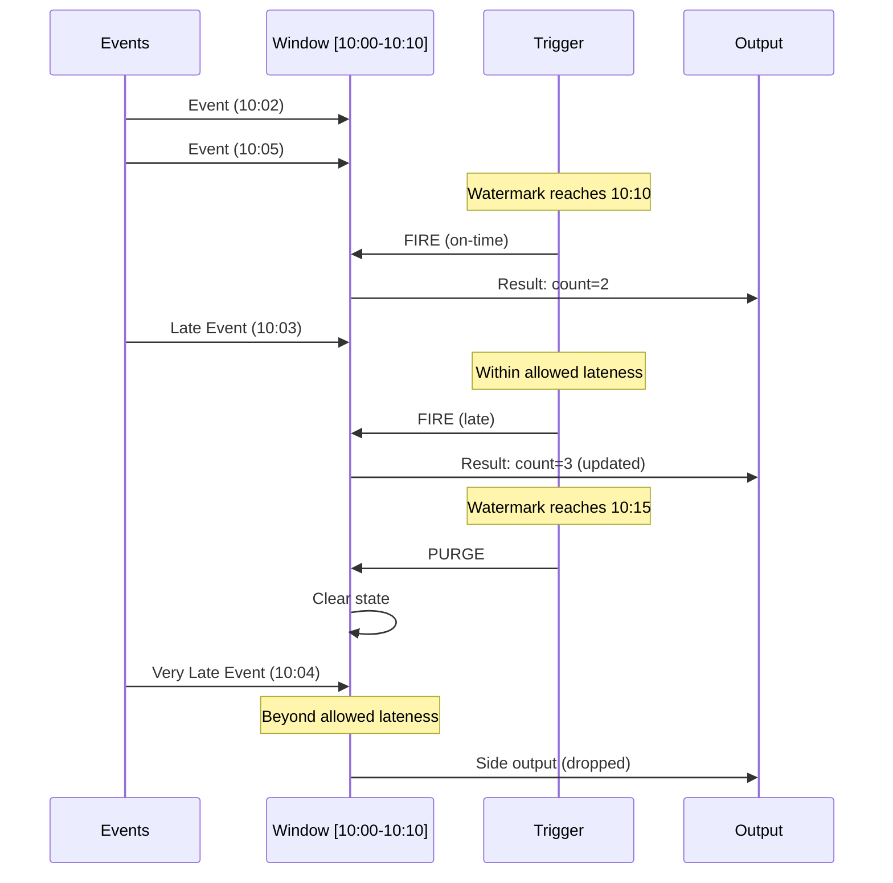

# How to Implement Window Triggers

Author: [nawazdhandala](https://github.com/nawazdhandala)

Tags: Stream Processing, Windowing, Apache Flink, Real-Time

Description: Learn to implement window triggers in stream processing systems to control when window results are emitted for real-time analytics and processing.

---

> Windows group unbounded streams into finite chunks. **Triggers decide when to emit results from those windows.** Without triggers, you wait forever or get results at arbitrary times.

In stream processing, windows alone are not enough. You need precise control over *when* computations fire and results become available. That control comes from triggers.

This guide covers trigger types, implementation patterns in Apache Flink and Spark Structured Streaming, custom trigger development, and production best practices.

---

## Table of Contents

1. Why Triggers Matter
2. Core Trigger Types
3. How Triggers Work (Visual Model)
4. Implementing Triggers in Apache Flink
5. Implementing Triggers in Spark Structured Streaming
6. Custom Trigger Implementation in Flink
7. Watermarks and Late Data Handling
8. Trigger Strategies for Common Use Cases
9. Performance Considerations
10. Testing Triggers
11. Common Pitfalls
12. Summary

---

## 1. Why Triggers Matter

Consider a 5-minute tumbling window counting page views. Without a trigger:
- When does the count get emitted?
- What happens if data arrives late?
- Can you get early estimates before the window closes?

Triggers answer all these questions by defining the **firing policy** for windows.

| Scenario | Trigger Behavior Needed |
|----------|------------------------|
| Real-time dashboard | Fire every second with partial results |
| Batch analytics | Fire once when window completes |
| Late data tolerance | Fire again when late events arrive |
| Cost control | Fire only when accumulating 1000 events |

---

## 2. Core Trigger Types

### Event Time Triggers
Fire based on event timestamps and watermarks. The system tracks logical time progression through the data itself.

### Processing Time Triggers
Fire based on wall-clock time of the processing machine. Simple but non-deterministic across replays.

### Count Triggers
Fire after accumulating a specified number of elements. Useful for micro-batching.

### Composite Triggers
Combine multiple triggers with AND/OR logic. Example: fire after 1 minute OR 1000 events, whichever comes first.

### Continuous Triggers (Early/On-Time/Late)
Fire multiple times during window lifetime: early speculative results, on-time final results, and late corrections.

| Trigger Type | Deterministic | Latency | Use Case |
|--------------|---------------|---------|----------|
| Event Time | Yes | Medium | Analytics, billing |
| Processing Time | No | Low | Monitoring, alerts |
| Count | Yes | Variable | Micro-batching |
| Composite | Depends | Configurable | Hybrid requirements |

---

## 3. How Triggers Work (Visual Model)

The following diagram shows how different trigger types interact with a windowed stream.



Trigger return values control window lifecycle:



---

## 4. Implementing Triggers in Apache Flink

Flink provides built-in triggers and a flexible API for custom implementations.

### Default Event Time Trigger

The default trigger fires when the watermark passes the window end time. This code sets up a basic tumbling window with event time semantics.

```java
import org.apache.flink.streaming.api.windowing.assigners.TumblingEventTimeWindows;
import org.apache.flink.streaming.api.windowing.time.Time;

DataStream<PageView> views = source
    .keyBy(PageView::getUserId)
    .window(TumblingEventTimeWindows.of(Time.minutes(5)))
    // Default EventTimeTrigger fires when watermark >= window.maxTimestamp()
    .sum("count");
```

### Processing Time Trigger

For low-latency scenarios where determinism is not required, processing time triggers fire based on system clock.

```java
import org.apache.flink.streaming.api.windowing.triggers.ProcessingTimeTrigger;

DataStream<Metric> aggregated = metrics
    .keyBy(Metric::getHost)
    .window(TumblingProcessingTimeWindows.of(Time.seconds(30)))
    .trigger(ProcessingTimeTrigger.create())
    .reduce((a, b) -> new Metric(a.getHost(), a.getValue() + b.getValue()));
```

### Count Trigger

Fire after a fixed number of elements arrive. Useful for micro-batch processing.

```java
import org.apache.flink.streaming.api.windowing.triggers.CountTrigger;

// Fire every 100 events within each window
DataStream<Order> batched = orders
    .keyBy(Order::getRegion)
    .window(TumblingEventTimeWindows.of(Time.hours(1)))
    .trigger(CountTrigger.of(100))
    .process(new BatchProcessor());
```

### Purging Trigger

Wrap any trigger to clear state after firing. Useful for memory management with count triggers.

```java
import org.apache.flink.streaming.api.windowing.triggers.PurgingTrigger;

// Fire every 100 events AND clear accumulated state
DataStream<Order> batched = orders
    .keyBy(Order::getRegion)
    .window(GlobalWindows.create())
    .trigger(PurgingTrigger.of(CountTrigger.of(100)))
    .sum("amount");
```

### Early, On-Time, and Late Triggers

This pattern provides speculative early results, accurate on-time results, and corrections for late data.

```java
import org.apache.flink.streaming.api.windowing.triggers.*;

// Custom trigger combining processing time early firing with event time final
DataStream<SalesTotal> sales = transactions
    .keyBy(Transaction::getStoreId)
    .window(TumblingEventTimeWindows.of(Time.minutes(10)))
    .allowedLateness(Time.minutes(5))
    .trigger(new EarlyOnTimeLate(
        // Fire speculatively every 30 seconds processing time
        ProcessingTimeTrigger.create(),
        // Fire when watermark passes window end
        EventTimeTrigger.create(),
        // Fire again for each late element
        CountTrigger.of(1)
    ))
    .aggregate(new SalesAggregator());
```

---

## 5. Implementing Triggers in Spark Structured Streaming

Spark Structured Streaming uses a different model where triggers control micro-batch execution rather than individual windows.

### Available Trigger Modes

Spark offers several trigger modes that determine query execution frequency.

```scala
import org.apache.spark.sql.streaming.Trigger

// Process data as fast as possible (default)
val defaultQuery = stream
  .writeStream
  .trigger(Trigger.ProcessingTime("0 seconds"))
  .start()

// Process every 10 seconds
val intervalQuery = stream
  .writeStream
  .trigger(Trigger.ProcessingTime("10 seconds"))
  .start()

// Process all available data once, then stop
val onceQuery = stream
  .writeStream
  .trigger(Trigger.Once())
  .start()

// Continuous processing with 1 second checkpoint interval (experimental)
val continuousQuery = stream
  .writeStream
  .trigger(Trigger.Continuous("1 second"))
  .start()

// Process all available data in micro-batches, then stop
val availableNowQuery = stream
  .writeStream
  .trigger(Trigger.AvailableNow())
  .start()
```

### Windowed Aggregation with Triggers

Combine windowing with trigger intervals for controlled output.

```scala
import org.apache.spark.sql.functions._
import org.apache.spark.sql.streaming.Trigger
import java.time.Duration

// Read from Kafka with event time
val events = spark.readStream
  .format("kafka")
  .option("kafka.bootstrap.servers", "localhost:9092")
  .option("subscribe", "events")
  .load()
  .selectExpr("CAST(value AS STRING)", "timestamp")
  .withWatermark("timestamp", "10 minutes")

// Tumbling window aggregation
val windowedCounts = events
  .groupBy(
    window(col("timestamp"), "5 minutes"),
    col("eventType")
  )
  .count()

// Trigger micro-batch every 30 seconds
val query = windowedCounts
  .writeStream
  .outputMode("update")  // Emit updated windows
  .format("console")
  .trigger(Trigger.ProcessingTime("30 seconds"))
  .start()
```

### Output Modes and Their Interaction with Triggers

Output mode determines what results are emitted when a trigger fires.

```scala
// Append mode: Only emit new rows that will never change
// Use with watermark to ensure window finality
val appendQuery = windowedCounts
  .writeStream
  .outputMode("append")  // Wait for watermark to pass window
  .trigger(Trigger.ProcessingTime("1 minute"))
  .start()

// Update mode: Emit all rows that were updated since last trigger
// Windows emit multiple times as new data arrives
val updateQuery = windowedCounts
  .writeStream
  .outputMode("update")  // Emit partial results
  .trigger(Trigger.ProcessingTime("10 seconds"))
  .start()

// Complete mode: Emit entire result table every trigger
// Memory-intensive but useful for small aggregations
val completeQuery = windowedCounts
  .writeStream
  .outputMode("complete")
  .trigger(Trigger.ProcessingTime("1 minute"))
  .start()
```

---

## 6. Custom Trigger Implementation in Flink

When built-in triggers do not meet requirements, implement custom logic by extending the Trigger class.

### Trigger Interface

The Trigger interface defines callbacks for various events during window processing.

```java
public abstract class Trigger<T, W extends Window> implements Serializable {

    // Called for every element added to a window
    public abstract TriggerResult onElement(
        T element,
        long timestamp,
        W window,
        TriggerContext ctx
    ) throws Exception;

    // Called when a processing-time timer fires
    public abstract TriggerResult onProcessingTime(
        long time,
        W window,
        TriggerContext ctx
    ) throws Exception;

    // Called when an event-time timer fires
    public abstract TriggerResult onEventTime(
        long time,
        W window,
        TriggerContext ctx
    ) throws Exception;

    // Clear any state held by this trigger
    public abstract void clear(W window, TriggerContext ctx) throws Exception;

    // Optional: merge trigger state when windows merge (session windows)
    public void onMerge(W window, OnMergeContext ctx) throws Exception {
        throw new UnsupportedOperationException();
    }

    public boolean canMerge() {
        return false;
    }
}
```

### Custom Delta Trigger

This trigger fires when the difference between the first and current element exceeds a threshold. Useful for detecting significant changes.

```java
import org.apache.flink.streaming.api.windowing.triggers.*;
import org.apache.flink.api.common.state.ValueState;
import org.apache.flink.api.common.state.ValueStateDescriptor;

public class DeltaTrigger<T, W extends Window> extends Trigger<T, W> {

    private final double threshold;
    private final DeltaFunction<T> deltaFunction;
    private final ValueStateDescriptor<T> firstElementDesc;

    public DeltaTrigger(double threshold, DeltaFunction<T> deltaFunction) {
        this.threshold = threshold;
        this.deltaFunction = deltaFunction;
        this.firstElementDesc = new ValueStateDescriptor<>(
            "first-element",
            TypeInformation.of(new TypeHint<T>() {})
        );
    }

    @Override
    public TriggerResult onElement(T element, long timestamp, W window, TriggerContext ctx)
            throws Exception {

        ValueState<T> firstElement = ctx.getPartitionedState(firstElementDesc);

        // Store first element as reference point
        if (firstElement.value() == null) {
            firstElement.update(element);
            return TriggerResult.CONTINUE;
        }

        // Calculate delta from first element
        double delta = deltaFunction.getDelta(firstElement.value(), element);

        if (delta >= threshold) {
            // Reset reference point and fire
            firstElement.update(element);
            return TriggerResult.FIRE;
        }

        return TriggerResult.CONTINUE;
    }

    @Override
    public TriggerResult onProcessingTime(long time, W window, TriggerContext ctx) {
        return TriggerResult.CONTINUE;
    }

    @Override
    public TriggerResult onEventTime(long time, W window, TriggerContext ctx) {
        // Fire and purge when watermark passes window end
        if (time >= window.maxTimestamp()) {
            return TriggerResult.FIRE_AND_PURGE;
        }
        return TriggerResult.CONTINUE;
    }

    @Override
    public void clear(W window, TriggerContext ctx) throws Exception {
        ctx.getPartitionedState(firstElementDesc).clear();
    }

    @FunctionalInterface
    public interface DeltaFunction<T> extends Serializable {
        double getDelta(T oldValue, T newValue);
    }
}
```

Usage of the delta trigger to detect price changes above 5%:

```java
DataStream<StockPrice> alerts = prices
    .keyBy(StockPrice::getSymbol)
    .window(TumblingEventTimeWindows.of(Time.hours(1)))
    .trigger(new DeltaTrigger<>(
        0.05,  // 5% threshold
        (old, current) -> Math.abs(current.getPrice() - old.getPrice()) / old.getPrice()
    ))
    .process(new AlertGenerator());
```

### Timeout Trigger with Grace Period

Fire after a period of inactivity. Useful for session-like behavior within fixed windows.

```java
public class InactivityTrigger<T, W extends Window> extends Trigger<T, W> {

    private final long inactivityGapMs;
    private final ValueStateDescriptor<Long> lastActivityDesc;

    public InactivityTrigger(Duration inactivityGap) {
        this.inactivityGapMs = inactivityGap.toMillis();
        this.lastActivityDesc = new ValueStateDescriptor<>("last-activity", Long.class);
    }

    @Override
    public TriggerResult onElement(T element, long timestamp, W window, TriggerContext ctx)
            throws Exception {

        ValueState<Long> lastActivity = ctx.getPartitionedState(lastActivityDesc);

        // Cancel previous timer
        Long previousTimer = lastActivity.value();
        if (previousTimer != null) {
            ctx.deleteProcessingTimeTimer(previousTimer);
        }

        // Set new timer for inactivity timeout
        long timerTime = ctx.getCurrentProcessingTime() + inactivityGapMs;
        ctx.registerProcessingTimeTimer(timerTime);
        lastActivity.update(timerTime);

        return TriggerResult.CONTINUE;
    }

    @Override
    public TriggerResult onProcessingTime(long time, W window, TriggerContext ctx)
            throws Exception {

        ValueState<Long> lastActivity = ctx.getPartitionedState(lastActivityDesc);

        // Check if this timer is still the active one
        if (lastActivity.value() != null && lastActivity.value() == time) {
            return TriggerResult.FIRE;
        }

        return TriggerResult.CONTINUE;
    }

    @Override
    public TriggerResult onEventTime(long time, W window, TriggerContext ctx) {
        if (time >= window.maxTimestamp()) {
            return TriggerResult.FIRE_AND_PURGE;
        }
        return TriggerResult.CONTINUE;
    }

    @Override
    public void clear(W window, TriggerContext ctx) throws Exception {
        ValueState<Long> lastActivity = ctx.getPartitionedState(lastActivityDesc);
        Long timer = lastActivity.value();
        if (timer != null) {
            ctx.deleteProcessingTimeTimer(timer);
        }
        lastActivity.clear();
    }
}
```

---

## 7. Watermarks and Late Data Handling

Watermarks are the mechanism that drives event-time triggers. Understanding their interaction is critical.

### Watermark Flow



### Configuring Watermarks and Allowed Lateness

Late data handling allows windows to refire when tardy events arrive.

```java
// Watermark strategy with bounded out-of-orderness
WatermarkStrategy<Event> watermarkStrategy = WatermarkStrategy
    .<Event>forBoundedOutOfOrderness(Duration.ofMinutes(2))
    .withTimestampAssigner((event, timestamp) -> event.getEventTime())
    .withIdleness(Duration.ofMinutes(5));  // Handle idle partitions

DataStream<Result> results = events
    .assignTimestampsAndWatermarks(watermarkStrategy)
    .keyBy(Event::getKey)
    .window(TumblingEventTimeWindows.of(Time.minutes(10)))
    .allowedLateness(Time.minutes(5))  // Accept late data for 5 minutes
    .sideOutputLateData(lateOutputTag)  // Capture very late data
    .trigger(EventTimeTrigger.create())  // Default: fires on watermark
    .aggregate(new EventAggregator());

// Handle side output for events that missed even the lateness window
DataStream<Event> lateEvents = results.getSideOutput(lateOutputTag);
```

### Late Data Trigger Behavior

When allowed lateness is configured, the trigger fires multiple times.



---

## 8. Trigger Strategies for Common Use Cases

### Real-Time Dashboards

Emit frequent updates for live visualization while maintaining eventual accuracy.

```java
// Fire every 5 seconds for UI updates, plus final result on window close
public class DashboardTrigger extends Trigger<Metric, TimeWindow> {

    @Override
    public TriggerResult onElement(Metric element, long timestamp,
            TimeWindow window, TriggerContext ctx) throws Exception {

        // Register timer for final window close
        ctx.registerEventTimeTimer(window.maxTimestamp());

        // Register processing time timer for periodic updates
        long nextUpdate = ctx.getCurrentProcessingTime() + 5000;
        ctx.registerProcessingTimeTimer(nextUpdate);

        return TriggerResult.CONTINUE;
    }

    @Override
    public TriggerResult onProcessingTime(long time, TimeWindow window,
            TriggerContext ctx) throws Exception {

        // Emit intermediate result, schedule next update
        ctx.registerProcessingTimeTimer(time + 5000);
        return TriggerResult.FIRE;
    }

    @Override
    public TriggerResult onEventTime(long time, TimeWindow window,
            TriggerContext ctx) throws Exception {

        if (time >= window.maxTimestamp()) {
            return TriggerResult.FIRE_AND_PURGE;
        }
        return TriggerResult.CONTINUE;
    }

    @Override
    public void clear(TimeWindow window, TriggerContext ctx) throws Exception {
        ctx.deleteEventTimeTimer(window.maxTimestamp());
    }
}
```

### Billing and Financial Aggregation

Ensure exactly-once semantics with deterministic event-time firing.

```java
// Fire only once when window completes, no early results
DataStream<Invoice> invoices = transactions
    .assignTimestampsAndWatermarks(
        WatermarkStrategy
            .<Transaction>forBoundedOutOfOrderness(Duration.ofHours(1))
            .withTimestampAssigner((t, ts) -> t.getTimestamp())
    )
    .keyBy(Transaction::getCustomerId)
    .window(TumblingEventTimeWindows.of(Time.days(1)))
    .allowedLateness(Time.hours(24))  // Accept corrections for 24 hours
    .trigger(EventTimeTrigger.create())
    .aggregate(new BillingAggregator(), new InvoiceGenerator());
```

### IoT Sensor Batching

Batch sensor readings for efficient storage while limiting latency.

```java
// Fire every 1000 events OR every 30 seconds, whichever comes first
public class SensorBatchTrigger extends Trigger<SensorReading, GlobalWindow> {

    private final int maxCount = 1000;
    private final long maxDelayMs = 30_000;

    private final ValueStateDescriptor<Integer> countDesc =
        new ValueStateDescriptor<>("count", Integer.class);

    @Override
    public TriggerResult onElement(SensorReading element, long timestamp,
            GlobalWindow window, TriggerContext ctx) throws Exception {

        ValueState<Integer> count = ctx.getPartitionedState(countDesc);
        int currentCount = count.value() == null ? 0 : count.value();
        currentCount++;

        if (currentCount == 1) {
            // First element, start timeout timer
            ctx.registerProcessingTimeTimer(
                ctx.getCurrentProcessingTime() + maxDelayMs
            );
        }

        if (currentCount >= maxCount) {
            count.clear();
            return TriggerResult.FIRE_AND_PURGE;
        }

        count.update(currentCount);
        return TriggerResult.CONTINUE;
    }

    @Override
    public TriggerResult onProcessingTime(long time, GlobalWindow window,
            TriggerContext ctx) throws Exception {

        ctx.getPartitionedState(countDesc).clear();
        return TriggerResult.FIRE_AND_PURGE;
    }

    @Override
    public TriggerResult onEventTime(long time, GlobalWindow window,
            TriggerContext ctx) {
        return TriggerResult.CONTINUE;
    }

    @Override
    public void clear(GlobalWindow window, TriggerContext ctx) throws Exception {
        ctx.getPartitionedState(countDesc).clear();
    }
}
```

### Alerting with Deduplication

Fire on first occurrence, then suppress for a cooldown period.

```java
public class AlertCooldownTrigger extends Trigger<Alert, TimeWindow> {

    private final long cooldownMs;
    private final ValueStateDescriptor<Long> lastFireDesc =
        new ValueStateDescriptor<>("last-fire", Long.class);

    public AlertCooldownTrigger(Duration cooldown) {
        this.cooldownMs = cooldown.toMillis();
    }

    @Override
    public TriggerResult onElement(Alert element, long timestamp,
            TimeWindow window, TriggerContext ctx) throws Exception {

        if (!element.isCritical()) {
            return TriggerResult.CONTINUE;
        }

        ValueState<Long> lastFire = ctx.getPartitionedState(lastFireDesc);
        Long lastFireTime = lastFire.value();
        long currentTime = ctx.getCurrentProcessingTime();

        // Check cooldown
        if (lastFireTime == null || currentTime - lastFireTime > cooldownMs) {
            lastFire.update(currentTime);
            return TriggerResult.FIRE;
        }

        return TriggerResult.CONTINUE;
    }

    @Override
    public TriggerResult onProcessingTime(long time, TimeWindow window,
            TriggerContext ctx) {
        return TriggerResult.CONTINUE;
    }

    @Override
    public TriggerResult onEventTime(long time, TimeWindow window,
            TriggerContext ctx) {
        if (time >= window.maxTimestamp()) {
            return TriggerResult.FIRE_AND_PURGE;
        }
        return TriggerResult.CONTINUE;
    }

    @Override
    public void clear(TimeWindow window, TriggerContext ctx) throws Exception {
        ctx.getPartitionedState(lastFireDesc).clear();
    }
}
```

---

## 9. Performance Considerations

### Timer Management

Each timer consumes memory and requires processing. Minimize timer count.

```java
// Bad: Registers timer for every element
@Override
public TriggerResult onElement(T element, long timestamp, W window, TriggerContext ctx) {
    ctx.registerEventTimeTimer(window.maxTimestamp());  // Redundant after first
    return TriggerResult.CONTINUE;
}

// Good: Register timer only once using state
@Override
public TriggerResult onElement(T element, long timestamp, W window, TriggerContext ctx)
        throws Exception {

    ValueState<Boolean> timerRegistered = ctx.getPartitionedState(timerRegisteredDesc);

    if (timerRegistered.value() == null) {
        ctx.registerEventTimeTimer(window.maxTimestamp());
        timerRegistered.update(true);
    }

    return TriggerResult.CONTINUE;
}
```

### State Size

Trigger state accumulates per window per key. Keep it minimal.

```java
// Bad: Storing all elements in trigger state
private final ListStateDescriptor<Event> eventsDesc;  // Unbounded growth

// Good: Store only essential metadata
private final ValueStateDescriptor<Long> countDesc;   // Fixed size
private final ValueStateDescriptor<Double> sumDesc;   // Fixed size
```

### Checkpoint Impact

Trigger state participates in checkpointing. Complex triggers slow recovery.

| Trigger Complexity | Checkpoint Size | Recovery Time |
|-------------------|-----------------|---------------|
| Simple (1-2 values) | Minimal | Fast |
| Medium (small collections) | Moderate | Acceptable |
| Complex (large state) | Large | Slow |

---

## 10. Testing Triggers

### Unit Testing with Test Harnesses

Flink provides test harnesses for isolated trigger testing.

```java
import org.apache.flink.streaming.util.KeyedOneInputStreamOperatorTestHarness;
import org.apache.flink.streaming.api.windowing.windows.TimeWindow;
import org.junit.jupiter.api.Test;
import static org.junit.jupiter.api.Assertions.*;

public class DeltaTriggerTest {

    @Test
    void shouldFireWhenDeltaExceedsThreshold() throws Exception {
        // Create test harness
        KeyedOneInputStreamOperatorTestHarness<String, StockPrice, String> harness =
            createTestHarness(new DeltaTrigger<>(0.1, this::calculateDelta));

        harness.open();

        // Process elements
        harness.processElement(new StockPrice("AAPL", 100.0), 1000L);
        assertEquals(0, harness.extractOutputStreamRecords().size());

        harness.processElement(new StockPrice("AAPL", 105.0), 2000L);
        assertEquals(0, harness.extractOutputStreamRecords().size());  // 5% < 10%

        harness.processElement(new StockPrice("AAPL", 115.0), 3000L);
        assertEquals(1, harness.extractOutputStreamRecords().size());  // 15% > 10%

        harness.close();
    }

    @Test
    void shouldFireOnWatermark() throws Exception {
        KeyedOneInputStreamOperatorTestHarness<String, StockPrice, String> harness =
            createTestHarness(new DeltaTrigger<>(0.5, this::calculateDelta));

        harness.open();

        harness.processElement(new StockPrice("AAPL", 100.0), 1000L);

        // Advance watermark past window end
        harness.processWatermark(3600001L);  // Past 1-hour window

        // Should fire even without reaching delta threshold
        assertEquals(1, harness.extractOutputStreamRecords().size());

        harness.close();
    }

    private double calculateDelta(StockPrice old, StockPrice current) {
        return Math.abs(current.getPrice() - old.getPrice()) / old.getPrice();
    }
}
```

### Integration Testing with MiniCluster

Test triggers in realistic streaming environment.

```java
import org.apache.flink.runtime.testutils.MiniClusterResourceConfiguration;
import org.apache.flink.test.util.MiniClusterWithClientResource;
import org.junit.jupiter.api.Test;

public class TriggerIntegrationTest {

    @ClassRule
    public static MiniClusterWithClientResource flinkCluster =
        new MiniClusterWithClientResource(
            new MiniClusterResourceConfiguration.Builder()
                .setNumberSlotsPerTaskManager(2)
                .setNumberTaskManagers(1)
                .build()
        );

    @Test
    void testEndToEndTriggerBehavior() throws Exception {
        StreamExecutionEnvironment env =
            StreamExecutionEnvironment.getExecutionEnvironment();

        env.setParallelism(1);
        env.setStreamTimeCharacteristic(TimeCharacteristic.EventTime);

        List<Event> input = Arrays.asList(
            new Event("key1", 1000L, 10),
            new Event("key1", 2000L, 20),
            new Event("key1", 3000L, 30)
        );

        List<Integer> results = new ArrayList<>();

        env.fromCollection(input)
            .assignTimestampsAndWatermarks(/* strategy */)
            .keyBy(Event::getKey)
            .window(TumblingEventTimeWindows.of(Time.seconds(5)))
            .trigger(CountTrigger.of(2))
            .sum("value")
            .addSink(results::add);

        env.execute();

        // Verify trigger fired after 2 elements
        assertEquals(30, results.get(0));  // 10 + 20
    }
}
```

---

## 11. Common Pitfalls

### 1. Timer Leaks

Forgetting to delete timers in `clear()` causes memory leaks.

```java
// Bad: Timer never deleted
@Override
public void clear(W window, TriggerContext ctx) {
    // Missing timer cleanup
}

// Good: Clean up all registered timers
@Override
public void clear(W window, TriggerContext ctx) throws Exception {
    ctx.deleteEventTimeTimer(window.maxTimestamp());
    ctx.deleteProcessingTimeTimer(ctx.getPartitionedState(timerDesc).value());
    ctx.getPartitionedState(stateDesc).clear();
}
```

### 2. Infinite Firing Loops

Triggers that always return FIRE create infinite loops.

```java
// Bad: Always fires
@Override
public TriggerResult onElement(T element, long timestamp, W window, TriggerContext ctx) {
    return TriggerResult.FIRE;  // Fires forever
}

// Good: Use FIRE_AND_PURGE or track firing state
@Override
public TriggerResult onElement(T element, long timestamp, W window, TriggerContext ctx)
        throws Exception {

    ValueState<Boolean> fired = ctx.getPartitionedState(firedDesc);
    if (fired.value() == null) {
        fired.update(true);
        return TriggerResult.FIRE;
    }
    return TriggerResult.CONTINUE;
}
```

### 3. Processing Time Non-Determinism

Processing time triggers produce different results on replay.

```java
// Bad for replay scenarios: Processing time is non-deterministic
.trigger(ProcessingTimeTrigger.create())

// Good for replay: Event time is deterministic
.trigger(EventTimeTrigger.create())
```

### 4. Missing Watermark Registration

Event time triggers require watermark to advance.

```java
// Bad: No watermark, trigger never fires
DataStream<Event> events = env.fromCollection(data);

// Good: Assign watermarks
DataStream<Event> events = env.fromCollection(data)
    .assignTimestampsAndWatermarks(
        WatermarkStrategy
            .<Event>forBoundedOutOfOrderness(Duration.ofSeconds(10))
            .withTimestampAssigner((e, t) -> e.getTimestamp())
    );
```

### 5. State Not Cleared on Merge

Session windows require proper merge handling.

```java
// Bad: Ignores merge, causes incorrect state
@Override
public void onMerge(W window, OnMergeContext ctx) {
    // State from merged windows lost
}

// Good: Merge state from all windows
@Override
public void onMerge(W window, OnMergeContext ctx) throws Exception {
    ctx.mergePartitionedState(countDesc);
    // Re-register timer for merged window
    ctx.registerEventTimeTimer(window.maxTimestamp());
}

@Override
public boolean canMerge() {
    return true;
}
```

---

## 12. Summary

| Trigger Type | When to Use | Key Consideration |
|--------------|-------------|-------------------|
| Event Time | Analytics, billing, deterministic replay | Requires watermarks |
| Processing Time | Real-time dashboards, monitoring | Non-deterministic |
| Count | Micro-batching, rate limiting | Variable latency |
| Delta | Change detection, alerting | State management |
| Composite | Complex requirements | Test thoroughly |
| Custom | Domain-specific logic | Clean up timers |

Key takeaways:

1. **Choose event time for correctness, processing time for latency**
2. **Use allowed lateness carefully**, it increases state and complexity
3. **Test triggers in isolation** before production deployment
4. **Monitor trigger state size** in production dashboards
5. **Clean up timers and state** in the `clear()` method
6. **Document trigger semantics** for team understanding

Triggers are the control plane for windowed computations. Master them and you control exactly when insights emerge from your streaming data.

---

*Building real-time streaming pipelines? [OneUptime](https://oneuptime.com) provides comprehensive observability for your stream processing infrastructure with metrics, logs, and traces correlated in one place.*

---

### Related Reading

- [Apache Flink Window Documentation](https://nightlies.apache.org/flink/flink-docs-stable/docs/dev/datastream/operators/windows/)
- [Spark Structured Streaming Triggers](https://spark.apache.org/docs/latest/structured-streaming-programming-guide.html#triggers)
- [The Three Pillars of Observability](/blog/post/2025-08-20-three-pillars-of-observability-logs-metrics-traces/)
