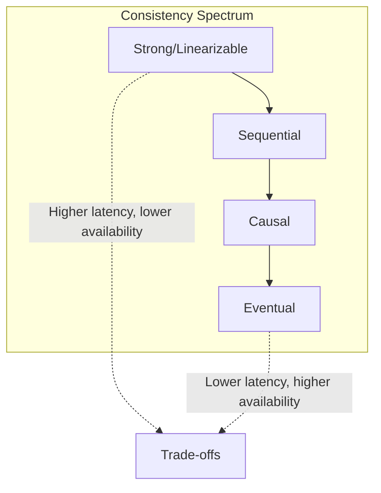
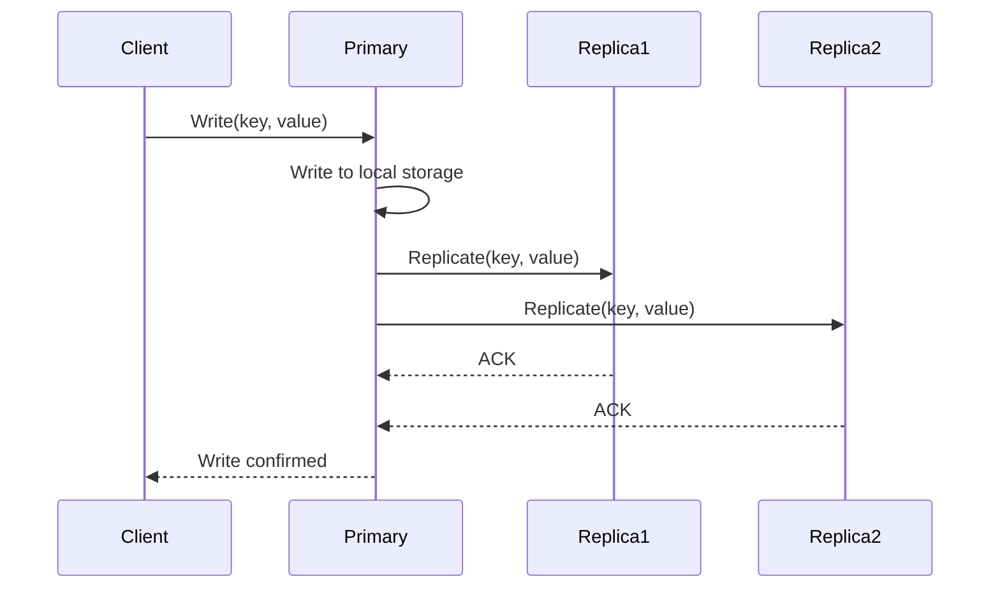
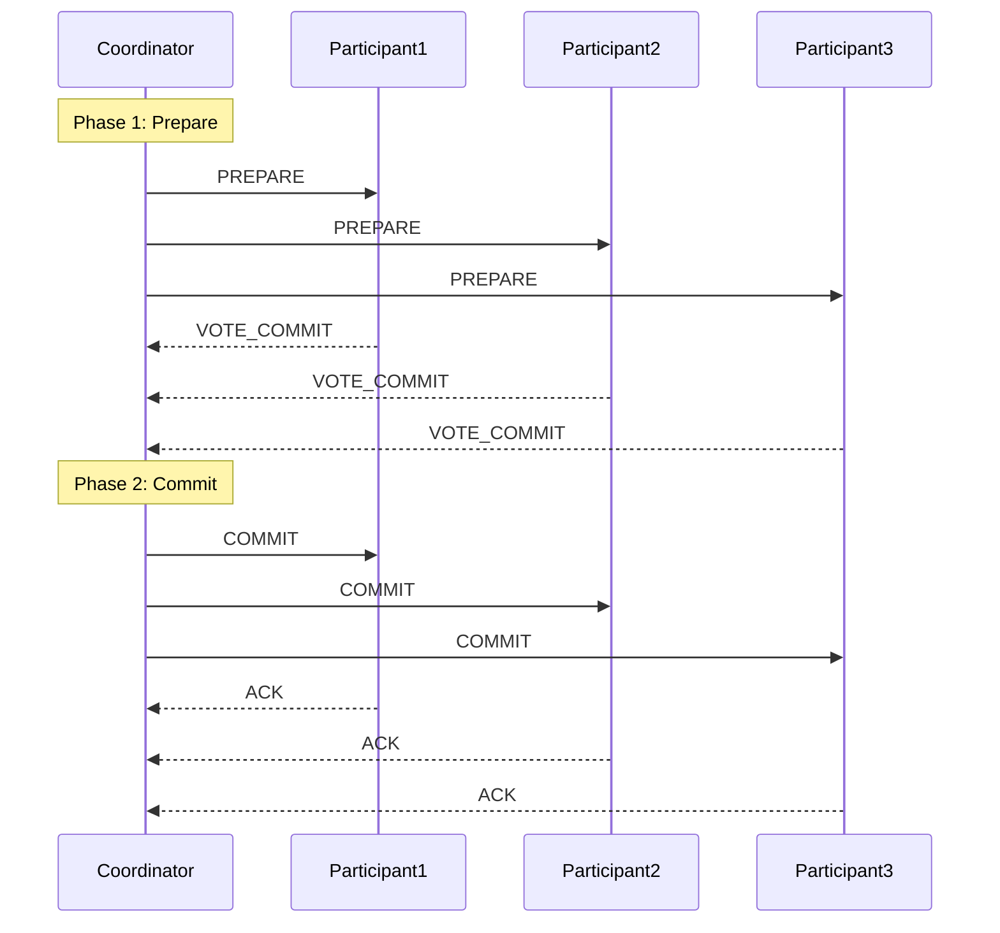
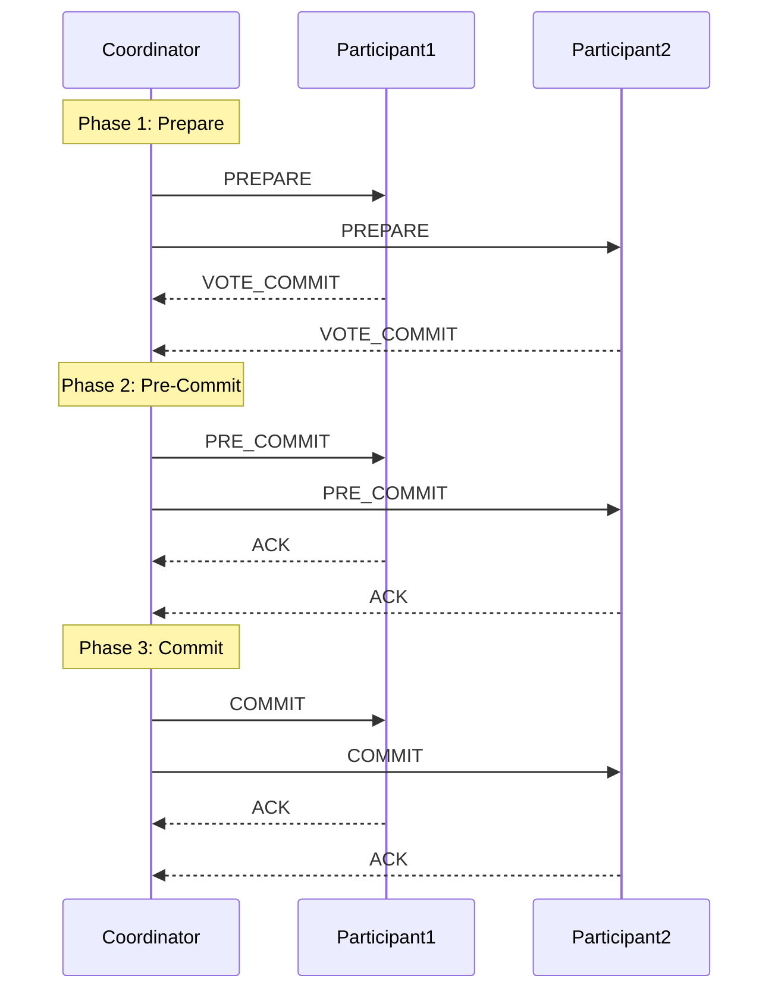
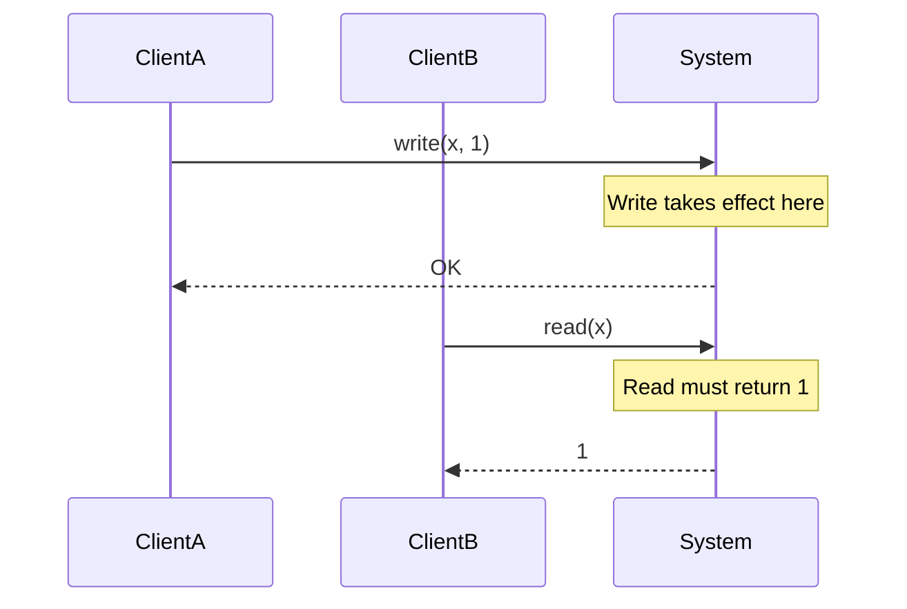
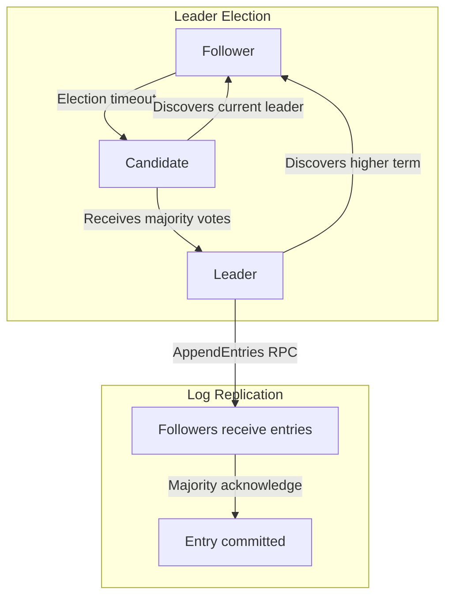

# How to Implement Strong Consistency Patterns

Author: [nawazdhandala](https://github.com/nawazdhandala)

Tags: Consistency, Distributed Systems, Database, Patterns

Description: A practical guide to implementing strong consistency in distributed systems using synchronous replication, two-phase commit, and linearizability.

---

When building distributed systems, consistency guarantees determine how your data behaves under concurrent access and failures. Strong consistency means every read returns the most recent write. It sounds simple, but achieving it across multiple nodes requires careful protocol design and trade-offs in availability and latency.

This guide covers the core patterns for strong consistency: synchronous replication, two-phase commit, and linearizability. You will learn when to use each pattern, how to implement them, and how to handle the failure modes that come with them.

---

## Table of Contents

1. Understanding Consistency Models
2. Synchronous Replication
3. Two-Phase Commit Protocol
4. Linearizability and Sequential Consistency
5. Consensus Protocols
6. Implementing Strong Consistency in Practice
7. Performance and Trade-off Considerations
8. Monitoring Consistency Guarantees
9. Common Pitfalls and Solutions

---

## 1. Understanding Consistency Models

Before implementing strong consistency, you need to understand where it sits in the spectrum of consistency models.

| Model | Guarantee | Use Case |
|-------|-----------|----------|
| Strong (Linearizable) | All operations appear atomic and ordered globally | Financial transactions, inventory systems |
| Sequential | Operations appear in some sequential order, same for all clients | User sessions, ordering systems |
| Causal | Causally related operations maintain order | Social media feeds, collaborative editing |
| Eventual | All replicas converge eventually | Caching, analytics, read-heavy workloads |

Strong consistency is the strictest model. Every operation behaves as if executed on a single machine, even when data is spread across multiple nodes. The CAP theorem tells us this comes at a cost: during network partitions, you must choose between consistency and availability.



When you need strong consistency:

- **Financial systems:** Account balances must reflect all transactions immediately
- **Inventory management:** Stock counts must be accurate to prevent overselling
- **Distributed locks:** Only one client can hold a lock at a time
- **Configuration systems:** All nodes must see the same configuration

---

## 2. Synchronous Replication

Synchronous replication is the foundation of strong consistency. The primary node waits for acknowledgment from replicas before confirming a write to the client.

### How It Works



The write is only confirmed after all replicas acknowledge. This guarantees that any subsequent read from any replica will return the written value.

### Implementation

```typescript
// replication/synchronous-replicator.ts
interface ReplicationResult {
  success: boolean;
  replicaId: string;
  latencyMs: number;
}

interface WriteResult {
  committed: boolean;
  timestamp: number;
  replicasAcked: string[];
}

class SynchronousReplicator {
  private replicas: Map<string, ReplicaConnection> = new Map();
  private writeTimeout: number = 5000;

  constructor(replicaAddresses: string[]) {
    for (const address of replicaAddresses) {
      const id = this.generateReplicaId(address);
      this.replicas.set(id, new ReplicaConnection(address));
    }
  }

  async write(key: string, value: Buffer): Promise<WriteResult> {
    const timestamp = Date.now();
    const writeId = this.generateWriteId();

    // Write to local storage first
    await this.localStorage.write(key, value, timestamp);

    // Replicate to all replicas in parallel
    const replicationPromises: Promise<ReplicationResult>[] = [];

    for (const [replicaId, connection] of this.replicas) {
      replicationPromises.push(
        this.replicateToNode(connection, replicaId, key, value, timestamp, writeId)
      );
    }

    // Wait for all replicas with timeout
    const results = await Promise.allSettled(
      replicationPromises.map((p) =>
        Promise.race([
          p,
          this.timeoutPromise(this.writeTimeout),
        ])
      )
    );

    const successful = results
      .filter((r): r is PromiseFulfilledResult<ReplicationResult> =>
        r.status === 'fulfilled' && r.value.success
      )
      .map((r) => r.value.replicaId);

    // Require all replicas for strong consistency
    const committed = successful.length === this.replicas.size;

    if (!committed) {
      // Rollback local write if replication failed
      await this.localStorage.rollback(key, writeId);
      throw new ReplicationError(
        `Replication failed: ${successful.length}/${this.replicas.size} replicas acknowledged`
      );
    }

    return {
      committed: true,
      timestamp,
      replicasAcked: successful,
    };
  }

  private async replicateToNode(
    connection: ReplicaConnection,
    replicaId: string,
    key: string,
    value: Buffer,
    timestamp: number,
    writeId: string
  ): Promise<ReplicationResult> {
    const start = Date.now();

    try {
      await connection.send({
        type: 'REPLICATE',
        writeId,
        key,
        value,
        timestamp,
      });

      return {
        success: true,
        replicaId,
        latencyMs: Date.now() - start,
      };
    } catch (error) {
      return {
        success: false,
        replicaId,
        latencyMs: Date.now() - start,
      };
    }
  }

  private timeoutPromise(ms: number): Promise<never> {
    return new Promise((_, reject) =>
      setTimeout(() => reject(new Error('Timeout')), ms)
    );
  }

  private generateWriteId(): string {
    return `${Date.now()}-${Math.random().toString(36).substr(2, 9)}`;
  }

  private generateReplicaId(address: string): string {
    return Buffer.from(address).toString('base64').substr(0, 8);
  }
}
```

### Quorum-Based Replication

Waiting for all replicas is slow. Quorum-based replication offers a middle ground. With N replicas, require W writes and R reads where W + R > N.

```typescript
// replication/quorum-replicator.ts
interface QuorumConfig {
  totalReplicas: number;
  writeQuorum: number;
  readQuorum: number;
}

class QuorumReplicator {
  private config: QuorumConfig;
  private replicas: ReplicaConnection[];

  constructor(replicas: ReplicaConnection[], config: QuorumConfig) {
    this.replicas = replicas;
    this.config = config;

    // Validate quorum configuration
    if (config.writeQuorum + config.readQuorum <= config.totalReplicas) {
      throw new Error(
        'Invalid quorum: W + R must be greater than N for strong consistency'
      );
    }
  }

  async write(key: string, value: Buffer): Promise<WriteResult> {
    const timestamp = Date.now();
    const writePromises = this.replicas.map((r) =>
      r.write(key, value, timestamp).catch(() => null)
    );

    const results = await Promise.all(writePromises);
    const successCount = results.filter((r) => r !== null).length;

    if (successCount < this.config.writeQuorum) {
      throw new QuorumError(
        `Write quorum not reached: ${successCount}/${this.config.writeQuorum}`
      );
    }

    return { committed: true, timestamp, replicasAcked: [] };
  }

  async read(key: string): Promise<ReadResult> {
    const readPromises = this.replicas.map((r) =>
      r.read(key).catch(() => null)
    );

    const results = await Promise.all(readPromises);
    const validResults = results.filter((r) => r !== null);

    if (validResults.length < this.config.readQuorum) {
      throw new QuorumError(
        `Read quorum not reached: ${validResults.length}/${this.config.readQuorum}`
      );
    }

    // Return the value with the highest timestamp
    const latest = validResults.reduce((a, b) =>
      a.timestamp > b.timestamp ? a : b
    );

    return latest;
  }
}
```

---

## 3. Two-Phase Commit Protocol

Two-phase commit (2PC) coordinates distributed transactions across multiple participants. It guarantees that either all participants commit or all abort.

### Protocol Flow



### Implementation

```typescript
// transactions/two-phase-commit.ts
type TransactionState =
  | 'INITIATED'
  | 'PREPARING'
  | 'PREPARED'
  | 'COMMITTING'
  | 'COMMITTED'
  | 'ABORTING'
  | 'ABORTED';

interface Transaction {
  id: string;
  state: TransactionState;
  participants: string[];
  operations: TransactionOperation[];
  preparedParticipants: Set<string>;
  committedParticipants: Set<string>;
  createdAt: number;
}

interface TransactionOperation {
  participantId: string;
  type: 'WRITE' | 'DELETE';
  key: string;
  value?: Buffer;
}

class TwoPhaseCommitCoordinator {
  private transactions: Map<string, Transaction> = new Map();
  private participants: Map<string, ParticipantConnection> = new Map();
  private transactionLog: TransactionLog;
  private prepareTimeout = 10000;
  private commitTimeout = 30000;

  constructor(participantAddresses: string[], log: TransactionLog) {
    this.transactionLog = log;
    for (const address of participantAddresses) {
      const id = this.generateParticipantId(address);
      this.participants.set(id, new ParticipantConnection(address));
    }
  }

  async executeTransaction(
    operations: TransactionOperation[]
  ): Promise<TransactionResult> {
    const txId = this.generateTransactionId();
    const participantIds = [...new Set(operations.map((o) => o.participantId))];

    const transaction: Transaction = {
      id: txId,
      state: 'INITIATED',
      participants: participantIds,
      operations,
      preparedParticipants: new Set(),
      committedParticipants: new Set(),
      createdAt: Date.now(),
    };

    this.transactions.set(txId, transaction);
    await this.transactionLog.write(txId, transaction);

    try {
      // Phase 1: Prepare
      await this.preparePhase(transaction);

      // Phase 2: Commit
      await this.commitPhase(transaction);

      return { success: true, transactionId: txId };
    } catch (error) {
      // Abort on any failure
      await this.abortTransaction(transaction);
      throw error;
    }
  }

  private async preparePhase(transaction: Transaction): Promise<void> {
    transaction.state = 'PREPARING';
    await this.transactionLog.write(transaction.id, transaction);

    const preparePromises = transaction.participants.map(async (participantId) => {
      const connection = this.participants.get(participantId);
      if (!connection) {
        throw new Error(`Unknown participant: ${participantId}`);
      }

      const operations = transaction.operations.filter(
        (o) => o.participantId === participantId
      );

      const response = await Promise.race([
        connection.prepare(transaction.id, operations),
        this.timeout(this.prepareTimeout),
      ]);

      if (response.vote === 'COMMIT') {
        transaction.preparedParticipants.add(participantId);
      } else {
        throw new PrepareError(
          `Participant ${participantId} voted ABORT: ${response.reason}`
        );
      }
    });

    await Promise.all(preparePromises);

    transaction.state = 'PREPARED';
    await this.transactionLog.write(transaction.id, transaction);
  }

  private async commitPhase(transaction: Transaction): Promise<void> {
    transaction.state = 'COMMITTING';
    await this.transactionLog.write(transaction.id, transaction);

    // Commit must eventually succeed, retry indefinitely
    const commitPromises = transaction.participants.map(async (participantId) => {
      const connection = this.participants.get(participantId);
      if (!connection) return;

      let committed = false;
      let attempts = 0;

      while (!committed) {
        try {
          await connection.commit(transaction.id);
          transaction.committedParticipants.add(participantId);
          committed = true;
        } catch (error) {
          attempts++;
          console.log(
            `Commit retry ${attempts} for participant ${participantId}`
          );
          await this.delay(Math.min(1000 * Math.pow(2, attempts), 30000));
        }
      }
    });

    await Promise.all(commitPromises);

    transaction.state = 'COMMITTED';
    await this.transactionLog.write(transaction.id, transaction);
  }

  private async abortTransaction(transaction: Transaction): Promise<void> {
    transaction.state = 'ABORTING';
    await this.transactionLog.write(transaction.id, transaction);

    const abortPromises = transaction.participants.map(async (participantId) => {
      const connection = this.participants.get(participantId);
      if (!connection) return;

      try {
        await connection.abort(transaction.id);
      } catch (error) {
        // Log but continue, participant will eventually timeout and abort
        console.error(`Failed to abort on ${participantId}: ${error}`);
      }
    });

    await Promise.all(abortPromises);

    transaction.state = 'ABORTED';
    await this.transactionLog.write(transaction.id, transaction);
  }

  // Recovery: called on coordinator restart
  async recover(): Promise<void> {
    const pendingTransactions = await this.transactionLog.getPending();

    for (const transaction of pendingTransactions) {
      switch (transaction.state) {
        case 'INITIATED':
        case 'PREPARING':
          // Not all participants prepared, abort
          await this.abortTransaction(transaction);
          break;

        case 'PREPARED':
        case 'COMMITTING':
          // All participants prepared, must commit
          await this.commitPhase(transaction);
          break;

        case 'ABORTING':
          // Continue abort
          await this.abortTransaction(transaction);
          break;
      }
    }
  }

  private timeout(ms: number): Promise<never> {
    return new Promise((_, reject) =>
      setTimeout(() => reject(new Error('Timeout')), ms)
    );
  }

  private delay(ms: number): Promise<void> {
    return new Promise((resolve) => setTimeout(resolve, ms));
  }

  private generateTransactionId(): string {
    return `tx-${Date.now()}-${Math.random().toString(36).substr(2, 9)}`;
  }

  private generateParticipantId(address: string): string {
    return Buffer.from(address).toString('base64').substr(0, 8);
  }
}
```

### Participant Implementation

```typescript
// transactions/participant.ts
interface ParticipantTransaction {
  id: string;
  state: 'ACTIVE' | 'PREPARED' | 'COMMITTED' | 'ABORTED';
  operations: TransactionOperation[];
  undoLog: UndoLogEntry[];
}

class TwoPhaseCommitParticipant {
  private transactions: Map<string, ParticipantTransaction> = new Map();
  private storage: KeyValueStorage;
  private transactionLog: TransactionLog;

  constructor(storage: KeyValueStorage, log: TransactionLog) {
    this.storage = storage;
    this.transactionLog = log;
  }

  async prepare(
    txId: string,
    operations: TransactionOperation[]
  ): Promise<PrepareResponse> {
    // Check if we can execute all operations
    const undoLog: UndoLogEntry[] = [];

    try {
      for (const op of operations) {
        // Acquire locks
        const locked = await this.storage.tryLock(op.key, txId);
        if (!locked) {
          throw new Error(`Cannot acquire lock for key: ${op.key}`);
        }

        // Record undo information
        const currentValue = await this.storage.get(op.key);
        undoLog.push({
          key: op.key,
          previousValue: currentValue,
          operation: op.type,
        });

        // Apply operation tentatively
        if (op.type === 'WRITE') {
          await this.storage.write(op.key, op.value!, { tentative: true, txId });
        } else if (op.type === 'DELETE') {
          await this.storage.delete(op.key, { tentative: true, txId });
        }
      }

      // Log prepared state
      const transaction: ParticipantTransaction = {
        id: txId,
        state: 'PREPARED',
        operations,
        undoLog,
      };

      await this.transactionLog.write(txId, transaction);
      this.transactions.set(txId, transaction);

      return { vote: 'COMMIT' };
    } catch (error) {
      // Rollback tentative changes
      await this.rollback(undoLog, txId);
      return { vote: 'ABORT', reason: (error as Error).message };
    }
  }

  async commit(txId: string): Promise<void> {
    const transaction = this.transactions.get(txId);
    if (!transaction) {
      throw new Error(`Unknown transaction: ${txId}`);
    }

    // Make tentative changes permanent
    for (const op of transaction.operations) {
      await this.storage.finalize(op.key, txId);
      await this.storage.unlock(op.key, txId);
    }

    transaction.state = 'COMMITTED';
    await this.transactionLog.write(txId, transaction);
  }

  async abort(txId: string): Promise<void> {
    const transaction = this.transactions.get(txId);
    if (!transaction) {
      return; // Already aborted or never existed
    }

    await this.rollback(transaction.undoLog, txId);

    transaction.state = 'ABORTED';
    await this.transactionLog.write(txId, transaction);
  }

  private async rollback(undoLog: UndoLogEntry[], txId: string): Promise<void> {
    // Apply undo operations in reverse order
    for (const entry of undoLog.reverse()) {
      if (entry.previousValue !== null) {
        await this.storage.write(entry.key, entry.previousValue, { force: true });
      } else {
        await this.storage.delete(entry.key, { force: true });
      }
      await this.storage.unlock(entry.key, txId);
    }
  }

  // Recovery: called on participant restart
  async recover(): Promise<void> {
    const pendingTransactions = await this.transactionLog.getPending();

    for (const transaction of pendingTransactions) {
      if (transaction.state === 'PREPARED') {
        // Wait for coordinator decision
        // In practice, query coordinator or use timeout
        console.log(`Awaiting decision for transaction ${transaction.id}`);
      }
    }
  }
}
```

### 2PC Limitations and Three-Phase Commit

Two-phase commit has a blocking problem: if the coordinator fails after sending PREPARE but before sending COMMIT, participants remain blocked indefinitely. Three-phase commit (3PC) adds a PRE-COMMIT phase to reduce blocking.



The PRE-COMMIT phase allows participants to safely abort if they timeout waiting for the final COMMIT, because they know no other participant has committed yet.

---

## 4. Linearizability and Sequential Consistency

Linearizability is the gold standard of consistency. Every operation appears to take effect instantaneously at some point between its invocation and response.

### Linearizability Definition



Key properties:
- **Real-time ordering:** If operation A completes before operation B starts, A must appear before B in the global order
- **Atomic visibility:** Once a write is visible to any client, it is visible to all clients

### Implementing Linearizable Reads

The simplest approach is to route all reads through the leader node:

```typescript
// linearizable/leader-reads.ts
class LinearizableKeyValueStore {
  private isLeader: boolean = false;
  private leaderId: string | null = null;
  private data: Map<string, VersionedValue> = new Map();
  private version: number = 0;

  async read(key: string): Promise<ReadResult> {
    if (!this.isLeader) {
      // Forward to leader
      return this.forwardToLeader('READ', { key });
    }

    // Ensure we are still leader before responding
    const confirmed = await this.confirmLeadership();
    if (!confirmed) {
      throw new NotLeaderError('Leadership lost during read');
    }

    const value = this.data.get(key);
    return {
      value: value?.data || null,
      version: value?.version || 0,
    };
  }

  async write(key: string, value: Buffer): Promise<WriteResult> {
    if (!this.isLeader) {
      return this.forwardToLeader('WRITE', { key, value });
    }

    // Confirm leadership
    const confirmed = await this.confirmLeadership();
    if (!confirmed) {
      throw new NotLeaderError('Leadership lost during write');
    }

    // Increment version and write
    this.version++;
    const versionedValue: VersionedValue = {
      data: value,
      version: this.version,
      timestamp: Date.now(),
    };

    // Replicate to followers synchronously
    await this.replicator.replicate(key, versionedValue);

    this.data.set(key, versionedValue);

    return {
      success: true,
      version: this.version,
    };
  }

  private async confirmLeadership(): Promise<boolean> {
    // In Raft/Paxos, this checks that our lease is still valid
    // or that we can still reach a quorum
    return this.leaseManager.isLeaseValid();
  }

  private async forwardToLeader(
    operation: string,
    params: Record<string, unknown>
  ): Promise<unknown> {
    if (!this.leaderId) {
      throw new NoLeaderError('No leader available');
    }

    const leader = this.clusterManager.getNode(this.leaderId);
    return leader.forward(operation, params);
  }
}
```

### Read-Your-Writes Consistency

A weaker but useful guarantee is read-your-writes: a client always sees its own writes.

```typescript
// consistency/read-your-writes.ts
interface ClientSession {
  clientId: string;
  lastWriteVersion: number;
  lastWriteTimestamp: number;
}

class ReadYourWritesStore {
  private data: Map<string, VersionedValue> = new Map();
  private sessions: Map<string, ClientSession> = new Map();

  async write(
    clientId: string,
    key: string,
    value: Buffer
  ): Promise<WriteResult> {
    const version = Date.now();

    this.data.set(key, { data: value, version, timestamp: version });

    // Track client's last write
    const session = this.sessions.get(clientId) || {
      clientId,
      lastWriteVersion: 0,
      lastWriteTimestamp: 0,
    };

    session.lastWriteVersion = version;
    session.lastWriteTimestamp = Date.now();
    this.sessions.set(clientId, session);

    return { success: true, version };
  }

  async read(clientId: string, key: string): Promise<ReadResult> {
    const session = this.sessions.get(clientId);
    const value = this.data.get(key);

    if (session && value && value.version < session.lastWriteVersion) {
      // Client wrote more recently than this value
      // Wait for replication to catch up
      await this.waitForVersion(key, session.lastWriteVersion);
    }

    const current = this.data.get(key);
    return {
      value: current?.data || null,
      version: current?.version || 0,
    };
  }

  private async waitForVersion(
    key: string,
    minVersion: number
  ): Promise<void> {
    const maxWait = 5000;
    const start = Date.now();

    while (Date.now() - start < maxWait) {
      const value = this.data.get(key);
      if (value && value.version >= minVersion) {
        return;
      }
      await new Promise((resolve) => setTimeout(resolve, 100));
    }

    throw new ConsistencyError('Timed out waiting for write to propagate');
  }
}
```

---

## 5. Consensus Protocols

Strong consistency in the presence of failures requires consensus protocols. The two most common are Paxos and Raft.

### Raft Consensus Overview

Raft divides consensus into three sub-problems: leader election, log replication, and safety.



### Simplified Raft Implementation

```typescript
// consensus/raft-node.ts
type NodeState = 'FOLLOWER' | 'CANDIDATE' | 'LEADER';

interface LogEntry {
  term: number;
  index: number;
  command: Command;
}

interface RaftState {
  currentTerm: number;
  votedFor: string | null;
  log: LogEntry[];
  commitIndex: number;
  lastApplied: number;
}

class RaftNode {
  private nodeId: string;
  private state: NodeState = 'FOLLOWER';
  private raftState: RaftState;
  private peers: Map<string, PeerConnection>;
  private electionTimeout: NodeJS.Timeout | null = null;
  private heartbeatInterval: NodeJS.Timeout | null = null;

  // Leader state
  private nextIndex: Map<string, number> = new Map();
  private matchIndex: Map<string, number> = new Map();

  constructor(
    nodeId: string,
    peers: string[],
    persistedState?: RaftState
  ) {
    this.nodeId = nodeId;
    this.raftState = persistedState || {
      currentTerm: 0,
      votedFor: null,
      log: [],
      commitIndex: 0,
      lastApplied: 0,
    };

    this.peers = new Map();
    for (const peer of peers) {
      this.peers.set(peer, new PeerConnection(peer));
    }

    this.resetElectionTimeout();
  }

  // Called when a client wants to write
  async propose(command: Command): Promise<ProposeResult> {
    if (this.state !== 'LEADER') {
      throw new NotLeaderError(`Current leader: ${this.getLeaderId()}`);
    }

    const entry: LogEntry = {
      term: this.raftState.currentTerm,
      index: this.raftState.log.length,
      command,
    };

    this.raftState.log.push(entry);
    await this.persistState();

    // Replicate to followers
    await this.replicateEntry(entry);

    return { success: true, index: entry.index };
  }

  private async replicateEntry(entry: LogEntry): Promise<void> {
    const replicationPromises: Promise<boolean>[] = [];

    for (const [peerId, connection] of this.peers) {
      replicationPromises.push(this.sendAppendEntries(peerId, connection));
    }

    const results = await Promise.all(replicationPromises);
    const successCount = results.filter((r) => r).length + 1; // +1 for self

    const majority = Math.floor(this.peers.size / 2) + 1;

    if (successCount >= majority) {
      // Entry is committed
      this.raftState.commitIndex = entry.index;
      await this.applyCommittedEntries();
    }
  }

  private async sendAppendEntries(
    peerId: string,
    connection: PeerConnection
  ): Promise<boolean> {
    const nextIdx = this.nextIndex.get(peerId) || 0;
    const prevLogIndex = nextIdx - 1;
    const prevLogTerm =
      prevLogIndex >= 0 ? this.raftState.log[prevLogIndex].term : 0;

    const entries = this.raftState.log.slice(nextIdx);

    try {
      const response = await connection.appendEntries({
        term: this.raftState.currentTerm,
        leaderId: this.nodeId,
        prevLogIndex,
        prevLogTerm,
        entries,
        leaderCommit: this.raftState.commitIndex,
      });

      if (response.success) {
        this.nextIndex.set(peerId, nextIdx + entries.length);
        this.matchIndex.set(peerId, nextIdx + entries.length - 1);
        return true;
      } else {
        // Decrement nextIndex and retry
        this.nextIndex.set(peerId, Math.max(0, nextIdx - 1));
        return false;
      }
    } catch (error) {
      return false;
    }
  }

  // Handle incoming AppendEntries RPC
  async handleAppendEntries(
    request: AppendEntriesRequest
  ): Promise<AppendEntriesResponse> {
    // Reset election timeout
    this.resetElectionTimeout();

    if (request.term < this.raftState.currentTerm) {
      return { term: this.raftState.currentTerm, success: false };
    }

    if (request.term > this.raftState.currentTerm) {
      this.raftState.currentTerm = request.term;
      this.state = 'FOLLOWER';
    }

    // Check log consistency
    if (request.prevLogIndex >= 0) {
      const prevEntry = this.raftState.log[request.prevLogIndex];
      if (!prevEntry || prevEntry.term !== request.prevLogTerm) {
        return { term: this.raftState.currentTerm, success: false };
      }
    }

    // Append new entries
    for (const entry of request.entries) {
      if (entry.index < this.raftState.log.length) {
        // Check for conflicts
        if (this.raftState.log[entry.index].term !== entry.term) {
          // Delete conflicting entries
          this.raftState.log = this.raftState.log.slice(0, entry.index);
        }
      }
      if (entry.index >= this.raftState.log.length) {
        this.raftState.log.push(entry);
      }
    }

    // Update commit index
    if (request.leaderCommit > this.raftState.commitIndex) {
      this.raftState.commitIndex = Math.min(
        request.leaderCommit,
        this.raftState.log.length - 1
      );
      await this.applyCommittedEntries();
    }

    await this.persistState();

    return { term: this.raftState.currentTerm, success: true };
  }

  private async applyCommittedEntries(): Promise<void> {
    while (this.raftState.lastApplied < this.raftState.commitIndex) {
      this.raftState.lastApplied++;
      const entry = this.raftState.log[this.raftState.lastApplied];
      await this.stateMachine.apply(entry.command);
    }
  }

  private resetElectionTimeout(): void {
    if (this.electionTimeout) {
      clearTimeout(this.electionTimeout);
    }

    // Random timeout between 150-300ms
    const timeout = 150 + Math.random() * 150;

    this.electionTimeout = setTimeout(() => {
      this.startElection();
    }, timeout);
  }

  private async startElection(): Promise<void> {
    this.state = 'CANDIDATE';
    this.raftState.currentTerm++;
    this.raftState.votedFor = this.nodeId;
    await this.persistState();

    let votes = 1; // Vote for self
    const majority = Math.floor(this.peers.size / 2) + 1;

    const votePromises = Array.from(this.peers.entries()).map(
      async ([peerId, connection]) => {
        try {
          const response = await connection.requestVote({
            term: this.raftState.currentTerm,
            candidateId: this.nodeId,
            lastLogIndex: this.raftState.log.length - 1,
            lastLogTerm:
              this.raftState.log.length > 0
                ? this.raftState.log[this.raftState.log.length - 1].term
                : 0,
          });

          if (response.voteGranted) {
            votes++;
          }
        } catch (error) {
          // Peer unavailable
        }
      }
    );

    await Promise.all(votePromises);

    if (this.state === 'CANDIDATE' && votes >= majority) {
      this.becomeLeader();
    } else {
      this.resetElectionTimeout();
    }
  }

  private becomeLeader(): void {
    this.state = 'LEADER';

    // Initialize leader state
    for (const peerId of this.peers.keys()) {
      this.nextIndex.set(peerId, this.raftState.log.length);
      this.matchIndex.set(peerId, -1);
    }

    // Start heartbeats
    this.heartbeatInterval = setInterval(() => {
      this.sendHeartbeats();
    }, 50);
  }

  private async sendHeartbeats(): Promise<void> {
    for (const [peerId, connection] of this.peers) {
      await this.sendAppendEntries(peerId, connection);
    }
  }

  private async persistState(): Promise<void> {
    await this.storage.write('raft-state', this.raftState);
  }

  private getLeaderId(): string | null {
    // Implementation depends on how leader is tracked
    return null;
  }
}
```

---

## 6. Implementing Strong Consistency in Practice

### Database Configuration

Most databases support strong consistency with proper configuration:

**PostgreSQL Synchronous Replication:**

```sql
-- On primary: configure synchronous standbys
ALTER SYSTEM SET synchronous_standby_names = 'FIRST 2 (standby1, standby2)';
ALTER SYSTEM SET synchronous_commit = 'on';
SELECT pg_reload_conf();
```

**CockroachDB (Raft-based):**

```sql
-- Strong consistency is default, configure replication factor
ALTER DATABASE mydb CONFIGURE ZONE USING num_replicas = 3;

-- Require all reads to go through Raft leader
SET CLUSTER SETTING kv.follower_read.enabled = false;
```

**etcd (Raft-based):**

```yaml
# etcd cluster configuration
name: node1
initial-cluster: node1=http://10.0.0.1:2380,node2=http://10.0.0.2:2380,node3=http://10.0.0.3:2380
initial-cluster-state: new
initial-cluster-token: etcd-cluster-1
```

### Application-Level Consistency

When your database provides only eventual consistency, you can implement strong consistency at the application level:

```typescript
// consistency/application-lock.ts
class DistributedLock {
  private redis: RedisClient;
  private lockTimeout = 30000;

  constructor(redis: RedisClient) {
    this.redis = redis;
  }

  async withLock<T>(
    resourceId: string,
    operation: () => Promise<T>
  ): Promise<T> {
    const lockKey = `lock:${resourceId}`;
    const lockValue = this.generateLockId();

    // Acquire lock with NX (only if not exists) and PX (expiry)
    const acquired = await this.redis.set(
      lockKey,
      lockValue,
      'NX',
      'PX',
      this.lockTimeout
    );

    if (!acquired) {
      throw new LockError(`Could not acquire lock for ${resourceId}`);
    }

    try {
      return await operation();
    } finally {
      // Release lock only if we still own it
      await this.releaseLock(lockKey, lockValue);
    }
  }

  private async releaseLock(key: string, value: string): Promise<void> {
    // Lua script to atomically check and delete
    const script = `
      if redis.call("get", KEYS[1]) == ARGV[1] then
        return redis.call("del", KEYS[1])
      else
        return 0
      end
    `;

    await this.redis.eval(script, 1, key, value);
  }

  private generateLockId(): string {
    return `${process.pid}-${Date.now()}-${Math.random().toString(36)}`;
  }
}

// Usage
class InventoryService {
  private lock: DistributedLock;
  private db: Database;

  async reserveStock(productId: string, quantity: number): Promise<void> {
    await this.lock.withLock(`inventory:${productId}`, async () => {
      const current = await this.db.query(
        'SELECT quantity FROM inventory WHERE product_id = $1 FOR UPDATE',
        [productId]
      );

      if (current.quantity < quantity) {
        throw new InsufficientStockError();
      }

      await this.db.query(
        'UPDATE inventory SET quantity = quantity - $1 WHERE product_id = $2',
        [quantity, productId]
      );
    });
  }
}
```

---

## 7. Performance and Trade-off Considerations

Strong consistency is not free. Understanding the costs helps you make informed decisions.

### Latency Impact

| Operation Type | Eventually Consistent | Strongly Consistent |
|----------------|----------------------|---------------------|
| Single-node write | 1-5ms | 1-5ms |
| Replicated write (3 nodes) | 1-5ms (async) | 10-50ms (sync) |
| Cross-datacenter write | 1-5ms (async) | 100-300ms (sync) |
| Read from follower | 1-5ms | N/A (must read leader) |

### Throughput Impact

Synchronous replication limits throughput to the slowest replica. With three replicas:

```
Throughput = min(Replica1_throughput, Replica2_throughput, Replica3_throughput)
```

For writes that require consensus:

```
Throughput = Consensus_rounds_per_second * Batch_size
```

### Availability Trade-offs

Strong consistency requires a quorum of nodes to be available:

| Cluster Size | Fault Tolerance | Availability (99.9% per node) |
|--------------|-----------------|-------------------------------|
| 3 nodes | 1 failure | 99.9997% |
| 5 nodes | 2 failures | 99.99999% |
| 7 nodes | 3 failures | 99.9999999% |

### When to Use Weaker Consistency

Not everything needs strong consistency. Use eventual consistency when:

- Data can be temporarily stale (user profile views)
- Operations are idempotent (incrementing view counts)
- Conflicts can be resolved automatically (CRDTs)
- Read latency is critical (caching layers)

---

## 8. Monitoring Consistency Guarantees

You cannot improve what you cannot measure. Monitor these metrics to verify your consistency guarantees:

### Replication Lag

```typescript
// monitoring/replication-lag.ts
interface ReplicationLagMetrics {
  replicaId: string;
  lagBytes: number;
  lagSeconds: number;
  lastHeartbeat: number;
}

class ReplicationMonitor {
  private metrics: MetricsClient;

  async collectLagMetrics(replicas: Replica[]): Promise<void> {
    for (const replica of replicas) {
      const lag = await replica.getReplicationLag();

      this.metrics.gauge('replication.lag.bytes', lag.bytes, {
        replica: replica.id,
      });

      this.metrics.gauge('replication.lag.seconds', lag.seconds, {
        replica: replica.id,
      });

      // Alert if lag exceeds threshold
      if (lag.seconds > 5) {
        this.metrics.increment('replication.lag.alerts', {
          replica: replica.id,
          severity: 'warning',
        });
      }
    }
  }
}
```

### Consistency Violations

```typescript
// monitoring/consistency-checker.ts
class ConsistencyChecker {
  private metrics: MetricsClient;

  async checkLinearizability(
    writeTimestamp: number,
    readTimestamp: number,
    writeValue: string,
    readValue: string
  ): Promise<void> {
    // If read happened after write completed, it must see the write
    if (readTimestamp > writeTimestamp && readValue !== writeValue) {
      this.metrics.increment('consistency.violations', {
        type: 'linearizability',
      });

      console.error(
        `Linearizability violation: write at ${writeTimestamp}, ` +
        `read at ${readTimestamp}, expected ${writeValue}, got ${readValue}`
      );
    }
  }

  async checkReadYourWrites(
    clientId: string,
    writeVersion: number,
    readVersion: number
  ): Promise<void> {
    if (readVersion < writeVersion) {
      this.metrics.increment('consistency.violations', {
        type: 'read-your-writes',
        client: clientId,
      });
    }
  }
}
```

### Consensus Protocol Health

```typescript
// monitoring/raft-health.ts
interface RaftHealthMetrics {
  state: 'leader' | 'follower' | 'candidate';
  term: number;
  commitIndex: number;
  lastApplied: number;
  leaderHeartbeatAge: number;
}

class RaftHealthMonitor {
  private node: RaftNode;
  private metrics: MetricsClient;

  collectMetrics(): void {
    const state = this.node.getState();

    this.metrics.gauge('raft.term', state.currentTerm);
    this.metrics.gauge('raft.commit_index', state.commitIndex);
    this.metrics.gauge('raft.last_applied', state.lastApplied);

    this.metrics.gauge('raft.is_leader', state.isLeader ? 1 : 0);

    // Track log entries pending application
    const pending = state.commitIndex - state.lastApplied;
    this.metrics.gauge('raft.pending_entries', pending);

    // Alert on election storms
    if (state.electionCount > 5) {
      this.metrics.increment('raft.election_storm');
    }
  }
}
```

---

## 9. Common Pitfalls and Solutions

### Pitfall 1: Stale Reads After Failover

**Problem:** After a leader failover, the new leader may not have all committed entries, causing stale reads.

**Solution:** Wait for new leader to commit a no-op entry before serving reads:

```typescript
async function waitForLeaderReady(): Promise<void> {
  // Propose a no-op command
  await raftNode.propose({ type: 'NO_OP' });
  // If this succeeds, leader has caught up
}
```

### Pitfall 2: Split Brain

**Problem:** Network partition causes two nodes to both think they are the leader.

**Solution:** Use lease-based leadership with careful timing:

```typescript
class LeaseManager {
  private leaseExpiry: number = 0;
  private leaseDuration = 10000;
  private clockSkewMargin = 1000;

  async acquireLease(): Promise<boolean> {
    const now = Date.now();

    // Write lease to majority of nodes
    const granted = await this.writeLeaseToQuorum(now + this.leaseDuration);

    if (granted) {
      // Use shorter expiry locally to account for clock skew
      this.leaseExpiry = now + this.leaseDuration - this.clockSkewMargin;
      return true;
    }

    return false;
  }

  isLeaseValid(): boolean {
    return Date.now() < this.leaseExpiry;
  }
}
```

### Pitfall 3: Deadlocks in 2PC

**Problem:** Circular dependencies between transactions cause deadlocks.

**Solution:** Implement deadlock detection or use timeouts with exponential backoff:

```typescript
class DeadlockDetector {
  private waitGraph: Map<string, Set<string>> = new Map();

  addWait(waiter: string, holder: string): void {
    const waiting = this.waitGraph.get(waiter) || new Set();
    waiting.add(holder);
    this.waitGraph.set(waiter, waiting);

    if (this.hasCycle(waiter, new Set())) {
      throw new DeadlockError(`Deadlock detected involving ${waiter}`);
    }
  }

  private hasCycle(node: string, visited: Set<string>): boolean {
    if (visited.has(node)) {
      return true;
    }

    visited.add(node);
    const neighbors = this.waitGraph.get(node) || new Set();

    for (const neighbor of neighbors) {
      if (this.hasCycle(neighbor, visited)) {
        return true;
      }
    }

    visited.delete(node);
    return false;
  }
}
```

### Pitfall 4: Performance Degradation Under Load

**Problem:** Synchronous replication latency increases under high load.

**Solution:** Batch writes and use pipelining:

```typescript
class BatchingReplicator {
  private batch: WriteRequest[] = [];
  private batchTimeout: NodeJS.Timeout | null = null;
  private maxBatchSize = 100;
  private maxBatchDelay = 10;

  async write(key: string, value: Buffer): Promise<WriteResult> {
    return new Promise((resolve, reject) => {
      this.batch.push({ key, value, resolve, reject });

      if (this.batch.length >= this.maxBatchSize) {
        this.flushBatch();
      } else if (!this.batchTimeout) {
        this.batchTimeout = setTimeout(
          () => this.flushBatch(),
          this.maxBatchDelay
        );
      }
    });
  }

  private async flushBatch(): Promise<void> {
    if (this.batchTimeout) {
      clearTimeout(this.batchTimeout);
      this.batchTimeout = null;
    }

    const currentBatch = this.batch;
    this.batch = [];

    try {
      // Send entire batch to replicas
      await this.replicateBatch(currentBatch);

      for (const request of currentBatch) {
        request.resolve({ success: true });
      }
    } catch (error) {
      for (const request of currentBatch) {
        request.reject(error);
      }
    }
  }
}
```

---

## Summary

Strong consistency guarantees that your distributed system behaves as if it were a single machine. The main patterns to achieve this are:

| Pattern | Use Case | Trade-off |
|---------|----------|-----------|
| Synchronous replication | Data must survive node failures | Higher write latency |
| Two-phase commit | Atomic transactions across services | Blocking on coordinator failure |
| Linearizability | Strict ordering requirements | All reads through leader |
| Consensus (Raft/Paxos) | Fault-tolerant leader election | Complexity, quorum required |

Key implementation principles:

1. **Always persist before acknowledging:** Write to durable storage before confirming to clients
2. **Use fencing tokens:** Prevent stale leaders from corrupting data
3. **Monitor replication lag:** Alert before lag affects consistency guarantees
4. **Plan for partitions:** Decide upfront whether to sacrifice consistency or availability
5. **Test failure modes:** Inject failures to verify your consistency guarantees hold

Strong consistency is expensive but necessary for certain workloads. Understand your requirements, measure the cost, and choose the right pattern for each part of your system.

---

**Related Reading:**

- [SRE Best Practices](/blog/post/2025-11-28-sre-best-practices/)
- [How to Implement the Choreography Pattern in Microservices](/blog/post/2026-01-30-choreography-pattern/)
