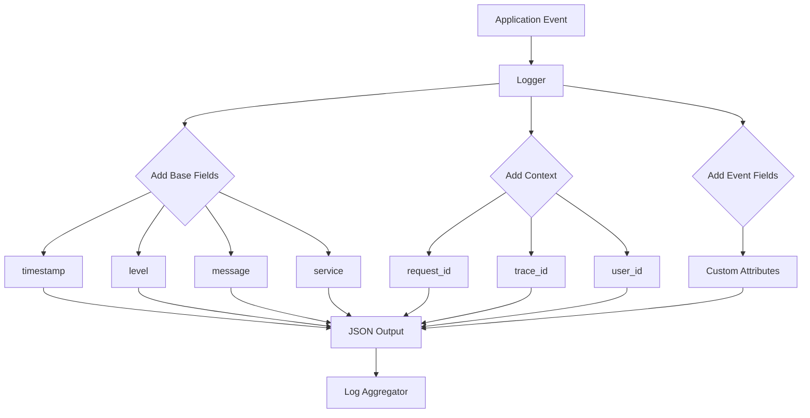

# How to Implement Structured Logging Format

Author: [nawazdhandala](https://www.github.com/nawazdhandala)

Tags: Logging, Observability, JSON, Best Practices, DevOps

Description: Implement structured logging with JSON format, consistent fields, context propagation, and log levels for better searchability and analysis.

---

If you have ever tried to debug a production issue by searching through unstructured log files, you know the pain. Grepping through thousands of lines hoping to find that one needle in the haystack is frustrating and time-consuming. Structured logging solves this by making your logs machine-readable while keeping them human-friendly.

In this guide, we will build a structured logging implementation from scratch, covering JSON formatting, field standardization, context propagation, and practical patterns you can use in production.

---

## What is Structured Logging?

Structured logging means outputting logs in a consistent, parseable format rather than free-form text strings. Instead of this:

```
2026-01-30 14:23:45 ERROR User login failed for john@example.com - invalid password from 192.168.1.50
```

You get this:

```json
{
  "timestamp": "2026-01-30T14:23:45.123Z",
  "level": "error",
  "message": "User login failed",
  "user_email": "john@example.com",
  "error_reason": "invalid_password",
  "client_ip": "192.168.1.50",
  "service": "auth-api"
}
```

The second format lets you query by any field, aggregate data, and build dashboards without regex gymnastics.

---

## Core Components of Structured Logs

Every structured log entry should include certain base fields. Here is a flow showing how these components come together:



---

## Building a Structured Logger

Let us build a practical structured logger in Python. This implementation includes all the essentials: base fields, context management, and proper JSON formatting.

First, create the core logger class:

```python
# structured_logger.py
# A production-ready structured logging implementation

import json
import logging
import threading
from datetime import datetime, timezone
from typing import Any, Optional
from contextvars import ContextVar

# Context variable for request-scoped data
# This allows us to pass context through async code automatically
log_context: ContextVar[dict] = ContextVar('log_context', default={})


class StructuredFormatter(logging.Formatter):
    """
    Custom formatter that outputs JSON-structured logs.
    Each log entry includes base fields plus any additional context.
    """

    def __init__(self, service_name: str, environment: str = "production"):
        super().__init__()
        self.service_name = service_name
        self.environment = environment

    def format(self, record: logging.LogRecord) -> str:
        # Build the base log entry with required fields
        log_entry = {
            "timestamp": datetime.now(timezone.utc).isoformat(),
            "level": record.levelname.lower(),
            "message": record.getMessage(),
            "service": self.service_name,
            "environment": self.environment,
            "logger": record.name,
        }

        # Add file and line information for debugging
        log_entry["source"] = {
            "file": record.filename,
            "line": record.lineno,
            "function": record.funcName
        }

        # Merge in request context if available
        context = log_context.get()
        if context:
            log_entry.update(context)

        # Add any extra fields passed to the log call
        if hasattr(record, 'extra_fields'):
            log_entry.update(record.extra_fields)

        # Handle exceptions with full stack traces
        if record.exc_info:
            log_entry["exception"] = {
                "type": record.exc_info[0].__name__,
                "message": str(record.exc_info[1]),
                "traceback": self.formatException(record.exc_info)
            }

        return json.dumps(log_entry, default=str)


class StructuredLogger:
    """
    Logger wrapper that provides structured logging methods.
    Supports adding context and custom fields to every log entry.
    """

    def __init__(self, name: str, service_name: str, environment: str = "production"):
        self.logger = logging.getLogger(name)
        self.logger.setLevel(logging.DEBUG)

        # Remove default handlers and add our structured formatter
        self.logger.handlers = []
        handler = logging.StreamHandler()
        handler.setFormatter(StructuredFormatter(service_name, environment))
        self.logger.addHandler(handler)

    def _log(self, level: int, message: str, **fields):
        """Internal method to add extra fields to log records."""
        extra = {'extra_fields': fields} if fields else {}
        self.logger.log(level, message, extra=extra)

    def debug(self, message: str, **fields):
        """Log detailed debugging information."""
        self._log(logging.DEBUG, message, **fields)

    def info(self, message: str, **fields):
        """Log general informational messages."""
        self._log(logging.INFO, message, **fields)

    def warning(self, message: str, **fields):
        """Log warning conditions that should be reviewed."""
        self._log(logging.WARNING, message, **fields)

    def error(self, message: str, exc_info: bool = False, **fields):
        """Log error conditions. Set exc_info=True to include stack trace."""
        self.logger.error(message, exc_info=exc_info, extra={'extra_fields': fields})

    def critical(self, message: str, exc_info: bool = False, **fields):
        """Log critical failures requiring immediate attention."""
        self.logger.critical(message, exc_info=exc_info, extra={'extra_fields': fields})
```

---

## Context Propagation

One of the most valuable aspects of structured logging is automatic context propagation. When a request comes in, you set context once, and every log entry in that request lifecycle includes it.

```python
# context_manager.py
# Utilities for managing log context across requests

from contextlib import contextmanager
from typing import Optional
import uuid


@contextmanager
def logging_context(**kwargs):
    """
    Context manager that sets logging context for a code block.
    All logs within the block will include these fields.

    Usage:
        with logging_context(request_id="abc123", user_id="user456"):
            logger.info("Processing request")  # Includes request_id and user_id
    """
    # Get current context and merge new values
    current = log_context.get().copy()
    current.update(kwargs)

    # Set the new context
    token = log_context.set(current)
    try:
        yield
    finally:
        # Restore previous context
        log_context.reset(token)


def set_request_context(
    request_id: Optional[str] = None,
    trace_id: Optional[str] = None,
    user_id: Optional[str] = None,
    tenant_id: Optional[str] = None
):
    """
    Set context for the current request.
    Generates a request_id if not provided.
    """
    context = {
        "request_id": request_id or str(uuid.uuid4()),
    }

    # Only add optional fields if provided
    if trace_id:
        context["trace_id"] = trace_id
    if user_id:
        context["user_id"] = user_id
    if tenant_id:
        context["tenant_id"] = tenant_id

    log_context.set(context)
```

---

## Integrating with Web Frameworks

Here is how to integrate structured logging with Flask. The middleware sets up context at the start of each request:

```python
# flask_integration.py
# Middleware for automatic request logging in Flask

from flask import Flask, request, g
from functools import wraps
import time

app = Flask(__name__)
logger = StructuredLogger("api", "user-service", "production")


@app.before_request
def setup_logging_context():
    """Set up logging context at the start of each request."""
    # Record start time for duration calculation
    g.request_start = time.time()

    # Set up context from headers or generate new IDs
    set_request_context(
        request_id=request.headers.get("X-Request-ID"),
        trace_id=request.headers.get("X-Trace-ID"),
        user_id=getattr(g, 'current_user_id', None)
    )

    # Log the incoming request
    logger.info(
        "Request started",
        http_method=request.method,
        http_path=request.path,
        user_agent=request.user_agent.string,
        client_ip=request.remote_addr
    )


@app.after_request
def log_request_completion(response):
    """Log request completion with timing and status."""
    duration_ms = (time.time() - g.request_start) * 1000

    logger.info(
        "Request completed",
        http_method=request.method,
        http_path=request.path,
        http_status=response.status_code,
        duration_ms=round(duration_ms, 2),
        response_size=response.content_length
    )

    return response


@app.errorhandler(Exception)
def handle_exception(error):
    """Log unhandled exceptions with full context."""
    logger.error(
        "Unhandled exception",
        exc_info=True,
        error_type=type(error).__name__,
        error_message=str(error)
    )
    return {"error": "Internal server error"}, 500
```

---

## Log Level Guidelines

Choosing the right log level is important. Here is a practical breakdown:

```python
# log_level_examples.py
# Practical examples of when to use each log level

logger = StructuredLogger("examples", "demo-service")

# DEBUG: Detailed information for troubleshooting
# Turn off in production unless actively debugging
logger.debug(
    "Cache lookup performed",
    cache_key="user:12345",
    cache_hit=True,
    ttl_seconds=3600
)

# INFO: Normal operations worth recording
# Your primary production logging level
logger.info(
    "Order processed successfully",
    order_id="ord-789",
    total_amount=149.99,
    items_count=3
)

# WARNING: Something unexpected but handled
# Review these periodically to prevent future issues
logger.warning(
    "API rate limit approaching",
    current_rate=85,
    limit=100,
    window_seconds=60
)

# ERROR: Operation failed and needs attention
# Should trigger alerts in production
logger.error(
    "Payment processing failed",
    exc_info=True,
    payment_id="pay-456",
    error_code="INSUFFICIENT_FUNDS"
)

# CRITICAL: System cannot continue operating
# Requires immediate human intervention
logger.critical(
    "Database connection pool exhausted",
    pool_size=50,
    active_connections=50,
    waiting_requests=100
)
```

---

## Field Naming Conventions

Consistent field naming across your organization makes querying much easier. Here are recommended conventions:

```python
# field_conventions.py
# Standard field naming patterns for structured logs

FIELD_CONVENTIONS = {
    # Use snake_case for all field names
    "good": "user_id",
    "bad": "userId",

    # Prefix related fields with category
    "http_method": "GET",
    "http_path": "/api/users",
    "http_status": 200,

    # Use consistent suffixes for units
    "duration_ms": 150,        # milliseconds
    "size_bytes": 1024,        # bytes
    "count": 42,               # raw count

    # Boolean fields should read naturally
    "is_authenticated": True,
    "has_permission": False,
    "cache_hit": True,
}
```

---

## Avoiding Common Pitfalls

Watch out for these common mistakes when implementing structured logging:

```python
# pitfalls.py
# What NOT to do with structured logging

# BAD: Logging sensitive data
logger.info("User login", password=user.password)  # Never do this

# GOOD: Log only necessary identifiers
logger.info("User login", user_id=user.id, auth_method="password")


# BAD: Unbounded fields creating high cardinality
logger.info("Request", full_body=request.json)  # Could be huge

# GOOD: Log specific, bounded fields
logger.info("Request", payload_size=len(request.data), content_type=request.content_type)


# BAD: Logging in tight loops
for item in million_items:
    logger.debug("Processing", item_id=item.id)  # Million log entries

# GOOD: Log summaries
logger.info("Batch started", batch_size=len(million_items))
# Process items...
logger.info("Batch completed", processed=count, errors=error_count)
```

---

## Summary

Structured logging transforms your logs from a wall of text into a queryable database. The key points to remember:

- Use JSON format with consistent field names across all services
- Include base fields like timestamp, level, service, and message in every entry
- Propagate context (request_id, trace_id, user_id) automatically through middleware
- Choose log levels based on actionability, not verbosity
- Never log sensitive data like passwords, tokens, or personal information
- Avoid high-cardinality fields that make queries slow

The initial setup takes some effort, but the debugging time saved during incidents makes it worthwhile. When you can answer "which users experienced this error in the last hour?" with a single query instead of grep, you will never go back.

---

*Looking for a complete observability solution? [OneUptime](https://oneuptime.com) provides integrated logging, metrics, and tracing with automatic parsing and correlation, so you can focus on building rather than managing infrastructure.*
