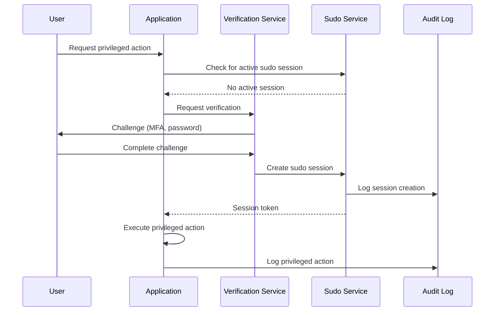
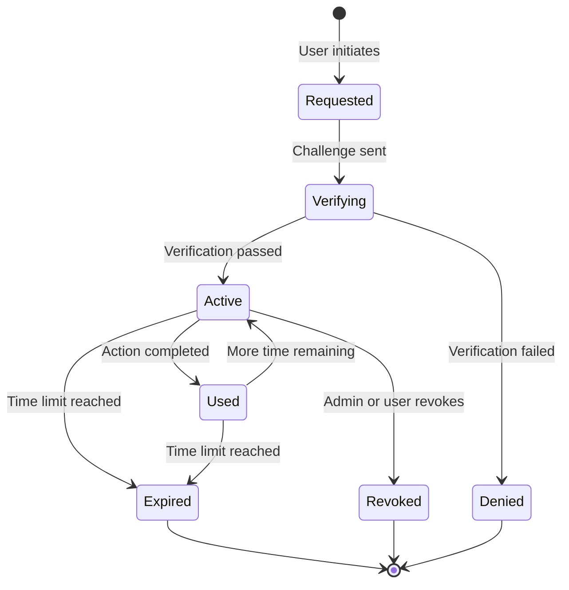
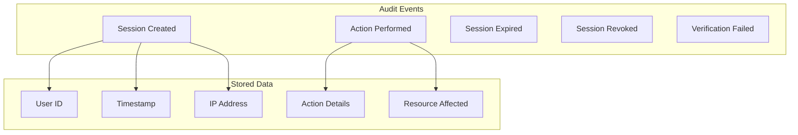

# How to Implement Sudo Patterns

Author: [nawazdhandala](https://github.com/nawazdhandala)

Tags: Security, Sudo, Privilege Escalation, Authorization

Description: Learn to implement sudo patterns for temporary privilege escalation with audit trails.

---

Applications often need to grant users temporary elevated privileges without permanently changing their access level. The sudo pattern, borrowed from Unix systems, provides a structured way to handle these situations. This post covers how to build sudo functionality into your application with proper audit trails and time-limited access.

## What is the Sudo Pattern?

The sudo pattern allows users to temporarily assume higher privileges after additional verification. Unlike permanent role elevation, sudo access is:

- Time-limited and automatically expires
- Requires explicit re-authentication or approval
- Creates detailed audit logs for compliance
- Can be revoked immediately without affecting base permissions

| Aspect | Regular Permissions | Sudo Permissions |
|--------|---------------------|------------------|
| Duration | Permanent | Time-limited (minutes to hours) |
| Verification | Login only | Additional challenge |
| Audit Trail | Standard logging | Enhanced logging |
| Scope | Broad access | Specific operations |

## Architecture Overview

A sudo system needs several components working together. The following diagram shows how a sudo request flows through the system.



## Data Model Design

Your sudo system needs to track sessions with their scope and expiration. Here is a TypeScript interface for the core data structures.

```typescript
// Represents a time-limited elevated permission session
interface SudoSession {
  id: string;
  userId: string;
  // What operations this session allows
  scope: SudoScope;
  // When the session was created
  createdAt: Date;
  // When it automatically expires
  expiresAt: Date;
  // How the user verified their identity
  verificationMethod: 'password' | 'mfa' | 'hardware_key';
  // IP address and user agent for security
  clientContext: {
    ipAddress: string;
    userAgent: string;
  };
}

// Defines what actions the sudo session permits
interface SudoScope {
  // Specific resource types this session can modify
  resourceTypes: string[];
  // Specific actions allowed (e.g., "delete", "modify_permissions")
  actions: string[];
  // Optional: limit to specific resource IDs
  resourceIds?: string[];
}
```

The database schema needs to support fast lookups and automatic cleanup of expired sessions.

```sql
-- Store active sudo sessions
CREATE TABLE sudo_sessions (
    id UUID PRIMARY KEY DEFAULT gen_random_uuid(),
    user_id UUID NOT NULL REFERENCES users(id),
    scope JSONB NOT NULL,
    verification_method VARCHAR(32) NOT NULL,
    ip_address INET NOT NULL,
    user_agent TEXT,
    created_at TIMESTAMP DEFAULT NOW(),
    expires_at TIMESTAMP NOT NULL,
    revoked_at TIMESTAMP,

    -- Index for checking active sessions
    CONSTRAINT valid_expiry CHECK (expires_at > created_at)
);

-- Fast lookup by user and expiration status
CREATE INDEX idx_sudo_sessions_active
ON sudo_sessions(user_id, expires_at)
WHERE revoked_at IS NULL;

-- Audit log for all sudo operations
CREATE TABLE sudo_audit_log (
    id UUID PRIMARY KEY DEFAULT gen_random_uuid(),
    session_id UUID REFERENCES sudo_sessions(id),
    user_id UUID NOT NULL,
    action VARCHAR(64) NOT NULL,
    resource_type VARCHAR(64),
    resource_id VARCHAR(256),
    details JSONB,
    created_at TIMESTAMP DEFAULT NOW()
);
```

## The Sudo Session Flow

The following diagram illustrates the state transitions of a sudo session.



## Implementation

Here is a complete implementation of the sudo service with session management and verification.

```typescript
// Configuration for sudo behavior
interface SudoConfig {
  // How long a sudo session lasts (in seconds)
  sessionDuration: number;
  // Maximum number of active sessions per user
  maxActiveSessions: number;
  // Required verification method for different scopes
  scopeVerificationRequirements: Map<string, VerificationLevel>;
}

type VerificationLevel = 'password' | 'mfa' | 'hardware_key';

class SudoService {
  private db: Database;
  private verifier: VerificationService;
  private auditLog: AuditService;
  private config: SudoConfig;

  constructor(
    db: Database,
    verifier: VerificationService,
    auditLog: AuditService,
    config: SudoConfig
  ) {
    this.db = db;
    this.verifier = verifier;
    this.auditLog = auditLog;
    this.config = config;
  }

  // Request a new sudo session
  async requestSession(
    userId: string,
    scope: SudoScope,
    clientContext: { ipAddress: string; userAgent: string }
  ): Promise<{ challengeId: string; method: VerificationLevel }> {
    // Determine required verification level based on scope
    const requiredLevel = this.getRequiredVerificationLevel(scope);

    // Create a pending verification challenge
    const challenge = await this.verifier.createChallenge(
      userId,
      requiredLevel
    );

    await this.auditLog.log({
      userId,
      action: 'sudo_requested',
      details: { scope, verificationMethod: requiredLevel }
    });

    return {
      challengeId: challenge.id,
      method: requiredLevel
    };
  }

  // Complete verification and create the session
  async createSession(
    userId: string,
    challengeId: string,
    verificationResponse: string,
    scope: SudoScope,
    clientContext: { ipAddress: string; userAgent: string }
  ): Promise<SudoSession> {
    // Verify the challenge response
    const verification = await this.verifier.verify(
      challengeId,
      verificationResponse
    );

    if (!verification.success) {
      await this.auditLog.log({
        userId,
        action: 'sudo_verification_failed',
        details: { reason: verification.reason }
      });
      throw new Error('Verification failed');
    }

    // Check active session limit
    const activeSessions = await this.getActiveSessions(userId);
    if (activeSessions.length >= this.config.maxActiveSessions) {
      throw new Error('Maximum active sudo sessions reached');
    }

    // Create the session
    const session: SudoSession = {
      id: generateUUID(),
      userId,
      scope,
      createdAt: new Date(),
      expiresAt: new Date(Date.now() + this.config.sessionDuration * 1000),
      verificationMethod: verification.method,
      clientContext
    };

    await this.db.insert('sudo_sessions', session);

    await this.auditLog.log({
      userId,
      action: 'sudo_session_created',
      details: {
        sessionId: session.id,
        scope,
        expiresAt: session.expiresAt
      }
    });

    return session;
  }

  // Check if a user has an active sudo session for a specific action
  async checkPermission(
    userId: string,
    action: string,
    resourceType: string,
    resourceId?: string,
    clientContext?: { ipAddress: string }
  ): Promise<{ allowed: boolean; session?: SudoSession }> {
    const sessions = await this.getActiveSessions(userId);

    for (const session of sessions) {
      // Verify client context matches if provided
      if (clientContext && session.clientContext.ipAddress !== clientContext.ipAddress) {
        continue;
      }

      // Check if scope covers this action
      if (this.scopeCoversAction(session.scope, action, resourceType, resourceId)) {
        return { allowed: true, session };
      }
    }

    return { allowed: false };
  }

  // Revoke a session immediately
  async revokeSession(sessionId: string, revokedBy: string): Promise<void> {
    await this.db.update('sudo_sessions', sessionId, {
      revoked_at: new Date()
    });

    await this.auditLog.log({
      userId: revokedBy,
      action: 'sudo_session_revoked',
      details: { sessionId }
    });
  }

  private getRequiredVerificationLevel(scope: SudoScope): VerificationLevel {
    // Higher risk actions require stronger verification
    for (const action of scope.actions) {
      const required = this.config.scopeVerificationRequirements.get(action);
      if (required === 'hardware_key') return 'hardware_key';
      if (required === 'mfa') return 'mfa';
    }
    return 'password';
  }

  private scopeCoversAction(
    scope: SudoScope,
    action: string,
    resourceType: string,
    resourceId?: string
  ): boolean {
    if (!scope.actions.includes(action)) return false;
    if (!scope.resourceTypes.includes(resourceType)) return false;
    if (scope.resourceIds && resourceId && !scope.resourceIds.includes(resourceId)) {
      return false;
    }
    return true;
  }

  private async getActiveSessions(userId: string): Promise<SudoSession[]> {
    return this.db.query(
      'SELECT * FROM sudo_sessions WHERE user_id = $1 AND expires_at > NOW() AND revoked_at IS NULL',
      [userId]
    );
  }
}
```

## Middleware Integration

Integrate sudo checks into your API middleware to protect sensitive endpoints.

```typescript
// Express middleware for sudo-protected routes
function requireSudo(requiredScope: Partial<SudoScope>) {
  return async (req: Request, res: Response, next: NextFunction) => {
    const userId = req.user.id;
    const clientContext = {
      ipAddress: req.ip
    };

    const { allowed, session } = await sudoService.checkPermission(
      userId,
      requiredScope.actions?.[0] || 'admin',
      requiredScope.resourceTypes?.[0] || 'system',
      req.params.resourceId,
      clientContext
    );

    if (!allowed) {
      return res.status(403).json({
        error: 'sudo_required',
        message: 'This action requires elevated privileges',
        challengeUrl: '/api/sudo/challenge'
      });
    }

    // Attach session to request for audit logging
    req.sudoSession = session;
    next();
  };
}

// Usage in routes
app.delete(
  '/api/users/:userId',
  requireSudo({ actions: ['delete_user'], resourceTypes: ['user'] }),
  deleteUserHandler
);
```

## Audit Trail Design

Every sudo operation should create detailed audit records. This supports compliance requirements and incident investigation.



## Best Practices

When implementing sudo patterns, keep these guidelines in mind:

| Practice | Rationale |
|----------|-----------|
| Short session duration | Limits exposure window if session is compromised |
| IP binding | Prevents session theft across networks |
| Scope limiting | Users only get access to what they need |
| Progressive verification | Higher risk actions need stronger auth |
| Immediate revocation | Admins can kill sessions without waiting for expiry |

## Conclusion

The sudo pattern provides a secure way to handle temporary privilege escalation in applications. By combining time-limited sessions, strong verification, and comprehensive audit logging, you create a system that balances usability with security. Start with simple password re-verification for low-risk actions and add MFA or hardware key requirements as your security needs grow.

The key is making privilege escalation explicit and traceable. Users understand when they are entering "sudo mode" and every action taken with elevated privileges leaves a clear audit trail for compliance and security review.
