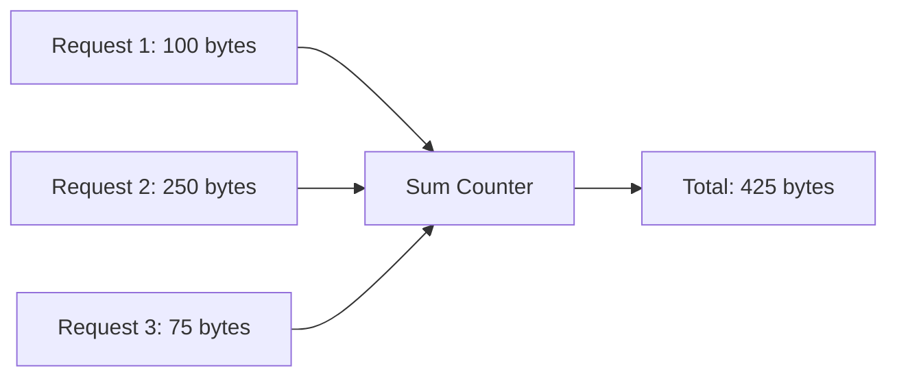
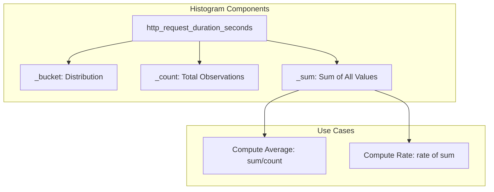
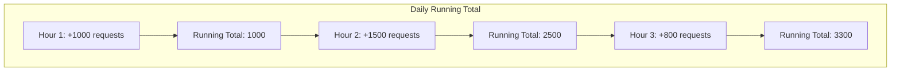
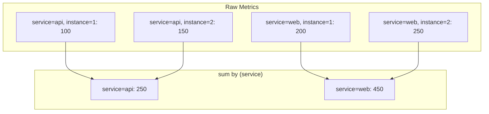
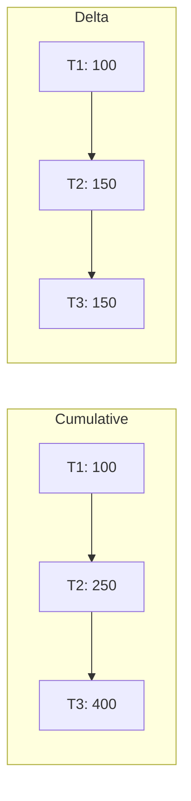

# How to Create Sum Metrics

Author: [nawazdhandala](https://github.com/nawazdhandala)

Tags: Observability, Metrics, Monitoring, SRE

Description: Learn how to implement sum aggregations for tracking total bytes transferred, cumulative latencies, and aggregated measurements.

---

Sum metrics are one of the most fundamental building blocks in observability. Whether you are tracking total bytes transferred across your network, cumulative request latencies, or aggregated error counts, understanding how to create and query sum metrics is essential for effective monitoring.

This guide walks you through sum aggregations, histogram sums, running totals, and practical PromQL examples with grouping.

---

## What Are Sum Metrics?

Sum metrics represent cumulative values that grow over time. Unlike gauges (which can go up and down) or histograms (which capture distributions), sums provide a monotonically increasing counter that tracks total accumulated values.

Common use cases include:

- Total bytes sent/received
- Cumulative request counts
- Aggregated latency totals (for computing averages)
- Total errors since startup
- Accumulated resource consumption



---

## Types of Sum Aggregations

### 1. Monotonic Counters

Monotonic counters only increase (or reset to zero on restart). They are ideal for tracking totals over time.

```python
# Python example using OpenTelemetry
from opentelemetry import metrics
from opentelemetry.sdk.metrics import MeterProvider

# Initialize the meter provider
metrics.set_meter_provider(MeterProvider())
meter = metrics.get_meter("example.service")

# Create a counter for tracking total bytes transferred
# Counters are monotonic by default - they only increase
bytes_counter = meter.create_counter(
    name="network.bytes.total",
    description="Total bytes transferred across the network",
    unit="By"  # 'By' is the standard unit for bytes
)

def handle_request(request_size_bytes: int, response_size_bytes: int):
    """
    Record bytes transferred for each request.
    Labels help segment the data by direction and endpoint.
    """
    # Record incoming bytes with direction label
    bytes_counter.add(
        request_size_bytes,
        attributes={
            "direction": "inbound",
            "endpoint": "/api/data"
        }
    )

    # Record outgoing bytes with direction label
    bytes_counter.add(
        response_size_bytes,
        attributes={
            "direction": "outbound",
            "endpoint": "/api/data"
        }
    )
```

### 2. Non-Monotonic Sums (UpDownCounters)

When your sum can both increase and decrease, use an UpDownCounter.

```python
# Track active connections - can go up or down
active_connections = meter.create_up_down_counter(
    name="connections.active",
    description="Number of currently active connections",
    unit="{connection}"  # Dimensionless unit with annotation
)

def on_connection_open():
    """Increment when a new connection is established."""
    active_connections.add(1, attributes={"pool": "primary"})

def on_connection_close():
    """Decrement when a connection is closed."""
    active_connections.add(-1, attributes={"pool": "primary"})
```

### 3. Observable (Async) Sums

For values that are expensive to compute or come from external sources, use observable sums that are collected on demand.

```python
import psutil

def get_disk_bytes_read():
    """
    Callback function that returns disk I/O statistics.
    This is called automatically during metric collection.
    """
    disk_io = psutil.disk_io_counters()
    # Yield observations with attributes for each disk
    yield metrics.Observation(
        disk_io.read_bytes,
        attributes={"operation": "read"}
    )
    yield metrics.Observation(
        disk_io.write_bytes,
        attributes={"operation": "write"}
    )

# Register the observable counter
# The callback is invoked during each scrape/collection
disk_io_counter = meter.create_observable_counter(
    name="disk.io.bytes.total",
    callbacks=[get_disk_bytes_read],
    description="Total disk I/O bytes",
    unit="By"
)
```

---

## Histogram Sums: Extracting Totals from Distributions

Histograms in Prometheus and OpenTelemetry automatically track a `_sum` component. This sum represents the total of all observed values.



### Creating Histograms with Sum Tracking

```python
# Create a histogram for request latencies
# Histograms automatically track count and sum
request_latency = meter.create_histogram(
    name="http.request.duration",
    description="HTTP request latency distribution",
    unit="s"  # Seconds
)

def process_request():
    """
    Record the duration of each request.
    The histogram will automatically:
    - Increment the count
    - Add the duration to the sum
    - Place the value in the appropriate bucket
    """
    start_time = time.time()

    # ... handle the request ...

    duration = time.time() - start_time
    request_latency.record(
        duration,
        attributes={
            "method": "GET",
            "endpoint": "/api/users",
            "status_code": "200"
        }
    )
```

### Using Histogram Sums in PromQL

The `_sum` suffix gives you access to the cumulative total of all recorded values:

```promql
# Total accumulated latency for all requests
http_request_duration_seconds_sum

# Average latency over the last 5 minutes
# rate() converts cumulative sum to per-second rate
rate(http_request_duration_seconds_sum[5m])
  /
rate(http_request_duration_seconds_count[5m])
```

---

## Running Totals: Tracking Cumulative Progress

Running totals are useful for tracking progress toward goals or budgets.



### Implementing Running Totals

```python
# Example: Track cumulative API quota usage
api_quota_used = meter.create_counter(
    name="api.quota.used.total",
    description="Cumulative API quota consumed",
    unit="{request}"
)

# Track quota by customer and endpoint
def record_api_call(customer_id: str, endpoint: str, cost: int = 1):
    """
    Record each API call against the customer's quota.
    Cost can vary based on endpoint complexity.
    """
    api_quota_used.add(
        cost,
        attributes={
            "customer_id": customer_id,
            "endpoint": endpoint,
            "tier": get_customer_tier(customer_id)
        }
    )
```

### Querying Running Totals with PromQL

```promql
# Current running total of API usage per customer
sum by (customer_id) (api_quota_used_total)

# Daily running total using increase()
# increase() extracts the total increase over the time window
sum by (customer_id) (
    increase(api_quota_used_total[24h])
)
```

---

## PromQL sum() Function: Aggregating Across Dimensions

The `sum()` aggregation function in PromQL combines values across multiple time series. This is different from the sum metric type.

### Basic sum() Syntax

```promql
# Sum all values across all series
sum(http_requests_total)

# Sum while preserving specific labels
sum by (label1, label2) (metric_name)

# Sum while removing specific labels
sum without (label_to_remove) (metric_name)
```

### Practical sum() Examples with Grouping



#### Example 1: Total Requests by Service

```promql
# Sum all requests, grouped by service
# This aggregates across all instances of each service
sum by (service) (
    rate(http_requests_total[5m])
)

# Result:
# {service="api"} 250
# {service="web"} 450
# {service="auth"} 120
```

#### Example 2: Total Bytes Transferred by Region and Direction

```promql
# Sum network bytes grouped by region and direction
# Useful for understanding traffic patterns
sum by (region, direction) (
    rate(network_bytes_total[5m])
)

# Result:
# {region="us-east", direction="inbound"} 1.5e9
# {region="us-east", direction="outbound"} 2.1e9
# {region="eu-west", direction="inbound"} 800e6
# {region="eu-west", direction="outbound"} 950e6
```

#### Example 3: Total Error Budget Consumption

```promql
# Calculate total errors as percentage of requests
# Group by service to identify problematic services
sum by (service) (rate(http_requests_total{status=~"5.."}[1h]))
/
sum by (service) (rate(http_requests_total[1h]))
* 100

# This gives error percentage per service
```

#### Example 4: Multi-Level Aggregation

```promql
# First sum by instance, then by service
# Useful for hierarchical rollups
sum by (service) (
    sum by (service, instance) (
        rate(cpu_usage_seconds_total[5m])
    )
)
```

---

## Best Practices for Sum Metrics

### 1. Choose the Right Aggregation Temporality

OpenTelemetry supports two temporalities for sums:



- **Cumulative**: Values always increase from process start. Better for Prometheus-style systems.
- **Delta**: Values represent the change since last report. Better for stateless collectors.

```python
from opentelemetry.sdk.metrics.export import (
    AggregationTemporality,
    PeriodicExportingMetricReader
)

# Configure cumulative temporality for Prometheus compatibility
reader = PeriodicExportingMetricReader(
    exporter,
    preferred_temporality={
        Counter: AggregationTemporality.CUMULATIVE,
        Histogram: AggregationTemporality.CUMULATIVE
    }
)
```

### 2. Handle Counter Resets Gracefully

Counters reset when processes restart. Use `rate()` or `increase()` to handle this automatically.

```promql
# WRONG: Raw counter values will show drops on restart
http_requests_total

# RIGHT: rate() handles resets automatically
rate(http_requests_total[5m])

# RIGHT: increase() also handles resets
increase(http_requests_total[1h])
```

### 3. Use Appropriate Label Cardinality

Avoid high-cardinality labels that can explode your metric count:

```python
# BAD: user_id creates millions of time series
bytes_counter.add(100, attributes={"user_id": user_id})  # Avoid this

# GOOD: Use bounded labels
bytes_counter.add(100, attributes={
    "user_tier": "premium",  # Limited set of values
    "region": "us-east",     # Limited set of values
    "endpoint": "/api/data"  # Limited set of values
})
```

### 4. Document Units Clearly

Always specify units to avoid confusion:

```python
# Use standard unit abbreviations
# By = bytes, s = seconds, 1 = dimensionless
meter.create_counter("network.bytes.total", unit="By")
meter.create_counter("requests.total", unit="{request}")
meter.create_histogram("latency", unit="ms")
```

---

## Complete Example: Network Traffic Monitoring

Here is a complete example that combines all concepts:

```python
"""
Network traffic monitoring with sum metrics.
Tracks bytes transferred with proper labeling and aggregation.
"""

from opentelemetry import metrics
from opentelemetry.sdk.metrics import MeterProvider
from opentelemetry.sdk.metrics.export import PeriodicExportingMetricReader
from opentelemetry.exporter.otlp.proto.grpc.metric_exporter import OTLPMetricExporter
import time
from dataclasses import dataclass
from typing import Optional

# Initialize OpenTelemetry metrics
exporter = OTLPMetricExporter(endpoint="http://localhost:4317")
reader = PeriodicExportingMetricReader(exporter, export_interval_millis=10000)
provider = MeterProvider(metric_readers=[reader])
metrics.set_meter_provider(provider)

# Create a meter for our service
meter = metrics.get_meter("network.monitor", version="1.0.0")

# Counter for total bytes transferred
# This is a monotonic sum that only increases
bytes_transferred = meter.create_counter(
    name="network.bytes.transferred.total",
    description="Total bytes transferred across the network",
    unit="By"
)

# Counter for total packets
packets_transferred = meter.create_counter(
    name="network.packets.transferred.total",
    description="Total packets transferred",
    unit="{packet}"
)

# Histogram for packet sizes (includes automatic sum)
packet_size_histogram = meter.create_histogram(
    name="network.packet.size",
    description="Distribution of packet sizes",
    unit="By"
)

# UpDownCounter for active transfers
active_transfers = meter.create_up_down_counter(
    name="network.transfers.active",
    description="Number of active file transfers",
    unit="{transfer}"
)


@dataclass
class TransferMetadata:
    """Metadata for a network transfer."""
    source_region: str
    dest_region: str
    protocol: str
    transfer_type: str


class NetworkMonitor:
    """
    Monitor network traffic and emit sum metrics.
    """

    def record_packet(
        self,
        size_bytes: int,
        direction: str,
        metadata: TransferMetadata
    ):
        """
        Record a single packet transfer.
        Updates both counter and histogram.
        """
        # Common attributes for all metrics
        attrs = {
            "direction": direction,
            "source_region": metadata.source_region,
            "dest_region": metadata.dest_region,
            "protocol": metadata.protocol
        }

        # Increment byte counter
        bytes_transferred.add(size_bytes, attributes=attrs)

        # Increment packet counter
        packets_transferred.add(1, attributes=attrs)

        # Record in histogram for distribution analysis
        # The histogram automatically maintains a sum
        packet_size_histogram.record(size_bytes, attributes=attrs)

    def start_transfer(self, metadata: TransferMetadata):
        """Mark the start of a file transfer."""
        active_transfers.add(1, attributes={
            "source_region": metadata.source_region,
            "dest_region": metadata.dest_region,
            "transfer_type": metadata.transfer_type
        })

    def end_transfer(self, metadata: TransferMetadata):
        """Mark the end of a file transfer."""
        active_transfers.add(-1, attributes={
            "source_region": metadata.source_region,
            "dest_region": metadata.dest_region,
            "transfer_type": metadata.transfer_type
        })


# Usage example
if __name__ == "__main__":
    monitor = NetworkMonitor()

    metadata = TransferMetadata(
        source_region="us-east",
        dest_region="eu-west",
        protocol="https",
        transfer_type="file_sync"
    )

    # Simulate a file transfer
    monitor.start_transfer(metadata)

    # Simulate packet transfers
    for packet_size in [1500, 1200, 800, 1500, 1000]:
        monitor.record_packet(packet_size, "outbound", metadata)
        time.sleep(0.1)

    monitor.end_transfer(metadata)
```

### Querying the Metrics

```promql
# Total bytes transferred per region pair in the last hour
sum by (source_region, dest_region) (
    increase(network_bytes_transferred_total[1h])
)

# Current transfer rate in bytes per second
sum by (direction) (
    rate(network_bytes_transferred_total[5m])
)

# Average packet size using histogram sum and count
rate(network_packet_size_sum[5m])
/
rate(network_packet_size_count[5m])

# Bytes transferred as percentage of total, by region
sum by (source_region) (increase(network_bytes_transferred_total[1h]))
/
sum(increase(network_bytes_transferred_total[1h]))
* 100

# Active transfers by region
sum by (source_region, dest_region) (network_transfers_active)
```

---

## Summary

Sum metrics are foundational to effective monitoring:

| Metric Type | Use Case | PromQL Function |
|-------------|----------|-----------------|
| Counter | Monotonically increasing totals | `rate()`, `increase()` |
| UpDownCounter | Values that can decrease | Direct query, `sum()` |
| Histogram Sum | Total of observed values | `rate(metric_sum[5m])` |
| sum() aggregation | Combine multiple series | `sum by (label) (metric)` |

Key takeaways:

1. Use counters for monotonic sums (requests, bytes, errors)
2. Use UpDownCounters for bidirectional values (connections, queue depth)
3. Histogram sums give you the total of all observations for free
4. The `sum()` function aggregates across dimensions with flexible grouping
5. Always use `rate()` or `increase()` on counters to handle resets
6. Keep label cardinality bounded to control storage costs

With these patterns, you can build comprehensive monitoring for any system that requires tracking totals, rates, and cumulative measurements.

---

**Related Reading:**

- [Three Pillars of Observability: Logs, Metrics, Traces](https://oneuptime.com/blog/post/2025-08-20-three-pillars-of-observability-logs-metrics-traces/view)
- [18 SRE Metrics Worth Tracking](https://oneuptime.com/blog/post/2025-11-28-sre-metrics-to-track/view)
- [What is OpenTelemetry Collector and Why Use One](https://oneuptime.com/blog/post/2025-09-18-what-is-opentelemetry-collector-and-why-use-one/view)
