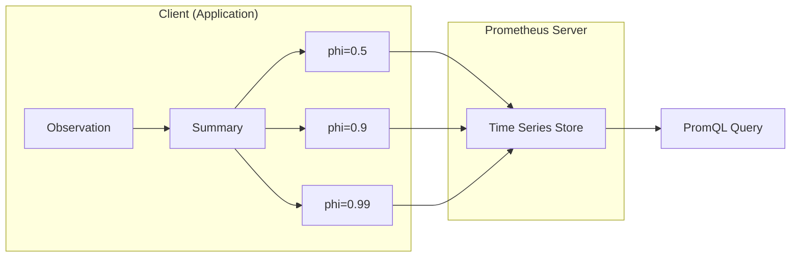
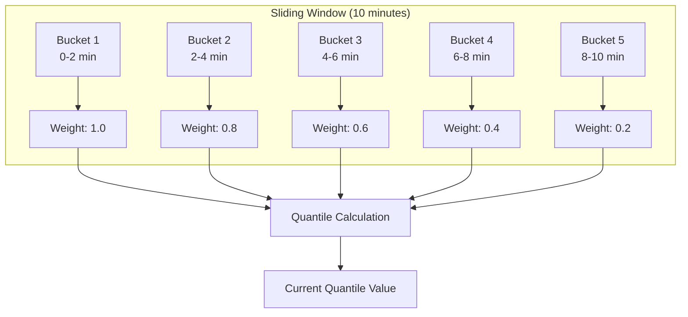
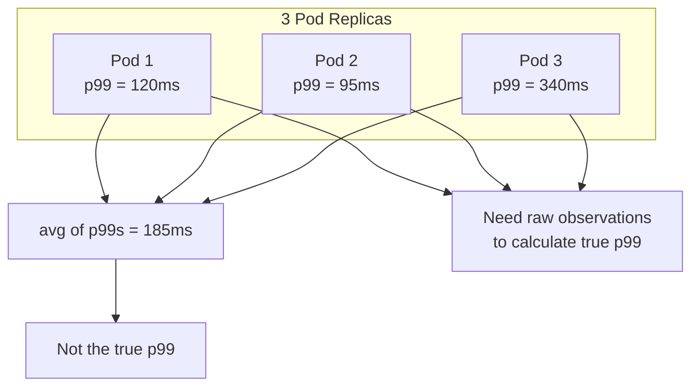

# How to Build Summary Metrics Design

Author: [nawazdhandala](https://github.com/nawazdhandala)

Tags: Metrics, Summaries, Prometheus, Quantiles

Description: Learn to build summary metrics design for tracking client-side calculated quantiles.

---

Histograms and summaries are the two primary metric types for measuring distributions. Most teams default to histograms because they work well with Prometheus aggregation. But summaries have a specific use case that histograms cannot match: accurate quantile calculation at the source.

This guide explains when to use summaries, how to design them properly, and the tradeoffs you need to understand before committing to either approach.

## What Makes Summaries Different

Summaries compute quantiles on the client side before exposing them to your metrics system. Histograms, by contrast, bucket observations and let the server compute approximate quantiles at query time.



With histograms, the server receives raw bucket counts and computes quantiles using interpolation. This works well for aggregating across instances but introduces approximation error. Summaries avoid this error by calculating exact quantiles at the source.

## When to Choose Summaries

Summaries work best when you need accurate quantiles for a single instance and do not need to aggregate across multiple targets.

**Use summaries when:**

- You need precise percentiles (p50, p95, p99) for SLO tracking
- Your service runs as a single instance or you query instances individually
- Quantile accuracy matters more than cross-instance aggregation
- You want to avoid the bucket configuration complexity of histograms

**Avoid summaries when:**

- You need to aggregate quantiles across multiple pods or services
- Your quantile requirements change frequently
- You need flexible percentile queries without redeploying

The core limitation is that you cannot aggregate summary quantiles mathematically. The p99 of multiple p99 values is not the true p99 of the combined distribution.

## Summary Metric Structure

A summary metric in Prometheus exposes multiple time series for each quantile you configure, plus a count and sum.

```yaml
# HELP http_request_duration_seconds Request latency distribution
# TYPE http_request_duration_seconds summary
http_request_duration_seconds{quantile="0.5"} 0.042
http_request_duration_seconds{quantile="0.9"} 0.087
http_request_duration_seconds{quantile="0.99"} 0.284
http_request_duration_seconds_sum 1024.53
http_request_duration_seconds_count 18429
```

The quantile labels contain pre-calculated values. The sum and count let you compute the average (`sum / count`) without the quantile overhead.

## Implementing Summaries in Code

Here is a Python implementation using the Prometheus client library. The key configuration is the quantile list and the time window for calculation.

```python
# metrics.py
from prometheus_client import Summary, start_http_server
import time
import random

# Define quantiles with acceptable error margins
# Format: (quantile, allowed_error)
# Lower error = more memory usage
REQUEST_LATENCY = Summary(
    'http_request_duration_seconds',
    'Request latency in seconds',
    ['endpoint', 'method'],
    # Calculate these specific quantiles
    # Each tuple: (quantile_value, acceptable_error)
    quantiles=[
        (0.5, 0.05),   # Median with 5% error tolerance
        (0.9, 0.01),   # p90 with 1% error tolerance
        (0.95, 0.005), # p95 with 0.5% error tolerance
        (0.99, 0.001), # p99 with 0.1% error tolerance
    ]
)

def handle_request(endpoint: str, method: str):
    """Simulate request handling with latency tracking."""
    start_time = time.time()

    # Simulate variable latency
    base_latency = 0.02  # 20ms base
    jitter = random.expovariate(10)  # Exponential jitter
    time.sleep(base_latency + jitter)

    # Record the observation
    duration = time.time() - start_time
    REQUEST_LATENCY.labels(
        endpoint=endpoint,
        method=method
    ).observe(duration)

    return duration
```

The error tolerance parameter controls memory usage. Tighter tolerances require more samples to be stored in the sliding window.

## Sliding Window Configuration

Summaries use a time-decaying algorithm to compute quantiles over recent observations. The window configuration determines how much history affects current quantile values.



Configure the window based on your alerting requirements. A 10-minute window smooths short spikes but delays detection of gradual degradation. A 1-minute window responds faster but produces noisier data.

```python
# Go implementation with explicit window configuration
from prometheus_client import Summary

# 5-minute window with 10 age buckets
LATENCY_SUMMARY = Summary(
    'request_latency_seconds',
    'Request latency with 5-minute window',
    ['service'],
    # max_age: how long observations stay in the window
    # age_buckets: number of sub-windows for decay calculation
    max_age_seconds=300,  # 5 minutes
    age_buckets=5         # 5 sub-buckets of 1 minute each
)
```

## Designing Your Quantile Set

Choosing which quantiles to track requires balancing observability needs against cardinality cost. Each quantile adds a separate time series.

A practical starting set for latency tracking:

| Quantile | Purpose |
|----------|---------|
| 0.5 (p50) | Typical user experience |
| 0.9 (p90) | Most users' worst case |
| 0.95 (p95) | Common SLO target |
| 0.99 (p99) | Tail latency, often SLO target |
| 0.999 (p999) | Extreme outliers, capacity planning |

Avoid tracking too many quantiles. Five is usually sufficient. If you need ad-hoc percentile queries, use histograms instead.

## Combining Summaries with Count and Sum

The count and sum values enable useful calculations without the quantile overhead. Use them for average latency and request rate metrics.

```yaml
# PromQL queries using summary count and sum

# Average latency over last 5 minutes
rate(http_request_duration_seconds_sum[5m])
  / rate(http_request_duration_seconds_count[5m])

# Request rate per second
rate(http_request_duration_seconds_count[5m])

# Total request duration in last hour (useful for billing)
increase(http_request_duration_seconds_sum[1h])
```

These queries aggregate correctly across instances, unlike the quantile values.

## The Aggregation Problem

The biggest limitation of summaries is that quantile values cannot be aggregated. This matters when you run multiple replicas.



The average of p99 values is not the true p99 of the combined traffic. If Pod 3 handles 80% of traffic, the real combined p99 is closer to 340ms, not 185ms.

For multi-instance services, use histograms instead. The bucket-based approach allows proper aggregation with `histogram_quantile()`.

## Hybrid Approach: Summaries Plus Histograms

Some teams use both metric types. Summaries provide accurate single-instance quantiles for debugging. Histograms enable aggregated views for dashboards and alerts.

```python
# Track the same measurement with both metric types
from prometheus_client import Summary, Histogram

# Summary for accurate per-instance quantiles
LATENCY_SUMMARY = Summary(
    'request_latency_summary_seconds',
    'Request latency (summary)',
    ['endpoint']
)

# Histogram for aggregation across instances
LATENCY_HISTOGRAM = Histogram(
    'request_latency_histogram_seconds',
    'Request latency (histogram)',
    ['endpoint'],
    buckets=[0.005, 0.01, 0.025, 0.05, 0.1, 0.25, 0.5, 1.0, 2.5]
)

def observe_latency(endpoint: str, duration: float):
    """Record latency to both metric types."""
    LATENCY_SUMMARY.labels(endpoint=endpoint).observe(duration)
    LATENCY_HISTOGRAM.labels(endpoint=endpoint).observe(duration)
```

This doubles storage cost but gives you the benefits of both approaches. Use this pattern when you need both precise instance-level debugging and cluster-wide SLO tracking.

## Memory and CPU Considerations

Summaries consume more client-side resources than histograms. The quantile calculation algorithm maintains a sorted sample stream that grows with the error tolerance settings.

Rough memory usage per summary metric:

| Error Tolerance | Memory per Quantile |
|----------------|---------------------|
| 0.05 (5%) | ~1 KB |
| 0.01 (1%) | ~5 KB |
| 0.001 (0.1%) | ~50 KB |

Multiply by the number of quantiles and label combinations. A summary with 5 quantiles, 10 endpoints, and 0.01 error tolerance uses approximately 250 KB.

For high-cardinality scenarios, histograms are more memory-efficient because bucket counts are simple counters.

## Alerting on Summary Metrics

Summary quantiles work directly in alerting rules without needing `histogram_quantile()` calculations.

```yaml
# alerting-rules.yaml
groups:
  - name: latency-alerts
    rules:
      # Alert when p99 latency exceeds threshold
      - alert: HighP99Latency
        expr: http_request_duration_seconds{quantile="0.99"} > 0.5
        for: 5m
        labels:
          severity: warning
        annotations:
          summary: "High p99 latency on {{ $labels.instance }}"
          description: "p99 latency is {{ $value }}s"

      # Alert on sustained p50 degradation (affects most users)
      - alert: MedianLatencyDegraded
        expr: http_request_duration_seconds{quantile="0.5"} > 0.1
        for: 10m
        labels:
          severity: critical
        annotations:
          summary: "Median latency degraded on {{ $labels.instance }}"
```

The query syntax is simpler than histogram-based alerts. No bucket interpolation means the value you see is the value you get.

## Making the Decision

Choose summaries when accuracy matters more than aggregation. Single-instance services, batch jobs, and per-node monitoring are good candidates. The pre-calculated quantiles simplify queries and alerting.

Choose histograms when you need to aggregate across replicas or want flexible percentile queries. Most distributed services fall into this category.

The hybrid approach works when you need both but can afford the overhead. Start with one metric type and add the other only when you hit its limitations.

Summary metrics are a specialized tool. Used correctly, they provide precise quantile tracking with minimal query complexity. Used incorrectly, they create confusing dashboards with mathematically invalid aggregations. Understanding when each metric type applies is the key to effective observability design.
