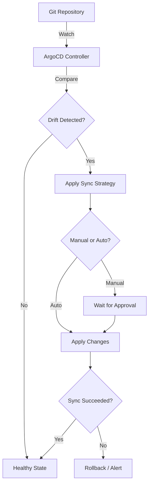
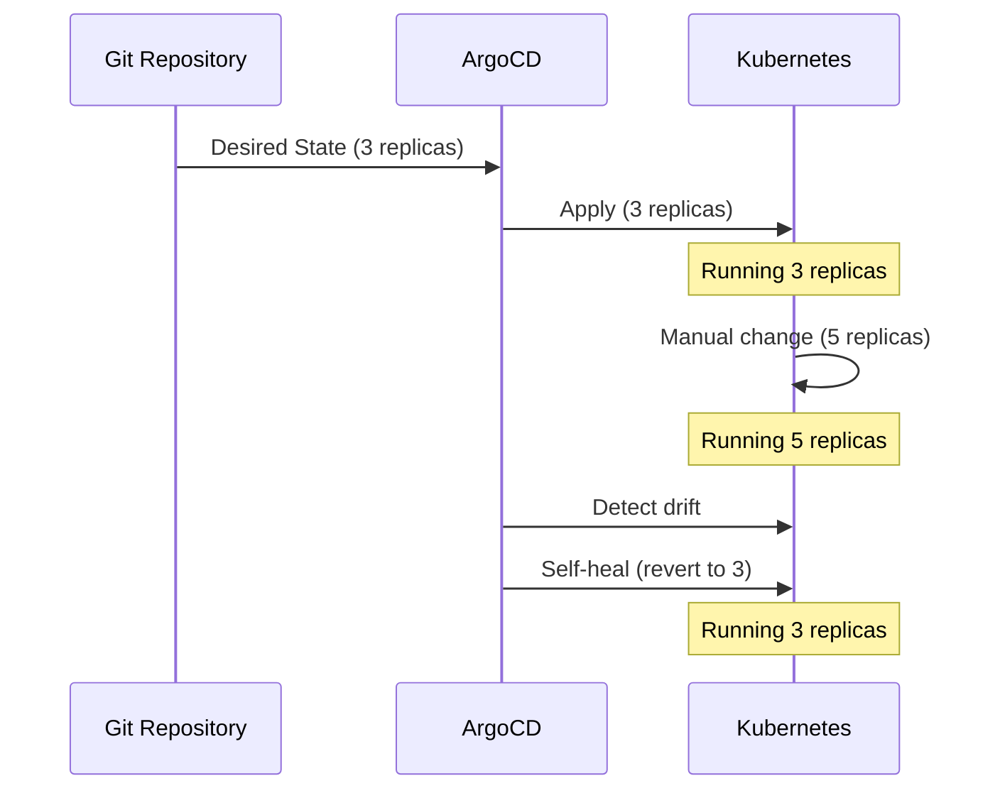
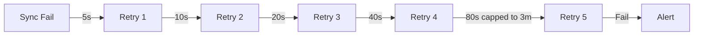
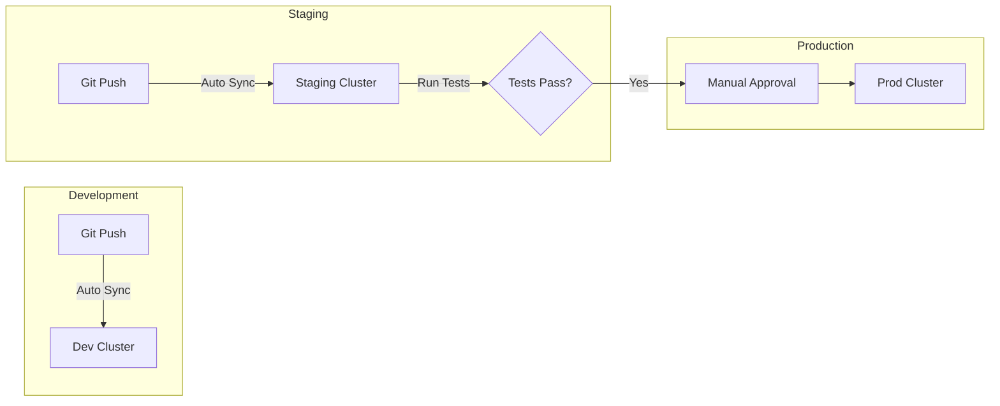

# How to Create Sync Strategies

Author: [nawazdhandala](https://github.com/nawazdhandala)

Tags: GitOps, ArgoCD, Sync, Kubernetes

Description: Learn to create sync strategies for GitOps reconciliation and drift correction.

---

Sync strategies determine how your GitOps tool reconciles the desired state in Git with the actual state in your Kubernetes cluster. Getting this right prevents deployment failures, minimizes downtime, and keeps your clusters healthy.

## What Is a Sync Strategy?

A sync strategy defines when and how ArgoCD applies changes from Git to your cluster. It answers three questions:

1. When should sync happen?
2. What happens when live state drifts from Git?
3. How should resources be applied?

Here is how the sync process works at a high level.



## Manual vs Automated Sync

The first decision is whether syncs happen automatically or require human approval.

### Manual Sync

Manual sync gives you full control. Changes in Git do not apply until someone clicks "Sync" or runs `argocd app sync`. This works well for production environments where you want a human in the loop.

```yaml
# Manual sync - no automated policy
apiVersion: argoproj.io/v1alpha1
kind: Application
metadata:
  name: payments-service
  namespace: argocd
spec:
  project: default
  source:
    repoURL: https://github.com/myorg/payments.git
    targetRevision: HEAD
    path: k8s/production
  destination:
    server: https://kubernetes.default.svc
    namespace: production
  # No syncPolicy.automated means manual sync only
```

### Automated Sync

Automated sync applies changes as soon as ArgoCD detects drift. This is useful for development and staging environments where you want fast feedback loops.

```yaml
apiVersion: argoproj.io/v1alpha1
kind: Application
metadata:
  name: api-gateway
  namespace: argocd
spec:
  project: default
  source:
    repoURL: https://github.com/myorg/gateway.git
    targetRevision: HEAD
    path: k8s/staging
  destination:
    server: https://kubernetes.default.svc
    namespace: staging
  syncPolicy:
    automated:
      # Prune removes resources deleted from Git
      prune: true
      # SelfHeal reverts manual kubectl changes
      selfHeal: true
```

## Understanding Drift Correction

Drift happens when someone changes a resource directly in the cluster, bypassing Git. Self-healing detects and reverts these changes automatically.



Here is an application configured with aggressive drift correction.

```yaml
apiVersion: argoproj.io/v1alpha1
kind: Application
metadata:
  name: core-service
  namespace: argocd
spec:
  project: default
  source:
    repoURL: https://github.com/myorg/core.git
    path: deploy
  destination:
    server: https://kubernetes.default.svc
    namespace: core
  syncPolicy:
    automated:
      prune: true
      selfHeal: true
      # Allow empty means sync even if no resources exist yet
      allowEmpty: false
    syncOptions:
      # Validate manifests before applying
      - Validate=true
      # Create namespace if it does not exist
      - CreateNamespace=true
      # Use server-side apply for better conflict handling
      - ServerSideApply=true
```

## Sync Options Deep Dive

Sync options fine-tune how resources get applied. Here are the most useful ones.

### PruneLast

Prune resources after all other sync operations complete. This prevents issues where a new resource depends on something that would be deleted.

```yaml
syncPolicy:
  automated:
    prune: true
  syncOptions:
    - PruneLast=true
```

### ApplyOutOfSyncOnly

Only apply resources that are actually out of sync. This reduces API server load and speeds up large deployments.

```yaml
syncPolicy:
  syncOptions:
    - ApplyOutOfSyncOnly=true
```

### Replace vs Apply

Force replace deletes and recreates resources instead of patching. Use this when patch operations fail due to immutable fields.

```yaml
syncPolicy:
  syncOptions:
    - Replace=true
```

### Selective Sync

You can exclude specific resources from automated sync while keeping automation for everything else.

```yaml
# This ConfigMap will not be auto-synced
apiVersion: v1
kind: ConfigMap
metadata:
  name: feature-flags
  annotations:
    # Requires manual sync
    argocd.argoproj.io/sync-options: Prune=false
```

## Retry Strategies

Network issues and transient errors can cause sync failures. Configure retries to handle these gracefully.

```yaml
apiVersion: argoproj.io/v1alpha1
kind: Application
metadata:
  name: resilient-app
  namespace: argocd
spec:
  project: default
  source:
    repoURL: https://github.com/myorg/app.git
    path: k8s
  destination:
    server: https://kubernetes.default.svc
    namespace: default
  syncPolicy:
    automated:
      prune: true
      selfHeal: true
    retry:
      # Maximum number of sync attempts
      limit: 5
      backoff:
        # Initial delay between retries
        duration: 5s
        # Multiply delay by this factor each retry
        factor: 2
        # Maximum delay cap
        maxDuration: 3m
```

The retry backoff follows this pattern.



## Ignoring Differences

Some fields change at runtime and should not trigger a sync. Ignore them to prevent sync loops.

```yaml
apiVersion: argoproj.io/v1alpha1
kind: Application
metadata:
  name: hpa-managed-app
  namespace: argocd
spec:
  project: default
  source:
    repoURL: https://github.com/myorg/app.git
    path: k8s
  destination:
    server: https://kubernetes.default.svc
    namespace: default
  ignoreDifferences:
    # HPA manages replica count
    - group: apps
      kind: Deployment
      jsonPointers:
        - /spec/replicas
    # Mutating webhooks add annotations
    - group: ""
      kind: Service
      jsonPointers:
        - /metadata/annotations
    # Ignore all status fields
    - group: "*"
      kind: "*"
      managedFieldsManagers:
        - kube-controller-manager
```

## Environment-Specific Strategies

Different environments need different sync strategies. Here is a pattern that works well.

The strategy flow across environments looks like this.



Development uses aggressive automation.

```yaml
# development.yaml
apiVersion: argoproj.io/v1alpha1
kind: Application
metadata:
  name: myapp-dev
spec:
  source:
    targetRevision: develop
    path: k8s/overlays/dev
  syncPolicy:
    automated:
      prune: true
      selfHeal: true
    syncOptions:
      - CreateNamespace=true
```

Production uses manual sync with strict validation.

```yaml
# production.yaml
apiVersion: argoproj.io/v1alpha1
kind: Application
metadata:
  name: myapp-prod
spec:
  source:
    targetRevision: main
    path: k8s/overlays/prod
  # No automated sync for production
  syncPolicy:
    syncOptions:
      - Validate=true
      - PruneLast=true
      - ServerSideApply=true
```

## Handling Sync Failures

When syncs fail, you need visibility and control. Configure these annotations to get better debugging information.

```yaml
apiVersion: argoproj.io/v1alpha1
kind: Application
metadata:
  name: critical-app
  annotations:
    # Get notifications on sync status changes
    notifications.argoproj.io/subscribe.on-sync-failed.slack: alerts
    notifications.argoproj.io/subscribe.on-health-degraded.slack: alerts
spec:
  project: default
  source:
    repoURL: https://github.com/myorg/critical.git
    path: k8s
  destination:
    server: https://kubernetes.default.svc
    namespace: critical
  syncPolicy:
    automated:
      prune: true
      selfHeal: true
    retry:
      limit: 3
      backoff:
        duration: 10s
        factor: 2
        maxDuration: 1m
```

## Testing Your Sync Strategy

Before deploying to production, verify your sync strategy works as expected.

```bash
# Dry run to see what would change
argocd app sync myapp --dry-run

# Preview the diff without applying
argocd app diff myapp

# Sync with explicit revision
argocd app sync myapp --revision v1.2.3

# Force sync even if already synced
argocd app sync myapp --force

# Sync specific resources only
argocd app sync myapp --resource apps:Deployment:myapp
```

---

Sync strategies are the foundation of reliable GitOps. Start with manual sync for production and automated sync for lower environments. Add self-healing and pruning as you build confidence. Monitor sync failures and tune retry policies based on real failure patterns. The goal is a deployment pipeline that recovers from transient issues automatically while giving humans control over critical changes.
