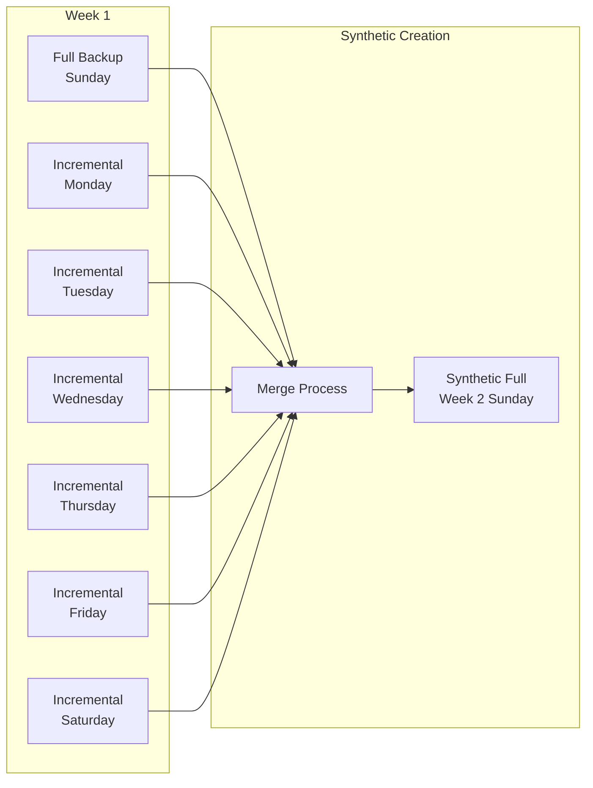
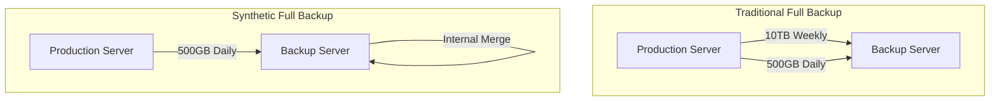
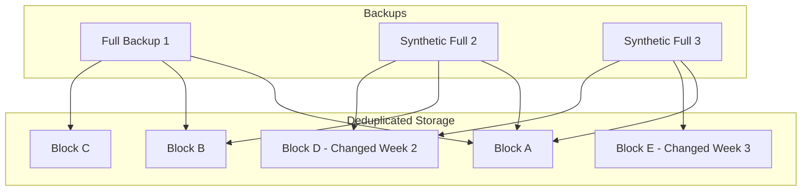
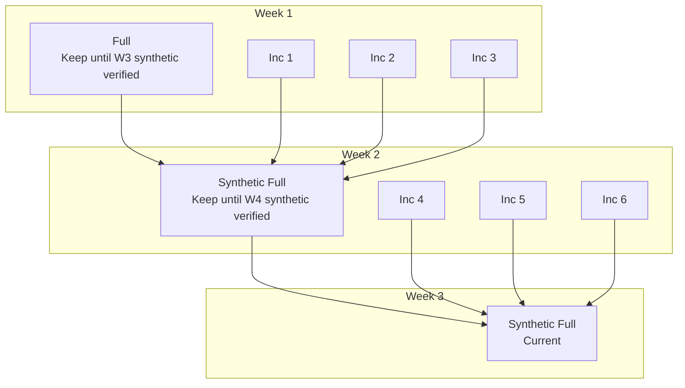

# How to Implement Synthetic Full Backups

Author: [nawazdhandala](https://github.com/nawazdhandala)

Tags: Backup, Recovery, Data Protection, Storage

Description: Learn how to implement synthetic full backups to reduce backup windows, save storage, and speed up restores without running full backups every time.

---

Traditional backup strategies force you to choose between slow full backups or complex incremental chains. Synthetic full backups eliminate this tradeoff by combining existing incremental backups into a new full backup without touching the source system. Here is how to implement them.

## What Is a Synthetic Full Backup?

A synthetic full backup creates a complete backup image by merging a previous full backup with subsequent incremental backups. The backup server does all the work, leaving production systems untouched.



The production server only handles the initial full backup and daily incrementals. The synthetic full is built entirely on the backup infrastructure.

## Traditional vs Synthetic Full Backups

| Aspect | Traditional Full | Synthetic Full |
| --- | --- | --- |
| Source system load | High (reads all data) | None (built from existing backups) |
| Backup window | Long (hours to days) | Short (incremental only) |
| Network bandwidth | Full dataset transfer | Incremental changes only |
| Storage efficiency | Low (duplicate data) | High (deduplication friendly) |
| Restore speed | Fast (single backup) | Fast (consolidated backup) |
| Implementation complexity | Simple | Moderate |

## Why Synthetic Fulls Win

### Reduced Backup Windows

Running a full backup on a 10TB database takes hours. With synthetic fulls, your nightly backup only captures changes, which might take minutes.

```
Traditional Weekly Schedule:
Sunday:    Full backup (10 hours) - Production impact
Monday:    Incremental (30 minutes)
Tuesday:   Incremental (30 minutes)
...
Saturday:  Incremental (30 minutes)

Synthetic Weekly Schedule:
Sunday:    Synthetic full creation (2 hours) - No production impact
Monday:    Incremental (30 minutes)
Tuesday:   Incremental (30 minutes)
...
Saturday:  Incremental (30 minutes)
```

### Lower Network Load

Traditional full backups push the entire dataset across your network weekly. Synthetic fulls only transfer changed blocks daily.



### Better Storage Efficiency

When combined with deduplication, synthetic fulls store data once and reference it across multiple backup generations. Traditional full backups duplicate data every cycle.

## Implementation Approaches

### Approach 1: Block-Level Synthetic Fulls

Block-level synthetic fulls merge changed blocks from incrementals into a baseline full backup. This works well for disk images and databases.

**How It Works:**

1. Store full backup as indexed block map
2. Track changed blocks in each incremental
3. Build synthetic full by applying changes to the block map
4. Verify integrity through checksums

```python
import hashlib
from pathlib import Path

class BlockStore:
    """Manages block-level backup storage."""

    def __init__(self, block_size=4096):
        self.block_size = block_size
        self.blocks = {}  # hash -> block data
        self.backups = {}  # backup_id -> block map

    def create_full_backup(self, source_path, backup_id):
        """Create initial full backup with block deduplication."""
        block_map = []

        with open(source_path, 'rb') as f:
            while True:
                block = f.read(self.block_size)
                if not block:
                    break

                block_hash = hashlib.sha256(block).hexdigest()

                # Store block only if not already present
                if block_hash not in self.blocks:
                    self.blocks[block_hash] = block

                block_map.append(block_hash)

        self.backups[backup_id] = block_map
        return len(block_map)

    def create_incremental(self, source_path, backup_id, parent_id):
        """Create incremental backup storing only changed blocks."""
        parent_map = self.backups[parent_id]
        block_map = []
        changed_blocks = 0

        with open(source_path, 'rb') as f:
            for i, parent_hash in enumerate(parent_map):
                block = f.read(self.block_size)
                if not block:
                    break

                block_hash = hashlib.sha256(block).hexdigest()

                if block_hash != parent_hash:
                    # Block changed, store new version
                    if block_hash not in self.blocks:
                        self.blocks[block_hash] = block
                    changed_blocks += 1

                block_map.append(block_hash)

            # Handle new blocks beyond parent size
            while True:
                block = f.read(self.block_size)
                if not block:
                    break
                block_hash = hashlib.sha256(block).hexdigest()
                if block_hash not in self.blocks:
                    self.blocks[block_hash] = block
                block_map.append(block_hash)
                changed_blocks += 1

        self.backups[backup_id] = block_map
        return changed_blocks

    def create_synthetic_full(self, new_backup_id, base_id, incremental_ids):
        """
        Create synthetic full by merging base with incrementals.
        No source system access required.
        """
        # Start with base backup block map
        synthetic_map = self.backups[base_id].copy()

        # Apply each incremental in order
        for inc_id in incremental_ids:
            inc_map = self.backups[inc_id]

            # Update blocks that changed
            for i, block_hash in enumerate(inc_map):
                if i < len(synthetic_map):
                    synthetic_map[i] = block_hash
                else:
                    synthetic_map.append(block_hash)

        self.backups[new_backup_id] = synthetic_map
        return len(synthetic_map)

    def restore(self, backup_id, dest_path):
        """Restore backup to destination path."""
        block_map = self.backups[backup_id]

        with open(dest_path, 'wb') as f:
            for block_hash in block_map:
                f.write(self.blocks[block_hash])

        return len(block_map) * self.block_size
```

### Approach 2: File-Level Synthetic Fulls

File-level synthetic fulls track changes at the file granularity. This approach works well for file servers and unstructured data.

```python
import os
import shutil
from datetime import datetime
from pathlib import Path

class FileBackupSystem:
    """File-level synthetic full backup implementation."""

    def __init__(self, backup_root):
        self.backup_root = Path(backup_root)
        self.catalog = {}  # Tracks file versions

    def create_full_backup(self, source_dir, backup_id):
        """Create full file backup with metadata catalog."""
        backup_path = self.backup_root / backup_id
        backup_path.mkdir(parents=True, exist_ok=True)

        catalog_entry = {
            'type': 'full',
            'timestamp': datetime.now().isoformat(),
            'files': {}
        }

        source = Path(source_dir)
        for file_path in source.rglob('*'):
            if file_path.is_file():
                rel_path = file_path.relative_to(source)
                dest_path = backup_path / rel_path
                dest_path.parent.mkdir(parents=True, exist_ok=True)

                # Copy file and record metadata
                shutil.copy2(file_path, dest_path)
                stat = file_path.stat()

                catalog_entry['files'][str(rel_path)] = {
                    'size': stat.st_size,
                    'mtime': stat.st_mtime,
                    'checksum': self._file_checksum(file_path)
                }

        self.catalog[backup_id] = catalog_entry
        return len(catalog_entry['files'])

    def create_incremental(self, source_dir, backup_id, parent_id):
        """Create incremental backup with only changed files."""
        backup_path = self.backup_root / backup_id
        backup_path.mkdir(parents=True, exist_ok=True)

        parent_catalog = self.catalog[parent_id]

        catalog_entry = {
            'type': 'incremental',
            'parent': parent_id,
            'timestamp': datetime.now().isoformat(),
            'files': {},
            'deleted': []
        }

        source = Path(source_dir)
        current_files = set()

        for file_path in source.rglob('*'):
            if file_path.is_file():
                rel_path = str(file_path.relative_to(source))
                current_files.add(rel_path)

                stat = file_path.stat()
                parent_file = parent_catalog['files'].get(rel_path)

                # Check if file is new or modified
                if not parent_file or parent_file['mtime'] != stat.st_mtime:
                    dest_path = backup_path / rel_path
                    dest_path.parent.mkdir(parents=True, exist_ok=True)
                    shutil.copy2(file_path, dest_path)

                    catalog_entry['files'][rel_path] = {
                        'size': stat.st_size,
                        'mtime': stat.st_mtime,
                        'checksum': self._file_checksum(file_path)
                    }

        # Track deleted files
        for rel_path in parent_catalog['files']:
            if rel_path not in current_files:
                catalog_entry['deleted'].append(rel_path)

        self.catalog[backup_id] = catalog_entry
        return len(catalog_entry['files'])

    def create_synthetic_full(self, new_backup_id, base_id, incremental_ids):
        """
        Build synthetic full from base and incrementals.
        All operations happen on backup storage.
        """
        synthetic_path = self.backup_root / new_backup_id
        synthetic_path.mkdir(parents=True, exist_ok=True)

        # Build file state by applying changes in order
        file_locations = {}  # rel_path -> backup_id containing latest version

        # Start with base backup
        base_catalog = self.catalog[base_id]
        for rel_path in base_catalog['files']:
            file_locations[rel_path] = base_id

        # Apply incrementals
        for inc_id in incremental_ids:
            inc_catalog = self.catalog[inc_id]

            # Update changed files
            for rel_path in inc_catalog['files']:
                file_locations[rel_path] = inc_id

            # Remove deleted files
            for rel_path in inc_catalog.get('deleted', []):
                file_locations.pop(rel_path, None)

        # Copy files to synthetic full
        synthetic_catalog = {
            'type': 'synthetic_full',
            'timestamp': datetime.now().isoformat(),
            'source_base': base_id,
            'source_incrementals': incremental_ids,
            'files': {}
        }

        for rel_path, source_backup in file_locations.items():
            source_file = self.backup_root / source_backup / rel_path
            dest_file = synthetic_path / rel_path
            dest_file.parent.mkdir(parents=True, exist_ok=True)

            shutil.copy2(source_file, dest_file)
            synthetic_catalog['files'][rel_path] = self.catalog[source_backup]['files'][rel_path]

        self.catalog[new_backup_id] = synthetic_catalog
        return len(file_locations)

    def _file_checksum(self, file_path):
        """Calculate SHA256 checksum for file."""
        import hashlib
        sha256 = hashlib.sha256()
        with open(file_path, 'rb') as f:
            for chunk in iter(lambda: f.read(8192), b''):
                sha256.update(chunk)
        return sha256.hexdigest()
```

### Approach 3: Database Synthetic Fulls

For databases, synthetic fulls combine a base backup with transaction logs or incremental dumps.

```bash
#!/bin/bash
# PostgreSQL synthetic full backup implementation

BACKUP_DIR="/var/backups/postgres"
DB_NAME="production"

create_base_backup() {
    local backup_id="base_$(date +%Y%m%d)"
    local backup_path="$BACKUP_DIR/$backup_id"

    mkdir -p "$backup_path"

    # Create base backup using pg_basebackup
    pg_basebackup -D "$backup_path/data" \
        -Ft -z \
        -P \
        --checkpoint=fast \
        --wal-method=stream

    echo "$backup_id"
}

create_wal_archive() {
    local backup_id="wal_$(date +%Y%m%d_%H%M%S)"
    local backup_path="$BACKUP_DIR/$backup_id"

    mkdir -p "$backup_path"

    # Archive current WAL files
    pg_archivecleanup "$BACKUP_DIR/wal_archive" "$(pg_controldata | grep 'Latest checkpoint' | awk '{print $NF}')"

    # Copy new WAL files
    cp -r /var/lib/postgresql/data/pg_wal/* "$backup_path/"

    echo "$backup_id"
}

create_synthetic_full() {
    local base_id=$1
    shift
    local wal_ids=("$@")

    local synthetic_id="synthetic_$(date +%Y%m%d)"
    local synthetic_path="$BACKUP_DIR/$synthetic_id"
    local temp_path="/tmp/pg_restore_$$"

    mkdir -p "$synthetic_path" "$temp_path"

    echo "Creating synthetic full from $base_id and ${#wal_ids[@]} WAL archives"

    # Extract base backup
    tar -xzf "$BACKUP_DIR/$base_id/data/base.tar.gz" -C "$temp_path"

    # Apply WAL files for point-in-time recovery
    for wal_id in "${wal_ids[@]}"; do
        cp "$BACKUP_DIR/$wal_id"/* "$temp_path/pg_wal/"
    done

    # Start temporary PostgreSQL instance to apply WAL
    cat > "$temp_path/recovery.signal" << EOF
# Recovery configuration
EOF

    cat >> "$temp_path/postgresql.conf" << EOF
restore_command = 'cp $temp_path/pg_wal/%f %p'
recovery_target = 'immediate'
recovery_target_action = 'promote'
EOF

    # Start recovery
    pg_ctl -D "$temp_path" start -w

    # Wait for recovery to complete
    until pg_isready -h localhost -p 5433; do
        sleep 1
    done

    # Create new base backup from recovered state
    pg_basebackup -D "$synthetic_path/data" \
        -h localhost -p 5433 \
        -Ft -z \
        -P

    # Cleanup
    pg_ctl -D "$temp_path" stop
    rm -rf "$temp_path"

    echo "Synthetic full backup created: $synthetic_id"
    echo "$synthetic_id"
}

# Usage example
# base=$(create_base_backup)
# wal1=$(create_wal_archive)
# wal2=$(create_wal_archive)
# synthetic=$(create_synthetic_full "$base" "$wal1" "$wal2")
```

## Storage Efficiency with Deduplication

Synthetic fulls shine when combined with deduplication. Each backup generation references the same underlying blocks.



Without deduplication, three full backups store 3x the data. With deduplication, you store unique blocks once and reference them multiple times.

## Restore Performance

Synthetic fulls restore as fast as traditional full backups because they are complete, consolidated backups.

```
Restore Scenarios:

Traditional Incremental Chain (7 days):
1. Restore full backup (2 hours)
2. Apply Monday incremental (15 min)
3. Apply Tuesday incremental (15 min)
4. Apply Wednesday incremental (15 min)
5. Apply Thursday incremental (15 min)
6. Apply Friday incremental (15 min)
7. Apply Saturday incremental (15 min)
Total: ~3.5 hours

Synthetic Full:
1. Restore synthetic full (2 hours)
Total: 2 hours
```

The longer the incremental chain, the bigger the restore time difference.

## Implementation Checklist

Before implementing synthetic fulls, verify your backup infrastructure supports these requirements:

**Storage Requirements:**
- [ ] Sufficient space for merge operations (temporary 2x space during creation)
- [ ] Fast random I/O for block merging
- [ ] Deduplication support (optional but recommended)

**Catalog Management:**
- [ ] Track relationships between full, incremental, and synthetic backups
- [ ] Maintain checksums for integrity verification
- [ ] Support dependency tracking for retention policies

**Scheduling:**
- [ ] Schedule synthetic creation during low-activity periods
- [ ] Allow sufficient time for merge and verification
- [ ] Plan incremental chain length (typically 6-13 incrementals per synthetic)

**Verification:**
- [ ] Verify synthetic full integrity after creation
- [ ] Test restores from synthetic fulls regularly
- [ ] Compare restored data against source checksums

## Common Pitfalls

### 1. Incremental Chain Too Long

Long incremental chains increase synthetic full creation time and risk.

```
Bad: 30 incrementals between synthetic fulls
- Creation takes hours
- Single corrupt incremental breaks the chain
- Verification becomes complex

Good: 6-7 incrementals between synthetic fulls
- Creation completes in reasonable time
- Limited blast radius from corruption
- Manageable verification
```

### 2. Insufficient Temporary Storage

Creating a synthetic full requires space to build the merged result before verification.

```
10TB dataset requirements:
- Minimum: 10TB free for new synthetic full
- Recommended: 20TB for merge workspace + new backup
- Ideal: 30TB for merge workspace + new backup + rollback
```

### 3. Missing Dependency Tracking

Without proper catalog management, you cannot safely delete old backups.

```python
def can_delete_backup(catalog, backup_id):
    """Check if backup can be safely deleted."""

    # Check if any synthetic depends on this backup
    for bid, entry in catalog.items():
        if entry.get('type') == 'synthetic_full':
            if entry.get('source_base') == backup_id:
                return False
            if backup_id in entry.get('source_incrementals', []):
                return False

        if entry.get('type') == 'incremental':
            if entry.get('parent') == backup_id:
                return False

    return True
```

### 4. Skipping Verification

A synthetic full built from corrupted incrementals is useless. Always verify.

```python
def verify_synthetic_full(backup_system, synthetic_id, source_checksums):
    """Verify synthetic full matches expected state."""

    catalog = backup_system.catalog[synthetic_id]
    errors = []

    for rel_path, file_info in catalog['files'].items():
        expected_checksum = source_checksums.get(rel_path)
        actual_checksum = file_info['checksum']

        if expected_checksum and expected_checksum != actual_checksum:
            errors.append(f"Checksum mismatch: {rel_path}")

    return len(errors) == 0, errors
```

## Monitoring Synthetic Full Creation

Track key metrics to ensure synthetic full operations succeed:

```yaml
# Prometheus metrics for synthetic full monitoring
- job_name: synthetic_backup
  metrics:
    # Duration metrics
    - synthetic_full_duration_seconds
    - incremental_merge_duration_seconds
    - verification_duration_seconds

    # Size metrics
    - synthetic_full_size_bytes
    - deduplicated_size_bytes
    - temporary_space_used_bytes

    # Status metrics
    - synthetic_full_success_total
    - synthetic_full_failure_total
    - verification_failure_total

    # Chain metrics
    - incremental_chain_length
    - oldest_incremental_age_hours
```

Set alerts for:
- Synthetic full creation taking longer than expected
- Verification failures
- Incremental chain exceeding maximum length
- Temporary storage running low during creation

## Retention with Synthetic Fulls

Design retention policies that account for synthetic full dependencies.



Safe deletion order:
1. Verify new synthetic full
2. Delete incrementals consumed by new synthetic
3. Delete previous synthetic full
4. Repeat

## When Not to Use Synthetic Fulls

Synthetic fulls are not always the right choice:

**Small Datasets:** If full backups complete in minutes, the complexity of synthetic fulls is not worth it.

**High Change Rates:** If 80% of data changes daily, incrementals approach full backup size anyway.

**Simple Recovery Requirements:** If you always restore to the latest state and never need point-in-time recovery, traditional fulls may be simpler.

**Limited Backup Storage Performance:** Synthetic full creation is I/O intensive on the backup server. Slow storage extends creation time significantly.

---

Synthetic full backups solve the fundamental tension between backup windows and restore speed. By shifting the computational work from production systems to backup infrastructure, you get the restore performance of full backups with the efficiency of incrementals. Start with a solid implementation, verify relentlessly, and your backup strategy will scale with your data growth.
