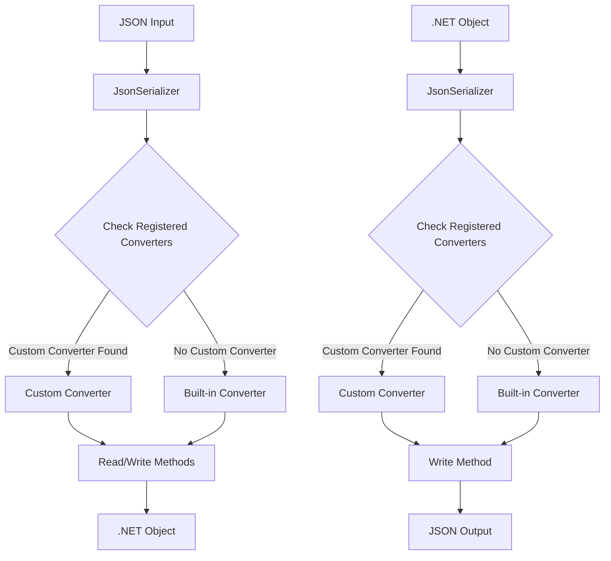
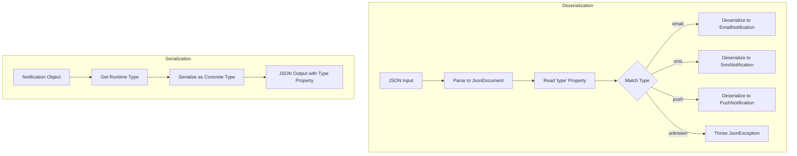

# How to Build Custom Serializers with System.Text.Json

Author: [nawazdhandala](https://github.com/nawazdhandala)

Tags: CSharp, .NET, JSON, Serialization, System.Text.Json

Description: Learn to build production-ready custom JSON converters with System.Text.Json for handling complex types, polymorphism, and specialized data formats in .NET applications.

---

System.Text.Json is the default JSON serializer in modern .NET applications. While it handles most types automatically, you will encounter scenarios where custom serialization logic is necessary. This guide walks through building custom converters from basic implementations to advanced patterns used in production systems.

## When to Use Custom Converters

Custom converters solve specific serialization challenges:

| Scenario | Example | Solution |
|----------|---------|----------|
| Non-standard formats | Unix timestamps, custom date strings | Custom converter with format handling |
| Polymorphic types | Base class with multiple derived types | Type discriminator converter |
| External DTOs | Third-party APIs with unusual JSON structure | Mapping converter |
| Performance optimization | High-throughput scenarios | Low-allocation converter |
| Validation during parsing | Ensure data integrity on deserialization | Validating converter |

## The JsonConverter Architecture

Before writing converters, understand how System.Text.Json processes JSON data.



The serializer checks registered converters in order. Your custom converter intercepts serialization for specific types.

## Understanding JsonConverter<T>

The `JsonConverter<T>` abstract class defines two key methods you must implement.

```csharp
public abstract class JsonConverter<T>
{
    // Called when deserializing JSON to an object
    public abstract T? Read(
        ref Utf8JsonReader reader,
        Type typeToConvert,
        JsonSerializerOptions options);

    // Called when serializing an object to JSON
    public abstract void Write(
        Utf8JsonWriter writer,
        T value,
        JsonSerializerOptions options);
}
```

The `Utf8JsonReader` is a forward-only reader that processes UTF-8 encoded JSON. The `Utf8JsonWriter` writes UTF-8 encoded JSON. Both are designed for high performance with minimal allocations.

## Building Your First Converter: Unix Timestamps

Many APIs use Unix timestamps instead of ISO 8601 dates. Here is a converter that handles this format.

```csharp
using System.Text.Json;
using System.Text.Json.Serialization;

public class UnixTimestampConverter : JsonConverter<DateTime>
{
    // Unix epoch: January 1, 1970 at midnight UTC
    private static readonly DateTime UnixEpoch =
        new DateTime(1970, 1, 1, 0, 0, 0, DateTimeKind.Utc);

    public override DateTime Read(
        ref Utf8JsonReader reader,
        Type typeToConvert,
        JsonSerializerOptions options)
    {
        // Handle both number and string representations
        if (reader.TokenType == JsonTokenType.Number)
        {
            // Read the Unix timestamp as a long
            var timestamp = reader.GetInt64();
            return UnixEpoch.AddSeconds(timestamp);
        }

        if (reader.TokenType == JsonTokenType.String)
        {
            // Some APIs send timestamps as strings
            var stringValue = reader.GetString();
            if (long.TryParse(stringValue, out var timestamp))
            {
                return UnixEpoch.AddSeconds(timestamp);
            }

            throw new JsonException($"Cannot parse '{stringValue}' as Unix timestamp");
        }

        throw new JsonException($"Unexpected token type: {reader.TokenType}");
    }

    public override void Write(
        Utf8JsonWriter writer,
        DateTime value,
        JsonSerializerOptions options)
    {
        // Convert DateTime to Unix timestamp
        var utcValue = value.Kind == DateTimeKind.Utc
            ? value
            : value.ToUniversalTime();

        var timestamp = (long)(utcValue - UnixEpoch).TotalSeconds;
        writer.WriteNumberValue(timestamp);
    }
}
```

Apply the converter to a property using the `[JsonConverter]` attribute:

```csharp
public class Event
{
    public string Name { get; set; } = string.Empty;

    [JsonConverter(typeof(UnixTimestampConverter))]
    public DateTime CreatedAt { get; set; }

    [JsonConverter(typeof(UnixTimestampConverter))]
    public DateTime? ModifiedAt { get; set; }
}
```

## Registering Converters Globally

For application-wide usage, register converters in `JsonSerializerOptions`:

```csharp
var options = new JsonSerializerOptions
{
    PropertyNamingPolicy = JsonNamingPolicy.CamelCase,
    WriteIndented = true,
    Converters =
    {
        new UnixTimestampConverter()
    }
};

// Now all DateTime properties use Unix timestamps
var json = JsonSerializer.Serialize(myEvent, options);
var deserialized = JsonSerializer.Deserialize<Event>(json, options);
```

In ASP.NET Core, configure options in `Program.cs`:

```csharp
builder.Services.AddControllers()
    .AddJsonOptions(options =>
    {
        options.JsonSerializerOptions.Converters.Add(new UnixTimestampConverter());
        options.JsonSerializerOptions.PropertyNamingPolicy = JsonNamingPolicy.CamelCase;
    });
```

## Handling Nullable Types

When your converter handles a value type, you need a separate converter for nullable versions or use a factory pattern.

Create a nullable-aware converter:

```csharp
public class NullableUnixTimestampConverter : JsonConverter<DateTime?>
{
    private readonly UnixTimestampConverter _innerConverter = new();

    public override DateTime? Read(
        ref Utf8JsonReader reader,
        Type typeToConvert,
        JsonSerializerOptions options)
    {
        // Handle null JSON values
        if (reader.TokenType == JsonTokenType.Null)
        {
            return null;
        }

        // Delegate to the non-nullable converter
        return _innerConverter.Read(ref reader, typeof(DateTime), options);
    }

    public override void Write(
        Utf8JsonWriter writer,
        DateTime? value,
        JsonSerializerOptions options)
    {
        if (value.HasValue)
        {
            _innerConverter.Write(writer, value.Value, options);
        }
        else
        {
            writer.WriteNullValue();
        }
    }
}
```

## Creating a Converter Factory

For handling multiple related types with a single registration, use `JsonConverterFactory`:

```csharp
public class UnixTimestampConverterFactory : JsonConverterFactory
{
    // Determine which types this factory handles
    public override bool CanConvert(Type typeToConvert)
    {
        return typeToConvert == typeof(DateTime) ||
               typeToConvert == typeof(DateTime?) ||
               typeToConvert == typeof(DateTimeOffset) ||
               typeToConvert == typeof(DateTimeOffset?);
    }

    // Create the appropriate converter for the type
    public override JsonConverter? CreateConverter(
        Type typeToConvert,
        JsonSerializerOptions options)
    {
        if (typeToConvert == typeof(DateTime))
        {
            return new UnixTimestampConverter();
        }

        if (typeToConvert == typeof(DateTime?))
        {
            return new NullableUnixTimestampConverter();
        }

        if (typeToConvert == typeof(DateTimeOffset))
        {
            return new UnixTimestampDateTimeOffsetConverter();
        }

        if (typeToConvert == typeof(DateTimeOffset?))
        {
            return new NullableUnixTimestampDateTimeOffsetConverter();
        }

        throw new NotSupportedException($"Type {typeToConvert} is not supported");
    }
}

// DateTimeOffset version of the converter
public class UnixTimestampDateTimeOffsetConverter : JsonConverter<DateTimeOffset>
{
    private static readonly DateTimeOffset UnixEpoch =
        new DateTimeOffset(1970, 1, 1, 0, 0, 0, TimeSpan.Zero);

    public override DateTimeOffset Read(
        ref Utf8JsonReader reader,
        Type typeToConvert,
        JsonSerializerOptions options)
    {
        if (reader.TokenType == JsonTokenType.Number)
        {
            var timestamp = reader.GetInt64();
            return UnixEpoch.AddSeconds(timestamp);
        }

        if (reader.TokenType == JsonTokenType.String)
        {
            var stringValue = reader.GetString();
            if (long.TryParse(stringValue, out var timestamp))
            {
                return UnixEpoch.AddSeconds(timestamp);
            }
        }

        throw new JsonException($"Cannot parse as Unix timestamp");
    }

    public override void Write(
        Utf8JsonWriter writer,
        DateTimeOffset value,
        JsonSerializerOptions options)
    {
        var timestamp = value.ToUnixTimeSeconds();
        writer.WriteNumberValue(timestamp);
    }
}
```

Register the factory instead of individual converters:

```csharp
var options = new JsonSerializerOptions
{
    Converters = { new UnixTimestampConverterFactory() }
};
```

## Polymorphic Serialization

Handling inheritance hierarchies requires type discriminators. Here is a complete implementation for a notification system.

Define the type hierarchy:

```csharp
public abstract class Notification
{
    public string Id { get; set; } = Guid.NewGuid().ToString();
    public DateTime CreatedAt { get; set; } = DateTime.UtcNow;
    public abstract string Type { get; }
}

public class EmailNotification : Notification
{
    public override string Type => "email";
    public string To { get; set; } = string.Empty;
    public string Subject { get; set; } = string.Empty;
    public string Body { get; set; } = string.Empty;
}

public class SmsNotification : Notification
{
    public override string Type => "sms";
    public string PhoneNumber { get; set; } = string.Empty;
    public string Message { get; set; } = string.Empty;
}

public class PushNotification : Notification
{
    public override string Type => "push";
    public string DeviceToken { get; set; } = string.Empty;
    public string Title { get; set; } = string.Empty;
    public string Body { get; set; } = string.Empty;
    public Dictionary<string, string> Data { get; set; } = new();
}
```

Create a polymorphic converter:

```csharp
public class NotificationConverter : JsonConverter<Notification>
{
    // Map type discriminators to concrete types
    private readonly Dictionary<string, Type> _typeMap = new()
    {
        ["email"] = typeof(EmailNotification),
        ["sms"] = typeof(SmsNotification),
        ["push"] = typeof(PushNotification)
    };

    public override Notification? Read(
        ref Utf8JsonReader reader,
        Type typeToConvert,
        JsonSerializerOptions options)
    {
        // We need to read the JSON twice: once to get the type, once to deserialize
        // Use JsonDocument to parse without consuming the reader state
        using var doc = JsonDocument.ParseValue(ref reader);
        var root = doc.RootElement;

        // Extract the type discriminator
        if (!root.TryGetProperty("type", out var typeProperty))
        {
            throw new JsonException("Missing 'type' property for polymorphic deserialization");
        }

        var typeName = typeProperty.GetString();
        if (string.IsNullOrEmpty(typeName) || !_typeMap.TryGetValue(typeName, out var concreteType))
        {
            throw new JsonException($"Unknown notification type: {typeName}");
        }

        // Deserialize to the concrete type
        var json = root.GetRawText();
        return (Notification?)JsonSerializer.Deserialize(json, concreteType, options);
    }

    public override void Write(
        Utf8JsonWriter writer,
        Notification value,
        JsonSerializerOptions options)
    {
        // Get the actual runtime type
        var concreteType = value.GetType();

        // Serialize as the concrete type to include all properties
        JsonSerializer.Serialize(writer, value, concreteType, options);
    }
}
```

The polymorphic converter flow:



Usage example:

```csharp
var options = new JsonSerializerOptions
{
    PropertyNamingPolicy = JsonNamingPolicy.CamelCase,
    Converters = { new NotificationConverter() }
};

// Serialize different notification types
var notifications = new List<Notification>
{
    new EmailNotification
    {
        To = "user@example.com",
        Subject = "Welcome",
        Body = "Thanks for signing up!"
    },
    new SmsNotification
    {
        PhoneNumber = "+1234567890",
        Message = "Your code is 123456"
    }
};

var json = JsonSerializer.Serialize(notifications, options);
// Output includes type discriminator for each notification

// Deserialize back to the correct types
var deserialized = JsonSerializer.Deserialize<List<Notification>>(json, options);
// Each item is the correct derived type
```

## Enum Converters with Custom Mappings

APIs often use different string values than your enum names. Create a flexible enum converter:

```csharp
public class FlexibleEnumConverter<TEnum> : JsonConverter<TEnum> where TEnum : struct, Enum
{
    private readonly Dictionary<string, TEnum> _stringToEnum;
    private readonly Dictionary<TEnum, string> _enumToString;

    public FlexibleEnumConverter(Dictionary<string, TEnum> mappings)
    {
        _stringToEnum = new Dictionary<string, TEnum>(StringComparer.OrdinalIgnoreCase);
        _enumToString = new Dictionary<TEnum, string>();

        foreach (var (key, value) in mappings)
        {
            _stringToEnum[key] = value;
            _enumToString[value] = key;
        }
    }

    public override TEnum Read(
        ref Utf8JsonReader reader,
        Type typeToConvert,
        JsonSerializerOptions options)
    {
        switch (reader.TokenType)
        {
            case JsonTokenType.String:
                var stringValue = reader.GetString();
                if (stringValue != null && _stringToEnum.TryGetValue(stringValue, out var enumValue))
                {
                    return enumValue;
                }
                // Fall back to standard parsing
                if (Enum.TryParse<TEnum>(stringValue, ignoreCase: true, out var parsed))
                {
                    return parsed;
                }
                throw new JsonException($"Unknown enum value: {stringValue}");

            case JsonTokenType.Number:
                var intValue = reader.GetInt32();
                return (TEnum)Enum.ToObject(typeof(TEnum), intValue);

            default:
                throw new JsonException($"Unexpected token type: {reader.TokenType}");
        }
    }

    public override void Write(
        Utf8JsonWriter writer,
        TEnum value,
        JsonSerializerOptions options)
    {
        if (_enumToString.TryGetValue(value, out var stringValue))
        {
            writer.WriteStringValue(stringValue);
        }
        else
        {
            writer.WriteStringValue(value.ToString());
        }
    }
}

// Define your enum
public enum OrderStatus
{
    Pending,
    Processing,
    Shipped,
    Delivered,
    Cancelled
}

// Create a converter with custom mappings
public class OrderStatusConverter : FlexibleEnumConverter<OrderStatus>
{
    public OrderStatusConverter() : base(new Dictionary<string, OrderStatus>
    {
        ["pending"] = OrderStatus.Pending,
        ["in_progress"] = OrderStatus.Processing,
        ["shipped"] = OrderStatus.Shipped,
        ["completed"] = OrderStatus.Delivered,
        ["canceled"] = OrderStatus.Cancelled  // Note: API uses "canceled" not "cancelled"
    })
    {
    }
}
```

## Dictionary with Custom Key Converters

Dictionaries with non-string keys need custom handling:

```csharp
public class GuidDictionaryConverter<TValue> : JsonConverter<Dictionary<Guid, TValue>>
{
    public override Dictionary<Guid, TValue>? Read(
        ref Utf8JsonReader reader,
        Type typeToConvert,
        JsonSerializerOptions options)
    {
        if (reader.TokenType != JsonTokenType.StartObject)
        {
            throw new JsonException("Expected start of object");
        }

        var dictionary = new Dictionary<Guid, TValue>();

        while (reader.Read())
        {
            if (reader.TokenType == JsonTokenType.EndObject)
            {
                return dictionary;
            }

            if (reader.TokenType != JsonTokenType.PropertyName)
            {
                throw new JsonException("Expected property name");
            }

            // Parse the property name as a GUID
            var propertyName = reader.GetString();
            if (!Guid.TryParse(propertyName, out var key))
            {
                throw new JsonException($"Cannot parse '{propertyName}' as GUID");
            }

            // Read the value
            reader.Read();
            var value = JsonSerializer.Deserialize<TValue>(ref reader, options);

            if (value != null)
            {
                dictionary[key] = value;
            }
        }

        throw new JsonException("Unexpected end of JSON");
    }

    public override void Write(
        Utf8JsonWriter writer,
        Dictionary<Guid, TValue> value,
        JsonSerializerOptions options)
    {
        writer.WriteStartObject();

        foreach (var kvp in value)
        {
            // Write GUID as property name without braces
            writer.WritePropertyName(kvp.Key.ToString("D"));
            JsonSerializer.Serialize(writer, kvp.Value, options);
        }

        writer.WriteEndObject();
    }
}
```

## Low-Allocation Converters for High Throughput

For performance-critical applications, minimize allocations using `Utf8JsonReader` directly:

```csharp
public readonly struct UserId
{
    public long Value { get; }

    public UserId(long value) => Value = value;

    public override string ToString() => Value.ToString();
}

public class UserIdConverter : JsonConverter<UserId>
{
    public override UserId Read(
        ref Utf8JsonReader reader,
        Type typeToConvert,
        JsonSerializerOptions options)
    {
        // Handle both number and string representations without allocation
        if (reader.TokenType == JsonTokenType.Number)
        {
            return new UserId(reader.GetInt64());
        }

        if (reader.TokenType == JsonTokenType.String)
        {
            // Use span-based parsing to avoid string allocation
            if (reader.HasValueSequence)
            {
                // Fallback for segmented data
                var str = reader.GetString();
                return new UserId(long.Parse(str!));
            }

            var span = reader.ValueSpan;
            if (long.TryParse(span, out var value))
            {
                return new UserId(value);
            }

            throw new JsonException("Invalid user ID format");
        }

        throw new JsonException($"Unexpected token: {reader.TokenType}");
    }

    public override void Write(
        Utf8JsonWriter writer,
        UserId value,
        JsonSerializerOptions options)
    {
        writer.WriteNumberValue(value.Value);
    }
}
```

For complex objects, use `Utf8JsonWriter` methods directly:

```csharp
public class Point3D
{
    public double X { get; set; }
    public double Y { get; set; }
    public double Z { get; set; }
}

public class Point3DConverter : JsonConverter<Point3D>
{
    // Cached UTF-8 encoded property names avoid allocation on every write
    private static readonly byte[] XPropertyName = "x"u8.ToArray();
    private static readonly byte[] YPropertyName = "y"u8.ToArray();
    private static readonly byte[] ZPropertyName = "z"u8.ToArray();

    public override Point3D? Read(
        ref Utf8JsonReader reader,
        Type typeToConvert,
        JsonSerializerOptions options)
    {
        if (reader.TokenType != JsonTokenType.StartObject)
        {
            throw new JsonException("Expected start of object");
        }

        var point = new Point3D();

        while (reader.Read())
        {
            if (reader.TokenType == JsonTokenType.EndObject)
            {
                return point;
            }

            if (reader.TokenType != JsonTokenType.PropertyName)
            {
                throw new JsonException("Expected property name");
            }

            // Use ValueTextEquals for allocation-free comparison
            if (reader.ValueTextEquals(XPropertyName))
            {
                reader.Read();
                point.X = reader.GetDouble();
            }
            else if (reader.ValueTextEquals(YPropertyName))
            {
                reader.Read();
                point.Y = reader.GetDouble();
            }
            else if (reader.ValueTextEquals(ZPropertyName))
            {
                reader.Read();
                point.Z = reader.GetDouble();
            }
            else
            {
                // Skip unknown properties
                reader.Read();
                reader.Skip();
            }
        }

        throw new JsonException("Unexpected end of JSON");
    }

    public override void Write(
        Utf8JsonWriter writer,
        Point3D value,
        JsonSerializerOptions options)
    {
        writer.WriteStartObject();

        // Use pre-encoded property names for better performance
        writer.WriteNumber(XPropertyName, value.X);
        writer.WriteNumber(YPropertyName, value.Y);
        writer.WriteNumber(ZPropertyName, value.Z);

        writer.WriteEndObject();
    }
}
```

## Validating Converter

Add validation during deserialization to catch invalid data early:

```csharp
public class Email
{
    public string Value { get; }

    private Email(string value) => Value = value;

    public static Email Create(string value)
    {
        if (string.IsNullOrWhiteSpace(value))
        {
            throw new ArgumentException("Email cannot be empty");
        }

        if (!value.Contains('@') || !value.Contains('.'))
        {
            throw new ArgumentException($"Invalid email format: {value}");
        }

        return new Email(value.ToLowerInvariant().Trim());
    }

    public override string ToString() => Value;
}

public class EmailConverter : JsonConverter<Email>
{
    public override Email? Read(
        ref Utf8JsonReader reader,
        Type typeToConvert,
        JsonSerializerOptions options)
    {
        if (reader.TokenType == JsonTokenType.Null)
        {
            return null!;
        }

        if (reader.TokenType != JsonTokenType.String)
        {
            throw new JsonException($"Expected string, got {reader.TokenType}");
        }

        var value = reader.GetString();

        try
        {
            return Email.Create(value!);
        }
        catch (ArgumentException ex)
        {
            throw new JsonException(ex.Message, ex);
        }
    }

    public override void Write(
        Utf8JsonWriter writer,
        Email value,
        JsonSerializerOptions options)
    {
        writer.WriteStringValue(value.Value);
    }
}
```

## Handling External API Formats

When integrating with external APIs, you often need to map unusual JSON structures:

```csharp
// External API returns: { "user_data": { "first_name": "John", "last_name": "Doe" } }
// We want: User { FirstName = "John", LastName = "Doe" }

public class User
{
    public string FirstName { get; set; } = string.Empty;
    public string LastName { get; set; } = string.Empty;
    public string FullName => $"{FirstName} {LastName}";
}

public class ExternalUserConverter : JsonConverter<User>
{
    public override User? Read(
        ref Utf8JsonReader reader,
        Type typeToConvert,
        JsonSerializerOptions options)
    {
        using var doc = JsonDocument.ParseValue(ref reader);
        var root = doc.RootElement;

        // Navigate the external structure
        if (!root.TryGetProperty("user_data", out var userData))
        {
            throw new JsonException("Missing 'user_data' property");
        }

        var user = new User();

        if (userData.TryGetProperty("first_name", out var firstName))
        {
            user.FirstName = firstName.GetString() ?? string.Empty;
        }

        if (userData.TryGetProperty("last_name", out var lastName))
        {
            user.LastName = lastName.GetString() ?? string.Empty;
        }

        return user;
    }

    public override void Write(
        Utf8JsonWriter writer,
        User value,
        JsonSerializerOptions options)
    {
        // Write in the external API format
        writer.WriteStartObject();
        writer.WritePropertyName("user_data");
        writer.WriteStartObject();
        writer.WriteString("first_name", value.FirstName);
        writer.WriteString("last_name", value.LastName);
        writer.WriteEndObject();
        writer.WriteEndObject();
    }
}
```

## Creating Converters with Dependency Injection

For converters that need services, use a factory pattern:

```csharp
public interface IEncryptionService
{
    string Encrypt(string plainText);
    string Decrypt(string cipherText);
}

public class SensitiveData
{
    public string Value { get; set; } = string.Empty;
}

public class EncryptedStringConverter : JsonConverter<SensitiveData>
{
    private readonly IEncryptionService _encryptionService;

    public EncryptedStringConverter(IEncryptionService encryptionService)
    {
        _encryptionService = encryptionService;
    }

    public override SensitiveData? Read(
        ref Utf8JsonReader reader,
        Type typeToConvert,
        JsonSerializerOptions options)
    {
        if (reader.TokenType == JsonTokenType.Null)
        {
            return null;
        }

        var encrypted = reader.GetString();
        if (string.IsNullOrEmpty(encrypted))
        {
            return new SensitiveData();
        }

        return new SensitiveData
        {
            Value = _encryptionService.Decrypt(encrypted)
        };
    }

    public override void Write(
        Utf8JsonWriter writer,
        SensitiveData value,
        JsonSerializerOptions options)
    {
        if (value == null || string.IsNullOrEmpty(value.Value))
        {
            writer.WriteNullValue();
            return;
        }

        var encrypted = _encryptionService.Encrypt(value.Value);
        writer.WriteStringValue(encrypted);
    }
}

// Factory to create converters with DI
public class EncryptedStringConverterFactory : JsonConverterFactory
{
    private readonly IEncryptionService _encryptionService;

    public EncryptedStringConverterFactory(IEncryptionService encryptionService)
    {
        _encryptionService = encryptionService;
    }

    public override bool CanConvert(Type typeToConvert)
    {
        return typeToConvert == typeof(SensitiveData);
    }

    public override JsonConverter? CreateConverter(
        Type typeToConvert,
        JsonSerializerOptions options)
    {
        return new EncryptedStringConverter(_encryptionService);
    }
}
```

Register with ASP.NET Core:

```csharp
builder.Services.AddSingleton<IEncryptionService, AesEncryptionService>();
builder.Services.AddControllers()
    .AddJsonOptions(options =>
    {
        // Resolve the service and add the factory
        var sp = builder.Services.BuildServiceProvider();
        var encryptionService = sp.GetRequiredService<IEncryptionService>();
        options.JsonSerializerOptions.Converters.Add(
            new EncryptedStringConverterFactory(encryptionService));
    });
```

## Testing Custom Converters

Write comprehensive tests for your converters:

```csharp
using System.Text.Json;
using Xunit;

public class UnixTimestampConverterTests
{
    private readonly JsonSerializerOptions _options;

    public UnixTimestampConverterTests()
    {
        _options = new JsonSerializerOptions
        {
            Converters = { new UnixTimestampConverter() }
        };
    }

    [Fact]
    public void Read_ValidTimestamp_ReturnsCorrectDateTime()
    {
        // Arrange: 2026-01-30 12:00:00 UTC
        var json = "1769774400";

        // Act
        var result = JsonSerializer.Deserialize<DateTime>(json, _options);

        // Assert
        Assert.Equal(new DateTime(2026, 1, 30, 12, 0, 0, DateTimeKind.Utc), result);
    }

    [Fact]
    public void Read_TimestampAsString_ReturnsCorrectDateTime()
    {
        // Arrange
        var json = "\"1769774400\"";

        // Act
        var result = JsonSerializer.Deserialize<DateTime>(json, _options);

        // Assert
        Assert.Equal(new DateTime(2026, 1, 30, 12, 0, 0, DateTimeKind.Utc), result);
    }

    [Fact]
    public void Write_DateTime_ReturnsTimestamp()
    {
        // Arrange
        var dateTime = new DateTime(2026, 1, 30, 12, 0, 0, DateTimeKind.Utc);

        // Act
        var json = JsonSerializer.Serialize(dateTime, _options);

        // Assert
        Assert.Equal("1769774400", json);
    }

    [Fact]
    public void Read_InvalidString_ThrowsJsonException()
    {
        // Arrange
        var json = "\"not-a-number\"";

        // Act and Assert
        Assert.Throws<JsonException>(() =>
            JsonSerializer.Deserialize<DateTime>(json, _options));
    }

    [Theory]
    [InlineData(0, "1970-01-01T00:00:00Z")]
    [InlineData(-86400, "1969-12-31T00:00:00Z")]
    [InlineData(1609459200, "2021-01-01T00:00:00Z")]
    public void Read_VariousTimestamps_ReturnsCorrectDateTime(
        long timestamp, string expectedIso)
    {
        // Arrange
        var json = timestamp.ToString();
        var expected = DateTime.Parse(expectedIso).ToUniversalTime();

        // Act
        var result = JsonSerializer.Deserialize<DateTime>(json, _options);

        // Assert
        Assert.Equal(expected, result);
    }
}

public class NotificationConverterTests
{
    private readonly JsonSerializerOptions _options;

    public NotificationConverterTests()
    {
        _options = new JsonSerializerOptions
        {
            PropertyNamingPolicy = JsonNamingPolicy.CamelCase,
            Converters = { new NotificationConverter() }
        };
    }

    [Fact]
    public void Deserialize_EmailNotification_ReturnsCorrectType()
    {
        // Arrange
        var json = """
        {
            "type": "email",
            "id": "123",
            "to": "user@example.com",
            "subject": "Test",
            "body": "Hello"
        }
        """;

        // Act
        var result = JsonSerializer.Deserialize<Notification>(json, _options);

        // Assert
        Assert.IsType<EmailNotification>(result);
        var email = (EmailNotification)result!;
        Assert.Equal("user@example.com", email.To);
        Assert.Equal("Test", email.Subject);
    }

    [Fact]
    public void Deserialize_UnknownType_ThrowsJsonException()
    {
        // Arrange
        var json = """{"type": "unknown"}""";

        // Act and Assert
        Assert.Throws<JsonException>(() =>
            JsonSerializer.Deserialize<Notification>(json, _options));
    }

    [Fact]
    public void Serialize_DerivedType_IncludesAllProperties()
    {
        // Arrange
        var notification = new PushNotification
        {
            DeviceToken = "abc123",
            Title = "Alert",
            Body = "Something happened",
            Data = new() { ["key"] = "value" }
        };

        // Act
        var json = JsonSerializer.Serialize<Notification>(notification, _options);

        // Assert
        Assert.Contains("\"type\":\"push\"", json);
        Assert.Contains("\"deviceToken\":\"abc123\"", json);
        Assert.Contains("\"data\":{\"key\":\"value\"}", json);
    }
}
```

## Performance Comparison

Different converter implementations have varying performance characteristics:

| Approach | Allocations | Speed | Complexity |
|----------|-------------|-------|------------|
| JsonDocument parsing | Higher | Slower | Simple |
| Direct Utf8JsonReader | Minimal | Fastest | Complex |
| Reflection-based | High | Slowest | Very Simple |
| Source-generated | Minimal | Fast | Moderate |

For most applications, the JsonDocument approach provides a good balance. Reserve low-allocation converters for hot paths with profiled performance requirements.

## Best Practices Summary

Follow these guidelines when building custom converters:

1. **Handle all token types** that your converter might receive, including null.

2. **Throw JsonException** with descriptive messages when parsing fails.

3. **Test edge cases** including null, empty strings, and unexpected formats.

4. **Use JsonConverterFactory** when handling multiple related types.

5. **Prefer composition** by delegating to other converters when appropriate.

6. **Cache options and converters** since they are thread-safe and reusable.

7. **Document expected JSON formats** for maintainability.

8. **Consider round-trip compatibility** to ensure serialized data can be deserialized correctly.

## Summary

Custom JSON converters with System.Text.Json give you complete control over serialization. The key components are:

- `JsonConverter<T>` for single-type converters
- `JsonConverterFactory` for type families and DI scenarios
- `Utf8JsonReader` and `Utf8JsonWriter` for high-performance implementations

Start with simple converters using JsonDocument for parsing, then optimize with direct reader/writer access where performance matters. Always write tests to verify both serialization and deserialization paths work correctly.
