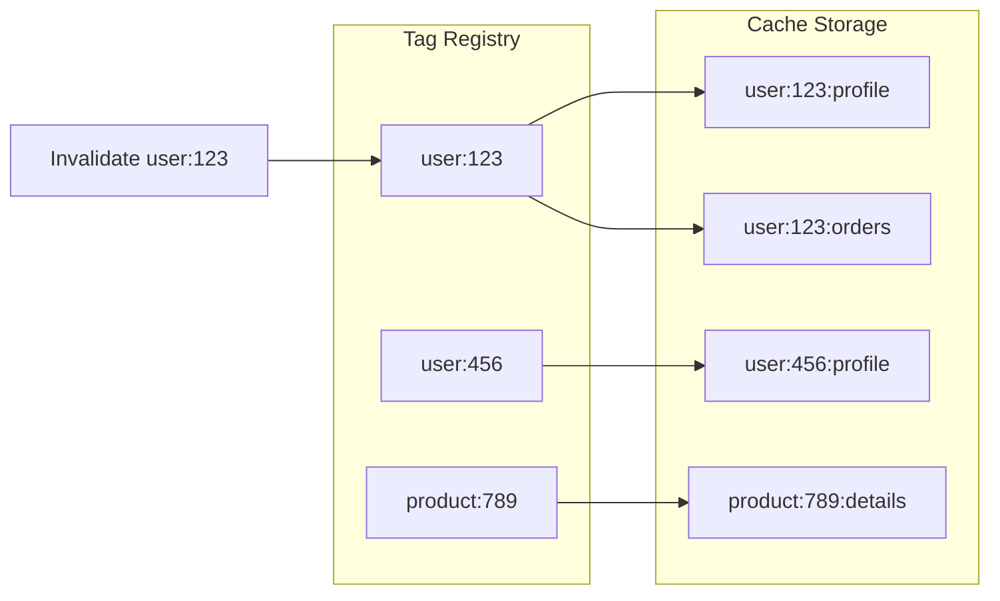
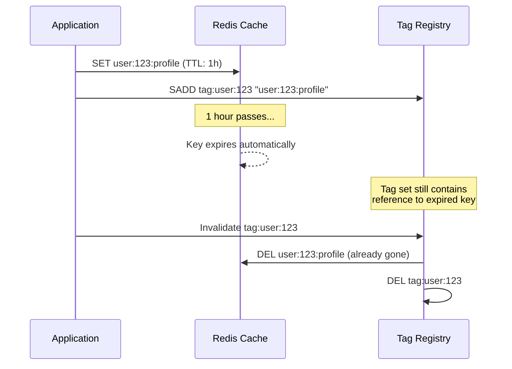

# How to Implement Tag-Based Invalidation

Author: [nawazdhandala](https://github.com/nawazdhandala)

Tags: Caching, Tags, Invalidation, Redis

Description: Learn to implement tag-based cache invalidation for bulk cache clearing by category.

---

> Cache invalidation is one of the two hard problems in computer science. Tag-based invalidation makes it easier by grouping related cache entries so you can clear them together.

Traditional cache invalidation requires knowing every key you want to delete. When a user updates their profile, you might need to invalidate dozens of cached pages, API responses, and computed values. Tracking all those keys manually leads to bugs, stale data, and frustrated users.

Tag-based invalidation solves this by associating cache entries with one or more tags. When you need to invalidate, you specify the tag and the system clears all matching entries automatically.

---

## How Tag-Based Invalidation Works

The core idea is straightforward: every cache entry can have multiple tags attached to it. When you invalidate a tag, all entries with that tag get cleared.

The following diagram shows how tags connect cache entries to invalidation events.



When you call `invalidate("user:123")`, the system looks up all cache keys associated with that tag and removes them. This happens atomically, preventing partial invalidations.

---

## Implementation Strategies

There are three common approaches to implementing tag-based invalidation. Each has trade-offs in complexity, performance, and storage overhead.

| Strategy | Complexity | Invalidation Speed | Storage Overhead | Best For |
|----------|------------|-------------------|------------------|----------|
| Tag Registry | Medium | Fast (O(n) where n = tagged entries) | Medium | Most applications |
| Version Tokens | Low | Instant (O(1)) | Low | High-write workloads |
| Bloom Filters | High | Very Fast | Very Low | Large-scale systems |

The tag registry approach is the most common and works well for most applications. Version tokens trade some read overhead for instant invalidation. Bloom filters are specialized for systems with millions of entries.

---

## Tag Registry Implementation

The tag registry maintains a mapping from tags to cache keys. When you set a cache entry, you also register its tags. When you invalidate, you look up the keys and delete them.

Here is a complete implementation using Redis.

```typescript
// cache-with-tags.ts
import Redis from 'ioredis';

const redis = new Redis(process.env.REDIS_URL);

// Store tag-to-key mappings in Redis sets
const TAG_PREFIX = 'tag:';

interface CacheOptions {
  ttl?: number;      // Time to live in seconds
  tags?: string[];   // Tags for invalidation
}

// Set a cache entry with optional tags
export async function setCache(
  key: string,
  value: unknown,
  options: CacheOptions = {}
): Promise<void> {
  const { ttl = 3600, tags = [] } = options;
  const serialized = JSON.stringify(value);

  // Use a pipeline for atomic operations
  const pipeline = redis.pipeline();

  // Set the cache value
  pipeline.setex(key, ttl, serialized);

  // Register this key with each tag
  for (const tag of tags) {
    pipeline.sadd(`${TAG_PREFIX}${tag}`, key);
  }

  await pipeline.exec();
}

// Get a cache entry
export async function getCache<T>(key: string): Promise<T | null> {
  const value = await redis.get(key);
  if (!value) return null;
  return JSON.parse(value) as T;
}

// Invalidate all entries with a specific tag
export async function invalidateTag(tag: string): Promise<number> {
  const tagKey = `${TAG_PREFIX}${tag}`;

  // Get all keys associated with this tag
  const keys = await redis.smembers(tagKey);

  if (keys.length === 0) return 0;

  // Delete all cached entries and the tag set itself
  const pipeline = redis.pipeline();
  pipeline.del(...keys);
  pipeline.del(tagKey);

  await pipeline.exec();

  return keys.length;
}
```

This implementation handles the basic workflow: setting entries with tags, retrieving entries, and invalidating by tag. The pipeline ensures operations are atomic.

---

## Handling Tag Cleanup

One challenge with tag registries is cleaning up stale tag references. When a cache entry expires naturally (via TTL), the tag set still contains a reference to it. Over time, these stale references accumulate.

The following diagram shows the cleanup problem and solution.



There are two strategies for handling this. The first approach is lazy cleanup: when invalidating, check if keys exist before counting them as invalidated. The second approach is proactive cleanup using Redis key-space notifications.

Here is an enhanced version with lazy cleanup.

```typescript
// Enhanced invalidation with existence check
export async function invalidateTagWithCleanup(tag: string): Promise<number> {
  const tagKey = `${TAG_PREFIX}${tag}`;
  const keys = await redis.smembers(tagKey);

  if (keys.length === 0) return 0;

  // Check which keys actually exist
  const existingKeys: string[] = [];
  const staleKeys: string[] = [];

  for (const key of keys) {
    const exists = await redis.exists(key);
    if (exists) {
      existingKeys.push(key);
    } else {
      staleKeys.push(key);
    }
  }

  const pipeline = redis.pipeline();

  // Delete existing cache entries
  if (existingKeys.length > 0) {
    pipeline.del(...existingKeys);
  }

  // Remove stale references from tag set
  if (staleKeys.length > 0) {
    pipeline.srem(tagKey, ...staleKeys);
  }

  // Delete the tag set if we cleared everything
  if (existingKeys.length === keys.length) {
    pipeline.del(tagKey);
  }

  await pipeline.exec();

  return existingKeys.length;
}
```

---

## Version Token Strategy

Version tokens offer an alternative approach that avoids the cleanup problem entirely. Instead of tracking keys per tag, you store a version number for each tag. Cache keys include the version, and invalidation simply increments the version.

```typescript
// version-based-cache.ts
import Redis from 'ioredis';

const redis = new Redis(process.env.REDIS_URL);
const VERSION_PREFIX = 'version:';

// Get current version for a tag
async function getVersion(tag: string): Promise<number> {
  const version = await redis.get(`${VERSION_PREFIX}${tag}`);
  return version ? parseInt(version, 10) : 0;
}

// Build a versioned cache key
async function buildKey(baseKey: string, tags: string[]): Promise<string> {
  const versions = await Promise.all(tags.map(getVersion));
  const versionString = versions.join(':');
  return `${baseKey}:v${versionString}`;
}

// Set cache with version-based key
export async function setVersionedCache(
  baseKey: string,
  value: unknown,
  tags: string[],
  ttl = 3600
): Promise<void> {
  const key = await buildKey(baseKey, tags);
  await redis.setex(key, ttl, JSON.stringify(value));
}

// Get cache with version-based key
export async function getVersionedCache<T>(
  baseKey: string,
  tags: string[]
): Promise<T | null> {
  const key = await buildKey(baseKey, tags);
  const value = await redis.get(key);
  return value ? JSON.parse(value) : null;
}

// Invalidate by incrementing version
export async function invalidateVersion(tag: string): Promise<void> {
  await redis.incr(`${VERSION_PREFIX}${tag}`);
}
```

The trade-off is that every cache read requires fetching the current version numbers. This adds latency but eliminates cleanup overhead and makes invalidation instant.

---

## Practical Usage Patterns

Here is how to use tag-based invalidation in a real application scenario. Consider an e-commerce system where product updates need to invalidate multiple cached views.

```typescript
// product-service.ts
import { setCache, invalidateTag } from './cache-with-tags';

interface Product {
  id: string;
  name: string;
  price: number;
  categoryId: string;
}

// Cache product with multiple tags
export async function cacheProduct(product: Product): Promise<void> {
  // Cache the product details
  await setCache(`product:${product.id}`, product, {
    ttl: 3600,
    tags: [
      `product:${product.id}`,           // Invalidate this specific product
      `category:${product.categoryId}`,   // Invalidate when category changes
      'products:all'                       // Invalidate all products
    ]
  });

  // Cache in category listing
  await setCache(`category:${product.categoryId}:products`, null, {
    ttl: 3600,
    tags: [
      `category:${product.categoryId}`,
      'products:all'
    ]
  });
}

// Update product and invalidate related caches
export async function updateProduct(product: Product): Promise<void> {
  // Save to database
  await saveToDatabase(product);

  // Invalidate all caches related to this product
  const invalidated = await invalidateTag(`product:${product.id}`);
  console.log(`Invalidated ${invalidated} cache entries for product ${product.id}`);
}

// Update category and invalidate all products in it
export async function updateCategory(categoryId: string): Promise<void> {
  await saveCategoryToDatabase(categoryId);

  // This clears all product caches in this category
  const invalidated = await invalidateTag(`category:${categoryId}`);
  console.log(`Invalidated ${invalidated} cache entries for category ${categoryId}`);
}
```

---

## Choosing the Right Granularity

Tag granularity affects both invalidation precision and overhead. Too fine-grained tags create many small sets. Too coarse-grained tags invalidate more than necessary.

| Granularity | Example Tags | Pros | Cons |
|-------------|--------------|------|------|
| Entity-level | `user:123`, `product:456` | Precise invalidation | Many tag sets to maintain |
| Type-level | `users`, `products` | Simple to reason about | Over-invalidation |
| Mixed | `user:123`, `users:active` | Flexible | More complex tagging logic |

The following guidelines help choose the right granularity.

Use entity-level tags when updates are frequent and localized. A user profile update should not clear every user's cache.

Use type-level tags for bulk operations. When deploying a schema change, you might need to invalidate all cached user objects.

Use hierarchical tags for nested relationships. A tag like `org:456:team:789` lets you invalidate at the organization level or team level.

---

## Performance Considerations

Tag-based invalidation adds overhead to cache writes (registering tags) and invalidation (looking up and deleting keys). Here are strategies to keep performance acceptable.

First, batch tag registrations. If you are setting many related cache entries, use a single pipeline.

```typescript
// Batch cache setting for multiple products
export async function cacheProducts(products: Product[]): Promise<void> {
  const pipeline = redis.pipeline();

  for (const product of products) {
    const key = `product:${product.id}`;
    const value = JSON.stringify(product);

    pipeline.setex(key, 3600, value);
    pipeline.sadd(`tag:product:${product.id}`, key);
    pipeline.sadd(`tag:category:${product.categoryId}`, key);
  }

  await pipeline.exec();
}
```

Second, limit tags per entry. Each tag adds storage and invalidation overhead. Three to five tags per entry is usually sufficient.

Third, use TTLs on tag sets. If a tag set is not accessed for a long time, let it expire naturally rather than maintaining it indefinitely.

---

## Summary

Tag-based invalidation transforms cache management from tracking individual keys to reasoning about data relationships. When you update a user, invalidate the `user:123` tag. When you change a product category, invalidate the `category:456` tag. The cache system handles finding and clearing the right entries.

The tag registry approach works well for most applications. Version tokens trade read latency for instant invalidation. Choose based on your read/write ratio and consistency requirements.

Start with a simple implementation and add optimizations (cleanup, batching, hierarchical tags) as your system scales. The goal is maintainable cache invalidation that keeps your data consistent without requiring you to track every cached key manually.

---

**Related Reading:**

- [When Performance Matters, Skip the ORM](https://oneuptime.com/blog/post/2025-11-13-when-performance-matters-skip-the-orm/view)
- [The Hidden Costs of Dependency Bloat](https://oneuptime.com/blog/post/2025-09-02-the-hidden-costs-of-dependency-bloat-in-software-development/view)
