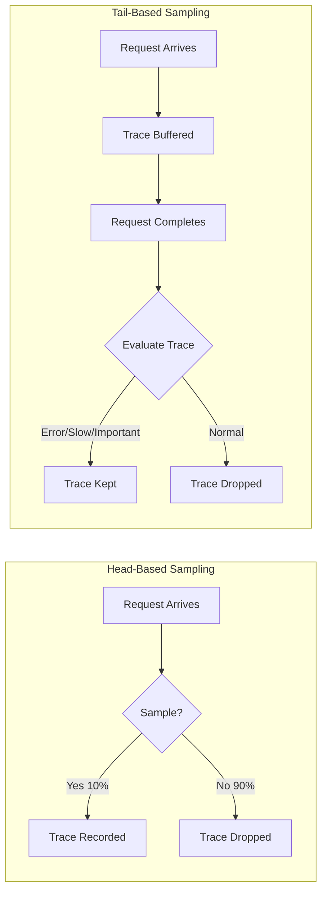
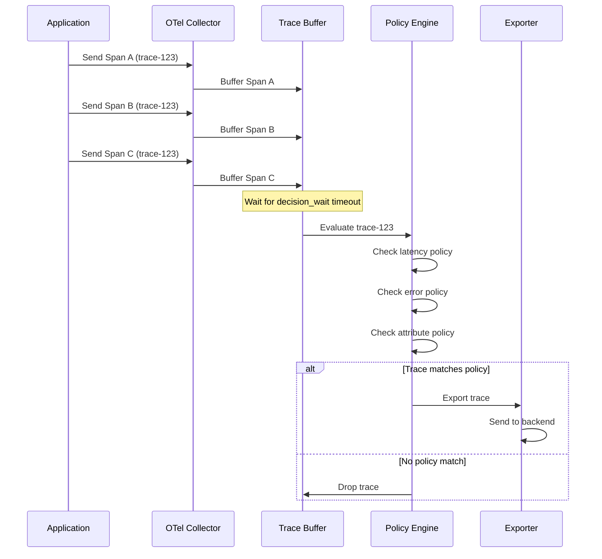
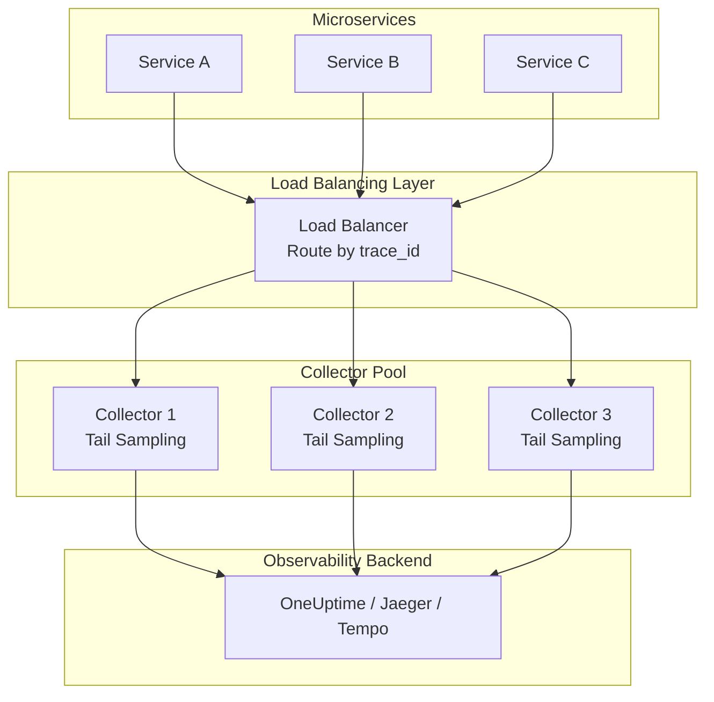
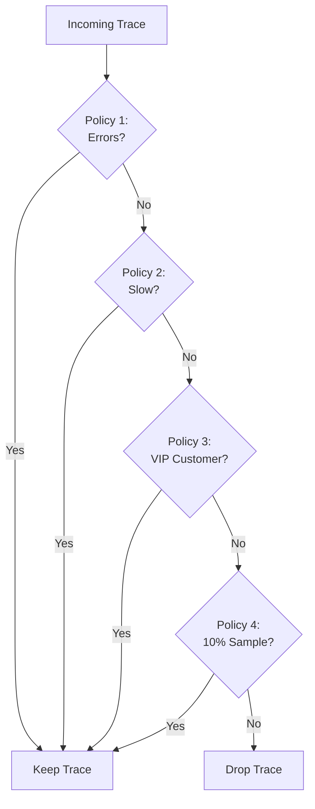
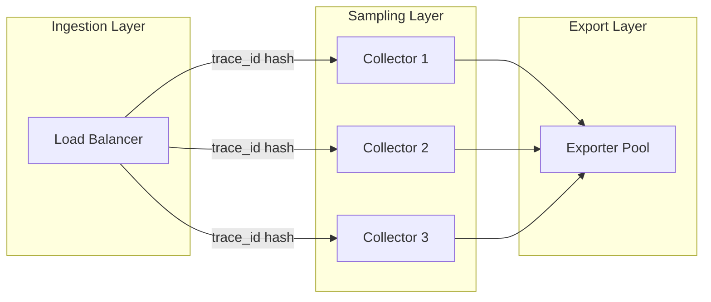

# How to Create Tail-Based Sampling

Author: [nawazdhandala](https://github.com/nawazdhandala)

Tags: Observability, Tracing, OpenTelemetry, Sampling

Description: Learn how to implement tail-based sampling for sampling decisions based on complete trace data.

---

Distributed tracing generates enormous volumes of data. In production systems handling thousands of requests per second, storing every single trace becomes prohibitively expensive and often counterproductive. The challenge is keeping the traces that matter while discarding the mundane ones.

**Tail-based sampling** solves this by deferring the sampling decision until after a trace completes. Unlike head-based sampling (which decides at trace creation), tail-based sampling can evaluate the entire trace, including latency, error status, and span attributes, before deciding whether to keep or drop it.

This guide walks through the concepts, architecture, and implementation of tail-based sampling using the OpenTelemetry Collector.

---

## Table of Contents

1. Head vs Tail Sampling
2. How Tail-Based Sampling Works
3. OpenTelemetry Collector Architecture
4. Setting Up the Tail Sampling Processor
5. Latency-Based Sampling Policies
6. Error-Based Sampling Policies
7. Combining Multiple Policies
8. Production Configuration Example
9. Performance Considerations
10. Common Pitfalls and Solutions

---

## 1. Head vs Tail Sampling

Before diving into tail-based sampling, it helps to understand how it differs from head-based sampling.



| Aspect | Head-Based | Tail-Based |
|--------|-----------|------------|
| Decision Point | At trace start | After trace completes |
| Information Available | Only initial context | Full trace with all spans |
| Memory Overhead | Low | Higher (buffers traces) |
| Can Sample by Error | No | Yes |
| Can Sample by Latency | No | Yes |
| Complexity | Simple | More complex |

Head-based sampling is simpler but blind. It cannot know if a request will fail or be slow. Tail-based sampling sees the complete picture before deciding.

---

## 2. How Tail-Based Sampling Works

Tail-based sampling requires buffering trace data until all spans arrive and the trace is considered complete. The process follows these steps:



Key concepts:

- **Decision Wait**: The time the collector waits for all spans to arrive before making a decision
- **Num Traces**: Maximum number of traces to hold in memory
- **Policies**: Rules that determine which traces to keep

---

## 3. OpenTelemetry Collector Architecture

For tail-based sampling to work correctly in a distributed environment, all spans from the same trace must reach the same collector instance. This typically requires a load balancer that routes by trace ID.



For simpler deployments, a single collector instance works but becomes a bottleneck at scale. The OpenTelemetry Collector also provides a `loadbalancingexporter` to distribute traces correctly across collector instances.

---

## 4. Setting Up the Tail Sampling Processor

The OpenTelemetry Collector includes a `tail_sampling` processor. Here is a minimal configuration:

```yaml
# otel-collector-config.yaml
# Minimal tail sampling configuration for OpenTelemetry Collector

receivers:
  otlp:
    protocols:
      grpc:
        endpoint: 0.0.0.0:4317
      http:
        endpoint: 0.0.0.0:4318

processors:
  # Tail sampling processor configuration
  tail_sampling:
    # Time to wait for a trace to complete before making a decision
    # Longer values catch more late-arriving spans but use more memory
    decision_wait: 10s

    # Maximum number of traces to keep in memory
    # Size based on: (traces/sec * decision_wait_sec * safety_margin)
    num_traces: 100000

    # How often to check for traces that exceeded decision_wait
    expected_new_traces_per_sec: 1000

    # Sampling policies (evaluated in order, first match wins)
    policies:
      # Keep 10% of all traces as a baseline
      - name: baseline-sampling
        type: probabilistic
        probabilistic:
          sampling_percentage: 10

exporters:
  otlp:
    endpoint: "https://oneuptime.com/otlp"
    headers:
      x-oneuptime-token: "${ONEUPTIME_TOKEN}"

service:
  pipelines:
    traces:
      receivers: [otlp]
      processors: [tail_sampling]
      exporters: [otlp]
```

Configuration parameters explained:

| Parameter | Description | Recommended Value |
|-----------|-------------|-------------------|
| `decision_wait` | Time to wait for spans | 10-30s depending on trace duration |
| `num_traces` | Max traces in memory | traces_per_sec * decision_wait * 2 |
| `expected_new_traces_per_sec` | Expected throughput | Actual expected TPS |
| `policies` | Sampling rules | See sections below |

---

## 5. Latency-Based Sampling Policies

Latency-based sampling keeps traces that exceed a duration threshold. This captures slow requests that often indicate performance problems.

```yaml
processors:
  tail_sampling:
    decision_wait: 10s
    num_traces: 100000
    policies:
      # Keep all traces slower than 500ms
      - name: high-latency
        type: latency
        latency:
          # Threshold in milliseconds
          # Traces with total duration >= threshold_ms are kept
          threshold_ms: 500

      # Keep traces slower than 2 seconds with higher priority
      - name: very-slow-requests
        type: latency
        latency:
          threshold_ms: 2000

      # Baseline: keep 5% of remaining traces
      - name: probabilistic-baseline
        type: probabilistic
        probabilistic:
          sampling_percentage: 5
```

The latency policy evaluates the root span duration. For more granular control, you can combine latency with other policies.

### Dynamic Latency Thresholds by Endpoint

Different endpoints have different acceptable latencies. A batch processing endpoint taking 5 seconds might be normal, while an API endpoint taking 500ms is slow.

```yaml
processors:
  tail_sampling:
    decision_wait: 15s
    num_traces: 100000
    policies:
      # API endpoints: keep if slower than 200ms
      - name: slow-api-requests
        type: and
        and:
          and_sub_policy:
            # First condition: must be an API route
            - name: api-routes
              type: string_attribute
              string_attribute:
                key: http.route
                values:
                  - "/api/v1/*"
                  - "/api/v2/*"
                enabled_regex_matching: true
            # Second condition: must be slow
            - name: latency-check
              type: latency
              latency:
                threshold_ms: 200

      # Batch endpoints: keep if slower than 5 seconds
      - name: slow-batch-jobs
        type: and
        and:
          and_sub_policy:
            - name: batch-routes
              type: string_attribute
              string_attribute:
                key: http.route
                values:
                  - "/batch/*"
                  - "/jobs/*"
                enabled_regex_matching: true
            - name: latency-check
              type: latency
              latency:
                threshold_ms: 5000

      # Health checks: never sample
      - name: drop-health-checks
        type: string_attribute
        string_attribute:
          key: http.route
          values:
            - "/health"
            - "/healthz"
            - "/ready"
          invert_match: true
```

---

## 6. Error-Based Sampling Policies

Error-based sampling ensures you always capture traces containing failures. These are typically the most valuable for debugging.

```yaml
processors:
  tail_sampling:
    decision_wait: 10s
    num_traces: 100000
    policies:
      # Keep all traces with ERROR status
      - name: errors
        type: status_code
        status_code:
          status_codes:
            - ERROR

      # Keep traces with UNSET status (often indicates issues)
      - name: unset-status
        type: status_code
        status_code:
          status_codes:
            - UNSET
```

### HTTP Status Code Based Sampling

For HTTP services, you may want to sample based on response status codes:

```yaml
processors:
  tail_sampling:
    decision_wait: 10s
    num_traces: 100000
    policies:
      # Keep all 5xx server errors
      - name: server-errors
        type: numeric_attribute
        numeric_attribute:
          key: http.status_code
          min_value: 500
          max_value: 599

      # Keep all 4xx client errors (might indicate API issues)
      - name: client-errors
        type: numeric_attribute
        numeric_attribute:
          key: http.status_code
          min_value: 400
          max_value: 499

      # Keep traces with exception recordings
      - name: exceptions
        type: string_attribute
        string_attribute:
          key: exception.type
          values:
            - ".*"
          enabled_regex_matching: true
```

### Span Event Based Sampling

Capture traces that have specific events recorded:

```yaml
processors:
  tail_sampling:
    decision_wait: 10s
    num_traces: 100000
    policies:
      # Keep traces where any span has an exception event
      - name: exception-events
        type: span_count
        span_count:
          min_spans: 1
          max_spans: 0  # 0 means no upper limit
```

---

## 7. Combining Multiple Policies

Real-world sampling requires combining multiple conditions. The tail sampling processor supports `and`, `or`, and composite policies.



### AND Policy Example

Keep traces that match ALL conditions:

```yaml
processors:
  tail_sampling:
    decision_wait: 10s
    num_traces: 100000
    policies:
      # Keep slow requests from the checkout service
      - name: slow-checkout
        type: and
        and:
          and_sub_policy:
            # Condition 1: must be checkout service
            - name: checkout-service
              type: string_attribute
              string_attribute:
                key: service.name
                values:
                  - "checkout-service"
            # Condition 2: must be slow
            - name: slow
              type: latency
              latency:
                threshold_ms: 300
```

### OR Policy (Composite)

The composite policy allows OR logic with weighted decisions:

```yaml
processors:
  tail_sampling:
    decision_wait: 10s
    num_traces: 100000
    policies:
      # Composite policy: keep if ANY sub-policy matches
      - name: important-traces
        type: composite
        composite:
          # Maximum total sampling rate
          max_total_spans_per_second: 1000
          # Rate allocation defines priority
          policy_order: [errors, slow, vip, baseline]
          composite_sub_policy:
            # Always keep errors (highest priority)
            - name: errors
              type: status_code
              status_code:
                status_codes: [ERROR]
            # Keep slow requests
            - name: slow
              type: latency
              latency:
                threshold_ms: 500
            # Keep VIP customer traces
            - name: vip
              type: string_attribute
              string_attribute:
                key: customer.tier
                values: ["enterprise", "premium"]
            # Baseline sampling for everything else
            - name: baseline
              type: probabilistic
              probabilistic:
                sampling_percentage: 5
          # Rate limits per policy (spans per second)
          rate_allocation:
            - policy: errors
              percent: 40
            - policy: slow
              percent: 30
            - policy: vip
              percent: 20
            - policy: baseline
              percent: 10
```

---

## 8. Production Configuration Example

Here is a complete production-ready configuration combining all concepts:

```yaml
# otel-collector-config.yaml
# Production tail sampling configuration

receivers:
  otlp:
    protocols:
      grpc:
        endpoint: 0.0.0.0:4317
        max_recv_msg_size_mib: 16
      http:
        endpoint: 0.0.0.0:4318

processors:
  # Memory limiter prevents OOM crashes
  memory_limiter:
    check_interval: 5s
    limit_mib: 4096
    spike_limit_mib: 1024

  # Batch processor for efficient export
  batch:
    send_batch_size: 1024
    send_batch_max_size: 2048
    timeout: 5s

  # Main tail sampling configuration
  tail_sampling:
    # Wait 30 seconds for all spans to arrive
    # Adjust based on your longest trace duration
    decision_wait: 30s

    # Buffer size: 5000 traces/sec * 30s * 2 (safety margin)
    num_traces: 300000

    # Expected throughput for internal metrics
    expected_new_traces_per_sec: 5000

    policies:
      # POLICY 1: Always keep errors (highest priority)
      - name: errors-always
        type: status_code
        status_code:
          status_codes:
            - ERROR

      # POLICY 2: Keep slow requests (above p99)
      - name: high-latency-p99
        type: latency
        latency:
          threshold_ms: 1000

      # POLICY 3: Keep moderately slow requests (above p95)
      # Sample 50% to reduce volume
      - name: moderate-latency-p95
        type: and
        and:
          and_sub_policy:
            - name: latency-check
              type: latency
              latency:
                threshold_ms: 500
            - name: sample-half
              type: probabilistic
              probabilistic:
                sampling_percentage: 50

      # POLICY 4: Always keep VIP customer traces
      - name: vip-customers
        type: string_attribute
        string_attribute:
          key: customer.tier
          values:
            - enterprise
            - premium

      # POLICY 5: Keep traces from critical services
      - name: critical-services
        type: string_attribute
        string_attribute:
          key: service.name
          values:
            - payment-service
            - checkout-service
            - auth-service

      # POLICY 6: Keep traces with specific operations
      - name: critical-operations
        type: string_attribute
        string_attribute:
          key: operation.name
          values:
            - ProcessPayment
            - CreateOrder
            - AuthenticateUser

      # POLICY 7: Drop health checks explicitly
      - name: drop-health-checks
        type: and
        and:
          and_sub_policy:
            - name: health-endpoints
              type: string_attribute
              string_attribute:
                key: http.route
                values:
                  - /health
                  - /healthz
                  - /ready
                  - /metrics
            - name: always-drop
              type: probabilistic
              probabilistic:
                sampling_percentage: 0

      # POLICY 8: Baseline sampling for everything else
      - name: baseline
        type: probabilistic
        probabilistic:
          sampling_percentage: 5

  # Add deployment metadata
  resource:
    attributes:
      - key: deployment.environment
        value: ${DEPLOY_ENV}
        action: upsert
      - key: deployment.version
        value: ${DEPLOY_VERSION}
        action: upsert

exporters:
  # Primary export to OneUptime
  otlphttp:
    endpoint: "https://oneuptime.com/otlp"
    encoding: json
    headers:
      Content-Type: application/json
      x-oneuptime-token: ${ONEUPTIME_TOKEN}
    retry_on_failure:
      enabled: true
      initial_interval: 5s
      max_interval: 30s
      max_elapsed_time: 300s

  # Debug logging (disable in production)
  logging:
    verbosity: basic
    sampling_initial: 5
    sampling_thereafter: 200

extensions:
  # Health check for Kubernetes probes
  health_check:
    endpoint: 0.0.0.0:13133

  # Performance profiling
  pprof:
    endpoint: 0.0.0.0:1777

  # Prometheus metrics for collector monitoring
  zpages:
    endpoint: 0.0.0.0:55679

service:
  extensions: [health_check, pprof, zpages]

  pipelines:
    traces:
      receivers: [otlp]
      processors: [memory_limiter, tail_sampling, batch, resource]
      exporters: [otlphttp]

  telemetry:
    logs:
      level: info
    metrics:
      level: detailed
      address: 0.0.0.0:8888
```

### Kubernetes Deployment

Deploy the collector with appropriate resources:

```yaml
# collector-deployment.yaml
apiVersion: apps/v1
kind: Deployment
metadata:
  name: otel-collector
  labels:
    app: otel-collector
spec:
  replicas: 3
  selector:
    matchLabels:
      app: otel-collector
  template:
    metadata:
      labels:
        app: otel-collector
    spec:
      containers:
        - name: collector
          image: otel/opentelemetry-collector-contrib:latest
          args:
            - --config=/etc/otel/config.yaml
          ports:
            - containerPort: 4317  # OTLP gRPC
            - containerPort: 4318  # OTLP HTTP
            - containerPort: 8888  # Prometheus metrics
            - containerPort: 13133 # Health check
          resources:
            requests:
              memory: "4Gi"
              cpu: "2"
            limits:
              memory: "8Gi"
              cpu: "4"
          livenessProbe:
            httpGet:
              path: /
              port: 13133
            initialDelaySeconds: 10
            periodSeconds: 10
          readinessProbe:
            httpGet:
              path: /
              port: 13133
            initialDelaySeconds: 5
            periodSeconds: 5
          volumeMounts:
            - name: config
              mountPath: /etc/otel
          env:
            - name: ONEUPTIME_TOKEN
              valueFrom:
                secretKeyRef:
                  name: otel-secrets
                  key: oneuptime-token
            - name: DEPLOY_ENV
              value: "production"
            - name: DEPLOY_VERSION
              value: "1.0.0"
      volumes:
        - name: config
          configMap:
            name: otel-collector-config
```

---

## 9. Performance Considerations

Tail-based sampling trades memory for intelligence. Consider these factors:

### Memory Requirements

Calculate buffer size:

```
buffer_size = traces_per_second * decision_wait_seconds * avg_spans_per_trace * span_size_bytes
```

Example:
- 5,000 traces/second
- 30 second decision wait
- 10 spans per trace average
- 2KB per span

```
buffer_size = 5000 * 30 * 10 * 2KB = 3GB
```

Add 50% headroom for safety: **4.5GB minimum**

### CPU Requirements

Tail sampling is CPU-intensive due to policy evaluation. Monitor these metrics:

```yaml
# Prometheus queries for collector monitoring
# Traces waiting in buffer
otelcol_processor_tail_sampling_count_traces_on_memory

# Sampling decisions per second
rate(otelcol_processor_tail_sampling_count_spans_sampled[5m])

# Policy evaluation latency
otelcol_processor_tail_sampling_sampling_decision_latency
```

### Scaling Strategy



Use the load balancing exporter for consistent trace routing:

```yaml
exporters:
  loadbalancing:
    protocol:
      otlp:
        timeout: 1s
    resolver:
      dns:
        hostname: otel-collector-headless
        port: 4317
```

---

## 10. Common Pitfalls and Solutions

### Pitfall 1: Incomplete Traces

**Problem**: Spans arrive after the decision_wait timeout.

**Solution**: Increase `decision_wait` or ensure services flush spans promptly.

```yaml
# Application-side: reduce batch delay
processors:
  batch:
    timeout: 1s  # Reduce from default 5s
```

### Pitfall 2: Memory Exhaustion

**Problem**: Collector runs out of memory during traffic spikes.

**Solution**: Use memory limiter and appropriate resource limits.

```yaml
processors:
  memory_limiter:
    check_interval: 1s
    limit_mib: 4096
    spike_limit_mib: 512
```

### Pitfall 3: Traces Split Across Collectors

**Problem**: Different spans from the same trace land on different collectors.

**Solution**: Use trace-ID-based load balancing.

```yaml
# HAProxy example
backend otel_collectors
    balance hdr(traceparent)
    hash-type consistent
    server collector1 collector1:4317 check
    server collector2 collector2:4317 check
    server collector3 collector3:4317 check
```

### Pitfall 4: Policy Order Matters

**Problem**: Unexpected sampling behavior due to policy evaluation order.

**Solution**: Order policies from most specific to least specific.

```yaml
policies:
  # 1. Explicit drops first
  - name: drop-health
    type: string_attribute
    # ...

  # 2. High-value keeps next
  - name: errors
    type: status_code
    # ...

  # 3. Conditional keeps
  - name: slow-critical
    type: and
    # ...

  # 4. Baseline last
  - name: probabilistic
    type: probabilistic
    # ...
```

### Pitfall 5: Not Monitoring the Collector

**Problem**: Sampling issues go unnoticed until data is missing.

**Solution**: Alert on collector metrics.

```yaml
# Example Prometheus alert rules
groups:
  - name: otel-collector
    rules:
      - alert: TailSamplingBufferHigh
        expr: otelcol_processor_tail_sampling_count_traces_on_memory > 250000
        for: 5m
        labels:
          severity: warning
        annotations:
          summary: "Tail sampling buffer is filling up"

      - alert: TailSamplingDroppedSpans
        expr: rate(otelcol_processor_tail_sampling_count_spans_dropped[5m]) > 100
        for: 5m
        labels:
          severity: critical
        annotations:
          summary: "Tail sampling is dropping spans"
```

---

## Summary

Tail-based sampling provides intelligent trace retention by evaluating complete traces before deciding what to keep. The key benefits:

| Benefit | Description |
|---------|-------------|
| Error Capture | Always keeps traces with failures |
| Latency Insight | Captures slow requests above thresholds |
| Cost Control | Reduces storage while keeping valuable data |
| Flexibility | Policies can target any attribute or condition |

Implementation checklist:

1. Calculate memory requirements based on throughput
2. Configure appropriate `decision_wait` for your trace durations
3. Define policies in priority order (errors, latency, attributes, baseline)
4. Set up trace-ID-based load balancing for multi-collector deployments
5. Monitor collector metrics and set alerts
6. Test policies with representative traffic before production

Tail-based sampling transforms tracing from a data firehose into a curated collection of meaningful insights. Combined with head-based sampling for baseline coverage, you get the best of both approaches: low overhead for normal traffic and guaranteed capture of anomalies.

---

**Related Reading:**

- [What are Traces and Spans in OpenTelemetry: A Practical Guide](https://oneuptime.com/blog/post/2025-08-27-traces-and-spans-in-opentelemetry/view)
- [How to Reduce Noise in OpenTelemetry](https://oneuptime.com/blog/post/2025-08-25-how-to-reduce-noise-in-opentelemetry/view)
- [What is OpenTelemetry Collector and Why Use One](https://oneuptime.com/blog/post/2025-09-18-what-is-opentelemetry-collector-and-why-use-one/view)
