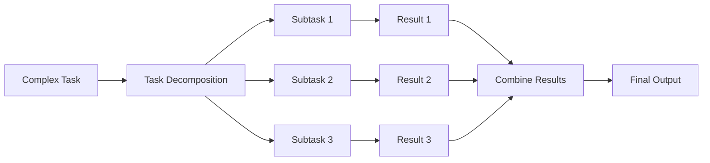
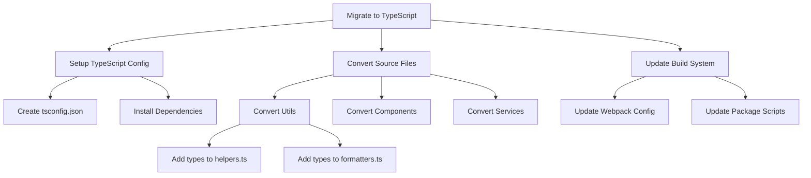
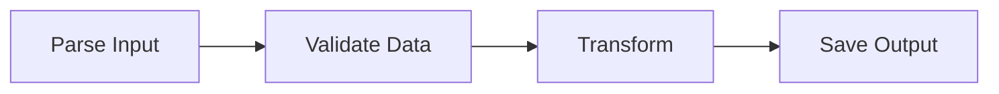
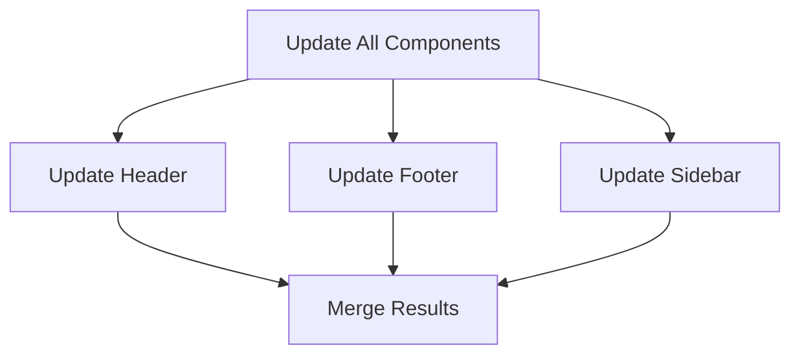
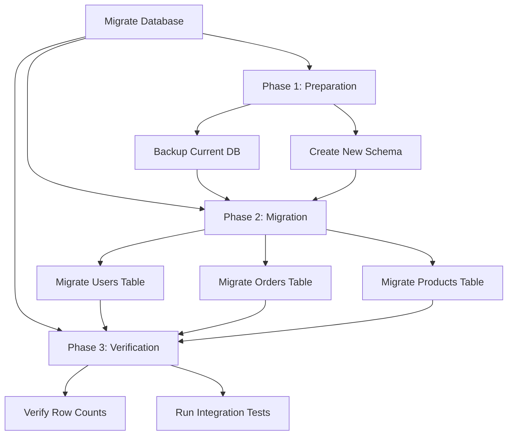

# How to Create Task Decomposition

Author: [nawazdhandala](https://github.com/nawazdhandala)

Tags: AI Agents, LLM, Planning, AI

Description: A practical guide to implementing task decomposition in AI agents, covering strategies for breaking complex goals into manageable subtasks that LLMs can execute reliably.

---

Task decomposition is the foundation of effective AI agent behavior. When faced with a complex request like "refactor this codebase to use TypeScript," an agent that tries to tackle everything at once will likely fail or produce inconsistent results. An agent that systematically breaks the task into smaller, well-defined subtasks can handle the same request reliably.

## Why Task Decomposition Matters

Large language models excel at focused, well-scoped tasks. They struggle with ambiguity, long sequences of dependent operations, and tasks that require maintaining context across many steps. Task decomposition addresses these limitations by:

1. Reducing cognitive load on each LLM call
2. Creating clear checkpoints for validation
3. Enabling parallel execution where possible
4. Making failures recoverable without starting over
5. Providing transparency into agent reasoning



## Core Concepts

### Tasks vs Subtasks

A task is what the user wants to accomplish. A subtask is a single, atomic unit of work that contributes to the task. Good subtasks share these properties:

| Property | Description | Example |
|----------|-------------|---------|
| Atomic | Cannot be meaningfully subdivided | "Add type annotations to user.ts" |
| Verifiable | Success can be objectively checked | "All functions have return types" |
| Independent | Minimal dependencies on other subtasks | "Parse config file" before "Validate config" |
| Bounded | Clear scope and completion criteria | "Update imports in src/utils/" |

### The Decomposition Hierarchy

Tasks naturally form a hierarchy. A complex goal breaks into high-level subtasks, which break into lower-level subtasks, until you reach atomic operations.



## Implementing Task Decomposition

Let's build a task decomposition system step by step. We will start with the data structures that represent tasks and their relationships.

### Define Task Data Structures

These classes model tasks, their dependencies, and execution state.

```python
from dataclasses import dataclass, field
from enum import Enum
from typing import Optional, Any
import uuid

class TaskStatus(Enum):
    PENDING = "pending"
    READY = "ready"        # All dependencies satisfied
    IN_PROGRESS = "in_progress"
    COMPLETED = "completed"
    FAILED = "failed"
    BLOCKED = "blocked"    # Waiting on dependencies

@dataclass
class Task:
    """Represents a single task or subtask."""
    description: str
    task_type: str                              # e.g., "code_edit", "file_create", "analysis"
    id: str = field(default_factory=lambda: str(uuid.uuid4())[:8])
    status: TaskStatus = TaskStatus.PENDING
    parent_id: Optional[str] = None             # ID of parent task if this is a subtask
    dependencies: list[str] = field(default_factory=list)  # IDs of tasks that must complete first
    subtasks: list[str] = field(default_factory=list)      # IDs of child tasks
    context: dict = field(default_factory=dict)  # Task-specific data
    result: Optional[Any] = None
    error: Optional[str] = None

    def is_leaf(self) -> bool:
        """Returns True if this task has no subtasks."""
        return len(self.subtasks) == 0

    def is_complete(self) -> bool:
        """Returns True if task finished (successfully or not)."""
        return self.status in (TaskStatus.COMPLETED, TaskStatus.FAILED)


@dataclass
class TaskGraph:
    """Manages tasks and their relationships."""
    tasks: dict[str, Task] = field(default_factory=dict)
    root_task_id: Optional[str] = None

    def add_task(self, task: Task) -> str:
        """Add a task to the graph."""
        self.tasks[task.id] = task
        if self.root_task_id is None:
            self.root_task_id = task.id
        return task.id

    def add_subtask(self, parent_id: str, subtask: Task) -> str:
        """Add a subtask under a parent task."""
        subtask.parent_id = parent_id
        self.tasks[subtask.id] = subtask
        self.tasks[parent_id].subtasks.append(subtask.id)
        return subtask.id

    def get_ready_tasks(self) -> list[Task]:
        """Return tasks that are ready to execute."""
        ready = []
        for task in self.tasks.values():
            if task.status != TaskStatus.PENDING:
                continue
            if not task.is_leaf():
                continue
            # Check if all dependencies are satisfied
            deps_satisfied = all(
                self.tasks[dep_id].status == TaskStatus.COMPLETED
                for dep_id in task.dependencies
            )
            if deps_satisfied:
                ready.append(task)
        return ready

    def get_task_tree(self, task_id: str, indent: int = 0) -> str:
        """Return a string representation of the task tree."""
        task = self.tasks[task_id]
        status_icon = {
            TaskStatus.PENDING: "[ ]",
            TaskStatus.READY: "[~]",
            TaskStatus.IN_PROGRESS: "[*]",
            TaskStatus.COMPLETED: "[x]",
            TaskStatus.FAILED: "[!]",
            TaskStatus.BLOCKED: "[-]"
        }
        lines = [f"{'  ' * indent}{status_icon[task.status]} {task.description}"]
        for subtask_id in task.subtasks:
            lines.append(self.get_task_tree(subtask_id, indent + 1))
        return "\n".join(lines)
```

### Implement the Decomposer

The decomposer uses an LLM to break tasks into subtasks. It recursively decomposes until reaching atomic tasks.

```python
import json
from openai import OpenAI

class TaskDecomposer:
    """Breaks complex tasks into manageable subtasks using an LLM."""

    def __init__(self, client: OpenAI, max_depth: int = 3):
        self.client = client
        self.max_depth = max_depth
        # Task types help the LLM understand what kind of operations are possible
        self.task_types = [
            "analysis",      # Understanding code, requirements, or data
            "code_edit",     # Modifying existing code
            "file_create",   # Creating new files
            "file_delete",   # Removing files
            "refactor",      # Restructuring without changing behavior
            "test",          # Writing or running tests
            "documentation", # Writing docs or comments
            "configuration", # Updating config files
        ]

    def decompose(self, task: Task, graph: TaskGraph, depth: int = 0) -> None:
        """Recursively decompose a task into subtasks."""

        # Stop recursion at max depth
        if depth >= self.max_depth:
            return

        # Check if task needs decomposition
        if not self._should_decompose(task):
            return

        # Use LLM to generate subtasks
        subtasks = self._generate_subtasks(task, graph)

        # Add subtasks to the graph
        for subtask in subtasks:
            graph.add_subtask(task.id, subtask)

        # Recursively decompose each subtask
        for subtask in subtasks:
            self.decompose(subtask, graph, depth + 1)

    def _should_decompose(self, task: Task) -> bool:
        """Determine if a task should be broken down further."""

        prompt = f"""
Analyze this task and determine if it should be decomposed into smaller subtasks.

Task: {task.description}
Type: {task.task_type}

A task should be decomposed if:
- It involves multiple distinct operations
- It touches multiple files or components
- It has implicit steps that should be made explicit
- It would benefit from checkpoints for validation

A task should NOT be decomposed if:
- It is a single, atomic operation
- It can be completed in one focused step
- Further breakdown would add overhead without benefit

Respond with JSON:
{{"should_decompose": true/false, "reasoning": "brief explanation"}}
"""

        response = self.client.chat.completions.create(
            model="gpt-4",
            messages=[{"role": "user", "content": prompt}],
            response_format={"type": "json_object"}
        )

        result = json.loads(response.choices[0].message.content)
        return result.get("should_decompose", False)

    def _generate_subtasks(self, task: Task, graph: TaskGraph) -> list[Task]:
        """Use LLM to generate subtasks for a task."""

        # Build context about existing tasks for dependency awareness
        existing_context = self._build_context(task, graph)

        prompt = f"""
Break down this task into 2-5 sequential subtasks.

Task: {task.description}
Type: {task.task_type}
Context: {json.dumps(task.context)}

Existing tasks in the system:
{existing_context}

Available task types: {self.task_types}

Guidelines:
- Each subtask should be a single, focused operation
- Order subtasks by dependency (earlier tasks should complete first)
- Mark dependencies on other tasks by their IDs
- Be specific about what files or components each subtask affects

Respond with JSON:
{{
    "reasoning": "How you decided to break down this task",
    "subtasks": [
        {{
            "description": "Clear description of what to do",
            "task_type": "one of the available types",
            "dependencies": ["id1", "id2"],
            "context": {{"files": ["path/to/file"], "notes": "any relevant details"}}
        }}
    ]
}}
"""

        response = self.client.chat.completions.create(
            model="gpt-4",
            messages=[
                {"role": "system", "content": self._system_prompt()},
                {"role": "user", "content": prompt}
            ],
            response_format={"type": "json_object"}
        )

        result = json.loads(response.choices[0].message.content)

        subtasks = []
        for st in result.get("subtasks", []):
            subtask = Task(
                description=st["description"],
                task_type=st.get("task_type", "analysis"),
                dependencies=st.get("dependencies", []),
                context=st.get("context", {})
            )
            subtasks.append(subtask)

        return subtasks

    def _system_prompt(self) -> str:
        return """You are a task decomposition expert. Your job is to break complex
tasks into smaller, manageable subtasks that can be executed independently.

Focus on:
- Making each subtask atomic and verifiable
- Identifying dependencies between subtasks
- Ensuring subtasks are ordered correctly
- Being specific enough that each subtask has clear completion criteria"""

    def _build_context(self, task: Task, graph: TaskGraph) -> str:
        """Build context string showing existing tasks."""
        lines = []
        for t in graph.tasks.values():
            if t.id != task.id:
                lines.append(f"- [{t.id}] {t.description} ({t.status.value})")
        return "\n".join(lines) if lines else "No other tasks"
```

### Implement the Task Executor

The executor runs tasks and manages their state transitions. It handles both leaf tasks (actual work) and parent tasks (aggregating subtask results).

```python
from typing import Callable

class TaskExecutor:
    """Executes tasks and manages their lifecycle."""

    def __init__(self, client: OpenAI):
        self.client = client
        self.handlers: dict[str, Callable] = {}

    def register_handler(self, task_type: str, handler: Callable):
        """Register a function to handle a specific task type."""
        self.handlers[task_type] = handler

    def execute_task(self, task: Task, graph: TaskGraph) -> bool:
        """Execute a single task."""

        # Parent tasks complete when all subtasks complete
        if not task.is_leaf():
            return self._execute_parent_task(task, graph)

        # Leaf tasks are executed by handlers
        return self._execute_leaf_task(task)

    def _execute_leaf_task(self, task: Task) -> bool:
        """Execute an atomic task."""
        task.status = TaskStatus.IN_PROGRESS

        handler = self.handlers.get(task.task_type)
        if not handler:
            # Fall back to LLM-based execution
            return self._llm_execute(task)

        try:
            result = handler(task)
            task.result = result
            task.status = TaskStatus.COMPLETED
            return True
        except Exception as e:
            task.error = str(e)
            task.status = TaskStatus.FAILED
            return False

    def _execute_parent_task(self, task: Task, graph: TaskGraph) -> bool:
        """Check if parent task is complete based on subtasks."""

        subtask_statuses = [
            graph.tasks[st_id].status
            for st_id in task.subtasks
        ]

        # Parent fails if any subtask failed
        if TaskStatus.FAILED in subtask_statuses:
            task.status = TaskStatus.FAILED
            task.error = "One or more subtasks failed"
            return False

        # Parent completes when all subtasks complete
        if all(s == TaskStatus.COMPLETED for s in subtask_statuses):
            task.status = TaskStatus.COMPLETED
            # Aggregate results from subtasks
            task.result = {
                st_id: graph.tasks[st_id].result
                for st_id in task.subtasks
            }
            return True

        # Still in progress
        return False

    def _llm_execute(self, task: Task) -> bool:
        """Execute a task using the LLM when no handler is registered."""

        prompt = f"""
Execute this task and provide the result.

Task: {task.description}
Type: {task.task_type}
Context: {json.dumps(task.context)}

Provide a detailed response with:
1. What you did
2. The result or output
3. Any issues encountered

Respond with JSON:
{{
    "success": true/false,
    "action_taken": "description of what was done",
    "result": "the output or result",
    "notes": "any additional information"
}}
"""

        response = self.client.chat.completions.create(
            model="gpt-4",
            messages=[{"role": "user", "content": prompt}],
            response_format={"type": "json_object"}
        )

        result = json.loads(response.choices[0].message.content)

        if result.get("success", False):
            task.result = result
            task.status = TaskStatus.COMPLETED
            return True
        else:
            task.error = result.get("notes", "Task execution failed")
            task.status = TaskStatus.FAILED
            return False
```

## Decomposition Strategies

Different types of tasks benefit from different decomposition approaches. Here are three common strategies.

### Sequential Decomposition

Tasks that must happen in order use sequential decomposition. Each subtask depends on the previous one.



This strategy works well for pipeline-style tasks.

```python
class SequentialDecomposer(TaskDecomposer):
    """Decomposes tasks into a linear sequence of steps."""

    def _generate_subtasks(self, task: Task, graph: TaskGraph) -> list[Task]:
        prompt = f"""
Break this task into sequential steps that must happen in order.

Task: {task.description}

Each step should:
- Complete fully before the next step starts
- Produce output that the next step needs
- Be independently verifiable

Respond with JSON:
{{
    "steps": [
        {{"description": "step description", "task_type": "type", "produces": "what this step outputs"}}
    ]
}}
"""

        response = self.client.chat.completions.create(
            model="gpt-4",
            messages=[{"role": "user", "content": prompt}],
            response_format={"type": "json_object"}
        )

        result = json.loads(response.choices[0].message.content)

        subtasks = []
        prev_id = None

        for step in result.get("steps", []):
            subtask = Task(
                description=step["description"],
                task_type=step.get("task_type", "analysis"),
                dependencies=[prev_id] if prev_id else [],
                context={"produces": step.get("produces", "")}
            )
            subtasks.append(subtask)
            prev_id = subtask.id

        return subtasks
```

### Parallel Decomposition

Independent subtasks can run in parallel, improving throughput.



This strategy works for tasks where subtasks do not depend on each other.

```python
class ParallelDecomposer(TaskDecomposer):
    """Decomposes tasks into parallel subtasks with no dependencies."""

    def _generate_subtasks(self, task: Task, graph: TaskGraph) -> list[Task]:
        prompt = f"""
Break this task into independent subtasks that can run in parallel.

Task: {task.description}

Each subtask should:
- Be completely independent of other subtasks
- Not require output from sibling subtasks
- Operate on different files or components

Respond with JSON:
{{
    "parallel_tasks": [
        {{"description": "task description", "task_type": "type", "scope": "what this task affects"}}
    ]
}}
"""

        response = self.client.chat.completions.create(
            model="gpt-4",
            messages=[{"role": "user", "content": prompt}],
            response_format={"type": "json_object"}
        )

        result = json.loads(response.choices[0].message.content)

        # No dependencies between parallel tasks
        subtasks = []
        for pt in result.get("parallel_tasks", []):
            subtask = Task(
                description=pt["description"],
                task_type=pt.get("task_type", "code_edit"),
                dependencies=[],
                context={"scope": pt.get("scope", "")}
            )
            subtasks.append(subtask)

        return subtasks
```

### Hybrid Decomposition

Real-world tasks often need both sequential and parallel elements. The hybrid approach identifies phases that must be sequential, with parallel work within each phase.



```python
class HybridDecomposer(TaskDecomposer):
    """Decomposes into sequential phases with parallel tasks within each phase."""

    def _generate_subtasks(self, task: Task, graph: TaskGraph) -> list[Task]:
        prompt = f"""
Break this task into sequential phases. Within each phase, identify
tasks that can run in parallel.

Task: {task.description}

Structure:
- Phases must complete in order
- Tasks within a phase can run in parallel
- Each phase should have clear entry and exit criteria

Respond with JSON:
{{
    "phases": [
        {{
            "name": "Phase Name",
            "description": "What this phase accomplishes",
            "tasks": [
                {{"description": "task", "task_type": "type"}}
            ]
        }}
    ]
}}
"""

        response = self.client.chat.completions.create(
            model="gpt-4",
            messages=[{"role": "user", "content": prompt}],
            response_format={"type": "json_object"}
        )

        result = json.loads(response.choices[0].message.content)

        all_subtasks = []
        prev_phase_tasks = []

        for phase in result.get("phases", []):
            phase_tasks = []

            for pt in phase.get("tasks", []):
                subtask = Task(
                    description=pt["description"],
                    task_type=pt.get("task_type", "analysis"),
                    # Depend on all tasks from previous phase
                    dependencies=[t.id for t in prev_phase_tasks],
                    context={"phase": phase["name"]}
                )
                phase_tasks.append(subtask)
                all_subtasks.append(subtask)

            prev_phase_tasks = phase_tasks

        return all_subtasks
```

## Putting It All Together

Here is a complete example that decomposes and executes a complex task.

```python
from openai import OpenAI

def main():
    client = OpenAI()

    # Create the task graph
    graph = TaskGraph()

    # Define the root task
    root_task = Task(
        description="Refactor the user authentication module to use JWT tokens",
        task_type="refactor",
        context={
            "current_auth": "session-based",
            "target_auth": "JWT",
            "files": ["src/auth/", "src/middleware/", "src/routes/"]
        }
    )
    graph.add_task(root_task)

    # Create the decomposer and break down the task
    decomposer = HybridDecomposer(client, max_depth=2)
    decomposer.decompose(root_task, graph)

    # Print the task tree
    print("Task Decomposition:")
    print(graph.get_task_tree(root_task.id))
    print()

    # Create the executor
    executor = TaskExecutor(client)

    # Register handlers for specific task types
    executor.register_handler("analysis", analyze_code)
    executor.register_handler("code_edit", edit_code)
    executor.register_handler("test", run_tests)

    # Execute tasks in dependency order
    while True:
        ready_tasks = graph.get_ready_tasks()

        if not ready_tasks:
            # Check if we are done or stuck
            all_complete = all(
                t.is_complete() or not t.is_leaf()
                for t in graph.tasks.values()
            )
            if all_complete:
                break
            else:
                print("No tasks ready - checking parent tasks")
                for task in graph.tasks.values():
                    if not task.is_leaf() and not task.is_complete():
                        executor.execute_task(task, graph)
                continue

        # Execute ready tasks (could parallelize this)
        for task in ready_tasks:
            print(f"Executing: {task.description}")
            success = executor.execute_task(task, graph)
            status = "completed" if success else "failed"
            print(f"  Status: {status}")

    # Print final status
    print("\nFinal Task Status:")
    print(graph.get_task_tree(root_task.id))

    # Check overall result
    if root_task.status == TaskStatus.COMPLETED:
        print("\nRefactoring completed successfully!")
    else:
        print(f"\nRefactoring failed: {root_task.error}")


# Example task handlers
def analyze_code(task: Task) -> dict:
    """Analyze code and return findings."""
    # In a real implementation, this would read and analyze actual files
    return {
        "analyzed_files": task.context.get("files", []),
        "findings": "Code structure identified"
    }

def edit_code(task: Task) -> dict:
    """Edit code files."""
    # In a real implementation, this would modify actual files
    return {
        "modified_files": task.context.get("files", []),
        "changes": "Code updated successfully"
    }

def run_tests(task: Task) -> dict:
    """Run tests and return results."""
    # In a real implementation, this would run actual tests
    return {
        "tests_run": 42,
        "tests_passed": 42,
        "tests_failed": 0
    }


if __name__ == "__main__":
    main()
```

## Best Practices

### 1. Set Appropriate Decomposition Depth

Too shallow leaves tasks too complex. Too deep creates overhead. A good rule of thumb is 2-3 levels for most tasks.

```python
# Configure based on task complexity
simple_task_depth = 1    # Single decomposition
medium_task_depth = 2    # Two levels of breakdown
complex_task_depth = 3   # Three levels for major refactors
```

### 2. Validate Dependencies Before Execution

Always verify that dependency relationships are valid before running tasks.

```python
def validate_dependencies(graph: TaskGraph) -> list[str]:
    """Check for circular dependencies and missing tasks."""
    errors = []

    for task in graph.tasks.values():
        for dep_id in task.dependencies:
            if dep_id not in graph.tasks:
                errors.append(f"Task {task.id} depends on missing task {dep_id}")

            # Check for circular dependencies
            if has_circular_dependency(graph, task.id, dep_id, set()):
                errors.append(f"Circular dependency detected: {task.id} <-> {dep_id}")

    return errors

def has_circular_dependency(graph: TaskGraph, start: str, current: str, visited: set) -> bool:
    """Detect circular dependencies using DFS."""
    if current in visited:
        return current == start

    visited.add(current)
    for dep_id in graph.tasks[current].dependencies:
        if has_circular_dependency(graph, start, dep_id, visited):
            return True

    return False
```

### 3. Provide Rich Context to Subtasks

Subtasks need enough context to execute without referring back to the parent.

```python
def enrich_subtask_context(parent: Task, subtask: Task) -> None:
    """Copy relevant context from parent to subtask."""

    # Inherit file paths
    if "files" in parent.context:
        subtask.context.setdefault("files", parent.context["files"])

    # Inherit configuration
    if "config" in parent.context:
        subtask.context.setdefault("config", parent.context["config"])

    # Add reference to parent for traceability
    subtask.context["parent_description"] = parent.description
```

### 4. Handle Partial Failures Gracefully

When some subtasks fail, decide whether to continue, rollback, or retry.

```python
class ResilientExecutor(TaskExecutor):
    """Executor with failure handling strategies."""

    def __init__(self, client: OpenAI, strategy: str = "continue"):
        super().__init__(client)
        self.strategy = strategy  # "continue", "stop", "retry"
        self.max_retries = 3

    def handle_failure(self, task: Task, graph: TaskGraph) -> str:
        """Decide how to handle a failed task."""

        if self.strategy == "retry" and task.context.get("retry_count", 0) < self.max_retries:
            task.context["retry_count"] = task.context.get("retry_count", 0) + 1
            task.status = TaskStatus.PENDING
            return "retrying"

        if self.strategy == "continue":
            # Mark dependent tasks as blocked
            for t in graph.tasks.values():
                if task.id in t.dependencies:
                    t.status = TaskStatus.BLOCKED
            return "continuing"

        return "stopping"
```

## Common Pitfalls

| Pitfall | Problem | Solution |
|---------|---------|----------|
| Over-decomposition | Too many tiny tasks create overhead | Set max depth, check if decomposition adds value |
| Under-decomposition | Tasks too complex to execute reliably | Monitor failure rates, increase depth for failing tasks |
| Missing dependencies | Tasks execute before prerequisites | Validate dependency graph before execution |
| Lost context | Subtasks lack information to execute | Explicitly pass all needed context |
| Rigid decomposition | Cannot adapt when requirements change | Support re-decomposition of pending subtasks |

---

Task decomposition transforms overwhelming goals into manageable work. By breaking tasks into atomic subtasks with clear dependencies, you enable AI agents to tackle complex problems systematically. Start with simple sequential decomposition, add parallelism where tasks are independent, and use hybrid approaches for real-world complexity. The key is finding the right granularity: decompose enough to make tasks tractable, but not so much that coordination overhead dominates.
