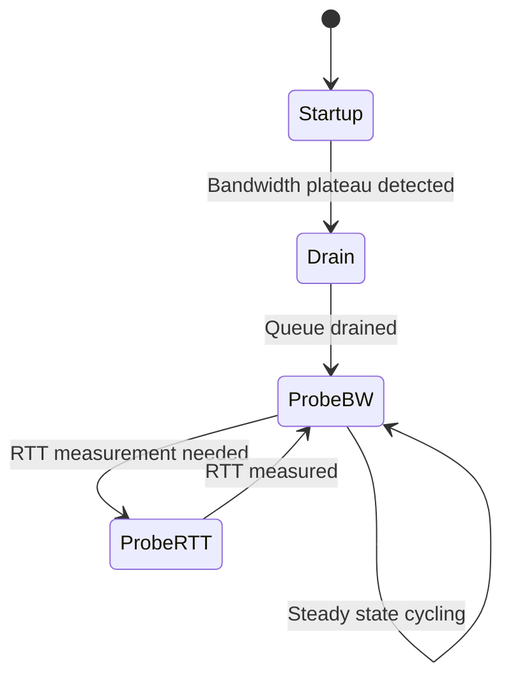
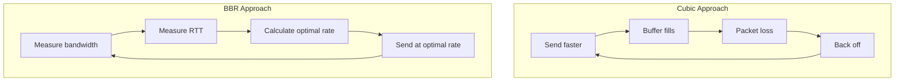
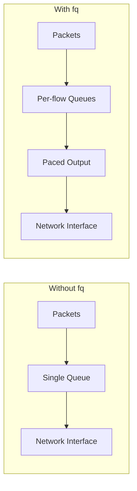

# How to Create TCP BBR Congestion Control

Author: [nawazdhandala](https://github.com/nawazdhandala)

Tags: Networking, TCP, Performance, BBR

Description: A practical guide to enabling TCP BBR congestion control for dramatically improved network throughput and reduced latency.

---

TCP congestion control is one of those things that works silently in the background until it doesn't. For decades, most Linux systems used Cubic as the default algorithm. It worked. It was fine. But "fine" leaves a lot of performance on the table, especially on high-bandwidth, high-latency networks.

Enter BBR (Bottleneck Bandwidth and Round-trip propagation time), developed by Google. BBR takes a fundamentally different approach to congestion control, and the results can be dramatic: better throughput, lower latency, and more consistent performance.

This guide will show you how to enable and tune BBR on your Linux systems.

---

## What is BBR?

BBR is a congestion control algorithm that models the network path to find the optimal sending rate. Unlike traditional loss-based algorithms that react to packet loss, BBR proactively measures:

- **Bottleneck Bandwidth (BtlBw)**: The maximum rate the network can deliver data
- **Round-trip propagation time (RTprop)**: The minimum latency of the path when it's not congested

By tracking these two parameters, BBR calculates the optimal sending rate that maximizes throughput without causing excessive queuing delays.

### The BBR State Machine

BBR operates through four distinct states:



1. **Startup**: Exponentially increases sending rate to quickly discover available bandwidth
2. **Drain**: Reduces rate to drain any queue built up during startup
3. **ProbeBW**: The steady state where BBR cycles through different pacing gains to probe for more bandwidth
4. **ProbeRTT**: Periodically reduces rate to measure the true minimum RTT

---

## BBR vs Cubic: A Comparison

Understanding the difference between BBR and Cubic helps explain why BBR performs better in many scenarios.

### How Cubic Works

Cubic is a loss-based algorithm. It increases the sending rate until packets are dropped, then backs off. This approach has two fundamental problems:

1. **Buffer bloat**: Cubic fills network buffers before detecting congestion, adding latency
2. **Reactive nature**: It only knows the network is congested after packets are lost

### How BBR Works Differently

BBR models the network path and aims to send at exactly the rate the bottleneck can handle:



### Performance Comparison

| Scenario | Cubic | BBR |
|----------|-------|-----|
| High bandwidth, high latency | Poor utilization | Excellent utilization |
| Networks with random packet loss | Severe throughput reduction | Minimal impact |
| Bufferbloat conditions | Adds significant latency | Maintains low latency |
| Competing with other flows | Fair | May be aggressive |

---

## Checking Your Current Configuration

Before making changes, check what your system is currently using:

```bash
# Check the current congestion control algorithm
sysctl net.ipv4.tcp_congestion_control
# Output: net.ipv4.tcp_congestion_control = cubic

# List all available algorithms
sysctl net.ipv4.tcp_available_congestion_control
# Output: net.ipv4.tcp_available_congestion_control = reno cubic

# Check if BBR module is loaded
lsmod | grep tcp_bbr
```

---

## Enabling BBR on Linux

### Requirements

- Linux kernel 4.9 or later (BBR was merged in 4.9)
- For BBRv2, kernel 5.18 or later is recommended

### Step 1: Load the BBR Module

```bash
# Load the TCP BBR module
sudo modprobe tcp_bbr

# Verify it loaded successfully
lsmod | grep tcp_bbr
# Output: tcp_bbr                20480  0
```

### Step 2: Enable BBR Temporarily

Test BBR before making it permanent:

```bash
# Set BBR as the congestion control algorithm
sudo sysctl -w net.ipv4.tcp_congestion_control=bbr

# Verify the change
sysctl net.ipv4.tcp_congestion_control
# Output: net.ipv4.tcp_congestion_control = bbr
```

### Step 3: Make Changes Permanent

Create a sysctl configuration file:

```bash
# Create BBR configuration file
sudo tee /etc/sysctl.d/99-tcp-bbr.conf << 'EOF'
# Enable BBR congestion control
net.core.default_qdisc = fq
net.ipv4.tcp_congestion_control = bbr
EOF

# Apply the configuration
sudo sysctl --system
```

### Step 4: Ensure Module Loads at Boot

```bash
# Add BBR to modules loaded at boot
echo "tcp_bbr" | sudo tee /etc/modules-load.d/tcp-bbr.conf
```

---

## Understanding the Queue Discipline

BBR works best with the `fq` (Fair Queue) packet scheduler. Here's why:



The `fq` scheduler provides per-flow queuing and pacing, which allows BBR to precisely control when packets are sent:

```bash
# Check current qdisc on an interface
tc qdisc show dev eth0

# Set fq as the default qdisc
sudo sysctl -w net.core.default_qdisc=fq

# Apply fq to a specific interface
sudo tc qdisc replace dev eth0 root fq
```

---

## Performance Tuning

### TCP Buffer Sizes

BBR benefits from properly tuned TCP buffers, especially on high-bandwidth networks:

```bash
# View current buffer settings
sysctl net.ipv4.tcp_rmem
sysctl net.ipv4.tcp_wmem
sysctl net.core.rmem_max
sysctl net.core.wmem_max

# Tune for high-bandwidth networks (10Gbps example)
sudo tee -a /etc/sysctl.d/99-tcp-bbr.conf << 'EOF'

# TCP buffer sizes for high-bandwidth networks
# Format: min default max (in bytes)
net.ipv4.tcp_rmem = 4096 87380 67108864
net.ipv4.tcp_wmem = 4096 65536 67108864

# Maximum socket buffer sizes
net.core.rmem_max = 67108864
net.core.wmem_max = 67108864

# Enable TCP window scaling
net.ipv4.tcp_window_scaling = 1

# Increase the maximum number of connections
net.core.somaxconn = 65535
net.ipv4.tcp_max_syn_backlog = 65535
EOF

# Apply changes
sudo sysctl --system
```

### Calculating Optimal Buffer Sizes

The optimal buffer size depends on your bandwidth-delay product (BDP):

```bash
#!/bin/bash
# calculate_bdp.sh
# Calculate the bandwidth-delay product for TCP buffer tuning

# Configuration
BANDWIDTH_MBPS=1000  # Your link bandwidth in Mbps
RTT_MS=50            # Round-trip time in milliseconds

# Calculate BDP
# BDP (bytes) = Bandwidth (bits/sec) * RTT (seconds) / 8
BDP_BYTES=$(echo "scale=0; ($BANDWIDTH_MBPS * 1000000 * $RTT_MS / 1000) / 8" | bc)

echo "Bandwidth: ${BANDWIDTH_MBPS} Mbps"
echo "RTT: ${RTT_MS} ms"
echo "Bandwidth-Delay Product: ${BDP_BYTES} bytes"
echo ""
echo "Recommended tcp_rmem/tcp_wmem max: ${BDP_BYTES}"
echo "Recommended rmem_max/wmem_max: ${BDP_BYTES}"
```

---

## Monitoring BBR Performance

### Real-time Connection Monitoring

```bash
# View BBR stats for all connections
ss -ti | grep bbr

# Sample output shows BBR-specific metrics:
# bbr:(bw:125.0Mbps,mrtt:10.5,pacing_gain:1.25,cwnd_gain:2)

# Monitor a specific connection
watch -n 1 'ss -ti dst 10.0.0.5'
```

### Understanding BBR Metrics

Key metrics reported by `ss`:

- **bw**: Estimated bottleneck bandwidth
- **mrtt**: Minimum RTT observed
- **pacing_gain**: Current pacing multiplier
- **cwnd_gain**: Current congestion window multiplier

### Create a Monitoring Script

```bash
#!/bin/bash
# bbr_monitor.sh
# Monitor BBR performance metrics in real-time

# Color codes for output
GREEN='\033[0;32m'
YELLOW='\033[1;33m'
NC='\033[0m' # No Color

echo "BBR Connection Monitor"
echo "======================"
echo ""

while true; do
    clear
    echo -e "${GREEN}=== BBR Connections ===${NC}"
    echo ""

    # Get all TCP connections using BBR
    ss -ti state established | grep -A1 "bbr" | while read -r line; do
        if [[ $line == *"bbr"* ]]; then
            # Extract BBR metrics
            bw=$(echo "$line" | grep -oP 'bw:\K[0-9.]+[GMK]?bps' || echo "N/A")
            mrtt=$(echo "$line" | grep -oP 'mrtt:\K[0-9.]+' || echo "N/A")

            echo -e "Bandwidth: ${YELLOW}${bw}${NC} | Min RTT: ${YELLOW}${mrtt}ms${NC}"
        fi
    done

    echo ""
    echo -e "${GREEN}=== System Stats ===${NC}"
    echo "Congestion Control: $(sysctl -n net.ipv4.tcp_congestion_control)"
    echo "Queue Discipline: $(sysctl -n net.core.default_qdisc)"
    echo ""
    echo "Press Ctrl+C to exit"

    sleep 2
done
```

---

## Verifying BBR is Working

### Method 1: Check Active Connections

```bash
# List all established connections with their congestion control
ss -ti state established | head -20

# Look for lines containing "bbr" in the output
# Example: cubic wscale:7,7 rto:204 rtt:1.5/0.5 ...
# vs
# bbr wscale:7,7 rto:204 rtt:1.5/0.5 bw:125.0Mbps ...
```

### Method 2: Use iperf3 for Testing

```bash
# On the server
iperf3 -s

# On the client (with BBR enabled)
iperf3 -c server_ip -t 30 -P 4

# Compare results with Cubic
sudo sysctl -w net.ipv4.tcp_congestion_control=cubic
iperf3 -c server_ip -t 30 -P 4
```

### Method 3: tcpdump Analysis

```bash
# Capture TCP traffic for analysis
sudo tcpdump -i eth0 -w bbr_capture.pcap tcp port 5201

# Analyze with tshark or Wireshark
# Look for consistent pacing and minimal retransmissions
```

---

## Troubleshooting Common Issues

### BBR Module Not Available

```bash
# Check kernel version
uname -r

# If kernel is too old, BBR won't be available
# Minimum required: 4.9

# On Ubuntu/Debian, install a newer kernel if needed
sudo apt update
sudo apt install linux-generic-hwe-22.04
```

### BBR Not Taking Effect

```bash
# Verify the module is loaded
lsmod | grep tcp_bbr

# If not loaded, load it manually
sudo modprobe tcp_bbr

# Check for errors in dmesg
dmesg | grep -i bbr
dmesg | grep -i tcp
```

### Performance Not Improved

Common reasons and fixes:

1. **Wrong qdisc**: Ensure `fq` is set
   ```bash
   sudo sysctl -w net.core.default_qdisc=fq
   ```

2. **Buffer limits too low**: Increase TCP buffer sizes

3. **Network bottleneck elsewhere**: BBR optimizes TCP, not the physical network

---

## BBR in Container Environments

### Docker

BBR settings on the host apply to containers:

```bash
# Verify BBR is available inside a container
docker run --rm alpine sh -c "cat /proc/sys/net/ipv4/tcp_congestion_control"
```

### Kubernetes

For Kubernetes nodes, apply BBR settings via a DaemonSet or during node provisioning:

```yaml
# bbr-tuning-daemonset.yaml
apiVersion: apps/v1
kind: DaemonSet
metadata:
  name: bbr-tuning
  namespace: kube-system
spec:
  selector:
    matchLabels:
      name: bbr-tuning
  template:
    metadata:
      labels:
        name: bbr-tuning
    spec:
      hostNetwork: true
      hostPID: true
      containers:
      - name: bbr-tuning
        image: alpine
        securityContext:
          privileged: true
        command:
        - /bin/sh
        - -c
        - |
          sysctl -w net.core.default_qdisc=fq
          sysctl -w net.ipv4.tcp_congestion_control=bbr
          echo "BBR enabled"
          sleep infinity
```

---

## When to Use BBR

BBR excels in these scenarios:

- **Long-distance connections**: Transcontinental or intercontinental links
- **High-bandwidth networks**: 1Gbps and above
- **Networks with random packet loss**: Wireless, satellite, or congested links
- **Latency-sensitive applications**: Video streaming, real-time communication

BBR may not be ideal when:

- **Fairness with Cubic flows is critical**: BBR can be more aggressive
- **Very low-latency LANs**: The overhead may not be worth it
- **Strict regulatory requirements**: Some networks mandate specific algorithms

---

## Conclusion

BBR represents a significant advancement in TCP congestion control. By modeling the network path rather than reacting to loss, it achieves better throughput and lower latency than traditional algorithms.

Enabling BBR is straightforward:

1. Load the `tcp_bbr` module
2. Set `net.ipv4.tcp_congestion_control=bbr`
3. Use the `fq` queue discipline
4. Tune buffer sizes for your network

The performance gains can be substantial, especially on high-bandwidth, high-latency networks. Test it in your environment, measure the results, and enjoy faster, more consistent network performance.

---

## Further Reading

- **Google's BBR Paper**: "BBR: Congestion-Based Congestion Control" - The original research paper
- **Linux Kernel Documentation**: Documentation/networking/tcp-bbr.txt
- **IETF Draft**: draft-cardwell-iccrg-bbr-congestion-control - Standardization efforts
- **BBRv2**: Improvements addressing fairness concerns with the original BBR
