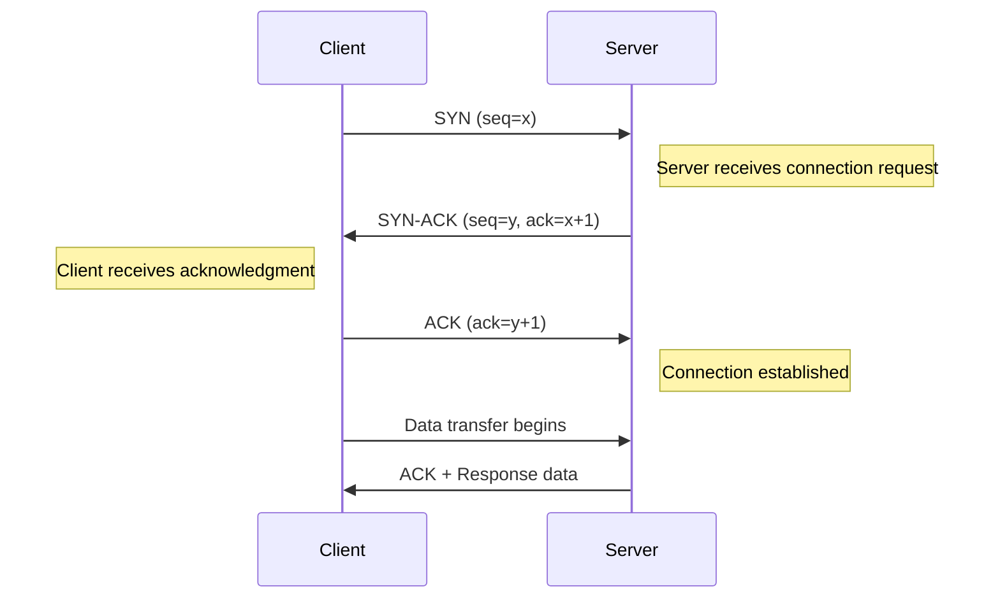
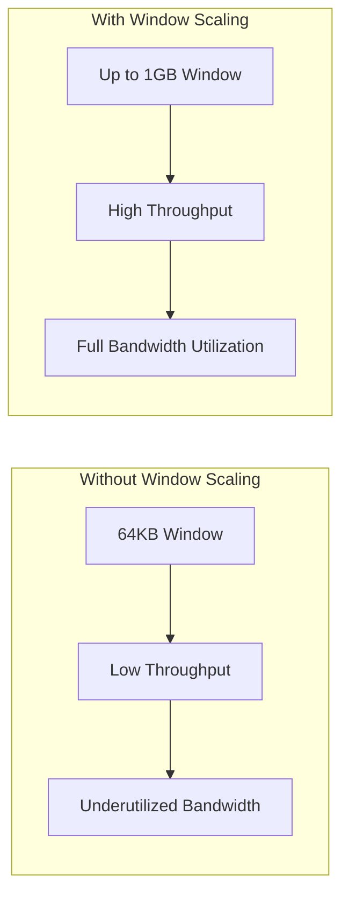
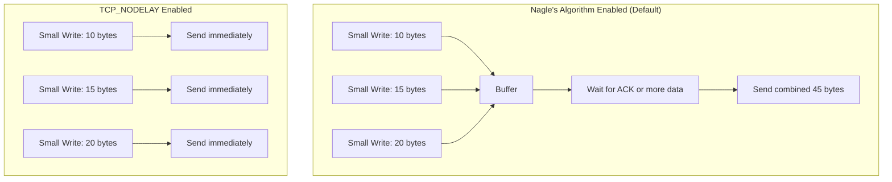
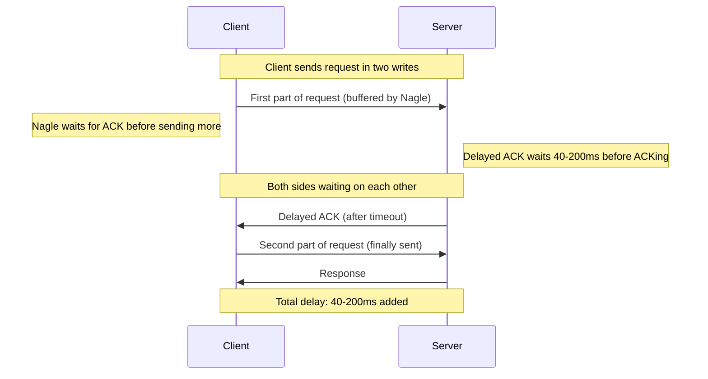
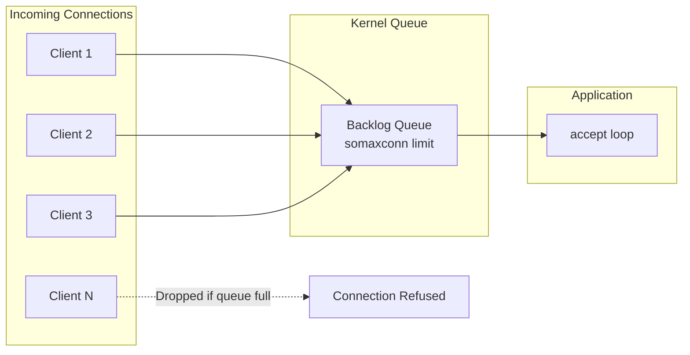
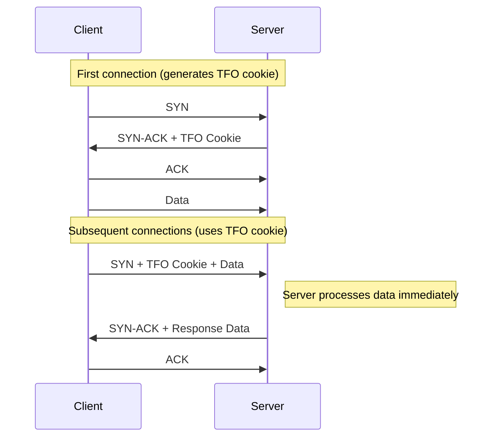

# How to Build TCP Connection Optimization Strategies

Author: [nawazdhandala](https://github.com/nawazdhandala)

Tags: Networking, TCP, Performance, Optimization

Description: A practical guide to tuning TCP parameters, socket options, and connection settings for improved network performance in production systems.

---

TCP is the backbone of most internet communication. Yet many developers treat it as a black box, accepting default settings that may be far from optimal for their specific workloads. Understanding how to tune TCP can dramatically improve throughput, reduce latency, and make your applications more resilient under load.

This guide walks through the key TCP optimization strategies that actually matter in production.

---

## Understanding the TCP Handshake

Before optimizing, you need to understand what you are optimizing. Every TCP connection starts with a three-way handshake:



This handshake adds latency to every new connection. For short-lived connections, this overhead can dominate total request time. That is why connection reuse and keepalive settings matter so much.

---

## TCP Buffer Tuning

TCP uses buffers to manage data flow. Too small, and you bottleneck throughput. Too large, and you waste memory and increase latency through bufferbloat.

### Linux Kernel Buffer Settings

```bash
# View current buffer settings
sysctl net.core.rmem_max
sysctl net.core.wmem_max
sysctl net.ipv4.tcp_rmem
sysctl net.ipv4.tcp_wmem

# Set larger buffer sizes for high-bandwidth connections
# Format: min default max (in bytes)

# Receive buffer: 4KB min, 128KB default, 16MB max
sysctl -w net.ipv4.tcp_rmem="4096 131072 16777216"

# Send buffer: 4KB min, 128KB default, 16MB max
sysctl -w net.ipv4.tcp_wmem="4096 131072 16777216"

# Maximum receive buffer size allowed
sysctl -w net.core.rmem_max=16777216

# Maximum send buffer size allowed
sysctl -w net.core.wmem_max=16777216
```

### Making Changes Persistent

Add these settings to `/etc/sysctl.conf`:

```bash
# TCP buffer tuning for high-performance networking
net.core.rmem_max = 16777216
net.core.wmem_max = 16777216
net.ipv4.tcp_rmem = 4096 131072 16777216
net.ipv4.tcp_wmem = 4096 131072 16777216

# Enable TCP window scaling for high-latency links
net.ipv4.tcp_window_scaling = 1

# Increase the maximum backlog for incoming connections
net.core.somaxconn = 65535
net.ipv4.tcp_max_syn_backlog = 65535
```

Apply changes without reboot:

```bash
sysctl -p
```

---

## TCP Window Scaling

The TCP window determines how much data can be in flight before requiring acknowledgment. The default 64KB window is insufficient for high-bandwidth, high-latency links.



### Calculate Optimal Window Size

The bandwidth-delay product (BDP) determines optimal window size:

```
BDP = Bandwidth (bytes/sec) x Round-Trip Time (seconds)
```

For a 1 Gbps link with 50ms RTT:

```
BDP = (1,000,000,000 / 8) x 0.050 = 6,250,000 bytes (~6MB)
```

Your buffer should be at least this large to fully utilize the link.

---

## Socket Options Configuration

### Python Example with Socket Options

```python
import socket

def create_optimized_socket():
    """
    Create a TCP socket with performance-optimized settings.
    """
    sock = socket.socket(socket.AF_INET, socket.SOCK_STREAM)

    # SO_REUSEADDR: Allow immediate reuse of the address after socket closes.
    # Prevents "Address already in use" errors during restarts.
    sock.setsockopt(socket.SOL_SOCKET, socket.SO_REUSEADDR, 1)

    # SO_REUSEPORT: Allow multiple sockets to bind to the same port.
    # Useful for load balancing across multiple processes.
    sock.setsockopt(socket.SOL_SOCKET, socket.SO_REUSEPORT, 1)

    # TCP_NODELAY: Disable Nagle's algorithm for low-latency applications.
    # Sends data immediately without waiting to coalesce small packets.
    sock.setsockopt(socket.IPPROTO_TCP, socket.TCP_NODELAY, 1)

    # SO_KEEPALIVE: Enable TCP keepalive to detect dead connections.
    sock.setsockopt(socket.SOL_SOCKET, socket.SO_KEEPALIVE, 1)

    # Set socket buffer sizes (platform-specific)
    # Increase receive buffer to 256KB
    sock.setsockopt(socket.SOL_SOCKET, socket.SO_RCVBUF, 262144)

    # Increase send buffer to 256KB
    sock.setsockopt(socket.SOL_SOCKET, socket.SO_SNDBUF, 262144)

    return sock


def create_server_socket(host: str, port: int, backlog: int = 1024):
    """
    Create an optimized server socket with a large connection backlog.

    Args:
        host: The host address to bind to
        port: The port number to listen on
        backlog: Maximum number of queued connections (default 1024)
    """
    sock = create_optimized_socket()

    # Bind and listen with a large backlog for high-traffic servers
    sock.bind((host, port))
    sock.listen(backlog)

    return sock
```

### Node.js Example with Socket Options

```javascript
const net = require('net');

/**
 * Create an optimized TCP server with tuned socket options.
 */
function createOptimizedServer(port, host = '0.0.0.0') {
    const server = net.createServer((socket) => {
        // Disable Nagle's algorithm for lower latency
        // Data is sent immediately without waiting for more data to buffer
        socket.setNoDelay(true);

        // Enable TCP keepalive with 60-second initial delay
        // Detects and closes dead connections automatically
        socket.setKeepAlive(true, 60000);

        // Set socket timeout to 30 seconds
        // Closes idle connections that receive no data
        socket.setTimeout(30000, () => {
            console.log('Socket timeout, closing connection');
            socket.end();
        });

        socket.on('data', (data) => {
            // Handle incoming data
            processData(socket, data);
        });

        socket.on('error', (err) => {
            console.error('Socket error:', err.message);
        });
    });

    // Set maximum connections the server will accept
    server.maxConnections = 10000;

    server.listen(port, host, () => {
        console.log(`Server listening on ${host}:${port}`);
    });

    return server;
}

function processData(socket, data) {
    // Your data processing logic here
    socket.write('ACK');
}
```

### Go Example with Socket Options

```go
package main

import (
    "net"
    "syscall"
    "time"
)

// createOptimizedListener creates a TCP listener with tuned socket options.
func createOptimizedListener(address string) (net.Listener, error) {
    // Create a custom listener configuration
    lc := net.ListenConfig{
        Control: func(network, address string, c syscall.RawConn) error {
            return c.Control(func(fd uintptr) {
                // SO_REUSEADDR: Allow address reuse for quick restarts
                syscall.SetsockoptInt(int(fd), syscall.SOL_SOCKET,
                    syscall.SO_REUSEADDR, 1)

                // SO_REUSEPORT: Allow multiple listeners on the same port
                syscall.SetsockoptInt(int(fd), syscall.SOL_SOCKET,
                    syscall.SO_REUSEPORT, 1)

                // Increase receive buffer to 256KB
                syscall.SetsockoptInt(int(fd), syscall.SOL_SOCKET,
                    syscall.SO_RCVBUF, 262144)

                // Increase send buffer to 256KB
                syscall.SetsockoptInt(int(fd), syscall.SOL_SOCKET,
                    syscall.SO_SNDBUF, 262144)
            })
        },
        // Enable TCP keepalive with 60-second interval
        KeepAlive: 60 * time.Second,
    }

    return lc.Listen(nil, "tcp", address)
}

// configureConnection applies optimizations to an accepted connection.
func configureConnection(conn net.Conn) {
    if tcpConn, ok := conn.(*net.TCPConn); ok {
        // Disable Nagle's algorithm for lower latency
        tcpConn.SetNoDelay(true)

        // Enable keepalive to detect dead peers
        tcpConn.SetKeepAlive(true)
        tcpConn.SetKeepAlivePeriod(60 * time.Second)

        // Set read and write deadlines to prevent hung connections
        tcpConn.SetDeadline(time.Now().Add(30 * time.Second))
    }
}
```

---

## Nagle's Algorithm and TCP_NODELAY

Nagle's algorithm batches small packets together to improve network efficiency. It waits until either:
- Enough data accumulates to fill a packet
- An acknowledgment arrives for previously sent data



### When to Disable Nagle (Enable TCP_NODELAY)

Enable TCP_NODELAY for:
- Real-time applications (games, trading systems)
- Interactive protocols (SSH, telnet)
- Request-response patterns where you send small messages
- Any latency-sensitive application

Keep Nagle enabled for:
- Bulk data transfers
- Streaming large files
- Applications that already batch writes efficiently

### The Nagle + Delayed ACK Problem

A particularly nasty interaction occurs when Nagle meets TCP Delayed ACK:



The solution: either disable Nagle (TCP_NODELAY) or ensure your application writes complete messages in a single system call.

---

## Keepalive and Timeout Settings

TCP keepalive detects dead connections by sending periodic probes. Without it, a connection to a crashed peer might stay open indefinitely, consuming resources.

### Linux Keepalive Parameters

```bash
# Time before sending first keepalive probe (default: 7200 seconds = 2 hours)
sysctl -w net.ipv4.tcp_keepalive_time=600

# Interval between keepalive probes (default: 75 seconds)
sysctl -w net.ipv4.tcp_keepalive_intvl=60

# Number of failed probes before closing connection (default: 9)
sysctl -w net.ipv4.tcp_keepalive_probes=5
```

### Application-Level Keepalive

```python
import socket

def configure_keepalive(sock, idle_time=60, interval=10, max_fails=5):
    """
    Configure TCP keepalive on a socket.

    Args:
        sock: The socket to configure
        idle_time: Seconds of idle time before sending first probe
        interval: Seconds between subsequent probes
        max_fails: Number of failed probes before closing connection
    """
    # Enable keepalive
    sock.setsockopt(socket.SOL_SOCKET, socket.SO_KEEPALIVE, 1)

    # Linux-specific keepalive options
    # TCP_KEEPIDLE: Time before first probe
    sock.setsockopt(socket.IPPROTO_TCP, socket.TCP_KEEPIDLE, idle_time)

    # TCP_KEEPINTVL: Time between probes
    sock.setsockopt(socket.IPPROTO_TCP, socket.TCP_KEEPINTVL, interval)

    # TCP_KEEPCNT: Number of failed probes before giving up
    sock.setsockopt(socket.IPPROTO_TCP, socket.TCP_KEEPCNT, max_fails)

    # With these settings:
    # - First probe sent after 60 seconds of idle
    # - Subsequent probes every 10 seconds
    # - Connection closed after 5 failed probes (60 + 5*10 = 110 seconds max)
```

### Connection Timeout Settings

```python
import socket

def connect_with_timeout(host: str, port: int, timeout: float = 5.0):
    """
    Establish a connection with explicit timeout handling.

    Args:
        host: Target hostname or IP
        port: Target port
        timeout: Connection timeout in seconds
    """
    sock = socket.socket(socket.AF_INET, socket.SOCK_STREAM)

    # Set connection timeout
    # This limits how long we wait for the TCP handshake to complete
    sock.settimeout(timeout)

    try:
        sock.connect((host, port))

        # After connection, you might want different timeouts for operations
        # Set to None for blocking, or a value for operation timeout
        sock.settimeout(30.0)  # 30 second timeout for subsequent operations

        return sock
    except socket.timeout:
        sock.close()
        raise ConnectionError(f"Connection to {host}:{port} timed out after {timeout}s")
    except socket.error as e:
        sock.close()
        raise ConnectionError(f"Connection to {host}:{port} failed: {e}")
```

---

## Connection Backlog Tuning

The listen backlog determines how many pending connections the kernel will queue while your application calls accept(). Under high load, a small backlog causes connection drops.



### System-Level Backlog Limits

```bash
# Maximum backlog size (kernel limit)
sysctl -w net.core.somaxconn=65535

# Maximum SYN backlog (connections in SYN_RECV state)
sysctl -w net.ipv4.tcp_max_syn_backlog=65535
```

### Application Backlog Setting

```python
# Python
server_socket.listen(4096)  # Request backlog of 4096
# Actual backlog is min(requested, somaxconn)
```

```javascript
// Node.js
server.listen(port, host, 4096);  // backlog parameter
```

```go
// Go - uses system default, configure via sysctl
listener, err := net.Listen("tcp", ":8080")
```

---

## TCP Fast Open

TCP Fast Open (TFO) reduces connection latency by allowing data in the SYN packet, eliminating one round trip for repeat connections.



### Enable TCP Fast Open

```bash
# Enable TFO for both client and server
# 1 = client only, 2 = server only, 3 = both
sysctl -w net.ipv4.tcp_fastopen=3
```

### Application Support for TFO

```python
import socket

# Server-side TFO
server = socket.socket(socket.AF_INET, socket.SOCK_STREAM)
server.setsockopt(socket.SOL_TCP, socket.TCP_FASTOPEN, 10)  # Queue length of 10
server.bind(('0.0.0.0', 8080))
server.listen(100)

# Client-side TFO (Linux 4.11+)
client = socket.socket(socket.AF_INET, socket.SOCK_STREAM)
# Use sendto with MSG_FASTOPEN flag to send data with SYN
client.sendto(b'GET / HTTP/1.1\r\n\r\n',
              socket.MSG_FASTOPEN,
              ('server.example.com', 80))
```

---

## Congestion Control Algorithms

Linux supports multiple TCP congestion control algorithms. The right choice depends on your network characteristics.

```bash
# View available algorithms
sysctl net.ipv4.tcp_available_congestion_control

# View current algorithm
sysctl net.ipv4.tcp_congestion_control

# Set congestion control algorithm
sysctl -w net.ipv4.tcp_congestion_control=bbr
```

### Common Algorithms

| Algorithm | Best For | Characteristics |
|-----------|----------|-----------------|
| **cubic** | General purpose (default) | Good for most networks |
| **bbr** | High-bandwidth, lossy networks | Measures actual bandwidth, handles packet loss well |
| **reno** | Legacy compatibility | Simple, well-understood |
| **vegas** | Low-latency networks | Avoids filling buffers |

BBR (Bottleneck Bandwidth and RTT) is often the best choice for modern networks:

```bash
# Enable BBR
sysctl -w net.ipv4.tcp_congestion_control=bbr
sysctl -w net.core.default_qdisc=fq
```

---

## Putting It All Together

Here is a complete example of a performance-tuned TCP server:

```python
#!/usr/bin/env python3
"""
High-performance TCP server with optimized socket settings.
"""

import socket
import select
import sys

class OptimizedTCPServer:
    def __init__(self, host: str, port: int):
        self.host = host
        self.port = port
        self.socket = None
        self.clients = []

    def create_socket(self):
        """Create and configure the server socket with optimal settings."""
        self.socket = socket.socket(socket.AF_INET, socket.SOCK_STREAM)

        # Allow address reuse for quick server restarts
        self.socket.setsockopt(socket.SOL_SOCKET, socket.SO_REUSEADDR, 1)

        # Allow multiple processes to bind to the same port (load balancing)
        try:
            self.socket.setsockopt(socket.SOL_SOCKET, socket.SO_REUSEPORT, 1)
        except AttributeError:
            pass  # SO_REUSEPORT not available on all platforms

        # Increase socket buffers for higher throughput
        self.socket.setsockopt(socket.SOL_SOCKET, socket.SO_RCVBUF, 262144)
        self.socket.setsockopt(socket.SOL_SOCKET, socket.SO_SNDBUF, 262144)

        # Enable TCP Fast Open if available
        try:
            self.socket.setsockopt(socket.SOL_TCP, socket.TCP_FASTOPEN, 10)
        except (AttributeError, OSError):
            pass  # TFO not available

        # Bind and listen with large backlog
        self.socket.bind((self.host, self.port))
        self.socket.listen(4096)

        # Set non-blocking for use with select/poll/epoll
        self.socket.setblocking(False)

        print(f"Server listening on {self.host}:{self.port}")

    def configure_client(self, client_socket):
        """Apply optimal settings to a client connection."""
        # Disable Nagle for low latency
        client_socket.setsockopt(socket.IPPROTO_TCP, socket.TCP_NODELAY, 1)

        # Enable keepalive to detect dead connections
        client_socket.setsockopt(socket.SOL_SOCKET, socket.SO_KEEPALIVE, 1)

        # Configure keepalive timing (Linux-specific)
        try:
            # Send first probe after 60 seconds idle
            client_socket.setsockopt(socket.IPPROTO_TCP, socket.TCP_KEEPIDLE, 60)
            # Send probes every 10 seconds
            client_socket.setsockopt(socket.IPPROTO_TCP, socket.TCP_KEEPINTVL, 10)
            # Close after 5 failed probes
            client_socket.setsockopt(socket.IPPROTO_TCP, socket.TCP_KEEPCNT, 5)
        except (AttributeError, OSError):
            pass  # Platform-specific options

        client_socket.setblocking(False)

    def run(self):
        """Main server loop using select for I/O multiplexing."""
        self.create_socket()
        inputs = [self.socket]

        while True:
            readable, _, exceptional = select.select(
                inputs, [], inputs, 1.0
            )

            for sock in readable:
                if sock is self.socket:
                    # Accept new connection
                    client, address = self.socket.accept()
                    self.configure_client(client)
                    inputs.append(client)
                    self.clients.append(client)
                    print(f"New connection from {address}")
                else:
                    # Handle client data
                    try:
                        data = sock.recv(4096)
                        if data:
                            # Echo back for this example
                            sock.send(data)
                        else:
                            # Client disconnected
                            self.remove_client(sock, inputs)
                    except socket.error:
                        self.remove_client(sock, inputs)

            for sock in exceptional:
                self.remove_client(sock, inputs)

    def remove_client(self, sock, inputs):
        """Clean up a disconnected client."""
        if sock in inputs:
            inputs.remove(sock)
        if sock in self.clients:
            self.clients.remove(sock)
        sock.close()


if __name__ == '__main__':
    server = OptimizedTCPServer('0.0.0.0', 8080)
    try:
        server.run()
    except KeyboardInterrupt:
        print("\nShutting down...")
        sys.exit(0)
```

---

## Quick Reference: Essential Settings

| Setting | Purpose | Recommended Value |
|---------|---------|-------------------|
| `tcp_rmem` / `tcp_wmem` | Buffer sizes | 4096 131072 16777216 |
| `somaxconn` | Listen backlog | 65535 |
| `tcp_max_syn_backlog` | SYN queue size | 65535 |
| `tcp_keepalive_time` | Idle before first probe | 600 |
| `tcp_keepalive_intvl` | Probe interval | 60 |
| `tcp_keepalive_probes` | Max failed probes | 5 |
| `tcp_fastopen` | Enable TFO | 3 |
| `tcp_congestion_control` | Algorithm | bbr |
| `TCP_NODELAY` | Disable Nagle | 1 (for latency-sensitive) |

---

## Conclusion

TCP optimization is not about applying every setting blindly. It is about understanding your workload and tuning accordingly:

- **High throughput?** Focus on buffer sizes and window scaling.
- **Low latency?** Enable TCP_NODELAY and consider TCP Fast Open.
- **Many connections?** Increase backlog limits and tune keepalive.
- **Unreliable network?** Consider BBR congestion control.

Start with measurements. Use tools like `ss`, `netstat`, and `tcpdump` to understand your current TCP behavior. Make one change at a time and measure the impact. The defaults are sensible for general use, but your specific workload might benefit significantly from targeted tuning.

Remember: premature optimization is the root of all evil, but informed optimization is the path to reliable, high-performance systems.
