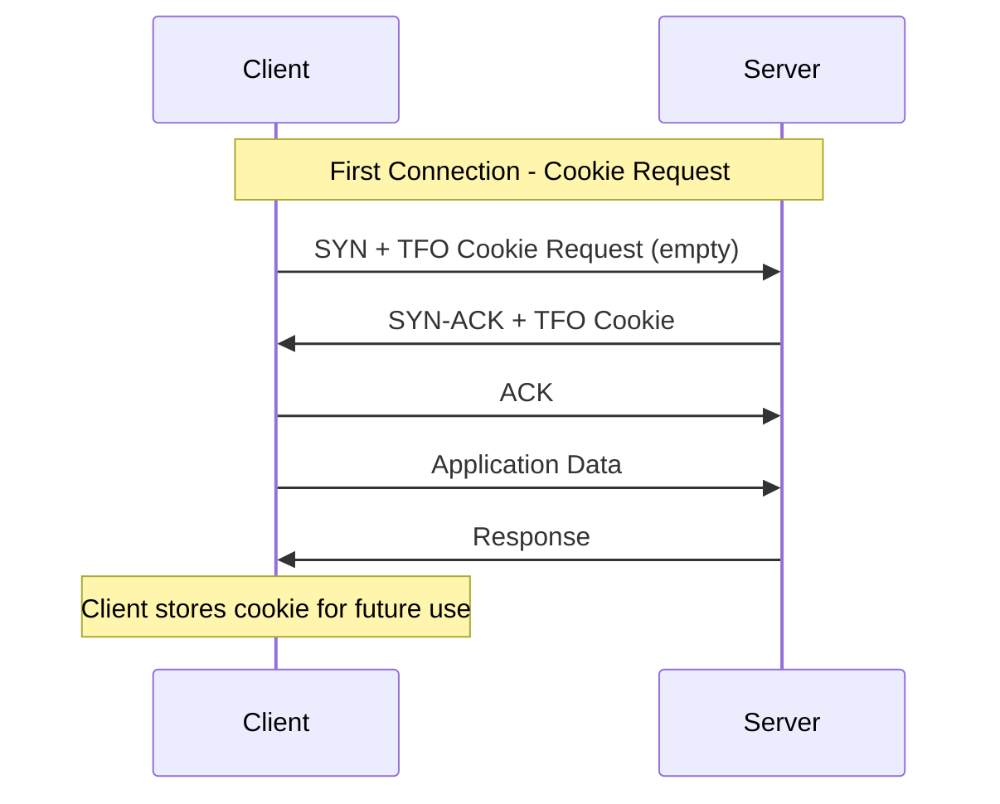
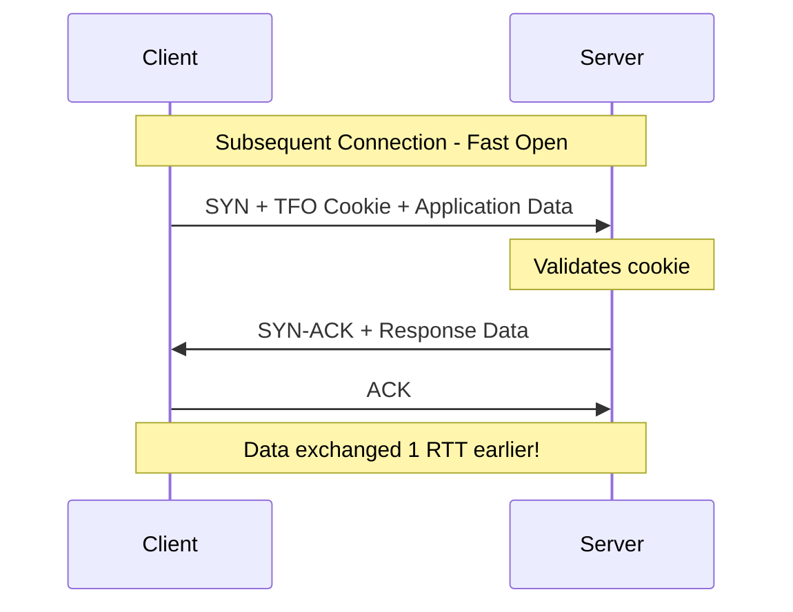

# How to Implement TCP Fast Open

Author: [nawazdhandala](https://github.com/nawazdhandala)

Tags: Networking, TCP, Performance, TFO

Description: Learn how TCP Fast Open reduces connection latency by allowing data transmission during the initial handshake.

---

## Introduction

TCP Fast Open (TFO) is a TCP extension defined in RFC 7413 that reduces network latency by allowing data to be sent during the initial TCP handshake. In traditional TCP, a client must complete a three-way handshake before any application data can be transmitted. TFO eliminates this round-trip delay for repeat connections, making it particularly valuable for latency-sensitive applications.

## The Problem with Traditional TCP Handshake

In a standard TCP connection, the client and server must complete a three-way handshake before exchanging application data:

1. Client sends SYN
2. Server responds with SYN-ACK
3. Client sends ACK (and can now send data)

This process introduces a full round-trip time (RTT) of latency before any useful data transfer begins. For short-lived connections (like HTTP requests), this overhead can significantly impact performance.

## How TCP Fast Open Works

TCP Fast Open allows the client to send data in the initial SYN packet on subsequent connections. The mechanism uses a cryptographic cookie to ensure security and prevent certain types of attacks.

### First Connection: Cookie Request

During the first connection, the client requests a TFO cookie from the server:



### Subsequent Connections: Fast Open

On subsequent connections, the client includes the cached cookie and application data in the initial SYN packet:



## Cookie Generation and Validation

The TFO cookie is a critical security component that prevents IP spoofing attacks and SYN flood amplification.

### Server-Side Cookie Generation

The server generates cookies using a cryptographic function that incorporates:

- Client IP address
- A server-side secret key (rotated periodically)
- Optional timestamp for expiration

```c
// Simplified cookie generation pseudocode
// The actual implementation uses AES or SipHash

struct tfo_cookie {
    uint8_t data[8];  // Typical cookie size: 4-16 bytes
};

struct tfo_cookie generate_cookie(
    struct in_addr client_ip,
    uint8_t *server_secret
) {
    struct tfo_cookie cookie;

    // Combine client IP with server secret
    // Use a cryptographic MAC function
    uint8_t input[20];
    memcpy(input, &client_ip, 4);
    memcpy(input + 4, server_secret, 16);

    // Generate cookie using HMAC-SHA256 (truncated)
    // or AES-128 encryption
    hmac_sha256(input, 20, cookie.data, 8);

    return cookie;
}
```

### Cookie Validation Process

When a client presents a cookie, the server validates it:

```c
// Cookie validation on the server
bool validate_cookie(
    struct in_addr client_ip,
    struct tfo_cookie *received_cookie,
    uint8_t *server_secret
) {
    // Regenerate the expected cookie
    struct tfo_cookie expected = generate_cookie(client_ip, server_secret);

    // Constant-time comparison to prevent timing attacks
    return secure_memcmp(
        received_cookie->data,
        expected.data,
        sizeof(expected.data)
    ) == 0;
}
```

## Server Configuration

### Linux Kernel Configuration

Enable TFO on Linux systems by adjusting kernel parameters:

```bash
# Check current TFO setting
# Values: 0=disabled, 1=client only, 2=server only, 3=both
cat /proc/sys/net/ipv4/tcp_fastopen

# Enable TFO for both client and server
sudo sysctl -w net.ipv4.tcp_fastopen=3

# Make the setting persistent across reboots
echo "net.ipv4.tcp_fastopen=3" | sudo tee -a /etc/sysctl.conf

# Apply the configuration
sudo sysctl -p
```

### Nginx Configuration

Configure Nginx to use TCP Fast Open:

```nginx
# In nginx.conf or site configuration
server {
    # Enable TFO with a queue limit of 256 pending connections
    listen 80 fastopen=256;
    listen 443 ssl fastopen=256;

    server_name example.com;

    # Other configuration...
}
```

### Apache Configuration

Enable TFO in Apache HTTP Server:

```apache
# In httpd.conf or virtual host configuration
# Requires Apache 2.4.24 or later

# Load the required module
LoadModule mpm_event_module modules/mod_mpm_event.so

# Enable TCP Fast Open
# The value specifies the queue length
AcceptFilter http data
AcceptFilter https data

# For specific virtual hosts
<VirtualHost *:443>
    ServerName example.com
    # Enable TFO with queue size
    Listen 443 https fastopen=256
</VirtualHost>
```

## Client Configuration

### Linux Client Settings

```bash
# Enable TFO on the client side
sudo sysctl -w net.ipv4.tcp_fastopen=1

# For both client and server functionality
sudo sysctl -w net.ipv4.tcp_fastopen=3
```

### Python Client Example

```python
import socket

def create_tfo_connection(host, port, initial_data):
    """
    Create a TCP connection using TCP Fast Open.

    Args:
        host: Target hostname or IP address
        port: Target port number
        initial_data: Data to send in the initial SYN packet

    Returns:
        Connected socket object
    """
    # Create a TCP socket
    sock = socket.socket(socket.AF_INET, socket.SOCK_STREAM)

    # Resolve hostname to IP address
    server_address = (socket.gethostbyname(host), port)

    # MSG_FASTOPEN flag enables TCP Fast Open
    # This combines connect() and send() into one syscall
    # The kernel will cache the TFO cookie automatically
    try:
        sock.sendto(
            initial_data.encode(),
            socket.MSG_FASTOPEN,
            server_address
        )
        print(f"Sent {len(initial_data)} bytes with TFO")
    except OSError as e:
        # Fall back to regular connection if TFO fails
        print(f"TFO not available: {e}, falling back to regular connect")
        sock.connect(server_address)
        sock.send(initial_data.encode())

    return sock

# Example usage
if __name__ == "__main__":
    # HTTP GET request to send with TFO
    http_request = "GET / HTTP/1.1\r\nHost: example.com\r\n\r\n"

    sock = create_tfo_connection("example.com", 80, http_request)

    # Receive response
    response = sock.recv(4096)
    print(response.decode())

    sock.close()
```

### C Client Example

```c
#include <stdio.h>
#include <string.h>
#include <sys/socket.h>
#include <netinet/in.h>
#include <netinet/tcp.h>
#include <arpa/inet.h>
#include <unistd.h>

#ifndef MSG_FASTOPEN
#define MSG_FASTOPEN 0x20000000
#endif

int main() {
    int sockfd;
    struct sockaddr_in server_addr;
    char *request = "GET / HTTP/1.1\r\nHost: example.com\r\n\r\n";
    char response[4096];

    // Create socket
    sockfd = socket(AF_INET, SOCK_STREAM, 0);
    if (sockfd < 0) {
        perror("Socket creation failed");
        return 1;
    }

    // Set up server address
    memset(&server_addr, 0, sizeof(server_addr));
    server_addr.sin_family = AF_INET;
    server_addr.sin_port = htons(80);
    inet_pton(AF_INET, "93.184.216.34", &server_addr.sin_addr);

    // Send data with TCP Fast Open
    // This combines connect() and send() operations
    // The kernel handles cookie caching automatically
    ssize_t sent = sendto(
        sockfd,
        request,
        strlen(request),
        MSG_FASTOPEN,
        (struct sockaddr *)&server_addr,
        sizeof(server_addr)
    );

    if (sent < 0) {
        perror("TFO sendto failed");
        // Fall back to traditional connect + send
        if (connect(sockfd, (struct sockaddr *)&server_addr,
                    sizeof(server_addr)) < 0) {
            perror("Connect failed");
            close(sockfd);
            return 1;
        }
        sent = send(sockfd, request, strlen(request), 0);
    }

    printf("Sent %zd bytes\n", sent);

    // Receive response
    ssize_t received = recv(sockfd, response, sizeof(response) - 1, 0);
    if (received > 0) {
        response[received] = '\0';
        printf("Received %zd bytes:\n%s\n", received, response);
    }

    close(sockfd);
    return 0;
}
```

### Go Client Example

```go
package main

import (
    "fmt"
    "net"
    "syscall"
)

// DialTFO establishes a TCP connection using TCP Fast Open
func DialTFO(network, address string, data []byte) (net.Conn, error) {
    // Resolve the address
    tcpAddr, err := net.ResolveTCPAddr(network, address)
    if err != nil {
        return nil, err
    }

    // Create a raw socket with TFO support
    fd, err := syscall.Socket(
        syscall.AF_INET,
        syscall.SOCK_STREAM,
        syscall.IPPROTO_TCP,
    )
    if err != nil {
        return nil, err
    }

    // Enable TCP Fast Open on the socket
    // TCP_FASTOPEN_CONNECT allows using connect() with TFO
    err = syscall.SetsockoptInt(
        fd,
        syscall.IPPROTO_TCP,
        23, // TCP_FASTOPEN_CONNECT
        1,
    )
    if err != nil {
        syscall.Close(fd)
        return nil, fmt.Errorf("failed to enable TFO: %v", err)
    }

    // Build sockaddr structure
    sa := &syscall.SockaddrInet4{Port: tcpAddr.Port}
    copy(sa.Addr[:], tcpAddr.IP.To4())

    // Connect (with TFO enabled, data can be sent)
    err = syscall.Connect(fd, sa)
    if err != nil {
        syscall.Close(fd)
        return nil, err
    }

    // Send initial data if provided
    if len(data) > 0 {
        _, err = syscall.Write(fd, data)
        if err != nil {
            syscall.Close(fd)
            return nil, err
        }
    }

    // Wrap the file descriptor in a net.Conn
    file := os.NewFile(uintptr(fd), "tfo")
    conn, err := net.FileConn(file)
    file.Close()

    return conn, err
}

func main() {
    request := []byte("GET / HTTP/1.1\r\nHost: example.com\r\n\r\n")

    conn, err := DialTFO("tcp", "example.com:80", request)
    if err != nil {
        fmt.Printf("TFO connection failed: %v\n", err)
        return
    }
    defer conn.Close()

    // Read response
    buf := make([]byte, 4096)
    n, _ := conn.Read(buf)
    fmt.Printf("Response:\n%s\n", buf[:n])
}
```

## Security Considerations

While TCP Fast Open provides significant performance benefits, it introduces several security considerations that must be addressed.

### 1. Replay Attacks

TFO data in the SYN packet can be replayed by attackers. Unlike data sent after the handshake, TFO data is not protected by TCP sequence numbers during the connection establishment.

**Mitigation strategies:**

```python
# Application-level idempotency check
def handle_tfo_request(request, client_ip):
    """
    Handle requests that may arrive via TFO.
    Ensure idempotency for safe replay handling.
    """
    # Generate a unique request identifier
    request_id = generate_request_hash(request, client_ip)

    # Check if we have processed this request recently
    if is_duplicate_request(request_id):
        # Return cached response for duplicate requests
        return get_cached_response(request_id)

    # Process the request normally
    response = process_request(request)

    # Cache the response for potential replays
    cache_response(request_id, response)

    return response
```

### 2. Resource Exhaustion

Servers accepting TFO connections may be vulnerable to resource exhaustion attacks if they process SYN data before completing the handshake.

**Mitigation strategies:**

```bash
# Limit TFO queue size to prevent resource exhaustion
# This limits pending TFO connections
sysctl -w net.ipv4.tcp_fastopen=0x203

# The hex value breaks down as:
# 0x001 = Enable client TFO
# 0x002 = Enable server TFO
# 0x200 = Enable TFO with a cookie even if no SYN data
```

```nginx
# Nginx: Limit TFO queue to reasonable size
listen 443 ssl fastopen=128;

# Also implement rate limiting
limit_req_zone $binary_remote_addr zone=tfo:10m rate=10r/s;

server {
    location / {
        limit_req zone=tfo burst=20 nodelay;
    }
}
```

### 3. Cookie Security

The TFO cookie must be cryptographically secure to prevent forgery:

```c
// Recommended: Rotate server secrets periodically
struct tfo_config {
    uint8_t current_secret[16];
    uint8_t previous_secret[16];  // Accept old cookies during rotation
    time_t last_rotation;
    int rotation_interval;        // Seconds between rotations
};

void rotate_tfo_secret(struct tfo_config *config) {
    time_t now = time(NULL);

    if (now - config->last_rotation > config->rotation_interval) {
        // Move current secret to previous
        memcpy(config->previous_secret, config->current_secret, 16);

        // Generate new current secret
        // Use a cryptographically secure random source
        getrandom(config->current_secret, 16, 0);

        config->last_rotation = now;
    }
}
```

### 4. Privacy Considerations

TFO cookies can potentially be used for tracking across connections:

- Cookies are tied to specific server IP addresses
- Clients should clear TFO cookies when clearing browser data
- Consider disabling TFO for privacy-sensitive applications

## Performance Benchmarks

TCP Fast Open can provide significant latency improvements, especially for:

- High-latency connections (mobile, satellite)
- Short-lived connections (HTTP/1.1 without keep-alive)
- Frequent reconnections

### Latency Reduction Calculation

```
Traditional TCP connection time:
  DNS lookup + TCP handshake + TLS handshake + Request/Response
  = DNS + 1 RTT + 2 RTT (TLS 1.2) + 1 RTT
  = DNS + 4 RTT

With TCP Fast Open:
  DNS lookup + TCP handshake with data + TLS handshake + Response
  = DNS + 0.5 RTT (SYN with data) + 2 RTT (TLS 1.2) + 0.5 RTT
  = DNS + 3 RTT

Savings: 1 RTT per connection
```

For a typical mobile connection with 100ms RTT, TFO saves 100ms per new connection.

## Browser and Application Support

| Client | TFO Support |
|--------|-------------|
| Chrome | Enabled by default (Linux, ChromeOS) |
| Firefox | Configurable via network.tcp.tcp_fastopen_enable |
| Safari | Supported on macOS and iOS |
| curl | Supported with --tcp-fastopen flag |
| wget | Not supported |

## Debugging TFO Connections

### Verify TFO is Working

```bash
# Check kernel TFO statistics
cat /proc/net/netstat | grep -i fastopen

# Sample output:
# TcpExt: ... TCPFastOpenActive TCPFastOpenPassive ...
# TcpExt: ... 42 156 ...

# Capture TFO packets with tcpdump
# Look for the TFO option (kind=34) in TCP options
sudo tcpdump -i any -nn 'tcp[tcpflags] & tcp-syn != 0' -v

# Use ss to check TFO-enabled sockets
ss -tno state established | grep fastopen
```

### Common Issues and Solutions

1. **TFO cookies not being cached**
   - Verify kernel parameter: `sysctl net.ipv4.tcp_fastopen`
   - Check for firewall rules stripping TCP options

2. **TFO falling back to regular handshake**
   - Server may not support TFO
   - Middleboxes may be stripping TFO options
   - Cookie may have expired or been invalidated

3. **Performance not improving**
   - Application may not be using TFO correctly
   - Connection reuse (keep-alive) may already be in use

## Conclusion

TCP Fast Open is a powerful optimization for reducing connection latency, particularly beneficial for mobile applications and services with frequent short-lived connections. While implementation requires careful attention to security considerations, the performance benefits make it worthwhile for many use cases.

Key takeaways:

1. TFO eliminates one RTT for repeat connections
2. Security requires proper cookie management and application-level idempotency
3. Enable TFO on both client and server for maximum benefit
4. Monitor TFO statistics to verify proper operation
5. Consider privacy implications for sensitive applications

By implementing TCP Fast Open correctly, you can significantly improve the responsiveness of your network applications while maintaining security.
