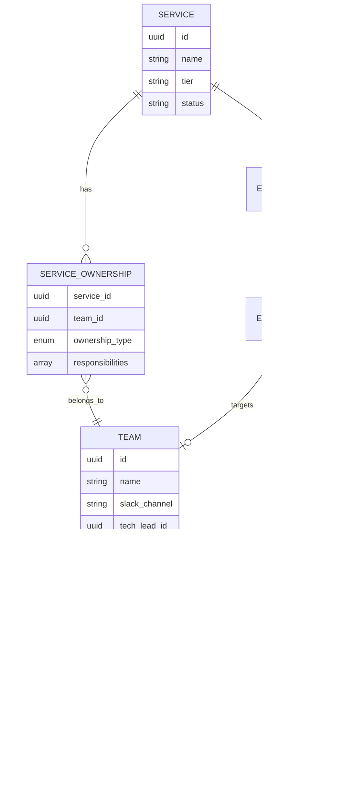

# How to Build Team Directory

Author: [nawazdhandala](https://github.com/nawazdhandala)

Tags: Platform Engineering, Team Directory, Organization, Developer Portal

Description: Learn to implement team directories for developer portals with ownership mapping, contact information, and org chart integration for service ownership clarity.

---

A team directory is the human layer of your developer portal. While service catalogs tell you what exists, team directories tell you who owns it, how to reach them, and who to escalate to when things go wrong. This guide walks through building a team directory that connects people to services, accelerates incident response, and keeps organizational knowledge current.

---

## Why Team Directories Matter

- **Faster incident resolution**: When an alert fires at 2 AM, responders need to know exactly who to page - not guess based on outdated spreadsheets.
- **Clear ownership**: Services without owners drift. Team directories enforce accountability by making ownership visible and auditable.
- **Onboarding acceleration**: New engineers discover who knows what, reducing time-to-productivity from weeks to days.
- **Cross-team collaboration**: Product managers, security teams, and leadership can find the right contacts without Slack archaeology.

---

## Architecture Overview

A team directory integrates multiple data sources into a unified view that powers both human lookups and automated workflows.


---

## Core Data Model

Your team directory needs to represent people, teams, and the relationships between them. Here is a TypeScript schema that captures the essential entities:

```typescript
// Core entities for the team directory

interface Person {
  id: string;
  email: string;
  name: string;
  preferredName?: string;
  title: string;
  department: string;
  location: string;
  timezone: string;
  startDate: Date;

  // Contact channels with priority order
  contactChannels: ContactChannel[];

  // Relationships
  managerId?: string;
  teamIds: string[];

  // Skills and expertise for routing
  skills: string[];

  // External system links
  githubUsername?: string;
  slackUserId?: string;
  pagerDutyUserId?: string;
}

interface ContactChannel {
  type: 'email' | 'slack' | 'phone' | 'pagerduty' | 'teams';
  value: string;
  priority: number; // 1 = primary, 2 = secondary, etc.
  availableHours?: {
    start: string; // "09:00"
    end: string;   // "17:00"
    timezone: string;
  };
}

interface Team {
  id: string;
  name: string;
  slug: string;
  description: string;
  type: 'product' | 'platform' | 'infrastructure' | 'security' | 'sre';

  // Ownership
  techLeadId: string;
  productManagerId?: string;
  engineeringManagerId: string;

  // Members
  memberIds: string[];

  // Contact points
  slackChannel: string;
  emailAlias?: string;
  onCallScheduleId?: string;

  // Service ownership
  ownedServiceIds: string[];

  // Parent team for org hierarchy
  parentTeamId?: string;

  // Metadata
  costCenter?: string;
  tags: string[];
}

interface ServiceOwnership {
  serviceId: string;
  teamId: string;
  ownershipType: 'primary' | 'secondary' | 'contributor';
  responsibilities: string[];
  escalationPath: EscalationStep[];
}

interface EscalationStep {
  level: number;
  targetType: 'person' | 'team' | 'oncall_schedule';
  targetId: string;
  waitMinutes: number;
  notificationChannels: ('slack' | 'email' | 'pagerduty' | 'phone')[];
}
```

---

## Data Source Integration

The directory is only as good as its data freshness. Set up automated syncs from authoritative sources.

### Syncing from Identity Providers

Most organizations use Okta, Azure AD, or Google Workspace as their source of truth for employee data.

```python
# Example: Syncing from Okta using their API

import okta
from okta.client import Client as OktaClient
from datetime import datetime, timedelta

class OktaSync:
    def __init__(self, org_url: str, token: str):
        self.client = OktaClient({
            'orgUrl': org_url,
            'token': token
        })

    async def sync_users(self) -> list[dict]:
        """Fetch all active users from Okta."""
        users = []
        async for user in self.client.list_users(query_params={'filter': 'status eq "ACTIVE"'}):
            profile = user.profile
            users.append({
                'id': user.id,
                'email': profile.email,
                'name': f"{profile.first_name} {profile.last_name}",
                'title': profile.title or 'Unknown',
                'department': profile.department or 'Unknown',
                'manager_email': profile.manager_id,  # Resolve to ID later
                'start_date': user.created,
                'location': profile.city or 'Remote',
            })
        return users

    async def sync_groups_as_teams(self) -> list[dict]:
        """Map Okta groups to teams."""
        teams = []
        async for group in self.client.list_groups():
            if not group.profile.name.startswith('team-'):
                continue

            members = []
            async for user in self.client.list_group_users(group.id):
                members.append(user.id)

            teams.append({
                'id': group.id,
                'name': group.profile.name.replace('team-', ''),
                'description': group.profile.description or '',
                'member_ids': members,
            })
        return teams
```

### Syncing from GitHub for Code Ownership

GitHub teams and CODEOWNERS files provide ground truth for code ownership.

```python
# Parse CODEOWNERS and GitHub team membership

from github import Github
import re

class GitHubSync:
    def __init__(self, token: str, org: str):
        self.gh = Github(token)
        self.org = self.gh.get_organization(org)

    def sync_teams(self) -> list[dict]:
        """Fetch GitHub teams and their members."""
        teams = []
        for team in self.org.get_teams():
            members = [m.login for m in team.get_members()]
            teams.append({
                'github_team_slug': team.slug,
                'name': team.name,
                'description': team.description or '',
                'github_usernames': members,
            })
        return teams

    def parse_codeowners(self, repo_name: str) -> dict[str, list[str]]:
        """Parse CODEOWNERS file to map paths to owners."""
        repo = self.org.get_repo(repo_name)
        ownership = {}

        try:
            content = repo.get_contents('CODEOWNERS').decoded_content.decode()
        except:
            try:
                content = repo.get_contents('.github/CODEOWNERS').decoded_content.decode()
            except:
                return {}

        for line in content.split('\n'):
            line = line.strip()
            if not line or line.startswith('#'):
                continue

            parts = line.split()
            if len(parts) >= 2:
                path = parts[0]
                owners = [o.lstrip('@') for o in parts[1:]]
                ownership[path] = owners

        return ownership
```

### Syncing On-Call Schedules

Connect to PagerDuty, Opsgenie, or your internal on-call system.

```python
# PagerDuty on-call sync

import pdpyras

class PagerDutySync:
    def __init__(self, api_key: str):
        self.session = pdpyras.APISession(api_key)

    def get_current_oncall(self, schedule_id: str) -> dict:
        """Get current on-call person for a schedule."""
        oncalls = self.session.list_all(
            'oncalls',
            params={
                'schedule_ids[]': schedule_id,
                'earliest': True
            }
        )

        if oncalls:
            oncall = oncalls[0]
            return {
                'schedule_id': schedule_id,
                'user_id': oncall['user']['id'],
                'user_email': oncall['user']['email'],
                'user_name': oncall['user']['name'],
                'start': oncall['start'],
                'end': oncall['end'],
            }
        return None

    def get_escalation_policy(self, policy_id: str) -> list[dict]:
        """Fetch escalation policy steps."""
        policy = self.session.rget(f'/escalation_policies/{policy_id}')

        steps = []
        for rule in policy['escalation_rules']:
            targets = []
            for target in rule['targets']:
                targets.append({
                    'type': target['type'],
                    'id': target['id'],
                    'name': target.get('name', ''),
                })

            steps.append({
                'level': rule['escalation_delay_in_minutes'],
                'targets': targets,
            })

        return steps
```

---

## Building the Directory API

Create a REST API that serves team and person data to all consumers.

```typescript
// Express.js API for the team directory

import express from 'express';
import { Pool } from 'pg';

const app = express();
const db = new Pool({ connectionString: process.env.DATABASE_URL });

// Get a person by ID or email
app.get('/api/v1/people/:identifier', async (req, res) => {
  const { identifier } = req.params;
  const isEmail = identifier.includes('@');

  const query = isEmail
    ? 'SELECT * FROM people WHERE email = $1'
    : 'SELECT * FROM people WHERE id = $1';

  const result = await db.query(query, [identifier]);

  if (result.rows.length === 0) {
    return res.status(404).json({ error: 'Person not found' });
  }

  const person = result.rows[0];

  // Enrich with team membership
  const teams = await db.query(
    `SELECT t.* FROM teams t
     JOIN team_members tm ON t.id = tm.team_id
     WHERE tm.person_id = $1`,
    [person.id]
  );

  res.json({
    ...person,
    teams: teams.rows,
  });
});

// Get a team with full details
app.get('/api/v1/teams/:slug', async (req, res) => {
  const { slug } = req.params;

  const team = await db.query(
    'SELECT * FROM teams WHERE slug = $1',
    [slug]
  );

  if (team.rows.length === 0) {
    return res.status(404).json({ error: 'Team not found' });
  }

  const teamData = team.rows[0];

  // Get members
  const members = await db.query(
    `SELECT p.* FROM people p
     JOIN team_members tm ON p.id = tm.person_id
     WHERE tm.team_id = $1`,
    [teamData.id]
  );

  // Get owned services
  const services = await db.query(
    `SELECT s.*, so.ownership_type FROM services s
     JOIN service_ownership so ON s.id = so.service_id
     WHERE so.team_id = $1`,
    [teamData.id]
  );

  // Get current on-call
  let currentOncall = null;
  if (teamData.oncall_schedule_id) {
    currentOncall = await getOncallFromPagerDuty(teamData.oncall_schedule_id);
  }

  res.json({
    ...teamData,
    members: members.rows,
    services: services.rows,
    currentOncall,
  });
});

// Find the owner of a service
app.get('/api/v1/services/:serviceId/owners', async (req, res) => {
  const { serviceId } = req.params;

  const owners = await db.query(
    `SELECT t.*, so.ownership_type, so.responsibilities
     FROM teams t
     JOIN service_ownership so ON t.id = so.team_id
     WHERE so.service_id = $1
     ORDER BY
       CASE so.ownership_type
         WHEN 'primary' THEN 1
         WHEN 'secondary' THEN 2
         ELSE 3
       END`,
    [serviceId]
  );

  res.json({ owners: owners.rows });
});

// Search across people and teams
app.get('/api/v1/search', async (req, res) => {
  const { q } = req.query;
  const searchTerm = `%${q}%`;

  const people = await db.query(
    `SELECT id, name, email, title, 'person' as type
     FROM people
     WHERE name ILIKE $1 OR email ILIKE $1 OR skills @> ARRAY[$2]
     LIMIT 10`,
    [searchTerm, q]
  );

  const teams = await db.query(
    `SELECT id, name, slug, description, 'team' as type
     FROM teams
     WHERE name ILIKE $1 OR description ILIKE $1
     LIMIT 10`,
    [searchTerm]
  );

  res.json({
    results: [...people.rows, ...teams.rows],
  });
});

// Get escalation path for a service
app.get('/api/v1/services/:serviceId/escalation', async (req, res) => {
  const { serviceId } = req.params;

  const escalation = await db.query(
    `SELECT es.*,
            CASE es.target_type
              WHEN 'person' THEN (SELECT name FROM people WHERE id = es.target_id)
              WHEN 'team' THEN (SELECT name FROM teams WHERE id = es.target_id)
            END as target_name
     FROM escalation_steps es
     JOIN service_ownership so ON es.ownership_id = so.id
     WHERE so.service_id = $1
     ORDER BY es.level`,
    [serviceId]
  );

  res.json({ escalationPath: escalation.rows });
});
```

---

## Ownership Mapping Strategies

Clear ownership prevents the "diffusion of responsibility" problem. Here are patterns that work.

### The RACI Model for Services


### Database Schema for Ownership

```sql
-- Ownership levels and responsibilities

CREATE TYPE ownership_level AS ENUM ('primary', 'secondary', 'contributor', 'stakeholder');

CREATE TABLE service_ownership (
    id UUID PRIMARY KEY DEFAULT gen_random_uuid(),
    service_id UUID NOT NULL REFERENCES services(id),
    team_id UUID NOT NULL REFERENCES teams(id),
    ownership_type ownership_level NOT NULL,

    -- What this team is responsible for
    responsibilities TEXT[] DEFAULT '{}',

    -- When ownership was established
    created_at TIMESTAMP DEFAULT NOW(),

    -- Who approved this ownership assignment
    approved_by UUID REFERENCES people(id),

    UNIQUE(service_id, team_id)
);

-- Example responsibilities:
-- 'oncall', 'code_review', 'incident_response', 'architecture', 'security', 'documentation'

CREATE TABLE escalation_paths (
    id UUID PRIMARY KEY DEFAULT gen_random_uuid(),
    service_id UUID NOT NULL REFERENCES services(id),
    name VARCHAR(255) NOT NULL, -- e.g., 'default', 'security_incident', 'customer_escalation'

    UNIQUE(service_id, name)
);

CREATE TABLE escalation_steps (
    id UUID PRIMARY KEY DEFAULT gen_random_uuid(),
    path_id UUID NOT NULL REFERENCES escalation_paths(id),
    step_order INT NOT NULL,

    -- Who to contact
    target_type VARCHAR(50) NOT NULL, -- 'person', 'team', 'oncall_schedule'
    target_id UUID NOT NULL,

    -- How long to wait before escalating
    wait_minutes INT NOT NULL DEFAULT 15,

    -- How to reach them
    notification_channels TEXT[] DEFAULT '{slack, email}',

    UNIQUE(path_id, step_order)
);
```

---

## Escalation Path Configuration

Define clear escalation paths that automation can follow during incidents.

```yaml
# escalation-config.yaml
# Define escalation paths per service or service tier

escalation_templates:
  tier1_critical:
    description: "Customer-facing critical services"
    steps:
      - level: 1
        target: oncall_primary
        wait_minutes: 5
        channels: [pagerduty, slack]
      - level: 2
        target: oncall_secondary
        wait_minutes: 10
        channels: [pagerduty, slack, phone]
      - level: 3
        target: engineering_manager
        wait_minutes: 15
        channels: [pagerduty, phone]
      - level: 4
        target: vp_engineering
        wait_minutes: 30
        channels: [phone]

  tier2_internal:
    description: "Internal tools and non-critical services"
    steps:
      - level: 1
        target: oncall_primary
        wait_minutes: 15
        channels: [slack, email]
      - level: 2
        target: team_lead
        wait_minutes: 30
        channels: [slack, email]

services:
  payment-gateway:
    tier: tier1_critical
    oncall_schedule: schedule_payments_primary
    custom_overrides:
      # For PCI-related incidents, loop in security immediately
      security_incident:
        inject_at_level: 1
        target: security_oncall
        channels: [pagerduty]

  internal-wiki:
    tier: tier2_internal
    oncall_schedule: schedule_platform_tools
```

### Escalation Flow Visualization


---

## Contact Channel Management

People have different preferences for how to be reached. Respect working hours and channel priorities.

```typescript
// Contact resolution logic

interface ContactPreferences {
  personId: string;
  channels: ContactChannel[];
  doNotDisturb?: {
    enabled: boolean;
    start: string; // "22:00"
    end: string;   // "07:00"
    timezone: string;
    overrideForSeverity?: ('critical' | 'high')[];
  };
}

class ContactResolver {
  async getBestChannel(
    personId: string,
    urgency: 'critical' | 'high' | 'medium' | 'low',
    currentTime: Date = new Date()
  ): Promise<ContactChannel | null> {
    const prefs = await this.getPreferences(personId);

    // Check DND status
    if (prefs.doNotDisturb?.enabled) {
      const inDndWindow = this.isInDndWindow(
        currentTime,
        prefs.doNotDisturb
      );

      if (inDndWindow) {
        // Only override for allowed severities
        const canOverride = prefs.doNotDisturb.overrideForSeverity?.includes(urgency);
        if (!canOverride) {
          return null; // Escalate to next person
        }
      }
    }

    // Sort channels by priority and filter by availability
    const availableChannels = prefs.channels
      .filter(ch => this.isChannelAvailable(ch, currentTime))
      .sort((a, b) => a.priority - b.priority);

    // For critical, use highest priority channel (usually phone/pagerduty)
    // For lower urgency, prefer async channels
    if (urgency === 'critical' || urgency === 'high') {
      return availableChannels[0] || null;
    }

    // Prefer Slack/email for non-urgent
    const asyncChannel = availableChannels.find(
      ch => ch.type === 'slack' || ch.type === 'email'
    );
    return asyncChannel || availableChannels[0] || null;
  }

  private isChannelAvailable(
    channel: ContactChannel,
    currentTime: Date
  ): boolean {
    if (!channel.availableHours) return true;

    const timeInZone = this.getTimeInTimezone(
      currentTime,
      channel.availableHours.timezone
    );

    const start = this.parseTime(channel.availableHours.start);
    const end = this.parseTime(channel.availableHours.end);
    const current = timeInZone.getHours() * 60 + timeInZone.getMinutes();

    return current >= start && current <= end;
  }
}
```

---

## Integration with Service Catalogs

The team directory becomes powerful when linked to your service catalog.



### Unified Query: Who Owns This Service?

```typescript
// Comprehensive ownership lookup

interface ServiceOwnershipInfo {
  service: {
    id: string;
    name: string;
    tier: string;
  };
  primaryTeam: {
    team: Team;
    techLead: Person;
    currentOncall: Person | null;
    slackChannel: string;
  };
  secondaryTeams: Team[];
  escalationPath: EscalationStep[];
  recentIncidents: Incident[];
}

async function getServiceOwnership(serviceId: string): Promise<ServiceOwnershipInfo> {
  // Fetch service
  const service = await db.query(
    'SELECT * FROM services WHERE id = $1',
    [serviceId]
  );

  // Get primary owner
  const primaryOwnership = await db.query(
    `SELECT t.*, p.* as tech_lead
     FROM service_ownership so
     JOIN teams t ON so.team_id = t.id
     JOIN people p ON t.tech_lead_id = p.id
     WHERE so.service_id = $1 AND so.ownership_type = 'primary'`,
    [serviceId]
  );

  // Get current on-call for primary team
  const primaryTeam = primaryOwnership.rows[0];
  let currentOncall = null;
  if (primaryTeam.oncall_schedule_id) {
    currentOncall = await pagerduty.getCurrentOncall(
      primaryTeam.oncall_schedule_id
    );
  }

  // Get secondary owners
  const secondaryOwners = await db.query(
    `SELECT t.* FROM service_ownership so
     JOIN teams t ON so.team_id = t.id
     WHERE so.service_id = $1 AND so.ownership_type = 'secondary'`,
    [serviceId]
  );

  // Get escalation path
  const escalation = await db.query(
    `SELECT es.*, ep.name as path_name
     FROM escalation_paths ep
     JOIN escalation_steps es ON ep.id = es.path_id
     WHERE ep.service_id = $1 AND ep.name = 'default'
     ORDER BY es.step_order`,
    [serviceId]
  );

  // Get recent incidents for context
  const incidents = await db.query(
    `SELECT * FROM incidents
     WHERE service_id = $1
     ORDER BY created_at DESC
     LIMIT 5`,
    [serviceId]
  );

  return {
    service: service.rows[0],
    primaryTeam: {
      team: primaryTeam,
      techLead: primaryTeam.tech_lead,
      currentOncall,
      slackChannel: primaryTeam.slack_channel,
    },
    secondaryTeams: secondaryOwners.rows,
    escalationPath: escalation.rows,
    recentIncidents: incidents.rows,
  };
}
```

---

## Org Chart Visualization

Display team hierarchy for navigation and understanding reporting structures.

```typescript
// React component for org chart visualization

import React from 'react';
import { Tree, TreeNode } from 'react-organizational-chart';

interface OrgNode {
  id: string;
  name: string;
  title: string;
  imageUrl?: string;
  children: OrgNode[];
}

function OrgChart({ rootPersonId }: { rootPersonId: string }) {
  const [orgData, setOrgData] = useState<OrgNode | null>(null);

  useEffect(() => {
    fetchOrgTree(rootPersonId).then(setOrgData);
  }, [rootPersonId]);

  const renderNode = (node: OrgNode) => (
    <TreeNode
      label={
        <div className="org-card">
          {node.imageUrl && (
            
          )}
          <div className="info">
            <div className="name">{node.name}</div>
            <div className="title">{node.title}</div>
          </div>
        </div>
      }
    >
      {node.children.map(child => renderNode(child))}
    </TreeNode>
  );

  if (!orgData) return <div>Loading...</div>;

  return (
    <Tree
      lineWidth="2px"
      lineColor="#bbb"
      lineBorderRadius="10px"
      label={
        <div className="org-card root">
          <div className="name">{orgData.name}</div>
          <div className="title">{orgData.title}</div>
        </div>
      }
    >
      {orgData.children.map(child => renderNode(child))}
    </Tree>
  );
}

// API to build the org tree
async function fetchOrgTree(personId: string): Promise<OrgNode> {
  const person = await fetch(`/api/v1/people/${personId}`).then(r => r.json());

  // Get direct reports
  const reports = await fetch(
    `/api/v1/people?manager_id=${personId}`
  ).then(r => r.json());

  return {
    id: person.id,
    name: person.name,
    title: person.title,
    imageUrl: person.avatar_url,
    children: await Promise.all(
      reports.map((r: any) => fetchOrgTree(r.id))
    ),
  };
}
```

---

## Keeping Data Fresh

Stale data erodes trust. Implement automated freshness checks.

```python
# Freshness monitoring and alerts

from datetime import datetime, timedelta
from dataclasses import dataclass

@dataclass
class FreshnessCheck:
    source: str
    last_sync: datetime
    record_count: int
    errors: list[str]

class FreshnessMonitor:
    def __init__(self, db, alerting):
        self.db = db
        self.alerting = alerting

        # Define freshness thresholds per source
        self.thresholds = {
            'okta': timedelta(hours=1),
            'github': timedelta(hours=6),
            'pagerduty': timedelta(minutes=15),
            'manual': timedelta(days=30),
        }

    async def check_all_sources(self) -> list[FreshnessCheck]:
        checks = []

        for source, threshold in self.thresholds.items():
            last_sync = await self.db.fetchval(
                """SELECT MAX(synced_at) FROM sync_logs
                   WHERE source = $1 AND status = 'success'""",
                source
            )

            record_count = await self.db.fetchval(
                f"SELECT COUNT(*) FROM people WHERE source = $1",
                source
            )

            check = FreshnessCheck(
                source=source,
                last_sync=last_sync,
                record_count=record_count,
                errors=[]
            )

            # Check if stale
            if last_sync is None or datetime.utcnow() - last_sync > threshold:
                check.errors.append(
                    f"Data is stale. Last sync: {last_sync}, threshold: {threshold}"
                )
                await self.alerting.send(
                    channel='platform-alerts',
                    message=f"Team directory sync stale for {source}",
                    severity='warning'
                )

            checks.append(check)

        return checks

    async def check_orphaned_records(self):
        """Find people/teams that exist in directory but not in source systems."""
        orphans = await self.db.fetch(
            """SELECT p.id, p.email, p.source
               FROM people p
               LEFT JOIN sync_logs sl ON p.id = sl.record_id
                 AND sl.synced_at > NOW() - INTERVAL '7 days'
               WHERE sl.id IS NULL"""
        )

        if orphans:
            await self.alerting.send(
                channel='platform-alerts',
                message=f"Found {len(orphans)} orphaned records in team directory",
                severity='info',
                details=[{'email': o['email']} for o in orphans]
            )
```

---

## Self-Service Updates

Allow people to update their own profiles while maintaining data integrity.

```typescript
// Self-service profile update API

app.patch('/api/v1/people/me', authenticate, async (req, res) => {
  const userId = req.user.id;
  const updates = req.body;

  // Define what users can self-update
  const allowedFields = [
    'preferred_name',
    'timezone',
    'contact_channels',
    'skills',
    'github_username',
    'slack_user_id',
    'bio',
    'working_hours',
  ];

  // Fields that require admin approval
  const restrictedFields = [
    'name',
    'email',
    'title',
    'department',
    'manager_id',
    'team_ids',
  ];

  // Separate allowed vs restricted updates
  const directUpdates: Record<string, any> = {};
  const pendingApprovals: Record<string, any> = {};

  for (const [key, value] of Object.entries(updates)) {
    if (allowedFields.includes(key)) {
      directUpdates[key] = value;
    } else if (restrictedFields.includes(key)) {
      pendingApprovals[key] = value;
    }
    // Ignore unknown fields
  }

  // Apply direct updates
  if (Object.keys(directUpdates).length > 0) {
    const setClauses = Object.keys(directUpdates)
      .map((key, i) => `${key} = $${i + 2}`)
      .join(', ');

    await db.query(
      `UPDATE people SET ${setClauses}, updated_at = NOW() WHERE id = $1`,
      [userId, ...Object.values(directUpdates)]
    );
  }

  // Queue restricted updates for approval
  if (Object.keys(pendingApprovals).length > 0) {
    await db.query(
      `INSERT INTO profile_change_requests
       (person_id, requested_changes, status, created_at)
       VALUES ($1, $2, 'pending', NOW())`,
      [userId, JSON.stringify(pendingApprovals)]
    );

    // Notify admins
    await slack.postMessage({
      channel: 'team-directory-admins',
      text: `Profile change request from ${req.user.email}`,
      blocks: [
        {
          type: 'section',
          text: {
            type: 'mrkdwn',
            text: `*${req.user.name}* requested profile changes:\n${
              Object.entries(pendingApprovals)
                .map(([k, v]) => `- ${k}: ${v}`)
                .join('\n')
            }`,
          },
        },
        {
          type: 'actions',
          elements: [
            {
              type: 'button',
              text: { type: 'plain_text', text: 'Approve' },
              action_id: 'approve_profile_change',
              value: `${userId}`,
            },
            {
              type: 'button',
              text: { type: 'plain_text', text: 'Reject' },
              action_id: 'reject_profile_change',
              value: `${userId}`,
            },
          ],
        },
      ],
    });
  }

  res.json({
    applied: directUpdates,
    pendingApproval: pendingApprovals,
  });
});
```

---

## Slack Bot Integration

Make the directory accessible where people already work.

```python
# Slack bot for team directory lookups

from slack_bolt import App
from slack_bolt.adapter.socket_mode import SocketModeHandler

app = App(token=os.environ["SLACK_BOT_TOKEN"])

@app.command("/whois")
def whois_command(ack, say, command):
    """Look up a person by name or email."""
    ack()

    query = command['text'].strip()
    results = directory_api.search_people(query)

    if not results:
        say(f"No one found matching '{query}'")
        return

    person = results[0]
    teams = directory_api.get_person_teams(person['id'])

    blocks = [
        {
            "type": "section",
            "text": {
                "type": "mrkdwn",
                "text": f"*{person['name']}*\n{person['title']} | {person['department']}"
            },
            "accessory": {
                "type": "image",
                "image_url": person.get('avatar_url', DEFAULT_AVATAR),
                "alt_text": person['name']
            }
        },
        {
            "type": "section",
            "fields": [
                {"type": "mrkdwn", "text": f"*Email:* {person['email']}"},
                {"type": "mrkdwn", "text": f"*Timezone:* {person['timezone']}"},
                {"type": "mrkdwn", "text": f"*Location:* {person['location']}"},
                {"type": "mrkdwn", "text": f"*Slack:* <@{person['slack_user_id']}>"},
            ]
        },
        {
            "type": "section",
            "text": {
                "type": "mrkdwn",
                "text": f"*Teams:* {', '.join(t['name'] for t in teams)}"
            }
        }
    ]

    say(blocks=blocks)

@app.command("/oncall")
def oncall_command(ack, say, command):
    """Find who is on-call for a service or team."""
    ack()

    query = command['text'].strip()

    # Try to find as service first, then team
    service = directory_api.find_service(query)
    if service:
        oncall = directory_api.get_service_oncall(service['id'])
        say(
            f"On-call for *{service['name']}*:\n"
            f"- Primary: <@{oncall['primary']['slack_user_id']}> ({oncall['primary']['name']})\n"
            f"- Secondary: <@{oncall['secondary']['slack_user_id']}> ({oncall['secondary']['name']})"
        )
        return

    team = directory_api.find_team(query)
    if team:
        oncall = directory_api.get_team_oncall(team['id'])
        say(
            f"On-call for *{team['name']}*:\n"
            f"- Primary: <@{oncall['primary']['slack_user_id']}>"
        )
        return

    say(f"Could not find service or team matching '{query}'")

@app.command("/escalate")
def escalate_command(ack, say, command):
    """Show escalation path for a service."""
    ack()

    service_name = command['text'].strip()
    service = directory_api.find_service(service_name)

    if not service:
        say(f"Service '{service_name}' not found")
        return

    escalation = directory_api.get_escalation_path(service['id'])

    blocks = [
        {
            "type": "header",
            "text": {
                "type": "plain_text",
                "text": f"Escalation path for {service['name']}"
            }
        }
    ]

    for step in escalation:
        blocks.append({
            "type": "section",
            "text": {
                "type": "mrkdwn",
                "text": (
                    f"*Level {step['level']}* (wait {step['wait_minutes']}min)\n"
                    f"{step['target_name']} via {', '.join(step['channels'])}"
                )
            }
        })

    say(blocks=blocks)
```

---

## Best Practices Summary

1. **Single source of truth**: Sync from authoritative systems (HR, IdP) rather than accepting direct edits for core data.

2. **Ownership must be explicit**: Every service needs a primary owner. Make ownership assignment part of service creation workflows.

3. **Respect time zones and preferences**: Store contact preferences and working hours. Route notifications intelligently.

4. **Keep escalation paths current**: Review escalation paths quarterly. Stale paths cause delayed incident response.

5. **Make it searchable**: Invest in good search across names, skills, teams, and services. Discovery drives adoption.

6. **Automate freshness checks**: Alert when sync jobs fail or data goes stale. Trust erodes quickly with outdated information.

7. **Integrate everywhere**: Embed directory lookups in Slack, incident tools, and the developer portal. Meet people where they work.

---

## Conclusion

A well-built team directory transforms how organizations respond to incidents, onboard new engineers, and collaborate across teams. By integrating authoritative data sources, mapping clear ownership to services, and making information accessible through APIs and chat bots, you create the human layer that makes your developer portal complete.

Start with the basics - people, teams, and service ownership. Add escalation paths and on-call integration. Then expand to org charts, skills mapping, and self-service updates. The investment pays dividends every time someone asks "who owns this?" and gets an instant, accurate answer.
