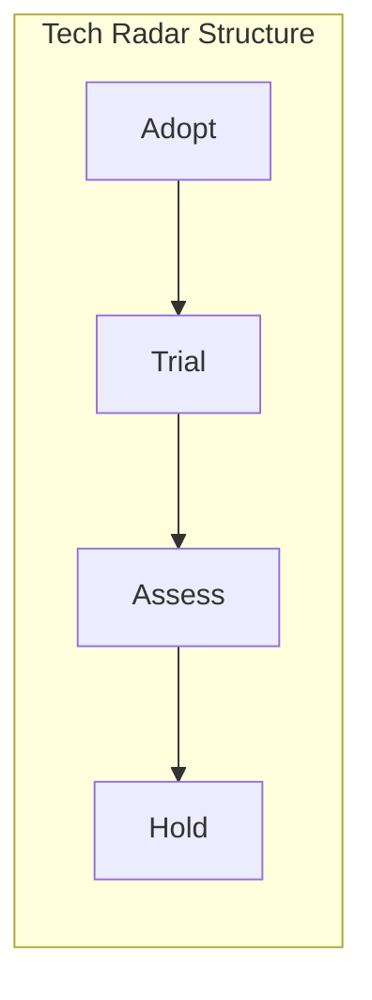
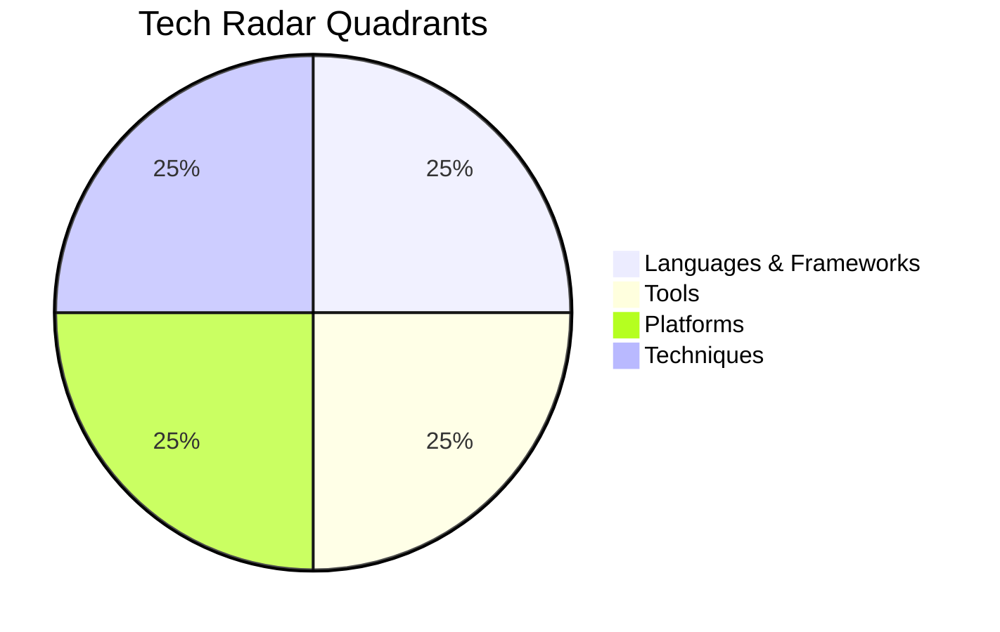
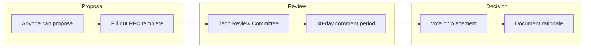
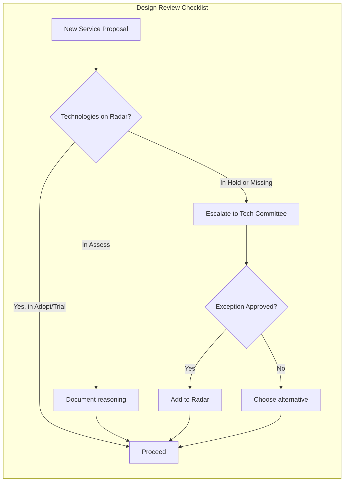

# How to Create Tech Radar

Author: [nawazdhandala](https://github.com/nawazdhandala)

Tags: Platform Engineering, Technology Strategy, DevOps, Architecture

Description: A Tech Radar helps engineering teams visualize and communicate technology decisions, track adoption of tools and frameworks, and make informed choices about what to build with.

---

Every engineering organization faces the same challenge: too many technology choices and not enough shared context. One team adopts React, another Vue, and a third builds with Svelte. Your infrastructure runs on a mix of Kubernetes, ECS, and bare VMs. Nobody knows which database to pick for a new project.

A Tech Radar solves this by giving your organization a single, visual source of truth for technology decisions. It shows what technologies you recommend, which ones you are evaluating, and what you are actively moving away from. This post walks you through building one from scratch.

## What Is a Tech Radar?

ThoughtWorks pioneered the Tech Radar concept in 2010. It organizes technologies into a circular diagram with four rings representing different levels of adoption confidence.



The four rings are:

| Ring | Meaning | Action |
|------|---------|--------|
| **Adopt** | Proven in production, recommended as default choice | Use freely for new projects |
| **Trial** | Worth pursuing, understood how to build with it | Use in projects that can handle risk |
| **Assess** | Worth exploring to understand how it affects you | Investigate with spikes and prototypes |
| **Hold** | Proceed with caution or actively migrate away | Do not start new projects with this |

Technologies are also grouped into quadrants. Common quadrant categories include:

- **Languages and Frameworks**: Programming languages, web frameworks, mobile SDKs
- **Tools**: Development tools, CI/CD, testing frameworks
- **Platforms**: Cloud providers, container orchestration, databases
- **Techniques**: Architectural patterns, methodologies, practices

## Why Your Team Needs a Tech Radar

Without a Tech Radar, technology decisions happen in silos. Each team picks their own tools based on individual preference or whatever is trending on Hacker News. This creates several problems:

**Knowledge fragmentation**: When every team uses different tools, engineers cannot easily move between projects. Institutional knowledge stays locked in silos.

**Maintenance burden**: Supporting five different web frameworks costs more than supporting one. Each needs security updates, training materials, and debugging expertise.

**Inconsistent quality**: Some technology choices work better than others. Without shared learning, teams repeat each other's mistakes.

**Vendor sprawl**: Multiple teams might pay for overlapping SaaS tools because nobody knows what already exists in the organization.

A Tech Radar addresses these problems by creating transparency and shared vocabulary around technology decisions.

## Building Your Tech Radar: Step by Step

### Step 1: Define Your Quadrants

Start by choosing categories that make sense for your organization. Here is a common starting point:



You might customize these based on your context. A data-focused organization might have quadrants for Data Storage, Data Processing, ML/AI, and Visualization. A mobile company might split by iOS, Android, Cross-Platform, and Backend.

### Step 2: Gather Technology Inventory

Before you can rate technologies, you need to know what you are using. Create a survey or audit to collect this data from teams.

The following script shows how to automatically scan your repositories for technology signals.

```bash
#!/bin/bash
# tech-inventory.sh
# Scans repositories to identify technologies in use
# Run this from the parent directory containing all your repos

echo "Technology Inventory Scanner"
echo "============================"

# Find all package.json files to identify JavaScript dependencies
echo -e "\n## JavaScript/TypeScript Frameworks"
find . -name "package.json" -not -path "*/node_modules/*" -exec grep -l "react\|vue\|angular\|svelte" {} \; | head -20

# Find Dockerfiles to identify container usage
echo -e "\n## Container Technologies"
find . -name "Dockerfile" -o -name "docker-compose.yml" | wc -l
echo "repositories using Docker"

# Find Kubernetes manifests
echo -e "\n## Kubernetes Usage"
find . -name "*.yaml" -exec grep -l "apiVersion.*apps/v1\|kind: Deployment" {} \; 2>/dev/null | wc -l
echo "repositories with Kubernetes manifests"

# Find CI/CD configurations
echo -e "\n## CI/CD Platforms"
echo "GitHub Actions: $(find . -path "*/.github/workflows/*.yml" | wc -l) workflows"
echo "GitLab CI: $(find . -name ".gitlab-ci.yml" | wc -l) configs"
echo "Jenkins: $(find . -name "Jenkinsfile" | wc -l) pipelines"

# Find database configurations
echo -e "\n## Databases"
find . -name "*.sql" -o -name "migrations" -type d | head -10
grep -r "postgresql\|mysql\|mongodb\|redis" --include="*.yaml" --include="*.json" -l 2>/dev/null | head -10
```

### Step 3: Create the Rating Process

Technology ratings should not come from a single person. Establish a lightweight governance process.



Create an RFC template for technology proposals.

```markdown
# Technology Proposal: [Name]

## Summary
What is this technology and why are we considering it?

## Current Ring Proposal
- [ ] Adopt
- [ ] Trial
- [ ] Assess
- [ ] Hold

## Quadrant
- [ ] Languages & Frameworks
- [ ] Tools
- [ ] Platforms
- [ ] Techniques

## Rationale
Why does this technology belong in the proposed ring?

## Experience
Which teams have used this? What were the results?

## Alternatives Considered
What other technologies solve the same problem?

## Migration Impact
If this is "Hold", what is the migration path?

## Resources
- Documentation links
- Training materials
- Support channels
```

### Step 4: Build the Visualization

You can build your Tech Radar visualization in several ways. Here is a simple approach using a static site generator and D3.js.

First, define your radar data in a structured format.

```json
{
  "title": "Engineering Tech Radar - Q1 2026",
  "quadrants": [
    { "name": "Languages & Frameworks" },
    { "name": "Tools" },
    { "name": "Platforms" },
    { "name": "Techniques" }
  ],
  "rings": [
    { "name": "Adopt", "color": "#5ba300" },
    { "name": "Trial", "color": "#009eb0" },
    { "name": "Assess", "color": "#c7ba00" },
    { "name": "Hold", "color": "#e09b96" }
  ],
  "entries": [
    {
      "name": "TypeScript",
      "quadrant": 0,
      "ring": 0,
      "description": "Our standard for all new JavaScript projects. Strong typing catches bugs early and improves IDE support.",
      "moved": 0
    },
    {
      "name": "React",
      "quadrant": 0,
      "ring": 0,
      "description": "Primary frontend framework. Large ecosystem, good hiring pool, proven at scale.",
      "moved": 0
    },
    {
      "name": "Vue 3",
      "quadrant": 0,
      "ring": 1,
      "description": "Evaluating for smaller internal tools. Simpler learning curve than React.",
      "moved": 1
    },
    {
      "name": "Kubernetes",
      "quadrant": 2,
      "ring": 0,
      "description": "Standard container orchestration platform for all production workloads.",
      "moved": 0
    },
    {
      "name": "OpenTelemetry",
      "quadrant": 1,
      "ring": 0,
      "description": "Standard for all observability instrumentation. Vendor-neutral and future-proof.",
      "moved": 1
    },
    {
      "name": "GitHub Actions",
      "quadrant": 1,
      "ring": 0,
      "description": "Primary CI/CD platform. Tight GitHub integration, good marketplace.",
      "moved": 0
    },
    {
      "name": "Terraform",
      "quadrant": 1,
      "ring": 0,
      "description": "Infrastructure as code standard. All cloud resources must be Terraform-managed.",
      "moved": 0
    },
    {
      "name": "PostgreSQL",
      "quadrant": 2,
      "ring": 0,
      "description": "Default relational database. Excellent reliability and feature set.",
      "moved": 0
    },
    {
      "name": "MongoDB",
      "quadrant": 2,
      "ring": 2,
      "description": "Assess for document-heavy workloads. Evaluate operational complexity.",
      "moved": 0
    },
    {
      "name": "Jenkins",
      "quadrant": 1,
      "ring": 3,
      "description": "Legacy CI system. Migrate existing pipelines to GitHub Actions.",
      "moved": -1
    },
    {
      "name": "Microservices",
      "quadrant": 3,
      "ring": 1,
      "description": "Right-size your services. Not everything needs to be micro.",
      "moved": 0
    },
    {
      "name": "Event-Driven Architecture",
      "quadrant": 3,
      "ring": 0,
      "description": "Recommended for system integration. Use Kafka or cloud-native alternatives.",
      "moved": 0
    },
    {
      "name": "Trunk-Based Development",
      "quadrant": 3,
      "ring": 0,
      "description": "Standard branching strategy. Short-lived feature branches only.",
      "moved": 0
    }
  ]
}
```

Now create a simple HTML page with D3.js to render the radar.

```html
<!DOCTYPE html>
<html lang="en">
<head>
    <meta charset="UTF-8">
    <meta name="viewport" content="width=device-width, initial-scale=1.0">
    <title>Tech Radar</title>
    <script src="https://d3js.org/d3.v7.min.js"></script>
    <style>
        /* Base styles for the radar container */
        body {
            font-family: -apple-system, BlinkMacSystemFont, 'Segoe UI', Roboto, sans-serif;
            margin: 0;
            padding: 20px;
            background: #f5f5f5;
        }

        .radar-container {
            max-width: 1200px;
            margin: 0 auto;
            background: white;
            border-radius: 8px;
            padding: 20px;
            box-shadow: 0 2px 4px rgba(0,0,0,0.1);
        }

        /* Radar title styling */
        h1 {
            text-align: center;
            color: #333;
            margin-bottom: 30px;
        }

        /* SVG container */
        #radar {
            display: block;
            margin: 0 auto;
        }

        /* Quadrant labels */
        .quadrant-label {
            font-size: 14px;
            font-weight: bold;
            fill: #666;
        }

        /* Ring labels */
        .ring-label {
            font-size: 12px;
            fill: #999;
        }

        /* Technology blips */
        .blip {
            cursor: pointer;
            transition: transform 0.2s;
        }

        .blip:hover {
            transform: scale(1.2);
        }

        /* Tooltip styling */
        .tooltip {
            position: absolute;
            background: #333;
            color: white;
            padding: 10px 15px;
            border-radius: 4px;
            font-size: 13px;
            max-width: 300px;
            pointer-events: none;
            opacity: 0;
            transition: opacity 0.2s;
        }

        .tooltip.visible {
            opacity: 1;
        }

        /* Legend styling */
        .legend {
            display: flex;
            justify-content: center;
            gap: 30px;
            margin-top: 20px;
            flex-wrap: wrap;
        }

        .legend-item {
            display: flex;
            align-items: center;
            gap: 8px;
        }

        .legend-color {
            width: 16px;
            height: 16px;
            border-radius: 50%;
        }
    </style>
</head>
<body>
    <div class="radar-container">
        <h1>Engineering Tech Radar - Q1 2026</h1>
        <svg id="radar"></svg>
        <div class="legend" id="legend"></div>
    </div>
    <div class="tooltip" id="tooltip"></div>

    <script>
        // Radar configuration
        const config = {
            width: 800,
            height: 800,
            rings: [
                { name: 'Adopt', color: '#5ba300', radius: 130 },
                { name: 'Trial', color: '#009eb0', radius: 220 },
                { name: 'Assess', color: '#c7ba00', radius: 310 },
                { name: 'Hold', color: '#e09b96', radius: 400 }
            ],
            quadrants: [
                { name: 'Languages & Frameworks', angle: 90 },
                { name: 'Tools', angle: 0 },
                { name: 'Platforms', angle: -90 },
                { name: 'Techniques', angle: 180 }
            ]
        };

        // Sample entries - in production, load from radar.json
        const entries = [
            { name: 'TypeScript', quadrant: 0, ring: 0, description: 'Our standard for all new JavaScript projects.' },
            { name: 'React', quadrant: 0, ring: 0, description: 'Primary frontend framework.' },
            { name: 'Vue 3', quadrant: 0, ring: 1, description: 'Evaluating for smaller internal tools.' },
            { name: 'Kubernetes', quadrant: 2, ring: 0, description: 'Standard container orchestration platform.' },
            { name: 'OpenTelemetry', quadrant: 1, ring: 0, description: 'Standard for all observability instrumentation.' },
            { name: 'GitHub Actions', quadrant: 1, ring: 0, description: 'Primary CI/CD platform.' },
            { name: 'Terraform', quadrant: 1, ring: 0, description: 'Infrastructure as code standard.' },
            { name: 'PostgreSQL', quadrant: 2, ring: 0, description: 'Default relational database.' },
            { name: 'MongoDB', quadrant: 2, ring: 2, description: 'Assess for document-heavy workloads.' },
            { name: 'Jenkins', quadrant: 1, ring: 3, description: 'Legacy CI system. Migrate to GitHub Actions.' }
        ];

        // Initialize SVG
        const svg = d3.select('#radar')
            .attr('width', config.width)
            .attr('height', config.height);

        const center = { x: config.width / 2, y: config.height / 2 };

        // Draw rings
        config.rings.forEach((ring, i) => {
            svg.append('circle')
                .attr('cx', center.x)
                .attr('cy', center.y)
                .attr('r', ring.radius)
                .attr('fill', 'none')
                .attr('stroke', ring.color)
                .attr('stroke-width', 2)
                .attr('opacity', 0.5);

            // Ring labels
            svg.append('text')
                .attr('x', center.x + 5)
                .attr('y', center.y - ring.radius + 15)
                .attr('class', 'ring-label')
                .text(ring.name);
        });

        // Draw quadrant lines
        svg.append('line')
            .attr('x1', center.x)
            .attr('y1', center.y - config.rings[3].radius)
            .attr('x2', center.x)
            .attr('y2', center.y + config.rings[3].radius)
            .attr('stroke', '#ccc');

        svg.append('line')
            .attr('x1', center.x - config.rings[3].radius)
            .attr('y1', center.y)
            .attr('x2', center.x + config.rings[3].radius)
            .attr('y2', center.y)
            .attr('stroke', '#ccc');

        // Calculate blip positions
        function getBlipPosition(entry) {
            const ring = config.rings[entry.ring];
            const prevRadius = entry.ring > 0 ? config.rings[entry.ring - 1].radius : 0;
            const radius = prevRadius + (ring.radius - prevRadius) * (0.3 + Math.random() * 0.4);

            const quadrantAngle = config.quadrants[entry.quadrant].angle;
            const angleRange = 80;
            const angle = (quadrantAngle - angleRange/2 + Math.random() * angleRange) * Math.PI / 180;

            return {
                x: center.x + radius * Math.cos(angle),
                y: center.y - radius * Math.sin(angle)
            };
        }

        // Draw blips
        const tooltip = d3.select('#tooltip');

        entries.forEach(entry => {
            const pos = getBlipPosition(entry);
            const color = config.rings[entry.ring].color;

            svg.append('circle')
                .attr('class', 'blip')
                .attr('cx', pos.x)
                .attr('cy', pos.y)
                .attr('r', 8)
                .attr('fill', color)
                .on('mouseover', (event) => {
                    tooltip
                        .style('left', (event.pageX + 10) + 'px')
                        .style('top', (event.pageY - 10) + 'px')
                        .html(`<strong>${entry.name}</strong><br>${entry.description}`)
                        .classed('visible', true);
                })
                .on('mouseout', () => {
                    tooltip.classed('visible', false);
                });
        });

        // Build legend
        const legend = d3.select('#legend');
        config.rings.forEach(ring => {
            legend.append('div')
                .attr('class', 'legend-item')
                .html(`<div class="legend-color" style="background: ${ring.color}"></div>${ring.name}`);
        });
    </script>
</body>
</html>
```

### Step 5: Automate Radar Updates

Keep your radar in version control and automate publishing. Here is a GitHub Actions workflow that rebuilds the radar site whenever the data changes.

```yaml
# .github/workflows/publish-radar.yml
# Automatically rebuilds and deploys the Tech Radar when data changes

name: Publish Tech Radar

on:
  push:
    branches: [main]
    paths:
      - 'radar.json'
      - 'index.html'
      - '.github/workflows/publish-radar.yml'
  workflow_dispatch:

jobs:
  build-and-deploy:
    runs-on: ubuntu-latest

    steps:
      # Check out the repository
      - name: Checkout
        uses: actions/checkout@v4

      # Validate the radar JSON schema
      - name: Validate radar.json
        run: |
          # Simple validation to ensure JSON is valid
          python3 -c "import json; json.load(open('radar.json'))"

      # Build the static site
      - name: Build site
        run: |
          mkdir -p dist
          cp index.html dist/
          cp radar.json dist/

      # Deploy to GitHub Pages
      - name: Deploy to GitHub Pages
        uses: peaceiris/actions-gh-pages@v3
        with:
          github_token: ${{ secrets.GITHUB_TOKEN }}
          publish_dir: ./dist
```

## Integrating Tech Radar with Your Engineering Culture

A Tech Radar only works if people actually use it. Here are strategies to drive adoption.

### Make It Part of Design Reviews

Add a Tech Radar check to your architecture review process.



### Include It in Onboarding

New engineers should see the Tech Radar in their first week. It answers the question "what technologies should I learn to be effective here?"

### Review Quarterly

Technology moves fast. Schedule quarterly reviews to:

- Promote technologies that have proven themselves (Assess to Trial, Trial to Adopt)
- Deprecate technologies that are no longer recommended
- Add new technologies that teams are experimenting with
- Archive technologies that are fully migrated away

### Track Metrics

Measure how well your radar reflects reality.

| Metric | What It Tells You |
|--------|-------------------|
| Adoption rate of "Adopt" technologies | Are teams following recommendations? |
| Number of "Hold" technologies still in production | How much tech debt exists? |
| Time from "Assess" to decision | Is the evaluation process working? |
| Exceptions granted | Is the radar too restrictive? |

## Real World Example: Building a Tech Radar for a Growing Startup

Let us walk through how a 50-person engineering team might build their first Tech Radar.

### Initial Survey Results

After surveying all teams, you discover:

- 3 different frontend frameworks (React, Vue, Angular)
- 2 CI/CD systems (GitHub Actions, Jenkins)
- 4 databases (PostgreSQL, MySQL, MongoDB, DynamoDB)
- No standard for observability

### First Radar Draft

Based on usage data and team discussions:

**Adopt:**
- TypeScript (used by 80% of teams, strong positive feedback)
- React (most teams, largest knowledge base)
- PostgreSQL (default for relational data)
- GitHub Actions (newer projects, positive experience)
- Kubernetes (all production workloads)

**Trial:**
- OpenTelemetry (two teams piloting, promising results)
- Pulumi (infrastructure as code alternative to Terraform)

**Assess:**
- Rust (one team interested for performance-critical service)
- Temporal (workflow orchestration for complex processes)

**Hold:**
- Angular (legacy projects only, no new development)
- Jenkins (migrate to GitHub Actions)
- MySQL (consolidate on PostgreSQL)

### Six Months Later

After two quarterly reviews:

- OpenTelemetry moved to Adopt after successful rollout
- Rust moved to Trial after the pilot team shipped their service
- Angular migration completed, removed from radar
- Added GraphQL to Assess based on team interest

## Connecting Your Tech Radar to Observability

Your Tech Radar can inform your observability strategy. Technologies in different rings might need different levels of monitoring.

**Adopt technologies**: Full observability stack. Dashboards, alerts, runbooks, on-call coverage. These are production-critical and need comprehensive monitoring.

**Trial technologies**: Basic observability. Metrics and logs, but lighter alerting. You want to learn how they behave without over-investing.

**Assess technologies**: Development environment only. No production monitoring needed yet.

**Hold technologies**: Migration dashboards. Track usage over time, alert when new deployments use deprecated tech.

OneUptime can help you implement this tiered approach. Set up different alerting policies based on technology criticality, and use service catalogs to track which technologies each service uses.

## Common Mistakes to Avoid

**Making the radar too detailed**: Your radar should have 30-50 items, not 300. If you need to scroll, it is too big.

**Treating it as a committee decision**: The radar should have an owner (usually a principal engineer or architecture team) who makes final calls. Committees slow everything down.

**Ignoring the "why"**: Every item needs a rationale. "We use React" is not helpful. "We use React because of its large ecosystem, strong hiring pool, and our existing expertise" helps people understand and make better decisions.

**Never moving things to Hold**: If your radar only adds things and never removes them, it stops being useful. Be willing to deprecate technologies that are not working.

**Forgetting about legacy**: Your radar should acknowledge what exists, not just what you wish existed. If you have 50 Jenkins pipelines, Jenkins should be on the radar (probably in Hold with a migration plan).

## Getting Started Today

1. **Start with a survey**: Find out what technologies your teams actually use
2. **Identify decision-makers**: Who will own the radar and make final calls?
3. **Draft your first version**: Start with 20-30 items across four quadrants
4. **Share and iterate**: Get feedback from senior engineers before publishing
5. **Publish and socialize**: Make it easy to find and reference
6. **Schedule reviews**: Put quarterly review meetings on the calendar

A Tech Radar is a living document. Your first version will not be perfect, and that is fine. The goal is to start the conversation about technology standards and create a shared vocabulary for making decisions.

**Related Reading:**

- [How to Implement Golden Paths](https://oneuptime.com/blog/post/2026-01-30-golden-paths/view)
- [Service Catalog with OneUptime](https://oneuptime.com/blog/post/2025-10-27-service-catalog-with-oneuptime/view)
- [The Five Stages of SRE Maturity](https://oneuptime.com/blog/post/2025-09-01-the-five-stages-of-sre-maturity/view)
