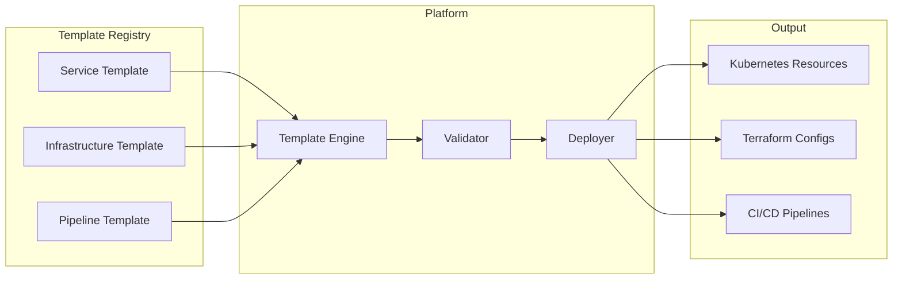
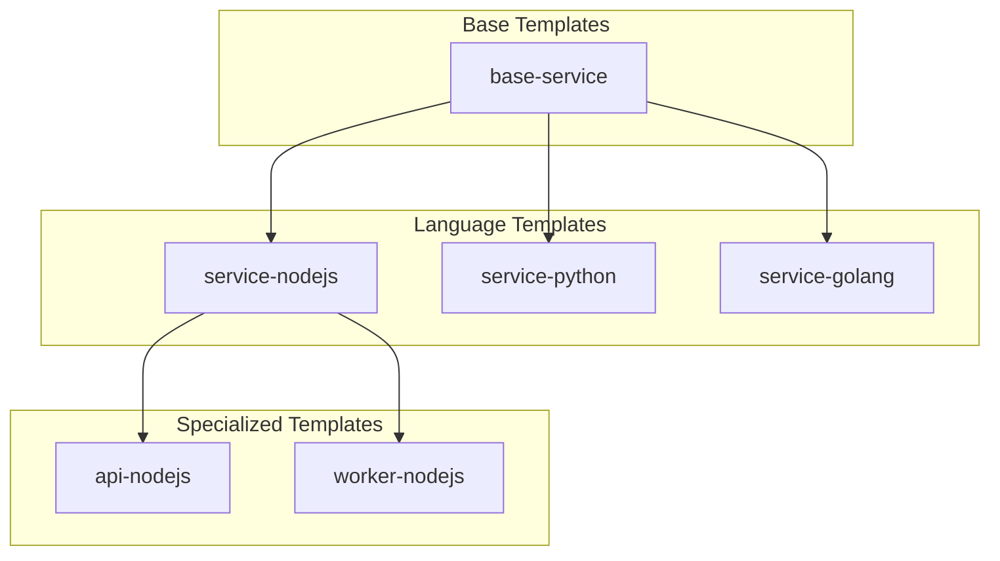
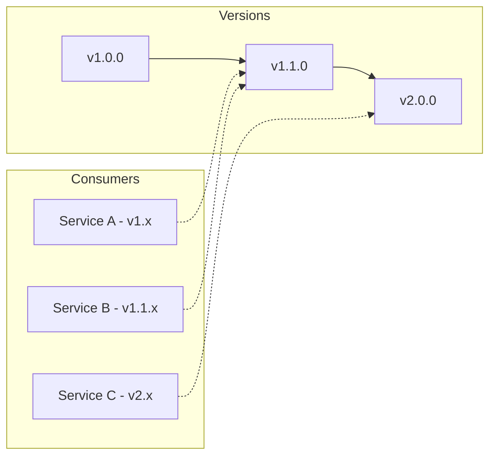
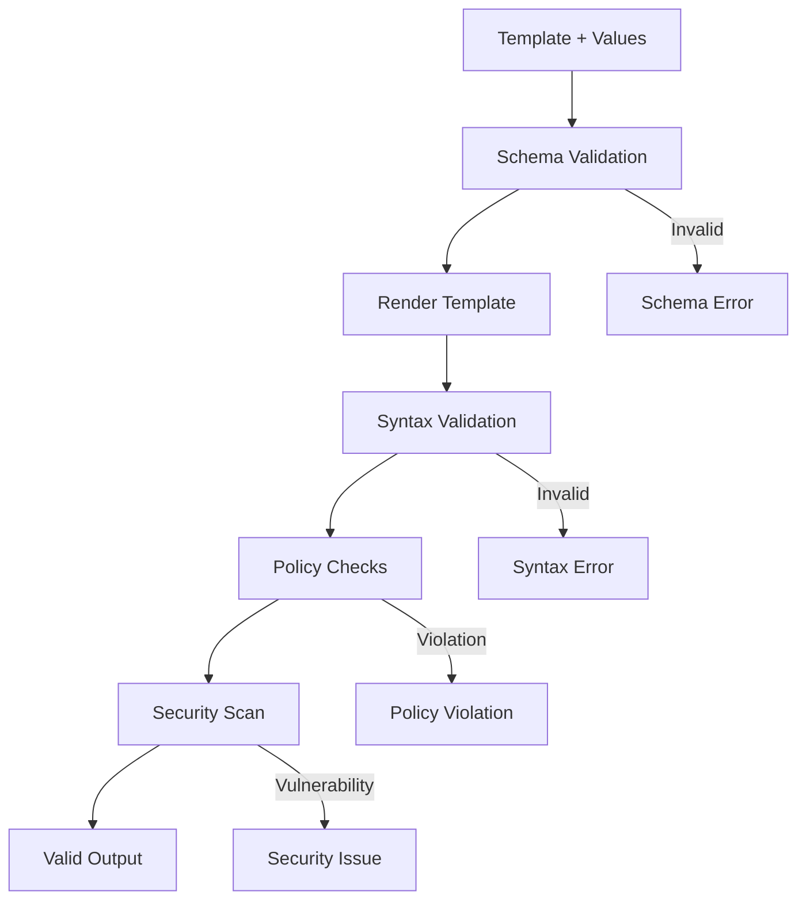
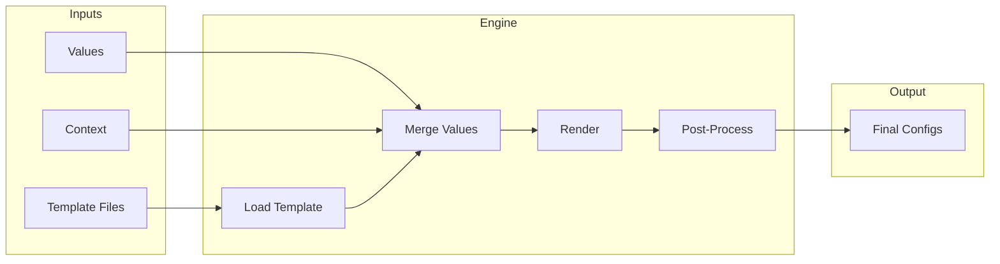
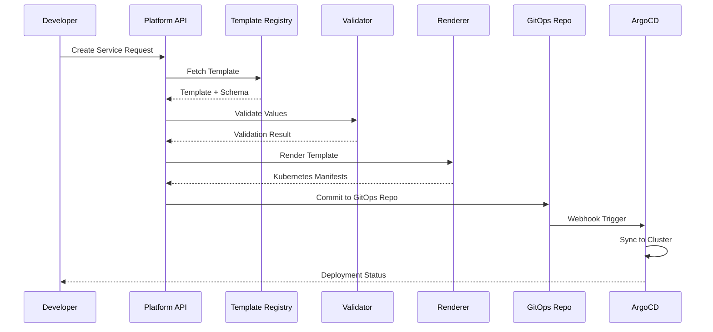

# How to Build Template Management

Author: [nawazdhandala](https://github.com/nawazdhandala)

Tags: Platform Engineering, Templates, Infrastructure, Developer Experience

Description: Learn to implement template management for internal developer platforms with versioning, parameterization, and inheritance for consistent service provisioning.

---

Template management is the backbone of any internal developer platform. When developers can spin up new services, infrastructure, or environments from pre-approved templates, you eliminate configuration drift, enforce standards, and accelerate delivery. This guide covers how to build a robust template management system from scratch.

## What is Template Management?

Template management is a system that stores, versions, validates, and deploys standardized configurations for infrastructure, services, and applications. Instead of copying files or writing boilerplate from memory, developers select a template, fill in parameters, and get a fully configured resource.



## Core Components of Template Management

A complete template management system needs these building blocks:

| Component | Purpose |
|-----------|---------|
| Template Registry | Central storage for all templates |
| Schema Definition | Structure and validation rules |
| Parameter System | Dynamic values for customization |
| Inheritance | Base templates that others extend |
| Versioning | Track changes and enable rollbacks |
| Validation Engine | Ensure templates produce valid output |
| Rendering Engine | Process templates into final configs |

## Template Structure Design

Start with a clear directory structure. Each template should be self-contained with metadata, schema, and the actual template files.

```
templates/
  service-nodejs/
    template.yaml          # Metadata and schema
    values.schema.json     # Parameter validation
    base/
      deployment.yaml
      service.yaml
      configmap.yaml
    overlays/
      production/
        patches.yaml
      staging/
        patches.yaml
  service-python/
    template.yaml
    values.schema.json
    base/
      ...
```

### Template Metadata

The `template.yaml` file contains everything the platform needs to know about your template:

```yaml
# templates/service-nodejs/template.yaml
apiVersion: platform.company.com/v1
kind: ServiceTemplate
metadata:
  name: service-nodejs
  version: 2.1.0
  description: Node.js microservice with Express framework
  maintainer: platform-team@company.com
  labels:
    language: nodejs
    type: microservice
    tier: backend

spec:
  # What this template extends (if any)
  extends: base-service

  # Required platform version
  platformVersion: ">=1.5.0"

  # Supported deployment targets
  targets:
    - kubernetes
    - docker-compose

  # Categories for discovery
  categories:
    - backend
    - api
    - nodejs

  # Files to render
  files:
    - path: base/deployment.yaml
      engine: helm
    - path: base/service.yaml
      engine: helm
    - path: base/configmap.yaml
      engine: helm
    - path: Dockerfile
      engine: jinja2

  # Post-render hooks
  hooks:
    postRender:
      - validate-kubernetes-manifests
      - security-scan
```

## Parameter System

Parameters make templates flexible. Define them with types, defaults, validation rules, and documentation.

### Schema Definition

Use JSON Schema for parameter validation:

```json
{
  "$schema": "http://json-schema.org/draft-07/schema#",
  "type": "object",
  "required": ["name", "port"],
  "properties": {
    "name": {
      "type": "string",
      "pattern": "^[a-z][a-z0-9-]{2,28}[a-z0-9]$",
      "description": "Service name (lowercase, alphanumeric with hyphens)"
    },
    "port": {
      "type": "integer",
      "minimum": 1024,
      "maximum": 65535,
      "default": 3000,
      "description": "Container port for the application"
    },
    "replicas": {
      "type": "object",
      "properties": {
        "min": {
          "type": "integer",
          "minimum": 1,
          "default": 2
        },
        "max": {
          "type": "integer",
          "minimum": 1,
          "default": 10
        }
      }
    },
    "resources": {
      "type": "object",
      "properties": {
        "cpu": {
          "type": "string",
          "pattern": "^[0-9]+m?$",
          "default": "100m"
        },
        "memory": {
          "type": "string",
          "pattern": "^[0-9]+(Mi|Gi)$",
          "default": "256Mi"
        }
      }
    },
    "environment": {
      "type": "string",
      "enum": ["development", "staging", "production"],
      "default": "development"
    },
    "features": {
      "type": "object",
      "properties": {
        "metrics": {
          "type": "boolean",
          "default": true
        },
        "tracing": {
          "type": "boolean",
          "default": true
        },
        "serviceMesh": {
          "type": "boolean",
          "default": false
        }
      }
    }
  }
}
```

### Parameter Groups

Organize parameters into logical groups for better UX:

```yaml
# template.yaml
parameterGroups:
  - name: basic
    title: Basic Configuration
    description: Essential service settings
    parameters:
      - name
      - port
      - environment

  - name: scaling
    title: Scaling Configuration
    description: Replica and autoscaling settings
    parameters:
      - replicas.min
      - replicas.max

  - name: resources
    title: Resource Limits
    description: CPU and memory allocation
    parameters:
      - resources.cpu
      - resources.memory

  - name: features
    title: Platform Features
    description: Optional platform integrations
    parameters:
      - features.metrics
      - features.tracing
      - features.serviceMesh
```

## Template Inheritance

Inheritance prevents duplication and enforces organization-wide standards. Child templates extend base templates and can override specific sections.



### Base Template

```yaml
# templates/base-service/template.yaml
apiVersion: platform.company.com/v1
kind: ServiceTemplate
metadata:
  name: base-service
  version: 1.0.0
  description: Base template for all services

spec:
  abstract: true  # Cannot be used directly

  # Common parameters all services need
  parameters:
    name:
      type: string
      required: true
    owner:
      type: string
      required: true
    tier:
      type: string
      enum: [critical, standard, experimental]
      default: standard

  # Standard labels applied to all resources
  commonLabels:
    app.kubernetes.io/managed-by: platform
    app.kubernetes.io/part-of: "{{ .Values.name }}"
    platform.company.com/owner: "{{ .Values.owner }}"
    platform.company.com/tier: "{{ .Values.tier }}"

  # Required resources for all services
  requiredResources:
    - kind: ServiceAccount
    - kind: NetworkPolicy
```

### Child Template with Overrides

```yaml
# templates/service-nodejs/template.yaml
apiVersion: platform.company.com/v1
kind: ServiceTemplate
metadata:
  name: service-nodejs
  version: 2.1.0

spec:
  extends: base-service

  # Additional parameters specific to Node.js
  parameters:
    nodeVersion:
      type: string
      enum: ["18", "20", "22"]
      default: "20"
    packageManager:
      type: string
      enum: [npm, yarn, pnpm]
      default: npm

  # Override base labels and add more
  commonLabels:
    app.kubernetes.io/runtime: nodejs
    app.kubernetes.io/runtime-version: "{{ .Values.nodeVersion }}"

  # Language-specific resources
  additionalResources:
    - kind: ConfigMap
      name: npm-config
```

### Inheritance Resolution Engine

Here is how to implement inheritance resolution in TypeScript:

```typescript
// src/template/inheritance.ts
interface Template {
  metadata: {
    name: string;
    version: string;
  };
  spec: {
    extends?: string;
    abstract?: boolean;
    parameters?: Record<string, ParameterDefinition>;
    commonLabels?: Record<string, string>;
    files?: FileDefinition[];
  };
}

interface ParameterDefinition {
  type: string;
  required?: boolean;
  default?: unknown;
  enum?: string[];
}

interface FileDefinition {
  path: string;
  engine: string;
}

class TemplateResolver {
  private registry: Map<string, Template> = new Map();

  async loadTemplate(name: string): Promise<Template> {
    if (this.registry.has(name)) {
      return this.registry.get(name)!;
    }

    const template = await this.fetchFromRegistry(name);
    this.registry.set(name, template);
    return template;
  }

  async resolve(templateName: string): Promise<Template> {
    const template = await this.loadTemplate(templateName);

    if (template.spec.abstract) {
      throw new Error(`Cannot instantiate abstract template: ${templateName}`);
    }

    if (!template.spec.extends) {
      return template;
    }

    // Build inheritance chain
    const chain: Template[] = [template];
    let current = template;

    while (current.spec.extends) {
      const parent = await this.loadTemplate(current.spec.extends);
      chain.unshift(parent);
      current = parent;
    }

    // Merge templates from base to child
    return this.mergeChain(chain);
  }

  private mergeChain(chain: Template[]): Template {
    const result: Template = {
      metadata: chain[chain.length - 1].metadata,
      spec: {
        parameters: {},
        commonLabels: {},
        files: [],
      },
    };

    for (const template of chain) {
      // Merge parameters (child overrides parent)
      result.spec.parameters = {
        ...result.spec.parameters,
        ...template.spec.parameters,
      };

      // Merge labels (child overrides parent)
      result.spec.commonLabels = {
        ...result.spec.commonLabels,
        ...template.spec.commonLabels,
      };

      // Concatenate files (dedupe by path, child wins)
      const existingPaths = new Set(result.spec.files?.map(f => f.path));
      for (const file of template.spec.files || []) {
        if (existingPaths.has(file.path)) {
          result.spec.files = result.spec.files?.filter(f => f.path !== file.path);
        }
        result.spec.files?.push(file);
      }
    }

    return result;
  }

  private async fetchFromRegistry(name: string): Promise<Template> {
    // Implementation depends on your registry backend
    throw new Error('Not implemented');
  }
}
```

## Versioning Strategy

Version templates using semantic versioning. This allows consumers to pin versions and enables safe upgrades.



### Version Constraints

Support flexible version constraints:

```yaml
# service-definition.yaml
apiVersion: platform.company.com/v1
kind: Service
metadata:
  name: my-service
spec:
  template:
    name: service-nodejs
    version: ">=2.0.0 <3.0.0"  # Semver range
```

### Version Resolution Implementation

```typescript
// src/template/versioning.ts
import * as semver from 'semver';

interface TemplateVersion {
  version: string;
  deprecated?: boolean;
  deprecationMessage?: string;
  minPlatformVersion?: string;
}

class VersionResolver {
  async resolveVersion(
    templateName: string,
    constraint: string,
    platformVersion: string
  ): Promise<string> {
    const versions = await this.getAvailableVersions(templateName);

    // Filter by constraint
    const matching = versions.filter(v =>
      semver.satisfies(v.version, constraint)
    );

    if (matching.length === 0) {
      throw new Error(
        `No version of ${templateName} matches constraint ${constraint}`
      );
    }

    // Filter by platform compatibility
    const compatible = matching.filter(v =>
      !v.minPlatformVersion ||
      semver.gte(platformVersion, v.minPlatformVersion)
    );

    if (compatible.length === 0) {
      throw new Error(
        `No compatible version found for platform ${platformVersion}`
      );
    }

    // Warn about deprecated versions
    const selected = compatible.sort((a, b) =>
      semver.rcompare(a.version, b.version)
    )[0];

    if (selected.deprecated) {
      console.warn(
        `Warning: ${templateName}@${selected.version} is deprecated. ` +
        selected.deprecationMessage
      );
    }

    return selected.version;
  }

  private async getAvailableVersions(
    templateName: string
  ): Promise<TemplateVersion[]> {
    // Fetch from registry
    throw new Error('Not implemented');
  }
}
```

### Migration Support

When releasing breaking changes, provide migration tools:

```typescript
// src/template/migration.ts
interface Migration {
  fromVersion: string;
  toVersion: string;
  description: string;
  automated: boolean;
  transform: (values: Record<string, unknown>) => Record<string, unknown>;
}

const migrations: Migration[] = [
  {
    fromVersion: '1.x',
    toVersion: '2.0.0',
    description: 'Restructure resource configuration',
    automated: true,
    transform: (values) => {
      // Transform v1 schema to v2
      return {
        ...values,
        resources: {
          requests: {
            cpu: values.cpu,
            memory: values.memory,
          },
          limits: {
            cpu: values.cpuLimit || values.cpu,
            memory: values.memoryLimit || values.memory,
          },
        },
      };
    },
  },
];

async function migrateValues(
  templateName: string,
  fromVersion: string,
  toVersion: string,
  values: Record<string, unknown>
): Promise<Record<string, unknown>> {
  const applicableMigrations = migrations.filter(m =>
    semver.satisfies(fromVersion, m.fromVersion) &&
    semver.lte(m.toVersion, toVersion)
  );

  let result = { ...values };
  for (const migration of applicableMigrations) {
    console.log(`Applying migration: ${migration.description}`);
    result = migration.transform(result);
  }

  return result;
}
```

## Validation Engine

Validate templates at multiple levels: schema validation, rendered output validation, and policy compliance.



### Multi-Stage Validation

```typescript
// src/validation/validator.ts
interface ValidationResult {
  valid: boolean;
  errors: ValidationError[];
  warnings: ValidationWarning[];
}

interface ValidationError {
  stage: string;
  path: string;
  message: string;
  code: string;
}

interface ValidationWarning {
  stage: string;
  path: string;
  message: string;
  suggestion?: string;
}

class TemplateValidator {
  private stages: ValidationStage[] = [];

  constructor() {
    this.stages = [
      new SchemaValidationStage(),
      new SyntaxValidationStage(),
      new PolicyValidationStage(),
      new SecurityValidationStage(),
    ];
  }

  async validate(
    template: Template,
    values: Record<string, unknown>
  ): Promise<ValidationResult> {
    const errors: ValidationError[] = [];
    const warnings: ValidationWarning[] = [];

    for (const stage of this.stages) {
      const result = await stage.validate(template, values);

      errors.push(...result.errors);
      warnings.push(...result.warnings);

      // Stop on errors (unless stage is non-blocking)
      if (result.errors.length > 0 && stage.blocking) {
        break;
      }
    }

    return {
      valid: errors.length === 0,
      errors,
      warnings,
    };
  }
}

interface ValidationStage {
  name: string;
  blocking: boolean;
  validate(
    template: Template,
    values: Record<string, unknown>
  ): Promise<ValidationResult>;
}

class SchemaValidationStage implements ValidationStage {
  name = 'schema';
  blocking = true;

  async validate(
    template: Template,
    values: Record<string, unknown>
  ): Promise<ValidationResult> {
    const Ajv = require('ajv');
    const ajv = new Ajv({ allErrors: true });

    const schema = await this.loadSchema(template);
    const validate = ajv.compile(schema);
    const valid = validate(values);

    if (!valid) {
      return {
        valid: false,
        errors: validate.errors.map((err: any) => ({
          stage: this.name,
          path: err.instancePath,
          message: err.message,
          code: err.keyword,
        })),
        warnings: [],
      };
    }

    return { valid: true, errors: [], warnings: [] };
  }

  private async loadSchema(template: Template): Promise<object> {
    // Load JSON Schema for template
    throw new Error('Not implemented');
  }
}

class PolicyValidationStage implements ValidationStage {
  name = 'policy';
  blocking = true;

  async validate(
    template: Template,
    values: Record<string, unknown>
  ): Promise<ValidationResult> {
    const policies = await this.loadPolicies();
    const errors: ValidationError[] = [];
    const warnings: ValidationWarning[] = [];

    for (const policy of policies) {
      const result = await policy.evaluate(template, values);

      if (result.violation) {
        if (policy.severity === 'error') {
          errors.push({
            stage: this.name,
            path: result.path,
            message: result.message,
            code: policy.id,
          });
        } else {
          warnings.push({
            stage: this.name,
            path: result.path,
            message: result.message,
            suggestion: result.suggestion,
          });
        }
      }
    }

    return { valid: errors.length === 0, errors, warnings };
  }

  private async loadPolicies(): Promise<Policy[]> {
    // Load organizational policies
    throw new Error('Not implemented');
  }
}
```

### Policy Examples

Define policies using Open Policy Agent (OPA) for flexibility:

```rego
# policies/resources.rego
package platform.policies

# Deny if memory request is too high for non-critical services
deny[msg] {
    input.values.tier != "critical"
    memory := input.values.resources.memory
    memory_bytes := parse_memory(memory)
    memory_bytes > 4294967296  # 4Gi
    msg := sprintf("Non-critical services cannot request more than 4Gi memory. Requested: %s", [memory])
}

# Deny if replicas exceed tier limits
deny[msg] {
    input.values.tier == "experimental"
    input.values.replicas.max > 3
    msg := "Experimental services cannot have more than 3 replicas"
}

# Warn if no resource limits specified
warn[msg] {
    not input.values.resources.cpu
    msg := "CPU limits should be specified for production workloads"
}

# Require tracing for critical services
deny[msg] {
    input.values.tier == "critical"
    input.values.features.tracing == false
    msg := "Critical services must have tracing enabled"
}
```

## Rendering Engine

The rendering engine processes templates with values to produce final configurations.



### Multi-Engine Support

Support multiple templating engines for different use cases:

```typescript
// src/render/engine.ts
interface RenderEngine {
  name: string;
  extensions: string[];
  render(template: string, context: RenderContext): Promise<string>;
}

interface RenderContext {
  values: Record<string, unknown>;
  metadata: {
    templateName: string;
    templateVersion: string;
    environment: string;
    namespace: string;
  };
  functions: Record<string, Function>;
}

class HelmEngine implements RenderEngine {
  name = 'helm';
  extensions = ['.yaml', '.yml', '.tpl'];

  async render(template: string, context: RenderContext): Promise<string> {
    // Use Helm's template engine
    const helm = require('helm-template');
    return helm.render(template, {
      Values: context.values,
      Release: {
        Name: context.metadata.templateName,
        Namespace: context.metadata.namespace,
      },
    });
  }
}

class Jinja2Engine implements RenderEngine {
  name = 'jinja2';
  extensions = ['.j2', '.jinja2'];

  async render(template: string, context: RenderContext): Promise<string> {
    const nunjucks = require('nunjucks');
    const env = new nunjucks.Environment();

    // Add custom filters
    env.addFilter('b64encode', (str: string) =>
      Buffer.from(str).toString('base64')
    );

    return env.renderString(template, {
      values: context.values,
      metadata: context.metadata,
    });
  }
}

class JsonnetEngine implements RenderEngine {
  name = 'jsonnet';
  extensions = ['.jsonnet', '.libsonnet'];

  async render(template: string, context: RenderContext): Promise<string> {
    const Jsonnet = require('@aspect/rules_jsonnet');
    return Jsonnet.evaluate(template, {
      ext_vars: {
        values: JSON.stringify(context.values),
        metadata: JSON.stringify(context.metadata),
      },
    });
  }
}
```

### Render Pipeline

```typescript
// src/render/pipeline.ts
class RenderPipeline {
  private engines: Map<string, RenderEngine> = new Map();

  constructor() {
    this.registerEngine(new HelmEngine());
    this.registerEngine(new Jinja2Engine());
    this.registerEngine(new JsonnetEngine());
  }

  registerEngine(engine: RenderEngine): void {
    this.engines.set(engine.name, engine);
  }

  async render(
    template: ResolvedTemplate,
    values: Record<string, unknown>,
    environment: string
  ): Promise<RenderedOutput> {
    const context: RenderContext = {
      values: this.mergeWithDefaults(template, values),
      metadata: {
        templateName: template.metadata.name,
        templateVersion: template.metadata.version,
        environment,
        namespace: values.namespace as string || 'default',
      },
      functions: this.getBuiltinFunctions(),
    };

    const outputs: RenderedFile[] = [];

    for (const file of template.spec.files) {
      const engine = this.engines.get(file.engine);
      if (!engine) {
        throw new Error(`Unknown template engine: ${file.engine}`);
      }

      const content = await this.loadFile(template, file.path);
      const rendered = await engine.render(content, context);

      // Apply overlays if environment-specific
      const finalContent = await this.applyOverlays(
        rendered,
        template,
        file.path,
        environment
      );

      outputs.push({
        path: this.outputPath(file.path),
        content: finalContent,
      });
    }

    return {
      files: outputs,
      metadata: context.metadata,
    };
  }

  private mergeWithDefaults(
    template: ResolvedTemplate,
    values: Record<string, unknown>
  ): Record<string, unknown> {
    const defaults: Record<string, unknown> = {};

    for (const [key, param] of Object.entries(template.spec.parameters || {})) {
      if (param.default !== undefined) {
        defaults[key] = param.default;
      }
    }

    return this.deepMerge(defaults, values);
  }

  private getBuiltinFunctions(): Record<string, Function> {
    return {
      now: () => new Date().toISOString(),
      uuid: () => require('uuid').v4(),
      sha256: (s: string) => require('crypto')
        .createHash('sha256').update(s).digest('hex'),
    };
  }

  private async applyOverlays(
    content: string,
    template: ResolvedTemplate,
    filePath: string,
    environment: string
  ): Promise<string> {
    // Implementation for Kustomize-style overlays
    throw new Error('Not implemented');
  }

  private deepMerge(
    target: Record<string, unknown>,
    source: Record<string, unknown>
  ): Record<string, unknown> {
    const result = { ...target };
    for (const key of Object.keys(source)) {
      if (
        typeof source[key] === 'object' &&
        source[key] !== null &&
        !Array.isArray(source[key])
      ) {
        result[key] = this.deepMerge(
          (result[key] as Record<string, unknown>) || {},
          source[key] as Record<string, unknown>
        );
      } else {
        result[key] = source[key];
      }
    }
    return result;
  }

  private async loadFile(
    template: ResolvedTemplate,
    path: string
  ): Promise<string> {
    throw new Error('Not implemented');
  }

  private outputPath(inputPath: string): string {
    return inputPath
      .replace('.tpl', '')
      .replace('.j2', '')
      .replace('.jinja2', '');
  }
}
```

## Deployment Integration

Connect template rendering to your deployment pipeline for end-to-end automation.



### GitOps Integration

```typescript
// src/deploy/gitops.ts
interface DeploymentRequest {
  serviceName: string;
  templateName: string;
  templateVersion: string;
  values: Record<string, unknown>;
  environment: string;
  dryRun?: boolean;
}

class GitOpsDeployer {
  private git: GitClient;
  private renderer: RenderPipeline;
  private validator: TemplateValidator;

  async deploy(request: DeploymentRequest): Promise<DeploymentResult> {
    // 1. Resolve and validate template
    const template = await this.resolveTemplate(
      request.templateName,
      request.templateVersion
    );

    const validation = await this.validator.validate(template, request.values);
    if (!validation.valid) {
      return {
        success: false,
        errors: validation.errors,
      };
    }

    // 2. Render template
    const rendered = await this.renderer.render(
      template,
      request.values,
      request.environment
    );

    // 3. Dry run check
    if (request.dryRun) {
      return {
        success: true,
        dryRun: true,
        preview: rendered.files,
      };
    }

    // 4. Commit to GitOps repository
    const targetPath = `services/${request.environment}/${request.serviceName}`;

    await this.git.checkout('main');
    await this.git.pull();

    const branchName = `deploy/${request.serviceName}-${Date.now()}`;
    await this.git.createBranch(branchName);

    for (const file of rendered.files) {
      await this.git.writeFile(
        `${targetPath}/${file.path}`,
        file.content
      );
    }

    // Write metadata for tracking
    await this.git.writeFile(
      `${targetPath}/.platform-metadata.yaml`,
      this.generateMetadata(request, rendered)
    );

    await this.git.commit(
      `Deploy ${request.serviceName} from ${request.templateName}@${request.templateVersion}`
    );
    await this.git.push(branchName);

    // 5. Create PR or merge directly based on environment
    if (request.environment === 'production') {
      const pr = await this.git.createPullRequest({
        title: `Deploy ${request.serviceName} to production`,
        body: this.generatePRDescription(request, validation.warnings),
        head: branchName,
        base: 'main',
      });
      return { success: true, pullRequest: pr };
    } else {
      await this.git.merge(branchName, 'main');
      return { success: true, merged: true };
    }
  }

  private generateMetadata(
    request: DeploymentRequest,
    rendered: RenderedOutput
  ): string {
    return `
apiVersion: platform.company.com/v1
kind: DeploymentMetadata
metadata:
  name: ${request.serviceName}
spec:
  template:
    name: ${request.templateName}
    version: ${request.templateVersion}
  deployedAt: ${new Date().toISOString()}
  environment: ${request.environment}
  valuesChecksum: ${this.checksum(request.values)}
`;
  }

  private generatePRDescription(
    request: DeploymentRequest,
    warnings: ValidationWarning[]
  ): string {
    let description = `
## Deployment Request

- **Service**: ${request.serviceName}
- **Template**: ${request.templateName}@${request.templateVersion}
- **Environment**: ${request.environment}

### Values
\`\`\`yaml
${JSON.stringify(request.values, null, 2)}
\`\`\`
`;

    if (warnings.length > 0) {
      description += `
### Warnings
${warnings.map(w => `- ${w.message}`).join('\n')}
`;
    }

    return description;
  }

  private checksum(values: Record<string, unknown>): string {
    return require('crypto')
      .createHash('sha256')
      .update(JSON.stringify(values))
      .digest('hex')
      .substring(0, 8);
  }

  private async resolveTemplate(
    name: string,
    version: string
  ): Promise<ResolvedTemplate> {
    throw new Error('Not implemented');
  }
}
```

## API Design

Expose template management through a clean REST API:

```yaml
# openapi.yaml (partial)
openapi: 3.0.0
info:
  title: Template Management API
  version: 1.0.0

paths:
  /templates:
    get:
      summary: List available templates
      parameters:
        - name: category
          in: query
          schema:
            type: string
        - name: language
          in: query
          schema:
            type: string
      responses:
        '200':
          description: List of templates
          content:
            application/json:
              schema:
                type: array
                items:
                  $ref: '#/components/schemas/TemplateSummary'

  /templates/{name}/versions:
    get:
      summary: List versions of a template
      parameters:
        - name: name
          in: path
          required: true
          schema:
            type: string
      responses:
        '200':
          description: List of versions
          content:
            application/json:
              schema:
                type: array
                items:
                  $ref: '#/components/schemas/TemplateVersion'

  /templates/{name}/versions/{version}:
    get:
      summary: Get template details
      responses:
        '200':
          description: Template details
          content:
            application/json:
              schema:
                $ref: '#/components/schemas/Template'

  /templates/{name}/versions/{version}/schema:
    get:
      summary: Get parameter schema
      responses:
        '200':
          description: JSON Schema for parameters
          content:
            application/json:
              schema:
                type: object

  /render:
    post:
      summary: Render a template
      requestBody:
        required: true
        content:
          application/json:
            schema:
              $ref: '#/components/schemas/RenderRequest'
      responses:
        '200':
          description: Rendered output
          content:
            application/json:
              schema:
                $ref: '#/components/schemas/RenderResponse'

  /deploy:
    post:
      summary: Deploy from template
      requestBody:
        required: true
        content:
          application/json:
            schema:
              $ref: '#/components/schemas/DeployRequest'
      responses:
        '202':
          description: Deployment initiated
          content:
            application/json:
              schema:
                $ref: '#/components/schemas/DeployResponse'

components:
  schemas:
    TemplateSummary:
      type: object
      properties:
        name:
          type: string
        latestVersion:
          type: string
        description:
          type: string
        categories:
          type: array
          items:
            type: string

    RenderRequest:
      type: object
      required:
        - template
        - values
      properties:
        template:
          type: string
        version:
          type: string
        values:
          type: object
        environment:
          type: string
          default: development

    DeployRequest:
      type: object
      required:
        - serviceName
        - template
        - values
        - environment
      properties:
        serviceName:
          type: string
        template:
          type: string
        version:
          type: string
        values:
          type: object
        environment:
          type: string
        dryRun:
          type: boolean
          default: false
```

## Best Practices

### Template Design

1. **Keep templates focused** - One template per service type, not one mega-template
2. **Use sensible defaults** - Most parameters should have defaults
3. **Document everything** - Every parameter needs a description
4. **Validate early** - Catch errors before rendering, not after deployment
5. **Version breaking changes** - Use semantic versioning properly

### Parameter Design

1. **Group related parameters** - Makes the UI cleaner
2. **Use enums for constrained values** - Prevent typos and invalid configs
3. **Provide examples** - Show what valid values look like
4. **Hide complexity** - Compute derived values in the template, not from users

### Inheritance

1. **Keep inheritance shallow** - Two or three levels maximum
2. **Make base templates abstract** - Prevent direct use
3. **Document what can be overridden** - Not everything should be
4. **Test inheritance chains** - Changes to base affect all children

### Versioning

1. **Never break existing versions** - Create new major versions instead
2. **Deprecate before removing** - Give users time to migrate
3. **Provide migration tools** - Automate upgrades where possible
4. **Track usage** - Know which versions are in use before deprecating

## Conclusion

A well-designed template management system transforms how developers interact with your platform. Instead of copying configurations and hoping for the best, they select from curated templates, fill in parameters, and deploy with confidence.

Key takeaways:

- Start with a clear template structure and metadata format
- Build a flexible parameter system with strong validation
- Use inheritance to enforce standards without duplicating code
- Version everything and support safe upgrades
- Validate at multiple stages before deployment
- Integrate with GitOps for audit trails and reviews

The investment in template management pays dividends in consistency, speed, and reduced operational burden. Every service deployed from a template is one less service with custom, undocumented configuration.

---
