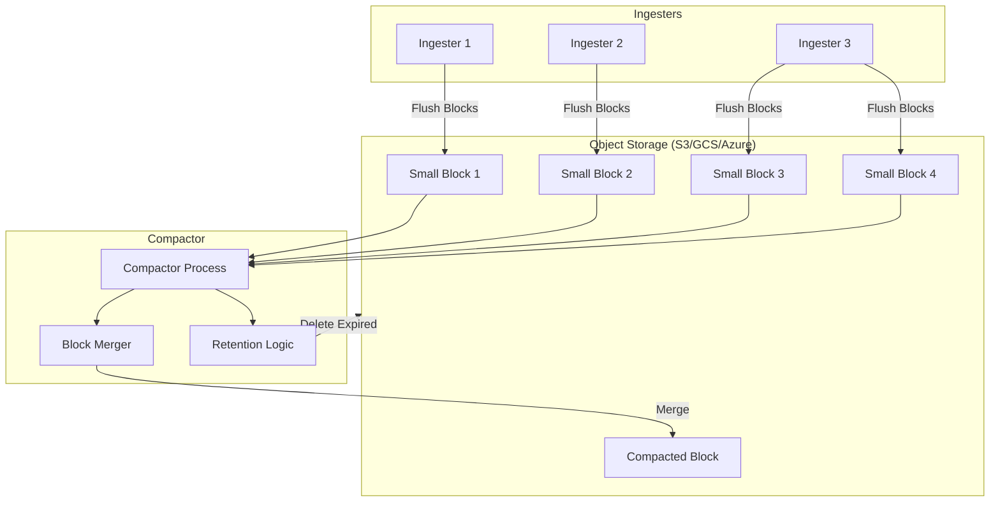
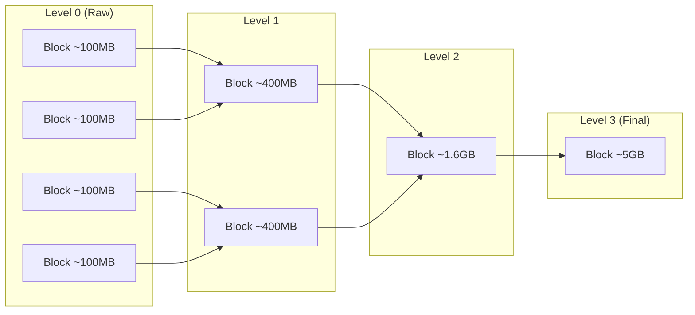

# How to Build Tempo Compactor Configuration

Author: [nawazdhandala](https://github.com/nawazdhandala)

Tags: Tempo, Observability, Storage, Optimization

Description: Learn how to configure Tempo's compactor component for efficient trace storage management and cost optimization.

---

Grafana Tempo is a high-scale distributed tracing backend that stores trace data efficiently. One of its most critical components for storage optimization is the compactor. The compactor is responsible for combining smaller blocks into larger ones, reducing storage costs, and managing data retention. In this guide, we will explore how to configure the Tempo compactor for optimal performance.

## Understanding the Compactor Component

The compactor runs as a separate process or as part of Tempo's single binary deployment. Its primary responsibilities include:

- Merging small blocks into larger, more efficient blocks
- Removing duplicate trace data
- Enforcing retention policies
- Managing block lifecycle transitions

Here is a visual representation of how the compactor works within the Tempo architecture:


```mermaid
flowchart TD
    subgraph Ingesters
        I1[Ingester 1]
        I2[Ingester 2]
        I3[Ingester 3]
    end

    subgraph ObjectStorage["Object Storage (S3/GCS/Azure)"]
        SB1[Small Block 1]
        SB2[Small Block 2]
        SB3[Small Block 3]
        SB4[Small Block 4]
        CB[Compacted Block]
    end

    subgraph Compactor
        C[Compactor Process]
        RL[Retention Logic]
        BM[Block Merger]
    end

    I1 -->|Flush Blocks| SB1
    I2 -->|Flush Blocks| SB2
    I3 -->|Flush Blocks| SB3
    I3 -->|Flush Blocks| SB4

    SB1 --> C
    SB2 --> C
    SB3 --> C
    SB4 --> C

    C --> BM
    BM -->|Merge| CB
    C --> RL
    RL -->|Delete Expired| ObjectStorage
```

## Basic Compactor Configuration

Let us start with a basic compactor configuration. The compactor settings are defined under the `compactor` block in your Tempo configuration file.

```yaml
# tempo.yaml - Basic compactor configuration

compactor:
  # The compactor ring is used for sharding compaction jobs
  ring:
    kvstore:
      store: memberlist  # Use memberlist for ring storage in distributed mode

  compaction:
    # Maximum size of a compacted block in bytes (5GB)
    max_block_bytes: 5368709120

    # Maximum number of objects per compacted block
    max_compaction_objects: 6000000

    # How often to run compaction cycles
    compaction_cycle: 30s

    # Retention period for blocks - traces older than this will be deleted
    block_retention: 336h  # 14 days
```

## Block Compaction Strategies

Tempo supports different compaction strategies based on your storage and performance requirements. The compaction process follows a tiered approach where blocks progress through compaction levels.

### Compaction Levels Explained


```mermaid
flowchart LR
    subgraph Level0["Level 0 (Raw)"]
        B1[Block ~100MB]
        B2[Block ~100MB]
        B3[Block ~100MB]
        B4[Block ~100MB]
    end

    subgraph Level1["Level 1"]
        B5[Block ~400MB]
        B6[Block ~400MB]
    end

    subgraph Level2["Level 2"]
        B7[Block ~1.6GB]
    end

    subgraph Level3["Level 3 (Final)"]
        B8[Block ~5GB]
    end

    B1 --> B5
    B2 --> B5
    B3 --> B6
    B4 --> B6

    B5 --> B7
    B6 --> B7

    B7 --> B8
```

### Advanced Compaction Configuration

```yaml
# tempo.yaml - Advanced compaction settings
compactor:
  ring:
    kvstore:
      store: consul
      consul:
        host: consul.example.com:8500

  compaction:
    # Time window for grouping blocks for compaction
    compaction_window: 4h

    # Maximum time to spend compacting a single tenant before moving on
    max_time_per_tenant: 5m

    # v2 encoding settings for better compression (only used with v2 block format)
    v2_in_buffer_bytes: 5242880   # 5MB input buffer
    v2_out_buffer_bytes: 20971520 # 20MB output buffer
    v2_prefetch_traces_count: 1000

    # How long compacted (input) blocks are kept before being deleted
    # This provides a safety buffer for in-flight queries
    compacted_block_retention: 1h

    # Maximum size of a single compacted block
    max_block_bytes: 107374182400  # 100GB maximum block size
```

## Retention and Lifecycle Management

Proper retention configuration ensures that old trace data is cleaned up while maintaining compliance with your data retention policies.

```yaml
# tempo.yaml - Retention and lifecycle settings
compactor:
  compaction:
    # Primary retention period for all blocks
    block_retention: 336h  # 14 days

    # How long to keep compacted (input) blocks before deletion
    # This provides a safety buffer
    compacted_block_retention: 1h

    # Number of tenants whose retention can be processed concurrently
    retention_concurrency: 10

# Storage configuration with lifecycle rules
storage:
  trace:
    backend: s3
    s3:
      bucket: tempo-traces
      endpoint: s3.amazonaws.com
      region: us-east-1

    # Block configuration
    block:
      # Bloom filter settings for query optimization
      bloom_filter_false_positive: 0.01
      bloom_filter_shard_size_bytes: 102400

      # Current default block format
      version: vParquet4

    # Write-Ahead Log settings
    wal:
      path: /var/tempo/wal

    # Local block storage for temporary files
    local:
      path: /var/tempo/blocks
```

### Multi-Tenant Retention Configuration

For deployments serving multiple tenants with different retention requirements:

```yaml
# tempo.yaml - Per-tenant retention overrides
overrides:
  # Default values applied to all tenants
  defaults:
    compaction:
      block_retention: 336h  # 14 days

  # Per-tenant overrides file
  per_tenant_override_config: /etc/tempo/overrides.yaml
```

```yaml
# overrides.yaml - Tenant-specific settings
overrides:
  tenant-a:
    # Premium tenant with longer retention
    compaction:
      block_retention: 720h  # 30 days
    ingestion:
      max_traces_per_user: 100000

  tenant-b:
    # Standard tenant with default retention
    compaction:
      block_retention: 168h  # 7 days
    ingestion:
      max_traces_per_user: 50000

  tenant-c:
    # Trial tenant with minimal retention
    compaction:
      block_retention: 48h  # 2 days
    ingestion:
      max_traces_per_user: 10000
```

## Compaction Window Configuration

The compaction window determines the time range of blocks that can be compacted together. Proper window configuration is essential for balancing compaction efficiency and query performance.


```mermaid
gantt
    title Compaction Window Timeline
    dateFormat HH:mm
    axisFormat %H:%M

    section Window 1
    Block A (Level 0)    :a1, 00:00, 1h
    Block B (Level 0)    :a2, 00:30, 1h
    Block C (Level 0)    :a3, 01:00, 1h
    Compacted Block      :crit, a4, 01:30, 2h

    section Window 2
    Block D (Level 0)    :b1, 04:00, 1h
    Block E (Level 0)    :b2, 04:30, 1h
    Block F (Level 0)    :b3, 05:00, 1h
    Compacted Block      :crit, b4, 05:30, 2h
```

### Window Configuration Example

```yaml
# tempo.yaml - Compaction window settings
compactor:
  compaction:
    # Time window for grouping blocks for compaction
    # Blocks within the same window are candidates for compaction
    compaction_window: 1h

    # How often to run a compaction cycle
    compaction_cycle: 30s

    # Maximum size of a single compacted output block
    max_block_bytes: 5368709120  # 5GB

ingester:
  # Ingester block lifecycle affects compaction input
  # Shorter times mean more small blocks for compaction
  max_block_duration: 5m
  max_block_bytes: 1073741824  # 1GB
  flush_all_on_shutdown: true

storage:
  trace:
    wal:
      # WAL path on local disk
      path: /var/tempo/wal
```

## Production Configuration Example

Here is a complete production-ready compactor configuration that combines all the concepts:

```yaml
# tempo-production.yaml
# Complete Tempo configuration with optimized compactor settings

server:
  http_listen_port: 3200
  grpc_listen_port: 9095

# Distributor receives traces and forwards to ingesters
distributor:
  receivers:
    otlp:
      protocols:
        grpc:
          endpoint: 0.0.0.0:4317
        http:
          endpoint: 0.0.0.0:4318

# Ingester writes traces to storage
ingester:
  max_block_duration: 5m
  max_block_bytes: 1073741824  # 1GB
  complete_block_timeout: 15m

# Compactor configuration for storage optimization
compactor:
  ring:
    kvstore:
      store: memberlist
    heartbeat_period: 5s
    heartbeat_timeout: 15s

  compaction:
    # Block size limits
    max_block_bytes: 5368709120        # 5GB max compacted block size
    max_compaction_objects: 6000000    # Max objects per compacted block

    # Timing configuration
    compaction_window: 4h              # 4-hour compaction windows
    compaction_cycle: 30s              # Run compaction every 30 seconds

    # Retention settings
    block_retention: 336h              # Keep blocks for 14 days
    compacted_block_retention: 1h      # Keep input blocks 1 hour after compaction

    # Performance tuning
    retention_concurrency: 10          # Tenant retention concurrency
    v2_in_buffer_bytes: 5242880        # 5MB input buffer (v2 only)
    v2_out_buffer_bytes: 20971520      # 20MB output buffer (v2 only)
    v2_prefetch_traces_count: 1000     # Prefetch 1000 traces (v2 only)

# Query frontend for distributed queries
query_frontend:
  search:
    max_duration: 0
    default_result_limit: 20

# Storage backend configuration
storage:
  trace:
    backend: s3
    s3:
      bucket: tempo-traces-production
      endpoint: s3.amazonaws.com
      region: us-east-1
      access_key: ${AWS_ACCESS_KEY_ID}
      secret_key: ${AWS_SECRET_ACCESS_KEY}

    block:
      version: vParquet4
      bloom_filter_false_positive: 0.01
      bloom_filter_shard_size_bytes: 102400

    wal:
      path: /var/tempo/wal

    local:
      path: /var/tempo/blocks

    pool:
      max_workers: 400
      queue_depth: 20000

# Memberlist for ring coordination
memberlist:
  join_members:
    - tempo-compactor-0.tempo-compactor.monitoring.svc.cluster.local:7946
    - tempo-compactor-1.tempo-compactor.monitoring.svc.cluster.local:7946
    - tempo-compactor-2.tempo-compactor.monitoring.svc.cluster.local:7946

# Override configurations per tenant
overrides:
  defaults:
    compaction:
      block_retention: 336h
    ingestion:
      max_traces_per_user: 50000
      rate_limit_bytes: 15000000
      burst_size_bytes: 20000000
    read:
      max_bytes_per_tag_values_query: 5000000
```

## Monitoring Compactor Performance

To ensure your compactor is running efficiently, monitor these key metrics:

```yaml
# Prometheus alerting rules for compactor monitoring
groups:
  - name: tempo-compactor-alerts
    rules:
      # Alert when compaction is falling behind
      - alert: TempoCompactorFallingBehind
        expr: |
          tempodb_compaction_outstanding_blocks > 100
        for: 15m
        labels:
          severity: warning
        annotations:
          summary: Tempo compactor is not keeping up with block creation

      # Alert when compaction errors occur
      - alert: TempoCompactionErrors
        expr: |
          rate(tempodb_compaction_errors_total[5m]) > 0
        for: 5m
        labels:
          severity: critical
        annotations:
          summary: Tempo compaction errors detected

      # Alert when retention is not being enforced
      - alert: TempoRetentionNotEnforced
        expr: |
          increase(tempodb_retention_deleted_total[24h]) == 0
        for: 24h
        labels:
          severity: warning
        annotations:
          summary: No blocks deleted in 24 hours - check retention config
```

## Best Practices Summary

1. **Size your compaction windows appropriately** - Larger windows mean more efficient compaction but require more memory during the compaction process.

2. **Set retention based on actual needs** - Longer retention increases storage costs significantly. Work with stakeholders to determine the minimum required retention.

3. **Monitor compaction lag** - If the compactor falls behind, you will have many small blocks which increases query latency and storage costs.

4. **Use the latest block format** - vParquet4 is the current default and provides the best compression and query performance for trace data.

5. **Configure per-tenant overrides** - Not all tenants need the same retention. Use overrides to optimize costs for different use cases.

6. **Plan for compactor resources** - The compactor needs sufficient CPU and memory to process blocks efficiently. Under-resourced compactors will fall behind.

By following this configuration guide, you can optimize your Tempo deployment for both performance and cost efficiency. The compactor is a critical component that, when properly configured, ensures your trace storage remains manageable as your observability data grows.
