# How to Build Tempo Compactor Configuration

Author: [nawazdhandala](https://github.com/nawazdhandala)

Tags: Tempo, Observability, Storage, Optimization

Description: Learn how to configure Tempo's compactor component for efficient trace storage management and cost optimization.

---

Grafana Tempo is a high-scale distributed tracing backend that stores trace data efficiently. One of its most critical components for storage optimization is the compactor. The compactor is responsible for combining smaller blocks into larger ones, reducing storage costs, and managing data retention. In this guide, we will explore how to configure the Tempo compactor for optimal performance.

## Understanding the Compactor Component

The compactor runs as a separate process or as part of Tempo's single binary deployment. Its primary responsibilities include:

- Merging small blocks into larger, more efficient blocks
- Removing duplicate trace data
- Enforcing retention policies
- Managing block lifecycle transitions

Here is a visual representation of how the compactor works within the Tempo architecture:


## Basic Compactor Configuration

Let us start with a basic compactor configuration. The compactor settings are defined under the `compactor` block in your Tempo configuration file.

```yaml
# tempo.yaml - Basic compactor configuration
compactor:
  # The compactor ring is used for sharding compaction jobs
  ring:
    kvstore:
      store: memberlist  # Use memberlist for ring storage in distributed mode

  compaction:
    # Maximum size of a compacted block in bytes (5GB)
    max_block_bytes: 5368709120

    # Maximum duration of traces in a compacted block
    max_compaction_range: 1h

    # Number of blocks to compact together
    max_compaction_objects: 6

    # How often to run compaction cycles
    compaction_cycle: 30s

    # Retention period for blocks - traces older than this will be deleted
    block_retention: 336h  # 14 days
```

## Block Compaction Strategies

Tempo supports different compaction strategies based on your storage and performance requirements. The compaction process follows a tiered approach where blocks progress through compaction levels.

### Compaction Levels Explained


### Advanced Compaction Configuration

```yaml
# tempo.yaml - Advanced compaction settings
compactor:
  ring:
    kvstore:
      store: consul
      consul:
        host: consul.example.com:8500

  compaction:
    # Level-based compaction settings
    # Blocks at each level are compacted when count exceeds this threshold
    compaction_window: 4h

    # Maximum number of compaction cycles running concurrently
    max_time_per_tenant: 5m

    # Block selector determines which blocks to compact
    # Options: time-window, none
    block_selector: time-window

    # v2 encoding settings for better compression
    v2_in_buffer_bytes: 5242880   # 5MB input buffer
    v2_out_buffer_bytes: 20971520 # 20MB output buffer
    v2_prefetch_traces_count: 1000

    # Enable iterating over all tenants during compaction
    # Useful for multi-tenant deployments
    compacted_block_retention: 1h

  # Resource limits to prevent compactor from consuming too many resources
  max_block_bytes: 107374182400  # 100GB maximum block size
```

## Retention and Lifecycle Management

Proper retention configuration ensures that old trace data is cleaned up while maintaining compliance with your data retention policies.

```yaml
# tempo.yaml - Retention and lifecycle settings
compactor:
  compaction:
    # Primary retention period for all blocks
    block_retention: 336h  # 14 days

    # How long to keep compacted blocks before deletion
    # This provides a safety buffer
    compacted_block_retention: 1h

    # Retention for blocks that could not be compacted
    # Usually due to corruption or other issues
    retention_concurrency: 10

# Storage configuration with lifecycle rules
storage:
  trace:
    backend: s3
    s3:
      bucket: tempo-traces
      endpoint: s3.amazonaws.com
      region: us-east-1

    # Block configuration
    block:
      # Bloom filter settings for query optimization
      bloom_filter_false_positive: 0.01
      bloom_filter_shard_size_bytes: 102400

      # Version 2 encoding provides better compression
      version: vParquet3

    # Write-Ahead Log settings
    wal:
      path: /var/tempo/wal
      encoding: snappy

    # Local block storage for temporary files
    local:
      path: /var/tempo/blocks
```

### Multi-Tenant Retention Configuration

For deployments serving multiple tenants with different retention requirements:

```yaml
# tempo.yaml - Per-tenant retention overrides
overrides:
  # Default retention for all tenants
  defaults:
    block_retention: 336h  # 14 days

  # Per-tenant overrides
  per_tenant_override_config: /etc/tempo/overrides.yaml
```

```yaml
# overrides.yaml - Tenant-specific settings
overrides:
  tenant-a:
    # Premium tenant with longer retention
    block_retention: 720h  # 30 days
    max_traces_per_user: 100000

  tenant-b:
    # Standard tenant with default retention
    block_retention: 168h  # 7 days
    max_traces_per_user: 50000

  tenant-c:
    # Trial tenant with minimal retention
    block_retention: 48h  # 2 days
    max_traces_per_user: 10000
```

## Compaction Window Configuration

The compaction window determines the time range of blocks that can be compacted together. Proper window configuration is essential for balancing compaction efficiency and query performance.

```mermaid
gantt
    title Compaction Window Timeline
    dateFormat HH:mm
    axisFormat %H:%M

    section Window 1
    Block A (Level 0)    :a1, 00:00, 1h
    Block B (Level 0)    :a2, 00:30, 1h
    Block C (Level 0)    :a3, 01:00, 1h
    Compacted Block      :crit, a4, 01:30, 2h

    section Window 2
    Block D (Level 0)    :b1, 04:00, 1h
    Block E (Level 0)    :b2, 04:30, 1h
    Block F (Level 0)    :b3, 05:00, 1h
    Compacted Block      :crit, b4, 05:30, 2h
```



### Window Configuration Example

```yaml
# tempo.yaml - Compaction window settings
compactor:
  compaction:
    # Time window for grouping blocks for compaction
    # Blocks within the same window are candidates for compaction
    compaction_window: 1h

    # Maximum range of time a single compacted block can span
    # Larger values mean fewer blocks but longer query times
    max_compaction_range: 6h

    # Number of tenants to process in parallel
    tenant_shard_size: 0  # 0 means all tenants

    # Time to wait before starting compaction after Tempo starts
    # Allows the system to stabilize
    compaction_cycle: 30s

storage:
  trace:
    # Block flush configuration affects compaction input
    block:
      # How long before flushing a block from memory
      # Shorter times mean more small blocks for compaction
      flush_all_on_shutdown: true

    wal:
      # WAL flush settings
      path: /var/tempo/wal

      # Flush WAL to block storage at this interval
      v2_encoding: snappy

      # Truncate WAL after this duration
      truncate_frequency: 15m

      # Compress WAL entries
      encoding: snappy
```

## Production Configuration Example

Here is a complete production-ready compactor configuration that combines all the concepts:

```yaml
# tempo-production.yaml
# Complete Tempo configuration with optimized compactor settings

server:
  http_listen_port: 3200
  grpc_listen_port: 9095

# Distributor receives traces and forwards to ingesters
distributor:
  receivers:
    otlp:
      protocols:
        grpc:
          endpoint: 0.0.0.0:4317
        http:
          endpoint: 0.0.0.0:4318

# Ingester writes traces to storage
ingester:
  max_block_duration: 5m
  max_block_bytes: 1073741824  # 1GB
  complete_block_timeout: 15m

# Compactor configuration for storage optimization
compactor:
  ring:
    kvstore:
      store: memberlist
    heartbeat_period: 5s
    heartbeat_timeout: 15s

  compaction:
    # Block size limits
    max_block_bytes: 5368709120        # 5GB max block size
    max_compaction_objects: 6          # Compact up to 6 blocks together
    max_compaction_range: 1h           # Max time range per block

    # Timing configuration
    compaction_window: 4h              # 4-hour compaction windows
    compaction_cycle: 30s              # Run compaction every 30 seconds

    # Retention settings
    block_retention: 336h              # Keep blocks for 14 days
    compacted_block_retention: 1h      # Keep compacted blocks 1 hour before cleanup

    # Performance tuning
    v2_in_buffer_bytes: 5242880        # 5MB input buffer
    v2_out_buffer_bytes: 20971520      # 20MB output buffer
    v2_prefetch_traces_count: 1000     # Prefetch 1000 traces

# Query frontend for distributed queries
query_frontend:
  search:
    max_duration: 0
    default_result_limit: 20

# Storage backend configuration
storage:
  trace:
    backend: s3
    s3:
      bucket: tempo-traces-production
      endpoint: s3.amazonaws.com
      region: us-east-1
      access_key: ${AWS_ACCESS_KEY_ID}
      secret_key: ${AWS_SECRET_ACCESS_KEY}

    block:
      version: vParquet3
      bloom_filter_false_positive: 0.01
      bloom_filter_shard_size_bytes: 102400
      v2_index_downsample_bytes: 1048576
      v2_encoding: zstd

    wal:
      path: /var/tempo/wal
      encoding: snappy
      v2_encoding: snappy
      truncate_frequency: 15m

    local:
      path: /var/tempo/blocks

    pool:
      max_workers: 400
      queue_depth: 20000

# Memberlist for ring coordination
memberlist:
  join_members:
    - tempo-compactor-0.tempo-compactor.monitoring.svc.cluster.local:7946
    - tempo-compactor-1.tempo-compactor.monitoring.svc.cluster.local:7946
    - tempo-compactor-2.tempo-compactor.monitoring.svc.cluster.local:7946

# Override configurations per tenant
overrides:
  defaults:
    block_retention: 336h
    max_traces_per_user: 50000
    max_bytes_per_tag_values_query: 5000000
    ingestion_rate_limit_bytes: 15000000
    ingestion_burst_size_bytes: 20000000
```

## Monitoring Compactor Performance

To ensure your compactor is running efficiently, monitor these key metrics:

```yaml
# Prometheus alerting rules for compactor monitoring
groups:
  - name: tempo-compactor-alerts
    rules:
      # Alert when compaction is falling behind
      - alert: TempoCompactorFallingBehind
        expr: |
          rate(tempodb_compaction_outstanding_blocks[5m]) > 0.1
        for: 15m
        labels:
          severity: warning
        annotations:
          summary: Tempo compactor is not keeping up with block creation

      # Alert when compaction errors occur
      - alert: TempoCompactionErrors
        expr: |
          rate(tempodb_compaction_errors_total[5m]) > 0
        for: 5m
        labels:
          severity: critical
        annotations:
          summary: Tempo compaction errors detected

      # Alert when retention is not being enforced
      - alert: TempoRetentionNotEnforced
        expr: |
          tempo_retention_deleted_blocks_total == 0
        for: 24h
        labels:
          severity: warning
        annotations:
          summary: No blocks deleted in 24 hours - check retention config
```

## Best Practices Summary

1. **Size your compaction windows appropriately** - Larger windows mean more efficient compaction but require more memory during the compaction process.

2. **Set retention based on actual needs** - Longer retention increases storage costs significantly. Work with stakeholders to determine the minimum required retention.

3. **Monitor compaction lag** - If the compactor falls behind, you will have many small blocks which increases query latency and storage costs.

4. **Use appropriate block encoding** - vParquet3 with zstd compression provides excellent compression ratios for trace data.

5. **Configure per-tenant overrides** - Not all tenants need the same retention. Use overrides to optimize costs for different use cases.

6. **Plan for compactor resources** - The compactor needs sufficient CPU and memory to process blocks efficiently. Under-resourced compactors will fall behind.

By following this configuration guide, you can optimize your Tempo deployment for both performance and cost efficiency. The compactor is a critical component that, when properly configured, ensures your trace storage remains manageable as your observability data grows.
