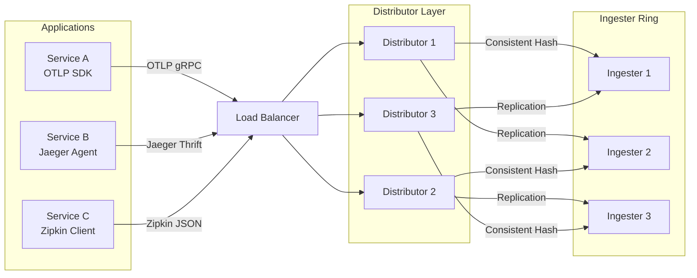
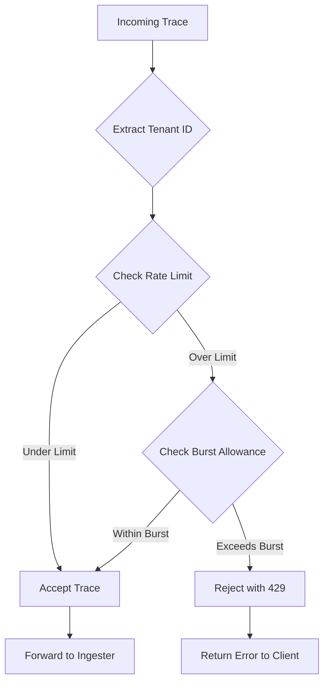
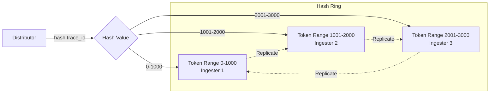

# How to Build Tempo Distributor Configuration

Author: [nawazdhandala](https://github.com/nawazdhandala)

Tags: Tempo, Observability, Tracing, Ingestion

Description: A practical guide to configuring Grafana Tempo's distributor component for high-performance trace ingestion with OTLP, Jaeger, and Zipkin receivers.

---

> The distributor is the front door to your Tempo cluster. It receives traces from instrumented applications, validates them, applies rate limits, and routes them to the right ingesters. Get it wrong and you drop data or overload your cluster. Get it right and you have a scalable, reliable tracing pipeline.

This guide walks through everything you need to configure Tempo's distributor for production: receiver setup, rate limiting, tenant isolation, load balancing, and practical YAML examples you can adapt for your own deployments.

---

## Table of Contents

1. What the Distributor Does
2. Architecture Overview
3. Receivers Configuration
4. Rate Limiting and Tenant Limits
5. Load Balancing to Ingesters
6. Full Configuration Example
7. Deployment Considerations
8. Monitoring the Distributor
9. Common Issues and Fixes

---

## 1. What the Distributor Does

The distributor is Tempo's ingestion gateway. Every trace that enters your system passes through it first.

| Responsibility | What It Does |
|----------------|--------------|
| Protocol Translation | Accepts traces in multiple formats (OTLP, Jaeger, Zipkin) and normalizes them |
| Validation | Checks trace structure, rejects malformed data |
| Rate Limiting | Enforces per-tenant ingestion limits to protect the cluster |
| Tenant Routing | Extracts tenant ID from headers and routes accordingly |
| Load Balancing | Distributes traces across ingester replicas using consistent hashing |
| Replication | Sends each trace to multiple ingesters for durability |

The distributor is stateless. You can scale it horizontally by adding more replicas behind a load balancer.

---

## 2. Architecture Overview

Here is how traces flow from your applications through the distributor to ingesters:



Key points:
- Applications send traces to any distributor via a load balancer
- Distributors use consistent hashing on trace ID to pick the primary ingester
- Each trace is replicated to N ingesters (configurable replication factor)
- Ingesters form a hash ring for even distribution

---

## 3. Receivers Configuration

Tempo supports multiple trace protocols out of the box. Configure receivers in the `distributor` section of your Tempo config.

### OTLP Receiver (Recommended)

OTLP (OpenTelemetry Protocol) is the standard for modern instrumentation. It supports both gRPC and HTTP.

```yaml
# tempo.yaml
distributor:
  receivers:
    otlp:
      protocols:
        # gRPC receiver on port 4317 (high performance, binary protocol)
        grpc:
          endpoint: "0.0.0.0:4317"
          # Maximum message size in bytes (default: 4MB)
          max_recv_msg_size_mib: 16
          # Enable TLS for production
          # tls:
          #   cert_file: /etc/tempo/certs/server.crt
          #   key_file: /etc/tempo/certs/server.key

        # HTTP receiver on port 4318 (JSON, easier debugging)
        http:
          endpoint: "0.0.0.0:4318"
          # CORS settings for browser-based instrumentation
          cors:
            allowed_origins:
              - "https://myapp.example.com"
            allowed_headers:
              - "Content-Type"
              - "X-Scope-OrgID"
```

### Jaeger Receiver

For applications still using Jaeger SDKs or agents:

```yaml
distributor:
  receivers:
    jaeger:
      protocols:
        # Thrift over HTTP (most common for Jaeger agents)
        thrift_http:
          endpoint: "0.0.0.0:14268"

        # Thrift over UDP (lightweight, fire-and-forget)
        thrift_compact:
          endpoint: "0.0.0.0:6831"

        # Thrift binary protocol
        thrift_binary:
          endpoint: "0.0.0.0:6832"

        # gRPC protocol (Jaeger 1.35+)
        grpc:
          endpoint: "0.0.0.0:14250"
```

### Zipkin Receiver

For Zipkin-instrumented applications:

```yaml
distributor:
  receivers:
    zipkin:
      # Zipkin v2 JSON over HTTP
      endpoint: "0.0.0.0:9411"
```

### Combined Multi-Protocol Configuration

A production setup typically enables multiple receivers:

```yaml
# Production-ready receiver configuration
distributor:
  receivers:
    otlp:
      protocols:
        grpc:
          endpoint: "0.0.0.0:4317"
          max_recv_msg_size_mib: 16
        http:
          endpoint: "0.0.0.0:4318"

    jaeger:
      protocols:
        thrift_http:
          endpoint: "0.0.0.0:14268"
        grpc:
          endpoint: "0.0.0.0:14250"

    zipkin:
      endpoint: "0.0.0.0:9411"
```

---

## 4. Rate Limiting and Tenant Limits

Rate limiting protects your cluster from misbehaving clients or traffic spikes. Tempo applies limits per tenant.

### Global Rate Limits

These limits apply cluster-wide:

```yaml
# Overrides configuration for rate limiting
overrides:
  defaults:
    ingestion:
      # Maximum spans per second across all distributors for this tenant
      rate_limit_bytes: 15000000  # 15 MB/s

      # Burst allowance (short-term spike tolerance)
      burst_size_bytes: 20000000  # 20 MB burst

    # Maximum number of traces in memory per ingester
    max_traces_per_user: 50000

    # Maximum bytes per trace (reject traces larger than this)
    max_bytes_per_trace: 5000000  # 5 MB
```

### Per-Tenant Overrides

Different tenants can have different limits:

```yaml
overrides:
  defaults:
    ingestion:
      rate_limit_bytes: 5000000
      burst_size_bytes: 10000000

  # Per-tenant overrides
  per_tenant_override_config: /etc/tempo/overrides.yaml
```

Create a separate overrides file:

```yaml
# /etc/tempo/overrides.yaml
overrides:
  # High-volume production tenant
  tenant-prod:
    ingestion:
      rate_limit_bytes: 50000000   # 50 MB/s
      burst_size_bytes: 100000000  # 100 MB burst
    max_traces_per_user: 200000

  # Development tenant with lower limits
  tenant-dev:
    ingestion:
      rate_limit_bytes: 1000000    # 1 MB/s
      burst_size_bytes: 2000000    # 2 MB burst
    max_traces_per_user: 10000
```

### Rate Limiting Flow



### Tenant ID Extraction

The distributor extracts tenant ID from the `X-Scope-OrgID` header:

```yaml
# Multi-tenant configuration
multitenancy_enabled: true

# Header name for tenant ID (default: X-Scope-OrgID)
distributor:
  receivers:
    otlp:
      protocols:
        grpc:
          endpoint: "0.0.0.0:4317"
```

Clients must include the tenant header:

```bash
# Sending traces with tenant ID
curl -X POST http://tempo:4318/v1/traces \
  -H "Content-Type: application/json" \
  -H "X-Scope-OrgID: tenant-prod" \
  -d @traces.json
```

---

## 5. Load Balancing to Ingesters

The distributor uses consistent hashing to distribute traces across ingesters evenly.

### Ring Configuration

```yaml
# Ingester ring configuration (used by distributor)
ingester:
  lifecycler:
    ring:
      kvstore:
        # Use memberlist for peer discovery (no external dependencies)
        store: memberlist

      # Number of ingesters to replicate each trace to
      replication_factor: 3

    # Number of tokens per ingester in the hash ring
    # More tokens = more even distribution
    num_tokens: 512

    # Heartbeat interval to the ring
    heartbeat_period: 5s

# Memberlist configuration for ring discovery
memberlist:
  # Addresses of other Tempo instances for gossip
  join_members:
    - tempo-0.tempo-headless:7946
    - tempo-1.tempo-headless:7946
    - tempo-2.tempo-headless:7946

  # Port for memberlist communication
  bind_port: 7946
```

### Hash Ring Distribution



### Replication and Consistency

```yaml
# Distributor settings for ingester communication
distributor:
  # How long to wait for ingester responses
  ring_check_period: 5s

  # Require this many successful writes for success
  # Should be <= replication_factor
  # Quorum = (replication_factor / 2) + 1
  receivers:
    otlp:
      protocols:
        grpc:
          endpoint: "0.0.0.0:4317"

# The replication factor determines durability
# With replication_factor: 3, traces survive 2 ingester failures
ingester:
  lifecycler:
    ring:
      replication_factor: 3
```

---

## 6. Full Configuration Example

Here is a complete production-ready Tempo configuration focused on the distributor:

```yaml
# tempo.yaml - Production Distributor Configuration

# Enable multi-tenancy
multitenancy_enabled: true

# Server configuration
server:
  http_listen_port: 3200
  grpc_listen_port: 9095
  log_level: info

# Distributor configuration
distributor:
  receivers:
    # OTLP receiver (primary, recommended for new instrumentation)
    otlp:
      protocols:
        grpc:
          endpoint: "0.0.0.0:4317"
          max_recv_msg_size_mib: 16
        http:
          endpoint: "0.0.0.0:4318"
          cors:
            allowed_origins:
              - "*"
            allowed_headers:
              - "*"

    # Jaeger receiver (for legacy Jaeger clients)
    jaeger:
      protocols:
        thrift_http:
          endpoint: "0.0.0.0:14268"
        grpc:
          endpoint: "0.0.0.0:14250"

    # Zipkin receiver (for Zipkin clients)
    zipkin:
      endpoint: "0.0.0.0:9411"

  # Log received spans for debugging (disable in production)
  log_received_spans:
    enabled: false

# Ingester configuration
ingester:
  # Trace retention in memory before flushing
  max_block_duration: 5m

  lifecycler:
    ring:
      kvstore:
        store: memberlist
      replication_factor: 3
    num_tokens: 512
    heartbeat_period: 5s
    heartbeat_timeout: 1m
    final_sleep: 0s

# Memberlist for ring discovery
memberlist:
  abort_if_cluster_join_fails: false
  join_members:
    - tempo-0.tempo-headless.tempo.svc.cluster.local:7946
    - tempo-1.tempo-headless.tempo.svc.cluster.local:7946
    - tempo-2.tempo-headless.tempo.svc.cluster.local:7946
  bind_port: 7946

# Storage configuration
storage:
  trace:
    backend: s3
    s3:
      bucket: tempo-traces
      endpoint: s3.amazonaws.com
      region: us-east-1

# Rate limits and tenant overrides
overrides:
  defaults:
    ingestion:
      rate_limit_bytes: 15000000
      burst_size_bytes: 30000000
    max_traces_per_user: 50000
    max_bytes_per_trace: 5000000
    max_search_bytes_per_trace: 5000

  # Enable per-tenant overrides from file
  per_tenant_override_config: /etc/tempo/overrides.yaml
  per_tenant_override_period: 30s

# Metrics generator (optional, for span metrics)
metrics_generator:
  registry:
    external_labels:
      source: tempo
  storage:
    path: /var/tempo/generator/wal
    remote_write:
      - url: http://prometheus:9090/api/v1/write
```

---

## 7. Deployment Considerations

### Kubernetes Deployment

Deploy distributors as a separate deployment for independent scaling:

```yaml
# distributor-deployment.yaml
apiVersion: apps/v1
kind: Deployment
metadata:
  name: tempo-distributor
  namespace: tempo
spec:
  replicas: 3
  selector:
    matchLabels:
      app: tempo
      component: distributor
  template:
    metadata:
      labels:
        app: tempo
        component: distributor
    spec:
      containers:
        - name: distributor
          image: grafana/tempo:2.3.0
          args:
            - -target=distributor
            - -config.file=/etc/tempo/tempo.yaml
          ports:
            - name: otlp-grpc
              containerPort: 4317
            - name: otlp-http
              containerPort: 4318
            - name: jaeger-thrift
              containerPort: 14268
            - name: jaeger-grpc
              containerPort: 14250
            - name: zipkin
              containerPort: 9411
            - name: memberlist
              containerPort: 7946
          resources:
            requests:
              cpu: 500m
              memory: 512Mi
            limits:
              cpu: 2000m
              memory: 2Gi
          volumeMounts:
            - name: config
              mountPath: /etc/tempo
      volumes:
        - name: config
          configMap:
            name: tempo-config
---
# Service for distributor
apiVersion: v1
kind: Service
metadata:
  name: tempo-distributor
  namespace: tempo
spec:
  selector:
    app: tempo
    component: distributor
  ports:
    - name: otlp-grpc
      port: 4317
      targetPort: 4317
    - name: otlp-http
      port: 4318
      targetPort: 4318
    - name: jaeger-thrift
      port: 14268
      targetPort: 14268
    - name: zipkin
      port: 9411
      targetPort: 9411
```

### Resource Sizing

| Cluster Size | Distributor Replicas | CPU Request | Memory Request |
|--------------|---------------------|-------------|----------------|
| Small (< 10K spans/s) | 2 | 250m | 256Mi |
| Medium (10-100K spans/s) | 3 | 500m | 512Mi |
| Large (100K-1M spans/s) | 5 | 1000m | 1Gi |
| Very Large (> 1M spans/s) | 10+ | 2000m | 2Gi |

---

## 8. Monitoring the Distributor

### Key Metrics to Watch

```yaml
# Prometheus alerting rules for distributor
groups:
  - name: tempo-distributor
    rules:
      # Alert on high ingestion rate
      - alert: TempoDistributorHighIngestionRate
        expr: |
          sum(rate(tempo_distributor_bytes_received_total[5m])) > 100000000
        for: 5m
        labels:
          severity: warning
        annotations:
          summary: "Tempo distributor receiving high volume"

      # Alert on rate limiting
      - alert: TempoDistributorRateLimited
        expr: |
          sum(rate(tempo_discarded_spans_total{reason="rate_limited"}[5m])) > 0
        for: 1m
        labels:
          severity: critical
        annotations:
          summary: "Tempo is rate limiting spans"

      # Alert on ingester write failures
      - alert: TempoDistributorIngesterWriteFailures
        expr: |
          sum(rate(tempo_distributor_ingester_append_failures_total[5m])) > 0
        for: 5m
        labels:
          severity: critical
        annotations:
          summary: "Distributor failing to write to ingesters"
```

### Important Distributor Metrics

| Metric | Description | Alert Threshold |
|--------|-------------|-----------------|
| `tempo_distributor_bytes_received_total` | Total bytes received per tenant | Monitor for capacity |
| `tempo_distributor_spans_received_total` | Total spans received | Track ingestion rate |
| `tempo_discarded_spans_total` | Spans dropped (by reason) | Any rate_limited > 0 |
| `tempo_distributor_ingester_appends_total` | Successful writes to ingesters | Should match received |
| `tempo_distributor_ingester_append_failures_total` | Failed writes to ingesters | Should be 0 |

---

## 9. Common Issues and Fixes

### Issue: Traces Not Appearing

**Symptoms:** Applications send traces but nothing shows in Tempo.

**Diagnosis:**
```bash
# Check distributor logs
kubectl logs -l component=distributor -n tempo

# Check metrics for received spans
curl http://tempo-distributor:3200/metrics | grep tempo_distributor_spans_received
```

**Common causes:**
1. Wrong receiver port or protocol
2. Missing or incorrect tenant header
3. Rate limiting active

### Issue: Rate Limiting

**Symptoms:** `429 Too Many Requests` errors from distributor.

**Fix:** Increase limits for the affected tenant:

```yaml
overrides:
  tenant-high-volume:
    ingestion:
      rate_limit_bytes: 100000000  # Increase limit
      burst_size_bytes: 200000000  # Increase burst
```

### Issue: Ingester Write Failures

**Symptoms:** `tempo_distributor_ingester_append_failures_total` increasing.

**Diagnosis:**
```bash
# Check ingester health
curl http://tempo:3200/ready

# Check ring status
curl http://tempo:3200/ring
```

**Common causes:**
1. Ingesters unhealthy or unreachable
2. Network issues between distributor and ingester
3. Ingesters overloaded

### Issue: Uneven Load Distribution

**Symptoms:** Some ingesters receive more traffic than others.

**Fix:** Increase token count for better distribution:

```yaml
ingester:
  lifecycler:
    num_tokens: 1024  # Increase from default 512
```

---

## Summary

The Tempo distributor is the critical entry point for your tracing pipeline. A well-configured distributor ensures:

| Goal | Configuration |
|------|---------------|
| Protocol flexibility | Enable OTLP, Jaeger, and Zipkin receivers |
| Cluster protection | Set appropriate rate limits per tenant |
| High availability | Run multiple distributor replicas |
| Even distribution | Use consistent hashing with sufficient tokens |
| Durability | Configure replication factor >= 3 |

Start with the full configuration example above and adjust limits based on your actual traffic patterns. Monitor the distributor metrics closely during initial rollout to catch issues early.

---

## Related Reading

- [Traces and Spans in OpenTelemetry](/blog/post/2025-08-27-traces-and-spans-in-opentelemetry/view) - Understand what traces look like before they hit Tempo
- [What is OpenTelemetry Collector](/blog/post/2025-09-18-what-is-opentelemetry-collector-and-why-use-one/view) - Configure the collector to send traces to Tempo
- [How to Reduce Noise in OpenTelemetry](/blog/post/2025-08-25-how-to-reduce-noise-in-opentelemetry/view) - Filter traces before ingestion to reduce load

---

*Running Tempo in production? [OneUptime](https://oneuptime.com) provides a fully managed observability platform with native OpenTelemetry support for traces, metrics, and logs.*
