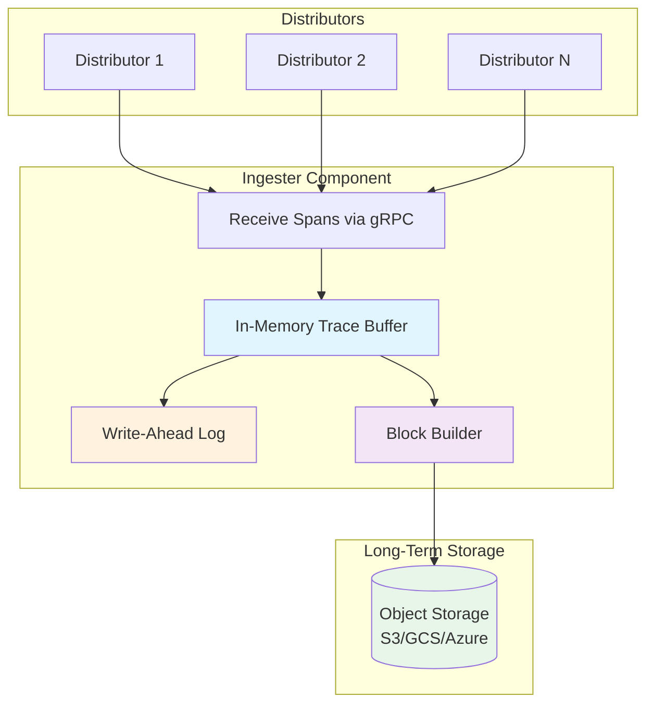
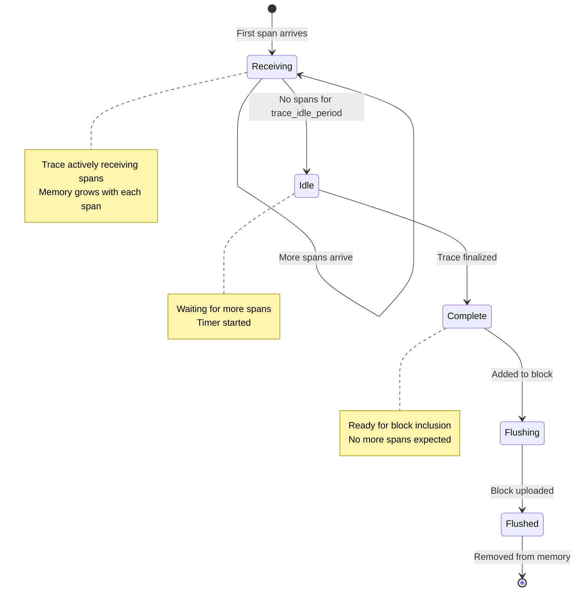
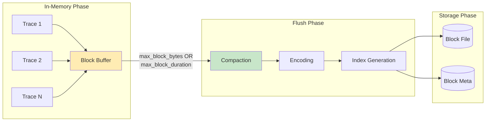
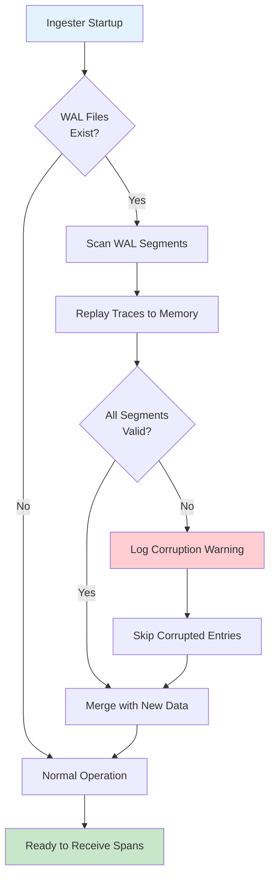

# How to Implement Tempo Ingester Configuration

Author: [nawazdhandala](https://github.com/nawazdhandala)

Tags: Tempo, Observability, Tracing, Storage

Description: A practical guide to configuring Tempo ingesters for efficient trace storage, covering lifecycle management, block flushing, memory limits, and performance tuning.

---

Grafana Tempo is a high-scale, cost-effective distributed tracing backend. At the heart of Tempo's architecture sits the **ingester**, the component responsible for receiving trace data, buffering it in memory, and eventually flushing it to long-term storage. Proper ingester configuration directly impacts trace durability, query performance, and resource consumption.

This guide walks through ingester component settings, trace lifecycle management, block flushing strategies, and memory/concurrency limits with practical examples you can adapt for production.

---

## Table of Contents

1. What is the Tempo Ingester?
2. Ingester Data Flow
3. Core Ingester Settings
4. Trace Lifecycle Management
5. Block Flushing Configuration
6. Memory and Concurrency Limits
7. Write-Ahead Log (WAL) Configuration
8. Complete Configuration Example
9. Monitoring Ingester Health
10. Common Pitfalls and Best Practices

---

## 1. What is the Tempo Ingester?

The ingester is the write path component in Tempo. It:

- Receives spans from distributors via gRPC
- Buffers traces in memory organized by trace ID
- Writes to a local Write-Ahead Log (WAL) for durability
- Periodically flushes completed blocks to object storage (S3, GCS, Azure Blob, etc.)

Think of the ingester as a temporary staging area where traces live before being compacted and stored permanently.

| Responsibility | Description |
|----------------|-------------|
| Receive spans | Accepts incoming span data from distributors |
| Buffer traces | Holds trace data in memory indexed by trace ID |
| WAL persistence | Writes to disk for crash recovery |
| Block creation | Groups traces into blocks for efficient storage |
| Flush to backend | Uploads completed blocks to object storage |

---

## 2. Ingester Data Flow

Understanding how data moves through the ingester helps you tune configuration effectively.



**Flow explanation:**

1. **Receive**: Distributors send spans to ingesters based on consistent hashing of trace IDs
2. **Buffer**: Spans are grouped by trace ID in memory
3. **WAL Write**: Each incoming batch is written to the WAL for durability
4. **Block Creation**: After a trace is considered complete (based on timeout), it moves to block building
5. **Flush**: Completed blocks are uploaded to object storage and WAL entries are cleared

---

## 3. Core Ingester Settings

The ingester configuration lives under the `ingester` key in your Tempo config file.

```yaml
# tempo.yaml - Basic ingester configuration
ingester:
  # Maximum time a trace can remain in the ingester
  # Traces older than this are force-flushed
  max_block_duration: 5m

  # Number of traces to buffer before creating a block
  max_block_bytes: 1073741824  # 1GB

  # How often to check for traces ready to flush
  flush_check_period: 10s

  # Ring configuration for ingester coordination
  lifecycler:
    ring:
      kvstore:
        store: memberlist
      replication_factor: 3

    # How long to wait before joining the ring
    join_after: 10s

    # Time to wait before marking unhealthy ingesters as dead
    observe_period: 10s

    # Minimum time to remain in LEAVING state
    min_ready_duration: 15s

  # Concurrent flushes to object storage
  concurrent_flushes: 4

  # Trace configuration
  trace_idle_period: 30s
  flush_all_on_shutdown: true
```

### Key Parameters Explained

| Parameter | Default | Description |
|-----------|---------|-------------|
| `max_block_duration` | 5m | Maximum time before a block is force-flushed |
| `max_block_bytes` | 1GB | Size threshold triggering block flush |
| `flush_check_period` | 10s | Interval for flush eligibility checks |
| `trace_idle_period` | 30s | Time after last span before trace is considered complete |
| `concurrent_flushes` | 4 | Parallel uploads to object storage |
| `flush_all_on_shutdown` | true | Ensure data durability on graceful shutdown |

---

## 4. Trace Lifecycle Management

A trace moves through several states in the ingester. Understanding this lifecycle helps you tune timeouts appropriately.



### Lifecycle Configuration

```yaml
# tempo.yaml - Trace lifecycle tuning
ingester:
  # Time to wait for more spans before marking trace complete
  # Shorter = faster flush but may split long-running traces
  # Longer = better trace completeness but higher memory usage
  trace_idle_period: 30s

  # Maximum trace duration regardless of activity
  # Protects against unbounded memory growth from stuck traces
  max_trace_idle_period: 5m

  # Maximum number of spans per trace
  # Prevents single traces from consuming excessive memory
  max_spans_per_trace: 50000
```

### Trace Lifecycle Timeline Example

Consider a trace for an HTTP request that spans multiple services:

```
Time 0s:    First span arrives (HTTP request received)
Time 0.1s:  Child span (database query)
Time 0.5s:  Child span (external API call)
Time 2s:    Child span (response sent)
Time 32s:   trace_idle_period exceeded (30s since last span)
Time 32s:   Trace marked COMPLETE
Time 42s:   flush_check_period triggers
Time 42s:   Trace added to current block
Time 47s:   Block size threshold reached
Time 47s:   Block flushed to object storage
```

---

## 5. Block Flushing Configuration

Blocks are the fundamental storage unit in Tempo. Proper flushing configuration balances write amplification against memory pressure.

```yaml
# tempo.yaml - Block flushing settings
ingester:
  # Primary flush triggers
  max_block_duration: 5m      # Time-based trigger
  max_block_bytes: 1073741824 # Size-based trigger (1GB)

  # Flush scheduling
  flush_check_period: 10s     # How often to check flush conditions
  concurrent_flushes: 4       # Parallel flush operations

  # Flush behavior
  flush_op_timeout: 5m        # Timeout for individual flush operations
  flush_all_on_shutdown: true # Drain on graceful shutdown
```

### Block Lifecycle Diagram



### Flush Trigger Conditions

A block flush occurs when ANY of these conditions is met:

```python
# Pseudocode for flush decision
def should_flush(block):
    # Time-based: block has been open too long
    if block.age >= max_block_duration:
        return True

    # Size-based: block reached size threshold
    if block.size >= max_block_bytes:
        return True

    # Shutdown: drain everything
    if shutdown_requested and flush_all_on_shutdown:
        return True

    return False
```

### Tuning Flush Settings for Different Workloads

**High-throughput environments (>100k spans/sec):**

```yaml
ingester:
  max_block_duration: 2m       # Shorter blocks, more frequent flushes
  max_block_bytes: 536870912   # 512MB blocks
  concurrent_flushes: 8        # More parallel uploads
  flush_check_period: 5s       # Check more frequently
```

**Low-throughput environments (<1k spans/sec):**

```yaml
ingester:
  max_block_duration: 10m      # Allow blocks to accumulate
  max_block_bytes: 268435456   # 256MB blocks
  concurrent_flushes: 2        # Fewer parallel operations
  flush_check_period: 30s      # Less frequent checks
```

---

## 6. Memory and Concurrency Limits

Memory management is critical for ingester stability. Without proper limits, a spike in trace volume can cause OOM crashes.

```yaml
# tempo.yaml - Memory and concurrency limits
ingester:
  # Per-trace limits
  max_spans_per_trace: 50000    # Maximum spans in a single trace
  max_bytes_per_trace: 5000000  # 5MB per trace maximum

  # Global ingester limits
  max_traces: 100000            # Maximum concurrent traces in memory

  # gRPC server limits for receiving spans
  grpc_server_max_recv_msg_size: 4194304   # 4MB max message
  grpc_server_max_send_msg_size: 4194304   # 4MB max message
  grpc_server_max_concurrent_streams: 1000

overrides:
  # Per-tenant overrides (multi-tenant deployments)
  defaults:
    ingestion_rate_limit_bytes: 15000000  # 15MB/s per tenant
    ingestion_burst_size_bytes: 20000000  # 20MB burst allowed
    max_traces_per_user: 50000            # Per-tenant trace limit
    max_bytes_per_trace: 5000000          # 5MB per trace
```

### Memory Usage Calculation

Estimate ingester memory requirements:

```
Memory = (avg_trace_size * max_traces) + (block_buffer * 2) + overhead

Example:
- avg_trace_size: 10KB
- max_traces: 100,000
- block_buffer: 1GB
- overhead: 500MB

Memory = (10KB * 100,000) + (1GB * 2) + 500MB
       = 1GB + 2GB + 500MB
       = 3.5GB minimum
```

### Concurrency Settings

```yaml
# tempo.yaml - Concurrency configuration
ingester:
  # Flush concurrency
  concurrent_flushes: 4

  # WAL configuration affects write concurrency
  wal:
    # Number of WAL segments to keep
    wal_segments: 10

    # Encoding for WAL entries
    encoding: snappy

    # Search encoding in WAL
    search_encoding: snappy

    # Ingestion concurrency
    ingestion_time_range_slack: 2m
```

### Resource Requests for Kubernetes

Based on your configuration, set appropriate resource limits:

```yaml
# Kubernetes deployment resource configuration
apiVersion: apps/v1
kind: StatefulSet
metadata:
  name: tempo-ingester
spec:
  template:
    spec:
      containers:
      - name: ingester
        resources:
          requests:
            memory: "4Gi"      # Based on memory calculation
            cpu: "2"           # 2 cores for flush operations
          limits:
            memory: "8Gi"      # 2x requests for safety
            cpu: "4"           # Allow burst CPU for compaction
        env:
        - name: GOMAXPROCS
          value: "4"          # Match CPU limit
```

---

## 7. Write-Ahead Log (WAL) Configuration

The WAL provides durability for in-flight traces. If an ingester crashes, the WAL allows recovery of unflushed data.

```yaml
# tempo.yaml - WAL configuration
ingester:
  wal:
    # Directory for WAL files
    path: /var/tempo/wal

    # Encoding for WAL data (none, gzip, lz4, snappy, zstd)
    encoding: snappy

    # Search data encoding
    search_encoding: snappy

    # WAL segment configuration
    wal_segments: 10

    # Version 2 WAL format (recommended)
    version: v2

    # Ingestion slack time
    # Allows spans with timestamps slightly in the future
    ingestion_time_range_slack: 2m
```

### WAL Recovery Process



### WAL Sizing Guidelines

```yaml
# Calculate WAL size requirements
# WAL size = ingestion_rate * max_block_duration * safety_factor

# Example:
# - Ingestion rate: 50MB/min
# - max_block_duration: 5m
# - safety_factor: 2x

# WAL size = 50MB/min * 5min * 2 = 500MB

# Storage configuration
ingester:
  wal:
    path: /var/tempo/wal

storage:
  wal:
    # Use fast local storage (SSD recommended)
    path: /var/tempo/wal
```

---

## 8. Complete Configuration Example

Here is a production-ready ingester configuration:

```yaml
# tempo.yaml - Complete production configuration

# Server configuration
server:
  http_listen_port: 3200
  grpc_listen_port: 9095
  grpc_server_max_recv_msg_size: 4194304
  grpc_server_max_send_msg_size: 4194304

# Distributor configuration (for context)
distributor:
  receivers:
    otlp:
      protocols:
        grpc:
          endpoint: 0.0.0.0:4317
        http:
          endpoint: 0.0.0.0:4318

# Ingester configuration
ingester:
  # Block management
  max_block_duration: 5m
  max_block_bytes: 1073741824  # 1GB

  # Flush settings
  flush_check_period: 10s
  concurrent_flushes: 4
  flush_op_timeout: 5m
  flush_all_on_shutdown: true

  # Trace lifecycle
  trace_idle_period: 30s
  max_trace_idle_period: 5m

  # Per-trace limits
  max_spans_per_trace: 50000
  max_bytes_per_trace: 5000000

  # Global limits
  max_traces: 100000

  # Lifecycler (ring membership)
  lifecycler:
    ring:
      kvstore:
        store: memberlist
      replication_factor: 3
    join_after: 10s
    observe_period: 10s
    min_ready_duration: 15s
    final_sleep: 30s
    num_tokens: 512
    heartbeat_period: 5s
    heartbeat_timeout: 1m

  # WAL configuration
  wal:
    path: /var/tempo/wal
    encoding: snappy
    search_encoding: snappy
    version: v2
    ingestion_time_range_slack: 2m

# Storage configuration
storage:
  trace:
    backend: s3
    s3:
      bucket: tempo-traces
      endpoint: s3.amazonaws.com
      region: us-east-1
      access_key: ${AWS_ACCESS_KEY_ID}
      secret_key: ${AWS_SECRET_ACCESS_KEY}

    # Block storage settings
    block:
      version: vParquet3
      bloom_filter_false_positive: 0.01
      v2_index_downsample_bytes: 1000
      v2_encoding: zstd

    # WAL storage
    wal:
      path: /var/tempo/wal

    # Local cache for blocks
    cache: memcached
    memcached:
      consistent_hash: true
      host: memcached.tempo.svc:11211
      service: memcached-client
      timeout: 500ms

# Per-tenant overrides
overrides:
  defaults:
    ingestion_rate_limit_bytes: 15000000
    ingestion_burst_size_bytes: 20000000
    max_traces_per_user: 50000
    max_bytes_per_trace: 5000000
    max_search_bytes_per_trace: 5000000

  # Per-tenant overrides
  per_tenant_override_config: /etc/tempo/overrides.yaml

# Compactor configuration (affects long-term storage)
compactor:
  compaction:
    block_retention: 336h  # 14 days
    compacted_block_retention: 1h
    compaction_window: 1h
    max_compaction_objects: 1000000
    max_block_bytes: 107374182400  # 100GB
  ring:
    kvstore:
      store: memberlist

# Memberlist configuration for ring
memberlist:
  abort_if_cluster_join_fails: false
  bind_port: 7946
  join_members:
    - tempo-gossip-ring.tempo.svc:7946
```

---

## 9. Monitoring Ingester Health

Monitor these key metrics to ensure ingester health:

### Essential Metrics

```yaml
# Prometheus recording rules for ingester monitoring
groups:
- name: tempo_ingester
  rules:
  # Traces in memory
  - record: tempo:ingester_traces_created:rate5m
    expr: rate(tempo_ingester_traces_created_total[5m])

  # Flush rate and latency
  - record: tempo:ingester_flush_duration:p99
    expr: histogram_quantile(0.99, rate(tempo_ingester_flush_duration_seconds_bucket[5m]))

  # Block size
  - record: tempo:ingester_bytes_received:rate5m
    expr: rate(tempo_ingester_bytes_received_total[5m])

  # WAL health
  - record: tempo:ingester_wal_replay_duration:avg
    expr: avg(tempo_ingester_wal_replay_duration_seconds)
```

### Alerting Rules

```yaml
# Prometheus alerting rules
groups:
- name: tempo_ingester_alerts
  rules:
  # High memory usage
  - alert: TempoIngesterHighMemory
    expr: |
      tempo_ingester_traces_created_total > 80000
    for: 5m
    labels:
      severity: warning
    annotations:
      summary: "Tempo ingester approaching trace limit"
      description: "Ingester {{ $labels.instance }} has {{ $value }} traces"

  # Flush failures
  - alert: TempoIngesterFlushFailed
    expr: |
      rate(tempo_ingester_flush_failed_total[5m]) > 0
    for: 2m
    labels:
      severity: critical
    annotations:
      summary: "Tempo ingester flush failures"
      description: "Ingester {{ $labels.instance }} failing to flush blocks"

  # WAL corruption
  - alert: TempoIngesterWALCorruption
    expr: |
      tempo_ingester_wal_corruptions_total > 0
    labels:
      severity: critical
    annotations:
      summary: "Tempo ingester WAL corruption detected"
```

### Health Check Endpoints

```bash
# Check ingester readiness
curl -s http://tempo-ingester:3200/ready

# Check ingester metrics
curl -s http://tempo-ingester:3200/metrics | grep tempo_ingester

# Check ring membership
curl -s http://tempo-ingester:3200/ingester/ring
```

---

## 10. Common Pitfalls and Best Practices

### Pitfalls to Avoid

| Pitfall | Symptom | Solution |
|---------|---------|----------|
| trace_idle_period too short | Split traces across multiple blocks | Increase to 30s or more |
| max_block_bytes too large | High memory usage, slow flushes | Reduce to 512MB or 1GB |
| concurrent_flushes too high | Network saturation, timeouts | Match to available bandwidth |
| No WAL configured | Data loss on crash | Always enable WAL in production |
| Insufficient replication_factor | Data loss on node failure | Use 3 for production |
| Missing resource limits | OOM kills, noisy neighbors | Set memory limits in k8s |

### Best Practices Checklist

1. **Always enable WAL** for production deployments
2. **Set memory limits** based on max_traces calculation
3. **Use replication_factor of 3** for high availability
4. **Monitor flush latency** to detect storage issues early
5. **Configure per-tenant limits** to prevent noisy neighbors
6. **Use fast local storage** (SSD) for WAL path
7. **Size blocks appropriately** (256MB to 1GB typical)
8. **Test crash recovery** by killing ingesters and verifying WAL replay

### Performance Tuning Summary

```yaml
# High-throughput tuning
ingester:
  max_block_duration: 2m
  max_block_bytes: 536870912   # 512MB
  concurrent_flushes: 8
  flush_check_period: 5s
  max_traces: 200000

# Low-latency tuning (faster queries)
ingester:
  max_block_duration: 1m
  max_block_bytes: 268435456   # 256MB
  concurrent_flushes: 4
  flush_check_period: 5s

# Cost-optimized tuning (fewer writes)
ingester:
  max_block_duration: 10m
  max_block_bytes: 1073741824  # 1GB
  concurrent_flushes: 2
  flush_check_period: 30s
```

---

## Summary

The Tempo ingester is the critical write path component that bridges real-time span ingestion with durable object storage. Key configuration areas include:

| Area | Key Settings | Impact |
|------|--------------|--------|
| Block Management | max_block_duration, max_block_bytes | Write frequency, memory usage |
| Trace Lifecycle | trace_idle_period, max_spans_per_trace | Trace completeness, memory bounds |
| Flush Behavior | concurrent_flushes, flush_check_period | Write throughput, storage I/O |
| Durability | WAL settings, replication_factor | Crash recovery, high availability |
| Resource Limits | max_traces, rate limits | Stability, multi-tenant isolation |

Start with the complete configuration example, adjust based on your throughput requirements, and monitor the key metrics to maintain healthy ingester operation.

---

**Related Reading:**

- [Traces and Spans in OpenTelemetry](/blog/post/2025-08-27-traces-and-spans-in-opentelemetry/)
- [What is OpenTelemetry Collector and Why Use One](/blog/post/2025-09-18-what-is-opentelemetry-collector-and-why-use-one/)
- [Three Pillars of Observability: Logs, Metrics, Traces](/blog/post/2025-08-20-three-pillars-of-observability-logs-metrics-traces/)
