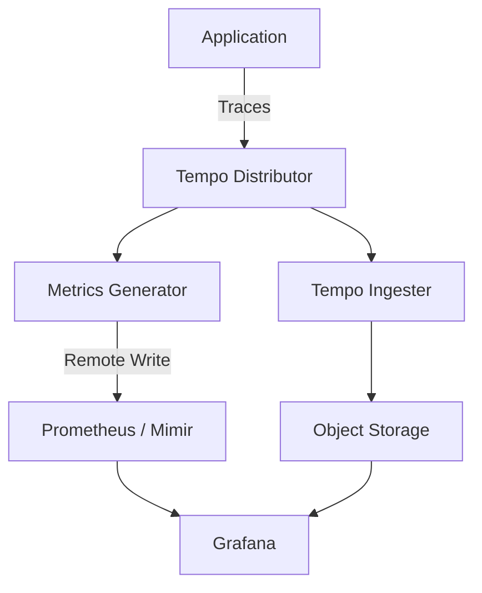
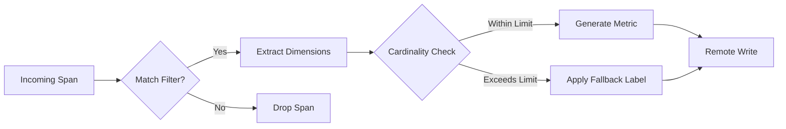

# How to Create Tempo Metrics Generator

Author: [nawazdhandala](https://github.com/nawazdhandala)

Tags: Tempo, Observability, Metrics, Tracing

Description: Learn how to generate Prometheus metrics directly from distributed traces using Grafana Tempo's metrics generator.

---

Grafana Tempo is a powerful distributed tracing backend that stores and queries traces at scale. One of its most valuable features is the **metrics generator**, which allows you to derive Prometheus metrics directly from your trace data. This eliminates the need to instrument your applications twice for both tracing and metrics.

## What is the Tempo Metrics Generator?

The metrics generator is a Tempo component that processes ingested traces and produces metrics in real time. It can generate two types of metrics:

1. **Service Graphs** - Metrics describing relationships and request rates between services
2. **Span Metrics** - RED (Rate, Error, Duration) metrics derived from individual spans

These metrics are then pushed to a Prometheus-compatible backend using remote write.

## Architecture Overview

Here is how the metrics generator fits into your observability stack:



The metrics generator receives trace data from the distributor, processes it to extract metrics, and sends those metrics to your Prometheus or Mimir instance via remote write.

## Enabling the Metrics Generator

To enable the metrics generator, you need to configure it in your Tempo configuration file. Below is a complete configuration example with detailed comments.

```yaml
# tempo.yaml

# Enable the metrics generator component
metrics_generator:
  # Ring configuration for distributed deployments
  ring:
    kvstore:
      store: memberlist

  # Processor configuration defines which metrics to generate
  processor:
    # Service graphs track relationships between services
    service_graphs:
      # Maximum number of items to hold in the store
      max_items: 10000
      # Time to wait for an edge to complete
      wait: 10s
      # Additional dimensions to include in service graph metrics
      dimensions:
        - http.method
        - http.status_code

    # Span metrics generate RED metrics from spans
    span_metrics:
      # Histogram buckets for latency measurements (in seconds)
      histogram_buckets: [0.002, 0.004, 0.008, 0.016, 0.032, 0.064, 0.128, 0.256, 0.512, 1.024, 2.048, 4.096, 8.192, 16.384]
      # Dimensions to include in span metrics
      dimensions:
        - service.name
        - span.name
        - span.kind
        - status.code
      # Intrinsic dimensions are always included
      intrinsic_dimensions:
        service: true
        span_name: true
        span_kind: true
        status_code: true
      # Enable all three RED metrics
      enable_target_info: true

  # Storage configuration for the metrics generator
  storage:
    # Path for local WAL storage
    path: /var/tempo/metrics-generator/wal
    # Remote write configuration to send metrics to Prometheus
    remote_write:
      - url: http://prometheus:9090/api/v1/write
        send_exemplars: true
        headers:
          X-Scope-OrgID: tenant-1

  # Registry configuration for metric naming
  registry:
    # Prefix for all generated metrics
    external_labels:
      source: tempo
    # Collection interval
    collection_interval: 15s

# Distributor must be configured to send spans to the metrics generator
distributor:
  receivers:
    otlp:
      protocols:
        grpc:
          endpoint: 0.0.0.0:4317
        http:
          endpoint: 0.0.0.0:4318
  # Enable forwarding to metrics generator
  metrics_generator_ring:
    instance_addr: 127.0.0.1

# Override configuration to enable the metrics generator per tenant
overrides:
  defaults:
    metrics_generator:
      processors:
        - service-graphs
        - span-metrics
```

## Understanding Service Graphs

Service graphs automatically detect and visualize the relationships between your services. The metrics generator creates the following metrics:

| Metric Name | Type | Description |
|-------------|------|-------------|
| `traces_service_graph_request_total` | Counter | Total requests between services |
| `traces_service_graph_request_failed_total` | Counter | Failed requests between services |
| `traces_service_graph_request_server_seconds` | Histogram | Server-side latency |
| `traces_service_graph_request_client_seconds` | Histogram | Client-side latency |

Here is an example PromQL query to calculate the error rate between two services:

```promql
# Error rate between services over the last 5 minutes
sum(rate(traces_service_graph_request_failed_total{
  client="frontend",
  server="api-gateway"
}[5m]))
/
sum(rate(traces_service_graph_request_total{
  client="frontend",
  server="api-gateway"
}[5m]))
```

## Understanding Span Metrics

Span metrics generate RED metrics from your trace spans. The following metrics are created:

| Metric Name | Type | Description |
|-------------|------|-------------|
| `traces_spanmetrics_calls_total` | Counter | Total number of span calls |
| `traces_spanmetrics_latency_bucket` | Histogram | Latency distribution buckets |
| `traces_spanmetrics_latency_count` | Histogram | Total count of latency observations |
| `traces_spanmetrics_latency_sum` | Histogram | Sum of all latency observations |

Example queries for span metrics:

```promql
# Request rate by service and operation
sum by (service, span_name) (
  rate(traces_spanmetrics_calls_total[5m])
)

# P99 latency by service
histogram_quantile(0.99,
  sum by (service, le) (
    rate(traces_spanmetrics_latency_bucket[5m])
  )
)

# Error rate by service
sum by (service) (
  rate(traces_spanmetrics_calls_total{status_code="STATUS_CODE_ERROR"}[5m])
)
/
sum by (service) (
  rate(traces_spanmetrics_calls_total[5m])
)
```

## Controlling Cardinality with Dimensions

One of the most important considerations when using the metrics generator is cardinality control. Each unique combination of dimension values creates a new time series. High cardinality can overwhelm your metrics backend.

### Recommended Dimension Configuration

```yaml
# Conservative configuration for production
processor:
  span_metrics:
    dimensions:
      # Low cardinality dimensions - safe to include
      - service.name      # Number of services
      - span.kind         # 5 possible values
      - status.code       # 3 possible values

      # Medium cardinality - include with caution
      - http.method       # ~10 possible values
      - http.status_code  # ~50 possible values

      # High cardinality - avoid these
      # - http.url        # Unbounded - do not use
      # - user.id         # Unbounded - do not use
      # - trace.id        # Unbounded - do not use

    # Filter spans to reduce volume
    filter_policies:
      - include:
          match_type: strict
          span_names:
            - "HTTP GET"
            - "HTTP POST"
            - "gRPC call"
```

### Dimension Filtering Flow



## Setting Up Remote Write

The metrics generator uses Prometheus remote write to send metrics. Here is a detailed configuration:

```yaml
storage:
  remote_write:
    # Primary Prometheus endpoint
    - url: http://prometheus:9090/api/v1/write
      # Include exemplars for trace-to-metrics correlation
      send_exemplars: true
      # Basic authentication
      basic_auth:
        username: prometheus
        password_file: /etc/tempo/prometheus-password
      # TLS configuration for secure connections
      tls_config:
        cert_file: /etc/tempo/client.crt
        key_file: /etc/tempo/client.key
        ca_file: /etc/tempo/ca.crt
      # Queue configuration for buffering
      queue_config:
        capacity: 10000
        max_shards: 50
        min_shards: 1
        max_samples_per_send: 2000
        batch_send_deadline: 5s
      # Retry configuration
      metadata_config:
        send: true
        send_interval: 1m

    # Secondary endpoint for redundancy
    - url: http://mimir:8080/api/v1/push
      headers:
        X-Scope-OrgID: production
```

## Complete Docker Compose Example

Here is a complete example to run Tempo with the metrics generator locally:

```yaml
# docker-compose.yaml
version: "3.8"

services:
  tempo:
    image: grafana/tempo:2.3.0
    command: ["-config.file=/etc/tempo/tempo.yaml"]
    volumes:
      - ./tempo.yaml:/etc/tempo/tempo.yaml
      - tempo-data:/var/tempo
    ports:
      - "3200:3200"   # Tempo API
      - "4317:4317"   # OTLP gRPC
      - "4318:4318"   # OTLP HTTP

  prometheus:
    image: prom/prometheus:v2.48.0
    command:
      - "--config.file=/etc/prometheus/prometheus.yml"
      - "--web.enable-remote-write-receiver"
      - "--enable-feature=exemplar-storage"
    volumes:
      - ./prometheus.yml:/etc/prometheus/prometheus.yml
      - prometheus-data:/prometheus
    ports:
      - "9090:9090"

  grafana:
    image: grafana/grafana:10.2.0
    environment:
      - GF_AUTH_ANONYMOUS_ENABLED=true
      - GF_AUTH_ANONYMOUS_ORG_ROLE=Admin
    volumes:
      - ./grafana-datasources.yaml:/etc/grafana/provisioning/datasources/datasources.yaml
    ports:
      - "3000:3000"

volumes:
  tempo-data:
  prometheus-data:
```

## Verifying Your Setup

Once your configuration is in place, you can verify that metrics are being generated:

```bash
# Check that Tempo is healthy
curl -s http://localhost:3200/ready

# Query Prometheus for service graph metrics
curl -s 'http://localhost:9090/api/v1/query?query=traces_service_graph_request_total' | jq .

# Query for span metrics
curl -s 'http://localhost:9090/api/v1/query?query=traces_spanmetrics_calls_total' | jq .

# Check the metrics generator status
curl -s http://localhost:3200/metrics | grep tempo_metrics_generator
```

## Performance Considerations

When running the metrics generator in production, keep these recommendations in mind:

1. **Memory allocation** - The metrics generator keeps a cache of active series. Allocate sufficient memory based on your expected cardinality.

2. **Collection interval** - A 15-second interval balances freshness with performance. Shorter intervals increase CPU usage.

3. **Histogram buckets** - Use buckets that match your SLO requirements. Too many buckets increase cardinality.

4. **Dimension limits** - Start with fewer dimensions and add more as needed. It is easier to add than to remove.

```yaml
# Production-ready resource limits
metrics_generator:
  processor:
    span_metrics:
      # Limit the number of label value pairs
      dimension_mappings:
        - name: http.status_code
          source_labels: [http.status_code]
          # Group status codes to reduce cardinality
          regex: "(2..|3..|4..|5..)"
```

## Troubleshooting Common Issues

### Metrics Not Appearing

If metrics are not showing up in Prometheus:

1. Verify the metrics generator is enabled in your overrides
2. Check the Tempo logs for remote write errors
3. Ensure Prometheus has remote write receiver enabled
4. Verify network connectivity between Tempo and Prometheus

### High Cardinality Warnings

If you see cardinality warnings:

1. Review your dimension configuration
2. Add filters to reduce the number of processed spans
3. Use dimension mappings to group similar values
4. Consider using the `max_items` setting to cap series count

## Summary

The Tempo metrics generator provides a powerful way to derive metrics from your distributed traces without additional instrumentation. By properly configuring service graphs and span metrics, you can gain insights into your service relationships and performance characteristics while maintaining control over cardinality.

Key takeaways:

- Enable both service graphs and span metrics for complete observability
- Carefully select dimensions to control cardinality
- Use remote write to send metrics to Prometheus or Mimir
- Monitor your metrics generator performance and adjust as needed

With trace-derived metrics, you get the best of both worlds: detailed traces for debugging and aggregated metrics for alerting and dashboards.
