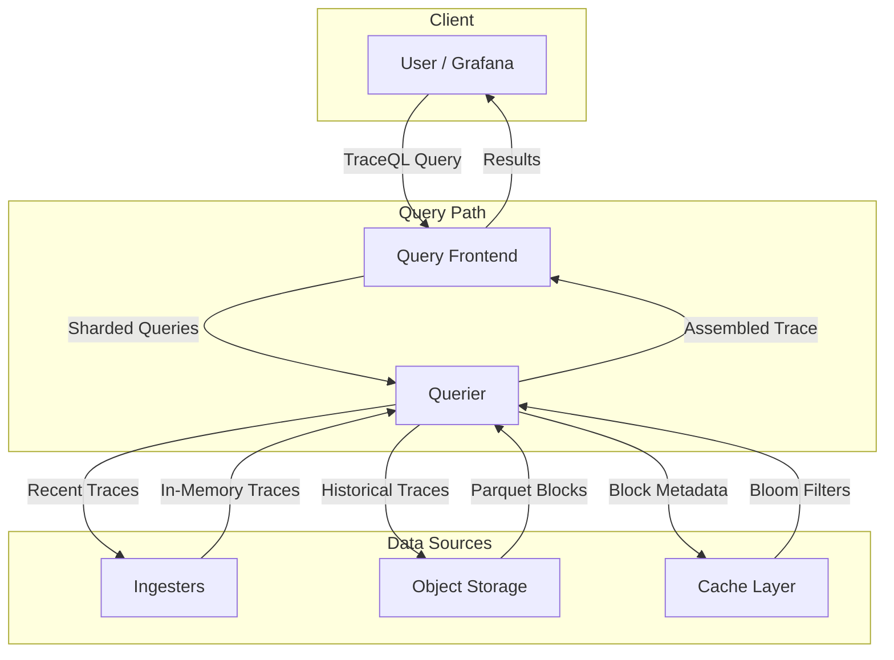
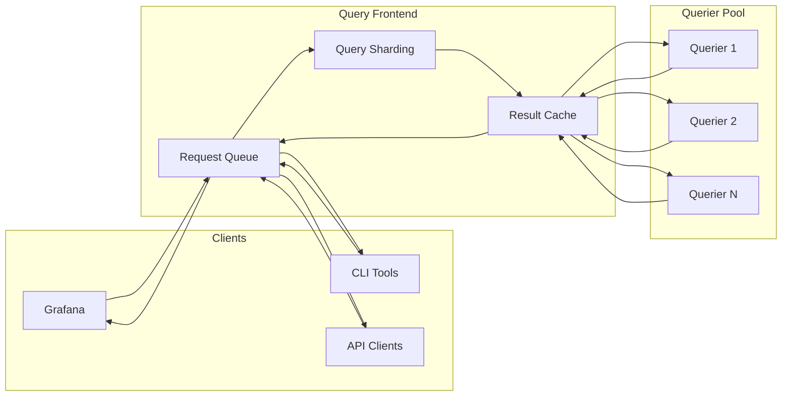

# How to Create Tempo Querier Configuration

Author: [nawazdhandala](https://github.com/nawazdhandala)

Tags: Tempo, Observability, Tracing, Performance

Description: A practical guide to configuring Grafana Tempo's querier component for efficient trace retrieval and optimal query performance.

---

> The querier is Tempo's workhorse for trace retrieval. Get it right, and your engineers can find that needle-in-a-haystack trace in seconds. Get it wrong, and query timeouts become the norm.

Grafana Tempo is a high-scale, cost-effective distributed tracing backend. At its core, the **querier** component handles all trace retrieval operations, from simple trace ID lookups to complex search queries across massive datasets.

This guide walks through querier configuration in depth: how the component works, how to tune it for your workload, backend storage integration, and optimization strategies that make trace retrieval fast and reliable.

---

## Table of Contents

1. What is the Tempo Querier?
2. Querier Data Flow
3. Basic Querier Configuration
4. Backend Storage Configuration
5. Concurrent Query Limits
6. Trace Retrieval Optimization
7. Frontend Integration
8. Caching Strategies
9. Production Configuration Example
10. Monitoring Your Querier

---

## 1. What is the Tempo Querier?

The querier is the read-path component in Tempo's architecture. It receives trace queries, fetches data from backend storage (object store and/or ingesters), assembles complete traces from distributed blocks, and returns results to the caller.

| Responsibility | Description |
|----------------|-------------|
| Trace Lookup | Retrieves traces by ID from storage and ingesters |
| Search | Executes TraceQL queries across the dataset |
| Block Scanning | Reads and filters parquet blocks from object storage |
| Result Assembly | Combines partial traces from multiple sources |
| Caching | Leverages bloom filters and block metadata caches |

The querier can run standalone or as part of Tempo's monolithic deployment. In microservices mode, you scale queriers independently based on query load.

---

## 2. Querier Data Flow

When a trace query arrives, the querier coordinates between multiple data sources to assemble the complete trace:



**Data flow explanation:**

1. Query arrives at the query frontend (optional but recommended for production)
2. Frontend splits large queries into smaller shards
3. Querier receives sharded query and determines data sources
4. Recent traces (within ingester retention) come from ingesters
5. Historical traces are fetched from object storage (S3, GCS, Azure, etc.)
6. Block metadata and bloom filters accelerate lookups via caching
7. Querier assembles partial results into complete traces
8. Results flow back through frontend to client

---

## 3. Basic Querier Configuration

Here is a foundational querier configuration with inline explanations:

```yaml
# tempo.yaml - Querier configuration section
querier:
  # Maximum duration a query can run before timeout
  # Increase for complex TraceQL queries over large datasets
  query_timeout: 30s

  # How long to search ingesters for recent traces
  # Should match or exceed ingester.max_block_duration
  search_query_timeout: 30s

  # Number of best-effort concurrent queries
  # Higher values increase throughput but consume more memory
  max_concurrent_queries: 20

  # Frontend worker configuration
  # Workers pull queries from the query frontend queue
  frontend_worker:
    # Address of query frontend (if running separately)
    frontend_address: "tempo-query-frontend:9095"

    # Number of parallel workers per querier
    # Each worker can process one query at a time
    parallelism: 10

  # Trace by ID lookup settings
  trace_by_id:
    # Timeout for individual trace ID lookups
    query_timeout: 10s
```

**Key parameters explained:**

- `query_timeout`: The maximum wall-clock time for any single query. Set this based on your largest expected queries.
- `max_concurrent_queries`: Controls resource usage. More concurrency means faster aggregate throughput but higher memory pressure.
- `frontend_worker.parallelism`: Each querier runs this many workers pulling from the frontend queue.

---

## 4. Backend Storage Configuration

The querier reads trace data from object storage. Proper backend configuration is critical for query performance:

```yaml
# Storage backend configuration
storage:
  trace:
    # Backend type: s3, gcs, azure, local
    backend: s3

    # S3 configuration
    s3:
      # S3 bucket name for trace storage
      bucket: tempo-traces

      # S3 endpoint (use for MinIO or other S3-compatible stores)
      endpoint: s3.us-east-1.amazonaws.com

      # AWS region
      region: us-east-1

      # Access credentials (prefer IAM roles in production)
      access_key: ${S3_ACCESS_KEY}
      secret_key: ${S3_SECRET_KEY}

      # Enable server-side encryption
      insecure: false

    # Block storage configuration
    block:
      # Block format version (vParquet3 recommended for new deployments)
      version: vParquet3

    # Write-Ahead Log configuration (for ingesters, affects querier reads)
    wal:
      # WAL storage path
      path: /var/tempo/wal

    # Local block storage path for compacted blocks
    local:
      path: /var/tempo/blocks

    # Pool configuration for concurrent backend operations
    pool:
      # Maximum number of concurrent backend requests
      max_workers: 100

      # Queue depth for pending operations
      queue_depth: 10000
```

**GCS configuration example:**

```yaml
storage:
  trace:
    backend: gcs

    gcs:
      # GCS bucket name
      bucket_name: tempo-traces-prod

      # Path to service account JSON (if not using workload identity)
      # service_account: /etc/tempo/gcs-credentials.json

      # Enable automatic retries on transient failures
      insecure: false

      # Chunk size for uploads (bytes)
      chunk_buffer_size: 10485760
```

**Azure Blob Storage configuration:**

```yaml
storage:
  trace:
    backend: azure

    azure:
      # Azure storage account name
      storage_account_name: tempotracesprod

      # Container name
      container_name: traces

      # Account key (prefer managed identity in production)
      storage_account_key: ${AZURE_STORAGE_KEY}

      # Endpoint suffix for sovereign clouds
      endpoint_suffix: blob.core.windows.net
```

---

## 5. Concurrent Query Limits

Managing concurrency prevents resource exhaustion during traffic spikes:

```yaml
querier:
  # Hard limit on concurrent queries per querier instance
  max_concurrent_queries: 20

# Query frontend settings (if using frontend)
query_frontend:
  # Maximum outstanding requests per tenant
  max_outstanding_per_tenant: 200

  # Search configuration
  search:
    # Number of shards for parallel search execution
    # Higher values improve parallelism but increase overhead
    default_result_limit: 20

    # Maximum duration for search queries
    max_duration: 168h

# Per-tenant overrides for multi-tenant deployments
overrides:
  defaults:
    # Global query limits
    max_traces_per_user: 10000

    # Per-query limits
    max_bytes_per_trace: 5000000

    # Search-specific limits
    max_search_duration: 168h

  # Tenant-specific overrides
  per_tenant_override_config: /etc/tempo/overrides.yaml
```

**Overrides file example (per-tenant limits):**

```yaml
# overrides.yaml - Per-tenant configuration
overrides:
  # High-priority tenant with increased limits
  tenant-production:
    max_traces_per_user: 50000
    max_bytes_per_trace: 10000000
    max_search_duration: 720h
    ingestion_rate_limit_bytes: 50000000

  # Development tenant with reduced limits
  tenant-dev:
    max_traces_per_user: 1000
    max_bytes_per_trace: 1000000
    max_search_duration: 24h
    ingestion_rate_limit_bytes: 5000000
```

---

## 6. Trace Retrieval Optimization

Optimize trace retrieval with caching and bloom filters:

```yaml
# Cache configuration for query acceleration
cache:
  # Background cache for async operations
  background:
    # Write-back cache workers
    writeback_goroutines: 10
    writeback_buffer: 10000

# Storage-level caching
storage:
  trace:
    # Bloom filter configuration (accelerates trace ID lookups)
    bloom_filter:
      # Bloom filter false positive rate
      # Lower values = larger filters but fewer false positives
      false_positive: 0.01

      # Shard size for bloom filter distribution
      shard_size_bytes: 100000

    # Block cache configuration
    cache:
      # Cache type: redis, memcached, or embedded
      # Use redis or memcached for distributed deployments

      # Bloom filter cache (critical for trace ID lookups)
      bloom:
        cache_type: redis
        redis:
          endpoint: redis-cluster:6379
          timeout: 500ms
          max_item_size: 10485760

      # Block metadata cache
      blocklist:
        cache_type: redis
        redis:
          endpoint: redis-cluster:6379
          timeout: 500ms
```

**Query optimization settings:**

```yaml
querier:
  # Trace by ID specific optimizations
  trace_by_id:
    # Timeout for trace lookups
    query_timeout: 10s

  # Search optimizations
  search:
    # Prefer recently compacted blocks (better organized data)
    prefer_self: true

    # External endpoints for distributed search
    external_endpoints: []

# Compactor settings (affects query performance indirectly)
compactor:
  compaction:
    # Larger blocks = fewer files to scan = faster queries
    max_block_bytes: 107374182400

    # Block retention period
    block_retention: 336h

    # Compacted block retention
    compacted_block_retention: 1h
```

---

## 7. Frontend Integration

The query frontend improves query performance through sharding and caching:



**Query frontend configuration:**

```yaml
query_frontend:
  # Address for queriers to connect
  # Queriers pull work from this address
  address: 0.0.0.0:9095

  # Search query configuration
  search:
    # Number of concurrent jobs per search query
    concurrent_jobs: 1000

    # Target bytes per search job (affects sharding granularity)
    target_bytes_per_job: 104857600

    # Default and maximum result limits
    default_result_limit: 20
    max_result_limit: 10000

    # Maximum search duration
    max_duration: 168h

  # Trace by ID configuration
  trace_by_id:
    # Query sharding for trace lookups
    query_shards: 50

    # Hedge requests for faster P99 (send duplicate requests)
    hedge_requests_at: 2s
    hedge_requests_up_to: 2

  # Result caching
  cache:
    # Cache search results
    search:
      cache_type: redis
      redis:
        endpoint: redis-cluster:6379
        timeout: 500ms

    # Cache trace by ID results
    trace_by_id:
      cache_type: redis
      redis:
        endpoint: redis-cluster:6379
        timeout: 500ms
```

---

## 8. Caching Strategies

Effective caching dramatically improves query latency:

```yaml
# Comprehensive caching configuration
cache:
  # Redis caching (recommended for production)
  redis:
    endpoint: redis-cluster:6379
    timeout: 500ms
    max_idle_conns: 100
    max_active_conns: 500

storage:
  trace:
    cache:
      # Bloom filter cache - accelerates trace ID existence checks
      bloom:
        cache_type: redis
        redis:
          endpoint: redis-cluster:6379
          timeout: 200ms
          # Cache TTL (should exceed compaction cycle)
          ttl: 24h

      # Parquet footer cache - speeds up block scanning
      parquet_footer:
        cache_type: redis
        redis:
          endpoint: redis-cluster:6379
          timeout: 200ms
          ttl: 24h

      # Parquet page cache - reduces repeated page reads
      parquet_page:
        cache_type: redis
        redis:
          endpoint: redis-cluster:6379
          timeout: 200ms
          # Larger TTL for frequently accessed pages
          ttl: 24h
          # Maximum item size in bytes
          max_item_size: 10485760

      # Block metadata cache - stores block index information
      blocklist:
        cache_type: redis
        redis:
          endpoint: redis-cluster:6379
          timeout: 200ms
          ttl: 5m
```

**Memcached alternative:**

```yaml
storage:
  trace:
    cache:
      bloom:
        cache_type: memcached
        memcached:
          # Memcached cluster endpoints
          addresses:
            - memcached-1:11211
            - memcached-2:11211
            - memcached-3:11211
          timeout: 200ms
          max_idle_conns: 100
          max_item_size: 10485760
```

---

## 9. Production Configuration Example

Here is a complete production-ready querier configuration:

```yaml
# tempo.yaml - Production configuration
# This example assumes a microservices deployment with
# separate query-frontend and querier components

# Server configuration
server:
  http_listen_port: 3200
  grpc_listen_port: 9095
  log_level: info

# Distributor (write path - included for completeness)
distributor:
  receivers:
    otlp:
      protocols:
        grpc:
          endpoint: 0.0.0.0:4317
        http:
          endpoint: 0.0.0.0:4318

# Ingester configuration
ingester:
  # Trace retention in ingesters before flushing to storage
  max_block_duration: 5m

  # Lifecycle configuration
  lifecycler:
    ring:
      replication_factor: 3

# Querier configuration
querier:
  # Query timeout - increase for complex TraceQL
  query_timeout: 60s

  # Search timeout
  search_query_timeout: 60s

  # Concurrent query limit per querier
  # Tune based on available memory (roughly 100MB per concurrent query)
  max_concurrent_queries: 20

  # Frontend worker configuration
  frontend_worker:
    frontend_address: tempo-query-frontend-discovery:9095
    parallelism: 20

    # gRPC client settings
    grpc_client_config:
      max_recv_msg_size: 104857600
      max_send_msg_size: 104857600

  # Trace by ID settings
  trace_by_id:
    query_timeout: 15s

# Query frontend configuration
query_frontend:
  # Search configuration
  search:
    concurrent_jobs: 2000
    target_bytes_per_job: 209715200
    default_result_limit: 20
    max_result_limit: 10000
    max_duration: 720h

  # Trace by ID sharding
  trace_by_id:
    query_shards: 100
    hedge_requests_at: 3s
    hedge_requests_up_to: 2

  # Result caching
  cache:
    search:
      cache_type: redis
      redis:
        endpoint: redis-cluster:6379
        timeout: 500ms
        ttl: 5m

# Storage configuration
storage:
  trace:
    backend: s3

    s3:
      bucket: tempo-traces-prod
      endpoint: s3.us-east-1.amazonaws.com
      region: us-east-1
      # Use IAM roles - no hardcoded credentials

    # Block format
    block:
      version: vParquet3

    # WAL path
    wal:
      path: /var/tempo/wal

    # Local cache path
    local:
      path: /var/tempo/blocks

    # Bloom filter tuning
    bloom_filter:
      false_positive: 0.01
      shard_size_bytes: 100000

    # Multi-level caching
    cache:
      bloom:
        cache_type: redis
        redis:
          endpoint: redis-cluster:6379
          timeout: 200ms
          ttl: 24h

      parquet_footer:
        cache_type: redis
        redis:
          endpoint: redis-cluster:6379
          timeout: 200ms
          ttl: 24h

      parquet_page:
        cache_type: redis
        redis:
          endpoint: redis-cluster:6379
          timeout: 200ms
          ttl: 24h
          max_item_size: 10485760

    # Concurrent backend operations
    pool:
      max_workers: 200
      queue_depth: 20000

# Compactor configuration (affects query performance)
compactor:
  compaction:
    max_block_bytes: 107374182400
    block_retention: 720h
    compacted_block_retention: 1h

  ring:
    kvstore:
      store: memberlist

# Per-tenant overrides
overrides:
  defaults:
    max_traces_per_user: 20000
    max_bytes_per_trace: 5000000
    max_search_duration: 720h
    ingestion_rate_limit_bytes: 30000000

  per_tenant_override_config: /etc/tempo/overrides.yaml

# Memberlist for service discovery
memberlist:
  join_members:
    - tempo-memberlist:7946
```

---

## 10. Monitoring Your Querier

Monitor querier health with these key metrics:

```yaml
# Prometheus alerting rules for Tempo querier
groups:
  - name: tempo-querier
    rules:
      # Alert on high query latency
      - alert: TempoQuerierHighLatency
        expr: |
          histogram_quantile(0.99,
            sum(rate(tempo_querier_query_duration_seconds_bucket[5m])) by (le)
          ) > 30
        for: 5m
        labels:
          severity: warning
        annotations:
          summary: "Tempo querier P99 latency exceeds 30s"

      # Alert on query failures
      - alert: TempoQuerierFailures
        expr: |
          sum(rate(tempo_querier_query_total{status="error"}[5m]))
          /
          sum(rate(tempo_querier_query_total[5m])) > 0.05
        for: 5m
        labels:
          severity: critical
        annotations:
          summary: "Tempo querier error rate exceeds 5%"

      # Alert on cache miss rate
      - alert: TempoHighCacheMissRate
        expr: |
          sum(rate(tempo_cache_misses_total[5m]))
          /
          (sum(rate(tempo_cache_hits_total[5m])) + sum(rate(tempo_cache_misses_total[5m])))
          > 0.5
        for: 10m
        labels:
          severity: warning
        annotations:
          summary: "Tempo cache miss rate exceeds 50%"
```

**Key metrics to track:**

| Metric | Description | Target |
|--------|-------------|--------|
| `tempo_querier_query_duration_seconds` | Query latency histogram | P99 < 30s |
| `tempo_querier_query_total` | Total queries by status | Error rate < 1% |
| `tempo_cache_hits_total` | Cache hit counter | Hit rate > 80% |
| `tempo_cache_misses_total` | Cache miss counter | Miss rate < 20% |
| `tempo_querier_bytes_processed_total` | Data scanned per query | Monitor trends |

---

## Summary

Configuring Tempo's querier for optimal trace retrieval involves:

| Area | Key Settings |
|------|--------------|
| Basic Tuning | `query_timeout`, `max_concurrent_queries`, `frontend_worker.parallelism` |
| Storage | Backend type, connection pooling, block format version |
| Caching | Bloom filters, parquet caches, result caches via Redis/Memcached |
| Concurrency | Per-tenant limits, frontend sharding, worker parallelism |
| Frontend | Query sharding, request hedging, result caching |

Start with conservative settings and tune based on observed query patterns. Monitor cache hit rates, query latencies, and error rates to identify bottlenecks.

---

**Related Reading:**

- [Traces and Spans in OpenTelemetry](https://oneuptime.com/blog/post/2025-08-27-traces-and-spans-in-opentelemetry/view)
- [OpenTelemetry Collector: What It Is and When You Need It](https://oneuptime.com/blog/post/2025-09-18-what-is-opentelemetry-collector-and-why-use-one/view)
- [How to Reduce Noise in OpenTelemetry](https://oneuptime.com/blog/post/2025-08-25-how-to-reduce-noise-in-opentelemetry/view)

---

*Looking for a unified observability platform that works with Tempo and OpenTelemetry? [OneUptime](https://oneuptime.com) provides traces, metrics, logs, and alerting in one place.*
