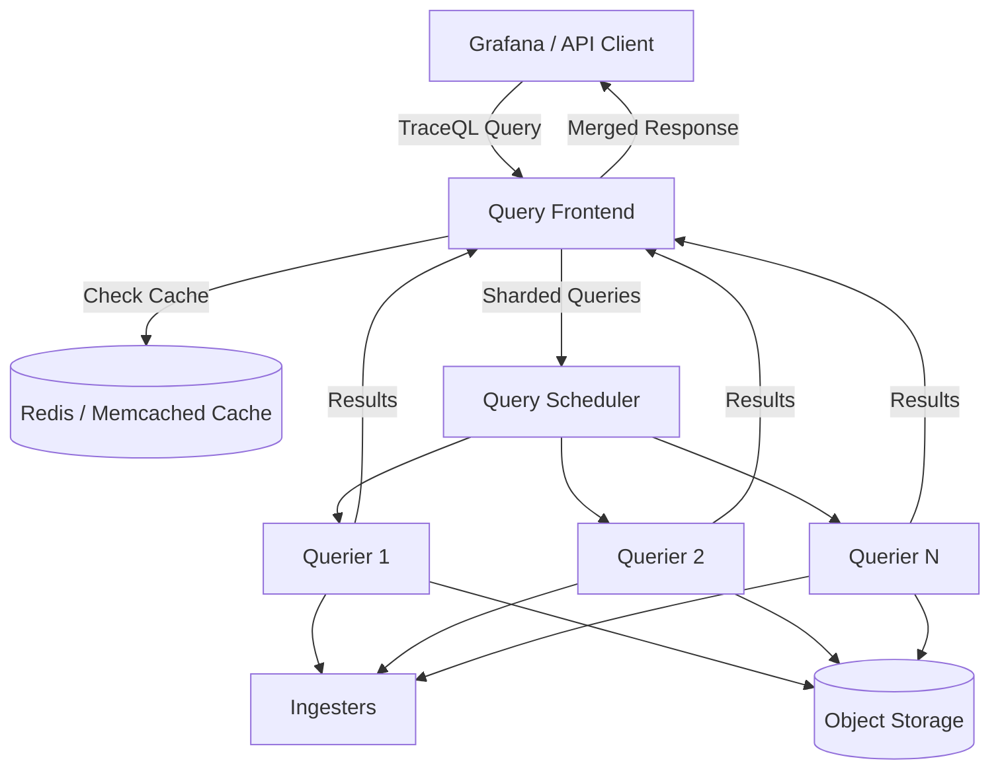
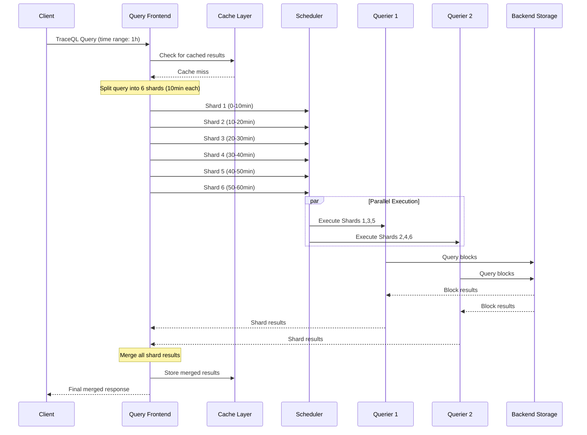

# How to Implement Tempo Query Frontend

Author: [nawazdhandala](https://github.com/nawazdhandala)

Tags: Tempo, Observability, Tracing, Performance

Description: Learn how to configure Grafana Tempo's Query Frontend component to accelerate trace queries through sharding, caching, and parallel execution.

---

Grafana Tempo is a highly scalable distributed tracing backend that stores and queries trace data efficiently. One of its most powerful components is the **Query Frontend**, which acts as an intelligent gateway that accelerates queries through parallelization, caching, and query optimization. In this guide, we will explore how to implement and configure the Tempo Query Frontend for maximum query performance.

## What is the Query Frontend?

The Query Frontend is an optional but highly recommended component in a Tempo deployment. It sits between clients (like Grafana) and the Tempo queriers, intercepting incoming queries and applying several optimization strategies before dispatching them to the backend.

Key responsibilities of the Query Frontend include:

- **Query Sharding**: Breaking large queries into smaller parallel requests
- **Caching**: Storing query results to avoid redundant computation
- **Queue Management**: Managing query queues to prevent overload
- **Retry Logic**: Automatically retrying failed queries

## Architecture Overview

Before diving into configuration, let us understand how the Query Frontend fits into the Tempo architecture.



## Basic Query Frontend Configuration

Here is a minimal configuration to enable the Query Frontend in your Tempo deployment:

```yaml
# tempo.yaml - Basic Query Frontend Configuration

# Enable the query-frontend target
target: query-frontend

# Server configuration
server:
  http_listen_port: 3200
  grpc_listen_port: 9095

# Query Frontend specific settings
query_frontend:
  # Maximum number of outstanding requests per tenant
  max_outstanding_per_tenant: 2000

  # Search configuration for the frontend
  search:
    # Duration to search for recent traces in ingesters
    query_ingesters_until: 30m

    # Maximum duration for a single search query
    max_duration: 0  # 0 means no limit

    # Default result limit if not specified
    default_result_limit: 20

    # Maximum result limit allowed
    max_result_limit: 500

# Querier worker configuration (connects frontend to queriers)
querier:
  frontend_worker:
    frontend_address: tempo-query-frontend:9095
```

## Query Sharding Configuration

Query sharding is where the Query Frontend really shines. It splits time-range queries into smaller chunks that can be executed in parallel across multiple queriers.

```yaml
# tempo.yaml - Advanced Sharding Configuration

query_frontend:
  # Enable trace-by-ID query sharding
  trace_by_id:
    # Number of shards for trace by ID queries
    query_shards: 50

    # Enable hedged requests for faster responses
    hedge_requests_at: 2s
    hedge_requests_up_to: 2

  # Search query sharding configuration
  search:
    # Number of concurrent jobs per search query
    concurrent_jobs: 1000

    # Target bytes per job for sharding
    # Smaller values create more shards (more parallelism)
    target_bytes_per_job: 104857600  # 100MB

    # Duration to wait before starting ingester queries
    query_ingesters_until: 30m

    # Enable sharding by block ID
    sharder:
      # Maximum number of shards
      max_shards: 100

      # Query backend blocks in addition to ingesters
      query_backend_after: 15m

  # Metrics query configuration
  metrics:
    # Number of concurrent jobs for metrics queries
    concurrent_jobs: 1000

    # Target bytes per metrics job
    target_bytes_per_job: 52428800  # 50MB
```

## Query Flow Deep Dive

Let us examine how a TraceQL query flows through the system with sharding enabled.



## Caching Configuration

Caching dramatically reduces query latency for repeated queries. Tempo supports multiple cache backends.

### Redis Cache Configuration

```yaml
# tempo.yaml - Redis Cache Configuration

cache:
  # Background cache configuration
  background:
    writeback_goroutines: 10
    writeback_buffer: 10000

# Query Frontend with Redis caching
query_frontend:
  search:
    # Enable search result caching
    cache_results: true

    # Cache configuration for search
    cache:
      # Use Redis as the cache backend
      redis:
        endpoint: redis:6379
        timeout: 500ms
        expiration: 1h
        db: 0
        pool_size: 100

        # Optional TLS configuration
        # tls_enabled: true
        # tls_insecure_skip_verify: false

      # Default expiration for cache entries
      default_validity: 1h

      # Compression for cached data
      compression: snappy

  # Trace by ID caching
  trace_by_id:
    cache_results: true
    cache:
      redis:
        endpoint: redis:6379
        timeout: 500ms
        expiration: 30m
```

### Memcached Cache Configuration

```yaml
# tempo.yaml - Memcached Cache Configuration

query_frontend:
  search:
    cache_results: true
    cache:
      memcached:
        # List of memcached servers
        addresses: dns+memcached:11211

        # Connection timeout
        timeout: 500ms

        # Maximum idle connections
        max_idle_conns: 100

        # Maximum async concurrency
        max_async_concurrency: 50

        # Maximum async buffer size
        max_async_buffer_size: 25000

        # Maximum item size (in bytes)
        max_item_size: 16777216  # 16MB
```

## TraceQL Query Handling

The Query Frontend has special handling for TraceQL queries, which are Tempo's powerful query language for searching traces.

```yaml
# tempo.yaml - TraceQL Query Configuration

query_frontend:
  # TraceQL specific settings
  search:
    # Maximum number of spans per spanset
    max_spans_per_span_set: 100

    # Query ingesters for recent data
    query_ingesters_until: 30m

    # Prefer backend storage after this duration
    query_backend_after: 15m

    # Enable streaming for large result sets
    enable_streaming: true

    # Maximum duration for TraceQL queries
    max_duration: 168h  # 7 days

  # Metrics generation from traces
  metrics:
    # Enable metrics query handling
    concurrent_jobs: 1000

    # Time range for metrics queries
    max_duration: 24h

    # Interval for metrics data points
    query_backend_after: 15m
```

## Complete Production Configuration

Here is a complete production-ready configuration that combines all the components:

```yaml
# tempo.yaml - Complete Production Configuration

# Multi-target deployment
target: scalable-single-binary

server:
  http_listen_port: 3200
  grpc_listen_port: 9095
  log_level: info

# Distributor configuration
distributor:
  receivers:
    otlp:
      protocols:
        grpc:
          endpoint: 0.0.0.0:4317
        http:
          endpoint: 0.0.0.0:4318

# Ingester configuration
ingester:
  max_block_duration: 5m
  max_block_bytes: 1073741824  # 1GB
  complete_block_timeout: 15m

# Storage configuration
storage:
  trace:
    backend: s3
    s3:
      bucket: tempo-traces
      endpoint: s3.amazonaws.com
      region: us-east-1
    block:
      bloom_filter_false_positive: 0.01
      v2_index_downsample_bytes: 1000
      v2_encoding: zstd
    wal:
      path: /var/tempo/wal
    pool:
      max_workers: 100
      queue_depth: 10000

# Query Frontend configuration
query_frontend:
  # Outstanding request limits
  max_outstanding_per_tenant: 2000
  max_batch_size: 5

  # Trace by ID configuration
  trace_by_id:
    query_shards: 50
    hedge_requests_at: 2s
    hedge_requests_up_to: 2
    cache_results: true
    cache:
      redis:
        endpoint: redis:6379
        expiration: 30m

  # Search configuration
  search:
    concurrent_jobs: 1000
    target_bytes_per_job: 104857600
    default_result_limit: 20
    max_result_limit: 500
    query_ingesters_until: 30m
    query_backend_after: 15m
    max_duration: 168h
    cache_results: true
    cache:
      redis:
        endpoint: redis:6379
        expiration: 1h
    sharder:
      max_shards: 100

  # Metrics configuration
  metrics:
    concurrent_jobs: 1000
    target_bytes_per_job: 52428800
    max_duration: 24h

# Querier configuration
querier:
  max_concurrent_queries: 20
  search:
    prefer_self: 10
  frontend_worker:
    frontend_address: tempo-query-frontend:9095
    grpc_client_config:
      max_send_msg_size: 16777216

# Compactor configuration
compactor:
  compaction:
    block_retention: 336h  # 14 days
    compacted_block_retention: 1h
    compaction_window: 1h
    max_block_bytes: 107374182400  # 100GB

# Overrides for per-tenant configuration
overrides:
  defaults:
    ingestion_rate_limit_bytes: 15000000
    ingestion_burst_size_bytes: 20000000
    max_traces_per_user: 10000
    max_search_duration: 168h
```

## Kubernetes Deployment

For Kubernetes deployments, here is a sample configuration using the Helm chart:

```yaml
# values.yaml - Helm Chart Configuration

# Deploy in microservices mode
tempo:
  repository: grafana/tempo
  tag: latest
  pullPolicy: IfNotPresent

# Query Frontend specific settings
queryFrontend:
  replicas: 2

  resources:
    requests:
      cpu: 500m
      memory: 1Gi
    limits:
      cpu: 2000m
      memory: 4Gi

  # Autoscaling configuration
  autoscaling:
    enabled: true
    minReplicas: 2
    maxReplicas: 10
    targetCPUUtilizationPercentage: 60
    targetMemoryUtilizationPercentage: 80

  # Service configuration
  service:
    type: ClusterIP
    annotations: {}

# Querier configuration
querier:
  replicas: 3

  resources:
    requests:
      cpu: 1000m
      memory: 2Gi
    limits:
      cpu: 4000m
      memory: 8Gi

# Redis cache deployment
redis:
  enabled: true
  architecture: standalone
  auth:
    enabled: false
  master:
    persistence:
      enabled: false
```

## Monitoring the Query Frontend

It is essential to monitor your Query Frontend to ensure optimal performance. Here are key metrics to track:

```yaml
# prometheus-rules.yaml - Alerting Rules

groups:
  - name: tempo-query-frontend
    rules:
      # Alert on high query latency
      - alert: TempoQueryFrontendHighLatency
        expr: |
          histogram_quantile(0.99,
            sum(rate(tempo_query_frontend_request_duration_seconds_bucket[5m])) by (le, route)
          ) > 30
        for: 5m
        labels:
          severity: warning
        annotations:
          summary: "Tempo Query Frontend high latency"
          description: "P99 query latency is above 30 seconds"

      # Alert on high queue depth
      - alert: TempoQueryFrontendQueueFull
        expr: |
          tempo_query_frontend_queue_length > 100
        for: 5m
        labels:
          severity: critical
        annotations:
          summary: "Tempo Query Frontend queue is full"
          description: "Query queue has more than 100 pending requests"

      # Alert on cache hit rate
      - alert: TempoQueryFrontendLowCacheHitRate
        expr: |
          sum(rate(tempo_query_frontend_cache_hits_total[5m])) /
          sum(rate(tempo_query_frontend_cache_requests_total[5m])) < 0.5
        for: 15m
        labels:
          severity: warning
        annotations:
          summary: "Tempo Query Frontend low cache hit rate"
          description: "Cache hit rate is below 50%"
```

## Performance Tuning Tips

Here are some best practices for optimizing your Query Frontend:

1. **Adjust shard count based on cluster size**: More queriers allow for more parallel shards
2. **Tune cache expiration**: Balance freshness requirements with cache efficiency
3. **Monitor queue depth**: Increase max_outstanding_per_tenant if queries queue up
4. **Use hedged requests**: Enable for trace-by-ID queries to reduce tail latency
5. **Size target_bytes_per_job appropriately**: Smaller values increase parallelism but add overhead

## Conclusion

The Tempo Query Frontend is a powerful component that can significantly improve query performance in your distributed tracing infrastructure. By implementing proper sharding, caching, and queue management, you can handle large-scale trace queries efficiently while maintaining low latency for your users.

Start with the basic configuration and gradually tune the parameters based on your workload characteristics and monitoring data. The combination of query sharding and result caching can reduce query times from minutes to seconds for complex TraceQL queries spanning large time ranges.
