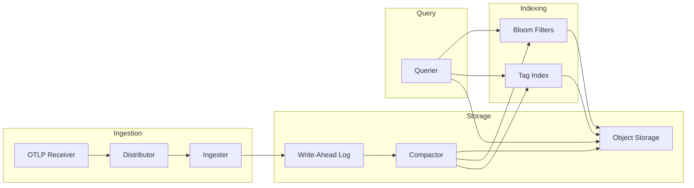
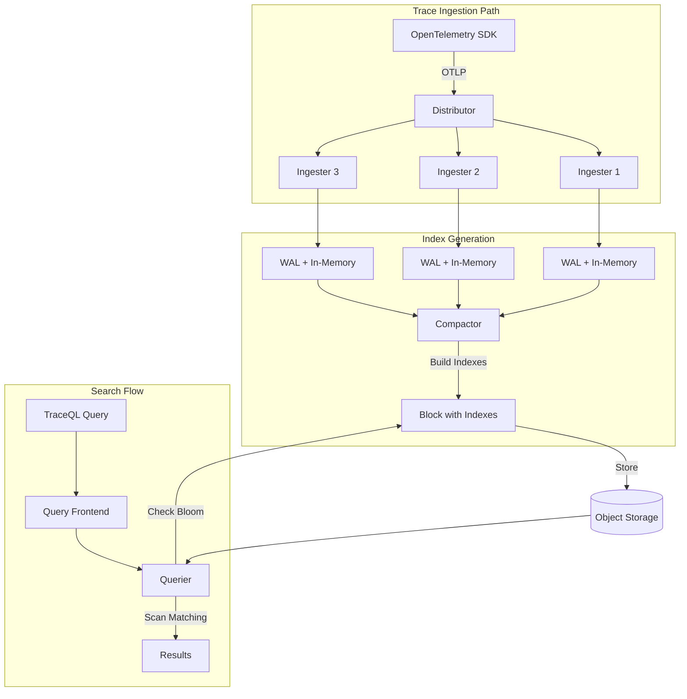

# How to Build Tempo Search Tags

Author: [nawazdhandala](https://github.com/nawazdhandala)

Tags: Tempo, Tracing, Search, Observability

Description: A practical guide to configuring search tags in Grafana Tempo for fast, efficient trace discovery and debugging.

---

Finding the right trace in a sea of telemetry data can feel like searching for a needle in a haystack. Grafana Tempo solves this with search tags, a feature that indexes specific span attributes for fast lookups. Instead of scanning millions of spans, you query indexed fields and get results in milliseconds.

This guide walks through configuring search tags, optimizing tag indexing, and writing TraceQL queries that actually perform well in production.

---

## Table of Contents

1. What Are Search Tags
2. How Tag Indexing Works
3. Architecture Overview
4. Configuring Search Tags
5. Tag Selection Strategy
6. TraceQL Query Examples
7. Search Optimization Tips
8. Common Pitfalls
9. Monitoring Tag Performance
10. Putting It Together

---

## 1. What Are Search Tags

Search tags are span attributes that Tempo indexes for fast retrieval. Without indexing, Tempo must scan all blocks to find matching spans. With indexed tags, it uses bloom filters and columnar lookups to narrow results quickly.

| Concept | Description |
|---------|-------------|
| Search Tag | A span attribute indexed for fast querying |
| Intrinsic Tag | Built-in tags Tempo always indexes (status, duration, name) |
| Resource Attribute | Tags describing the service (service.name, deployment.environment) |
| Span Attribute | Tags on individual spans (http.method, db.system) |
| Bloom Filter | Probabilistic data structure for fast "might exist" checks |

Tempo indexes intrinsic fields by default. You configure additional resource and span attributes based on your query patterns.

---

## 2. How Tag Indexing Works

When Tempo ingests traces, it builds indexes during the compaction process. The flow looks like this:

1. Spans arrive via OTLP or other protocols
2. Distributor validates and forwards to ingesters
3. Ingesters buffer spans in memory (write-ahead log)
4. Compactor flushes to object storage with indexes
5. Queriers use indexes to filter before scanning blocks



The bloom filter answers: "Does this block possibly contain spans with tag X?" If yes, Tempo scans that block. If no, it skips entirely. This cuts query time dramatically.

---

## 3. Architecture Overview

Understanding where tags get indexed helps you debug performance issues.



Key insight: tag indexes live inside each block in object storage. Queriers download bloom filters first, then fetch only relevant blocks.

---

## 4. Configuring Search Tags

Tempo configuration happens in the `tempo.yaml` file. Here is a production-ready example:

```yaml
# tempo.yaml

overrides:
  defaults:
    ingestion:
      # Rate limits
      rate_limit_bytes: 15000000
      burst_size_bytes: 20000000

    # Search tag configuration
    search_tags:
      # Resource attributes to index
      resource_attributes:
        - service.name
        - service.namespace
        - deployment.environment
        - k8s.namespace.name
        - k8s.deployment.name
        - cloud.region
        - host.name

      # Span attributes to index
      span_attributes:
        - http.method
        - http.status_code
        - http.route
        - http.url
        - db.system
        - db.name
        - db.operation
        - rpc.method
        - rpc.service
        - messaging.system
        - messaging.destination
        - error
        - user.id
        - order.id

storage:
  trace:
    backend: s3
    s3:
      bucket: tempo-traces
      endpoint: s3.amazonaws.com
      region: us-east-1

    block:
      # Bloom filter configuration
      bloom_filter_false_positive: 0.01
      bloom_filter_shard_size_bytes: 100000

      # Version 2 (vParquet3) enables better search
      version: vParquet3

    wal:
      path: /var/tempo/wal

    local:
      path: /var/tempo/blocks

compactor:
  compaction:
    # How often to run compaction
    compaction_window: 1h
    # Max block size after compaction
    max_block_bytes: 107374182400  # 100GB
    # Retention
    block_retention: 336h  # 14 days

querier:
  # Search configuration
  search:
    # External endpoints for distributed search
    external_endpoints: []
    # Prefer recently compacted blocks
    prefer_self: 10
    # Maximum duration for search queries
    query_timeout: 30s
```

### Per-Tenant Overrides

For multi-tenant deployments, configure tags per tenant:

```yaml
overrides:
  # Default for all tenants
  defaults:
    search_tags:
      resource_attributes:
        - service.name
      span_attributes:
        - http.method
        - http.status_code

  # Specific tenant overrides
  per_tenant_override_config: /etc/tempo/overrides.yaml
```

```yaml
# overrides.yaml
overrides:
  tenant-production:
    search_tags:
      resource_attributes:
        - service.name
        - deployment.environment
        - k8s.namespace.name
      span_attributes:
        - http.method
        - http.status_code
        - http.route
        - db.system
        - order.id
        - user.id

  tenant-staging:
    search_tags:
      resource_attributes:
        - service.name
      span_attributes:
        - http.method
```

---

## 5. Tag Selection Strategy

Not every attribute should be indexed. More tags mean larger indexes, slower compaction, and higher storage costs.

### Good Candidates for Indexing

| Category | Tags | Why |
|----------|------|-----|
| Service Identity | service.name, service.namespace | Every query filters by service |
| Environment | deployment.environment, k8s.namespace.name | Separate prod from staging |
| HTTP | http.method, http.status_code, http.route | Debug API issues |
| Database | db.system, db.name, db.operation | Find slow queries |
| Business | order.id, user.id, transaction.id | Trace specific transactions |
| Errors | error, exception.type | Find failures fast |

### Bad Candidates for Indexing

| Category | Tags | Why |
|----------|------|-----|
| High Cardinality | request.id, trace.id, span.id | Unique per request, bloats index |
| Large Values | http.request.body, sql.query | Index size explodes |
| Rarely Queried | internal.debug.flag | Waste of index space |
| Frequently Changing | instance.id (in autoscaling) | Index churn |

### Cardinality Guidelines

```
Low cardinality (< 100 values):     Always index
Medium cardinality (100-10000):     Index if frequently queried
High cardinality (> 10000):         Avoid indexing
```

Rule of thumb: if you can enumerate all possible values, it is safe to index.

---

## 6. TraceQL Query Examples

TraceQL is Tempo's query language. Here are practical examples using indexed tags.

### Basic Tag Queries

```
# Find all traces for a specific service
{ resource.service.name = "checkout-service" }

# Filter by HTTP method and status
{ span.http.method = "POST" && span.http.status_code >= 500 }

# Find traces in production environment
{ resource.deployment.environment = "production" }

# Combine resource and span attributes
{ resource.service.name = "api-gateway" && span.http.route = "/v1/orders" }
```

### Duration-Based Queries

```
# Slow requests (over 2 seconds)
{ span.http.route = "/checkout" } | duration > 2s

# Very fast requests (under 10ms)
{ resource.service.name = "cache-service" } | duration < 10ms

# Latency range
{ span.db.system = "postgresql" } | duration >= 100ms && duration <= 500ms
```

### Error Queries

```
# All errors
{ status = error }

# HTTP 5xx errors
{ span.http.status_code >= 500 }

# Database errors
{ span.db.system = "postgresql" && status = error }

# Specific exception type
{ span.exception.type = "ConnectionTimeout" }
```

### Business Logic Queries

```
# Find traces for a specific order
{ span.order.id = "ord-12345" }

# User journey
{ span.user.id = "user-789" && resource.service.name = "checkout-service" }

# Payment failures
{ span.payment.status = "failed" && span.payment.provider = "stripe" }
```

### Aggregation Queries

```
# Count traces by service
{ } | count() by (resource.service.name)

# Average duration by endpoint
{ span.http.method = "GET" } | avg(duration) by (span.http.route)

# Error rate by service
{ status = error } | rate() by (resource.service.name)
```

### Advanced Patterns

```
# Find traces that hit both services
{ resource.service.name = "api-gateway" } && { resource.service.name = "database-service" }

# Traces with specific span sequence
{ resource.service.name = "frontend" } >> { resource.service.name = "backend" }

# Unscoped search (searches all attributes)
{ "order-12345" }
```

---

## 7. Search Optimization Tips

### Bloom Filter Tuning

The bloom filter false positive rate affects query performance:

```yaml
storage:
  trace:
    block:
      # Lower = fewer false positives, larger index
      bloom_filter_false_positive: 0.01  # 1% false positive rate

      # Shard size affects memory usage during queries
      bloom_filter_shard_size_bytes: 100000
```

| False Positive Rate | Index Size | Query Speed | Use Case |
|---------------------|------------|-------------|----------|
| 0.001 (0.1%) | Large | Fastest | High-value production |
| 0.01 (1%) | Medium | Fast | Standard production |
| 0.05 (5%) | Small | Moderate | Development |

### Query Frontend Caching

Enable caching for repeated queries:

```yaml
query_frontend:
  search:
    # Cache search results
    query_backend_after: 5m

  # Result caching
  results_cache:
    backend: memcached
    memcached:
      addresses: "memcached:11211"
      timeout: 500ms
```

### Parallel Query Execution

```yaml
querier:
  search:
    # Number of concurrent block queries
    concurrent_jobs: 1000

    # Prefer local querier for recent data
    prefer_self: 10

  # Maximum traces to return
  max_traceql_results: 1000
```

### Block Size Optimization

Smaller blocks mean faster queries but more objects in storage:

```yaml
compactor:
  compaction:
    # Smaller blocks = faster search, more S3 LIST calls
    max_block_bytes: 52428800  # 50MB

    # Larger blocks = slower search, fewer objects
    # max_block_bytes: 524288000  # 500MB
```

---

## 8. Common Pitfalls

### Pitfall 1: Indexing Everything

Problem: Developers add every possible tag to the index.

```yaml
# BAD: Too many tags
search_tags:
  span_attributes:
    - http.method
    - http.status_code
    - http.route
    - http.url
    - http.request.header.authorization  # PII risk
    - http.request.body                   # Huge values
    - request.id                          # High cardinality
    - timestamp                           # Unique per span
```

Fix: Index only what you query. Review index usage monthly.

### Pitfall 2: Missing Service Name

Problem: Queries without `service.name` scan all services.

```
# BAD: Scans everything
{ span.http.status_code = 500 }

# GOOD: Scoped to service
{ resource.service.name = "api" && span.http.status_code = 500 }
```

Fix: Always include `service.name` in queries when possible.

### Pitfall 3: Unindexed Tag Queries

Problem: Querying tags that are not indexed falls back to full scan.

```
# If custom.business.metric is not indexed, this is slow
{ span.custom.business.metric = "important" }
```

Fix: Check your configuration before adding queries. Add tags to index before dashboards depend on them.

### Pitfall 4: Cardinality Explosion

Problem: Indexing high-cardinality fields bloats storage.

```yaml
# BAD: user.id might have millions of values
search_tags:
  span_attributes:
    - user.id
```

Fix: For high-cardinality fields, use full-text search on unindexed attributes sparingly, or sample at ingestion.

### Pitfall 5: Forgetting Resource vs Span

Problem: Confusing resource and span attribute namespaces.

```
# WRONG: service.name is a resource attribute
{ span.service.name = "api" }

# RIGHT: Use resource prefix
{ resource.service.name = "api" }
```

Fix: Resource attributes describe the service. Span attributes describe the operation.

---

## 9. Monitoring Tag Performance

Track these metrics to ensure search stays fast:

### Key Metrics

```promql
# Query latency histogram
histogram_quantile(0.99,
  sum(rate(tempo_query_frontend_search_query_seconds_bucket[5m])) by (le)
)

# Bloom filter effectiveness
sum(rate(tempo_bloom_filter_inserts_total[5m])) by (tenant)

# Blocks scanned per query
avg(tempo_querier_blocks_inspected_total) by (tenant)

# Index size growth
sum(tempo_ingester_index_bytes) by (tenant)
```

### Alerting Rules

```yaml
groups:
  - name: tempo-search
    rules:
      - alert: TempoSearchSlow
        expr: |
          histogram_quantile(0.99,
            sum(rate(tempo_query_frontend_search_query_seconds_bucket[5m])) by (le)
          ) > 10
        for: 5m
        labels:
          severity: warning
        annotations:
          summary: "Tempo search p99 latency above 10 seconds"

      - alert: TempoIndexTooLarge
        expr: sum(tempo_ingester_index_bytes) > 10737418240  # 10GB
        for: 10m
        labels:
          severity: warning
        annotations:
          summary: "Tempo index size exceeds 10GB"
```

### Dashboard Queries

Build a dashboard with:

1. Search latency percentiles (p50, p95, p99)
2. Queries per second by tenant
3. Blocks inspected per query
4. Index size over time
5. Bloom filter hit rate

---

## 10. Putting It Together

Here is a complete workflow for rolling out search tags in production.

### Step 1: Audit Current Queries

List the queries your team runs most often. Check Grafana query history or ask developers.

```
Common queries:
- Find errors in checkout service
- Trace specific order IDs
- Debug slow database calls
- Find payment failures
```

### Step 2: Map Queries to Tags

| Query Pattern | Required Tags |
|---------------|---------------|
| Errors by service | service.name, status (intrinsic) |
| Order lookup | order.id |
| Slow DB calls | db.system, db.name, duration (intrinsic) |
| Payment issues | payment.status, payment.provider |

### Step 3: Validate Cardinality

Before adding tags, check their cardinality in your telemetry:

```promql
# Check distinct values for a tag (in a metrics-enabled setup)
count(count by (order_id) (tempo_span_received_total))
```

Or sample span data directly and count unique values.

### Step 4: Deploy Configuration

```yaml
search_tags:
  resource_attributes:
    - service.name
    - deployment.environment
  span_attributes:
    - http.method
    - http.status_code
    - db.system
    - order.id
    - payment.status
```

### Step 5: Wait for Compaction

New indexes only appear after compaction runs. For existing data, you may need to wait for the compaction window (default: 1 hour).

### Step 6: Test Queries

Verify indexed queries are fast:

```
# Should be fast (indexed)
{ resource.service.name = "checkout" && span.order.id = "ord-12345" }

# Check query timing in Grafana Explore
```

### Step 7: Monitor and Iterate

Watch index size and query latency. Remove unused tags. Add new ones as query patterns evolve.

---

## Summary

| What | How |
|------|-----|
| Enable search tags | Configure `search_tags` in tempo.yaml |
| Choose tags wisely | Low cardinality, frequently queried attributes |
| Write efficient queries | Always include service.name, use indexed tags |
| Tune bloom filters | Balance false positive rate vs index size |
| Monitor performance | Track query latency, index size, blocks scanned |

Search tags transform Tempo from a trace store into a trace search engine. Configure them thoughtfully, monitor their impact, and your team will find the right traces in seconds instead of minutes.

---

**Related Reading:**

- [What are Traces and Spans in OpenTelemetry](https://oneuptime.com/blog/post/2025-08-27-traces-and-spans-in-opentelemetry/view)
- [Three Pillars of Observability: Logs, Metrics, Traces](https://oneuptime.com/blog/post/2025-08-20-three-pillars-of-observability-logs-metrics-traces/view)
- [How to Reduce Noise in OpenTelemetry](https://oneuptime.com/blog/post/2025-08-25-how-to-reduce-noise-in-opentelemetry/view)
