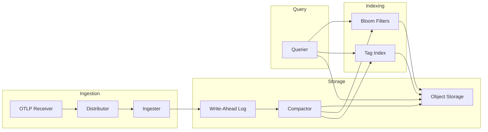
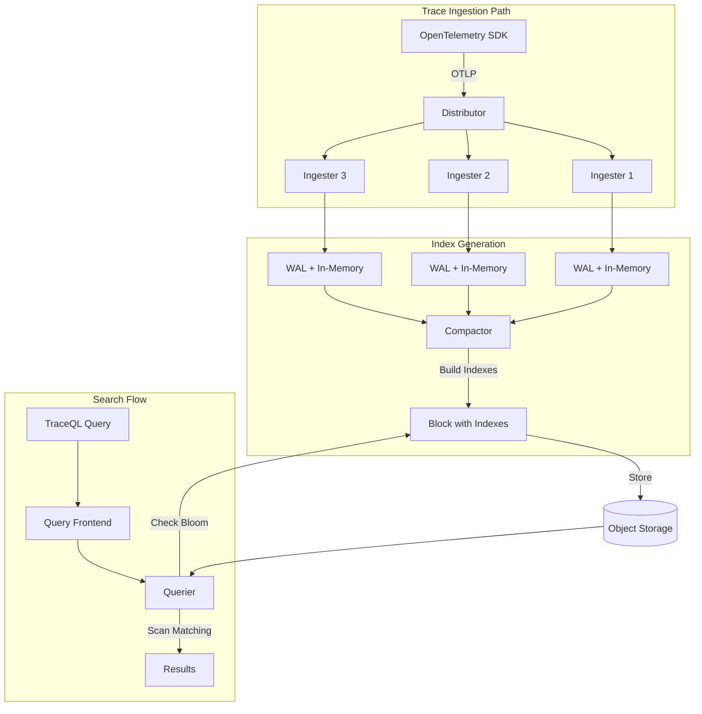

# How to Build Tempo Search Tags

Author: [nawazdhandala](https://github.com/nawazdhandala)

Tags: Tempo, Tracing, Search, Observability

Description: A practical guide to configuring search tags in Grafana Tempo for fast, efficient trace discovery and debugging.

---

Finding the right trace in a sea of telemetry data can feel like searching for a needle in a haystack. Grafana Tempo's Parquet-based blocks make every span attribute searchable, and dedicated attribute columns make the most-queried tags dramatically faster. Instead of scanning every column for a tag stored in a generic key-value list, queries on dedicated columns read a single column from object storage.

This guide walks through configuring dedicated attribute columns, choosing which tags to dedicate, and writing TraceQL queries that actually perform well in production.

---

## Table of Contents

1. What Are Search Tags
2. How Tag Indexing Works
3. Architecture Overview
4. Configuring Search Tags
5. Tag Selection Strategy
6. TraceQL Query Examples
7. Search Optimization Tips
8. Common Pitfalls
9. Monitoring Tag Performance
10. Putting It Together

---

## 1. What Are Search Tags

In Tempo, every span attribute is searchable through TraceQL because blocks are stored in the columnar Parquet format. By default, custom attributes live inside a generic key-value list column, so a query has to read that list across many spans. Dedicated attribute columns promote selected attributes to their own column in the Parquet file, which is what most teams mean colloquially by "search tags."

| Concept | Description |
|---------|-------------|
| Dedicated Column | An attribute promoted to its own Parquet column for faster queries |
| Intrinsic Field | Built-in fields Tempo always exposes (span:status, span:duration, span:name) |
| Resource Attribute | Tags describing the service (service.name, deployment.environment) |
| Span Attribute | Tags on individual spans (http.method, db.system) |
| Bloom Filter | Per-block probabilistic structure used to skip blocks during ID lookups |

Intrinsic fields and well-known attributes (such as `service.name`) are already optimized. You configure additional resource and span attributes as dedicated columns based on your query patterns.

---

## 2. How Tag Indexing Works

When Tempo ingests traces, it writes Parquet blocks that contain bloom filters and dedicated columns. The flow looks like this:

1. Spans arrive via OTLP or other protocols
2. Distributor validates and forwards to ingesters
3. Ingesters buffer spans in memory and a write-ahead log
4. Ingesters flush Parquet blocks to object storage; the compactor merges them
5. Queriers read column statistics and bloom filters to skip irrelevant blocks before scanning


```mermaid
flowchart LR
    subgraph Ingestion
        A[OTLP Receiver] --> B[Distributor]
        B --> C[Ingester]
    end

    subgraph Storage
        C --> D[Write-Ahead Log]
        D --> E[Compactor]
        E --> F[Object Storage]
    end

    subgraph Indexing
        E --> G[Bloom Filters]
        E --> H[Tag Index]
        G --> F
        H --> F
    end

    subgraph Query
        I[Querier] --> G
        I --> H
        I --> F
    end
```

The bloom filter answers: "Does this block possibly contain a given trace ID?" If yes, Tempo fetches that block; if no, it skips entirely. For attribute filtering, dedicated columns let the querier read just the column it needs instead of unpacking the generic attribute list.

---

## 3. Architecture Overview

Understanding where tags get indexed helps you debug performance issues.


```mermaid
flowchart TB
    subgraph "Trace Ingestion Path"
        OT[OpenTelemetry SDK] --> |OTLP| DIST[Distributor]
        DIST --> ING1[Ingester 1]
        DIST --> ING2[Ingester 2]
        DIST --> ING3[Ingester 3]
    end

    subgraph "Index Generation"
        ING1 --> WAL1[WAL + In-Memory]
        ING2 --> WAL2[WAL + In-Memory]
        ING3 --> WAL3[WAL + In-Memory]
        WAL1 --> COMP[Compactor]
        WAL2 --> COMP
        WAL3 --> COMP
        COMP --> |Build Indexes| BLOCK[Block with Indexes]
    end

    subgraph "Search Flow"
        Q[TraceQL Query] --> QF[Query Frontend]
        QF --> QR[Querier]
        QR --> |Check Bloom| BLOCK
        QR --> |Scan Matching| RESULT[Results]
    end

    BLOCK --> |Store| S3[(Object Storage)]
    S3 --> QR
```

Key insight: tag indexes live inside each block in object storage. Queriers download bloom filters first, then fetch only relevant blocks.

---

## 4. Configuring Search Tags

Tempo configuration happens in the `tempo.yaml` file. Dedicated attribute columns are configured under `overrides` as `parquet_dedicated_columns`. Each entry specifies a `name`, a `type` (`string` or `int`), and a `scope` (`resource`, `span`, or `event`). On `vParquet4` you can dedicate up to 10 string columns per scope; `vParquet5` raises this to 20 string columns plus 5 integer columns per scope.

Here is a production-ready example:

```yaml
# tempo.yaml

overrides:
  defaults:
    ingestion:
      # Rate limits
      rate_limit_bytes: 15000000
      burst_size_bytes: 20000000

    # Dedicated attribute columns for fast filtering
    parquet_dedicated_columns:
      # Resource-scoped attributes
      - name: service.namespace
        type: string
        scope: resource
      - name: deployment.environment
        type: string
        scope: resource
      - name: k8s.namespace.name
        type: string
        scope: resource
      - name: k8s.deployment.name
        type: string
        scope: resource
      - name: cloud.region
        type: string
        scope: resource
      - name: host.name
        type: string
        scope: resource

      # Span-scoped attributes
      - name: http.route
        type: string
        scope: span
      - name: http.url
        type: string
        scope: span
      - name: db.system
        type: string
        scope: span
      - name: db.name
        type: string
        scope: span
      - name: db.operation
        type: string
        scope: span
      - name: rpc.method
        type: string
        scope: span
      - name: rpc.service
        type: string
        scope: span
      - name: messaging.system
        type: string
        scope: span
      - name: messaging.destination
        type: string
        scope: span
      - name: order.id
        type: string
        scope: span

storage:
  trace:
    backend: s3
    s3:
      bucket: tempo-traces
      endpoint: s3.amazonaws.com
      region: us-east-1

    block:
      # Bloom filter configuration
      bloom_filter_false_positive: 0.01
      bloom_filter_shard_size_bytes: 102400

      # Parquet block format (vParquet4 is the current default; vParquet5 is also available)
      version: vParquet4

    wal:
      path: /var/tempo/wal

    local:
      path: /var/tempo/blocks

compactor:
  compaction:
    # How often to run compaction
    compaction_window: 1h
    # Max block size after compaction
    max_block_bytes: 107374182400  # 100GB
    # Retention
    block_retention: 336h  # 14 days

querier:
  # Search configuration
  search:
    # Maximum duration for search queries
    query_timeout: 30s
```

Note that `service.name`, `http.method`, `http.status_code`, and span status are already first-class fields in the Parquet schema, so they do not need to be configured as dedicated columns.

### Per-Tenant Overrides

For multi-tenant deployments, configure dedicated columns per tenant. Tenant-specific overrides live in a separate file and take precedence over the defaults:

```yaml
overrides:
  # Default for all tenants
  defaults:
    parquet_dedicated_columns:
      - name: deployment.environment
        type: string
        scope: resource

  # Specific tenant overrides
  per_tenant_override_config: /etc/tempo/overrides.yaml
```

```yaml
# overrides.yaml

overrides:
  tenant-production:
    parquet_dedicated_columns:
      - name: deployment.environment
        type: string
        scope: resource
      - name: k8s.namespace.name
        type: string
        scope: resource
      - name: http.route
        type: string
        scope: span
      - name: db.system
        type: string
        scope: span
      - name: order.id
        type: string
        scope: span

  tenant-staging:
    parquet_dedicated_columns:
      - name: deployment.environment
        type: string
        scope: resource
```

---

## 5. Tag Selection Strategy

Not every attribute should be indexed. More tags mean larger indexes, slower compaction, and higher storage costs.

### Good Candidates for Indexing

| Category | Tags | Why |
|----------|------|-----|
| Service Identity | service.name, service.namespace | Every query filters by service |
| Environment | deployment.environment, k8s.namespace.name | Separate prod from staging |
| HTTP | http.method, http.status_code, http.route | Debug API issues |
| Database | db.system, db.name, db.operation | Find slow queries |
| Business | order.id, user.id, transaction.id | Trace specific transactions |
| Errors | error, exception.type | Find failures fast |

### Bad Candidates for Indexing

| Category | Tags | Why |
|----------|------|-----|
| High Cardinality | request.id, trace.id, span.id | Unique per request, bloats index |
| Large Values | http.request.body, sql.query | Index size explodes |
| Rarely Queried | internal.debug.flag | Waste of index space |
| Frequently Changing | instance.id (in autoscaling) | Index churn |

### Cardinality Guidelines

```text
Low cardinality (< 100 values):     Always index
Medium cardinality (100-10000):     Index if frequently queried
High cardinality (> 10000):         Avoid indexing
```

Rule of thumb: if you can enumerate all possible values, it is safe to index.

---

## 6. TraceQL Query Examples

TraceQL is Tempo's query language. Queries against attributes promoted to dedicated columns return faster, but all attributes are queryable.

### Basic Tag Queries

```text
# Find all traces for a specific service
{ resource.service.name = "checkout-service" }

# Filter by HTTP method and status
{ span.http.method = "POST" && span.http.status_code >= 500 }

# Find traces in production environment
{ resource.deployment.environment = "production" }

# Combine resource and span attributes
{ resource.service.name = "api-gateway" && span.http.route = "/v1/orders" }
```

### Duration-Based Queries

```text
# Slow requests (over 2 seconds)
{ span.http.route = "/checkout" } | duration > 2s

# Very fast requests (under 10ms)
{ resource.service.name = "cache-service" } | duration < 10ms

# Latency range
{ span.db.system = "postgresql" } | duration >= 100ms && duration <= 500ms
```

### Error Queries

```text
# All errors
{ status = error }

# HTTP 5xx errors
{ span.http.status_code >= 500 }

# Database errors
{ span.db.system = "postgresql" && status = error }

# Specific exception type
{ span.exception.type = "ConnectionTimeout" }
```

### Business Logic Queries

```text
# Find traces for a specific order
{ span.order.id = "ord-12345" }

# User journey
{ span.user.id = "user-789" && resource.service.name = "checkout-service" }

# Payment failures
{ span.payment.status = "failed" && span.payment.provider = "stripe" }
```

### Aggregation Queries

TraceQL supports `count`, `avg`, `max`, `min`, and `sum` as aggregators, with optional `by()` grouping.

```text
# Count spans by service
{ } | count() by (resource.service.name)

# Average duration by endpoint
{ span.http.method = "GET" } | avg(duration) by (span.http.route)

# Count errors by service
{ span:status = error } | count() by (resource.service.name)
```

### Advanced Patterns

```text
# Find traces that hit both services
{ resource.service.name = "api-gateway" } && { resource.service.name = "database-service" }

# Traces with a descendant span in the backend service
{ resource.service.name = "frontend" } >> { resource.service.name = "backend" }

# Match on a specific attribute value (TraceQL requires a scoped field)
{ span.order.id = "order-12345" }
```

---

## 7. Search Optimization Tips

### Bloom Filter Tuning

The bloom filter false positive rate affects query performance:

```yaml
storage:
  trace:
    block:
      # Lower = fewer false positives, larger index
      bloom_filter_false_positive: 0.01  # 1% false positive rate

      # Shard size affects memory usage during queries
      bloom_filter_shard_size_bytes: 102400
```

| False Positive Rate | Index Size | Query Speed | Use Case |
|---------------------|------------|-------------|----------|
| 0.001 (0.1%) | Large | Fastest | High-value production |
| 0.01 (1%) | Medium | Fast | Standard production |
| 0.05 (5%) | Small | Moderate | Development |

### Query Frontend Caching

Enable caching for repeated queries:

```yaml
query_frontend:
  search:
    # Send search requests to the backend after this much data is in long-term storage
    query_backend_after: 15m

  # Result caching backend (configured under cache subsystem in recent versions)
  results_cache:
    backend: memcached
    memcached:
      addresses: "memcached:11211"
      timeout: 500ms
```

### Parallel Query Execution

Search parallelism is controlled at the query frontend, which splits a search into jobs that queriers run in parallel:

```yaml
query_frontend:
  search:
    # Number of jobs the frontend dispatches in parallel
    concurrent_jobs: 1000

    # Per-job target bytes
    target_bytes_per_job: 104857600  # 100MB

    # Result limits
    default_result_limit: 20
    max_result_limit: 0  # 0 = unlimited

querier:
  search:
    # Per-query timeout
    query_timeout: 30s
```

### Block Size Optimization

Smaller blocks mean faster queries but more objects in storage:

```yaml
compactor:
  compaction:
    # Smaller blocks = faster search, more S3 LIST calls
    max_block_bytes: 52428800  # 50MB

    # Larger blocks = slower search, fewer objects
    # max_block_bytes: 524288000  # 500MB
```

---

## 8. Common Pitfalls

### Pitfall 1: Dedicating Every Attribute

Problem: Developers promote every possible attribute to a dedicated column. `vParquet4` caps you at 10 string columns per scope, and even `vParquet5` (20 strings + 5 ints per scope) is finite, so wasted slots leave high-value attributes back in the generic key-value list.

```yaml
# BAD: PII risk, huge values, high cardinality
parquet_dedicated_columns:
  - name: http.request.header.authorization  # PII risk
    type: string
    scope: span
  - name: http.request.body                  # Huge values
    type: string
    scope: span
  - name: request.id                         # High cardinality
    type: string
    scope: span
```

Fix: Dedicate columns only for attributes you filter on frequently. Review usage periodically.

### Pitfall 2: Missing Service Name

Problem: Queries without `service.name` scan all services.

```text
# BAD: Scans everything
{ span.http.status_code = 500 }

# GOOD: Scoped to service
{ resource.service.name = "api" && span.http.status_code = 500 }
```

Fix: Always include `service.name` in queries when possible.

### Pitfall 3: Querying Non-Dedicated Attributes

Problem: Attributes not promoted to dedicated columns are still queryable, but the querier has to scan the generic attribute key-value list, which is much slower at scale.

```text
# If custom.business.metric does not have a dedicated column, this is slow
{ span.custom.business.metric = "important" }
```

Fix: Check your configuration before standing up dashboards. Promote heavily queried attributes to dedicated columns first.

### Pitfall 4: Cardinality Explosion

Problem: Promoting high-cardinality fields to dedicated columns bloats Parquet files and slows compaction.

```yaml
# BAD: user.id might have millions of values
parquet_dedicated_columns:
  - name: user.id
    type: string
    scope: span
```

Fix: For high-cardinality fields, query them as generic span attributes instead, or apply head/tail sampling at ingestion.

### Pitfall 5: Forgetting Resource vs Span

Problem: Confusing resource and span attribute namespaces.

```text
# WRONG: service.name is a resource attribute
{ span.service.name = "api" }

# RIGHT: Use resource prefix
{ resource.service.name = "api" }
```

Fix: Resource attributes describe the service. Span attributes describe the operation.

---

## 9. Monitoring Tag Performance

Track these metrics to ensure search stays fast:

### Key Metrics

```promql
# Query frontend request latency (p99 by route)
histogram_quantile(0.99,
  sum by (le, route) (rate(tempo_query_frontend_request_duration_seconds_bucket[5m]))
)

# Bytes inspected by search/trace queries per tenant
sum by (tenant, op) (rate(tempo_query_frontend_bytes_inspected_total[5m]))

# In-memory live trace bytes per ingester
sum by (tenant) (tempo_ingester_live_trace_bytes)

# Object storage backend errors
sum by (operation) (rate(tempodb_backend_request_duration_seconds_count{status_code!~"2.."}[5m]))
```

### Alerting Rules

```yaml
groups:
  - name: tempo-search
    rules:
      - alert: TempoSearchSlow
        expr: |
          histogram_quantile(0.99,
            sum by (le) (rate(tempo_query_frontend_request_duration_seconds_bucket{op="search"}[5m]))
          ) > 10
        for: 5m
        labels:
          severity: warning
        annotations:
          summary: "Tempo search p99 latency above 10 seconds"

      - alert: TempoSearchBytesInspectedHigh
        expr: |
          sum by (tenant) (rate(tempo_query_frontend_bytes_inspected_total{op="search"}[5m])) > 1e9
        for: 10m
        labels:
          severity: warning
        annotations:
          summary: "Tempo search inspecting more than 1 GB/s per tenant"
```

### Dashboard Queries

Build a dashboard with:

1. Search latency percentiles (p50, p95, p99)
2. Queries per second by tenant
3. Bytes inspected by query type
4. Live trace bytes per ingester
5. Backend request error rate

---

## 10. Putting It Together

Here is a complete workflow for rolling out search tags in production.

### Step 1: Audit Current Queries

List the queries your team runs most often. Check Grafana query history or ask developers.

```text
Common queries:
- Find errors in checkout service
- Trace specific order IDs
- Debug slow database calls
- Find payment failures
```

### Step 2: Map Queries to Tags

| Query Pattern | Required Tags |
|---------------|---------------|
| Errors by service | service.name, status (intrinsic) |
| Order lookup | order.id |
| Slow DB calls | db.system, db.name, duration (intrinsic) |
| Payment issues | payment.status, payment.provider |

### Step 3: Validate Cardinality

Before promoting an attribute to a dedicated column, check its cardinality. Use the Tempo API's tag values endpoint to enumerate distinct values:

```bash
# List values for a span-scoped attribute (TraceQL identifier syntax)
curl -G "http://tempo:3200/api/v2/search/tag/span.order.id/values"
```

Or sample span data from your OpenTelemetry Collector and count unique values.

### Step 4: Deploy Configuration

```yaml
overrides:
  defaults:
    parquet_dedicated_columns:
      - name: deployment.environment
        type: string
        scope: resource
      - name: db.system
        type: string
        scope: span
      - name: order.id
        type: string
        scope: span
      - name: payment.status
        type: string
        scope: span
```

### Step 5: Wait for Compaction

New indexes only appear after compaction runs. For existing data, you may need to wait for the compaction window (default: 1 hour).

### Step 6: Test Queries

Verify indexed queries are fast:

```text
# Should be fast (indexed)
{ resource.service.name = "checkout" && span.order.id = "ord-12345" }

# Check query timing in Grafana Explore
```

### Step 7: Monitor and Iterate

Watch bytes inspected and query latency. Drop unused dedicated columns. Add new ones as query patterns evolve.

---

## Summary

| What | How |
|------|-----|
| Promote attributes | Configure `parquet_dedicated_columns` under `overrides` in tempo.yaml |
| Choose tags wisely | Frequently queried, moderate-cardinality attributes |
| Write efficient queries | Always include service.name, use scoped attributes |
| Tune bloom filters | Balance false positive rate vs index size |
| Monitor performance | Track query latency, block scan counts, dedicated column usage |

Dedicated columns turn Tempo's Parquet blocks into a fast trace search engine. Configure them thoughtfully, monitor their impact, and your team will find the right traces in seconds instead of minutes.

---

**Related Reading:**

- [What are Traces and Spans in OpenTelemetry](https://oneuptime.com/blog/post/2025-08-27-traces-and-spans-in-opentelemetry/view)
- [Three Pillars of Observability: Logs, Metrics, Traces](https://oneuptime.com/blog/post/2025-08-20-three-pillars-of-observability-logs-metrics-traces/view)
- [How to Reduce Noise in OpenTelemetry](https://oneuptime.com/blog/post/2025-08-25-how-to-reduce-noise-in-opentelemetry/view)
