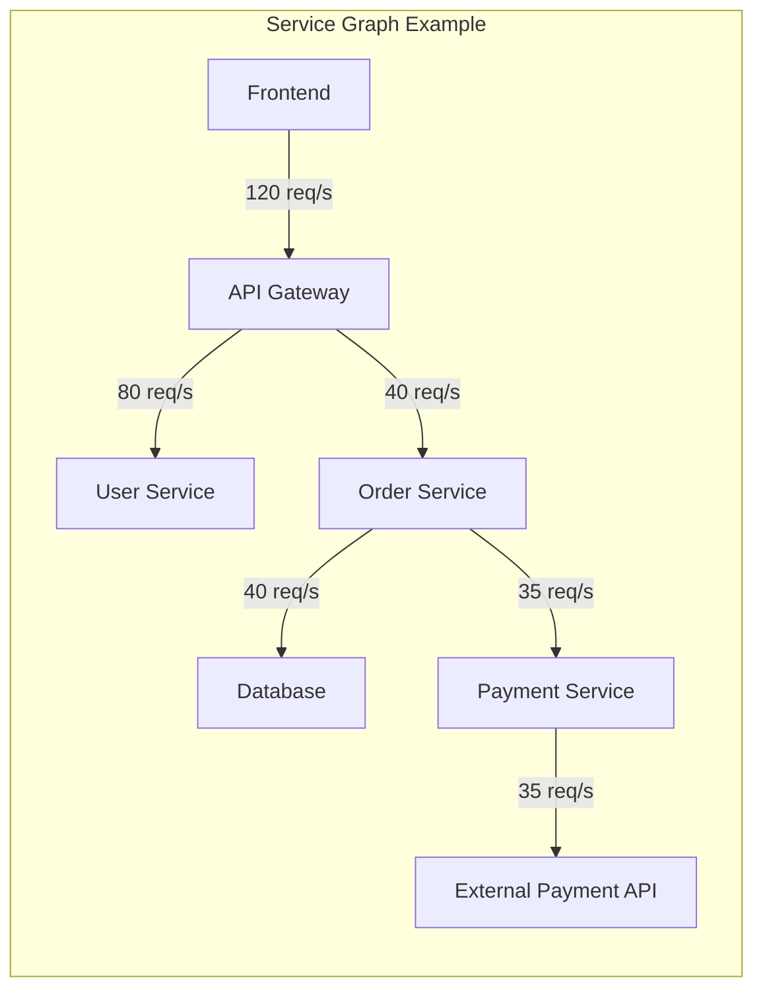
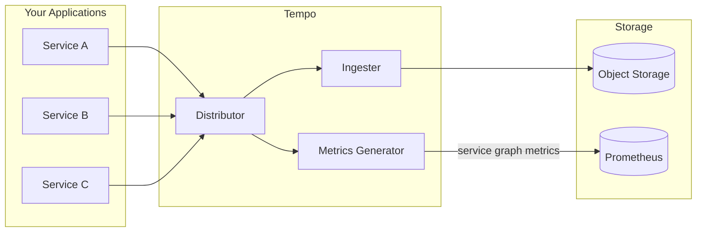

# How to Create Tempo Service Graph

Author: [nawazdhandala](https://github.com/nawazdhandala)

Tags: Tempo, Tracing, Service Graph, Observability

Description: A step-by-step guide to generating service graphs from distributed traces using Grafana Tempo's metrics-generator.

---

Distributed tracing shows you how requests flow through your system. But when you have dozens of services, reading individual traces gets tedious. What you really want is a map: which services talk to each other, how often, and how fast?

That is exactly what Tempo's service graph feature provides. It takes your trace data and generates metrics that describe the relationships between your services. You can then visualize these relationships as an interactive graph in Grafana.

This post walks through the complete setup: enabling the metrics-generator, understanding the generated metrics, and building a service graph visualization.

---

## Table of Contents

1. What is a Service Graph?
2. How Tempo Generates Service Graphs
3. Enabling the Metrics-Generator
4. Understanding Service Graph Metrics
5. Storing Metrics with Prometheus
6. Visualizing in Grafana
7. Filtering and Customizing
8. Performance Considerations
9. Troubleshooting Common Issues

---

## 1. What is a Service Graph?

A service graph is a visual representation of how your services communicate. Each node represents a service. Each edge represents a connection between two services (one calling the other).

Beyond just showing connections, service graphs typically include:

- **Request rate**: How many requests per second flow between services
- **Error rate**: What percentage of requests fail
- **Latency**: How long requests take (p50, p95, p99)

This gives you a quick health overview of your entire system without digging into individual traces.



---

## 2. How Tempo Generates Service Graphs

Tempo does not store service graphs directly. Instead, it uses a component called the **metrics-generator** to derive metrics from incoming traces in real-time.

Here is the flow:



The metrics-generator inspects spans as they arrive. When it sees a client span calling a server span, it records that relationship. Over time, this builds up a complete picture of your service topology.

Key points:

- Metrics are generated in real-time from live trace data
- The generator runs inside Tempo (not a separate component)
- Generated metrics follow Prometheus format
- You need a Prometheus-compatible store to query the metrics

---

## 3. Enabling the Metrics-Generator

The metrics-generator is disabled by default. You enable it in your Tempo configuration.

### Basic Configuration

```yaml
# tempo.yaml
metrics_generator:
  # Enable the metrics-generator
  registry:
    external_labels:
      source: tempo
      cluster: production
  storage:
    path: /var/tempo/generator/wal
    remote_write:
      - url: http://prometheus:9090/api/v1/write
        send_exemplars: true
  traces_storage:
    path: /var/tempo/generator/traces
  processor:
    service_graphs:
      # Enable service graph generation
      enabled: true
      # How long to wait for matching client/server spans
      wait: 10s
      # Maximum number of edges to track
      max_items: 10000
      # Additional dimensions to include in metrics
      dimensions:
        - http.method
        - http.status_code
      # Histogram buckets for latency
      histogram_buckets: [0.1, 0.2, 0.5, 1, 2, 5, 10]
      # Enable virtual nodes for uninstrumented services
      enable_virtual_node_label: true
```

### Full Production Configuration

```yaml
# tempo.yaml
server:
  http_listen_port: 3200

distributor:
  receivers:
    otlp:
      protocols:
        grpc:
          endpoint: 0.0.0.0:4317
        http:
          endpoint: 0.0.0.0:4318

ingester:
  lifecycler:
    ring:
      replication_factor: 1
  trace_idle_period: 10s
  max_block_bytes: 1000000
  max_block_duration: 5m

compactor:
  compaction:
    block_retention: 48h

storage:
  trace:
    backend: s3
    s3:
      bucket: tempo-traces
      endpoint: minio:9000
      access_key: tempo
      secret_key: supersecret
      insecure: true

metrics_generator:
  registry:
    external_labels:
      source: tempo
      cluster: production
    collection_interval: 15s
  storage:
    path: /var/tempo/generator/wal
    wal_flush_frequency: 1m
    remote_write:
      - url: http://prometheus:9090/api/v1/write
        send_exemplars: true
        headers:
          X-Scope-OrgID: tenant1
  traces_storage:
    path: /var/tempo/generator/traces
  processor:
    service_graphs:
      enabled: true
      wait: 10s
      max_items: 10000
      workers: 10
      dimensions:
        - http.method
        - http.status_code
        - db.system
      histogram_buckets: [0.01, 0.02, 0.05, 0.1, 0.2, 0.5, 1, 2, 5, 10]
      enable_virtual_node_label: true
    span_metrics:
      enabled: true
      dimensions:
        - service.name
        - http.method
        - http.status_code
      histogram_buckets: [0.01, 0.02, 0.05, 0.1, 0.2, 0.5, 1, 2, 5, 10]

overrides:
  defaults:
    metrics_generator:
      processors:
        - service-graphs
        - span-metrics
```

### Kubernetes Helm Values

If you are deploying Tempo via Helm, here is the equivalent configuration:

```yaml
# values.yaml
tempo:
  metricsGenerator:
    enabled: true
    remoteWriteUrl: http://prometheus:9090/api/v1/write
    processor:
      service_graphs:
        enabled: true
        wait: 10s
        max_items: 10000
        dimensions:
          - http.method
          - http.status_code
      span_metrics:
        enabled: true
```

---

## 4. Understanding Service Graph Metrics

The metrics-generator produces several metrics that describe service relationships.

### Edge Metrics

These metrics describe the connections between services:

| Metric | Description |
|--------|-------------|
| `traces_service_graph_request_total` | Total requests between services |
| `traces_service_graph_request_failed_total` | Failed requests between services |
| `traces_service_graph_request_server_seconds` | Server-side latency histogram |
| `traces_service_graph_request_client_seconds` | Client-side latency histogram |
| `traces_service_graph_unpaired_spans_total` | Spans without matching client/server |
| `traces_service_graph_dropped_spans_total` | Spans dropped due to max_items limit |

### Labels

Each metric includes labels that identify the edge:

| Label | Description |
|-------|-------------|
| `client` | Name of the calling service |
| `server` | Name of the called service |
| `connection_type` | Type of connection (virtual_node if uninstrumented) |

If you added custom dimensions, those appear as additional labels.

### Example Queries

Request rate between all services:

```promql
sum by (client, server) (
  rate(traces_service_graph_request_total[5m])
)
```

Error rate for a specific service:

```promql
sum by (client) (
  rate(traces_service_graph_request_failed_total{server="payment-service"}[5m])
) /
sum by (client) (
  rate(traces_service_graph_request_total{server="payment-service"}[5m])
)
```

P95 latency for all edges:

```promql
histogram_quantile(0.95,
  sum by (client, server, le) (
    rate(traces_service_graph_request_server_seconds_bucket[5m])
  )
)
```

Services calling a specific database:

```promql
sum by (client) (
  rate(traces_service_graph_request_total{server="postgres", db_system="postgresql"}[5m])
)
```

---

## 5. Storing Metrics with Prometheus

The metrics-generator writes metrics via Prometheus remote write. Your Prometheus instance needs to accept remote write requests.

### Prometheus Configuration

```yaml
# prometheus.yml
global:
  scrape_interval: 15s
  evaluation_interval: 15s

remote_write:
  # If using Prometheus as intermediate, forward to long-term storage
  - url: http://mimir:9009/api/v1/push

# Enable remote write receiver
# (requires --web.enable-remote-write-receiver flag)
```

Start Prometheus with the remote write receiver enabled:

```bash
prometheus --config.file=prometheus.yml --web.enable-remote-write-receiver
```

### Using Mimir or Cortex

For production, you might use Grafana Mimir or Cortex instead of vanilla Prometheus:

```yaml
# tempo.yaml
metrics_generator:
  storage:
    remote_write:
      - url: http://mimir:9009/api/v1/push
        headers:
          X-Scope-OrgID: my-tenant
```

---

## 6. Visualizing in Grafana

Grafana has built-in support for service graphs through the Node Graph panel.

### Prerequisites

1. Tempo data source configured in Grafana
2. Prometheus data source with service graph metrics
3. Link the Prometheus data source to Tempo

### Configuring the Tempo Data Source

In Grafana, go to Configuration > Data Sources > Tempo:

```
Service Graph:
  Data source: Prometheus

Additional Settings:
  Enable Node Graph: true
```

### Using the Explore View

1. Open Grafana Explore
2. Select your Tempo data source
3. Click "Service Graph" tab
4. The graph appears automatically

You can click on nodes or edges to:
- See detailed metrics
- Jump to related traces
- Filter the graph

### Building a Dashboard

Create a panel with the Node Graph visualization:

```json
{
  "type": "nodeGraph",
  "title": "Service Graph",
  "datasource": {
    "type": "tempo",
    "uid": "tempo"
  },
  "targets": [
    {
      "queryType": "serviceMap"
    }
  ],
  "options": {
    "nodes": {
      "mainStat": "rate",
      "secondaryStat": "errorRate",
      "arc1": "successRate",
      "arc2": "errorRate"
    },
    "edges": {
      "mainStat": "rate",
      "secondaryStat": "responseTime"
    }
  }
}
```

### Custom Grafana Dashboard Queries

You can also build custom visualizations using direct Prometheus queries.

Request rate heatmap:

```promql
sum by (client, server) (
  rate(traces_service_graph_request_total[5m])
)
```

Error rate table:

```promql
(
  sum by (client, server) (rate(traces_service_graph_request_failed_total[5m]))
  /
  sum by (client, server) (rate(traces_service_graph_request_total[5m]))
) * 100
```

---

## 7. Filtering and Customizing

### Adding Custom Dimensions

Include additional span attributes in your metrics:

```yaml
metrics_generator:
  processor:
    service_graphs:
      dimensions:
        - http.method
        - http.status_code
        - deployment.environment
        - k8s.namespace.name
```

This lets you filter the service graph by environment or namespace:

```promql
sum by (client, server) (
  rate(traces_service_graph_request_total{k8s_namespace_name="production"}[5m])
)
```

### Virtual Nodes

When a service calls an external API or database that is not instrumented, Tempo can create a "virtual node" to represent it:

```yaml
metrics_generator:
  processor:
    service_graphs:
      enable_virtual_node_label: true
```

Virtual nodes appear in your graph even though they do not send traces. They are identified by the `connection_type="virtual_node"` label.

### Peer Attributes

Configure which span attributes identify the peer service:

```yaml
metrics_generator:
  processor:
    service_graphs:
      peer_attributes:
        - peer.service
        - server.address
        - db.name
        - messaging.destination.name
```

---

## 8. Performance Considerations

The metrics-generator adds CPU and memory overhead to Tempo. Here is how to tune it:

### Memory

Each tracked edge consumes memory. Limit the total:

```yaml
metrics_generator:
  processor:
    service_graphs:
      max_items: 10000  # Reduce if memory constrained
      wait: 10s         # Reduce to free memory faster
```

### Workers

Increase workers for higher throughput:

```yaml
metrics_generator:
  processor:
    service_graphs:
      workers: 10  # Default is typically sufficient
```

### Cardinality

Custom dimensions increase metric cardinality. Each unique combination of labels creates a new time series. Be selective about which dimensions you add.

Bad (high cardinality):

```yaml
dimensions:
  - user.id           # Unique per user
  - http.url          # Unique per endpoint
  - trace.id          # Unique per trace
```

Good (low cardinality):

```yaml
dimensions:
  - http.method       # GET, POST, PUT, DELETE
  - http.status_code  # 200, 400, 500, etc.
  - deployment.environment  # dev, staging, prod
```

### Histogram Buckets

More buckets means more time series. Choose buckets that match your latency distribution:

```yaml
histogram_buckets: [0.01, 0.05, 0.1, 0.25, 0.5, 1, 2.5, 5, 10]
```

---

## 9. Troubleshooting Common Issues

### No Service Graph Data

Check these in order:

1. **Metrics-generator enabled?**
   ```bash
   curl http://tempo:3200/metrics | grep service_graph
   ```

2. **Traces arriving?**
   ```bash
   curl http://tempo:3200/status/buildinfo
   ```

3. **Remote write working?**
   Check Tempo logs for remote write errors:
   ```bash
   kubectl logs -l app=tempo | grep remote_write
   ```

4. **Prometheus receiving data?**
   ```promql
   traces_service_graph_request_total
   ```

### Missing Edges

Edges require both client and server spans to be matched:

- Ensure both services are instrumented
- Check span kind is set correctly (CLIENT vs SERVER)
- Increase the `wait` duration if spans arrive out of order
- Enable virtual nodes for uninstrumented services

### High Memory Usage

The metrics-generator is using too much memory:

- Reduce `max_items`
- Reduce `wait` duration
- Remove unnecessary dimensions
- Reduce histogram bucket count

### Dropped Spans

Check the dropped spans metric:

```promql
rate(traces_service_graph_dropped_spans_total[5m])
```

If spans are being dropped, increase `max_items` or add more resources.

---

## Summary

| What You Want | How to Get It |
|---------------|---------------|
| Enable service graphs | Set `processor.service_graphs.enabled: true` |
| Store metrics | Configure `remote_write` to Prometheus |
| Visualize | Use Grafana Node Graph panel with Tempo |
| Add detail | Configure custom `dimensions` |
| Handle uninstrumented services | Enable `virtual_node_label` |
| Control costs | Limit `max_items` and cardinality |

Service graphs turn your trace data into a live system map. They help you understand dependencies, spot bottlenecks, and identify failing services without reading individual traces.

Start with the basic configuration, verify metrics are flowing, then add dimensions and customize as needed.

---

**Related Reading:**

- [Traces and Spans in OpenTelemetry](https://oneuptime.com/blog/post/2025-08-27-traces-and-spans-in-opentelemetry/view)
- [What is OpenTelemetry Collector and Why Use One](https://oneuptime.com/blog/post/2025-09-18-what-is-opentelemetry-collector-and-why-use-one/view)
- [How to Reduce Noise in OpenTelemetry](https://oneuptime.com/blog/post/2025-08-25-how-to-reduce-noise-in-opentelemetry/view)
